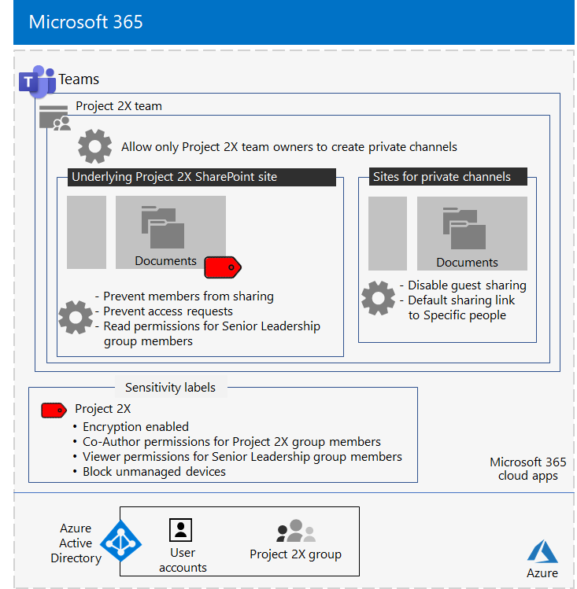

# Equipo aislado para un proyecto secreto de Contoso Corporation

Después de un ejecutivo fuera del sitio, el director ejecutivo de Contoso ordenó el desarrollo de un nuevo conjunto de productos y servicios que podría duplicar las ganancias de Contoso en los próximos cinco años. El proyecto secreto para desarrollar el plan de negocio, ingeniería y mercado se nombró **Project 2X** y se reclutó personal clave en toda la compañía. 

Las escalas de tiempo para la investigación y el desarrollo eran estrechas, lo que significaba que la colaboración debía ser eficaz y proporcionar reuniones seguras, conversaciones en curso y almacenamiento de archivos.

Las entregas resultantes para Project 2X fueron planes de negocio, especificaciones de producto e ingeniería, y materiales y programaciones de marketing en forma de archivos word, Excel y PowerPoint. 

Debido a su naturaleza confidencial, el acceso a estos archivos era:

- Restringido a Project miembros del equipo 2X y altos directivos.
- Cifrados y protegidos con permisos para permitir el acceso solo Project miembros del equipo 2X y altos directivos, incluso si los archivos se distribuyeron fuera de sus carpetas protegidas.

El personal de TI de Contoso usó un [equipo con](secure-teams-security-isolation.md) aislamiento de seguridad Project 2X y estos pasos.

## Paso 1: Crear un equipo privado

En primer lugar, para proteger el acceso al sitio SharePoint subyacente para el equipo, los administradores de TI de Contoso configuraron las directivas SharePoint [de acceso](../security/office-365-security/sharepoint-file-access-policies.md).

A continuación, un administrador de TI de Contoso creó un nuevo equipo privado denominado Project 2X y agregó las cuentas de usuario de Project personal 2X como miembros. También configuraron el equipo para que solo Project propietarios de equipos 2X puedan crear canales privados.

Para obtener los detalles de configuración, vea [Create a private team](secure-teams-security-isolation.md#create-a-private-team).

## Paso 2: Crear una etiqueta de confidencialidad para el equipo Project 2X

Los administradores de Contoso crearon una nueva etiqueta de **confidencialidad Project 2X** que:

- Cifrado habilitado.
- Permisos Co-Author permisos para el Project 2X Microsoft 365 grupo.
- Permisos de visor permitidos para el grupo de liderazgo sénior.
- Acceso bloqueado a dispositivos no administrados.

Los archivos de **la sección** Documentos del Project sitio SharePoint 2X estaban protegidos por:

- Permisos de sitio, que solo permiten permisos completos a los miembros del grupo Project 2X Microsoft 365 y permisos de lectura para el grupo de liderazgo sénior.
- La Project de confidencialidad 2X, con cifrado y permisos que viajan con el archivo si se mueve o copia del sitio.

Para obtener los detalles de configuración, vea [Create a sensitivity label](secure-teams-security-isolation.md#create-a-sensitivity-label).

## Paso 3: Configurar el sitio SharePoint subyacente

En primer lugar, para proteger el acceso al sitio SharePoint subyacente para el equipo, los administradores de TI de Contoso configuraron las directivas SharePoint [de acceso](../security/office-365-security/sharepoint-file-access-policies.md).

A continuación, configuraron opciones de permisos adicionales para el sitio:

- Para evitar Project miembros del grupo 2X compartan el acceso al sitio. Para obtener los detalles de configuración, [vea SharePoint configuración de un equipo con aislamiento de seguridad](secure-teams-security-isolation.md#sharepoint-settings).
- Para permisos de lectura para el grupo de liderazgo sénior.

A continuación, configuraron opciones de permisos adicionales para el sitio para evitar que Project miembros del grupo 2X compartan el acceso al sitio. 

Cuando se crearon canales privados para el Project 2X, el propietario del grupo deshabilitó el uso compartido de invitados y estableció el vínculo de uso compartido predeterminado en **el valor Personas** específicas.

Esta es la configuración resultante del equipo Project 2X con aislamiento de seguridad.

 ## Paso 4: Formación Project miembros del equipo 2X

El personal de seguridad de Contoso entrenó a Project miembros del equipo 2X en un curso obligatorio que les atraía:

- Cómo acceder al nuevo equipo Project 2X, usar reuniones y chats y cómo colaborar en archivos de equipo.
- Cómo crear nuevos archivos en el equipo y cargar nuevos archivos creados localmente.
- Cómo etiquetar archivos con la Project de confidencialidad 2X.
- Una demostración de cómo la Project 2X protege un archivo incluso cuando deja el equipo.

El resultado final fue un entorno seguro en el que Project miembros del equipo 2X colaboraban en un entorno seguro para chats, reuniones y archivos.

Este es un ejemplo de un archivo almacenado en el sitio Project 2X con la Project de confidencialidad 2X asignada.

En un par de instancias, Project miembros del equipo 2X descargaron archivos protegidos por la etiqueta Project 2X en una unidad local para el trabajo sin conexión. 

Sin embargo, después de que se les pidan credenciales al abrirlos, se dieron cuenta de su error y los eliminaron.

Debido al entorno de colaboración de Teams y las características de seguridad de Microsoft 365, los detalles de Project 2X se mantuvieron en secreto durante la duración del proyecto. Contoso anunció sus planes y está en el proceso de implementar los nuevos productos y servicios para el deleite de sus clientes e inversores y el enojo de sus competidores.

## Paso siguiente

[Implementar un equipo con aislamiento de seguridad](secure-teams-security-isolation.md) en la organización.

