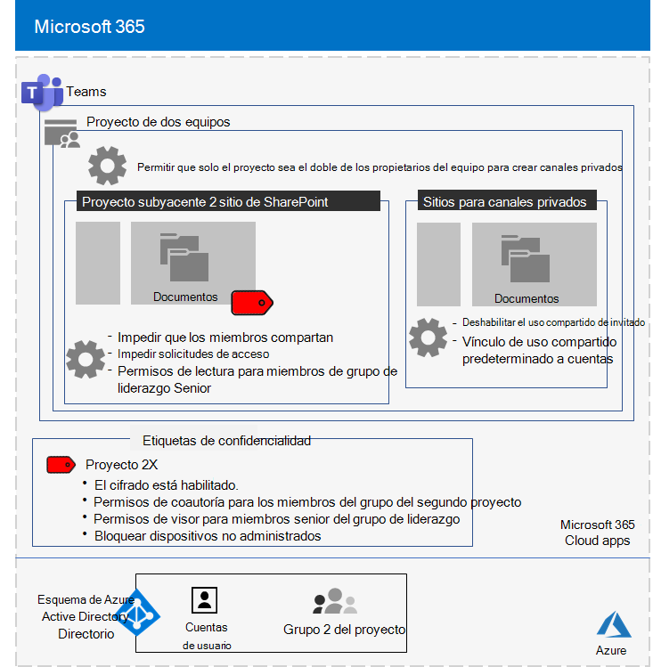
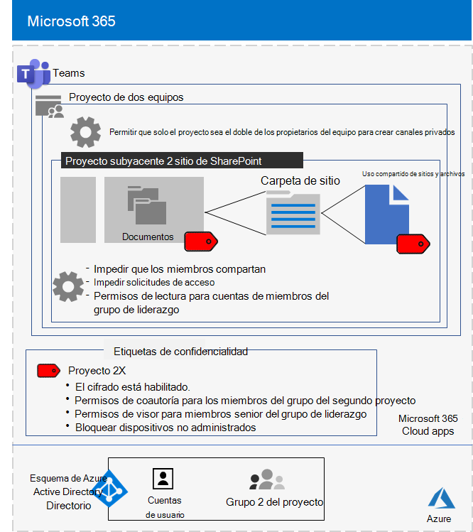

# Equipo aislado para un proyecto principal de la compañía contoso

Después de una ejecutiva fuera del sitio, el CEO de Contoso solicitó el desarrollo de un nuevo conjunto de productos y servicios que podían duplicar las ganancias de Contoso en los próximos cinco años. El proyecto principal para desarrollar el plan empresarial, de ingeniería y de mercado se llamaba **proyecto 2x** y el personal clave en toda la compañía ha sido reclutado. 

Las escalas de tiempo para la investigación y el desarrollo han sido estrictas, lo que significaba que la colaboración tenía que ser eficaz y proporcionar reuniones seguras, conversaciones en curso y almacenamiento de archivos.

Las entregas resultantes del proyecto 2 fueron los planes de negocio, las especificaciones de ingeniería y productos, y los materiales y programaciones de marketing en forma de archivos de Word, Excel y PowerPoint. 

Debido a su naturaleza confidencial, el acceso a estos archivos ha sido:

- Restringido al proyecto el doble de miembros del equipo y al liderazgo Senior.
- Cifrado y protegido con permisos para permitir el acceso únicamente al proyecto el doble de miembros del equipo y al liderazgo Senior, incluso si los archivos se distribuyeron fuera de sus carpetas protegidas.

El personal de TI de Contoso usó un [equipo con aislamiento de seguridad](secure-teams-security-isolation.md) para el proyecto 2x y estos pasos.

## Paso 1: creado un equipo privado

En primer lugar, para proteger el acceso al sitio de SharePoint subyacente para el equipo, los administradores de TI de Contoso configuraron las [directivas de acceso de SharePoint recomendadas](../enterprise/sharepoint-file-access-policies.md).

A continuación, un administrador de Contoso ha creado un nuevo equipo privado denominado proyecto 2X y ha agregado las cuentas de usuario del proyecto el doble de personal como miembros. También configuraron el equipo para que solo los propietarios del equipo del proyecto más 2X puedan crear canales privados.

Para obtener información detallada sobre la configuración, vea [crear un equipo privado](secure-teams-security-isolation.md#create-a-private-team).

## Paso 2: se creó una etiqueta de confidencialidad para el equipo del proyecto de dos equipos

Los administradores de Contoso crearon una nueva etiqueta de confidencialidad denominada **proyecto 2x** que:

- Cifrado habilitado.
- Permisos de co-autoría permitidos para el grupo de 2 proyectos de Microsoft 365.
- Permisos de visor permitidos para el grupo de liderazgo Senior.
- Acceso bloqueado a dispositivos no administrados.

Los archivos de la sección **documentos** del proyecto subyacente 2x del sitio de SharePoint estaban protegidos por:

- Los permisos del sitio, que solo permiten permisos totales a miembros del proyecto con un 365 doble de permisos de grupo y lectura para el grupo de liderazgo Senior.
- La etiqueta de sensibilidad proyecto 2X, con cifrado y permisos que viajan con el archivo si se mueven o se copian del sitio.

Para obtener información detallada sobre la configuración, vea [crear una etiqueta de confidencialidad](secure-teams-security-isolation.md#create-a-sensitivity-label).

## Paso 3: configurar el sitio de SharePoint subyacente

En primer lugar, para proteger el acceso al sitio de SharePoint subyacente para el equipo, los administradores de TI de Contoso configuraron las [directivas de acceso de SharePoint recomendadas](../enterprise/sharepoint-file-access-policies.md).

A continuación, se configuraron parámetros de permisos adicionales para el sitio:

- Para evitar que los miembros del grupo 2X del proyecto compartan el acceso al sitio. Para obtener información detallada sobre la configuración, vea [SharePoint Settings for a Team with Security Isolation](secure-teams-security-isolation.md#sharepoint-settings).
- Para permisos de lectura para el grupo de liderazgo Senior.

A continuación, configuraron opciones de permisos adicionales para el sitio con el fin de evitar que los miembros del grupo 2X del proyecto compartan el acceso al sitio. 

Como se crearon los canales privados para el proyecto 2X, el propietario del grupo deshabilitó el uso compartido de invitado y estableció el vínculo compartir predeterminado con el valor **específico de personas** .

A continuación se muestra la configuración resultante del equipo del proyecto de 2X con aislamiento de seguridad.

 ## Paso 4: miembros del equipo con experiencia en el 2X del proyecto

El personal de seguridad de Contoso ha entrenado en el proyecto el doble de miembros del equipo en un curso obligatorio que les ha ejecutado:

- Cómo obtener acceso al nuevo proyecto el equipo al doble, usar reuniones y chats y cómo colaborar en archivos de equipo.
- Cómo crear nuevos archivos en el equipo y cargar nuevos archivos creados de forma local.
- Cómo etiquetar archivos con la etiqueta de confidencialidad del proyecto de dos.
- Una demostración de cómo la etiqueta del proyecto 2X protege un archivo incluso cuando éste sale del equipo.

El resultado final fue un entorno seguro en el que el proyecto 2X de miembros del equipo colaboraron en un entorno seguro para chats, reuniones y archivos.

A continuación, se muestra un ejemplo de un archivo almacenado en el sitio del espacio de nombre 2 subyacente con la etiqueta de sensibilidad espacio de proyecto 2 asignada.

En un par de instancias, Project 2X los miembros del equipo descargaron archivos protegidos por la etiqueta del proyecto 2X en una unidad local para trabajar sin conexión. 

Sin embargo, después de que se soliciten las credenciales al abrirlas, se han dado cuenta de su error y se han eliminado.

Debido al entorno de colaboración de Microsoft Teams y las características de seguridad de Microsoft 365, los detalles del proyecto 2X se mantuvieron en secreto mientras dure el proyecto. Contoso anunció sus planes y se encuentra en el proceso de implementar los nuevos productos y servicios a la alegría de sus clientes e inversionistas y la Chagrin de sus competidores.

## Paso siguiente

[Implemente un equipo con aislamiento de seguridad](secure-teams-security-isolation.md) en su organización.

