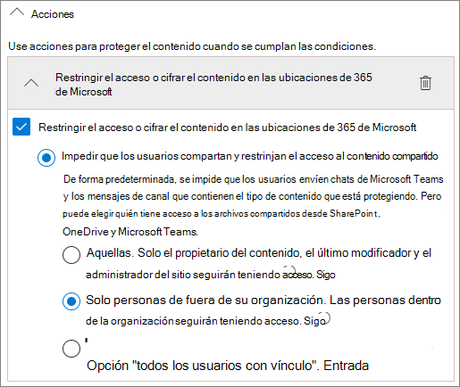

# Crear un entorno seguro de uso compartido para invitadosCreate a secure guest sharing environment

En este artículo, analizaremos una amplia variedad de opciones para crear un entorno seguro de uso compartido para invitados en Microsoft 365.In this article, we'll walk through a variety of options for creating a secure guest sharing environment in Microsoft 365. Se trata de ejemplos para dar una idea de las opciones disponibles.These are examples to give you an idea of the options available. Puede usar estos procedimientos en distintas combinaciones para satisfacer las necesidades de seguridad y cumplimiento de su organización.You can use these procedures in different combinations to meet the security and compliance needs of your organization.

En este artículo se incluyen:This article includes:

- Configurar autenticación multifactor para invitadosSetting up multi-factor authentication for guests.
- Configurar condiciones de uso para invitados.Setting up a terms of use for guests.
- Establecer revisiones trimestrales de acceso de invitados para validar periódicamente si los invitados continúan necesitando permisos en los equipos y en los sitios.Setting up quarterly guest access reviews to periodically validate whether guests continue to need permissions to teams and sites.
- Restringir el acceso de invitados a solo web para dispositivos no administrados.Restricting guests to web-only access for unmanaged devices.
- Configurar una directiva de tiempo de espera de la sesión para garantizar la autenticación de los invitados diariamente.Configuring a session timeout policy to ensure guests authenticate daily.
- Creación de un tipo de información confidencial para un proyecto altamente confidencial.Creating a sensitive information type for a highly sensitive project.
- Asignación automática de una etiqueta de confidencialidad a los documentos que contengan un tipo de información confidencial.Automatically assigning a sensitivity label to documents that contain a sensitive information type.
- Retirar automáticamente el acceso de invitado a los archivos con una etiqueta de confidencialidad.Automatically removing guest access from files with a sensitivity label.

Algunas de las opciones analizadas en este artículo requieren que los invitados tengan una cuenta de Azure Active Directory.Some of the options discussed in this article require guests to have an account in Azure Active Directory. Para asegurarse de que los invitados estén en el directorio cuando comparta archivos y carpetas con ellos, use la [Integración de SharePoint y OneDrive con la vista previa de Azure AD B2B](https://docs.microsoft.com/sharepoint/sharepoint-azureb2b-integration-preview).To ensure that guests are included in the directory when you share files and folders with them, use the [SharePoint and OneDrive integration with Azure AD B2B Preview](https://docs.microsoft.com/sharepoint/sharepoint-azureb2b-integration-preview).

Tenga en cuenta que este artículo no describe cómo habilitar la configuración de uso compartido para invitados.Note that we won't discuss enabling guest sharing settings in this article. Consulte [Colaborar con personas de fuera de su organización](collaborate-with-people-outside-your-organization.md) para obtener más información sobre cómo habilitar el uso compartido para invitados en diferentes situaciones.See [Collaborating with people outside your organization](collaborate-with-people-outside-your-organization.md) for details about enabling guest sharing for different scenarios.

## Configurar autenticación multifactor para invitadosSet up multi-factor authentication for guests

La autenticación multifactor reduce considerablemente la probabilidad de que una cuenta sea atacada.Multi-factor authentication greatly reduces the chances of an account being compromised. Dado es posible que los invitados usen cuentas de correo personales que no cumplan con las directivas de la empresa o los procedimientos recomendados, es especialmente importante exigirles que usen una autenticación multifactor.Since guests may be using personal email accounts that don't adhere to any governance policies or best practices, it's especially important to require multi-factor authentication for guests. Si se roba el nombre de usuario y la contraseña de un invitado, tener un segundo factor de autenticación reduce considerablemente las posibilidades de que terceros obtengan acceso a sus sitios y archivos.If a guest's username and password is stolen, requiring a second factor of authentication greatly reduces the chances of unknown parties gaining access to your sites and files.

En este ejemplo, configuraremos la autenticación multifactor para invitados mediante el uso de una directiva de acceso condicional en Azure Active Directory.In this example, we'll set up multi-factor authentication for guests by using a conditional access policy in Azure Active Directory.

Configurar autenticación multifactor para invitadosTo set up multi-factor authentication for guests

1. Vaya a [directivas de acceso condicional de Azure](https://portal.azure.com/#blade/Microsoft_AAD_IAM/ConditionalAccessBlade).Go to [Azure conditional access policies](https://portal.azure.com/#blade/Microsoft_AAD_IAM/ConditionalAccessBlade).
2. En la hoja **Acceso condicional | Directivas**, seleccione **Nueva directiva**.On the **Conditional Access | Policies** blade, click **New policy**.
3. En el campo **Nombre**, escriba un nombre.In the **Name** field, type a name.
4. En **Asignaciones**, haga clic en **Usuarios y grupos**.Under **Assignments**, click **Users and groups**.
5. En la hoja **Usuarios y grupos**, seleccione **Seleccionar usuarios y grupos**, marque la casilla **Todos los invitados y usuarios externos**.On the **Users and groups** blade, select **Select users and groups**, select the **All guests and external users** check box.
6. En **Tareas**, haga clic en **Aplicaciones o acciones en la nube**.Under **Assignments**, click **Cloud apps or actions**.
7. En la hoja **Aplicaciones o acciones en la nube**, seleccione **Todas las aplicaciones en la nube** en la pestaña **Incluir**.On the **Cloud apps or actions** blade, select **All cloud apps** on the **Include** tab.
8. En **Controles de acceso**, haga clic en **Conceder**.Under **Access controls**, click **Grant**.
9. En la hoja **Conceder**, marque la casilla **Requerir autenticación multifactor** y haga clic en **Seleccionar**.On the **Grant** blade, select the **Require multi-factor authentication** check box, and then click **Select**.
10. En la hoja **Nuevo**, en **Habilitar directiva**, haga clic en **Activar** y, luego, haga clic **Crear**.On the **New** blade, under **Enable policy**, click **On**, and then click **Create**.

Ahora, el invitado deberá inscribirse en la autenticación multifactor para acceder al contenido compartido, a los sitios o a los equipos.Now, guest will be required to enroll in multi-factor authentication before they can access shared content, sites, or teams.

### Más informaciónMore information

[Planificar una implementación de autenticación multifactor de Azure ADPlanning an Azure AD Multi-Factor Authentication deployment](https://docs.microsoft.com/azure/active-directory/authentication/howto-mfa-getstarted)

## Configurar condiciones de uso para invitadosSet up a terms of use for guests

En determinadas situaciones, puede que los invitados no hayan firmado contratos de no divulgación ni otros acuerdos jurídicos con su organización.In some situations guests may not have signed non-disclosure agreements or other legal agreements with your organization. Puede obligar a los invitados a aceptar sus términos de uso antes de darles acceso a los archivos compartidos.You can require guests to agree to a terms of use before accessing files that are shared with them. Los términos de uso se les pueden mostrar la primera vez que intenten acceder a un archivo o sitio compartido.The terms of use can be displayed the first time they attempt to access a shared file or site.

Para crearlos, primero elabore el documento en Word u otro programa de creación y, luego, guárdelo como un archivo PDF.To create a terms of use, you first need to create the document in Word or another authoring program, and then save it as a .pdf file. Este archivo se puede cargar en Azure AD.This file can then be uploaded to Azure AD.

¿Por qué crear términos de uso de Azure AD?To create an Azure AD terms of use

1. Inicie sesión en Azure como administrador global, administrador de seguridad o administrador de acceso condicional.Sign in to Azure as a Global Administrator, Security Administrator, or Conditional Access Administrator.
2. Vaya a [Términos de uso](https://aka.ms/catou).Navigate to [Terms of use](https://aka.ms/catou).
3. Haga clic en **Nuevos términos**.Click **New terms**.

   

4. Escriba un **Nombre** y **Nombre para mostrar**.Type a **Name** and **Display name**.
6. En **Documento de términos de uso** explore hasta encontrar el archivo PDF que creó y selecciónelo.For **Terms of use document**, browse to the pdf file that you created and select it.
7. Seleccione el idioma para su documento de términos de uso.Select the language for your terms of use document.
8. En **Requerir a los usuarios que expandan los términos de uso**, seleccione **Activado**.Set **Require users to expand the terms of use** to **On**.
9. En **Acceso condicional**, de la lista **Exigir con plantillas de directiva de acceso condicional** elija **Crear directiva de acceso condicional más adelante**.Under **Conditional Access**, in the **Enforce with Conditional Access policy template** list choose **Create conditional access policy later**.
10. Haga clic en **Crear**.Click **Create**.

Una vez que haya creado los términos de uso, el siguiente paso es crear una directiva de acceso condicional que muestre los términos de uso a los invitados.Once you've created the terms of use, the next step is to create a conditional access policy that displays the terms of use to guests.

Para crear una nueva directiva de acceso condicional, haga lo siguiente:To create a conditional access policy

1. Vaya a [directivas de acceso condicional de Azure](https://portal.azure.com/#blade/Microsoft_AAD_IAM/ConditionalAccessBlade).Go to [Azure conditional access policies](https://portal.azure.com/#blade/Microsoft_AAD_IAM/ConditionalAccessBlade).
2. En la hoja **Acceso condicional | Directivas**, seleccione **Nueva directiva**.On the **Conditional Access | Policies** blade, click **New policy**.
3. En el cuadro **Nombre**, escriba un nombre.In the **Name** box, type a name.
4. En **Asignaciones**, haga clic en **Usuarios y grupos**.Under **Assignments**, click **Users and groups**.
5. En la hoja **Usuarios y grupos**, seleccione **Seleccionar usuarios y grupos**, marque la casilla **Todos los invitados y usuarios externos**.On the **Users and groups** blade, select **Select users and groups**, select the **All guests and external users** check box.
6. En **Tareas**, haga clic en **Aplicaciones o acciones en la nube**.Under **Assignments**, click **Cloud apps or actions**.
7. En la pestaña **Incluir**, elija **Seleccionar aplicaciones** y, a continuación, haga clic en **Seleccionar**.On the **Include** tab, select **Select apps**, and then click **Select**.
8. En la hoja **Seleccionar**, elija **Microsoft Teams**, **Office 365 SharePoint Online** y **Grupos de Outlook** y, a continuación, haga clic en **Seleccionar**.On the **Select** blade, select **Microsoft Teams**, **Office 365 SharePoint Online**, and **Outlook Groups**, and then click **Select**.
9. En **Controles de acceso**, haga clic en **Conceder**.Under **Access controls**, click **Grant**.
10. En la hoja **Conceder**, seleccione **Términos de uso de invitado** y, a continuación, haga clic en **Seleccionar**.On the **Grant** blade, select **Guest terms of use**, and then click **Select**.
11. En la hoja **Nuevo**, en **Habilitar directiva**, haga clic en **Activar** y, luego, haga clic **Crear**.On the **New** blade, under **Enable policy**, click **On**, and then click **Create**.

A partir de ahora, cuando un invitado acceda por primera vez al contenido, a un grupo o a un sitio de su organización, se le pedirá que acepte los términos de uso.Now, the first time a guest attempts to access content or a team or site in your organization, they will be required to accept the terms of use.

> [!NOTE]
> El uso del acceso condicional requiere una licencia de Azure AD Premium P1.Using Conditional Access requires an Azure AD Premium P1 license. Para más información, consulte [Qué es el acceso condicional](https://docs.microsoft.com/azure/active-directory/conditional-access/overview).For more information, see [What is Conditional Access](https://docs.microsoft.com/azure/active-directory/conditional-access/overview).

### Más informaciónMore information

[Términos de uso de Azure Active Directory.Azure Active Directory terms of use](https://docs.microsoft.com/azure/active-directory/conditional-access/terms-of-use)

## Configurar revisiones de acceso de invitadosSet up guest access reviews

Con las revisiones de acceso en Azure AD, puede realizar automáticamente revisiones periódicas del acceso de usuarios a diversos equipos y grupos.With access reviews in Azure AD, you can automate a periodic review of user access to various teams and groups. Al requerir una revisión de acceso específicamente para invitados, se asegura de que los invitados no tengan acceso a información confidencial de su organización durante más tiempo del necesario.By requiring an access review for guests specifically, you can help ensure guests do not retain access to your organization's sensitive information for longer than is necessary.

Crear una revisión de acceso de invitadosTo set up a guest access review

1. En la página [Identity Governance](https://portal.azure.com/#blade/Microsoft_AAD_ERM/DashboardBlade), en el menú de la izquierda, haga clic en **Revisiones de acceso**.On the [Identity Governance page](https://portal.azure.com/#blade/Microsoft_AAD_ERM/DashboardBlade), in the left menu, click **Access reviews**.
2. Haga clic en **Nueva revisión de acceso**.Click **New access review**.
3. Elija la opción **Equipos + Grupos**.Choose the **Teams + Groups** option.
4. Elija la opción **Todos los grupos de Microsoft 365 con usuarios invitados**.Choose the **All Microsoft 365 groups with guest users** option. Haga clic en **Seleccionar grupo(s) para excluir** si quiere excluir algún grupo.Click **Select group(s) to exclude** if you want to exclude any groups.
5. Elija la opción **Usuarios invitados solo** y, a continuación, haga clic en **Siguiente: revisiones**.Choose the **Guest users only** option, and then click **Next: Reviews**.
6. En **Seleccionar revisores**, elija **Propietario(s) de grupo**.Under **Select reviewers**, choose **Group Owner(s)**.
7. Haga clic en **Seleccionar revisores de reserva**, elija quiénes serán revisores de reserva y haga entonces clic en **Seleccionar**.Click **Select fallback reviewers**, choose who should be the fallback reviewers, and then click **Select**.
8. En **Especificar periodicidad de la revisión**, elija **Trimestral**.Under **Specify recurrence of review**, choose **Quarterly**.
9. Seleccione una fecha de inicio y duración.Select a start date and duration.
10. Para **Finalizar**, elija **Nunca** y haga clic en **Siguiente: configuración**.For **End**, choose **Never**, and then click **Next: Settings**.

    

11. En la pestaña **Configuración**, revise la configuración de cumplimiento con las normas de su empresa.On the **Settings** tab, review the settings for compliance with your business rules.

    

12. Haga clic en **Siguiente: Revisar + Crear**.Click **Next: Review + Create**.
13. Escriba un **Nombre de revisión** y revise la configuración.Type a **Review name** and review the settings.
14. Haga clic en **Crear**.Click **Create**.

Hay que tener en cuenta que los invitados pueden recibir acceso tanto a equipos o grupos, como a archivos y carpetas individuales.It's important to note that guests can be given access to teams or groups, or to individual files and folders. Cuando se da acceso a archivos y carpetas, es posible que los invitados no se agreguen a un grupo específico.When given access to files and folders, guests may not be added to any particular group. Si desea realizar revisiones de acceso para invitados que no pertenezcan a un equipo o grupo, puede crear un grupo dinámico en Azure AD que contenga todos los invitados y, a continuación, crear una revisión de acceso para ese grupo.If you want to do access reviews on guests who don't belong to a team or group, you can create a dynamic group in Azure AD to contain all guests and then create an access review for that group. Los propietarios del sitio también pueden administrar una [expiración para invitados del sitio](https://support.microsoft.com/office/25bee24f-42ad-4ee8-8402-4186eed74dea)Site owners can also manage [guest expiration for the site](https://support.microsoft.com/office/25bee24f-42ad-4ee8-8402-4186eed74dea)

### Más informaciónMore information

[Administre el acceso de los invitados con las revisiones de acceso de Azure ADManage guest access with Azure AD access reviews](https://docs.microsoft.com/azure/active-directory/governance/manage-guest-access-with-access-reviews)

[Cree una revisión de acceso de grupos o aplicaciones con las revisiones de acceso de Azure ADCreate an access review of groups or applications in Azure AD access reviews](https://docs.microsoft.com/azure/active-directory/governance/create-access-review)

## Establezca que los invitados solo puedan acceder a través de la webSet up web-only access for guests

Puede limitar sus zonas vulnerables a un ataque y facilitar las tareas de administración si obliga a los invitados a acceder a sus equipos, sitios y archivos a través de un navegador web exclusivamente.You can reduce your attack surface and ease administration by requiring guests to access your teams, sites, and files by using a web browser only.

Para Grupos de Microsoft 365 y Teams, esto se realiza mediante una directiva de acceso condicional de Azure AD.For Microsoft 365 Groups and Teams, this is done with an Azure AD conditional access policy. En el caso de SharePoint, se configura en el Centro de administración de SharePoint.For SharePoint, this is configured in the SharePoint admin center. (También puede [usar etiquetas de confidencialidad para restringir el acceso de invitados a solo web](https://docs.microsoft.com/microsoft-365/compliance/sensitivity-labels-teams-groups-sites))(You can also [use sensitivity labels to restrict guests to web-only access](https://docs.microsoft.com/microsoft-365/compliance/sensitivity-labels-teams-groups-sites).)

Cómo restringir el acceso de los invitados a solo web para Grupos y Equipos:To restrict guests to web-only access for Groups and Teams:

1. Vaya a [directivas de acceso condicional de Azure](https://portal.azure.com/#blade/Microsoft_AAD_IAM/ConditionalAccessBlade).Go to [Azure conditional access policies](https://portal.azure.com/#blade/Microsoft_AAD_IAM/ConditionalAccessBlade).
2. En la hoja **Acceso condicional - Directivas**, seleccione **Nueva directiva**.On the **Conditional Access - Policies** blade, click **New policy**.
3. En el cuadro **Nombre**, escriba un nombre.In the **Name** box, type a name.
4. En **Asignaciones**, haga clic en **Usuarios y grupos**.Under **Assignments**, click **Users and groups**.
5. En la hoja **Usuarios y grupos**, seleccione **Seleccionar usuarios y grupos**, marque la casilla **Todos los invitados y usuarios externos**.On the **Users and groups** blade, select **Select users and groups**, select the **All guests and external users** check box.
6. En **Tareas**, haga clic en **Aplicaciones o acciones en la nube**.Under **Assignments**, click **Cloud apps or actions**.
7. En la pestaña **Incluir**, elija **Seleccionar aplicaciones** y, a continuación, haga clic en **Seleccionar**.On the **Include** tab, select **Select apps**, and then click **Select**.
8. En la hoja **Seleccionar**, elija **Microsoft Teams** y **Outlook Groups** y, a continuación, haga clic en **Seleccionar**.On the **Select** blade, select **Microsoft Teams** and **Outlook Groups**, and then click **Select**.
9. En **Tareas**, haga clic en **Condiciones**.Under **Assignments**, click **Conditions**.
10. En la hoja **Condiciones**, haga clic en **Aplicaciones cliente**.On the **Conditions** blade, click **Client apps**.
11. En la hoja **Aplicaciones cliente**, haga clic en **Sí** para **Configurar**, y seleccione la configuración de **Clientes de aplicaciones móviles y de escritorio**, **Clientes de Exchange ActiveSync** y de **Otros clientes**.On the **Client apps** blade, click **Yes** for **Configure**, and then select the **Mobile apps and desktop clients**, **Exchange ActiveSync clients**, and **Other clients** settings. Desactive la casilla **Explorador**.Clear the **Browser** check box.

    

12. Haga clic en **Listo**.Click **Done**.
13. En **Controles de acceso**, haga clic en **Conceder**.Under **Access controls**, click **Grant**.
14. En la hoja **Conceder**, seleccione **Requerir que el dispositivo esté marcado como compatible** y **Requerir un dispositivo unido de Hybrid Azure AD**.On the **Grant** blade, select **Require device to be marked as compliant** and **Require Hybrid Azure AD joined device**.
15. En **Para varios controles**, seleccione **Requerir uno de los controles seleccionados** y, a continuación haga clic en **Seleccionar**.Under **For multiple controls**, select **Require one of the selected controls**, and then click **Select**.
16. En la hoja **Nuevo**, en **Habilitar directiva**, haga clic en **Activar** y, luego, haga clic **Crear**.On the **New** blade, under **Enable policy**, click **On**, and then click **Create**.

Cómo restringir el acceso de los invitados a solo web para SharePointTo restrict guests to web-ony access for SharePoint

1. En el [Centro de administración de SharePoint](https://admin.microsoft.com/sharepoint), expanda **Directivas** y haga clic en **Control de acceso**.In the [SharePoint admin center](https://admin.microsoft.com/sharepoint), expand **Policies** and click **Access control**.
2. Haga clic en **Dispositivos no administrados**.Click **Unmanaged devices**.
3. Seleccione la opción **Permitir el acceso limitado a solo web** y, a continuación, haga clic en **Guardar**.Select the **Allow limited, web-only access** option, and then click **Save**.

Tenga en cuenta que esta configuración del Centro de administración de SharePoint crea una directiva de apoyo de acceso condicional en Azure AD.Note that this setting in the SharePoint admin center creates a supporting conditional access policy in Azure AD.

## Configurar una directiva de tiempo de espera de sesión para invitadosConfigure a session timeout for guests

Requerir que los invitados se autentiquen periódicamente puede reducir la posibilidad de que usuarios desconocidos accedan al contenido de la organización si el invitado no protege su dispositivo correctamente.Requiring guests to authenticate on a regular basis can reduce the possibility of unknown users accessing your organization's content if a guest's device isn't kept secure. Azure AD le permite configurar una directiva de acceso condicional de tiempo de espera de sesión para invitados.You can configure a session timeout conditional access policy for guests in Azure AD.

Cómo configurar una directiva de tiempo de espera de sesión para invitadoTo configure a guest session timeout policy

1. Vaya a [directivas de acceso condicional de Azure](https://portal.azure.com/#blade/Microsoft_AAD_IAM/ConditionalAccessBlade).Go to [Azure conditional access policies](https://portal.azure.com/#blade/Microsoft_AAD_IAM/ConditionalAccessBlade).
2. En la hoja **Acceso condicional - Directivas**, seleccione **Nueva directiva**.On the **Conditional Access - Policies** blade, click **New policy**.
3. En el cuadro **Nombre**, escriba *Tiempo de espera de sesión para invitado*.In the **Name** box, type *Guest session timeout*.
4. En **Asignaciones**, haga clic en **Usuarios y grupos**.Under **Assignments**, click **Users and groups**.
5. En la hoja **Usuarios y grupos**, seleccione **Seleccionar usuarios y grupos**, marque la casilla **Todos los invitados y usuarios externos**.On the **Users and groups** blade, select **Select users and groups**, select the **All guests and external users** check box.
6. En **Tareas**, haga clic en **Aplicaciones o acciones en la nube**.Under **Assignments**, click **Cloud apps or actions**.
7. En la pestaña **Incluir**, elija **Seleccionar aplicaciones** y, a continuación, haga clic en **Seleccionar**.On the **Include** tab, select **Select apps**, and then click **Select**.
8. En la hoja **Seleccionar**, elija **Microsoft Teams**, **Office 365 SharePoint Online** y **Grupos de Outlook** y, a continuación, haga clic en **Seleccionar**.On the **Select** blade, select **Microsoft Teams**, **Office 365 SharePoint Online**, and **Outlook Groups**, and then click **Select**.
9. En **Controles de acceso**, haga clic en **Sesión**.Under **Access controls**, click **Session**.
10. En la hoja **Sesión**, seleccione **Frecuencia de inicio de sesión**.On the **Session** blade, select **Sign-in frequency**.
11. Seleccione **1** y **días** para el período de tiempo y, a continuación, haga clic en **Seleccionar**.Select **1** and **Days** for the time period, and then click **Select**.
12. En la hoja **Nuevo**, en **Habilitar directiva**, haga clic en **Activar** y, luego, haga clic **Crear**.On the **New** blade, under **Enable policy**, click **On**, and then click **Create**.

## Crear un tipo de información confidencial para un proyecto altamente confidencial.Create a sensitive information type for a highly sensitive project

Los tipos de información confidencial son cadenas predefinidas que se pueden usar en flujos de trabajo de directiva para aplicar requisitos de cumplimiento.Sensitive information types are predefined strings that can be used in policy workflows to enforce compliance requirements. El Centro de cumplimiento de Microsoft 365 incluye más de 100 tipos de información confidencial, como números de licencia de conducir, números de tarjeta de crédito, números de cuentas bancarias, etc.The Microsoft 365 Compliance Center comes with over one hundred sensitive information types, including driver's license numbers, credit card numbers, bank account numbers, etc.

Puede crear tipos de información confidencial personalizados para ayudar a administrar el contenido específico de su organización.You can create custom sensitive information types to help manage content specific to your organization. En este ejemplo, vamos a crear un tipo de información confidencial personalizado para un proyecto altamente confidencial.In this example, we'll create a custom sensitive information type for a highly sensitive project. Podemos usar este tipo de información confidencial para aplicar automáticamente una etiqueta de confidencialidad.We can then use this sensitive information type to automatically apply a sensitivity label.

Cómo crear un tipo de información confidencialTo create a sensitive information type

1. En el [Centro de cumplimiento de Microsoft 365](https://compliance.microsoft.com), en el panel de navegación izquierdo, expanda **Clasificación** y, a continuación, haga clic en **Tipos de información confidencialidad**.In the [Microsoft 365 Compliance Center](https://compliance.microsoft.com), in the left navigation, expand **Classification**, and then click **Sensitive info types**.
2. Haga clic en **Crear**.Click **Create**.
3. En **Nombre** y **Descripción**, escriba **Proyecto Saturno** y haga clic en **Siguiente**.For **Name** and **Description**, type **Project Saturn**, and then click **Next**.
4. Haga clic en **Agregar un elemento**.Click **Add an element**.
5. En la lista **Detectar contenido que contenga**, seleccione **Palabras clave** y, a continuación, escriba *Proyecto Saturno* en el cuadro de palabras clave.On the **Detect content containing** list, select **Keywords**, and then type *Project Saturn* in the keyword box.
6. Haga clic en **Siguiente** y después en **Finalizar**.Click **Next**, and then click **Finish**.
7. Si se le solicita si quiere probar el tipo de información confidencial, haga clic en **No**.If asked if you would like to test the sensitive information type, click **No**.

### Más informaciónMore information

[Tipos de información confidencial personalizadosCustom sensitive information types](https://docs.microsoft.com/Office365/SecurityCompliance/custom-sensitive-info-types)

## Crear una directiva de etiquetado automático para asignar una etiqueta de confidencialidad basada en un tipo de información confidencialCreate an auto-labeling policy to assign a sensitivity label based on a sensitive information type

Si utiliza etiquetas de confidencialidad en la organización, puede aplicar automáticamente una etiqueta a los archivos que contengan tipos definidos de información confidencial.If you are using sensitivity labels in your organization, you can automatically apply a label to files that contain defined sensitive information types. 

Crear una directiva de etiquetado automáticoTo create an auto-labeling policy

1. Abra el [Centro de administración de Cumplimiento de Microsoft 365](https://compliance.microsoft.com).Open the [Microsoft 365 compliance admin center](https://compliance.microsoft.com).
2. En el panel de navegación izquierdo, haga clic en **Protección de la información**.In the left navigation, click **Information protection**.
3. En la pestaña **Etiquetado automático**, haga clic en **Crear una directiva de etiquetado automático**.On the **Auto-labeling** tab, click **Create auto-labeling policy**.
4. En la página **Elegir la información a la que desea aplicar esta etiqueta**, elija **Personalizado** y haga clic en **Siguiente**.On the **Choose info you want this label applied to** page, choose **Custom** and click **Next**.
5. Escriba un nombre y una descripción para la directiva y haga clic en **Siguiente**.Type a name and description for the policy and click **Next**.
6. En la página **Elegir las ubicaciones a las que desea aplicar la etiqueta**, active **Sitios de SharePoint** y haga clic en **Elegir sitios**.On the **Choose locations where you want to apply the label** page, turn on **SharePoint sites** and click **Choose sites**.
7. Agregue las direcciones URL de los sitios en los que quiera activar el etiquetado automático y haga clic en **Listo**.Add the URLs for the sites where you want to turn on auto-labeling and click **Done**.
8. Haga clic en **Siguiente**.Click **Next**.
9. En la página **Configurar reglas comunes o avanzadas**, elija **Reglas comunes** y haga clic en **Siguiente**.On the **Set up common or advanced rules** page, choose **Common rules** and click **Next**.
10. En la página **Definir reglas para el contenido en todas las ubicaciones**, haga clic en **Nueva regla**.On the **Define rules for content in all locations** page, click **New rule**.
11. En la página **Nueva regla**, asigne un nombre a la regla, haga clic en **Agregar condición** y, a continuación, haga clic en **El contenido contiene tipos de información confidencial**.On the **New rule** page, give the rule a name, click **Add condition**, and then click **Content contains sensitive info types**.
12. Haga clic en **Agregar** y en **Tipos de información confidencial**, seleccione los tipos de información confidencial que desee usar, haga clic en **Agregar** y, a continuación, en **Guardar**.Click **Add**, click **Sensitive info types**, choose the sensitive info types that you want to use, click **Add**, and then click **Save**.
13. Haga clic en **Siguiente**.Click **Next**.
14. Haga clic en **Elegir una etiqueta**, seleccione la etiqueta que desee utilizar y, a continuación, haga clic en **Agregar**.Click **Choose a label**, select the label you want to use, and then click **Add**.
15. Haga clic en **Siguiente**.Click **Next**.
16. Deje la directiva en modo de simulación y haga clic en **Siguiente**.Leave the policy in simulation mode and click **Next**.
17. Haga clic en **Crear directiva** y, a continuación, en **Listo**.Click **Create policy**, and then click **Done**.

Con la directiva en vigor, cuando un usuario escriba "Proyecto Saturno" en un documento, la directiva de etiquetado automático aplicará automáticamente la etiqueta especificada al analizar el archivo.With the policy in place, when a user types "Project Saturn" into a document, the auto-labeling policy will automatically apply the specified label when it scans the file.

### Más informaciónMore information

[Aplicar una etiqueta de confidencialidad automáticamente al contenidoApply a sensitivity label to content automatically](https://docs.microsoft.com/microsoft-365/compliance/apply-sensitivity-label-automatically)

## Crear una directiva DLP para retirar el acceso de un invitado a archivos altamente confidencialesCreate a DLP policy to remove guest access to highly sensitive files

Puede usar la [prevención de pérdida de datos (DLP)](https://docs.microsoft.com/microsoft-365/compliance/data-loss-prevention-policies) para evitar que los invitados realicen un uso compartido no deseado de contenido confidencial.You can use [data loss prevention (DLP)](https://docs.microsoft.com/microsoft-365/compliance/data-loss-prevention-policies) to prevent unwanted guest sharing of sensitive content. La prevención de pérdida de datos puede actuar en función de la etiqueta de confidencialidad de un archivo y eliminar el acceso de invitado.Data loss prevention can take action based on a file's sensitivity label and remove guest access.

Crear una regla DLPTo create a DLP rule

1. En el centro de administración del centro de cumplimiento de Microsoft 365, vaya a [Prevención de pérdida de datos](https://compliance.microsoft.com/datalossprevention).In the Microsoft 365 compliance admin center, go to the [Data loss prevention page](https://compliance.microsoft.com/datalossprevention).
2. Haga clic en **Crear directiva**.Click **Create policy**.
3. Elija **Personalizado** y haga clic en **Siguiente**.Choose **Custom** and click **Next**.
4. Escriba el nombre de la directiva y haga clic en **Siguiente**.Type a name for the policy and click **Next**.
5. En la página **Ubicaciones en las que aplicar la directiva** desactive todas las páginas de configuración excepto **Sitios de SharePoint** y **Cuentas de OneDrive** y, a continuación, haga clic en **Siguiente**.On the **Locations to apply the policy** page turn off all settings except **SharePoint sites** and **OneDrive accounts**, and then click **Next**.
6. En la página **Definir configuración de directiva**, haga clic en **Siguiente**.On the **Define policy settings** page, click **Next**.
7. En la página **Personalizar las reglas DLP avanzadas**, haga clic en **Crear regla** y escriba un nombre para la regla.On the **Customize advanced DLP rules** page, click **Create rule** and type a name for the rule.
8. En **Condiciones**, haga clic en **Agregar condición** y elija **El contenido incluye**.Under **Conditions**, click **Add condition**, and choose **Content contains**.
9. Haga clic en **Agregar**, seleccione **Etiquetas de confidencialidad**, elija las etiquetas que desee usar y haga clic en **Agregar**.Click **Add**, choose **Sensitivity labels**, choose the labels you want to use, and click **Add**.

   

10. En **Acciones** haga clic en **Agregar una acción** y elija **Restringir el acceso o cifrar el contenido en la ubicaciones de Microsoft 365**.Under **Actions** click **Add an action** and choose **Restrict access or encrypt the content in Microsoft 365 locations**.
11. Active la casilla **Restringir el acceso o cifrar el contenido en las ubicaciones de Microsoft 365** y, después, elija la opción **Solo los usuarios de fuera de la organización**.Select the **Restrict access or encrypt the content in Microsoft 365 locations** check box and then choose the **Only people outside your organization** option.

      

12. Haga clic en **Guardar** y, a continuación, en **Siguiente**.Click **Save** and then click **Next**.
13. Elija las opciones de prueba y haga clic en **Siguiente**.Choose your test options and click **Next**.
14. Haga clic en **Enviar** y después en **Listo**.Click **Submit**, and then click **Done**.

Es importante tener en cuenta que esta directiva no retira el acceso si el invitado es miembro del sitio o del equipo en general.It's important to note that this policy doesn't remove access if the guest is a member of the site or team as a whole. Si prevé disponer de documentos altamente confidenciales en un sitio o equipo con miembros invitados, considere usar [Canales privados en Teams](https://support.microsoft.com/office/de3e20b0-7494-439c-b7e5-75899ebe6a0e) y solo permitir que los miembros de su organización los usen.If you plan to have highly sensitive documents in a site or team with guest members, consider using [private channels in Teams](https://support.microsoft.com/office/de3e20b0-7494-439c-b7e5-75899ebe6a0e) and only allowing members of your organization in the private channels.

## Opciones adicionalesAdditional options

Hay algunas opciones adicionales de Microsoft 365 y Azure Active Directory que pueden ayudar a proteger el entorno de uso compartido de invitados.There are some additional options in Microsoft 365 and Azure Active Directory that can help secure your guest sharing environment.

- Puede crear una lista de dominios permitidos o prohibidos para limitar los dominios con los que los usuarios podrán compartir.You can create a list of allowed or denied sharing domains to limit who users can share with. Consulte [restringir el uso compartido de contenido de SharePoint y OneDrive por dominio](https://docs.microsoft.com/sharepoint/restricted-domains-sharing) y [permitir o bloquear las invitaciones a los usuarios B2B de organizaciones específicas](https://docs.microsoft.com/azure/active-directory/b2b/allow-deny-list) para obtener más información.See [Restrict sharing of SharePoint and OneDrive content by domain](https://docs.microsoft.com/sharepoint/restricted-domains-sharing) and [Allow or block invitations to B2B users from specific organizations](https://docs.microsoft.com/azure/active-directory/b2b/allow-deny-list) for more information.
- Puede limitar el resto de los espacios empresariales de Azure Active Directory a los que se pueden conectar los usuarios.You can limit which other Azure Active Directory tenants your users can connect to. Consulte [Usar restricciones de espacio empresarial para administrar el acceso a aplicaciones en la nube de SaaS](https://docs.microsoft.com/azure/active-directory/manage-apps/tenant-restrictions) para obtener más información.See [Use tenant restrictions to manage access to SaaS cloud applications](https://docs.microsoft.com/azure/active-directory/manage-apps/tenant-restrictions) for information.
- Puede crear un entorno administrado donde los asociados pueden ayudar a administrar cuentas de invitado.You can create a managed environment where partners can help manage guest accounts. Para obtener más información, consulte [crear una extranet de B2B con invitados administrados](https://docs.microsoft.com/Office365/Enterprise/b2b-extranet).See [Create a B2B extranet with managed guests](https://docs.microsoft.com/Office365/Enterprise/b2b-extranet) for information.

## Consulta tambiénSee Also

[Reducir la exposición accidental de archivos al compartirlos con invitadosLimit accidental exposure to files when sharing with guests](share-limit-accidental-exposure.md)

[Prácticas recomendadas para compartir archivos y carpetas con usuarios no autenticadosBest practices for sharing files and folders with unauthenticated users](best-practices-anonymous-sharing.md)

Para obtener más información, consulte [Crear una extranet de B2B con invitados administrados](b2b-extranet.md).[Create a B2B extranet with managed guests](b2b-extranet.md)
