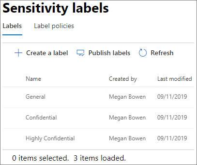

# Crear un entorno seguro de uso compartido para invitadosCreate a secure guest sharing environment

En este artículo, analizaremos una amplia variedad de opciones para crear un entorno seguro de uso compartido para invitados en Microsoft 365.In this article, we'll walk through a variety of options for creating a secure guest sharing environment in Microsoft 365. Este es solo un ejemplo para dar una idea de las opciones disponibles.This is an example scenario to give you an idea of the options available. Puede usar estos procedimientos en distintas combinaciones para satisfacer las necesidades de seguridad y cumplimiento de su organización.You can use these procedures in different combinations to meet the security and compliance needs of your organization. Al final del artículo, analizaremos un caso de prueba para ver cómo funcionan conjuntamente algunas de estas opciones.At the end of the article, we'll walk through a test case to see how some of these options work together.

Este ejemplo incluye:This scenario includes:

- Configurar autenticación multifactor para invitadosSetting up multi-factor authentication for guests.
- Configurar condiciones de uso para invitados.Setting up a terms of use for guests.
- Establecer revisiones trimestrales de acceso de invitados para validar periódicamente si los invitados continúan necesitando permisos en los equipos y en los sitios.Setting up quarterly guest access reviews to periodically validate whether guests continue to need permissions to teams and sites.
- Restringir el acceso de invitados a solo web para dispositivos no administrados.Restricting guests to web-only access for unmanaged devices.
- Configurar una directiva de tiempo de espera de la sesión para garantizar la autenticación de los invitados diariamente.Configuring a session timeout policy to ensure guests authenticate daily.
- Crear y publicar etiquetas de confidencialidad para clasificar el contenido.Creating and publishing sensitivity labels to classify content.
- Creación de un tipo de información confidencial para un proyecto altamente confidencial.Creating a sensitive information type for a highly sensitive project.
- Asignación automática de una etiqueta *altamente confidencial* a los documentos que contienen el tipo de información confidencial.Automatically assigning a *highly sensitive* label to documents that contain the sensitive information type.
- Retirar automáticamente el acceso de invitado a los archivos etiquetados como *altamente confidencial*.Automatically removing guest access from files labeled as *highly sensitive*.

Algunas de las opciones analizadas en este artículo requieren que los invitados tengan una cuenta de Azure Active Directory.Some of the options discussed in this article require guests to have an account in Azure Active Directory. Para asegurarse de que los invitados estén en el directorio cuando comparta archivos y carpetas con ellos, use la [Integración de SharePoint y OneDrive con la vista previa de Azure AD B2B](https://docs.microsoft.com/sharepoint/sharepoint-azureb2b-integration-preview).To ensure that guests are included in the directory when you share files and folders with them, use the [SharePoint and OneDrive integration with Azure AD B2B Preview](https://docs.microsoft.com/sharepoint/sharepoint-azureb2b-integration-preview).

Tenga en cuenta que este artículo no describe cómo habilitar la configuración de uso compartido para invitados.Note that we won't discuss enabling guest sharing settings in this article. Consulte [Colaborar con personas de fuera de su organización](collaborate-with-people-outside-your-organization.md) para obtener más información sobre cómo habilitar el uso compartido para invitados en diferentes situaciones.See [Collaborating with people outside your organization](collaborate-with-people-outside-your-organization.md) for details about enabling guest sharing for different scenarios.

## Configurar autenticación multifactor para invitadosSet up multi-factor authentication for guests

La autenticación multifactor reduce considerablemente la probabilidad de que una cuenta sea atacada.Multi-factor authentication greatly reduces the chances of an account being compromised. Dado que los invitados pueden usar cuentas de correo personales que no cumplan con las directivas de la empresa o los procedimientos recomendados, es especialmente importante exigirles que usen una autenticación multifactor.Since guest users may be using personal email accounts that don't adhere to any governance policies or best practices, it's especially important to require multi-factor authentication for guests. Si se roba el nombre de usuario y la contraseña de un usuario invitado, tener un segundo factor de autenticación reduce considerablemente las posibilidades de que terceros obtengan acceso a sus sitios y archivos.If a guest user's username and password is stolen, requiring a second factor of authentication greatly reduces the chances of unknown parties gaining access to your sites and files.

En este ejemplo, configuraremos la autenticación multifactor para invitados mediante el uso de una directiva de acceso condicional en Azure Active Directory.In this example, we'll set up multi-factor authentication for guests by using a conditional access policy in Azure Active Directory.

Configurar autenticación multifactor para invitadosTo set up multi-factor authentication for guests
1. En Microsoft Azure, busque *Acceso condicional*.In Microsoft Azure, search for *Conditional access*.
2. En la hoja **Acceso condicional - Directivas**, seleccione **Nueva directiva**.On the **Conditional Access - Policies** blade, click **New policy**.
3. En el campo **Nombre**, escriba *Invitado MFA*.In the **Name** field, type *Guest MFA*.
4. En **Asignaciones**, haga clic en **Usuarios y grupos**.Under **Assignments**, click **Users and groups**.
5. En la hoja **Usuarios y grupos**, seleccione **Seleccionar usuarios y grupos**, marque la casilla **Todos los invitados y usuarios externos**.On the **Users and groups** blade, select **Select users and groups**, select the **All guests and external users** check box.
6. En **Tareas**, haga clic en **Aplicaciones o acciones en la nube**.Under **Assignments**, click **Cloud apps or actions**.
7. En la hoja **Aplicaciones o acciones en la nube**, seleccione **Todas las aplicaciones en la nube** en la pestaña **Incluir**.On the **Cloud apps or actions** blade, select **All cloud apps** on the **Include** tab.
8. En **Controles de acceso**, haga clic en **Conceder**.Under **Access controls**, click **Grant**.
9. En la hoja **Conceder**, marque la casilla **Requerir autenticación multifactor** y haga clic en **Seleccionar**.On the **Grant** blade, select the **Require multi-factor authentication** check box, and then click **Select**.
10. En la hoja **Nuevo**, en **Habilitar directiva**, haga clic en **Activar** y, luego, haga clic **Crear**.On the **New** blade, under **Enable policy**, click **On**, and then click **Create**.

Ahora, el invitado deberá inscribirse en la autenticación multifactor para acceder al contenido compartido, a los sitios o a los equipos.Now, guest will be required to enroll in multi-factor authentication before they can access shared content, sites, or teams.

### Más informaciónMore information

[Planificar la implementación en la nube de Azure Multi-Factor AuthenticationPlanning a cloud-based Azure Multi-Factor Authentication deployment](https://docs.microsoft.com/azure/active-directory/authentication/howto-mfa-getstarted)

## Configurar condiciones de uso para invitadosSet up a terms of use for guests

A menudo, los invitados no han firmado contratos de no divulgación ni otros acuerdos jurídicos con su organización.Often times guest users may not have signed non-disclosure agreements or other legal agreements with your organization. Puede obligar a los invitados a aceptar sus términos de uso antes de darles acceso a los archivos compartidos.You can require guests to agree to a terms of use before accessing files that are shared with them. Los términos de uso se les pueden mostrar la primera vez que intenten acceder a un archivo o sitio compartido.The terms of use can be displayed the first time they attempt to access a shared file or site.

Para crearlos, primero elabore el documento en Word u otro programa de creación y, luego, guárdelo como un archivo PDF.To create a terms of use, you first need to create the document in Word or another authoring program, and then save it as a .pdf file. Este archivo se puede cargar en Azure AD.This file can then be uploaded to Azure AD.

¿Por qué crear términos de uso de Azure AD?To create an Azure AD terms of use
1. Inicie sesión en Azure como administrador global, administrador de seguridad o administrador de acceso condicional.Sign in to Azure as a Global Administrator, Security Administrator, or Conditional Access Administrator.
2. Vaya a [Términos de uso](https://aka.ms/catou).Navigate to [Terms of use](https://aka.ms/catou).
3. Haga clic en **Nuevos términos**.Click **New terms**. 
   
4. En las casillas **Nombre** y **Nombre para mostrar**, escriba *Términos de uso para invitados*.In the **Name** and **Display name** boxes, type *Guest terms of use*.
6. En **Documento de términos de uso** explore hasta encontrar el archivo PDF que creó y selecciónelo.For **Terms of use document**, browse to the pdf file that you created and select it.
7. Seleccione el idioma para su documento de términos de uso.Select the language for your terms of use document.
8. En **Requerir a los usuarios que expandan los términos de uso**, seleccione **Activado**.Set **Require users to expand the terms of use** to **On**.
9. En **Acceso condicional**, de la lista **Exigir con plantillas de directiva de acceso condicional** elija **Crear directiva de acceso condicional más adelante**.Under **Conditional Access**, in the **Enforce with Conditional Access policy template** list choose **Create conditional access policy later**.
10. Haga clic en **Crear**.Click **Create**.

Una vez haya creado los términos de uso, el siguiente paso es crear una directiva de acceso condicional que muestre los términos a los invitados.Once you've created the terms of use, the next step is to create a conditional access policy that displays the terms of use to guest users.

Para crear una nueva directiva de acceso condicional, haga lo siguiente:To create a conditional access policy
1. En Microsoft Azure, busque *Acceso condicional*.In Microsoft Azure, search for *Conditional access*.
2. En la hoja **Acceso condicional - Directivas**, seleccione **Nueva directiva**.On the **Conditional Access - Policies** blade, click **New policy**.
3. En el cuadro **Nombre**, escriba *Directiva de términos de uso del invitado*.In the **Name** box, type *Guest user terms of use policy*.
4. En **Asignaciones**, haga clic en **Usuarios y grupos**.Under **Assignments**, click **Users and groups**.
5. En la hoja **Usuarios y grupos**, seleccione **Seleccionar usuarios y grupos**, marque la casilla **Todos los invitados y usuarios externos** y, a continuación, haga clic en **Listo**.On the **Users and groups** blade, select **Select users and groups**, select the **All guests and external users** check box, and then click **Done**.
6. En **Tareas**, haga clic en **Aplicaciones o acciones en la nube**.Under **Assignments**, click **Cloud apps or actions**.
7. En la pestaña **Incluir**, elija **Seleccionar aplicaciones** y, a continuación, haga clic en **Seleccionar**.On the **Include** tab, select **Select apps**, and then click **Select**.
8. En la hoja **Seleccionar**, elija **Microsoft Teams**, **Office 365 SharePoint Online** y **Grupos de Outlook** y, a continuación, haga clic en **Seleccionar**.On the **Select** blade, select **Microsoft Teams**, **Office 365 SharePoint Online**, and **Outlook Groups**, and then click **Select**.
9. En la hoja **Aplicaciones o acciones en la nube**, haga clic en **Listo**.On the **Cloud apps or actions** blade, click **Done**.
10. En **Controles de acceso**, haga clic en **Conceder**.Under **Access controls**, click **Grant**.
11. En la hoja **Conceder**, seleccione **Términos de uso de invitado** y, a continuación, haga clic en **Seleccionar**.On the **Grant** blade, select **Guest terms of use**, and then click **Select**.
12. En la hoja **Nuevo**, en **Habilitar directiva**, haga clic en **Activar** y, luego, haga clic **Crear**.On the **New** blade, under **Enable policy**, click **On**, and then click **Create**.

A partir de ahora, cuando un usuario invitado acceda por primera vez al contenido, a un grupo o a un sitio de su organización, se le pedirá que acepte los términos de uso.Now, the first time a guest user attempts to access content or a team or site in your organization, they will be required to accept the terms of use.

> [!NOTE]
> El uso del acceso condicional requiere una licencia de Azure AD Premium P1.Using Conditional Access requires an Azure AD Premium P1 license. Para más información, consulte [Qué es el acceso condicional](https://docs.microsoft.com/azure/active-directory/conditional-access/overview).For more information, see [What is Conditional Access](https://docs.microsoft.com/azure/active-directory/conditional-access/overview).

### Más informaciónMore information
[Términos de uso de Azure Active Directory.Azure Active Directory terms of use](https://docs.microsoft.com/azure/active-directory/conditional-access/terms-of-use)

## Configurar revisiones de acceso de invitadosSet up guest access reviews

Con las revisiones de acceso en Azure AD, puede realizar automáticamente revisiones periódicas del acceso de usuarios a diversos equipos y grupos.With access reviews in Azure AD, you can automate a periodic review of user access to various teams and groups. Al requerir una revisión de acceso específicamente para invitados, se asegura de que los invitados no tengan acceso a información confidencial de su organización durante más tiempo del necesario.By requiring an access review for guests specifically, you can help ensure guest users do not retain access to your organization's sensitive information for longer than is necessary.

Las revisiones de acceso se pueden organizar en distintos programas.Access reviews can be organized into programs. Un programa es una agrupación de revisiones de acceso similares. Sirve para organizar las revisiones de acceso para propósitos como la creación de informes o auditorías.A program is a grouping of similar access reviews that can be used to organize access reviews for reporting and auditing purposes.

En este ejemplo, crearemos un programa para las revisiones de acceso de invitados.In this example, we'll create a program for guest access reviews.

Para crear un programa:To create a program
1. Inicie sesión en Azure Portal y abra la página [Identity Governance](https://portal.azure.com/#blade/Microsoft_AAD_ERM/DashboardBlade).Sign in to the Azure portal and open the [Identity Governance page](https://portal.azure.com/#blade/Microsoft_AAD_ERM/DashboardBlade).
2. En el menú de la izquierda, haga clic en **Programas**.In the left menu, click **Programs**
3. Haga clic en **Nuevo programa**.Click **New program**.
4. En el cuadro **Nombre**, escriba *Programa de revisión de acceso para invitados*.In the **Name** box, type *Guest access review program*.
5. En el cuadro **Descripción**, escriba *Programa para las revisiones de acceso de invitados*.In the **Description** box, type *Program for guest access reviews*.
6. Haga clic en **Crear**.Click **Create**.

Una vez que haya creado el programa, puede crear una revisión de acceso de invitados y asociarla a él.Once the program has been created, we can create a guest access review and associate it with the program.

Crear una revisión de acceso de invitadosTo set up a guest user access review
1. En la página [Identity Governance](https://portal.azure.com/#blade/Microsoft_AAD_ERM/DashboardBlade), en el menú de la izquierda, haga clic en **Revisiones de acceso**.On the [Identity Governance page](https://portal.azure.com/#blade/Microsoft_AAD_ERM/DashboardBlade), in the left menu, click **Access reviews**.
2. Haga clic en **Nueva revisión de acceso**.Click **New access review**. 
   
3. En el cuadro **Nombre**, escriba *Revisión de acceso trimestral*.In the **Name** box, type *Quarterly guest access review*.
4. En **Frecuencia**, elija **Trimestral**.For **Frequency**, choose **Quarterly**.
5. En **Finalización**, elija **Nunca**.For **End**, choose **Never**.
6. En **Ámbito**, elija **Solo usuarios invitados**.For **Scope**, choose **Guest users only**.
7. Haga clic en **Agrupar**, seleccione los grupos que desea incluir en la revisión de acceso y, a continuación, haga clic en **Seleccionar**.Click **Group**, select the groups that you want to include in the access review, and then click **Select**.
8. En **Programas**, haga clic en **Vincular al programa**.Under **Programs**, click **Link to program**.
9. En la hoja **Seleccionar un programa**, elija **Programa de revisión de acceso para invitados**On the **Select a program** blade, choose **Guest access review program**
10. Haga clic en **Iniciar**.Click **Start**.

Se creará una revisión de acceso independiente para cada grupo que especifique.A separate access review is created for each group that you specify. Los propietarios de cada grupo recibirán un correo cada trimestre para aprobar o denegar el acceso de los invitados a sus grupos.Group owners of each groups will be emailed quarterly to approve or deny guest access to their groups.

Hay que tener en cuenta que los invitados pueden recibir acceso tanto a equipos o grupos, como a archivos y carpetas individuales.It's important to note that guests can be given access to teams or groups, or to individual files and folders. Cuando se da acceso a archivos y carpetas, es posible que los invitados no se agreguen a un grupo específico.When given access to files and folders, guests may not be added to any particular group. Si desea realizar revisiones de acceso para invitados que no pertenezcan a un equipo o grupo, puede crear un grupo dinámico en Azure AD que contenga todos los invitados y, a continuación, crear una revisión de acceso para ese grupo.If you want to do access reviews on guest users who don't belong to a team or group, you can create a dynamic group in Azure AD to contain all guests and then create an access review for that group.

### Más informaciónMore information
[Administre el acceso de los invitados con las revisiones de acceso de Azure ADManage guest access with Azure AD access reviews](https://docs.microsoft.com/azure/active-directory/governance/manage-guest-access-with-access-reviews)

[Cree una revisión de acceso de grupos o aplicaciones con las revisiones de acceso de Azure ADCreate an access review of groups or applications in Azure AD access reviews](https://docs.microsoft.com/azure/active-directory/governance/create-access-review)

## Establezca que los usuarios invitados solo puedan acceder a través de la webSet up web-only access for guest users

Puede limitar sus zonas vulnerables a un ataque y facilitar las tareas de administración si obliga a los invitados a que accedan a sus equipos, sitios y archivos a través de un navegador web.You can reduce your attack surface and ease administration by requiring guest users to access your teams, sites, and files by using a web browser only. Esto se realiza a través de las directivas de acceso condicional de Azure AD.This is done with an Azure AD conditional access policy.

Cómo restringir el acceso de los invitados a solo la webTo restrict guests to web-ony access
1. En Microsoft Azure, busque *Acceso condicional*.In Microsoft Azure, search for *Conditional access*.
2. En la hoja **Acceso condicional - Directivas**, seleccione **Nueva directiva**.On the **Conditional Access - Policies** blade, click **New policy**.
3. En el cuadro **Nombre**, escriba *Acceso por navegador de los invitados*.In the **Name** box, type *Guest user browser access*.
4. En **Asignaciones**, haga clic en **Usuarios y grupos**.Under **Assignments**, click **Users and groups**.
5. En la hoja **Usuarios y grupos**, seleccione **Seleccionar usuarios y grupos**, marque la casilla **Todos los invitados y usuarios externos** y, a continuación, haga clic en **Listo**.On the **Users and groups** blade, select **Select users and groups**, select the **All guests and external users** check box, and then click **Done**.
6. En **Tareas**, haga clic en **Aplicaciones o acciones en la nube**.Under **Assignments**, click **Cloud apps or actions**.
7. En la pestaña **Incluir**, elija **Seleccionar aplicaciones** y, a continuación, haga clic en **Seleccionar**.On the **Include** tab, select **Select apps**, and then click **Select**.
8. En la hoja **Seleccionar**, elija **Microsoft Teams**, **Office 365 SharePoint Online** y **Grupos de Outlook** y, a continuación, haga clic en **Seleccionar**.On the **Select** blade, select **Microsoft Teams**, **Office 365 SharePoint Online**, and **Outlook Groups**, and then click **Select**.
9. En la hoja **Aplicaciones o acciones en la nube**, haga clic en **Listo**.On the **Cloud apps or actions** blade, click **Done**.
10. En **Tareas**, haga clic en **Condiciones**.Under **Assignments**, click **Conditions**.
11. En la hoja **Condiciones**, haga clic en **Aplicaciones cliente**.On the **Conditions** blade, click **Client apps**.
12. En la hoja **Aplicaciones cliente**, haga clic en **Sí** para **Configurar**, y seleccione **Clientes de aplicaciones móviles y de escritorio**On the **Client apps** blade, click **Yes** for **Configure**, and then select the **Mobile apps and desktop clients** setting. 
    
13. Haga clic en **Listo** y, después, en la hoja **Condiciones**, haga clic de nuevo en **Listo**.Click **Done**, and then on the **Conditions** blade, click **Done** again.
14. En **Controles de acceso**, haga clic en **Conceder**.Under **Access controls**, click **Grant**.
15. En la hoja **Conceder**, seleccione **Requerir que el dispositivo esté marcado como compatible** y **Requerir un dispositivo unido de Hybrid Azure AD**.On the **Grant** blade, select **Require device to be marked as compliant** and **Require Hybrid Azure AD joined device**.
16. En **Para varios controles**, seleccione **Requerir uno de los controles seleccionados** y, a continuación haga clic en **Seleccionar**.Under **For multiple controls**, select **Require one of the selected controls**, and then click **Select**.
17. En la hoja **Nuevo**, en **Habilitar directiva**, haga clic en **Activar** y, luego, haga clic **Crear**.On the **New** blade, under **Enable policy**, click **On**, and then click **Create**.

## Configurar un tiempo de espera de sesión para los usuarios invitadosConfigure a session timeout for guest users

Requerir que los invitados se autentiquen periódicamente puede reducir la posibilidad de que usuarios desconocidos accedan al contenido de la organización si el usuario invitado no protege su dispositivo correctamente.Requiring guests to authenticate on a regular basis can reduce the possibility of unknown users accessing your organization's content if a guest user's device isn't kept secure. Azure AD le permite configurar una directiva de acceso condicional de tiempo de espera de sesión para usuarios invitados.You can configure a session timeout conditional access policy for guest users in Azure AD.

Cómo configurar una directiva de tiempo de espera de sesión para invitadoTo configure a guest session timeout policy
1. En Microsoft Azure, busque *Acceso condicional*.In Microsoft Azure, search for *Conditional access*.
2. En la hoja **Acceso condicional - Directivas**, seleccione **Nueva directiva**.On the **Conditional Access - Policies** blade, click **New policy**.
3. En el cuadro **Nombre**, escriba *Tiempo de espera de sesión para invitado*.In the **Name** box, type *Guest session timeout*.
4. En **Asignaciones**, haga clic en **Usuarios y grupos**.Under **Assignments**, click **Users and groups**.
5. En la hoja **Usuarios y grupos**, seleccione **Seleccionar usuarios y grupos**, marque la casilla **Todos los invitados y usuarios externos** y, a continuación, haga clic en **Listo**.On the **Users and groups** blade, select **Select users and groups**, select the **All guests and external users** check box, and then click **Done**.
6. En **Tareas**, haga clic en **Aplicaciones o acciones en la nube**.Under **Assignments**, click **Cloud apps or actions**.
7. En la pestaña **Incluir**, elija **Seleccionar aplicaciones** y, a continuación, haga clic en **Seleccionar**.On the **Include** tab, select **Select apps**, and then click **Select**.
8. En la hoja **Seleccionar**, elija **Microsoft Teams**, **Office 365 SharePoint Online** y **Grupos de Outlook** y, a continuación, haga clic en **Seleccionar**.On the **Select** blade, select **Microsoft Teams**, **Office 365 SharePoint Online**, and **Outlook Groups**, and then click **Select**.
9. En la hoja **Aplicaciones o acciones en la nube**, haga clic en **Listo**.On the **Cloud apps or actions** blade, click **Done**.
10. En **Controles de acceso**, haga clic en **Sesión**.Under **Access controls**, click **Session**.
11. En la hoja **Sesión**, seleccione **Frecuencia de inicio de sesión**.On the **Session** blade, select **Sign-in frequency**.
12. Seleccione **1** y **días** para el período de tiempo y, a continuación, haga clic en **Seleccionar**.Select **1** and **Days** for the time period, and then click **Select**.
13. En la hoja **Nuevo**, en **Habilitar directiva**, haga clic en **Activar** y, luego, haga clic **Crear**.On the **New** blade, under **Enable policy**, click **On**, and then click **Create**.

## Cree etiquetas de confidencialidadCreate sensitivity labels

Las etiquetas de confidencialidad pueden clasificar y proteger la información de su organización de varias maneras.Sensitivity labels can be used in a variety of ways to classify and protect your organization's information. En este ejemplo, veremos cómo se pueden usar para administrar el acceso de los invitados a archivos y carpetas compartidas.In this example, we'll look at how labels can be used to help you manage guest access to shared files and folders.

En primer lugar, vamos a crear tres etiquetas de confidencialidad en el Centro de cumplimiento de Microsoft 365:First, we'll create three sensitivity labels in the Microsoft 365 Compliance Center:

- GeneralGeneral
- confidencialsensitive
- Altamente confidencialHighly sensitive

Use el siguiente procedimiento para crear las etiquetas *General* y *Confidencial*.Use the following procedure to create the *General* and *sensitive* labels.

Cómo crear una etiqueta de clasificación (General y Confidencial)To create a classification label (General and sensitive)
1. En el [Centro de cumplimiento de Microsoft 365](https://compliance.microsoft.com), en el panel de navegación izquierdo, expanda **Clasificación** y, a continuación, haga clic en **Etiquetas de confidencialidad**.In the [Microsoft 365 Compliance Center](https://compliance.microsoft.com), in the left navigation, expand **Classification**, and then click **Sensitivity labels**.
2. Haga clic en **Crear una etiqueta**.Click **Create a label**.
3. En **Nombre de etiqueta**, escriba *General* o *Confidencial*.In **Label name**, type *General* or *sensitive*.
4. En **Información sobre herramientas**, escriba *Información general que se puede compartir con empleados, invitados y asociados* o *Información confidencial. Compartir solo con empleados e invitados autorizados*. A continuación, haga clic en **Siguiente**.In **Tooltip**, type *General information that can be shared with employees, guests, and partners* or *sensitive information. Share only with employees and authorized guests*, and then click **Next**.
5. En cifrado, marque **Desactivado** y haga clic en **Siguiente**.Leave encryption **Off** and click **Next**.
6. En Distintivo de contenido, marque **Desactivado** y haga clic en **Siguiente**.Leave content marking **Off** and click **Next**.
7. En Prevención de pérdida de datos en punto de conexión, marque **Desactivado** y haga clic en **Siguiente**.Leave endpoint data loss prevention **Off** and click **Next**.
8. En Etiquetado automático, marque **Desactivado** y haga clic en **Siguiente**.Leave auto labeling **Off** and click **Next**.
9. Haga clic en **Crear**.Click **Create**.

Con la etiqueta *Altamente confidencial*, agregaremos una marca de agua automática en los documentos que etiquetemos.With the *Highly sensitive* label, we'll add automatic watermarking of documents with the label.

Para crear una etiqueta de clasificación (Altamente confidencial)To create a classification label (Highly sensitive)
1. Haga clic en **Crear una etiqueta**.Click **Create a label**.
2. En **Nombre de etiqueta**, escriba *Altamente confidencial*.In **Label name**, type *Highly sensitive*.
3. En **Información sobre herramientas**, escriba *Información altamente confidencial. No compartir con invitados*. Luego, haga clic en **Siguiente**.In **Tooltip**, type *Highly sensitive information. Do not share with guests*, and then click **Next**.
4. En cifrado, marque **Desactivado** y haga clic en **Siguiente**.Leave encryption **Off** and click **Next**.
5. En Distintivo de contenido, seleccione **Activado**, marque la casilla **Agregar un encabezado** y, a continuación, haga clic en **Personalizar texto**.Turn content marking **On**, select the **Add a header** check box, and then click **Customize text**.
6. Escriba *Altamente confidencial* en el texto del encabezado y haga clic en **Guardar**.Type *Highly sensitive* for the header text and click **Save**.
7. En la página **Distintivo de contenido**, seleccione **Activado**.On the **Content marking** page, turn content marking **On**.
8. Active la casilla de verificación **Agregar una marca de agua** y, después, haga clic en **Personalizar texto**.Select the **Add a watermark** check box, and then click **Customize text**.
9. En **Texto de marca de agua**, escriba *Altamente confidencial*.For **Watermark text**, type *Highly sensitive*.
10. Escriba *24* en **Tamaño de fuente**, y haga clic en **Guardar**.Type *24* for **Font size**, and then click **Save**.
11. En **Distintivo de contenido**, haga clic en **Siguiente**.On the **Content marking** page, click **Next**.
12. En Prevención de pérdida de datos en punto de conexión, marque **Desactivado** y haga clic en **Siguiente**.Leave endpoint data loss prevention **Off** and click **Next**.
13. En Etiquetado automático, marque **Desactivado** y haga clic en **Siguiente**.Leave auto labeling **Off** and click **Next**.
14. Haga clic en **Crear**.Click **Create**.

Una vez que haya creado las etiquetas, el siguiente paso es publicarlas.Once you've created the labels, the next step is to publish them. 

Publicar etiquetasTo publish labels
1. En la página **Etiquetas de confidencialidad**, haga clic en **Publicar etiquetas**.On the **Sensitivity labels** page, click **Publish labels**.
2. Haga clic en **Elegir etiquetas para publicar**.Click **Choose labels to publish**.
3. Haga clic en **Agregar**, seleccione las etiquetas que ha creado y haga clic en **Agregar**.Click **Add**, select the labels that you created, and then click **Add**.
4. Haga clic en **Listo**.Click **Done**.
5. Haga clic en **Siguiente**.Click **Next**.
6. Configure los usuarios y grupos como **Todos** y haga clic en **Siguiente**.Leave the users and groups set to **All** and click **Next**.
7. En la lista **Aplicar esta etiqueta a documentos y correos electrónicos de forma predeterminada** elija **General** y, después, haga clic en **Siguiente**.In the **Apply this label by default to documents and email** list, choose **General**, and then click **Next**.
8. En la página **Configuración de directiva**, escriba *Confidencialidad de documento* como nombre y haga clic en **Siguiente**.On the **Policy settings** page, type *Document sensitivity* for the name, and then click **Next**.
9. Haga clic en **Publicar**.Click **Publish**.

Cuando publique las etiquetas, estarán disponibles para los usuarios de las aplicaciones de escritorio de Office.With the labels published, they're available to users of Office desktop apps. Cuando los usuarios apliquen la etiqueta **Altamente confidencial**, se agregará automáticamente una marca de agua al documento.When users apply the **Highly sensitive** label, a watermark is automatically added to the document.

### Más informaciónMore information
[Información general de etiquetas de confidencialidadOverview of sensitivity labels](https://docs.microsoft.com/Office365/SecurityCompliance/sensitivity-labels)

## Crear un tipo de información confidencial para un proyecto altamente confidencial.Create a sensitive information type for a highly sensitive project

Los tipos de información confidencial son cadenas predefinidas que se pueden usar en flujos de trabajo de directiva para aplicar requisitos de cumplimiento.Sensitive information types are predefined strings that can be used in policy workflows to enforce compliance requirements. El Centro de cumplimiento de Microsoft 365 incluye más de 100 tipos de información confidencial, como números de licencia de conducir, números de tarjeta de crédito, números de cuentas bancarias, etc.The Microsoft 365 Compliance Center comes with over one hundred sensitive information types, including driver's license numbers, credit card numbers, bank account numbers, etc.

Puede crear tipos de información confidencial personalizados para ayudar a administrar el contenido específico de su organización.You can create custom sensitive information types to help manage content specific to your organization. En este ejemplo, vamos a crear un tipo de información confidencial personalizado para un proyecto altamente confidencial.In this example, we'll create a custom sensitive information type for a highly sensitive project. Podemos usar este tipo de información confidencial para aplicar automáticamente una etiqueta de clasificación.We can then use this sensitive information type to automatically apply a classification label.

Cómo crear un tipo de información confidencialTo create a sensitive information type
1. En el [Centro de cumplimiento de Microsoft 365](https://compliance.microsoft.com), en el panel de navegación izquierdo, expanda **Clasificación** y, a continuación, haga clic en **Tipos de información confidencialidad**.In the [Microsoft 365 Compliance Center](https://compliance.microsoft.com), in the left navigation, expand **Classification**, and then click **Sensitive info types**.
2. Haga clic en **Crear**.Click **Create**.
3. En \*\*Nombre \*\* y **Descripción**, escriba **Proyecto Saturno** y haga clic en **Siguiente**.For **Name** and **Description**, type **Project Saturn**, and then click **Next**.
4. Haga clic en **Agregar un elemento**.Click **Add an element**.
5. En la lista **Detectar contenido que contenga**, seleccione **Palabras clave** y, a continuación, escriba *Proyecto Saturno* en el cuadro de palabras clave.On the **Detect content containing** list, select **Keywords**, and then type *Project Saturn* in the keyword box.
6. Haga clic en **Siguiente** y después en **Finalizar**.Click **Next**, and then click **Finish**.
7. Si se le solicita si quiere probar el tipo de información confidencial, haga clic en **No**.If asked if you would like to test the sensitive information type, click **No**.

### Más informaciónMore information
[Tipos de información confidencial personalizadosCustom sensitive information types](https://docs.microsoft.com/Office365/SecurityCompliance/custom-sensitive-info-types)

## Crear una directiva para asignar una etiqueta basada en un tipo de información confidencialCreate a policy to assign a label based on a sensitive information type

Una vez que tenemos el tipo de información confidencial, podemos crear una directiva de archivo en la aplicación Microsoft Cloud App Security para aplicar la etiqueta *Altamente confidencial* automáticamente a los documentos que contengan la cadena *Proyecto Saturno*.Once the sensitive information type is created, we can create a file policy in Microsoft Cloud App Security to apply the *Highly sensitive* label to documents that contain the *Project Saturn* string automatically.

> [!NOTE]
> Las etiquetas de confidencialidad están disponibles en Cloud App Security gracias a un proceso de replicación.There is a replication process that makes sensitivity labels available in Cloud App Security. Es posible que no vea inmediatamente la etiqueta disponible para una directiva.You may not see the label available for a policy right away.

Cómo crear un tipo de información confidencial basado en una directivaTo create a sensitive information type-based file policy
1. Abra [Microsoft Cloud App Security](https://portal.cloudappsecurity.com).Open [Microsoft Cloud App Security](https://portal.cloudappsecurity.com).
2. En el panel de navegación izquierdo, expanda **Control** y, después, haga clic en **Directivas**.In the left navigation, expand **Control**, and then click **Policies**.
3. Haga clic en **Crear directiva** y, a continuación, elija **Directiva de archivo**.Click **Create policy**, and then choose **File policy**.
4. En **Nombre de la directiva**, escriba *Etiqueta de Proyecto Saturno*.For **Policy name**, type *Project Saturn labeling*.
5. En **Crear un filtro para los archivos a los que se aplicará esta directiva**, haga clic dos veces en X para eliminar los filtros predeterminados.Under **Create a filter for the files this policy will act on**, click X twice to delete the default filters.
7. En la lista **Seleccionar un filtro**, elija **Aplicación** y seleccione **Microsoft SharePoint Online** de la lista**Seleccionar aplicaciones...**.In the **Select a filter** list, choose **App**, and then select **Microsoft SharePoint Online** from the **Select apps...** list.
8. En **Método de inspección**, elija **Servicio de clasificación de datos**.Under **Inspection method**, choose **Data classification service**.
9. En la lista **Elegir tipo de inspección**, elija **Tipo de información confidencial**.On the **Choose inspection type** list, choose **Sensitive information type**.
10. Busque la etiqueta de confidencialidad *Proyecto Saturno* y, a continuación, haga clic en **Listo**.Search for and select the *Project Saturn* sensitivity label, and then click **Done**. 
   
11. En **Gobierno**, expanda **Microsoft SharePoint Online**.Under **Governance**, expand **Microsoft SharePoint Online**.
12. Active la casilla de verificación **Aplicar etiqueta de clasificación** y seleccione la etiqueta **Altamente confidencial**.Select the **Apply classification label** check box and select the **Highly sensitive** label.
13. Haga clic en **Crear**.Click **Create**.

Con la directiva en vigor, cuando un usuario escriba "Proyecto Saturno" en un documento, Cloud App Security aplicará automáticamente la etiqueta *Altamente confidencial* al analizar el archivo.With the policy in place, when a user types "Project Saturn" into a document, Cloud App Security will automatically apply the *Highly sensitive* label when it scans the file.

### Más informaciónMore information
[Directivas de archivoFile policies](https://docs.microsoft.com/cloud-app-security/data-protection-policies)

## Crear una directiva para retirar el acceso de un invitado a archivos altamente confidencialesCreate a policy to remove guest access to highly sensitive files

En el ejemplo de este artículo, los archivos con la etiqueta *Altamente confidencial* no deben compartirse con los invitados.In the example in this article, files with the *Highly sensitive* label shouldn't be shared with guests. Podemos crear una directiva de archivo en Cloud App Security que elimine automáticamente el acceso de los invitados a los archivos que tengan esa etiqueta.We can create a file policy in Cloud App Security that automatically removes guest access from files with that label.

Tenga en cuenta que esto no impide que los usuarios puedan compartir o volver a compartir estos archivos.Note that this doesn't prevent users from sharing or re-sharing these files. Sigue necesitando que sus usuarios sigan sus directivas de gobierno para los archivos que se almacenan en sitios que permitan compartir con invitados.You're still reliant on your users to follow your governance policies for files that are stored in sites that allow guest sharing. Lo que sí hace esta herramienta es eliminar el acceso de los invitados a archivos con información confidencial después de que se hayan compartido con invitados.However, this can be a useful tool for removing guest access from files that had sensitive information added to them after they were shared with guests.

Cómo crear una directiva de archivo basada en etiquetasTo create a label-based file policy
1. Abra [Microsoft Cloud App Security](https://portal.cloudappsecurity.com).Open [Microsoft Cloud App Security](https://portal.cloudappsecurity.com).
2. En el panel de navegación izquierdo, expanda **Control** y, después, haga clic en **Directivas**.In the left navigation, expand **Control**, and then click **Policies**.
3. Haga clic en **Crear directiva** y, a continuación, elija **Directiva de archivo**.Click **Create policy**, and then choose **File policy**.
4. En **Nombre de la directiva**, escriba *Retirar acceso de invitados al Proyecto Saturno*.For **Policy name**, type *Project Saturn - remove guest access*.
5. En **Crear un filtro para los archivos a los que se aplicará esta directiva**, haga clic dos veces en X para eliminar los filtros predeterminados.Under **Create a filter for the files this policy will act on**, click X twice to delete the default filters.
6. En la lista **Seleccionar un filtro**, elija **Aplicación** y seleccione **Microsoft SharePoint Online** de la lista**Seleccionar aplicaciones...**.In the **Select a filter** list, choose **App**, and then select **Microsoft SharePoint Online** from the **Select apps...** list.
7. Haga clic en **Agregar un filtro**.Click **Add a filter**.
8. En la lista **Seleccionar un filtro**, elija **Etiqueta de clasificación**, y seleccione **Azure Information Protection** de la lista **Seleccionar filtro...**.In the **Select a filter** list, choose **Classification label**, and then select **Azure Information Protection** from the **Select filter...** list.
9. En la lista **Seleccionar etiqueta de clasificación**, seleccione **Altamente confidencial**.In the **Select classification label** list, select **Highly sensitive**. 
   
10. En **Gobierno**, expanda **Microsoft SharePoint Online**.Under **Governance**, expand **Microsoft SharePoint Online**.
11. Seleccione las casillas de verificación **Enviar un resumen de directivas coincidentes al propietario del archivo** y **Quitar usuarios externos**.Select the **Send policy-match digest to file owner** and **Remove external users** check boxes.
12. Para el mensaje de notificación personalizado, escriba *Este archivo es altamente confidencial. La directiva de la empresa prohíbe compartirla con sus invitados*.For the custom notification message, type *This file is highly sensitive. Company policy prohibits sharing it with guests*.
13. Haga clic en **Crear**.Click **Create**.

Tenga en cuenta que esta directiva quita el acceso a los archivos compartidos con un vínculo de *Personas específicas*.It's important to note, that this policy removes access for files shared using a *Specific people* link. No elimina el acceso de vínculos no autenticados (*Cualquiera*).It doesn't remove access from unauthenticated (*Anyone*) links. Tampoco retira el acceso si el invitado es miembro del sitio o del equipo en general.It also doesn't remove access if the guest is a member of the site or team as a whole. Si prevé disponer de documentos altamente confidenciales en un sitio o equipo con miembros invitados, considere usar [Canales privados en Teams](https://support.office.com/article/60ef929a-4d68-418b-bf4f-5784db184ec9) y solo permitir que los miembros de su organización los usen.If you plan to have highly sensitive documents in a site or team with guest members, consider using [private channels in Teams](https://support.office.com/article/60ef929a-4d68-418b-bf4f-5784db184ec9) and only allowing members of your organization in the private channels.

## Probar la soluciónTest the solution

Para probar la solución descrita en este artículo, cree un documento de Word y guárdelo en una biblioteca de documentos.To test the solution described in this article, create a Word document and save it to a document library. Comparta el archivo con un invitado.Share the file with a guest user. Cuando el invitado intente acceder al documento, deberá inscribirse en autenticación multifactor y, luego, aceptar los términos de uso.When the guest attempts to access the document, they should be required to enroll in multi-factor authentication, and then accept the terms of use.

Cuando el invitado tenga acceso al documento, escriba *Proyecto Saturno* en el documento y guárdelo.Once the guest has access to the document, type *Project Saturn* in the document and save it. Una vez que Cloud App Security escanee el documento, se debe aplicar la etiqueta *Altamente confidencial* y el invitado ya no tendrá acceso a él.Once Cloud App Security scans the document, the *Highly sensitive* label should be applied and the guest user should no longer have access to it.

Puede combinar las herramientas que se describen en este artículo de distintas maneras para que su organización pueda compartir con invitados de forma segura y productiva.You can use the tools described in this article in various combinations to help create a productive but safe guest sharing environment for your organization.

## Opciones adicionalesAdditional options

Hay algunas opciones adicionales de Microsoft 365 y Azure Active Directory que pueden ayudar a proteger el entorno de uso compartido de invitados.There are some additional options in Microsoft 365 and Azure Active Directory that can help secure your guest sharing environment.

- Puede crear una lista de dominios permitidos o prohibidos para limitar los dominios con los que los usuarios podrán compartir.You can create a list of allowed or denied sharing domains to limit who users can share with. Consulte [restringir el uso compartido de contenido de SharePoint y OneDrive por dominio](https://docs.microsoft.com/sharepoint/restricted-domains-sharing) y [permitir o bloquear las invitaciones a los usuarios B2B de organizaciones específicas](https://docs.microsoft.com/azure/active-directory/b2b/allow-deny-list) para obtener más información.See [Restrict sharing of SharePoint and OneDrive content by domain](https://docs.microsoft.com/sharepoint/restricted-domains-sharing) and [Allow or block invitations to B2B users from specific organizations](https://docs.microsoft.com/azure/active-directory/b2b/allow-deny-list) for more information.
- Puede limitar el resto de los espacios empresariales de Azure Active Directory a los que se pueden conectar los usuarios.You can limit which other Azure Active Directory tenants your users can connect to. Consulte [Usar restricciones de espacio empresarial para administrar el acceso a aplicaciones en la nube de SaaS](https://docs.microsoft.com/azure/active-directory/manage-apps/tenant-restrictions) para obtener más información.See [Use tenant restrictions to manage access to SaaS cloud applications](https://docs.microsoft.com/azure/active-directory/manage-apps/tenant-restrictions) for information.
- Puede crear un entorno administrado donde los asociados pueden ayudar a administrar cuentas de invitado.You can create a managed environment where partners can help manage guest accounts. Para obtener más información, consulte [crear una extranet de B2B con invitados administrados](https://docs.microsoft.com/Office365/Enterprise/b2b-extranet).See [Create a B2B extranet with managed guests](https://docs.microsoft.com/Office365/Enterprise/b2b-extranet) for information.

## Consulta tambiénSee Also

[Reducir la exposición accidental de archivos al compartirlos con invitadosLimit accidental exposure to files when sharing with guests](share-limit-accidental-exposure.md)

[Prácticas recomendadas para compartir archivos y carpetas con usuarios no autenticadosBest practices for sharing files and folders with unauthenticated users](best-practices-anonymous-sharing.md)

Para obtener más información, consulte [Crear una extranet de B2B con invitados administrados](b2b-extranet.md).[Create a B2B extranet with managed guests](b2b-extranet.md)
