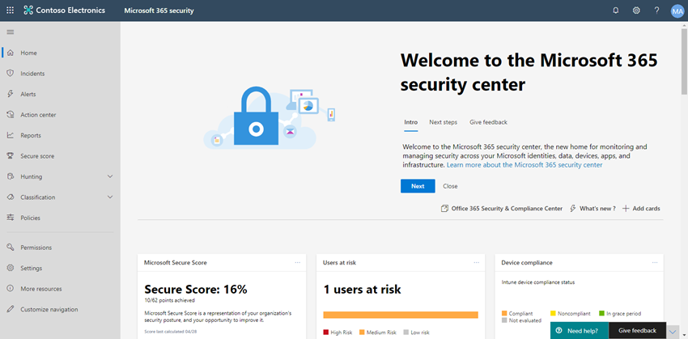

# Configurar las capacidades de protección contra amenazas en Microsoft 365Configure threat protection capabilities across Microsoft 365

Siga estos pasos para configurar la protección contra amenazas en Microsoft 365.Follow these steps to configure threat protection across Microsoft 365.

## Paso 1: Configurar la autenticación multifactor y las directivas de acceso condicionalStep 1: Set up multi-factor authentication and Conditional Access policies

[La autenticación multifactor](/azure/active-directory/authentication/concept-mfa-howitworks) (MFA) requiere que los usuarios comprueben su identidad con una llamada telefónica o una aplicación de autenticación.[Multi-factor authentication](/azure/active-directory/authentication/concept-mfa-howitworks) (MFA) requires users to verify their identity with a phone call or an authenticator app. [Las directivas de acceso](/azure/active-directory/conditional-access/overview) condicional definen ciertos requisitos que deben cumplirse para que los usuarios puedan acceder a aplicaciones y datos en Microsoft 365.[Conditional access policies](/azure/active-directory/conditional-access/overview) define certain requirements that must be met in order for users to access apps and data in Microsoft 365. Mfa y las directivas de acceso condicional funcionan conjuntamente para proteger su organización.MFA and Conditional Access policies work together to protect your organization. Por ejemplo, si alguien intenta iniciar sesión desde un dispositivo móvil con una cuenta que no está habilitada para MFA y una directiva de acceso condicional requiere que MFA esté en vigor, ese usuario no podrá iniciar sesión.For example, if someone attempts to sign in from a mobile device using an account that is not enabled for MFA, and a Conditional Access policy requires MFA to be in effect, that user is prevented from signing in.  

Microsoft ha probado y recomienda un conjunto específico de directivas relacionadas y acceso condicional para proteger el acceso a todas las aplicaciones SaaS, especialmente Microsoft 365.Microsoft has tested and recommends a specific set of Conditional Access and related policies for protecting access to all of your SaaS applications, especially Microsoft 365. Las directivas se recomiendan para la protección de línea base, confidencial y altamente regulada.Policies are recommended for baseline, sensitive, and highly regulated protection. Comience implementando las directivas para la protección de línea base.Begin by implementing the policies for baseline protection. 

 
 [a dispositivos Vea una versión más grande de esta imagen](https://github.com/MicrosoftDocs/microsoft-365-docs/raw/public/microsoft-365/media/microsoft-365-policies-configurations/Identity_device_access_policies_byplan.png)
[See a larger version of this image](https://github.com/MicrosoftDocs/microsoft-365-docs/raw/public/microsoft-365/media/microsoft-365-policies-configurations/Identity_device_access_policies_byplan.png)

### Para implementar la protección de línea base para Microsoft 365To implement baseline protection for Microsoft 365

 

1. [Configure los requisitos previos, incluido Azure AD Identity Protection](../security/office-365-security/identity-access-prerequisites.md).[Configure prerequisites, including Azure AD Identity Protection](../security/office-365-security/identity-access-prerequisites.md).
2. [Configure directivas comunes de acceso a dispositivos y identidades](../security/office-365-security/identity-access-policies.md) para la protección de línea base.[Configure common identity and device access policies](../security/office-365-security/identity-access-policies.md) for baseline protection.
3. Configurar directivas para [usuarios invitados,](../security/office-365-security/identity-access-policies-guest-access.md) [Microsoft Teams,](../security/office-365-security/teams-access-policies.md) [Exchange Online](../security/office-365-security/secure-email-recommended-policies.md)y [SharePoint Online y OneDrive](../security/office-365-security/sharepoint-file-access-policies.md).Configure policies for [guest users](../security/office-365-security/identity-access-policies-guest-access.md), [Microsoft Teams](../security/office-365-security/teams-access-policies.md), [Exchange Online](../security/office-365-security/secure-email-recommended-policies.md), and [SharePoint Online and OneDrive](../security/office-365-security/sharepoint-file-access-policies.md).

### Más información sobre la protección de identidadesMore information about protecting identities

- [Configuraciones de acceso a dispositivos e identidadesIdentity and device access configurations](../security/office-365-security/microsoft-365-policies-configurations.md)
- [Instrucciones de seguridad para Azure MFASecurity guidance for Azure MFA](/azure/active-directory/authentication/multi-factor-authentication-security-best-practices)

## Paso 2: Configurar Microsoft Defender para identidadStep 2: Configure Microsoft Defender for Identity

[Microsoft Defender for Identity](/defender-for-identity/what-is) es una solución de seguridad basada en la nube que funciona con las señales locales de Servicios de dominio de Active Directory (AD DS) para identificar, detectar e investigar amenazas avanzadas, identidades comprometidas y acciones internas malintencionadas dirigidas a su organización.[Microsoft Defender for Identity](/defender-for-identity/what-is) is a cloud-based security solution that works with your on-premises Active Directory Domain Services (AD DS) signals to identify, detect, and investigate advanced threats, compromised identities, and malicious insider actions directed at your organization.

Microsoft Defender for Identity permite a los analistas y profesionales de seguridad de operaciones de seguridad (SecOps) que tienen dificultades para detectar ataques avanzados en entornos híbridos para:Microsoft Defender for Identity enables security operations (SecOps) analysts and security professionals struggling to detect advanced attacks in hybrid environments to:
- Supervisar usuarios, comportamiento de entidad y actividades con análisis basados en aprendizaje.Monitor users, entity behavior, and activities with learning-based analytics.
- Proteger las identidades de usuario y las credenciales almacenadas en Active Directory.Protect user identities and credentials stored in Active Directory.
- Identificar e investigar actividades de usuarios sospechosas y ataques avanzados en la cadena de eliminación.Identify and investigate suspicious user activities and advanced attacks throughout the kill chain.
- Proporcionar información clara sobre el incidente en una escala de tiempo simple para una evaluación rápida.Provide clear incident information on a simple timeline for fast triage.

### Para configurar Microsoft Defender for IdentityTo set up Microsoft Defender for Identity

 

1. [Configure Microsoft Defender for Identity para](/azure-advanced-threat-protection/install-atp-step1) proteger los entornos principales.[Set up Microsoft Defender for Identity](/azure-advanced-threat-protection/install-atp-step1) to protect your primary environments.
2. Proteger todos los [controladores de dominio](/azure-advanced-threat-protection/atp-sensor-monitoring) y [bosques](/azure-advanced-threat-protection/atp-multi-forest).Protect all your [domain controllers](/azure-advanced-threat-protection/atp-sensor-monitoring) and [forests](/azure-advanced-threat-protection/atp-multi-forest).
3. Integre [alertas de Microsoft Defender para identidades](/azure-advanced-threat-protection/suspicious-activity-guide?tabs=external) en el flujo de trabajo de operaciones de seguridad (SecOps).Integrate [Microsoft Defender for Identity alerts](/azure-advanced-threat-protection/suspicious-activity-guide?tabs=external) into your security operations (SecOps) workflow.

### Más información sobre Microsoft Defender for IdentityMore information about Microsoft Defender for Identity

- [¿Qué es Microsoft Defender for Identity?What is Microsoft Defender for Identity?](/azure-advanced-threat-protection/what-is-atp)
- [Vídeo: Introducción a Microsoft Defender for IdentityVideo: Introduction to Microsoft Defender for Identity](https://www.youtube.com/watch?reload=9&v=EGY2m8yU_KE)
- [Implementación de Microsoft Defender para identidadesMicrosoft Defender for Identity deployment](/azure-advanced-threat-protection/what-is-atp#whats-next)

## Paso 3: Activar Microsoft 365 DefenderStep 3: Turn on Microsoft 365 Defender

[Microsoft 365 Defender](../security/defender/microsoft-365-defender.md) combina las señales y orquesta las capacidades en una única solución.[Microsoft 365 Defender](../security/defender/microsoft-365-defender.md) combines signals and orchestrates capabilities into a single solution. Con la solución integrada de Microsoft 365 Defender, los profesionales de seguridad pueden unir las señales de amenaza que cada uno de estos productos recibe y determinar el alcance completo y el impacto de la amenaza; cómo entró en el entorno, lo que está afectado y cómo está afectando actualmente a la organización.With the integrated Microsoft 365 Defender solution, security professionals can stitch together the threat signals that each of these products receive and determine the full scope and impact of the threat; how it entered the environment, what it's affected, and how it's currently impacting the organization. Microsoft 365 Defender realiza acciones automáticas para evitar o detener el ataque y auto-sanar los buzones, puntos de conexión e identidades de usuario afectados.Microsoft 365 Defender takes automatic action to prevent or stop the attack and self-heal affected mailboxes, endpoints, and user identities.

Microsoft 365 Defender unifica alertas, incidentes, investigación y respuesta automatizadas y búsqueda avanzada entre cargas de trabajo (Microsoft Defender para la identidad, Microsoft Defender para Office 365, Microsoft Defender para endpoint y Microsoft Cloud App Security) en un único panel de experiencia de cristal.Microsoft 365 Defender unifies alerts, incidents, automated investigation and response, and advanced hunting across workloads (Microsoft Defender for Identity, Microsoft Defender for Office 365, Microsoft Defender for Endpoint, and Microsoft Cloud App Security) into a single pane of glass experience. Las nuevas características se agregan continuamente a Microsoft 365 Defender; considere la posibilidad de participar para recibir características de vista previa.New features are added continually to Microsoft 365 Defender; consider opting in to receive preview features.

### Para configurar Microsoft 365 DefenderTo set up Microsoft 365 Defender

 

1. [Revise los requisitos previos](../security/defender/prerequisites.md).[Review the prerequisites](../security/defender/prerequisites.md).
2. [Active Microsoft 365 Defender](../security/defender/m365d-enable.md).[Turn on Microsoft 365 Defender](../security/defender/m365d-enable.md).
3. [Opt in for preview features](../security/defender/preview.md).[Opt in for preview features](../security/defender/preview.md).

### Más información sobre Microsoft 365 DefenderMore information about Microsoft 365 Defender

- [¿Qué es Microsoft 365 Defender?What is Microsoft 365 Defender?](../security/defender/microsoft-365-defender.md)
- [Novedades de Microsoft 365 DefenderWhat's new in Microsoft 365 Defender](../security/defender/whats-new.md)

## Paso 4: Configurar Microsoft Defender para Office 365Step 4: Configure Microsoft Defender for Office 365

[Microsoft Defender para Office 365](../security/office-365-security/defender-for-office-365.md) protege su organización contra amenazas malintencionadas en mensajes de correo electrónico (datos adjuntos y direcciones URL), documentos de Office y herramientas de colaboración.[Microsoft Defender for Office 365](../security/office-365-security/defender-for-office-365.md) safeguards your organization against malicious threats in email messages (attachments and URLs), Office documents, and collaboration tools. En la tabla siguiente se enumeran las características y capacidades de Microsoft Defender para Office 365 que se incluyen en Microsoft 365 E5:The following table lists Microsoft Defender for Office 365 features and capabilities that are included in Microsoft 365 E5:

|Capacidades de configuración, protección y detecciónConfiguration, protection, and detection capabilities|Capacidades de automatización, investigación, corrección y educaciónAutomation, investigation, remediation, and education capabilities|
|:---|:---|
|[Archivos adjuntos segurosSafe Attachments](../security/office-365-security/safe-attachments.md) [Vínculos segurosSafe Links](../security/office-365-security/safe-links.md) [Documentos segurosSafe Documents](../security/office-365-security/safe-docs.md) [ATP para SharePoint, OneDrive y Microsoft TeamsATP for SharePoint, OneDrive, and Microsoft Teams](../security/office-365-security/mdo-for-spo-odb-and-teams.md)  [Protección contra suplantación de identidad (phishing) en Microsoft 365Anti-phishing protection in Microsoft 365](../security/office-365-security/anti-phishing-protection.md)|[Rastreadores de amenazasThreat Trackers](../security/office-365-security/threat-trackers.md) [Explorador de amenazasThreat Explorer](../security/office-365-security/threat-explorer.md) [Investigación y respuesta automatizadasAutomated investigation and response](../security/office-365-security/office-365-air.md) [Simulador de ataqueAttack Simulator](../security/office-365-security/attack-simulator.md)|
|

Con Microsoft Defender para Office 365, los usuarios de toda la organización pueden comunicarse y colaborar de forma más segura, con protección contra amenazas para su contenido de correo electrónico y documentos de Office.With Microsoft Defender for Office 365, people across your organization can communicate and collaborate more securely, with threat protection for their email content and Office documents.

### Para configurar Microsoft Defender para Office 365To set up Microsoft Defender for Office 365

 

1. Configurar y configurar las directivas de [Microsoft Defender para Office 365](../security/office-365-security/protect-against-threats.md).[Set up and configure your Microsoft Defender for Office 365 policies](../security/office-365-security/protect-against-threats.md).
2. [Ver y usar los informes de Microsoft Defender para Office 365](../security/office-365-security/view-reports-for-mdo.md).[View and use your Microsoft Defender for Office 365 reports](../security/office-365-security/view-reports-for-mdo.md).
3. [Usar capacidades de investigación y respuesta de amenazas](../security/office-365-security/office-365-ti.md).[Use threat investigation and response capabilities](../security/office-365-security/office-365-ti.md).

### Más información sobre Microsoft Defender para Office 365More information about Microsoft Defender for Office 365

- [Introducción a Microsoft Defender para Office 365Microsoft Defender for Office 365 overview](../security/office-365-security/defender-for-office-365.md)
- [Novedades de Microsoft Defender para Office 365What's new in Microsoft Defender for Office 365](../security/office-365-security/whats-new-in-defender-for-office-365.md)

## Paso 5: Configurar Microsoft Defender para endpointStep 5: Configure Microsoft Defender for Endpoint

[Microsoft Defender para endpoint](/windows/security/threat-protection) protege los dispositivos de la organización (también denominados puntos de conexión) de ciberamenazas, ataques avanzados e infracciones de datos.[Microsoft Defender for Endpoint](/windows/security/threat-protection) protects your organizations devices (also referred to as endpoints) from cyberthreats, advanced attacks, and data breaches. Los equipos de seguridad pueden ser más eficientes en la administración de la seguridad de sus puntos de conexión.Security teams can be more efficient in managing the security of their endpoints. Las herramientas sólidas ayudan a las organizaciones a mantenerse al día con los sistemas no apareados mediante la detección de vulnerabilidades con la administración de [amenazas y vulnerabilidades.](/windows/security/threat-protection/microsoft-defender-atp/next-gen-threat-and-vuln-mgt)Robust tools help organizations keep up with unpatched systems using  vulnerability detection with [Threat and Vulnerability management](/windows/security/threat-protection/microsoft-defender-atp/next-gen-threat-and-vuln-mgt). Las capacidades automatizadas de detección y corrección, como la reducción de superficie de [ataque,](/windows/security/threat-protection/microsoft-defender-atp/overview-attack-surface-reduction)la protección de última generación, la detección y respuesta de puntos de conexión y la investigación y corrección automatizadas ayudan a mantener los dispositivos a salvo de malware. Automated detection and remediation capabilities, such as [attack surface reduction](/windows/security/threat-protection/microsoft-defender-atp/overview-attack-surface-reduction), [next-generation protection](/windows/security/threat-protection/windows-defender-antivirus/windows-defender-antivirus-in-windows-10), [endpoint detection and response](/windows/security/threat-protection/microsoft-defender-atp/overview-endpoint-detection-response), and [automated investigation and remediation](/windows/security/threat-protection/microsoft-defender-atp/automated-investigations) help keep your devices safe from malware. Además de estas capacidades, los clientes pueden recibir notificaciones proactivas y consultar con expertos en amenazas de Microsoft a petición, como parte del servicio de búsqueda administrada de participación.On top of these capabilities, customers can get proactive notifications and consult with Microsoft Threat Experts on demand, as part of the opt-in managed hunting service. 

### Configurar Microsoft Defender para endpointSet up Microsoft Defender for Endpoint

 

1. [Prepare su entorno para Microsoft Defender para Endpoint](../security/defender-endpoint/deployment-phases.md).[Prepare your environment for Microsoft Defender for Endpoint](../security/defender-endpoint/deployment-phases.md).
2. [Implementar Microsoft Defender para endpoint](../security/defender-endpoint/production-deployment.md).[Deploy Microsoft Defender for Endpoint](../security/defender-endpoint/production-deployment.md).
3. [Incorporación al servicio de Microsoft Defender para puntos de conexión](../security/defender-endpoint/onboarding.md).[Onboard to the Microsoft Defender for Endpoint service](../security/defender-endpoint/onboarding.md).
4. [Complete las tareas administrativas de seguridad superior](../security/defender-endpoint/tvm-security-recommendation.md).[Complete your top security administrative tasks](../security/defender-endpoint/tvm-security-recommendation.md).

### Más información sobre Microsoft Defender para endpointMore information about Microsoft Defender for Endpoint

- [Obtenga más información sobre Microsoft Defender para endpoint](../security/defender-endpoint/microsoft-defender-endpoint.md).[Learn more about Microsoft Defender for Endpoint](../security/defender-endpoint/microsoft-defender-endpoint.md).
- [Pruebe el laboratorio de evaluación de Microsoft Defender para endpoints](../security/defender-endpoint/evaluation-lab.md).[Try the Microsoft Defender for Endpoint evaluation lab](../security/defender-endpoint/evaluation-lab.md).

## Paso 6: Configurar Microsoft Cloud App SecurityStep 6: Configure Microsoft Cloud App Security

[Microsoft Cloud App Security es](/cloud-app-security) un agente de seguridad de Cloud Access que admite la recopilación de registros, conectores de API y proxy inverso.[Microsoft Cloud App Security](/cloud-app-security) is a Cloud Access Security Broker that supports log collection, API connectors, and reverse proxy. Microsoft Cloud App Security proporciona una amplia visibilidad, control sobre los viajes de datos y análisis sofisticados para identificar y combatir las ciberamenazas en todos los servicios en la nube.Microsoft Cloud App Security provides rich visibility, control over data travel, and sophisticated analytics to identify and combat cyberthreats across all your cloud services. Con Microsoft Cloud App Security, las operaciones de seguridad pueden proteger la información confidencial de la organización, protegerse contra ciberamenazas y anomalías, detectar y supervisar aplicaciones que tienen acceso a los datos de la organización y ayudar a garantizar que las aplicaciones en la nube de la organización cumplan los requisitos de cumplimiento.With Microsoft Cloud App Security, your security operations can protect your organization's sensitive information, protect against cyberthreats and anomalies, discover and monitor apps that access your organization's data, and help make sure your organization's cloud apps meet compliance requirements.

### Configurar Microsoft Cloud App SecuritySet up Microsoft Cloud App Security

 

1. [Configurar el portal y otros requisitos básicos](/cloud-app-security/general-setup).[Set up the portal and other basic requirements](/cloud-app-security/general-setup).
2. [Configurar la detección en la nube](/cloud-app-security/set-up-cloud-discovery) [y conectar aplicaciones](/cloud-app-security/enable-instant-visibility-protection-and-governance-actions-for-your-apps).[Set up cloud discovery](/cloud-app-security/set-up-cloud-discovery) and [connect apps](/cloud-app-security/enable-instant-visibility-protection-and-governance-actions-for-your-apps).
3. [Implementar control de aplicaciones de acceso condicional para aplicaciones características.](/cloud-app-security/proxy-deployment-aad)[Deploy Conditional Access App Control for featured apps](/cloud-app-security/proxy-deployment-aad).
4. [Use las herramientas de investigación y los paneles](/cloud-app-security/investigate).[Use the investigation tools and dashboards](/cloud-app-security/investigate).

### Más información sobre Microsoft Cloud App SecurityMore information about Microsoft Cloud App Security

- [Revisar nuevas características y funcionalidades](/cloud-app-security/release-notes).[Review new features and capabilities](/cloud-app-security/release-notes).
- [Obtenga más información sobre Microsoft Cloud App Security](/cloud-app-security/what-is-cloud-app-security).[Learn more about Microsoft Cloud App Security](/cloud-app-security/what-is-cloud-app-security).

## Paso 7: Supervisar el estado y realizar accionesStep 7: Monitor status and take actions

Después de configurar e implementar los servicios y capacidades de protección contra amenazas, el siguiente paso es supervisar las detecciones de amenazas y realizar las acciones adecuadas.After you have set up and deployed your threat protection services and capabilities, your next step is to monitor threat detections, and take appropriate actions. El mejor punto de partida es el Centro de seguridad de Microsoft 365 ( ), donde puede supervisar y administrar la seguridad en todas las identidades, datos, dispositivos, aplicaciones e infraestructura de [https://security.microsoft.com](https://security.microsoft.com) Microsoft.Your best starting point is the Microsoft 365 security center ([https://security.microsoft.com](https://security.microsoft.com)), where you can monitor and managing security across your Microsoft identities, data, devices, apps, and infrastructure. 

El Centro de seguridad de Microsoft 365 está pensado para administradores de seguridad y equipos de operaciones de seguridad.The Microsoft 365 security center is intended for security admins and security operations teams. En el Centro de seguridad de Microsoft 365, puede:In the Microsoft 365 security center, you can:
- Ver el estado de seguridad general de su organización con [Puntuación segura](https://docs.microsoft.com/microsoft-365/security/defender/microsoft-secure-score).View the overall security health of your organization with [Secure Score](https://docs.microsoft.com/microsoft-365/security/defender/microsoft-secure-score).
- [Supervisar y ver informes sobre](../security/defender-endpoint/threat-protection-reports.md) el estado de las identidades, los datos, los dispositivos, las aplicaciones y la infraestructura.[Monitor and view reports](../security/defender-endpoint/threat-protection-reports.md) on the status of your identities, data, devices, apps, and infrastructure.
- Conectar los puntos en alertas a través [de incidentes](https://docs.microsoft.com/microsoft-365/security/defender/incident-queue).Connect the dots on alerts through [incidents](https://docs.microsoft.com/microsoft-365/security/defender/incident-queue).
- Use [la investigación automatizada y la corrección para](../security/defender/m365d-autoir.md) solucionar las amenazas.Use [automated investigation and remediation](../security/defender/m365d-autoir.md) to address threats.
- [Busca de forma proactiva amenazas,](https://docs.microsoft.com/microsoft-365/security/defender/advanced-hunting-overview)como intentos de intrusión o actividad de infracción que afecten al correo electrónico, los datos, los dispositivos y las identidades.[Proactively hunt for threats](https://docs.microsoft.com/microsoft-365/security/defender/advanced-hunting-overview), such as intrusion attempts or breach activity affecting your email, data, devices, and identities.
- [Comprenda las últimas campañas y](https://docs.microsoft.com/microsoft-365/security/defender/latest-attack-campaigns) técnicas de ataque con análisis de amenazas.[Understand the latest attack campaigns](https://docs.microsoft.com/microsoft-365/security/defender/latest-attack-campaigns) and techniques with threat analytics.
- ... y mucho más.... and more!

### Más información sobre el Centro de seguridad de Microsoft 365More information about the Microsoft 365 security center

- [Introducción al Centro de seguridad de Microsoft 365](../security/defender/overview-security-center.md).[Get started with the Microsoft 365 security center](../security/defender/overview-security-center.md).
- [Supervisar y ver informes](../security/defender/overview-security-center.md).[Monitor and view reports](../security/defender/overview-security-center.md).
- [Vea los portales de seguridad en Microsoft 365](../security/defender/portals.md).[See the security portals in Microsoft 365](../security/defender/portals.md).

## Paso 8: Entrenar usuariosStep 8: Train users

La formación de los usuarios puede ahorrar mucho tiempo y frustración a los usuarios y al equipo de operaciones de seguridad.Training users can save your users and security operations team much time and frustration. Los usuarios expertos tienen menos probabilidades de abrir datos adjuntos o hacer clic en vínculos en mensajes de correo electrónico cuestionables, y es más probable que eviten sitios web sospechosos.Savvy users are less likely to open attachments or click links in questionable email messages, and they are more likely to avoid suspicious websites. 

El Manual  de la campaña de ciberseguridad de la Escuela Kennedy de Harvard proporciona excelentes instrucciones para establecer una cultura sólida de concienciación de seguridad en su organización, incluida la formación de los usuarios para identificar los ataques de suplantación de identidad.The Harvard Kennedy School [Cybersecurity Campaign Handbook](https://go.microsoft.com/fwlink/?linkid=2015598&amp;clcid=0x409) provides excellent guidance on establishing a strong culture of security awareness within your organization, including training users to identify phishing attacks. 

Microsoft 365 proporciona los siguientes recursos para ayudar a informar a los usuarios de su organización:Microsoft 365 provides the following resources to help inform users in your organization:

|ConceptoConcept  |RecursosResources  |
|---------|---------|
|Microsoft 365Microsoft 365     |[Caminos de aprendizaje personalizablesCustomizable learning pathways](/office365/customlearning/) 
Estos recursos pueden ayudarle a crear formación para los usuarios finales de su organizaciónThese resources can help you put together training for end users in your organization        |
|Seguridad de Microsoft 365Microsoft 365 security |[Módulo de aprendizaje: proteger la organización con seguridad inteligente integrada de Microsoft 365Learning module: Secure your organization with built-in, intelligent security from Microsoft 365](/learn/modules/security-with-microsoft-365) 
Este módulo le permite describir cómo funcionan conjuntamente las características de seguridad de Microsoft 365 y para expresar las ventajas de estas características de seguridad.This module enables you to describe how Microsoft 365 security features work together and to articulate the benefits of these security features. |
|Autenticación multifactorMulti-factor authentication     | [Comprobación en dos pasos: ¿Cuál es la página de verificación adicional?Two-step verification: What is the additional verification page?](/azure/active-directory/user-help/multi-factor-authentication-end-user-first-time) 
Este artículo ayuda a los usuarios finales a comprender qué es la autenticación multifactor y por qué se usa en su organización.This article helps end users understand what multi-factor authentication is and why it's being used at your organization.    |

Además de esta guía, Microsoft recomienda que los usuarios tomen las acciones descritas en este artículo: Proteger su cuenta y dispositivos de [los piratas informáticos y malware](https://support.office.com/article/066d6216-a56b-4f90-9af3-b3a1e9a327d6.aspx).In addition to this guidance, Microsoft recommends that your users take the actions described in this article: [Protect your account and devices from hackers and malware](https://support.office.com/article/066d6216-a56b-4f90-9af3-b3a1e9a327d6.aspx). Entre estas acciones se incluyen:These actions include:
- Uso de contraseñas segurasUsing strong passwords
- Protección de dispositivosProtecting devices 
- Habilitar características de seguridad en equipos Windows 10 y Mac (para dispositivos no administrados)Enabling security features on Windows 10 and Mac PCs (for unmanaged devices)
    
Microsoft también recomienda a los usuarios proteger sus cuentas de correo electrónico personales mediante las acciones recomendadas en los siguientes artículos:Microsoft also recommends that users protect their personal email accounts by taking the actions recommended in the following articles:
- [Ayudar a proteger su Outlook.com de correo electrónicoHelp protect your Outlook.com email account](https://support.microsoft.com/office/help-protect-your-outlook-com-email-account-a4f20fc5-4307-4ece-8231-6d4d4bd8a9ba)
- [Proteger tu cuenta de Gmail con la comprobación de 2 pasosProtect your Gmail account with 2-step verification](https://go.microsoft.com/fwlink/?linkid=2015688&amp;clcid=0x409)
