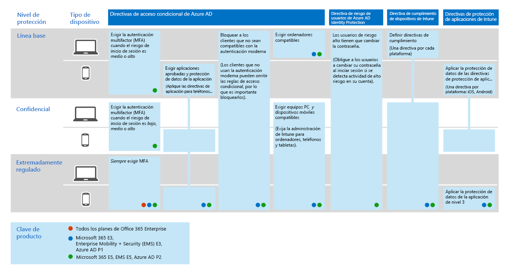
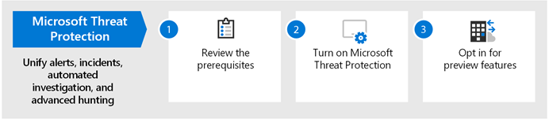

# Implementar capacidades de protección contra amenazas en Microsoft 365

El [malware](https://docs.microsoft.com/windows/security/threat-protection/intelligence/understanding-malware)y los cyberattacks sofisticados, como las [amenazas no archivadas](https://docs.microsoft.com/windows/security/threat-protection/intelligence/fileless-threats), son un acontecimiento común. Las empresas necesitan protegerse a sí mismos y a sus clientes. Estos ataques pueden ocasionar problemas importantes para su organización, que van desde una pérdida de confianza a la woes financiera, tiempo de inactividad de la empresa amenazante y mucho más. La protección contra amenazas es importante, pero puede resultar difícil determinar dónde centrarse en el tiempo, el esfuerzo y los recursos de la organización. 

Las soluciones de seguridad de Microsoft están integradas en nuestros productos y servicios. Las funcionalidades de automatización y aprendizaje de máquinas reducen la carga de los equipos de seguridad para asegurarse de que se resuelven los elementos correctos. Y la solidez de las soluciones de seguridad de Microsoft se basa en billones de señales que procesamos todos los días en nuestro [gráfico de seguridad inteligente](https://cloud-platform-assets.azurewebsites.net/intelligent-security-graph). Las soluciones de seguridad de Microsoft 365 incluyen la [protección contra amenazas de Microsoft](https://docs.microsoft.com/microsoft-365/security/mtp/microsoft-threat-protection), una solución que combina señales en el correo electrónico, los datos, los dispositivos y las identidades para pintar una imagen de amenazas avanzadas en su organización.

Vea este vídeo para obtener información general sobre el proceso de implementación.

> [!VIDEO https://www.microsoft.com/videoplayer/embed/RE4vsI7]

Use este artículo como guía para implementar la solución de protección contra amenazas.

## Protección contra amenazas en Microsoft 365 E5

[Microsoft 365 E5](https://www.microsoft.com/microsoft-365/enterprise-e5-business-software?activetab=pivot%3aoverviewtab) le permite proteger a su organización con inteligencia adaptable e integrada. Con las características de protección contra amenazas de Microsoft 365 E5, puede detectar e investigar las amenazas avanzadas, las identidades en peligro y las acciones malintencionadas en los entornos locales y en la nube.

En Microsoft 365 E5, las capacidades de protección contra amenazas están integradas de forma predeterminada. Las señales de cada función agregan fuerza a la capacidad general de detectar y responder a las amenazas. El conjunto combinado de capacidades ofrece la mejor protección para las organizaciones, especialmente las organizaciones multinacionales, en comparación con la ejecución de productos que no son de Microsoft. En la siguiente imagen se muestran los servicios y las capacidades de protección contra amenazas en Microsoft 365 E5 que se describen en este artículo.

En cuanto implemente cualquiera de las funciones de la protección contra amenazas avanzada, puede activar Microsoft Threat Protection, que une las señales y los datos en un solo punto. 

En la siguiente ilustración se muestra una ruta de acceso recomendada para implementar estas funciones individuales. 

|Solución/capacidades  |Descripción  |
|---------|---------|
|Autenticación multifactor y acceso condicional     |Protéjase contra las identidades y los dispositivos comprometidos. Comience con esta protección porque es fundamental. La configuración recomendada en esta guía incluye Azure AD Identity Protection como requisito previo.     |
|Azure Advanced Threat Protection     |  Una solución de seguridad basada en la nube que aprovecha las señales locales de Active Directory para identificar, detectar e investigar las amenazas avanzadas, las identidades en peligro y las acciones de Insider malintencionadas dirigidas a la organización. Céntrese en este siguiente porque protege su infraestructura local y de nube, no tiene dependencias o requisitos previos y puede proporcionar ventajas inmediatas.       | 
|Protección contra amenazas avanzada de Office 365     | Salvaguarda a su organización frente a amenazas malintencionadas que plantean mensajes de correo electrónico, vínculos (URL) y herramientas de colaboración. Protecciones para malware, suplantación de identidad (phishing), suplantación de identidad y otros tipos de ataques. Esto es recomendable porque el control de cambios, la migración de la configuración del sistema no y otras consideraciones pueden tardar más en implementarse.   Nota: Asegúrese de configurar también las capacidades de protección contra amenazas incluidas en todas las suscripciones de Office 365 (Exchange Online Protection).       |
|Protección contra amenazas avanzada de Microsoft Defender    | Una plataforma de protección de extremos que ayuda a prevenir, detectar, investigar y responder a amenazas avanzadas. Esto tarda más en implementarse, pero puede realizarse en paralelo con las otras funciones si otros administradores son responsables.   |
|Microsoft Cloud App Security     |   Un agente de seguridad de acceso a la nube para descubrimiento, investigación y gobernanza. Puede habilitar esto anticipadamente para empezar a recopilar datos y obtener información. La implementación de información y otra protección dirigida en todas las aplicaciones SaaS implica la planeación y puede tardar más tiempo.       | 

> [!TIP]
> Las organizaciones con varios equipos de seguridad pueden implementar estas capacidades en paralelo.

## Implementación de la solución de protección contra amenazas

Para asegurarse de que su organización tiene la mejor protección posible, configure e implemente la solución de seguridad de manera que incluya los siguientes pasos:

1. [Configurar la autenticación multifactor y las directivas de acceso condicional](#step-1-set-up-multi-factor-authentication-and-conditional-access-policies)
2. [Configurar la protección contra amenazas avanzada de Azure](#step-2-configure-azure-advanced-threat-protection)
3. [Habilitar la Protección contra amenazas de Microsoft](#step-3-turn-on-microsoft-threat-protection)
4. [Configuración de la protección contra amenazas avanzada de Office 365](#step-4-configure-office-365-advanced-threat-protection)
5. [Configurar la protección contra amenazas avanzada de Microsoft defender](#step-5-configure-microsoft-defender-advanced-threat-protection)
6. [Configurar Microsoft Cloud App Security](#step-6-configure-microsoft-cloud-app-security)
7. [Supervisar el estado y realizar acciones](#step-7-monitor-status-and-take-actions)
8. [Entrenar a los usuarios](#step-8-train-users)

Las características de protección contra amenazas se pueden configurar en paralelo, por lo que si tiene varios equipos de seguridad responsables de los distintos servicios, pueden configurar las características de protección de la organización al mismo tiempo. El siguiente diagrama ilustra el proceso de alto nivel para la implementación de capacidades de protección contra amenazas. 

 

## Paso 1: configurar la autenticación multifactor y las directivas de acceso condicional

La [autenticación multifactor](https://docs.microsoft.com/azure/active-directory/authentication/concept-mfa-howitworks) (MFA) requiere que los usuarios comprueben su identidad con una llamada telefónica o una aplicación autenticadora. [Las directivas de acceso condicional](https://docs.microsoft.com/azure/active-directory/conditional-access/overview) definen ciertos requisitos que deben cumplirse para que los usuarios tengan acceso a aplicaciones y datos en Microsoft 365. Las directivas de MFA y de acceso condicional funcionan conjuntamente para proteger la organización. Por ejemplo, si alguien intenta iniciar sesión desde un dispositivo móvil con una cuenta que no está habilitada para la MFA, y una directiva de acceso condicional requiere que MFA esté en vigor, se impedirá al usuario que inicie sesión.  

Microsoft ha probado y recomienda un conjunto específico de acceso condicional y directivas relacionadas para proteger el acceso a todas las aplicaciones SaaS, especialmente Microsoft 365. Se recomiendan las directivas para la protección de línea base, confidencial y altamente regulada. Comience por implementar las directivas para la protección de línea base. 

los dispositivos e identidades[consulte una versión más amplia de esta imagen](https://github.com/MicrosoftDocs/microsoft-365-docs/raw/public/microsoft-365/media/Identity_device_access_policies_byplan.png)

### Para implementar la protección de línea base para Microsoft 365

 

1. [Configure los requisitos previos, incluida Azure Identity Protection](../enterprise/identity-access-prerequisites.md).
2. [Configure directivas comunes de identidad y acceso a dispositivos](../enterprise/identity-access-policies.md) para la protección de línea base.
3. Configure directivas para [usuarios invitados](../enterprise/identity-access-policies-guest-access.md), [Microsoft Teams](../enterprise/teams-access-policies.md), [Exchange Online](../enterprise/secure-email-recommended-policies.md)y [SharePoint Online y OneDrive](../enterprise/sharepoint-file-access-policies.md).

### Más información acerca de cómo proteger las identidades

- [Configuraciones de acceso a dispositivos e identidades](../enterprise/microsoft-365-policies-configurations.md)
- [Guía de seguridad para Azure MFA](https://docs.microsoft.com/azure/active-directory/authentication/multi-factor-authentication-security-best-practices)

## Paso 2: configurar la protección contra amenazas avanzada de Azure

[Azure Advanced Threat Protection](https://docs.microsoft.com/azure-advanced-threat-protection/what-is-atp) (Azure ATP) es una solución de seguridad basada en la nube que funciona con las señales locales de [Azure Active Directory](https://docs.microsoft.com/azure/active-directory/fundamentals/active-directory-whatis) para identificar, detectar e investigar las amenazas avanzadas, las identidades en peligro y las acciones de Insider dañina dirigidas a la organización.

Azure ATP permite a los analistas de operaciones de seguridad (SecOps) y a los profesionales de la seguridad lidiar para detectar ataques avanzados en entornos híbridos para:
- Supervisar a los usuarios, el comportamiento de la entidad y las actividades con análisis basados en el aprendizaje.
- Proteger las identidades de usuario y las credenciales almacenadas en Active Directory.
- Identificar e investigar actividades de usuarios sospechosas y ataques avanzados en la cadena de eliminación.
- Proporcionar información clara sobre el incidente en una escala de tiempo simple para una evaluación rápida.

### Para configurar ATP de Azure

 

1. [Configure Azure ATP](https://docs.microsoft.com/azure-advanced-threat-protection/install-atp-step1) para proteger sus entornos principales.
2. Proteger todos los [controladores de dominio](https://docs.microsoft.com/azure-advanced-threat-protection/atp-sensor-monitoring) y los [bosques](https://docs.microsoft.com/azure-advanced-threat-protection/atp-multi-forest).
3. Integre las [alertas de ATP de Azure](https://docs.microsoft.com/azure-advanced-threat-protection/suspicious-activity-guide?tabs=external) en el flujo de trabajo de operaciones de seguridad (SecOps).

### Más información sobre Azure ATP

- [¿Qué es Azure ATP?](https://docs.microsoft.com/azure-advanced-threat-protection/what-is-atp)
- [Vídeo: Introducción a Azure ATP](https://www.youtube.com/watch?reload=9&v=EGY2m8yU_KE)
- [Implementación de ATP de Azure](https://docs.microsoft.com/azure-advanced-threat-protection/what-is-atp#whats-next)

## Paso 3: activar la protección contra amenazas de Microsoft

[Microsoft Threat Protection](https://docs.microsoft.com/microsoft-365/security/mtp/microsoft-threat-protection) combina las funciones de las señales y organiza las capacidades en una sola solución. Con la solución integrada de protección contra amenazas de Microsoft, los profesionales de seguridad pueden unir las señales de amenaza que reciben cada uno de estos productos y determinar el alcance completo y el impacto de la amenaza; Cómo entró en el entorno, qué se ve afectado y cómo afecta actualmente a la organización. Microsoft Threat Protection realiza acciones automáticas para impedir o detener el ataque y Autocorregir los buzones de correo, los extremos y las identidades de usuario afectados.

Microsoft Threat Protection unifica las alertas, los incidentes, la investigación y la respuesta automatizadas y la búsqueda avanzada de consolas en las cargas de trabajo (Azure ATP, Office 365 ATP, Microsoft defender ATP y Microsoft Cloud App Security) en un solo panel de experiencia de cristal. Después de configurar uno o varios de los servicios de protección contra amenazas avanzada, activa la protección contra amenazas de Microsoft. Las nuevas características se agregan de forma continua a la protección contra amenazas de Microsoft; considere la posibilidad de optar por recibir características de vista previa.

### Para configurar Microsoft Threat Protection

 

1. [Revise los requisitos previos](https://docs.microsoft.com/microsoft-365/security/mtp/prerequisites).
2. [Activar la protección contra amenazas de Microsoft](https://docs.microsoft.com/microsoft-365/security/mtp/mtp-enable).
3. [Participar en las características de vista previa](https://docs.microsoft.com/microsoft-365/security/mtp/preview).

### Más información acerca de la protección contra amenazas de Microsoft

- [¿Qué es la Protección contra amenazas de Microsoft?](https://docs.microsoft.com/microsoft-365/security/mtp/microsoft-threat-protection)
- [Novedades de Protección contra amenazas de Microsoft](https://docs.microsoft.com/microsoft-365/security/mtp/whats-new)

## Paso 4: configurar la protección contra amenazas avanzada de Office 365

[Office 365 Advanced Threat Protection](https://docs.microsoft.com/microsoft-365/security/office-365-security/office-365-atp) (Office 365 ATP) protege a su organización frente a amenazas dañinas en mensajes de correo electrónico (archivos adjuntos y URL), documentos de Office y herramientas de colaboración. En la siguiente tabla se enumeran las características y capacidades de ATP de Office 365 incluidas en Microsoft 365 E5:

|||
|---|---|
|Capacidades de configuración, protección y detección|Capacidades de automatización, investigación, corrección y educación|
|[Datos adjuntos seguros](https://docs.microsoft.com/microsoft-365/security/office-365-security/atp-safe-attachments) [Vínculos seguros](https://docs.microsoft.com/microsoft-365/security/office-365-security/atp-safe-links) [Documentos seguros](https://docs.microsoft.com/microsoft-365/security/office-365-security/safe-docs) [ATP para SharePoint, OneDrive y Microsoft Teams](https://docs.microsoft.com/microsoft-365/security/office-365-security/atp-for-spo-odb-and-teams) [Protección contra suplantación de identidad ATP](https://docs.microsoft.com/microsoft-365/security/office-365-security/set-up-anti-phishing-policies#exclusive-settings-in-atp-anti-phishing-policies)|[Rastreadores de amenazas](https://docs.microsoft.com/microsoft-365/security/office-365-security/threat-trackers) [Explorador de amenazas](https://docs.microsoft.com/microsoft-365/security/office-365-security/threat-explorer) [Investigación y respuesta de amenazas](https://docs.microsoft.com/microsoft-365/security/office-365-security/office-365-air) [Simulador de ataque](https://docs.microsoft.com/microsoft-365/security/office-365-security/attack-simulator)|
|

Con Office 365 ATP, las personas de toda la organización pueden comunicarse y colaborar de forma más segura, con protección contra amenazas para el contenido de correo electrónico y los documentos de Office.

### Para configurar Office 365 ATP

 

1. [Configure y configure las directivas de ATP de Office 365](https://docs.microsoft.com/microsoft-365/security/office-365-security/protect-against-threats).
2. [Ver y usar los informes de ATP de Office 365](https://docs.microsoft.com/microsoft-365/security/office-365-security/view-reports-for-atp).
3. [Usar la investigación de amenazas y las funciones de respuesta](https://docs.microsoft.com/microsoft-365/security/office-365-security/office-365-ti).

### Más información sobre Office 365 ATP

- [Introducción al ATP de Office 365](https://docs.microsoft.com/microsoft-365/security/office-365-security/office-365-atp)
- [Novedades de Office 365 ATP](https://docs.microsoft.com/microsoft-365/security/office-365-security/whats-new-in-office-365-atp)

## Paso 5: configurar la protección contra amenazas avanzada de Microsoft defender

La [protección contra amenazas avanzada de Microsoft defender](https://docs.microsoft.com/windows/security/threat-protection) (ATP de Microsoft defender) protege los dispositivos de la organización (también conocidos como puntos de conexión) de ciberamenazas, ataques avanzados y violaciones de datos. Los equipos de seguridad pueden ser más eficientes para administrar la seguridad de sus puntos de conexión. Las herramientas sólidas ayudan a las organizaciones a mantenerse al día con los sistemas sin revisiones mediante la detección de vulnerabilidades con la [Administración de amenazas y vulnerabilidades](https://docs.microsoft.com/windows/security/threat-protection/microsoft-defender-atp/next-gen-threat-and-vuln-mgt). La detección automatizada y las capacidades de corrección, como la reducción de la [superficie](https://docs.microsoft.com/windows/security/threat-protection/microsoft-defender-atp/overview-attack-surface-reduction)de los ataques, [la protección de próxima generación](https://docs.microsoft.com/windows/security/threat-protection/windows-defender-antivirus/windows-defender-antivirus-in-windows-10), la [detección y respuesta de extremos](https://docs.microsoft.com/windows/security/threat-protection/microsoft-defender-atp/overview-endpoint-detection-response)y la [corrección automatizada](https://docs.microsoft.com/windows/security/threat-protection/microsoft-defender-atp/automated-investigations) ayudan a mantener los dispositivos protegidos del malware. Además de estas capacidades, los clientes pueden obtener notificaciones proactivas y consultar a la demanda expertos de Microsoft, como parte del servicio de búsqueda administrada de participación. 

### Configurar ATP de Microsoft defender

 

1. [Prepare su implementación ATP de Microsoft defender](https://docs.microsoft.com/windows/security/threat-protection/microsoft-defender-atp/deployment-phases).
2. [Configurar la implementación de ATP de Microsoft defender](https://docs.microsoft.com/windows/security/threat-protection/micros.oft-defender-atp/production-deployment)
3. [Incorporado al servicio ATP de Microsoft defender](https://docs.microsoft.com/windows/security/threat-protection/microsoft-defender-atp/onboarding).
4. [Complete las principales tareas administrativas de seguridad](https://docs.microsoft.com/windows/security/threat-protection/microsoft-defender-atp/tvm-security-recommendation).

### Más información acerca de ATP de Microsoft defender

- [Obtenga más información sobre ATP de Microsoft defender](https://docs.microsoft.com/windows/security/threat-protection).
- [Pruebe el laboratorio de evaluación ATP de Microsoft defender](https://docs.microsoft.com/windows/security/threat-protection/microsoft-defender-atp/evaluation-lab).

## Paso 6: configurar Microsoft Cloud App Security

[Microsoft Cloud App Security](https://docs.microsoft.com/cloud-app-security) es un agente de seguridad de acceso a la nube que admite la recopilación de registros, los conectores de API y el proxy inverso. Microsoft Cloud App Security proporciona una gran visibilidad, control sobre los recorridos de datos y análisis sofisticados para identificar y combatir ciberamenazas en todos los servicios en la nube. Con Microsoft Cloud App Security, sus operaciones de seguridad pueden proteger la información confidencial de su organización, proteger contra ciberamenazas y anomalías, descubrir y supervisar las aplicaciones que tienen acceso a los datos de la organización y garantizar que las aplicaciones en la nube de su organización cumplan los requisitos de cumplimiento.

### Configurar Microsoft Cloud App Security

 

1. [Configurar el portal y otros requisitos básicos](https://docs.microsoft.com/cloud-app-security/general-setup).
2. Configurar las aplicaciones de [detección en la nube](https://docs.microsoft.com/cloud-app-security/set-up-cloud-discovery) y de [conexión](https://docs.microsoft.com/cloud-app-security/enable-instant-visibility-protection-and-governance-actions-for-your-apps).
3. [Implementar el control de aplicaciones de acceso condicional para aplicaciones destacadas](https://docs.microsoft.com/cloud-app-security/proxy-deployment-aad).
4. [Use las herramientas de investigación y los paneles](https://docs.microsoft.com/cloud-app-security/investigate).

### Más información sobre Microsoft Cloud App Security

- [Revise las nuevas características y capacidades](https://docs.microsoft.com/cloud-app-security/release-notes).
- [Obtenga más información sobre Microsoft Cloud App Security](https://docs.microsoft.com/cloud-app-security/what-is-cloud-app-security).

## Paso 7: supervisar el estado y realizar acciones

Una vez que haya configurado e implementado los servicios y las capacidades de la protección contra amenazas, el siguiente paso consiste en supervisar la detección de amenazas y realizar las acciones adecuadas. El mejor punto de partida es Microsoft 365 Security Center ([https://security.microsoft.com](https://security.microsoft.com)), donde puede supervisar y administrar la seguridad en las identidades, los datos, los dispositivos, las aplicaciones y la infraestructura de Microsoft. 

:::image type="content" source="../media/solutions-architecture-center/m365-security-center.png" alt-text="Centro de seguridad de Microsoft 365":::

El centro de seguridad 365 de Microsoft está diseñado específicamente para los administradores de seguridad y los equipos de operaciones de seguridad. En el centro de seguridad de Microsoft 365, puede:
- Ver el estado de seguridad general de la organización con [calificación segura](https://docs.microsoft.com/microsoft-365/security/mtp/microsoft-secure-score).
- [Supervisar y ver informes](https://docs.microsoft.com/microsoft-365/security/mtp/monitoring-and-reporting) sobre el estado de las identidades, los datos, los dispositivos, las aplicaciones y la infraestructura.
- Conecte los puntos de las alertas a través de [incidentes](https://docs.microsoft.com/microsoft-365/security/mtp/incident-queue).
- Use la [investigación y la corrección automatizadas](https://docs.microsoft.com/microsoft-365/security/mtp/mtp-autoir) para enfrentarse a las amenazas.
- [Buscar de forma proactiva las amenazas](https://docs.microsoft.com/microsoft-365/security/mtp/advanced-hunting-overview), como intentos de intrusión o actividad de infracciones que afectan a su correo electrónico, datos, dispositivos e identidades.
- [Comprenda las campañas y técnicas de ataque más recientes con el](https://docs.microsoft.com/microsoft-365/security/mtp/latest-attack-campaigns) análisis de amenazas.
- ... y mucho más.

### Más información sobre el centro de seguridad de Microsoft 365

- [Introducción al centro de seguridad de Microsoft 365](https://docs.microsoft.com/microsoft-365/security/mtp/overview-security-center).
- [Supervisar y ver informes](https://docs.microsoft.com/microsoft-365/security/mtp/monitoring-and-reporting).
- [Consulte los portales de seguridad en Microsoft 365](https://docs.microsoft.com/microsoft-365/security/mtp/portals).

## Paso 8: entrenar a los usuarios

Los usuarios de aprendizaje pueden guardar los usuarios y el equipo de operaciones de seguridad con mucho tiempo y frustraciones. Es menos probable que los usuarios más experimentados abran datos adjuntos o hagan clic en vínculos en mensajes de correo electrónico dudosos, por lo que es más probable que se eviten sitios Web sospechosos. 

El manual Harvard Kennedy School [Cybersecurity Campaign Handbook](https://go.microsoft.com/fwlink/?linkid=2015598&amp;clcid=0x409) proporciona una excelente orientación sobre cómo establecer una cultura fuerte de conciencia de la seguridad dentro de la organización, incluido el aprendizaje de usuarios para identificar ataques de suplantación de identidad. 

Microsoft 365 proporciona los siguientes recursos para ayudar a informar a los usuarios de su organización:

|Concepto  |Recursos  |
|---------|---------|
|Microsoft 365     |[Caminos de aprendizaje personalizables](https://docs.microsoft.com/office365/customlearning/) 
Estos recursos pueden ayudarle a elaborar formación para los usuarios finales de su organización        |
|Seguridad de Microsoft 365 |[Módulo de aprendizaje: Proteja su organización con seguridad integrada e integrada de Microsoft 365](https://docs.microsoft.com/learn/modules/security-with-microsoft-365) 
Este módulo le permite describir cómo funcionan conjuntamente las características de seguridad de Microsoft 365 y cómo articular las ventajas de estas características de seguridad. |
|Autenticación multifactor     | [Verificación en dos pasos: ¿Qué es la página de comprobación adicional?](https://docs.microsoft.com/azure/active-directory/user-help/multi-factor-authentication-end-user-first-time) 
Este artículo ayuda a los usuarios finales a comprender qué es la autenticación multifactor y por qué se usa en la organización.    |

Además de esta guía, Microsoft recomienda que los usuarios realicen las acciones descritas en este artículo: [Proteja su cuenta y sus dispositivos de hackers y malware](https://support.office.com/article/066d6216-a56b-4f90-9af3-b3a1e9a327d6.aspx). Entre estas acciones se incluyen:
- Uso de contraseñas seguras
- Protección de dispositivos 
- Habilitación de las características de seguridad en equipos PC con Windows 10 y Mac (para dispositivos no administrados)
    
Microsoft también recomienda que los usuarios protejan sus cuentas de correo electrónico personales llevando a cabo las acciones recomendadas en los siguientes artículos:
- [Ayuda para proteger su cuenta de correo electrónico de Outlook.com](https://support.office.com/article/a4f20fc5-4307-4ece-8231-6d4d4bd8a9ba.aspx)
- [Proteger la cuenta de gmail con verificación en dos pasos](https://go.microsoft.com/fwlink/?linkid=2015688&amp;clcid=0x409)
