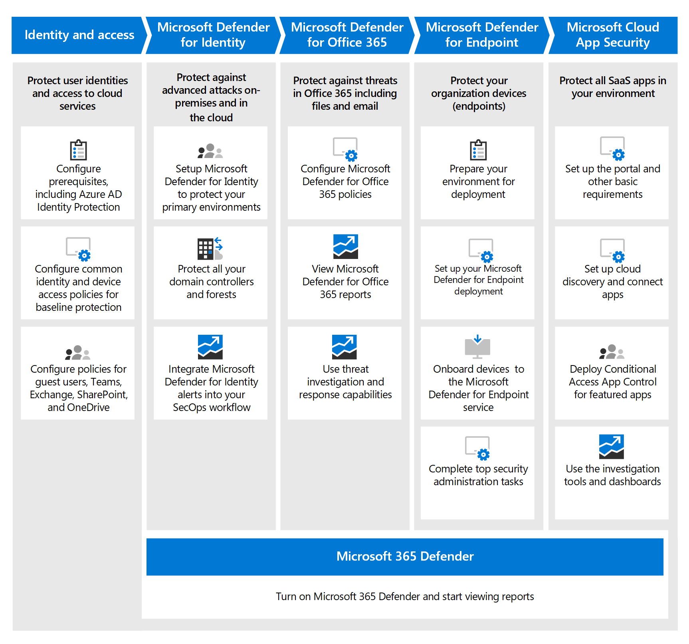

# Implementar capacidades de protección contra amenazas en Microsoft 365 E5

Esta solución describe las potentes capacidades de protección contra amenazas en Microsoft 365 E5 y por qué estas capacidades son importantes. Lea esta solución para obtener información general sobre lo que se incluye en Microsoft 365 E5, cómo funcionan las capacidades de protección contra amenazas y cómo configurar y configurar la protección contra amenazas en su organización.

## Por qué la protección contra amenazas es importante 

[El malware](/windows/security/threat-protection/intelligence/understanding-malware)y los ciberataques sofisticados, como las [amenazas sin](/windows/security/threat-protection/intelligence/fileless-threats)archivos, son una ocurrencia común. Las empresas deben protegerse a sí mismas y a sus clientes con capacidades de seguridad de IT eficaces. Los ciberataques pueden causar problemas importantes para su organización, que van desde una pérdida de confianza hasta problemas financieros, tiempos de inactividad que amenazan la empresa y mucho más. La protección contra amenazas es importante, pero puede resultar difícil determinar dónde enfocar el tiempo, el esfuerzo y los recursos de la organización. Microsoft 365 E5 puede ayudarle. 

Las soluciones de seguridad de Microsoft están integradas en nuestros productos y servicios. Las capacidades de automatización y aprendizaje automático reducen la carga en los equipos de seguridad para asegurarse de que se abordan los elementos correctos. Y la solidez de las soluciones de seguridad de Microsoft se basa en trillones de señales que procesamos todos los días en nuestro [gráfico de seguridad inteligente.](/graph/security-concept-overview) Las soluciones de seguridad de [Microsoft 365 incluyen Microsoft 365 Defender,](../security/defender/microsoft-365-defender.md)una solución que reúne señales en su correo electrónico, datos, dispositivos e identidades para pintar una imagen de amenazas avanzadas contra su organización.

Vea este vídeo para obtener información general del proceso.
  
> [!VIDEO https://www.microsoft.com/videoplayer/embed/RE4vsI7]

## Protección contra amenazas en Microsoft 365 E5

[Microsoft 365 E5](https://www.microsoft.com/microsoft-365/enterprise-e5-business-software?activetab=pivot%3aoverviewtab) le permite proteger su organización con inteligencia integrada adaptable. Con las características de protección contra amenazas de Microsoft 365 E5, puede detectar e investigar amenazas avanzadas, identidades comprometidas y acciones malintencionadas en su entorno local y en la nube.

En Microsoft 365 E5, las capacidades de protección contra amenazas están integradas de forma predeterminada. Las señales de cada funcionalidad agregan fuerza a la capacidad general de detectar y responder a las amenazas. El conjunto combinado de capacidades ofrece la mejor protección para las organizaciones, especialmente las organizaciones nacionales, en comparación con la ejecución de productos que no son de Microsoft. En la siguiente imagen se muestran los servicios y capacidades de protección contra amenazas de Microsoft 365 E5 que se describen en este artículo.

Microsoft 365 Defender reúne las señales y los datos en un centro de seguridad unificado [de Microsoft 365.](/microsoft-365/security/defender/overview-security-center) 

> [!div class="mx-imgBorder"]
> 

En la siguiente ilustración se muestra una ruta de acceso recomendada para implementar estas capacidades individuales. 

> [!div class="mx-imgBorder"]
> 

|Solución/funcionalidades  |Description  |
|---------|---------|
|Autenticación multifactor y acceso condicional     |Proteger contra identidades y dispositivos en peligro. Comience con esta protección porque es fundamental. La configuración recomendada en esta guía incluye Azure AD Identity Protection como requisito previo.     |
|Microsoft Defender for Identity     |  Una solución de seguridad basada en la nube que aprovecha las señales locales de Servicios de dominio de Active Directory (AD DS) para identificar, detectar e investigar amenazas avanzadas, identidades comprometidas y acciones internas malintencionadas dirigidas a su organización. Céntrate en Microsoft Defender para Identity a continuación porque protege la infraestructura local y en la nube, no tiene dependencias ni requisitos previos y puede proporcionar ventajas de seguridad inmediatas. | 
|Microsoft Defender para Office 365     | Protege su organización contra las amenazas malintencionadas que suponen los mensajes de correo electrónico, los vínculos (URL) y las herramientas de colaboración. Protecciones para malware, phishing, suplantación de identidad y otros tipos de ataques. A continuación, se recomienda configurar Microsoft Defender para Office 365 porque el control de cambios, la migración de la configuración desde el sistema actual y otras consideraciones pueden tardar más tiempo en implementarse. 
**NOTA:** Asegúrese de configurar las capacidades de protección contra amenazas que se incluyen en todas las suscripciones de Office 365 (Exchange Online Protection).       |
|Microsoft Defender para punto de conexión    | Una plataforma de protección de puntos de conexión que ayuda a prevenir, detectar, investigar y responder a amenazas avanzadas.  Defender for Endpoint puede tardar algún tiempo en implementarse, pero la configuración puede realizarse en paralelo con otras funcionalidades.   |
|Microsoft Cloud App Security     |   Un agente de seguridad de acceso a la nube para la detección, investigación y gobierno. Puedes habilitar Microsoft Cloud App Security pronto para empezar a recopilar datos e información. Implementar información y otra protección dirigida en las aplicaciones SaaS implica planear y puede tardar más tiempo.       | 

> [!TIP]
> Las organizaciones que tienen varios equipos de seguridad pueden implementar estas funcionalidades en paralelo. 

## Planear la implementación de la solución de protección contra amenazas

En el siguiente diagrama se muestra el proceso de alto nivel para implementar funcionalidades de protección contra amenazas. 

Para asegurarse de que su organización tiene la mejor protección posible, configure e implemente la solución de seguridad mediante un proceso que incluya los siguientes pasos:

1. [Configurar la autenticación multifactor y las directivas de acceso condicional.](deploy-threat-protection-configure.md#step-1-set-up-multi-factor-authentication-and-conditional-access-policies)
2. [Configurar Microsoft Defender para identity](deploy-threat-protection-configure.md#step-2-configure-microsoft-defender-for-identity).
3. [Active Microsoft 365 Defender](deploy-threat-protection-configure.md#step-3-turn-on-microsoft-365-defender).
4. [Configurar Defender para Office 365](deploy-threat-protection-configure.md#step-4-configure-microsoft-defender-for-office-365).
5. [Configurar Microsoft Defender para endpoint](deploy-threat-protection-configure.md#step-5-configure-microsoft-defender-for-endpoint).
6. [Configurar Microsoft Cloud App Security](deploy-threat-protection-configure.md#step-6-configure-microsoft-cloud-app-security).
7. [Supervisar el estado y realizar acciones](deploy-threat-protection-configure.md#step-7-monitor-status-and-take-actions).
8. [Entrenar usuarios](deploy-threat-protection-configure.md#step-8-train-users).

Las características de protección contra amenazas se pueden configurar en paralelo, por lo que si tiene varios equipos de seguridad de red responsables de diferentes servicios, pueden configurar las características de protección de la organización al mismo tiempo.

## Paso siguiente

Continúe con [Configurar las capacidades de protección contra amenazas en Microsoft 365](deploy-threat-protection-configure.md).

