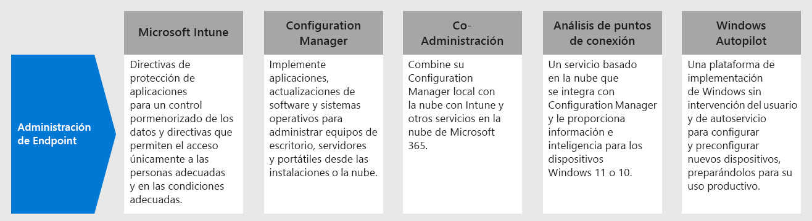

# Paso 4.Step 4. Implementar la administración de puntos de conexión para dispositivos, equipos y otros puntos de conexiónDeploy endpoint management for your devices, PCs, and other endpoints

Con los trabajadores remotos, hay que dar soporte a un número cada vez mayor de dispositivos personales.With remote workers, you need to support a growing number of personal devices. La administración de puntos de conexión es un planteamiento de seguridad basado en directivas que requiere que los dispositivos cumplan determinados criterios antes de que se les conceda acceso a los recursos.Endpoint management is a policy-based approach to security that requires devices to comply with specific criteria before they are granted access to resources. Microsoft Endpoint Manager ofrece funcionalidades de administración modernas para proteger los datos en la nube y en los entornos locales.Microsoft Endpoint Manager delivers modern management capabilities to keep your data secure in the cloud and on-premises. 

Endpoint Manager proporciona servicios y herramientas para administrar dispositivos móviles, equipos de escritorio, equipos virtuales, dispositivos incorporados y servidores mediante la combinación de los siguientes servicios, los cuales puede que ya conozca o esté usando.Endpoint Manager provides services and tools for managing mobile devices, desktop computers, virtual machines, embedded devices, and servers by combining the following services you may already know and be using.

## Microsoft IntuneMicrosoft Intune

Microsoft Intune es un servicio basado en la nube que se centra en la administración de dispositivos móviles (MDM) y en la administración de aplicaciones móviles (MAM) y está incluido con Microsoft 365.Microsoft Intune is a cloud-based service that focuses on mobile device management (MDM) and mobile application management (MAM) that is included with Microsoft 365. 

- **MDM:** Para los dispositivos que pertenecen a la organización, puede ejercer un control total que incluya la configuración, las características y la seguridad.**MDM:** For organization-owned devices, you can exercise full control including settings, features, and security. Los dispositivos se "inscriben" en Intune, donde reciben las directivas de Intune con reglas y configuraciones.Devices are "enrolled" in Intune where they receive Intune policies with rules and settings. Por ejemplo, puede establecer requisitos para la contraseña y el PIN, crear una conexión VPN, configurar la protección contra amenazas y mucho más.For example, you can set password and PIN requirements, create a VPN connection, set up threat protection, and more.

- **MAM:** Es posible que los trabajadores remotos no quieran que usted tenga el control total de sus dispositivos personales, conocidos también como dispositivos Bring Your Own Device (BYOD).**MAM:** Remote workers might not want you to have full control on their personal devices, also known as bring-your-own device (BYOD) devices. Puede ofrecer opciones a los trabajadores remotos y seguir protegiendo su organización.You can give your remote workers options and still protect your organization. Por ejemplo, los trabajadores remotos pueden inscribir sus dispositivos si quieren acceso total a los recursos de la organización.For example, remote workers can enroll their devices if they want full access to your organization resources. O bien, si estos usuarios solo quieren tener acceso al correo electrónico o a Microsoft Teams, entonces use las directivas de protección de aplicaciones que requieren la autenticación multifactor (MFA) para usar estas aplicaciones.Or, if these users only want access to email or Microsoft Teams, then use app protection policies that require multi-factor authentication (MFA) to use these apps.

Para obtener más información, vea esta [introducción a Microsoft Intune](https://docs.microsoft.com/intune/fundamentals/what-is-intune).For more information, see this [overview of Microsoft Intune](https://docs.microsoft.com/intune/fundamentals/what-is-intune).

## Configuration ManagerConfiguration Manager

Configuration Manager es una solución de administración local que permite administrar equipos de escritorio, servidores y portátiles en la red o en Internet.Configuration Manager is an on-premises management solution to manage desktops, servers, and laptops that are on your network or internet-based. Puede usar Configuration Manager para implementar aplicaciones, actualizaciones de software y sistemas operativos.Use Configuration Manager to deploy apps, software updates, and operating systems. También puede supervisar el cumplimiento, hacer consultas y realizar acciones en los clientes en tiempo real, y mucho más.You can also monitor compliance, query and act on clients in real time, and much more. Puede habilitarlo en la nube para integrarlo con Intune, Azure AD, Protección contra amenazas avanzada de Microsoft Defender y otros servicios en la nube.You can cloud-enable it to integrate with Intune, Azure AD, Microsoft Defender ATP, and other cloud services. 

Para obtener más información, vea esta [introducción a Configuration Manager](https://docs.microsoft.com/mem/configmgr/core/understand/introduction).For more information, see this [overview of Configuration Manager](https://docs.microsoft.com/mem/configmgr/core/understand/introduction).

## Administración conjuntaCo-management

La coadministración combina la inversión local existente de Configuration Manager con la nube por medio de Intune y otros servicios en la nube de Microsoft 365.Co-management combines your existing on-premises Configuration Manager investment with the cloud using Intune and other Microsoft 365 cloud services. Puede usar tanto el administrador de configuración como Intune como autoridad de administración para las diferentes cargas de trabajo.You choose whether Configuration Manager or Intune is the management authority for different workload. 

La administración conjunta usa las características en la nube basadas en Intune, incluyendo el acceso condicional y la aplicación de la conformidad con los dispositivos.Co-management uses Intune-based cloud features, including Conditional Access and enforcing device compliance. Puede mantener algunas de las tareas en el entorno local y ejecutar las demás en la nube.You keep some tasks on-premises, while running other tasks in the cloud.

Para obtener más información, vea esta [introducción a la administración conjunta](https://docs.microsoft.com/mem/configmgr/comanage/overview).For more information, see this [overview of co-management](https://docs.microsoft.com/mem/configmgr/comanage/overview).

## Análisis de escritorioDesktop Analytics

Análisis de escritorio es un servicio basado en la nube que se integra con Configuration Manager y proporciona información e inteligencia que permiten fundamentar la toma de decisiones con respecto a los clientes de Windows.Desktop Analytics is a cloud-based service that integrates with Configuration Manager and provides you with insight and intelligence so you can make informed decisions about your Windows clients. Combina datos de la organización con datos agregados de millones de dispositivos conectados a los servicios en la nube de Microsoft.It combines data from your organization with data aggregated from millions of devices connected to Microsoft cloud services. 

Con el análisis de escritorio, puede:With Desktop Analytics, you can:

- Crear un inventario de las aplicaciones que se ejecutan en la organización.Create an inventory of apps running in your organization.
- Evaluar la compatibilidad de aplicaciones con las últimas actualizaciones de características de Windows 10.Assess app compatibility with the latest Windows 10 feature updates.
- Identificar problemas de compatibilidad y recibir sugerencias de mitigación basadas en las perspectivas sobre los datos habilitadas en la nube.Identify compatibility issues, and receive mitigation suggestions based on cloud-enabled data insights.
- Crear grupos piloto que representen toda la aplicación y el estado del controlador a través de un conjunto mínimo de dispositivos.Create pilot groups that represent the entire application and driver estate across a minimal set of devices.
- Implementar Windows 10 en los dispositivos de prueba piloto y en producción.Deploy Windows 10 to pilot and production-managed devices.

Para obtener más información, vea esta [introducción a Análisis de escritorio](https://docs.microsoft.com/mem/configmgr/desktop-analytics/overview).For more information, see this [overview of Desktop Analytics](https://docs.microsoft.com/mem/configmgr/desktop-analytics/overview)

## Windows AutopilotWindows Autopilot

Windows Autopilot es una plataforma autoservicio de implementación de Windows que no requiere intervención.Windows Autopilot is a zero-touch, self-service Windows deployment platform. Incluye una colección de tecnologías para configurar y preconfigurar nuevos dispositivos, así como para prepararlos para un uso productivo.It includes a collection of technologies used to set up and pre-configure new devices, getting them ready for productive use. También se puede usar Windows Autopilot para restablecer, reasignar y recuperar dispositivos.You can also use Windows Autopilot to reset, repurpose and recover devices. 

Windows Autopilot le permite a un departamento de TI preconfigurar los dispositivos con poca o ninguna infraestructura que administrar y con un proceso fácil y sencillo.Windows Autopilot enables an IT department to pre-configure devices with little to no infrastructure to manage, with a process that's easy and simple. 

- Desde el punto de vista del usuario, solo se requieren algunas operaciones sencillas para que el dispositivo esté listo para su uso.From the user's perspective, it only takes a few simple operations to make their device ready to use. 
- Desde el punto de vista de los profesionales de TI, la única interacción necesaria por parte del usuario final es conectarse a una red y comprobar sus credenciales.From the IT pro's perspective, the only interaction required from the end user is to connect to a network and to verify their credentials.

Para obtener más información, vea esta [introducción a Windows Autopilot](https://docs.microsoft.com/windows/deployment/windows-autopilot/windows-autopilot).For more information, see this [overview of Windows Autopilot](https://docs.microsoft.com/windows/deployment/windows-autopilot/windows-autopilot).

## Recursos técnicos administrativos para la administración de puntos de conexiónAdmin technical resources for endpoint management

- [Vídeo 3.ª parte sobre la administración de dispositivos con Windows 10 para trabajadores remotosThe Part 3 video on managing Windows 10 devices for remote workers](https://resources.techcommunity.microsoft.com/enabling-remote-work/#security)
- [Vídeo 5.ª parte sobre la administración de los exploradores y los equipos de escritorio de los usuarios remotosThe Part 5 video on managing user desktops and browsers for remote workers](https://resources.techcommunity.microsoft.com/enabling-remote-work/#security)
- [Implementar una infraestructura de movilidad para Microsoft 365Deploy a mobility infrastructure for Microsoft 365](https://docs.microsoft.com/microsoft-365/enterprise/mobility-infrastructure)
- [Cómo inscribir diferentes tipos de dispositivos para la administración de dispositivos móvilesHow to enroll different types of devices for mobile device management](https://docs.microsoft.com/mem/intune/enrollment/device-enrollment)
- [Cómo instruir a los usuarios finales sobre Microsoft IntuneHow to educate your end users about Microsoft Intune](https://docs.microsoft.com/mem/intune/fundamentals/end-user-educate)
 
## Resultados del paso 3Results of Step 3

Ya está usando el conjunto de características y funcionalidades de Endpoint Manager para administrar dispositivos móviles, equipos de escritorio, máquinas virtuales, dispositivos incorporados y servidores.You are using the suite of Endpoint Manager features and capabilities to manage mobile devices, desktop computers, virtual machines, embedded devices, and servers.

## Paso siguienteNext step

Continúe con el [paso 5](empower-people-to-work-remotely-teams-productivity-apps.md) para que los trabajadores remotos usen las aplicaciones de productividad de Microsoft 365, como Microsoft Teams.Continue with [Step 5](empower-people-to-work-remotely-teams-productivity-apps.md) to get your remote workers using Microsoft 365 productivity apps such as Microsoft Teams.
