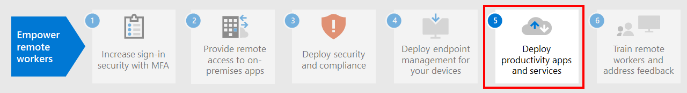

# Paso 4. Implementar la administración de puntos de conexión para dispositivos, equipos y otros puntos de conexión

Con los trabajadores remotos, hay que dar soporte a un número cada vez mayor de dispositivos personales. La administración de puntos de conexión es un planteamiento de seguridad basado en directivas que requiere que los dispositivos cumplan determinados criterios antes de que se les conceda acceso a los recursos. Microsoft Endpoint Manager ofrece funcionalidades de administración modernas para proteger los datos en la nube y en los entornos locales. 

[Microsoft Endpoint Manager](/mem/endpoint-manager-overview) proporciona servicios y herramientas para administrar dispositivos móviles, equipos de escritorio, equipos virtuales, dispositivos incorporados y servidores mediante la combinación de los siguientes servicios, los cuales puede que ya conozca o esté usando.

## Microsoft Intune

Microsoft Intune es un servicio basado en la nube que se centra en la administración de dispositivos móviles (MDM) y en la administración de aplicaciones móviles (MAM) y está incluido con Microsoft 365. 

- **MDM:** Para los dispositivos que pertenecen a la organización, puede ejercer un control total que incluya la configuración, las características y la seguridad. Los dispositivos se "inscriben" en Intune, donde reciben las directivas de Intune con reglas y configuraciones. Por ejemplo, puede establecer requisitos para la contraseña y el PIN, crear una conexión VPN, configurar la protección contra amenazas y mucho más.

- **MAM:** Es posible que los trabajadores remotos no quieran que usted tenga el control total de sus dispositivos personales, conocidos también como dispositivos Bring Your Own Device (BYOD). Puede ofrecer opciones a los trabajadores remotos y seguir protegiendo su organización. Por ejemplo, los trabajadores remotos pueden inscribir sus dispositivos si quieren acceso total a los recursos de la organización. O bien, si estos usuarios solo quieren tener acceso al correo electrónico o a Microsoft Teams, entonces use las directivas de protección de aplicaciones que requieren la autenticación multifactor (MFA) para usar estas aplicaciones.

Para obtener más información, vea esta [introducción a Microsoft Intune](/intune/fundamentals/what-is-intune).

## Configuration Manager

Configuration Manager es una solución de administración local que permite administrar equipos de escritorio, servidores y portátiles en la red o en Internet. Puede usar Configuration Manager para implementar aplicaciones, actualizaciones de software y sistemas operativos. También puede supervisar el cumplimiento, hacer consultas y realizar acciones en los clientes en tiempo real, y mucho más. Puede habilitarlo en la nube para integrarlo con Intune, Azure AD, Microsoft Defender para punto de conexión y otros servicios en la nube. 

Para obtener más información, vea esta [introducción a Configuration Manager](/mem/configmgr/core/understand/introduction).

## Administración conjunta

La coadministración combina la inversión local existente de Configuration Manager con la nube por medio de Intune y otros servicios en la nube de Microsoft 365. Puede usar tanto el administrador de configuración como Intune como autoridad de administración para las diferentes cargas de trabajo. 

La administración conjunta usa las características en la nube basadas en Intune, incluyendo el acceso condicional y la aplicación de la conformidad con los dispositivos. Puede mantener algunas de las tareas en el entorno local y ejecutar las demás en la nube.

Para obtener más información, vea esta [introducción a la administración conjunta](/mem/configmgr/comanage/overview).

## Análisis de escritorio

Análisis de escritorio es un servicio basado en la nube que se integra con Configuration Manager y proporciona información e inteligencia que permiten fundamentar la toma de decisiones con respecto a los clientes de Windows. Combina datos de la organización con datos agregados de millones de dispositivos conectados a los servicios en la nube de Microsoft. 

Con el análisis de escritorio, puede:

- Crear un inventario de las aplicaciones que se ejecutan en la organización.
- Evaluar la compatibilidad de aplicaciones con las últimas actualizaciones de características de Windows 10.
- Identificar problemas de compatibilidad y recibir sugerencias de mitigación basadas en las perspectivas sobre los datos habilitadas en la nube.
- Crear grupos piloto que representen toda la aplicación y el estado del controlador a través de un conjunto mínimo de dispositivos.
- Implementar Windows 10 en los dispositivos de prueba piloto y en producción.

Para obtener más información, vea esta [introducción a Análisis de escritorio](/mem/configmgr/desktop-analytics/overview).

## Windows Autopilot

Windows Autopilot es una plataforma autoservicio de implementación de Windows que no requiere intervención. Incluye una colección de tecnologías para configurar y preconfigurar nuevos dispositivos, así como para prepararlos para un uso productivo. También se puede usar Windows Autopilot para restablecer, reasignar y recuperar dispositivos. 

Windows Autopilot le permite a un departamento de TI preconfigurar los dispositivos con poca o ninguna infraestructura que administrar y con un proceso fácil y sencillo. 

- Desde el punto de vista del usuario, solo se requieren algunas operaciones sencillas para que el dispositivo esté listo para su uso. 
- Desde el punto de vista de los profesionales de TI, la única interacción necesaria por parte del usuario final es conectarse a una red y comprobar sus credenciales.

Para obtener más información, vea esta [introducción a Windows Autopilot](/windows/deployment/windows-autopilot/windows-autopilot).

## Recursos técnicos administrativos para la administración de puntos de conexión

- [Guía básica de administración de dispositivos para Microsoft 365](../enterprise/device-management-roadmap-microsoft-365.md)
- [Cómo inscribir diferentes tipos de dispositivos para la administración de dispositivos móviles](/mem/intune/enrollment/device-enrollment)
- [Cómo instruir a los usuarios finales sobre Microsoft Intune](/mem/intune/fundamentals/end-user-educate)
 
## Resultados del paso 4

Ya está usando el conjunto de características y funcionalidades de Endpoint Manager para administrar dispositivos móviles, equipos de escritorio, máquinas virtuales, dispositivos incorporados y servidores.

## Paso siguiente

Continúe con el [paso 5](empower-people-to-work-remotely-teams-productivity-apps.md) para que los trabajadores remotos usen las aplicaciones de productividad de Microsoft 365, como Microsoft Teams.