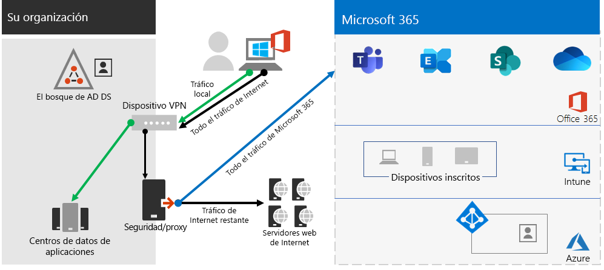
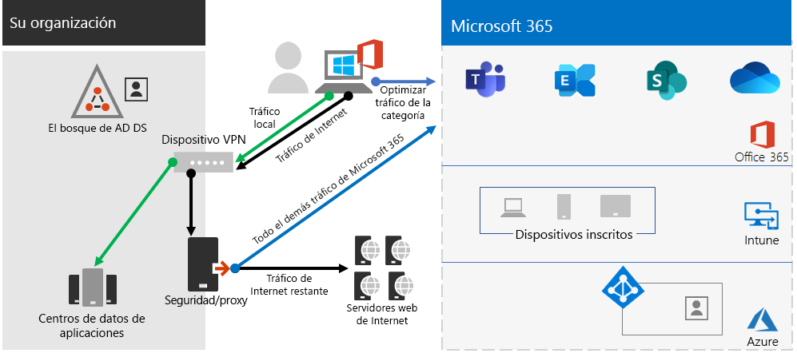
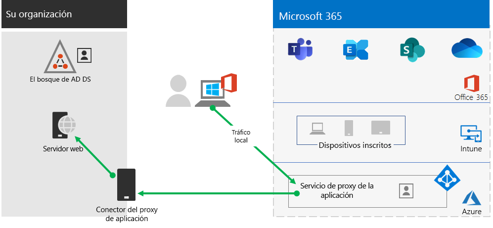
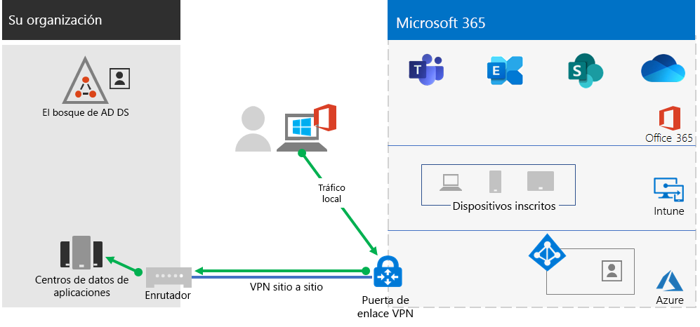

# Paso 2.Step 2. Proporcionar acceso remoto a los servicios y aplicaciones localesProvide remote access to on-premises apps and services

Si en su organización se usa una solución de VPN de acceso remoto, habitualmente una con los servidores VPN en el perímetro de la red y los clientes de VPN se instalados en los dispositivos de los usuarios, los usuarios pueden usar conexiones VPN de acceso remoto para tener acceso a los servidores y aplicaciones locales.If your organization uses a remote access VPN solution, typically with VPN servers on the edge of your network and VPN clients installed on your users' devices, your users can use remote access VPN connections to access on-premises apps and servers. Pero es posible que necesite optimizar el tráfico a los servicios basados en la nube de Microsoft 365.But you may need to optimize traffic to Microsoft 365 cloud-based services.

Si los usuarios no usan una solución de VPN, puede usar el proxy de aplicación de Azure Active Directory (Azure AD) y la VPN de punto a sitio de Azure (P2S) para ofrecer acceso en función de si todas las aplicaciones se basan en la web.If your users do not use a VPN solution, you can use Azure Active Directory (Azure AD) Application Proxy and Azure Point-to-Site (P2S) VPN to provide access, depending on whether all your apps are web-based.

Existen tres configuraciones principales:There are three primary configurations:

1. Ya está usando una solución de VPN de acceso remoto.You are already using a remote access VPN solution.
2. No está usando una solución de VPN de acceso remoto, tiene una identidad híbrida y solo necesita el acceso remoto a aplicaciones locales basadas en la web.You are not using a remote access VPN solution, you have hybrid identity, and you need remote access only to on-premises web-based apps.
3. No está usando una solución de VPN de acceso remoto y necesita tener acceso a las aplicaciones locales, algunas de las cuales no se basan en la web.You are not using a remote access VPN solution and you need access to on-premises apps, some of which are not web-based.

Con conexiones de acceso remoto, también puede usar [Escritorio remoto](https://support.microsoft.com/help/4028379/windows-10-how-to-use-remote-desktop) para conectar a los usuarios a un equipo local.With remote access connections, you can also use [Remote Desktop](https://support.microsoft.com/help/4028379/windows-10-how-to-use-remote-desktop) to connect your users to an on-premises PC. Por ejemplo, un trabajador remoto puede usar Escritorio remoto para conectarse al equipo en su oficina desde su dispositivo Windows, iOS o Android.For example, a remote worker can use Remote Desktop to connect to the PC in their office from their Windows, iOS or Android device. Una vez que estén conectados de forma remota, podrán usarlo como si estuvieran sentados frente a él.Once they are remotely connected, they can use it as if they were sitting in front of it.

## Optimizar el rendimiento de los clientes VPN de acceso remoto a los servicios en la nube de Microsoft 365Optimize performance for remote access VPN clients to Microsoft 365 cloud services

Si los trabajadores remotos usan un cliente VPN tradicional para obtener acceso remoto a la red de su organización, compruebe que el cliente VPN tiene compatibilidad de túnel dividido.If your remote workers are using a traditional VPN client to obtain remote access to your organization network, verify that the VPN client has split tunneling support.

Sin el túnel dividido, todo el tráfico de trabajo remoto se envía por la conexión VPN, donde debe reenviarse a los dispositivos perimetrales de la organización, procesarse y, después, enviarse por Internet.Without split tunneling, all of your remote work traffic gets sent across the VPN connection, where it must be forwarded to your organization’s edge devices, get processed, and then sent on the Internet.

El tráfico de Microsoft 365 debe tomar una ruta indirecta en la organización, lo que puede reenviarse a un punto de entrada de la red de Microsoft lejos de la ubicación física del cliente de VPN.Microsoft 365 traffic must take an indirect route through your organization, which could be the forwarded to a Microsoft network entry point far away from the VPN client’s physical location. Esta ruta indirecta agrega latencia al tráfico de red y reduce el rendimiento general.This indirect path adds latency to the network traffic and decreases overall performance. 

Con el túnel dividido, puede configurar el cliente VPN para excluir determinados tipos de tráfico de la conexión VPN a la red de la organización.With split tunneling, you can configure your VPN client to exclude specific types of traffic from being sent over the VPN connection to the organization network.

Para optimizar el acceso a los recursos en la nube de Microsoft 365, configure los clientes VPN de túnel dividido para excluir el tráfico a los puntos de conexión de Microsoft 365 de la categoría **Optimizar** por la conexión VPN.To optimize access to Microsoft 365 cloud resources, configure your split tunneling VPN clients to exclude traffic to the **Optimize** category Microsoft 365 endpoints over the VPN connection. Para obtener más información, consulte [Office 365 endpoint categories](https://docs.microsoft.com/office365/enterprise/office-365-network-connectivity-principles#new-office-365-endpoint-categories) (Categorías de puntos de conexión de Office 365).For more information, see [Office 365 endpoint categories](https://docs.microsoft.com/office365/enterprise/office-365-network-connectivity-principles#new-office-365-endpoint-categories). Vea la lista de puntos de conexión de la categoría Optimizar [aquí](https://docs.microsoft.com/office365/enterprise/urls-and-ip-address-ranges).See the list of Optimize category endpoints [here](https://docs.microsoft.com/office365/enterprise/urls-and-ip-address-ranges).

Esto permite que el cliente VPN envíe y reciba tráfico esencial de servicio en la nube de Microsoft 365 directamente por Internet y al punto de entrada más cercano a la red de Microsoft.This allows the VPN client to send and receive crucial Microsoft 365 cloud service traffic directly over the Internet and to the nearest entry point into the Microsoft network.

Para obtener más información e instrucciones, consulte [Optimizar la conectividad de Office 365 para usuarios remotos usando el túnel dividido de VPN](https://docs.microsoft.com/office365/enterprise/office-365-vpn-split-tunnel).For more information and guidance, see [Optimize Office 365 connectivity for remote users using VPN split tunneling](https://docs.microsoft.com/office365/enterprise/office-365-vpn-split-tunnel).

## Implementación del acceso remoto cuando todas las aplicaciones son aplicaciones web y tiene una identidad híbridaDeploy remote access when all your apps are web apps and you have hybrid identity

Si los trabajadores remotos no usan un cliente VPN tradicional y las cuentas de usuario y los grupos locales se sincronizan con Azure AD, puede usar el proxy de la aplicación de Azure AD para proporcionar acceso remoto seguro para aplicaciones basadas en web que se encuentren en servidores de intranet.If your remote workers are not using a traditional VPN client and your on-premises user accounts and groups are synchronized with Azure AD, you can use Azure AD Application Proxy to provide secure remote access for web-based applications hosted on intranet servers. Entre las aplicaciones basadas en web se incluyen los sitios de SharePoint, los servidores de Outlook Web Access, o cualquier otra línea de aplicaciones empresariales basada en web.Web-based applications include SharePoint sites, Outlook Web Access servers, or any other web-based line of business applications. 

Estos son los componentes del proxy de la aplicación Azure AD.Here are the components of Azure AD Application Proxy.

Para más información, vea esta [información general sobre el proxy de aplicación de Azure AD](https://docs.microsoft.com/azure/active-directory/manage-apps/application-proxy).For more information, see this [overview of Azure AD Application Proxy](https://docs.microsoft.com/azure/active-directory/manage-apps/application-proxy).

## Implementar el acceso remoto cuando no todas las aplicaciones son aplicaciones webDeploy remote access when not all your apps are web apps

Si los trabajadores remotos no usan un cliente VPN tradicional y cualquiera de las aplicaciones no está basada en web, puede usar una red privada virtual punto a sitio (P2S) de Azure.If your remote workers are not using a traditional VPN client and any of your apps are not web-based, you can use an Azure Point-to-Site (P2S) VPN.

Una conexión VPN de P2S crea una conexión segura desde el dispositivo de un trabajador remoto a la red de la organización a través de una red virtual de Azure.A P2S VPN connection creates a secure connection from a remote worker’s device to your organization network through an Azure virtual network. 

Para obtener más información, vea esta [introducción a la red virtual privada de P2S](https://docs.microsoft.com/azure/vpn-gateway/point-to-site-about).For more information, see this [overview of P2S VPN](https://docs.microsoft.com/azure/vpn-gateway/point-to-site-about).

## Implementación de Windows Virtual Desktop para proporcionar acceso remoto para trabajadores remotos con dispositivos personalesDeploy Windows Virtual Desktop to provide remote access for remote workers using personal devices 

Para dar servicio a los trabajadores remotos que solo pueden usar sus dispositivos personales y no administrados, use Windows Virtual Desktop en Azure para crear y asignar escritorios virtuales para que los usuarios puedan usarlos desde casa.To support remote workers who can only use their personal and unmanaged devices, use Windows Virtual Desktop in Azure to create and allocate virtual desktops for your users to use from home.

Los equipos virtualizados pueden funcionar exactamente igual que los equipos conectados a la red de su organización.Virtualized PCs can act just like PCs connected to your organization network.

Para obtener más información, consulte [esta introducción a Windows Virtual Desktop](https://docs.microsoft.com/azure/virtual-desktop/overview).For more information, see [this overview of Windows Virtual Desktop](https://docs.microsoft.com/azure/virtual-desktop/overview).

## Recursos técnicos administrativos para el acceso remotoAdmin technical resources for remote access

- [Cómo optimizar rápidamente el tráfico de Office 365 para el personal remoto y reducir la carga de su infraestructuraHow to quickly optimize Office 365 traffic for remote staff & reduce the load on your infrastructure](https://techcommunity.microsoft.com/t5/office-365-blog/how-to-quickly-optimize-office-365-traffic-for-remote-staff-amp/ba-p/1214571)
- [Optimizar la conectividad de Office 365 para usuarios remotos que usan túnel dividido de VPNOptimize Office 365 connectivity for remote users using VPN split tunneling](https://docs.microsoft.com/office365/enterprise/office-365-vpn-split-tunnel)

## Resultados del paso 2Results of Step 2

Después de implementar una solución de acceso remoto para los trabajadores remotos:After deployment of a remote access solution for your remote workers:

| Configuración de acceso remotoRemote access configuration | ResultadosResults |
|:-------|:-----|
| Se ha establecido una solución de VPN de acceso remotoA remote access VPN solution is in place | Se configuró el cliente VPN de acceso remoto para túnel dividido y para la categoría Optimizar de los puntos de conexión de Microsoft 365.You have configured your remote access VPN client for split tunneling and for the Optimize category of Microsoft 365 endpoints. |
| No cuenta con una solución de VPN de acceso remoto y solo necesita el acceso remoto a aplicaciones locales basadas en la webNo remote access VPN solution and you need remote access only to on-premises web-based apps | Configuró el proxy de aplicación de Azure.You have configured Azure Application Proxy. |
| No está usando una solución de VPN de acceso remoto y necesita tener acceso a las aplicaciones locales, algunas de las cuales no se basan en la webNo remote access VPN solution and you need access to on-premises apps, some of which are not web-based | Configuró la red privada virtual de P2S de Azure.You have configured Azure P2S VPN. |
| Los trabajadores remotos usan sus dispositivos personales desde casaRemote workers are using their personal devices from home | Configuró Windows Virtual Desktop.You have configured Windows Virtual Desktop. |
|||

## Paso siguienteNext step

Continúe con el [Paso 3](empower-people-to-work-remotely-manage-endpoints.md) para administrar los dispositivos, equipos y otros puntos de conexión.Continue with [Step 3](empower-people-to-work-remotely-manage-endpoints.md) to manage your devices, PCs, and other endpoints.
