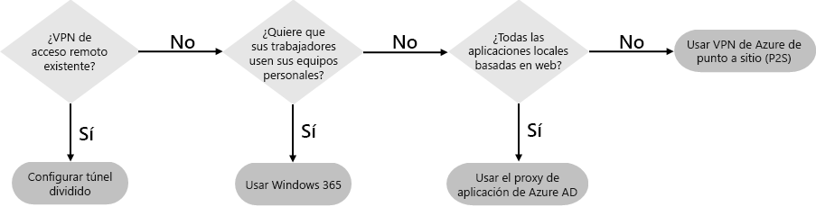
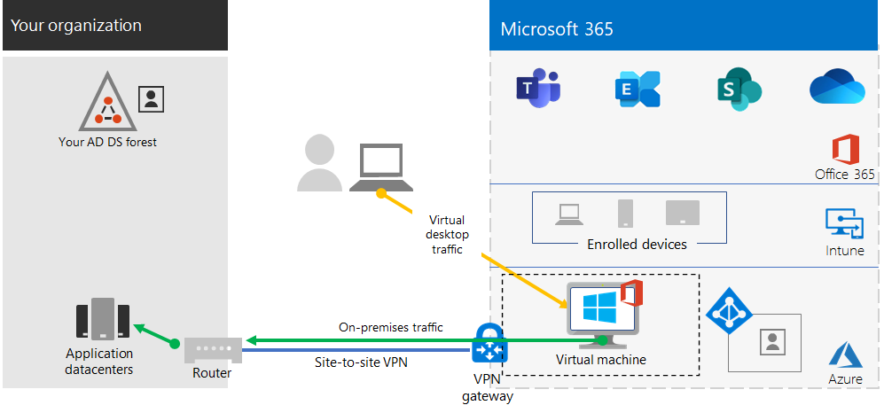

# Paso 2. Proporcionar acceso remoto a los servicios y aplicaciones locales

Si en su organización se usa una solución de VPN de acceso remoto, habitualmente una con los servidores VPN en el perímetro de la red y los clientes de VPN se instalados en los dispositivos de los usuarios, los usuarios pueden usar conexiones VPN de acceso remoto para tener acceso a los servidores y aplicaciones locales. Pero es posible que necesite optimizar el tráfico a los servicios basados en la nube de Microsoft 365.

Si los usuarios no usan una solución de VPN, puede usar el proxy de aplicación de Azure Active Directory (Azure AD) y la VPN de punto a sitio de Azure (P2S) para ofrecer acceso en función de si todas las aplicaciones se basan en la web.

Existen tres configuraciones principales:

1. Ya está usando una solución de VPN de acceso remoto.
2. No está usando una solución de VPN de acceso remoto, tiene una identidad híbrida y solo necesita el acceso remoto a aplicaciones locales basadas en la web.
3. No está usando una solución de VPN de acceso remoto y necesita tener acceso a aplicaciones locales, algunas de las cuales no se basan en la web.

Vea este diagrama de flujo para ver las opciones de configuración de acceso remoto descritas en este artículo.

Con conexiones de acceso remoto, también puede usar [Escritorio remoto](https://support.microsoft.com/help/4028379/windows-10-how-to-use-remote-desktop) para conectar a los usuarios a un equipo local. Por ejemplo, un trabajador remoto puede usar Escritorio remoto para conectarse al equipo en su oficina desde su dispositivo Windows, iOS o Android. Una vez que estén conectados de forma remota, podrán usarlo como si estuvieran sentados frente a él.

## Optimizar el rendimiento de los clientes VPN de acceso remoto a los servicios en la nube de Microsoft 365

Si los trabajadores remotos usan un cliente VPN tradicional para obtener acceso remoto a la red de su organización, compruebe que el cliente VPN tiene compatibilidad de túnel dividido.

Sin el túnel dividido, todo el tráfico de trabajo remoto se envía por la conexión VPN, donde debe reenviarse a los dispositivos perimetrales de la organización, procesarse y, después, enviarse por Internet.

El tráfico de Microsoft 365 debe tomar una ruta indirecta en la organización, lo que puede reenviarse a un punto de entrada de la red de Microsoft lejos de la ubicación física del cliente de VPN. Esta ruta indirecta agrega latencia al tráfico de red y reduce el rendimiento general. 

Con el túnel dividido, puede configurar el cliente VPN para excluir determinados tipos de tráfico de la conexión VPN a la red de la organización.

Para optimizar el acceso a los recursos en la nube de Microsoft 365, configure los clientes VPN de túnel dividido para excluir el tráfico a los puntos de conexión de Microsoft 365 de la categoría **Optimizar** por la conexión VPN. Para obtener más información, consulte [Office 365 endpoint categories](https://docs.microsoft.com/microsoft-365/enterprise/microsoft-365-network-connectivity-principles#new-office-365-endpoint-categories) (Categorías de puntos de conexión de Office 365). Vea la lista de puntos de conexión de la categoría Optimizar [aquí](https://docs.microsoft.com/microsoft-365/enterprise/urls-and-ip-address-ranges).

Esto permite que el cliente VPN envíe y reciba tráfico esencial de servicio en la nube de Microsoft 365 directamente por Internet y al punto de entrada más cercano a la red de Microsoft.

Para obtener más información e instrucciones, consulte [Optimizar la conectividad de Office 365 para usuarios remotos usando el túnel dividido de VPN](https://docs.microsoft.com/microsoft-365/enterprise/microsoft-365-vpn-split-tunnel??).

## Implementación del acceso remoto cuando todas las aplicaciones son aplicaciones web y tiene una identidad híbrida

Si los trabajadores remotos no usan un cliente VPN tradicional y las cuentas de usuario y los grupos locales se sincronizan con Azure AD, puede usar el proxy de la aplicación de Azure AD para proporcionar acceso remoto seguro para aplicaciones basadas en web que se encuentren en servidores de intranet. Entre las aplicaciones basadas en web se incluyen los sitios de SharePoint, los servidores de Outlook Web Access, o cualquier otra línea de aplicaciones empresariales basada en web. 

Estos son los componentes del proxy de la aplicación Azure AD.

Para obtener más información, vea este [resumen sobre el proxy de aplicación de Azure AD](https://docs.microsoft.com/azure/active-directory/manage-apps/application-proxy) y la [tercera parte del vídeo sobre el uso del proxy de aplicación de Azure AD](https://resources.techcommunity.microsoft.com/enabling-remote-work/#security).

>[!Note]
>El proxy de aplicación de Azure AD no está incluido en una suscripción de Microsoft 365. Debe pagar para usarlo con una suscripción de Azure por separado.
>

## Implementar el acceso remoto cuando no todas las aplicaciones son aplicaciones web

Si los trabajadores remotos no usan un cliente VPN tradicional y cualquiera de las aplicaciones no está basada en web, puede usar una red privada virtual punto a sitio (P2S) de Azure.

Una conexión VPN de P2S crea una conexión segura desde el dispositivo de un trabajador remoto a la red de la organización a través de una red virtual de Azure. 

Para obtener más información, vea esta [introducción a la red virtual privada de P2S](https://docs.microsoft.com/azure/vpn-gateway/point-to-site-about).

>[!Note]
>La VPN de Azure P2S no está incluida en una suscripción de Microsoft 365. Debe pagar para usarlo con una suscripción de Azure por separado.
>

## Implementación de Windows Virtual Desktop para proporcionar acceso remoto para trabajadores remotos con dispositivos personales 

Para dar servicio a los trabajadores remotos que solo pueden usar sus dispositivos personales y no administrados, use Windows Virtual Desktop en Azure para crear y asignar escritorios virtuales para que los usuarios puedan usarlos desde casa. Los equipos virtualizados pueden funcionar exactamente igual que los equipos conectados a la red de su organización.

Para obtener más información, vea: 

- [Este resumen sobre Windows Virtual Desktop](https://docs.microsoft.com/azure/virtual-desktop/overview).
- [La segunda parte del vídeo sobre el uso de Windows Virtual Desktop para los trabajadores remotos](https://resources.techcommunity.microsoft.com/enabling-remote-work/#productivity).

>[!Note]
>Windows Virtual Desktop no está incluido en una suscripción de Microsoft 365. Debe pagar para usarlo con una suscripción de Azure por separado.
>

## Proteja las conexiones de los servicios de escritorio remoto con la puerta de enlace de servicios de escritorio remoto

Si usa los servicios de escritorio remoto (RDS) para permitir que los empleados se conecten a equipos con Windows de su red local, debería usar una puerta de enlace de servicios de escritorio remoto de Microsoft en su red perimetral. La puerta de enlace usa una capa de sockets seguros (SSL) para cifrar las comunicaciones y evitar que el sistema que hospeda los RDS se exponga directamente a Internet.

Vea [este artículo](https://www.microsoft.com/security/blog/2020/04/16/security-guidance-remote-desktop-adoption/) para obtener más información.

## Recursos técnicos administrativos para el acceso remoto

- [Cómo optimizar rápidamente el tráfico de Office 365 para el personal remoto y reducir la carga de su infraestructura](https://techcommunity.microsoft.com/t5/office-365-blog/how-to-quickly-optimize-office-365-traffic-for-remote-staff-amp/ba-p/1214571)
- [Optimizar la conectividad de Office 365 para usuarios remotos que usan túnel dividido de VPN](https://docs.microsoft.com/microsoft-365/enterprise/microsoft-365-vpn-split-tunnel?)

## Resultados del paso 2

Después de implementar una solución de acceso remoto para los trabajadores remotos:

| Configuración de acceso remoto | Resultados |
|:-------|:-----|
| Se ha establecido una solución de VPN de acceso remoto | Se configuró el cliente VPN de acceso remoto para túnel dividido y para la categoría Optimizar de los puntos de conexión de Microsoft 365. |
| No cuenta con una solución de VPN de acceso remoto y solo necesita el acceso remoto a aplicaciones locales basadas en la web | Configuró el proxy de aplicación de Azure. |
| No está usando una solución de VPN de acceso remoto y necesita tener acceso a las aplicaciones locales, algunas de las cuales no se basan en la web | Configuró la red privada virtual de P2S de Azure. |
| Los trabajadores remotos usan sus dispositivos personales desde casa | Configuró Windows Virtual Desktop. |
| Los trabajadores remotos usan conexiones de RDS a sistemas locales | Ha implementado una puerta de enlace de servicios de escritorio remoto en la red perimetral. |
|||

## Paso siguiente

Continúe con el [paso 3](empower-people-to-work-remotely-security-compliance.md) para implementar los servicios de seguridad y cumplimiento de Microsoft 365 para proteger sus aplicaciones, datos y dispositivos.

