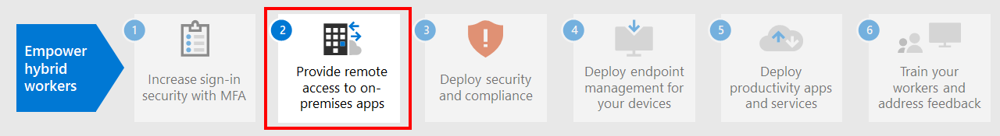

# Paso 1. Aumentar la seguridad de inicio de sesión para trabajadores remotos con MFA

Para aumentar la seguridad de los inicios de sesión de los trabajadores remotos, use la autenticación multifactor (MFA). MFA requiere que los inicios de sesión de usuario estén sujetos a una comprobación adicional más allá de la contraseña de la cuenta de usuario. Incluso si un usuario malintencionado determina la contraseña de una cuenta de usuario, también debe poder responder a una comprobación adicional, como un mensaje de texto que se envía a un smartphone, antes de que se otorgue el acceso.

Microsoft recomienda MFA para todos los trabajadores remotos, especialmente los administradores.

Existen tres formas de requerir que los usuarios usen MFA basándose en su plan de Microsoft 365.

|Plan  |Recomendación  |
|---------|---------|
|Todos los planes de Microsoft 365 (sin licencias de Azure AD Premium P1 o P2)     |[Habilitar los valores predeterminados de seguridad en Azure AD](https://docs.microsoft.com/azure/active-directory/fundamentals/concept-fundamentals-security-defaults). Los valores predeterminados de seguridad en Azure AD incluyen MFA para los usuarios y administradores.   |
|Microsoft 365 E3 (incluye las licencias de Azure AD Premium P1)     | Use [Directivas comunes de acceso condicional](https://docs.microsoft.com/azure/active-directory/conditional-access/concept-conditional-access-policy-common) para configurar las directivas siguientes:  - [Requerir MFA para los administradores](https://docs.microsoft.com/azure/active-directory/conditional-access/howto-conditional-access-policy-admin-mfa)  - [Requerir MFA para todos los usuarios](https://docs.microsoft.com/azure/active-directory/conditional-access/howto-conditional-access-policy-all-users-mfa)   - [Bloquear la autenticación heredada](https://docs.microsoft.com/azure/active-directory/conditional-access/howto-conditional-access-policy-block-legacy)       |
|Microsoft 365 E5 (incluye las licencias de Azure AD Premium P2)     | Aprovechando Azure AD Identity Protection, empiece a implementar el [conjunto recomendado de directivas de acceso condicional y relacionadas](../security/office-365-security/identity-access-policies.md) de Microsoft, creando estas dos directivas:  - [Exigir la autenticación multifactor (MFA) cuando el riesgo de inicio de sesión es medio o alto](../security/office-365-security/identity-access-policies.md#require-mfa-based-on-sign-in-risk)  - [Bloquear a los clientes que no sean compatibles con la autenticación moderna](../security/office-365-security/identity-access-policies.md#block-clients-that-dont-support-modern-authentication) - [Los usuarios de riesgo alto tienen que cambiar la contraseña](../security/office-365-security/identity-access-policies.md#high-risk-users-must-change-password)       |
| | |

## Valores predeterminados de seguridad

Los valores predeterminados de seguridad son una nueva característica para las suscripciones pago o de prueba de Microsoft 365 y Office 365 creadas después del 21 de octubre de 2019. Estas suscripciones tienen los valores predeterminados de seguridad activados, lo que **obliga a que todos los usuarios usen MFA con la aplicación Microsoft Authenticator**.
 
Los usuarios tienen 14 días para registrarse en MFA con la aplicación Microsoft Authenticator desde sus teléfonos inteligentes, que comienzan a contar desde la primera vez que inician sesión después de que se hayan habilitado los valores predeterminados de seguridad. Transcurridos 14 días, el usuario no podrá iniciar sesión hasta que el registro de MFA se haya completado.

Los valores predeterminados de seguridad garantizan que todas las organizaciones tengan un nivel básico de seguridad para el inicio de sesión de usuario habilitado de forma predeterminada. Puede deshabilitar los valores predeterminados de seguridad y usar MFA con directivas de acceso condicional o para cuentas individuales.

Para más información, vea esta [información general de los valores predeterminados de seguridad](https://docs.microsoft.com/azure/active-directory/fundamentals/concept-fundamentals-security-defaults).

## Directivas de acceso condicional

Las directivas de acceso condicional son un conjunto de reglas que especifican las condiciones en las que se evalúan y permiten los inicios de sesión. Por ejemplo, puede crear una directiva de acceso condicional que indique lo siguiente:

- Si el nombre de la cuenta de usuario es miembro de un grupo de usuarios a los que se han asignado los roles de administrador de Exchange, de usuarios, de contraseñas, de seguridad, de SharePoint o global, requerir MFA antes de permitir el acceso.

Esta directiva le permite exigir MFA en función de la pertenencia a grupos, en lugar de intentar configurar cuentas de usuario individuales para MFA cuando se asignan o se quitan estos roles de administrador.

También puede usar directivas de acceso condicionales para funciones más avanzadas, como requerir que el inicio de sesión se realice desde un dispositivo que cumpla las normativas, como su equipo portátil que ejecuta Windows 10.

El acceso condicional requiere licencias de Azure AD Premium P1, que se incluyen con Microsoft 365 E3 y E5.

Para más información, vea esta [información general sobre el acceso condicional](https://docs.microsoft.com/azure/active-directory/conditional-access/overview).

## Soporte de protección de identidad de Azure AD

Con la protección de identidad de Azure AD, puede crear una directiva de acceso condicional adicional que establezca:

- Si el riesgo del inicio de sesión se determina como medio o alto, requerir MFA.

La protección de identidad de Azure AD requiere licencias de Azure AD Premium P2, que se incluyen con Microsoft 365 E5.

Para más información, consulte [Acceso condicional basado en riesgos](https://docs.microsoft.com/azure/active-directory/conditional-access/howto-conditional-access-policy-risk#require-mfa-medium-or-high-sign-in-risk-users).

Con Azure Active Directory Identity Protection, también puede crear una directiva para obligar a los usuarios a registrarse en MFA. Para más información, consulte [Configurar la directiva de registro de autenticación multi-factor de Azure AD](https://docs.microsoft.com/azure/active-directory/identity-protection/howto-identity-protection-configure-mfa-policy)

## Usar estos métodos conjuntamente

Tenga en cuenta lo siguiente:

- No puede habilitar los valores predeterminados de seguridad si tiene habilitadas directivas de acceso condicional.
- No puede habilitar ninguna directiva de acceso condicional si tiene habilitados los valores predeterminados de seguridad.

Si los valores predeterminados de seguridad están habilitados, se le pedirá al usuario el registro de MFA y el uso de la aplicación Microsoft Authenticator. 

Esta tabla muestra los resultados de habilitar MFA con los valores predeterminados de seguridad y las directivas de acceso condicional.

| Método | Habilitado | Deshabilitado | Método de autenticación adicional |
|:-------|:-----|:-------|:-------|
| _ *Valores predeterminados de seguridad**  | No se pueden usar directivas de acceso condicional | Se pueden usar directivas de acceso condicional | Aplicación Microsoft Authenticator |
| **Directivas de acceso condicional** | Si hay alguna habilitada, no puede habilitar los valores predeterminados de seguridad | Si se deshabilitan todos, puede habilitar los valores predeterminados de seguridad  | Especificado por el usuario durante el registro de MFA  |
||||

## Permitir que los usuarios puedan restablecer sus propias contraseñas

El Restablecimiento de Contraseña de Autoservicio (SSPR) permite a los usuarios restablecer sus contraseñas sin que el personal de TI deba actuar. Los usuarios pueden restablecer las contraseñas rápidamente en cualquier momento y desde cualquier sitio. Para obtener más información, consulte [Planear una implementación de restablecimiento de contraseña de autoservicio de Azure AD](https://docs.microsoft.com/azure/active-directory/authentication/howto-sspr-deployment).

## Iniciar sesión en aplicaciones SaaS con Azure AD

Además de proporcionar autenticación en la nube para los usuarios, Azure AD también puede ser el método centralizado para proteger todas las aplicaciones, tanto si son locales como si encuentran en la nube de Microsoft o en otra nube. Con la [integración de Azure Active Directory con las aplicaciones](https://docs.microsoft.com/azure/active-directory/manage-apps/plan-an-application-integration), puede facilitar a los trabajadores remotos la detección de las aplicaciones que necesitan y el inicio de sesión en ellas de forma segura.

## Recursos técnicos de administración para MFA e identidad

- [Las 5 mejores formas en que Azure AD puede ayudarle a habilitar el trabajo remoto](https://techcommunity.microsoft.com/t5/azure-active-directory-identity/top-5-ways-your-azure-ad-can-help-you-enable-remote-work/ba-p/1144691)
- [Plan de identidad para Microsoft 365](../enterprise/identity-roadmap-microsoft-365.md)
- [Vídeos de aprendizaje de Azure Academy Azure AD](https://www.youtube.com/watch?v=pN8o0owHfI0&list=PL-V4YVm6AmwUFpC3rXr2i2piRQ708q_ia)

## Resultado del paso 1

Después de la implementación de MFA, los usuarios:

- Están obligados a usar MFA para iniciar sesión.
- Han completado el proceso de registro de MFA y usan MFA para todos los inicios de sesión.
- Pueden usar SSPR para restablecer sus propias contraseñas.

## Paso siguiente

Continúe con el [paso 2](empower-people-to-work-remotely-remote-access.md) para proporcionar acceso remoto a servicios y aplicaciones locales.
