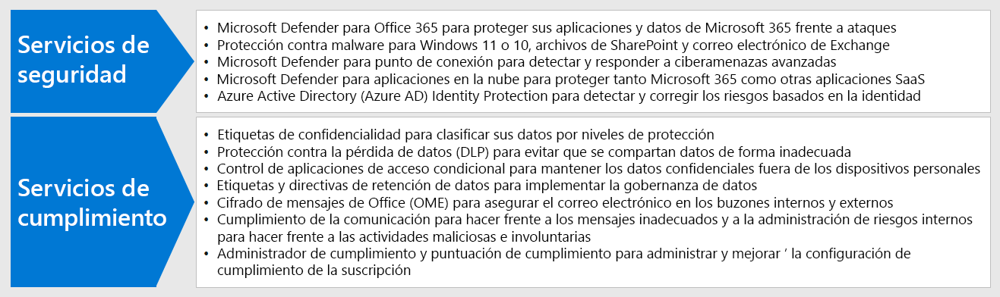

# Paso 3: implementar seguridad y cumplimiento para trabajadores remotos

La seguridad y el cumplimiento son una parte importante de la solución general para los trabajadores remotos, algunos de los cuales nunca deben ir a la oficina o lo hacen con poca frecuencia. Todas sus comunicaciones se producen a través de Internet, en lugar de limitarse a la intranet de la organización. 

Hay cosas que usted y sus trabajadores pueden hacer para seguir siendo productivos mientras reducen los riesgos de ciberseguridad y mantienen el cumplimiento de las directivas internas y regulaciones de datos.

El trabajo remoto necesita los siguientes elementos de seguridad y cumplimiento:

- Acceso controlado a las aplicaciones de productividad que usan los trabajadores remotos, como Microsoft Teams. 
- Acceso controlado y protección de los datos que los trabajadores remotos crean y usan, como las conversaciones de chat o los archivos compartidos.
- Protección de dispositivos con Windows 10 contra malware y otros tipos de ataques cibernéticos.
- Protección del correo electrónico, los archivos y el sitio con un etiquetado consistente con los niveles de confidencialidad y protección.
- Prevención del filtrado de información
- Cumplimiento de las regulaciones de datos regionales

## Seguridad

Proteja sus datos y aplicaciones con estas características de seguridad de Microsoft 365.

| Funcionalidad o característica | Description | Licencias |
|:-------|:-----|:-------|
| Protección contra amenazas avanzada de Office (ATP) | Proteja sus datos y aplicaciones de Microsoft 365, como mensajes de correo electrónico, documentos de Office y herramientas de colaboración, ante posibles ataques.    La Protección contra amenazas avanzada de Office recopila y analiza señales en las aplicaciones, para detectar, investigar y solucionar riesgos de seguridad, y protege a la organización contra amenazas malintencionadas que presenten los mensajes de correo electrónico, los vínculos (URL) y las herramientas de colaboración. | Microsoft 365 E3 y E5 | 
| Protección contra malware | El Antivirus de Windows Defender y Device Guard ofrecen una protección contra malware basada en dispositivos.    SharePoint Online analiza automáticamente las cargas de archivos para detectar malware conocido. ‎   Exchange Online Protection (EOP) protege los buzones en la nube. | Microsoft 365 E3 y E5 |
| ATP de Microsoft Defender | Proteja los dispositivos de su organización contra vulneraciones de datos y ciberamenazas, y detecte, investigue y responda a amenazas avanzadas. | Microsoft 365 E5 |
| Cloud App Security | Proteja los servicios basados en la nube, tanto de Microsoft 365 como de otras aplicaciones de SaaS, contra los ataques. | Licencias de Microsoft 365 E5 o de Cloud App Security individual |
| Azure AD Identity Protection  | Automatizar la detección y corrección de riesgos basados en la identidad.   Cree directivas de acceso condicional basadas en riesgos para requerir la autenticación multifactor (MFA) para los inicios de sesión de riesgo. | Microsoft 365 E5 o E3 con las licencias de Azure AD Premium P2 |
||||

## Cumplimiento

Cumpla los requisitos reglamentarios o las directivas internas con estas características de cumplimiento de Microsoft 365.

| Funcionalidad o característica | Description | Licencias |
|:-------|:-----|:-------|
| Etiquetas de confidencialidad | Clasifique y proteja los datos de su organización sin arriesgar la productividad de los usuarios y su capacidad para colaborar, mediante el establecimiento de etiquetas con distintos niveles de protección en el correo electrónico, los archivos y los sitios. | Microsoft 365 E3 y E5 |
| Protección de pérdida de datos (DLP) | Detecte, advierta y bloquee el uso compartido riesgoso, involuntario o inadecuado, como el de los datos que contengan información personal, tanto interna como externamente. | Microsoft 365 E3 y E5 | 
| Control de aplicaciones de acceso condicional | Evite la descarga de datos confidenciales en los dispositivos personales de los usuarios. | Microsoft 365 E3 y E5 |
| Directivas y etiquetas de retención de datos | Implemente controles de gobierno de la información, como cuánto tiempo se conservan los datos y los requisitos de almacenamiento de datos personales sobre los clientes, para cumplir con las directivas de la organización o las regulaciones de datos. | Microsoft 365 E3 y E5 |
| Cifrado de correo electrónico | Envíe y reciba mensajes de correo electrónico cifrado entre las personas de dentro y fuera de la organización que contengan datos regulados, como los datos personales sobre clientes. | Microsoft 365 E3 y E5 |
| Administrador de cumplimiento | Administre las actividades de cumplimiento normativo relacionadas con los servicios en la nube de Microsoft con esta herramienta de evaluación de riesgos basada en flujos de trabajo en el portal de confianza del servicio de Microsoft. | Microsoft 365 E3 y E5 |
| Puntuación de cumplimiento (versión preliminar) | Vea una calificación general de la configuración de cumplimiento actual y las recomendaciones para mejorarla en el Centro de cumplimiento de Microsoft 365. | Microsoft 365 E3 y E5 |
||||

## Resultados del paso 3

Para sus trabajadores remotos, ha implementado:

- Seguridad:
  - Acceso controlado a aplicaciones y datos que los trabajadores remotos usan para comunicarse y colaborar.
  - Protección contra malware para datos de servicios en la nube, correo electrónico y dispositivos con Windows 10. 
- Cumplimiento:
  - Etiquetado consistente para niveles de sensibilidad y protección
  - Políticas para prevenir la filtración de información
  - Cumplimiento de las regulaciones de datos regionales

## Paso siguiente

Continúe con el [Paso 4](empower-people-to-work-remotely-manage-endpoints.md) para administrar los dispositivos, equipos y otros puntos de conexión.
