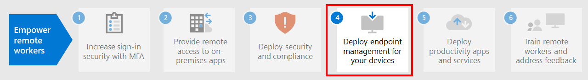

# Paso 3: implementar seguridad y cumplimiento para trabajadores remotosStep 3: Deploy security and compliance for remote workers

La seguridad y el cumplimiento son una parte importante de la solución general para los trabajadores remotos, algunos de los cuales nunca van a la oficina o lo hacen con poca frecuencia.For remote workers, some of whom never go into the office or who go infrequently, security and compliance are an important part of the overall solution. Todas sus comunicaciones se producen a través de Internet, en lugar de limitarse a la intranet de la organización.All of their communications occur over the Internet instead of being confined to an organizational intranet. 

Hay cosas que usted y sus trabajadores pueden hacer para seguir siendo productivos mientras reducen los riesgos de ciberseguridad y mantienen el cumplimiento de las directivas internas y regulaciones de datos.There are things you and your workers can do to remain productive while decreasing cybersecurity risk and maintaining compliance with your internal policies and data regulations.

El trabajo remoto necesita los siguientes elementos de seguridad y cumplimiento:Remote work needs these elements of security and compliance:

- Acceso controlado a las aplicaciones de productividad que usan los trabajadores remotos, como Microsoft Teams.Controlled access to the productivity apps that remote workers use, such as Microsoft Teams 
- Acceso controlado y protección de los datos que los trabajadores remotos crean y usan, como las conversaciones de chat o los archivos compartidos.Controlled access to and protection of the data that remote workers create and use, such as chat conversations or shared files
- Protección de dispositivos con Windows 10 contra malware y otros tipos de ataques cibernéticos.Protection of Windows 10 devices from malware and other types of cyberattacks
- Protección del correo electrónico, los archivos y el sitio con un etiquetado consistente con los niveles de confidencialidad y protección.Protection of email, files, and site with consistent labeling for levels of sensitivity and protection
- Prevención del filtrado de informaciónPrevention of leaked information
- Cumplimiento de las regulaciones de datos regionalesAdherence to regional data regulations

Estas son las características de Microsoft 365 que ofrecen servicios de seguridad y cumplimiento para los trabajadores remotos.Here are the features of Microsoft 365 that provide security and compliance services for remote workers.

## SeguridadSecurity

Proteja sus datos y aplicaciones con estas características de seguridad de Microsoft 365.Protect your applications and data with these security features of Microsoft 365.

| Funcionalidad o característicaCapability or feature | ¿Por qué lo necesito?Why I need it | LicenciasLicensing |
|:-------|:-----|:-------|
| Microsoft Defender para Office 365Microsoft Defender for Office 365 | Proteja sus datos y aplicaciones de Microsoft 365, como mensajes de correo electrónico, documentos de Office y herramientas de colaboración, ante posibles ataques.Protect your Microsoft 365 apps and data—such as email messages, Office documents, and collaboration tools—from attack.    Microsoft Defender para Office 365 recopila y analiza las señales de las aplicaciones para detectar, investigar y solucionar los riesgos de seguridad, y proteger a la organización contra las amenazas malintencionadas que suponen los mensajes de correo electrónico, los vínculos (URL) y las herramientas de colaboración.Microsoft Defender for Office 365 collects and analyzes signals from your apps for detection, investigation, and remediation of security risks and safeguards your organization against malicious threats posed by email messages, links (URLs), and collaboration tools. También proporciona una evaluación automatizada de la configuración del espacio empresarial y herramientas de configuración para posturas de seguridad estándar y estrictas.It also provides automated tenant configuration assessment and configuration tooling for standard and strict security postures. | Microsoft 365 E3 o E5Microsoft 365 E3 or E5 | 
| Protección contra malwareMalware protection | El Antivirus de Windows Defender y Device Guard ofrecen una protección contra malware basada en dispositivos.‎Microsoft Defender Antivirus and Device Guard provides device-based malware protection.    SharePoint Online analiza automáticamente las cargas de archivos para detectar malware conocido.SharePoint‎ Online automatically scans file uploads for known malware. ‎‎   Exchange Online Protection (EOP) protege los buzones en la nube.Exchange Online Protection‎ (‎EOP‎) secures cloud mailboxes. | Microsoft 365 E3 o E5Microsoft 365 E3 or E5 |
| Microsoft Defender para punto de conexiónMicrosoft Defender for Endpoint | Proteja los dispositivos de su organización contra vulneraciones de datos y ciberamenazas, y detecte, investigue y responda a amenazas avanzadas.Protect your organization’s devices from cyber threats and data breaches and detect, investigate, and respond to advanced threats. | Microsoft 365 E5Microsoft 365 E5 |
| Cloud App SecurityCloud App Security | Proteja los servicios basados en la nube, tanto los de Microsoft 365 como los de otras aplicaciones de SaaS, contra los ataques.Protect your cloud-based services—both Microsoft 365 and other SaaS apps—from attack. | Licencias de Microsoft 365 E5 o de Cloud App Security individualMicrosoft 365 E5 or individual Cloud App Security licenses |
| Azure AD Identity ProtectionAzure AD Identity Protection  | Automatizar la detección y corrección de riesgos basados en la identidad.Automate detection and remediation of identity-based risks.   Cree directivas de acceso condicional basadas en riesgos para requerir la autenticación multifactor (MFA) para los inicios de sesión de riesgo.Create risk-based Conditional Access policies to require multi-factor authentication (MFA) for risky sign-ins. | Microsoft 365 E5 o E3 con las licencias de Azure AD Premium P2Microsoft 365 E5 or E3 with Azure AD Premium P2 licenses |
||||

Para obtener más información, consulte [Las 12 tareas principales de los equipos de seguridad para dar soporte al trabajo desde casa](../security/top-security-tasks-for-remote-work.md).See [Top 12 tasks for security teams to support working from home](../security/top-security-tasks-for-remote-work.md) for more information.

## CumplimientoCompliance

Cumpla los requisitos reglamentarios o las directivas internas con estas características de cumplimiento de Microsoft 365.Comply with internal policies or regulatory requirements with these compliance features of Microsoft 365.

| Funcionalidad o característicaCapability or feature | ¿Por qué lo necesito?Why I need it | LicenciasLicensing |
|:-------|:-----|:-------|
| Etiquetas de confidencialidadSensitivity labels | Clasifique y proteja los datos de su organización sin arriesgar la productividad de los usuarios y su capacidad para colaborar, mediante el establecimiento de etiquetas con distintos niveles de protección en el correo electrónico, los archivos y los sitios.Classify and protect your organization's data without hindering the productivity of users and their ability to collaborate by placing labels with various levels of protection on email, files, or sites. | Microsoft 365 E3 o E5Microsoft 365 E3 or E5 |
| Protección de pérdida de datos (DLP)Data Loss Protection (DLP) | Detecte, advierta y bloquee el uso compartido riesgoso, involuntario o inadecuado, como el de los datos que contengan información personal, tanto interna como externamente.Detect, warn, and block risky, inadvertent, or inappropriate sharing, such as sharing of data containing personal information, both internally and externally. | Microsoft 365 E3 o E5Microsoft 365 E3 or E5 | 
| Control de aplicaciones de acceso condicionalConditional Access App Control | Evite la descarga de datos confidenciales en los dispositivos personales de los usuarios.Prevent sensitive data from being downloaded to users' personal devices. | Microsoft 365 E3 o E5Microsoft 365 E3 or E5 |
| Directivas y etiquetas de retención de datosData retention labels and policies | Implemente controles de gobierno de la información, como cuánto tiempo se conservan los datos y los requisitos de almacenamiento de datos personales sobre los clientes, para cumplir con las directivas de la organización o las regulaciones de datos.Implement information governance controls, such as how long to keep data and requirements on the storage of personal data on customers, to comply with your organization's policies or data regulations. | Microsoft 365 E3 o E5Microsoft 365 E3 or E5 |
| Cifrado de mensajes de Office (OME)Office message encryption (OME) | Envíe y reciba mensajes de correo electrónico cifrado entre las personas de dentro y fuera de la organización que contengan datos regulados, como los datos personales sobre clientes.Send and receive encrypted email messages between people inside and outside your organization that contains regulated data, such as personal data on customers. | Microsoft 365 E3 o E5Microsoft 365 E3 or E5 |
| Administrador de cumplimientoCompliance Manager | Administre las actividades de cumplimiento normativo relacionadas con los servicios en la nube de Microsoft con esta herramienta de evaluación de riesgos basada en flujos de trabajo en el portal de confianza del servicio de Microsoft.Manage regulatory compliance activities related to Microsoft cloud services with this workflow-based risk assessment tool in the Microsoft Service Trust Portal. | Microsoft 365 E3 o E5Microsoft 365 E3 or E5 |
| Administrador de cumplimientoCompliance Manager | Vea una calificación general de la configuración de cumplimiento actual y las recomendaciones para mejorarla en el Centro de cumplimiento de Microsoft 365.See an overall score of your current compliance configuration and recommendations for improving it in the Microsoft 365 compliance center. | Microsoft 365 E3 o E5Microsoft 365 E3 or E5 |
| Cumplimiento de la comunicaciónCommunication Compliance  | Detectar, capturar y llevar a cabo acciones correctivas para los mensajes no adecuados de su organización.Detect, capture, and take remediation actions for inappropriate messages in your organization. | Microsoft 365 E5 o Microsoft 365 E3 con el complemento de cumplimiento o administración de riesgos de InsiderMicrosoft 365 E5 or Microsoft 365 E3 with the Compliance or Insider Risk Management add-ons |
| Administración de riesgos de InsiderInsider Risk Management |  Detecte, investigue y actúe ante riesgos malintencionados e involuntarios en su organización.Detect, investigate, and act on malicious and inadvertent risks in your organization. Microsoft 365 puede detectar estos tipos de riesgos, incluso cuando un trabajador usa un dispositivo no administrado.Microsoft 365 can detect these kinds of risks even when a worker is using an unmanaged device. | Microsoft 365 E5 o Microsoft 365 E3 con el complemento de cumplimiento o administración de riesgos de InsiderMicrosoft 365 E5 or Microsoft 365 E3 with the Compliance or Insider Risk Management add-ons |
||||

Para obtener más información, consulte [Tareas rápidas para comenzar con el Centro de cumplimiento de Microsoft 365](../compliance/compliance-quick-tasks.md).See [Quick tasks for getting started with Microsoft 365 compliance](../compliance/compliance-quick-tasks.md) for more information.

## Resultados del paso 3Results of Step 3

Para sus trabajadores remotos, ha implementado:For your remote workers, you have implemented:

- SeguridadSecurity
  - Acceso controlado a aplicaciones y datos que los trabajadores remotos usan para comunicarse y colaborar.Controlled access to apps and data that remote workers use to communicate and collaborate
  - Protección contra malware para datos de servicios en la nube, correo electrónico y dispositivos con Windows 10.Malware protection for cloud service data, email, and Windows 10 devices 
- CumplimientoCompliance
  - Etiquetado consistente para niveles de sensibilidad y protecciónConsistent labeling for levels of sensitivity and protection
  - Políticas para prevenir la filtración de informaciónPolicies to prevention information leakage
  - Cumplimiento de las regulaciones de datos regionalesAdherence to regional data regulations

## Paso siguienteNext step

Continúe con el [Paso 4](empower-people-to-work-remotely-manage-endpoints.md) para administrar los dispositivos, equipos y otros puntos de conexión.Continue with [Step 4](empower-people-to-work-remotely-manage-endpoints.md) to manage your devices, PCs, and other endpoints.
