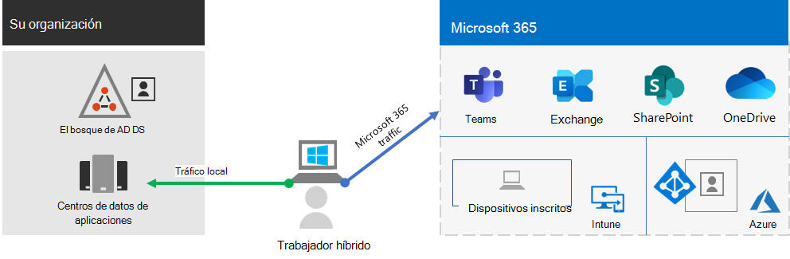

# Proporcionar Microsoft 365 a los trabajadores remotos

Es posible que su empresa necesite habilitar el acceso seguro a los recursos, herramientas e información locales y basados en la nube de la organización para que los empleados puedan trabajar desde sus casas. Permitir que los empleados trabajen de manera remota es importante en muchas organizaciones para lo siguiente:

- Ahorrar en espacio de oficina.
- Contratar y conservar trabajadores que no estén dispuestos a reubicarse.
- Reducir los desplazamientos de los trabajadores, dejándoles más tiempo para ser productivos y para actividades que reducen el estrés fuera del trabajo.

Microsoft 365 tiene las capacidades para permitir que los empleados trabajen de manera remota.

>[!Note]
>Si es nuevo en Microsoft 365, consulte [estos recursos](https://www.microsoft.com/microsoft-365).
>

Vea este vídeo para obtener información general del proceso de implementación.
 
 
> [!VIDEO https://www.microsoft.com/videoplayer/embed/RE4F1af]

Para los profesionales de TI que administran infraestructuras locales y basadas en la nube para habilitar la productividad de los trabajadores, esta solución ofrece las siguientes funcionalidades clave:

- Conectados

  Desde cualquier parte del mundo y en cualquier momento, los trabajadores remotos pueden acceder a: 

  - Los servicios basados en la nube y los datos de su suscripción de Microsoft 365. 

  - Los recursos de la organización, como los ofrecidos por centros de datos de aplicaciones locales.

- Protegidos

  Los inicios de sesión están protegidos con la autenticación multifactor (MFA). Las características de seguridad integradas de Microsoft 365 y Windows 10 protegen contra el malware, los ataques malintencionados y la pérdida de datos.

- Administrados

  Los dispositivos de su trabajador remoto se pueden administrar desde la nube mediante configuraciones de seguridad, aplicaciones permitidas y requerimientos de cumplimiento con el estado del sistema.

- Colaborativos y productivos

  Sus trabajadores remotos pueden ser tan productivos como lo son en la oficina de un modo altamente colaborativo gracias a las siguientes características:

  - Reuniones en línea y sesiones de chat con Teams. 

  - Áreas de trabajo compartidas para almacenar archivos en la nube con accesibilidad global y colaboración en tiempo real con SharePoint y OneDrive.

  - Tareas y flujos de trabajo compartidos para dividir el trabajo y terminarlo de forma más efectiva. 

Para una experiencia de inicio de sesión perfecta, las cuentas de usuario de Active Directory Domain Services (AD DS) locales se deben sincronizar con Azure Active Directory (Azure AD). Para proteger sus dispositivos con Windows 10, deben estar inscritos en Intune. Aquí se muestra una vista general de la infraestructura.

Para habilitar las funciones de Microsoft 365 para sus trabajadores remotos, use estas características de Microsoft 365.

| Funcionalidad o característica | Description | Licencias |
|:-------|:-----|:-------|
| MFA aplicada en los valores predeterminados de seguridad   | Protege frente a ataques a identidades y dispositivos, pues obliga a usar una segunda forma de autenticación para iniciar sesión. Los valores predeterminados de seguridad requieren MFA para todas las cuentas de usuario.   | Microsoft 365 E3 o E5 |
| MFA aplicada con acceso condicional| Requerir la MFA según las propiedades del inicio de sesión con directivas de Acceso condicional.    | Microsoft 365 E3 o E5 | 
| MFA aplicada con Acceso condicional basado en los riesgos   | Requerir la MFA según el riesgo de inicio de sesión del usuario con Microsoft Defender for Identity. | Microsoft 365 E5 o E3 con las licencias de Azure AD Premium P2 | 
| Autoservicio de restablecimiento de contraseña (SSPR)    | Permitir que los usuarios restablezcan o desbloqueen su contraseña o cuenta ellos mismos.  | Microsoft 365 E3 o E5 |
| Proxy de aplicación de Azure AD    | Da acceso remoto seguro para aplicaciones basadas en web que se encuentren en servidores de intranet.   | Se requiere una suscripción de pago de Azure aparte. |
| VPN de Azure de punto a sitio   | Crea una conexión segura desde el dispositivo de un trabajador remoto a la intranet a través de una red virtual de Azure.   | Se requiere una suscripción de pago de Azure aparte. |
| Windows Virtual Desktop   | Apoya a los trabajadores remotos que solo pueden usar sus propios dispositivos personales no administrados ofreciéndoles escritorios virtuales que se ejecutan en Azure. | Se requiere una suscripción de pago de Azure aparte. |
| Servicios de Escritorio remoto (RDS) | Permite que los empleados se conecten a equipos con Windows en la intranet. | Microsoft 365 E3 o E5 | 
| Puerta de enlace de Servicios de Escritorio remoto   | Cifra las comunicaciones y evita que los hosts de RDS se expongan directamente a Internet. | Requiere licencias aparte de Windows Server. |
| Microsoft Intune | Administra dispositivos y aplicaciones.   | Microsoft 365 E3 o E5 | 
| Configuration Manager | Administra instalaciones, actualizaciones y configuraciones de software en sus dispositivos. | Se requieren licencias aparte de Configuration Manager. |
| Análisis de escritorio | Determina la preparación de la actualización de los clientes de Windows.   | Se requieren licencias aparte de Configuration Manager. |
| Windows Autopilot | Instala y preconfigura nuevos dispositivos con Windows 10 para un uso productivo.   | Microsoft 365 E3 o E5 |
| Microsoft Teams, Exchange Online, SharePoint Online and OneDrive, Aplicaciones de Microsoft 365, Microsoft Power Platform, y Yammer | Crear, comunicar y colaborar. | Microsoft 365 E3 o E5 |
||||

Para ver los criterios de seguridad y cumplimiento consulte [Implementar la seguridad y el cumplimiento para trabajadores remotos](empower-people-to-work-remotely-security-compliance.md).

 Para obtener un resumen de dos páginas sobre esta solución, consulte el [Póster para aumentar la productividad de los trabajadores remotos](../downloads/empower-remote-workers.pdf).

También puede descargar este póster en formato [PDF](https://github.com/MicrosoftDocs/microsoft-365-docs/raw/public/microsoft-365/downloads/empower-remote-workers.pdf) o [PowerPoint](https://download.microsoft.com/download/5/1/1/511b77a9-a34c-4ea7-af2a-32b07f20b780/empower-remote-workers.pptx) e imprimirlo en tamaño carta, legal o tabloide (11 x 17).

## Ofrecer trabajo remoto a todos sus trabajadores

Puede permitir que todos sus trabajadores sean más productivos en cualquier lugar con estos dispositivos:

- Un dispositivo moderno, como un portátil Surface con Windows 10, que tiene las características, la seguridad y el rendimiento para utilizar las aplicaciones y servicios en la nube de Microsoft 365 directamente en la web.

- Cualquier dispositivo, incluidos los portátiles antiguos o los equipos de sobremesa domésticos, que puedan acceder a las aplicaciones y servicios en la nube de Microsoft 365 indirectamente a través de [un escritorio virtual basado en Windows 10](empower-people-to-work-remotely-remote-access.md#deploy-windows-virtual-desktop-to-provide-remote-access-for-remote-workers-using-personal-devices) que se implementa rápidamente. Esta opción proporciona un alto rendimiento, una seguridad robusta y una administración de TI simplificada.

## Pasos siguientes

Siga estos pasos para asegurar y optimizar el acceso a los servidores y servicios en la nube de su organización y maximizar la productividad de su trabajador remoto.

1. [Aumentar la seguridad de inicio de sesión con la autenticación multifactor](empower-people-to-work-remotely-secure-sign-in.md)
2. [Proporcionar acceso remoto a los servicios y aplicaciones locales](empower-people-to-work-remotely-remote-access.md)
3. [Implementar servicios de seguridad y cumplimiento](empower-people-to-work-remotely-security-compliance.md)
4. [Implementar la administración de puntos de conexión para dispositivos, equipos y otros puntos de conexión](empower-people-to-work-remotely-manage-endpoints.md)
5. [Implementar servicios y aplicaciones de productividad para los trabajadores remotos](empower-people-to-work-remotely-teams-productivity-apps.md)
6. [Proporcionar formación a los trabajadores remotos y dar respuesta a los comentarios sobre el uso](empower-people-to-work-remotely-train-monitor-usage.md)

Para obtener la información más reciente de Microsoft sobre el soporte para trabajadores remotos, consulte [Habilitar trabajo remoto con el sitio de Microsoft Teams](https://resources.techcommunity.microsoft.com/enabling-hybrid-work/).

Para ver cómo una organización multinacional ficticia pero representativa ha habilitado a los trabajadores remotos, consulte [Infraestructura y respuesta de Contoso a la COVID-19 para trabajo remoto e in situ](contoso-remote-onsite-work.md).
