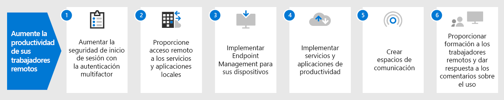

# Proporcionar Microsoft 365 a los trabajadores remotosEmpower remote workers with Microsoft 365

Es posible que su empresa necesite habilitar el acceso seguro a los recursos, herramientas e información locales y basados en la nube de la organización para que los empleados puedan trabajar desde sus casas.Your business may need to enable your workers to have secure access to your organization's on-premises and cloud-based information, tools, and resources from their homes. Permitir que los trabajadores trabajen fuera de la oficina de manera fluida y segura es importante en muchas organizaciones para:Allowing workers to work away from the office seamlessly and securely is important for many organizations to:

- Ahorrar en espacio de oficina.Save on office space.
- Contratar y conservar trabajadores que no estén dispuestos a reubicarse.Hire and retain workers who are unwilling to relocate.
- Reducir los desplazamientos de los trabajadores, dejándoles más tiempo para ser productivos y para actividades que reducen el estrés fuera del trabajo.Reduce worker commuting, leaving them with more time to be productive and for stress-reducing activities outside of work.

El trabajo remoto, también conocido como teletrabajo, abarca un gran espectro. Estos son algunos ejemplos:Remote working, also known as teleworking, can span a spectrum that includes:

- trabajadores que en ocasiones salen de la oficina para ir a conferencias o reuniones con los clientes.workers that are occasionally away from the office for conferences or client meetings.
- Algunos trabajadores que trabajan de forma remota a tiempo completo.Some workers that work remotely full-time.
- Empresas completamente remotas en las que no hay ninguna oficina y todos los trabajadores trabajan a distancia.A fully remote organization in which there is no office and all workers are remote.

Para apoyar a los trabajadores remotos, por ejemplo, en respuesta a la crisis del COVID-19, una combinación de características en Microsoft 365 habilita a sus trabajadores remotos en un modo altamente colaborativo, como:To support remote workers, for example in response to the COVID-19 crisis, a combination of features in Microsoft 365 enables your remote workers in a highly collaborative way, such as:

- Reuniones en línea y sesiones de chat.Online meetings and chat sessions.
- Áreas de trabajo compartidas para almacenar archivos en la nube con accesibilidad global y colaboración en tiempo real.Shared workspaces for cloud-based file storage with global accessibility and real-time collaboration.
- Tareas y flujos de trabajo compartidos para dividir el trabajo y terminarlo de forma más efectiva.Shared tasks and workflows to divide up the work and get things done.

Para un alto nivel de seguridad, Microsoft 365 incluye:For strong security, Microsoft 365 includes:

- Requisitos de autenticación obligatorios, detección y respuesta a los inicios de sesión de alto riesgo, y bloqueo de aplicaciones específicas y dispositivos no compatibles.Enforced authentication requirements, detecting and responding to high-risk sign-ins, and blocking selected apps and non-compliant devices.
- Conexiones cifradas y recursos digitales en la nube.Encrypted connections and digital assets in the cloud.
- Permisos para definir qué acciones se permiten a qué usuarios con ciertos archivos.Permissions to define who can do what with files.
- Características de seguridad integrales para proteger dispositivos con Windows 10.Comprehensive security features to protect Windows 10 devices.

Las siguientes características de Microsoft 365 le permiten aplicar estos criterios a sus trabajadores remotos:To meet these criteria for remote workers, use the following Microsoft 365 features:

- Identidad del usuario y seguridad de inicio de sesiónUser identity and sign-in security
  - Cuentas de usuario de Azure Active Directory (Azure AD) con autenticación multifactor (MFA)Azure Active Directory (Azure AD) user accounts with multi-factor authentication (MFA)
  - Una directiva de acceso condicional para requerir MFA en los inicios de sesión de riesgo (Microsoft 365 E5)A Conditional Access policy to require MFA for risky sign-ins (Microsoft 365 E5)
- Plataformas de colaboraciónCollaboration platforms
  - Microsoft Teams, SharePoint y OneDrive, con los que los trabajadores remotos pueden programar y asistir a reuniones por videoconferencia y trabajar simultáneamente con los mismos documentos.Microsoft Teams, SharePoint, and OneDrive, with which remote workers can schedule and attend online video-based meetings and work on the same documents at the same time
- Acceso seguro a los recursosSecure access to resources
  - Grupos y permisos para Teams, sitios de SharePoint y OneDrive que solo permitan acceder a usuarios autenticados y autorizadosGroups and permissions for Teams, SharePoint sites, and OneDrive so that only authenticated and permitted users have access
- Protección para filtración de archivosProtection for leaked files
  - Etiquetas de confidencialidad para cifrado y permisos que se integran en los archivos incluso cuando estos se transfierenSensitivity labels for encryption and permissions that travel with files
- Administración de dispositivos y seguridad con Microsoft IntuneDevice management and security with Microsoft Intune
  - Inscripción para dispositivos administradosEnrollment for managed devices
  - Configuración de la aplicación para dispositivos personalesApp settings for personal devices
  - Directivas de dispositivo y aplicaciónDevice and app policies
- Aplicaciones de productividad para dispositivosProductivity apps for devices
  - Aplicaciones de Microsoft 365 (Word, PowerPoint y Excel) para experiencias colaborativas con Teams, Exchange, SharePoint y OneDriveMicrosoft 365 Apps (Word, PowerPoint, Excel) for collaborative experiences with Teams, Exchange, SharePoint, and OneDrive 
- Windows 10 EnterpriseWindows 10 Enterprise
  - Conjunto integrado de características de seguridad para protegerse contra ciberataques y evitar las filtraciones de datosBuilt-in suite of security features to protect against cyberattacks and prevent data leakage
- Acceso a servidores y aplicaciones localesAccess to on-premises apps and servers
  - Conexiones de red privada virtual (VPN), proxy de aplicación de Azure AD o VPN de punto a sitio de AzureVirtual private network (VPN) connections, Azure AD Application Proxy, or Azure Point-to-Site VPN

Siga los pasos que se indican a continuación para proteger y optimizar el acceso a los servidores, datos y servicios en la nube de la organización y optimizar la productividad de sus empleados.Use these steps to secure and optimize access to your organization's servers, data, and cloud services and enable maximum worker productivity.

1. [Aumentar la seguridad de inicio de sesión con la autenticación multifactorIncrease sign-in security with MFA](empower-people-to-work-remotely-secure-sign-in.md)
2. [Proporcionar acceso remoto a los servicios y aplicaciones localesProvide remote access to on-premises apps and services](empower-people-to-work-remotely-remote-access.md)
3. [Implementar la administración de puntos de conexión para dispositivos, equipos y otros puntos de conexiónDeploy endpoint management for your devices, PCs, and other endpoints](empower-people-to-work-remotely-manage-endpoints.md)
4. [Implementar servicios y aplicaciones de productividad para los trabajadores remotosDeploy remote worker productivity apps and services](empower-people-to-work-remotely-teams-productivity-apps.md)
5. [Crear espacios de comunicaciónCreate communication venues](empower-people-to-work-remotely-communication-venues.md)
6. [Proporcionar formación a los trabajadores remotos y dar respuesta a los comentarios sobre el usoTrain remote workers and address usage feedback](empower-people-to-work-remotely-train-monitor-usage.md)

Para obtener la información más reciente de Microsoft sobre el soporte para trabajadores remotos, consulte el [sitio Habilitar trabajo remoto de Tech Community](https://resources.techcommunity.microsoft.com/enabling-remote-work/).For the latest information from Microsoft about supporting remote workers, see the [Enabling remote work Tech Community site](https://resources.techcommunity.microsoft.com/enabling-remote-work/).
