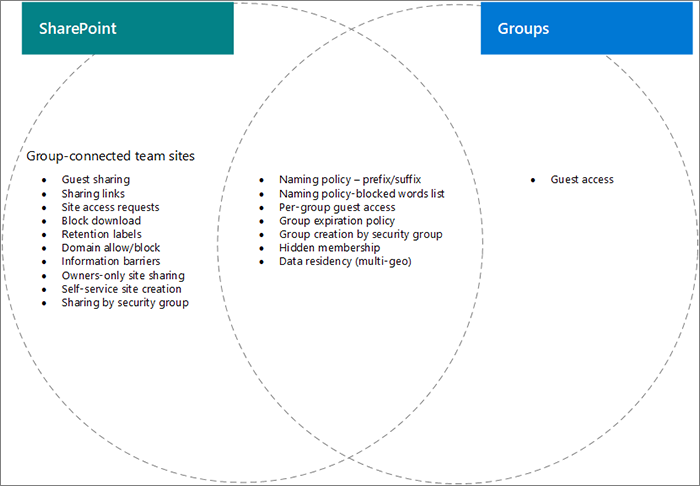

# Configuración interacciones entre Microsoft 365 grupos y SharePointSettings interactions between Microsoft 365 Groups and SharePoint

Algunas opciones de configuración Microsoft 365 grupos y SharePoint en Microsoft 365, especialmente relacionadas con el uso compartido y la creación de sitios de grupo y grupo, se superponen entre sí.Some settings for Microsoft 365 Groups and SharePoint in Microsoft 365, particularly related to sharing and group and team site creation, overlap with each other. En este artículo se proporcionan descripciones de estas interacciones y procedimientos recomendados para trabajar con esta configuración.This article provides descriptions of these interactions and best practices for how to work with these settings.

## Los efectos de la SharePoint configuración en Microsoft 365 gruposThe effects of SharePoint settings on Microsoft 365 groups

|SharePoint configuraciónSharePoint setting|DescripciónDescription|Efecto en Microsoft 365 gruposEffect on Microsoft 365 groups|RecomendaciónRecommendation|
|:-----------------|:----------|:-----------------------------|:-------------|
|Uso compartido externo para la organización y el sitioExternal sharing for organization and site|Determina si los sitios, archivos y carpetas se pueden compartir con personas ajenas a la organización.Determines if sites, files, and folders can be shared with people outside the organization.|Si SharePoint y grupos no coinciden, es posible que los invitados del grupo no puedan acceder al sitio o que el acceso externo esté disponible en el sitio, pero no en el grupo.If SharePoint and groups settings don't match, guests in the group may be blocked from accessing the site, or external access may be available in the site but not the group.|Al cambiar la configuración de uso compartido, compruebe tanto la configuración de grupos como SharePoint configuración del sitio para los sitios de grupo conectados a grupos.When changing sharing settings, check both Groups settings and SharePoint site settings for group-connected team sites.  Consulte [Colaborar con invitados en un sitio](./collaborate-in-site.md).See [Collaborate with guests in a site](./collaborate-in-site.md).|
|Domain allow/blockDomain allow/block|Permite o impide que el contenido se comparta con dominios especificados.Allows or prevents content being shared with specified domains.|Los grupos no reconocen SharePoint permitir o bloquear listas.Groups does not recognize SharePoint allow or block lists. Los usuarios de dominios no permitidos en SharePoint podrían tener acceso a SharePoint a través de un grupo.Users from domains disallowed in SharePoint could gain access to SharePoint through a group.|Administrar listas de dominios permitidos o bloqueados para Azure AD y SharePoint juntos.Manage domain allow/block lists for Azure AD and SharePoint together. Cree un proceso de gobierno en toda la organización para permitir y bloquear dominios.Create an org-wide governance process for allowing and blocking domains.  Consulta [SharePoint configuración de dominio y](/sharepoint/restricted-domains-sharing) configuración de dominio de Azure [AD](/azure/active-directory/b2b/allow-deny-list)See [SharePoint domain settings](/sharepoint/restricted-domains-sharing) and [Azure AD domain settings](/azure/active-directory/b2b/allow-deny-list)|
|Permitir que solo los usuarios en grupos de seguridad específicos compartan externamenteAllow only users in specific security groups to share externally|Especifica grupos de seguridad que pueden compartir sitios, carpetas y archivos externamente.Specifies security groups who can share sites, folders, and files externally.|Esta configuración no afecta a los propietarios de grupos que comparten grupos externamente.This setting does not affect group owners sharing groups externally. Los invitados de grupo tienen acceso al sitio SharePoint asociado.Group guests have access to the associated SharePoint site.||
|SharePoint de uso compartido de sitiosSharePoint site sharing settings|Determina quién puede compartir el sitio directamente fuera de la pertenencia a grupos.Determines who can share the site directly outside of group membership. El propietario del sitio o grupo lo configura.This is configured by the group or site owner.|Esta configuración no afecta directamente al grupo, pero puede permitir a los usuarios agregarse a un sitio y no tener acceso a otros recursos de grupoThis setting does not affect the group directly, but it can allow users to be added to a site and not have access to other group resources|Considere la posibilidad de usar esta configuración para limitar el uso compartido del sitio directamente y administrar el acceso al sitio a través del grupo.Consider using this setting to limit sharing of the site directly and manage site access through the group.|
|Permitir a los usuarios crear sitios desde SharePoint página de inicio y OneDriveLet users create sites from the SharePoint start page and OneDrive|Especifica si los usuarios pueden crear nuevos SharePoint web.Specifies if users can create new SharePoint sites.|Si esta configuración está desactivada, los usuarios aún pueden crear sitios de grupo conectados a grupos mediante la creación de un grupo.If this setting is turned off, users can still create group-connected team sites by creating a group.||

## Efectos de la configuración Microsoft 365 grupos en SharePointThe effects of Microsoft 365 groups setting on SharePoint

|Microsoft 365 configuración de gruposMicrosoft 365 groups setting|DescripciónDescription|Efecto en SharePointEffect on SharePoint|RecomendaciónRecommendation|
|:---------------------------|:----------|:-------------------|:-------------|
|Directivas de nomenclaturaNaming policies|Especifica prefijos y sufijos de nombre de grupo y palabras bloqueadas para la creación de gruposSpecifies group name prefixes and suffixes, and blocked words for group creation|Las directivas se aplican para los usuarios que crean sitios de grupo conectados a grupos, pero no sitios de comunicación o sitios con otras plantillas.Policies are enforced for users creating group-connected team sites, but not communication sites or sites with other templates.|Cree instrucciones de nomenclatura independientes para los sitios de comunicación si es necesario.Create separate naming guidance for communication sites if needed.|
|Acceso de invitado de grupoGroup guest access|Especifica si se pueden agregar personas fuera de la organización a grupos.Specifies if people outside the organization can be added to groups.|Si SharePoint y grupos no coinciden, es posible que los invitados del grupo no puedan acceder al sitio o que el acceso externo esté disponible en el sitio, pero no en el grupo.If SharePoint and groups settings don't match, guests in the group may be blocked from accessing the site, or external access may be available in the site but not the group.|Al cambiar la configuración de uso compartido, compruebe tanto la configuración de grupos como SharePoint configuración del sitio para los sitios de grupo conectados a grupos.When changing sharing settings, check both Groups settings and SharePoint site settings for group-connected team sites.  Consulta [Colaborar con invitados en un sitio](./collaborate-in-site.md)See [Collaborate with guests in a site](./collaborate-in-site.md)|
|Creación de grupos por grupo de seguridadGroup creation by security group|Los grupos solo los pueden crear los miembros de un grupo de seguridad específico.Groups can only be created by members of a specific security group.|Los usuarios que no sean miembros del grupo de seguridad no podrán crear un sitio de grupo conectado a un grupo.Users who are not members of the security group will not be able to create a group-connected team site.|Asegúrese de que el proceso para solicitar un grupo incluye instrucciones para solicitar un sitio.Be sure your process for requesting a group includes instructions for requesting a site.|
|Directiva de expiración de grupoGroup expiration policy|Especifica un período de tiempo después del cual los grupos que no se usan activamente se eliminarán automáticamente.Specifies a time period after which groups that are not actively used will be automatically deleted.|Cuando se elimina el grupo, también se elimina SharePoint sitio asociado.When the group is deleted, the associated SharePoint site is also deleted. El contenido protegido por directivas de retención se conserva.Content protected by retention policies is retained.|Use directivas de expiración para evitar la expansión de sitios y grupos no usados.Use expiration policies to avoid sprawl of unused groups and sites.|

## Temas relacionadosRelated topics

[Planeación paso a paso de gobierno de colaboraciónCollaboration governance planning step-by-step](collaboration-governance-overview.md#collaboration-governance-planning-step-by-step)

[Crear el plan de gobierno de colaboraciónCreate your collaboration governance plan](collaboration-governance-first.md)

[Colaborar con personas ajenas a la organizaciónCollaborating with people outside your organization](./collaborate-with-people-outside-your-organization.md)

[Administrar la creación de un sitio de SharePointManage site creation in SharePoint](/sharepoint/manage-site-creation)