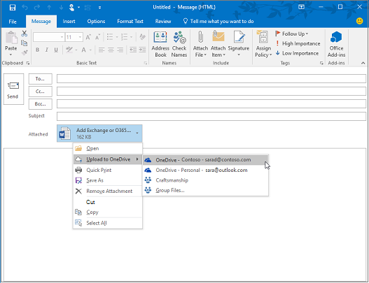

# Para identidades y más allá: el punto de vista de un arquitecto

En este artículo, [Alex Shteynberg](https://www.linkedin.com/in/alex-shteynberg/), arquitecto técnico principal de Microsoft, trata las estrategias de diseño principales para organizaciones empresariales que adoptan Microsoft 365 y otros servicios en la nube de Microsoft.

## Acerca del autor

Soy arquitecto técnico principal en el [Centro Tecnológico de Microsoft](https://www.microsoft.com/mtc?rtc=1)de Nueva York. Yo trabajo principalmente con grandes clientes y requisitos complejos. El punto de vista y las opiniones se basan en estas interacciones y es posible que no se apliquen a todas las situaciones. Sin embargo, en mi experiencia, si podemos ayudar a los clientes con los desafíos más complejos, podemos ayudar a todos los clientes. 

Normalmente trabajo con más de 100 clientes cada año. Aunque cada organización tiene características únicas, es interesante ver tendencias y similitudes. Por ejemplo, una tendencia es el interés entre industrias para muchos clientes. Después de todo, una sucursal bancaria también puede ser una cafetería y un centro de la comunidad. 

En mi rol, me centro en ayudar a los clientes a llegar a la mejor solución técnica para abordar sus objetivos empresariales únicos. Oficialmente, me centraré en la identidad, la seguridad, la privacidad y el cumplimiento. Me encanta el hecho de que estos toquen todo lo que hacemos. Me da la oportunidad de estar involucrado en la mayoría de los proyectos. Esto me mantiene muy ocupado y disfrutando de este rol. 

¡ Vive en la ciudad de Nueva York (la mejor!) y realmente disfruta de la diversidad de su cultura, comida y personas (no el tráfico). Me encanta viajar cuando pueda y espero ver la mayor parte del mundo en mi vida. Actualmente estoy investigando un viaje a África para obtener información sobre la vida salvaje.

## Principios de guía 

- **Simple** suele ser mejor: puede hacer (casi) cualquier cosa con tecnología. No significa que deba hacerlo. Especialmente en el espacio de seguridad, muchos clientes de soluciones de sobreprocesadores. Me gusta [este vídeo](https://www.youtube.com/watch?v=SOQgABDSYZE) de la Conferencia de stripe de Google para subrayar este punto.
- **Personas, procesos, Tecnología** : [diseñar para](https://en.wikipedia.org/wiki/Human-centered_design) que los usuarios mejoren el proceso, no técnicos en primer lugar. No hay soluciones "perfectas". Necesitamos equilibrar varios factores de riesgo y las decisiones serán diferentes para cada negocio. Muchos clientes diseñan un enfoque que los usuarios no pueden evitar más adelante.
- **Céntrese en "por primer" y "cómo" más adelante** : sea el niño de 7 años de edad anterior con un millón de preguntas. No podemos llegar a la respuesta correcta si no sabemos las preguntas adecuadas que debe formular. Una gran cantidad de clientes asume que las cosas tienen que trabajar en lugar de definir el problema empresarial. Siempre hay varias rutas de las que se pueden realizar.
- **Larga cola de procedimientos recomendados anteriores** : reconoce que los procedimientos recomendados están cambiando a la velocidad de luz. Si ha mirado Azure AD hace más de 3 meses, es probable que no esté actualizada. Todo esto está sujeto a cambios después de la publicación. La opción "mejor" de hoy no puede ser la misma de 6 meses a partir de ahora.

## Conceptos de línea base

No omitir esta sección. A menudo me encuentro con el paso de atrás en estos temas, incluso para los clientes que han estado usando los servicios en la nube durante años.
Lamentablemente, el idioma no es una herramienta precisa. Con frecuencia usamos la misma palabra para referirse a diferentes conceptos o palabras distintas para referirse al mismo concepto. A menudo uso este diagrama a continuación para establecer una terminología de línea base y un "modelo de jerarquía".
  

  

 

Cuando aprende a nadar, es mejor empezar en el grupo y no en la mitad del océano. No estoy tratando de ser técnicamente preciso con este diagrama. Es un modelo para discutir conceptos básicos. 

En el diagrama:
- Inquilino = instancia de Azure AD. Se encuentra en la "parte superior" de una jerarquía o nivel 1 en el diagrama. Podemos considerar esto como el "[límite](https://docs.microsoft.com/azure/active-directory/users-groups-roles/licensing-directory-independence)" donde se encuentra todo lo demás ([Azure ad B2B](https://docs.microsoft.com/azure/active-directory/b2b/what-is-b2b) independiente). Todos los servicios en la nube de Microsoft Enterprise forman parte de uno de estos inquilinos. Los servicios de consumidor son independientes. "Inquilino" aparece en la documentación como Office 365 tenant, inquilino de Azure, inquilino de WVD, etc. A menudo, encuentro que estas variantes causan confusión para los clientes.
- Los servicios/suscripciones, nivel 2 en el diagrama, pertenecen a un solo inquilino. La mayoría de los servicios SaaS son 1:1 y no se pueden mover sin migración. Azure es diferente, puede [mover facturación](https://docs.microsoft.com/azure/cost-management-billing/manage/billing-subscription-transfer) o una [suscripción](https://docs.microsoft.com/azure/active-directory/fundamentals/active-directory-how-subscriptions-associated-directory) a otro inquilino. Hay muchos clientes que necesitan mover las suscripciones de Azure. Esto tiene varias implicaciones. Los objetos que existen fuera de la suscripción (por ejemplo, RBAC y los objetos de Azure AD, incluidos grupos, aplicaciones, directivas, etc.) no se mueven. Además, algunos servicios (depósito de claves de Azure, bricks de datos, etc.) se mueven en un estado no funcional. No migre los servicios sin una buena necesidad empresarial. Algunos scripts que pueden ser útiles para la migración se [comparten en github](https://github.com/lwajswaj/azure-tenant-migration). 
- Un servicio determinado normalmente tiene algún tipo de límite de "subnivel" o nivel 3 (L3). Esto es útil para comprender la segregación de la seguridad, las directivas, el gobierno, etc. Desafortunadamente, no hay ningún nombre uniforme que sé. Algunos nombres de ejemplo para L3 son: Azure subscription = [Resource](https://docs.microsoft.com/azure/azure-resource-manager/management/manage-resources-portal); Dynamics 365 CE = [instancia](https://docs.microsoft.com/dynamics365/admin/new-instance-management); Power BI = [área de trabajo](https://docs.microsoft.com/power-bi/service-create-the-new-workspaces); Power apps = [entorno](https://docs.microsoft.com/power-platform/admin/environments-overview); demás.
- El nivel 4 es donde residen los datos reales. Este "plano de datos" es un tema complejo. Algunos servicios están usando Azure AD para RBAC, otros no lo son. Analizaré un poco cuando obtenemos temas sobre la delegación.

Algunos conceptos adicionales que encuentro muchos clientes (y empleados de Microsoft) están confundidos o tienen preguntas sobre cómo incluir lo siguiente:

- Cualquier persona puede [crear](https://docs.microsoft.com/azure/active-directory/fundamentals/active-directory-access-create-new-tenant) muchos inquilinos [sin costo alguno](https://azure.microsoft.com/pricing/details/active-directory/). No es necesario que tenga un servicio aprovisionado en él. Tengo docenas. Cada nombre de inquilino es único en el servicio en la nube mundial de Microsoft (es decir, no puede haber dos inquilinos con el mismo nombre). Todos están en el formato de TenantName.onmicrosoft.com. También hay procesos que crean espacios empresariales automáticamente ([inquilinos no administrados](https://docs.microsoft.com/azure/active-directory/users-groups-roles/directory-self-service-signup)). Por ejemplo, esto puede ocurrir cuando un usuario registra un servicio de empresa con un dominio de correo electrónico que no existe en ningún otro espacio empresarial. 
- En un inquilino administrado, se pueden registrar varios [dominios DNS](https://docs.microsoft.com/azure/active-directory/fundamentals/add-custom-domain) en él. Esto no cambia el nombre del espacio empresarial original. Actualmente no hay ninguna forma sencilla de cambiar el nombre de un inquilino (que no sea la migración). Aunque el nombre del espacio empresarial no es técnicamente importante estos días, algunos pueden encontrarse como una limitación.
- Debe reservar un nombre de inquilino para su organización incluso si todavía no tiene previsto implementar ningún servicio. De lo contrario, alguien puede llevarlo de su parte y no hay ningún proceso sencillo para llevarlo a cabo (el mismo problema que los nombres DNS). Escucho con frecuencia por parte de los clientes. Lo que debería ser el nombre del inquilino es también un tema de debate.
- Si tiene espacio de nombres de DNS, debe agregarlos todos a los inquilinos. De lo contrario, se podría crear un [inquilino no administrado](https://docs.microsoft.com/azure/active-directory/users-groups-roles/directory-self-service-signup) con este nombre que, a su vez, provocaría una interrupción para que [se administrara](https://docs.microsoft.com/azure/active-directory/users-groups-roles/domains-admin-takeover).
- El espacio de nombres DNS (por ejemplo, contoso.com) puede pertenecer solo a un espacio empresarial. Esto se ha multiplicado por diversos escenarios (por ejemplo, compartir un dominio de correo electrónico durante una fusión o adquisición, etc.). Hay una forma de registrar un subproceso DNS (por ejemplo, div.contoso.com) en un espacio empresarial diferente, pero eso debe evitarse. Al registrar un nombre de dominio de nivel superior, se supone que todos los subdominios pertenecen al mismo espacio empresarial. En escenarios de varios inquilinos (vea a continuación), normalmente se recomienda usar otro nombre de dominio de nivel superior (por ejemplo, contoso.ch o ch-contoso.com).
- ¿Quién debe "poseer" un inquilino? A menudo veo a los clientes que no saben quién es propietario actual de su inquilino. Este es un indicador rojo de gran tamaño. Llame al soporte técnico de Microsoft ASAP. Al igual que problemático es cuando un propietario de servicio (a menudo es un administrador de Exchange) se designa para administrar un inquilino. El inquilino contendrá todos los servicios que puede que desee en el futuro. El propietario del espacio empresarial debe ser un grupo que pueda tomar decisiones para la habilitación de todos los servicios en la nube de una organización. Otro problema es cuando se pide a un grupo propietario del espacio empresarial que administre todos los servicios. Esto no se escala para las organizaciones grandes.
- No existe el concepto de un inquilino sub/Super. Por algún motivo, este mito se sigue repitiendo. Esto también se aplica a los inquilinos de [Azure ad B2C](https://docs.microsoft.com/azure/active-directory-b2c/) . Escucho demasiadas veces, "mi entorno B2C está en mi inquilino XYZ" o "¿cómo traslado mi inquilino de Azure a mi inquilino de Office 365?".
- Este documento se centra principalmente en la nube comercial de todo el mundo, ya que es lo que usan la mayoría de los clientes. A veces resulta útil saber sobre [nubes soberanos](https://docs.microsoft.com/azure/active-directory/develop/authentication-national-cloud). Las nubes soberanos tienen otras implicaciones para explicar que están fuera del ámbito de esta discusión.

## Temas de identidad de línea base

Hay mucha documentación sobre la plataforma de identidad de Microsoft: Azure Active Directory (Azure AD). Para los usuarios que acaban de empezar, suele resultar abrumador. Incluso después de obtener información sobre ti, mantenerse al día con una innovación constante y el cambio puede resultar complicado. En mis interacciones con el cliente, a menudo me encuentro como "traductor" entre los objetivos empresariales y los "buenos, mejores y mejores" enfoques para solucionarlos (así como "Notas" humanas "humanos para estos temas). Rara vez hay una respuesta perfecta y la decisión "correcta" es un equilibrio entre varios factores de riesgo. A continuación se muestran algunas de las preguntas más comunes y áreas de confusión que tengo que analizar con los clientes.

### Aprovisionamiento
Azure AD no resuelve la falta de gobierno en el mundo de la identidad. El [gobierno de identidades](https://docs.microsoft.com/azure/active-directory/governance/identity-governance-overview) debe ser un elemento crítico independiente de cualquier decisión de la nube. Los requisitos de gobierno cambian con el tiempo, por lo que es un programa y no una herramienta. 

[Azure ad Connect](https://docs.microsoft.com/azure/active-directory/hybrid/whatis-azure-ad-connect) frente a [Microsoft Identity Manager](https://docs.microsoft.com/microsoft-identity-manager/microsoft-identity-manager-2016) (MIM) frente a algo más (tercero o personalizado)? Ahorre muchos problemas ahora y en el futuro y vaya con Azure AD Connect. Hay todos los tipos de Smarts en esta herramienta para abordar las configuraciones de clientes peculiares y las innovaciones en curso. 

Algunos casos de perímetro que pueden conducir hacia una arquitectura más compleja:
- Tengo varios bosques de AD sin conectividad de red entre ellos. Hay una nueva opción llamada [aprovisionamiento de nube](https://docs.microsoft.com/azure/active-directory/cloud-provisioning/what-is-cloud-provisioning).
- No tengo Active Directory, ni quiero instalarlo. Azure AD Connect se puede configurar para [sincronizar desde LDAP](https://docs.microsoft.com/azure/active-directory/hybrid/plan-hybrid-identity-design-considerations-tools-comparison) (es posible que el partner sea necesario).
- Necesito aprovisionar los mismos objetos para varios inquilinos. Esto no es compatible técnicamente, pero depende de la definición de "igual".

¿Debo personalizar las reglas de sincronización predeterminadas ([filtrar objetos](https://docs.microsoft.com/azure/active-directory/hybrid/how-to-connect-sync-configure-filtering), [cambiar atributos](https://docs.microsoft.com/azure/active-directory/hybrid/reference-connect-sync-attributes-synchronized), [identificador de inicio de sesión alternativo](https://docs.microsoft.com/azure/active-directory/hybrid/plan-connect-userprincipalname), etc.)? Evitarlo. Una plataforma de identidad es tan valiosa como los servicios que la usan. Aunque puede realizar todo tipo de configuraciones de Nutty, para responder a esta pregunta, tiene que mirar el impacto en las aplicaciones. Si filtra objetos habilitados para correo, la GAL para los servicios en línea será incompleta; Si la aplicación se basa en atributos específicos, el filtrado de estos tendrá un impacto impredecible; demás. No es una decisión del equipo de identidades.

SaaS XYZ es compatible con el aprovisionamiento Just-in-Time (JIT), ¿por qué es necesario sincronizar? Vea más arriba. Muchas aplicaciones necesitan información de "perfil" para la funcionalidad. No puede tener una GAL si todos los objetos habilitados para correo no están disponibles. Lo mismo se aplica al [aprovisionamiento de usuarios](https://docs.microsoft.com/azure/active-directory/app-provisioning/user-provisioning) en aplicaciones integradas con Azure ad.

### Autenticación

[Sincronización de hash de contraseña](https://docs.microsoft.com/azure/active-directory/hybrid/how-to-connect-password-hash-synchronization) (PHS) frente [a autenticación de paso a través](https://docs.microsoft.com/azure/active-directory/hybrid/how-to-connect-pta-how-it-works) (PTA) frente a [Federación](https://docs.microsoft.com/azure/active-directory/hybrid/how-to-connect-fed-compatibility).

Por lo general, hay un [debate](https://docs.microsoft.com/azure/active-directory/hybrid/choose-ad-authn) apasionado alrededor de la Federación. Más sencillo suele ser mejor y, por lo tanto, usar PHS a menos que tenga una buena razón para no hacerlo. También es posible configurar diferentes métodos de autenticación para diferentes dominios DNS en el mismo inquilino. 

Algunos clientes habilitan la Federación + PHS principalmente para:
- Una opción para [revertir](https://docs.microsoft.com/azure/active-directory/hybrid/plan-migrate-adfs-password-hash-sync) a (para la recuperación ante desastres) si el servicio de Federación no está disponible.
- Capacidades adicionales (p. ej.: [Azure AD DS](https://docs.microsoft.com/azure/active-directory-domain-services/tutorial-configure-password-hash-sync)) y servicios de seguridad (por ejemplo: [credenciales perdidas](https://docs.microsoft.com/azure/active-directory/reports-monitoring/concept-risk-events#leaked-credentials))
- Soporte para servicios en Azure que no entienden la autenticación federada (por ejemplo: [archivos de Azure](https://docs.microsoft.com/azure/storage/files/storage-files-active-directory-overview)).

A menudo recorre a los clientes el flujo de autenticación de clientes para aclarar algunas ideas erróneas. El resultado es similar al de la imagen siguiente, que no es tan buena como el proceso interactivo de llegar allí.

Este tipo de dibujo de pizarra ilustra dónde se aplican las directivas de seguridad dentro del flujo de una solicitud de autenticación. En este ejemplo, las directivas que se aplican a través del servicio de Federación de Active Directory (AD FS) se aplican a la primera solicitud de servicio, pero no a las posteriores solicitudes de servicio. Esta es al menos una razón para mover controles de seguridad a la nube tanto como sea posible.

Hemos estado buscando el sueño de inicio de [sesión único](https://docs.microsoft.com/azure/active-directory/manage-apps/what-is-single-sign-on) (SSO) durante el tiempo que pueda recordar. Algunos clientes piensan que pueden lograr esto eligiendo el proveedor de Federación (STS) "derecho". Azure AD puede ayudarle a [Habilitar capacidades SSO](https://docs.microsoft.com/azure/active-directory/manage-apps/plan-sso-deployment) de manera significativa, pero ningún STS es mágico. Hay demasiados métodos de autenticación "heredados" que aún se usan para las aplicaciones críticas. La ampliación de Azure AD con [soluciones de asociado](https://docs.microsoft.com/azure/active-directory/saas-apps/tutorial-list) puede abordar muchos de estos escenarios. SSO es una estrategia y un viaje. No se puede obtener acceso a ella sin avanzar hacia los [estándares de las aplicaciones](https://docs.microsoft.com/azure/active-directory/develop/v2-app-types). Este tema está relacionado con la autenticación sin [contraseña](https://docs.microsoft.com/azure/active-directory/authentication/concept-authentication-passwordless) que tampoco tiene una respuesta mágica. 

La [autenticación multifactor](https://docs.microsoft.com/azure/active-directory/authentication/concept-mfa-howitworks) (MFA) es esencial para hoy ([aquí](https://techcommunity.microsoft.com/t5/azure-active-directory-identity/your-pa-word-doesn-t-matter/ba-p/731984) para más). Agregue a [análisis del comportamiento del usuario](https://docs.microsoft.com/azure/active-directory/authentication/tutorial-risk-based-sspr-mfa) de ti y tiene una soluci? a que evita la mayoría de los ataques cibernéticos comunes. Incluso los servicios para consumidores se están moviendo para requerir MFA. Aún así, sigo reuniendo con muchos clientes que no quieren cambiarse a enfoques [modernos de autenticación](https://docs.microsoft.com/microsoft-365/enterprise/hybrid-modern-auth-overview) . El mayor argumento que oigo es que afectará a los usuarios y las aplicaciones heredadas. A veces, un buen impulso puede ayudar a los clientes a mover [los cambios anunciados](https://techcommunity.microsoft.com/t5/exchange-team-blog/basic-auth-and-exchange-online-february-2020-update/ba-p/1191282)en línea en Exchange Online. Muchos [informes](https://docs.microsoft.com/azure/active-directory/fundamentals/concept-fundamentals-block-legacy-authentication) de Azure ad ahora están disponibles para ayudar a los clientes con esta transición.

### Authorization

Por [Wikipedia](https://en.wikipedia.org/wiki/Authorization), "para autorizar" es definir una directiva de acceso. Muchas personas lo ven como la capacidad de definir controles de acceso a un objeto (archivo, servicio, etc.). En el mundo actual de las amenazas de la Cyber, este concepto evoluciona rápidamente a una directiva dinámica que puede reaccionar a varios vectores de amenaza y ajustar rápidamente los controles de acceso en respuesta a ellos. Por ejemplo, si tengo acceso a mi cuenta bancaria desde una ubicación inusual, obtengo pasos de confirmación adicionales. Para plantearse esto, debemos tener en cuenta no solo la propia Directiva sino el ecosistema de metodologías de detección de amenazas y de correlación de señales.

El motor de directivas de Azure AD se implementa mediante [directivas de acceso condicional](https://docs.microsoft.com/azure/active-directory/conditional-access/overview). Este sistema depende de información de diversos sistemas de detección de amenazas para tomar decisiones dinámicas. Una vista sencilla sería similar a la siguiente ilustración.

La combinación de todas estas señales en conjunto permite directivas dinámicas como estas:
- Si se detecta una amenaza en el dispositivo, el acceso a los datos se reducirá a web solo sin la capacidad de descargar.
- Si está descargando un volumen de datos inusualmente alto, todo lo que descargue será cifrado y restringido.
- Si obtiene acceso a un servicio desde un dispositivo no administrado, se le bloqueará de datos extremadamente confidenciales, pero permitirá el acceso a datos no restringidos sin la capacidad de copiarlos en otra ubicación.

Si está de acuerdo con esta definición ampliada de autorización, debe implementar soluciones adicionales. Las soluciones que implemente dependerán de la dinámica que desee dar a la Directiva y de las amenazas que quiera que se les dé prioridad. Algunos ejemplos de estos sistemas son:
- [Azure AD Identity Protection](https://docs.microsoft.com/azure/active-directory/identity-protection/) 
- [Microsoft Defender for Identity](https://docs.microsoft.com/azure-advanced-threat-protection/)
- [Microsoft Defender para punto de conexión](https://docs.microsoft.com/windows/security/threat-protection/microsoft-defender-atp/microsoft-defender-advanced-threat-protection)
- [Microsoft defender para Office 365](https://docs.microsoft.com/microsoft-365/security/office-365-security/office-365-atp?view=o365-worldwide)
- [Microsoft Cloud App Security](https://docs.microsoft.com/cloud-app-security/) (MCAS)
- [Microsoft 365 defender](https://docs.microsoft.com/microsoft-365/security/mtp/microsoft-threat-protection?view=o365-worldwide)
- [Microsoft Intune](https://docs.microsoft.com/mem/intune/)
- [Protección](https://docs.microsoft.com/microsoft-365/compliance/protect-information?view=o365-worldwide) de la información de Microsoft (MIP)
- [Azure Sentinel](https://docs.microsoft.com/azure/sentinel/) 

Por supuesto, además de Azure AD, varios servicios y aplicaciones tienen sus propios modelos de autorización específicos. Algunas de ellas se describen más adelante en la sección delegación.

### Auditoría
Azure AD tiene capacidades detalladas [de auditoría e informes](https://docs.microsoft.com/azure/active-directory/reports-monitoring/) . Sin embargo, normalmente no es la única fuente de información necesaria para tomar decisiones de seguridad. Vea más información sobre esto en la sección delegación.

## No hay ningún cambio

¡ No se asuste! Esto no significa que Exchange esté en desuso (o SharePoint, etc.). Sigue siendo un servicio principal. Lo que quiero decir es, durante bastante tiempo, los proveedores de tecnología han estado efectuando la transición de experiencias de usuario (UX) para abarcar los componentes de varios servicios. En Microsoft 365, un ejemplo sencillo es "[datos adjuntos modernos](https://support.office.com/article/Attach-files-or-insert-pictures-in-Outlook-email-messages-BDFAFEF5-792A-42B1-9A7B-84512D7DE7FC)" donde los datos adjuntos del correo electrónico se almacenan en SharePoint Online o OneDrive para la empresa. 

Si observa el cliente de Outlook, puede ver muchos servicios que están "conectados" como parte de esta experiencia, no solo Exchange. Esto incluye los grupos de Azure AD, Microsoft Search, apps, Profile, Compliance y Office 365. 

Obtenga información acerca de [Microsoft fluido Framework](https://techcommunity.microsoft.com/t5/microsoft-365-blog/microsoft-ignite-blog-microsoft-fluid-framework-preview/ba-p/978268) para obtener una vista previa de las funciones futuras. En la versión preliminar ahora puedo leer y responder a las conversaciones de Microsoft Teams directamente en Outlook. De hecho, el [cliente de Microsoft Teams](https://products.office.com/microsoft-teams/download-app) es uno de los ejemplos más destacados de esta estrategia. 

En general, es cada vez más difícil dibujar una línea clara entre Office 365 y otros servicios en las nubes de Microsoft. Lo veo como un gran beneficio para los clientes, ya que se pueden beneficiar de las innovaciones totales en todo lo que hacemos incluso si usan un componente. Bastante frío y tiene implicaciones de gran alcance para muchos clientes.

Hoy, encuentro que muchos grupos de TI de clientes están estructurados alrededor de los "productos". Es lógico para un mundo local, ya que necesita un experto para cada producto específico. Sin embargo, me complace que no tenga que depurar una base de datos de Active Directory o Exchange una vez más, ya que estos servicios se han movido a la nube. La automatización (que es el tipo de nube) quita determinados trabajos manuales repetitivos (mire lo que sucedió con las fábricas). Sin embargo, estos se reemplazan con requisitos más complejos para comprender la interacción entre servicios, el impacto, las necesidades del negocio, etc. Si está dispuesto a [aprender](https://docs.microsoft.com/learn/), existen excelentes oportunidades para la transformación en nube. Antes de entrar en tecnología, hablaré a los clientes sobre la administración del cambio en las habilidades de ti y las estructuras de los equipos.

Para todos los fan-People y Developers de SharePoint, deje de preguntar "¿Cómo puedo hacer XYZ en SharePoint Online?". Use [Power Automaticity](https://docs.microsoft.com/power-automate/) (Flow aka) para el flujo de trabajo, es una plataforma mucho más eficaz. Use [Azure bot Framework](https://docs.microsoft.com/azure/bot-service/?view=azure-bot-service-4.0) para crear un mejor experiencia de usuario para la lista de elementos de 500 k. Empiece a usar [Microsoft Graph](https://developer.microsoft.com/graph/) en lugar de CSOM. [Microsoft Teams](https://docs.microsoft.com/MicrosoftTeams/Teams-overview) incluye SharePoint, pero también un mundo más. Hay muchos otros ejemplos que puedo enumerar. Hay una vasta y maravillosa universo. Abra la puerta y [empiece a explorar](https://docs.microsoft.com).

El otro impacto común es en el área cumplimiento normativo. Este enfoque entre servicios parece que confundir completamente muchas directivas de cumplimiento. Sigo viendo las organizaciones que han estado, "tengo que registrar todas las comunicaciones de correo electrónico en un sistema de eDiscovery." ¿Qué significa realmente que el correo electrónico ya no es solo correo electrónico sino una ventana en otros servicios? Office 365 tiene un enfoque integral para el [cumplimiento normativo](https://docs.microsoft.com/microsoft-365/compliance/), pero el cambio de personas y procesos suele ser mucho más difícil que la tecnología.

Hay muchas otras personas y otras implicaciones del proceso. En mi opinión, se trata de un área fundamental e informativa. Quizás más en otro artículo.

## Opciones de estructura de inquilino

### Espacio empresarial único en comparación con varios inquilinos

En general, la mayoría de los clientes solo deben tener un inquilino de producción. Hay muchas razones por las que varios inquilinos son difíciles (deles una [búsqueda de Bing](https://www.bing.com/search?q=office%20365%20multiple%20tenants)) o lean este [documento](https://aka.ms/multi-tenant-user). Al mismo tiempo, muchos clientes empresariales con los que trabajo tengo otro espacio empresarial (pequeño) para el aprendizaje, las pruebas y la experimentación de ti. El acceso a Azure entre inquilinos se facilita con [Azure Lighthouse](https://azure.microsoft.com/services/azure-lighthouse/). Office 365 y muchos otros servicios SaaS tienen límites para escenarios entre inquilinos. Hay muchas cosas que considerar en escenarios [B2B de Azure ad](https://docs.microsoft.com/azure/active-directory/b2b/what-is-b2b) .

Muchos clientes acaban con varios inquilinos de producción después de una fusión y una adquisición (M&A) y desean consolidar. En la actualidad, esto no es simple y necesitará los servicios de consultoría de Microsoft (MCS) o un asociado más software de terceros. Hay un trabajo de ingeniería continuo para tratar varios escenarios con clientes multiinquilinos en el futuro. 

Algunos clientes eligen ir con más de un espacio empresarial. Esto debe ser una decisión muy cuidadosa y que casi siempre se haya controlado por motivos empresariales. Algunos ejemplos son los siguientes:
- Una estructura de empresa de tipo de cartera en la que no se requiere una colaboración sencilla entre distintas entidades y hay necesidades administrativas y de aislamiento importantes.
- Después de una adquisición, se toma una decisión empresarial para mantener dos entidades independientes.
- Simulación del entorno de un cliente que no cambia el entorno de producción del cliente. 
- Desarrollo de software para los clientes.

En estos escenarios de varios inquilinos, los clientes a menudo quieren mantener cierta configuración al mismo tiempo en todos los inquilinos, o informar sobre los cambios y las derivaciones de configuración. Esto suele significar pasar de los cambios manuales a la configuración como código. El soporte técnico de Microsoft Premiere ofrece un taller para estos tipos de requisitos basados en esta IP pública: [https://Microsoft365dsc.com](https://Microsoft365dsc.com) .

### Multi-Geo 

En [multigeográfico](https://docs.microsoft.com/microsoft-365/enterprise/microsoft-365-multi-geo) o no en multigeográfico, esa es la pregunta. Con Office 365 multigeográfico, puede aprovisionar y almacenar datos en reposo en las ubicaciones geográficas que haya elegido para cumplir los requisitos de [residencia de datos](https://docs.microsoft.com/microsoft-365/enterprise/o365-data-locations) . Hay muchas ideas equivocadas acerca de esta capacidad. Tenga en cuenta lo siguiente: 
- No ofrece ventajas de rendimiento. Podría empeorar el rendimiento si el [diseño de red](https://aka.ms/office365networking) no es correcto. Obtenga los dispositivos "cercanos" a la red de Microsoft, no necesariamente a sus datos.
- No es una solución para el [cumplimiento de RGPD](https://www.microsoft.com/trust-center/privacy/gdpr-overview). RGPD no se centra en la soberanía de datos ni en las ubicaciones de almacenamiento. Hay otros marcos de cumplimiento para esto.
- No resuelve la delegación de la administración (vea a continuación) ni las barreras de la [información](https://docs.microsoft.com/microsoft-365/compliance/information-barriers).
- No es lo mismo que multiinquilino y requiere flujos de trabajo de [aprovisionamiento de usuarios](https:/docs.microsoft.com/azure/active-directory/hybrid/how-to-connect-sync-feature-preferreddatalocation) adicionales.
- No [mueve su espacio empresarial](https://docs.microsoft.com/microsoft-365/enterprise/moving-data-to-new-datacenter-geos) (su Azure ad) a otra geografía. 

## Delegación de la administración

En la mayoría de las organizaciones grandes, la separación de tareas y el control de acceso basado en roles (RBAC) es una realidad necesaria. Voy a disculparme antes de tiempo. Esto no es tan simple como algunos clientes quieren ser. Los requisitos de clientes, legales, de cumplimiento y otros son distintos y, en ocasiones, están en conflicto en todo el mundo. La simplicidad y la flexibilidad suelen estar en los lados opuestos de los otros. No me quede mal, podemos hacer un mejor trabajo en este caso. Se han realizado (y habrá) mejoras importantes en el tiempo. Visite el [centro tecnológico](https://www.microsoft.com/mtc) local de Microsoft para resolver el modelo que se ajusta a sus necesidades empresariales sin leer documentos de 379230. A continuación, me centraré en lo que debe pensar y no por el motivo. A continuación se muestran cinco áreas distintas para planear y algunas de las preguntas comunes que he encontrado.

### Centros de administración de Azure AD y Microsoft 365

Hay una lista larga y en crecimiento de [funciones integradas](https://docs.microsoft.com/azure/active-directory/users-groups-roles/directory-assign-admin-roles). Cada rol consta de una lista de permisos de roles agrupados para permitir que se realicen acciones específicas. Puede ver estos permisos en la pestaña "Descripción" dentro de cada rol. Como alternativa, puede ver una versión más legible para el usuario en el centro de administración de Microsoft 365. Las definiciones para los roles integrados no se pueden modificar. Por lo general, los grupos se dividen en tres categorías:

- **Administrador global** : el rol "todos los poderosos" debe estar [altamente protegido](https://docs.microsoft.com/microsoft-365/enterprise/protect-your-global-administrator-accounts) , igual que lo haría en otros sistemas. Las recomendaciones típicas incluyen: no hay una asignación permanente y usan Azure AD privileged Identity Management (PIM); autenticación segura; demás. Curiosamente, este rol no le da acceso a todo de forma predeterminada. Normalmente, veo confusión sobre el acceso de cumplimiento y Azure Access, que se describe más adelante. Sin embargo, este rol siempre puede asignar acceso a otros servicios en el espacio empresarial. 
- **Administradores de servicios específicos** : algunos servicios (Exchange, SharePoint, Power BI, etc.) consumen roles de administración de alto nivel de Azure ad. Esto no es coherente en todos los servicios y hay más roles específicos de servicio que se explican más adelante.
- **Funcional** : hay una lista de roles larga (y en crecimiento) que se centra en operaciones específicas (invitado invitante, etc.). Periódicamente, se agregan más en función de las necesidades de los clientes.

No se puede delegar todo (aunque la brecha disminuye), lo que significa que el rol de administrador global debe usarse a veces. Se debe tener en cuenta la configuración del código como y la automatización en lugar de la pertenencia a este rol.

**Nota** : el centro de administración de Microsoft 365 tiene una interfaz más sencilla, pero tiene subconjuntos de funcionalidades en comparación con la experiencia de administración de Azure ad. Ambos portales usan los mismos roles de Azure AD, por lo que los cambios se producen en el mismo lugar. Sugerencia: Si desea una interfaz de usuario de administrador centrada en la administración de identidades sin todo el desorden de Azure, use [https://aad.portal.azure.com](https://aad.portal.azure.com) . 

¿Qué hay en el nombre? No realice suposiciones desde el nombre del rol. El idioma no es una herramienta muy precisa. El objetivo debe ser definir las operaciones que se deben delegar antes de examinar qué roles se necesitan. Agregar una persona al rol "lector de seguridad" no hace que vea la configuración de seguridad en todo. 

La capacidad de crear [roles personalizados](https://docs.microsoft.com/azure/active-directory/users-groups-roles/roles-custom-overview) es una pregunta común. Esto es limitado en Azure AD hoy (vea a continuación), pero crecerá en las funcionalidades a lo largo del tiempo. Creo que estos son aplicables a las funciones de Azure AD y puede que no abarquen el modelo de jerarquía (descrito anteriormente). Cuando trato "personalizado", tengo que volver a mi identidad de "simple es mejor".

Otra pregunta común es la capacidad para asignar funciones a un subconjunto de un directorio. Un ejemplo es similar a "administrador del Departamento de soporte técnico para usuarios de la UE solamente". Las [unidades administrativas](https://docs.microsoft.com/azure/active-directory/users-groups-roles/directory-administrative-units) (AU) tienen como objetivo tratar esto. Como en el ejemplo anterior, creo que son aplicables a las funciones de Azure AD y puede que no se extiendan. Por supuesto, algunas funciones no tienen sentido para el ámbito (administradores globales, administradores de servicios, etc.)

Hoy en día, todos estos roles requieren una pertenencia directa (o asignación dinámica si usa [Azure ad PIM](https://docs.microsoft.com/azure/active-directory/privileged-identity-management/)). Esto significa que los clientes deben administrarlos directamente en Azure AD y que no se basan en la pertenencia a un grupo de seguridad. No soy un ventilador para crear scripts para administrarlos, ya que sería necesario ejecutarlos con derechos elevados. Por lo general, recomiendo la integración de la API con sistemas de procesos como ServiceNow o con herramientas de gobierno de asociados como Saviynt. Hay un trabajo de ingeniería en el que enfrentarse a lo largo del tiempo.

He mencionado el [PIM de Azure ad](https://docs.microsoft.com/azure/active-directory/privileged-identity-management/) varias veces. Hay una solución de [Administración de acceso privilegiado](https://docs.microsoft.com/microsoft-identity-manager/pam/privileged-identity-management-for-active-directory-domain-services) (PAM) de Microsoft Identity Manager (MIM) correspondiente para los controles locales. Es posible que también desee consultar las [estaciones de trabajo de acceso con privilegios](https://docs.microsoft.com/windows-server/identity/securing-privileged-access/privileged-access-workstations) (huellas) y el [gobierno de identidades de Azure ad](https://docs.microsoft.com/azure/active-directory/governance/identity-governance-overview). Hay una gran variedad de herramientas de terceros que pueden habilitar la elevación de roles just-in-Time, Just-in-Time, lo suficiente y dinámico. Suele formar parte de una discusión más amplia para proteger un entorno. 

A veces, los escenarios llaman para agregar un usuario externo a un rol (vea la sección multiinquilino, más arriba). Esto funciona perfectamente. La [B2B de Azure ad](https://docs.microsoft.com/azure/active-directory/b2b/) es otro tema de gran tamaño y diversión para guiar a los clientes, quizás en otro artículo.

### Centro de seguridad y cumplimiento (SCC)

[Permissions in the Office 365 Security & Compliance Center](https://docs.microsoft.com/microsoft-365/security/office-365-security/permissions-in-the-security-and-compliance-center) es una colección de "grupos de roles" que son independientes de los roles de Azure ad y son distintos. Esto puede resultar confuso porque algunos de estos grupos de roles tienen el mismo nombre que los roles de Azure AD (por ejemplo, lector de seguridad), aunque pueden tener una pertenencia distinta. Prefiero el uso de los roles de Azure AD. Cada grupo de roles consta de uno o más "roles" (vea lo que quiero decir reutilizar la misma palabra?) y tiene miembros de Azure AD que son objetos habilitados para correo electrónico. Además, puede crear un grupo de roles con el mismo nombre que un rol que puede contener o no esa función (Evite esta confusión).

En cierto sentido, se trata de una evolución del modelo de grupos de roles de Exchange. Sin embargo, Exchange Online tiene su propia interfaz de [Administración de grupos de roles](https://docs.microsoft.com/exchange/permissions-exo) . Algunos grupos de roles de Exchange online están bloqueados y administrados desde Azure AD o el centro de seguridad & cumplimiento, pero otros pueden tener el mismo nombre o nombres similares y se administran en Exchange Online (se agrega a la confusión). Le recomendamos que evite usar la interfaz de usuario de Exchange Online a menos que necesite ámbitos para la administración de Exchange.

No se pueden crear roles personalizados. Los servicios creados por Microsoft definen las funciones y crecen a medida que se van presentando nuevos servicios. Esto es similar en concepto a los [roles definidos por las aplicaciones](https://docs.microsoft.com/azure/active-directory/develop/howto-add-app-roles-in-azure-ad-apps) en Azure ad. Cuando se habilitan nuevos servicios, a menudo es necesario crear grupos de roles nuevos para conceder o delegar el acceso a ellos (por ejemplo, [Administración de riesgos de Insiders](https://docs.microsoft.com/microsoft-365/compliance/insider-risk-management-configure?view=o365-worldwide#step-1-required-enable-permissions-for-insider-risk-management)).

Estos grupos de roles también requieren pertenencia directa y no pueden contener grupos de Azure AD. Desafortunadamente, actualmente estos grupos de roles no son compatibles con Azure AD PIM. Al igual que los roles de Azure AD, recomiendo recomendar la administración de estos a través de las API o un producto de gobernanza del socio como Saviynt u otros.

Las funciones del centro de cumplimiento de & de seguridad abarcan Microsoft 365 y no se puede asignar el ámbito de estos grupos de roles a un subconjunto del entorno (como se puede con las unidades administrativas en Azure AD). Muchos clientes preguntan cómo pueden subdelegados. Por ejemplo, "crear una directiva DLP solo para usuarios de la UE". En la actualidad, si tiene derechos para una función específica en el centro de seguridad & cumplimiento, tiene derechos sobre todo lo que cubre esta función en el espacio empresarial. Sin embargo, muchas directivas tienen capacidades para dirigir un subconjunto del entorno (por ejemplo, "hacer que estas [etiquetas](https://docs.microsoft.com/microsoft-365/compliance/create-sensitivity-labels#publish-sensitivity-labels-by-creating-a-label-policy) estén disponibles solo para estos usuarios"). El gobierno y la comunicación adecuados son un componente clave para evitar conflictos. Algunos clientes deciden implementar un enfoque de "configuración como código" para dirigirse a la Subdelegación en el centro de seguridad & cumplimiento. Algunos servicios específicos admiten subdelegación (vea a continuación). 

Merece la pena mencionar que los controles administrados actualmente mediante el centro de seguridad & cumplimiento (protection.office.com) están en proceso de migración a dos portales de administración independientes: security.microsoft.com y compliance.microsoft.com. El cambio es la única constante.

### Específico del servicio

Como se mencionó anteriormente, muchos clientes buscan obtener un modelo de delegación más granular. Un ejemplo común: "administrar el servicio XYZ solo para divisiones X usuarios y ubicaciones" (o alguna otra dimensión). La capacidad para hacerlo depende de cada servicio y no es coherente entre los servicios y las capacidades. Además, cada servicio puede tener un modelo RBAC independiente y único. En lugar de hablar de todo esto (es necesario para siempre), voy a agregar vínculos relevantes para cada servicio. No se trata de una lista completa, pero le ayuda a empezar.

- **Exchange Online** - [https://docs.microsoft.com/exchange/permissions-exo/permissions-exo](https://docs.microsoft.com/exchange/permissions-exo/permissions-exo) 
- **SharePoint Online** - [https://docs.microsoft.com/sharepoint/manage-site-collection-administrators](https://docs.microsoft.com/sharepoint/manage-site-collection-administrators) 
- **Microsoft Teams**  -  [https://docs.microsoft.com/microsoftteams/itadmin-readiness](https://docs.microsoft.com/microsoftteams/itadmin-readiness )
- **Exhibición** - [https://docs.microsoft.com/microsoft-365/compliance/assign-ediscovery-permissions](https://docs.microsoft.com/microsoft-365/compliance/) 
  + **Filtrado**  -  de permisos [https://docs.microsoft.com/microsoft-365/compliance/permissions-filtering-for-content-search](https://docs.microsoft.com/microsoft-365/compliance/)
  + **Límites**  -  de cumplimiento [https://docs.microsoft.com/microsoft-365/compliance/set-up-compliance-boundaries](https://docs.microsoft.com/microsoft-365/compliance/set-up-compliance-boundaries )
  + Exhibición avanzada de documentos electrónicos **Advanced eDiscovery**  -  [https://docs.microsoft.com/microsoft-365/compliance/overview-ediscovery-20](https://docs.microsoft.com/microsoft-365/compliance/overview-ediscovery-20 )
- **Yammer** - [https://docs.microsoft.com/yammer/manage-yammer-users/manage-yammer-admins](https://docs.microsoft.com/yammer/manage-yammer-users/manage-yammer-admins) 
- **Multigeográfico** - [https://docs.microsoft.com/microsoft-365/enterprise/add-a-sharepoint-geo-admin](https://docs.microsoft.com/microsoft-365/enterprise/add-a-sharepoint-geo-admin) 
- **Dynamics 365** – [https://docs.microsoft.com/dynamics365/](https://docs.microsoft.com/dynamics365/)  
  Nota: este vínculo se repara a la raíz de la documentación. Hay varios tipos de servicios con variaciones en el modelo de administración o de delegación.
- **Plataforma**  -  de alimentación [https://docs.microsoft.com/power-platform/admin/admin-documentation](https://docs.microsoft.com/power-platform/admin/admin-documentation )
  + **Power apps**  -  [https://docs.microsoft.com/power-platform/admin/wp-security](https://docs.microsoft.com/power-platform/admin/wp-security )  
    Nota: hay varios tipos con variaciones en los modelos de administración o administración.
  + **Automatizar**  -  la alimentación [https://docs.microsoft.com/power-automate/environments-overview-admin](https://docs.microsoft.com/power-automate/environments-overview-admin )
  + **PowerBI**  -  [https://docs.microsoft.com/power-bi/service-admin-governance](https://docs.microsoft.com/power-bi/service-admin-governance )  
Nota: la delegación y la seguridad de la plataforma de datos (que es un componente de Power BI) es un área compleja.
- **MEM/Intune**  -  [https://docs.microsoft.com/mem/intune/fundamentals/role-based-access-control](https://docs.microsoft.com/mem/intune/fundamentals/role-based-access-control )
- **Microsoft defender para extremo**  -  [https://docs.microsoft.com/windows/security/threat-protection/microsoft-defender-atp/user-roles](https://docs.microsoft.com/windows/security/threat-protection/microsoft-defender-atp/user-roles )
- **Microsoft 365 defender** - [https://docs.microsoft.com/microsoft-365/security/mtp/mtp-permissions](https://docs.microsoft.com/microsoft-365/security/mtp/mtp-permissions)
- **Microsoft Cloud App Security** - [https://docs.microsoft.com/cloud-app-security/manage-admins](https://docs.microsoft.com/cloud-app-security/manage-admins)
- **Secuencia**  -  [https://docs.microsoft.com/stream/assign-administrator-user-role](https://docs.microsoft.com/stream/assign-administrator-user-role )
- Barreras de la **información**  -  [https://docs.microsoft.com/microsoft-365/compliance/information-barriers](https://docs.microsoft.com/microsoft-365/compliance/information-barriers )

Para el resto, la búsqueda en docs ha sido realmente válida últimamente [https://docs.microsoft.com/](https://docs.microsoft.com/microsoft-365/compliance/information-barriers) : 

### Registros de actividad
Office 365 tiene un [registro de auditoría unificado](https://docs.microsoft.com/microsoft-365/compliance/search-the-audit-log-in-security-and-compliance). Se trata de un [registro muy detallado](https://docs.microsoft.com/office/office-365-management-api/office-365-management-activity-api-schema), pero no se ha leído demasiado en el nombre. Puede que no contenga todo lo que quiere o necesita para sus necesidades de seguridad y cumplimiento normativo. Además, algunos clientes realmente están interesados en la [auditoría avanzada](https://docs.microsoft.com/microsoft-365/compliance/advanced-audit). 

Algunos ejemplos de registros de 365 de Microsoft a los que se tiene acceso a través de otras API son los siguientes:
- [Azure ad](https://docs.microsoft.com/azure/azure-monitor/platform/diagnostic-settings) (actividades no relacionadas con Office 365)
- [Seguimiento de mensajes de Exchange](https://docs.microsoft.com/powershell/module/exchange/get-messagetrace)
- Sistemas de amenaza/UEBA descritos anteriormente (por ejemplo, Azure AD Identity Protection, Microsoft Cloud App Security, Microsoft defender for Endpoint, etc.)
- [Protección de la información de Microsoft](https://docs.microsoft.com/microsoft-365/compliance/data-classification-activity-explorer?view=o365-worldwide)
- [Microsoft Defender para punto de conexión](https://docs.microsoft.com/windows/security/threat-protection/microsoft-defender-atp/api-power-bi)
- [Microsoft Graph](https://graph.microsoft.com)

Es importante identificar primero todos los orígenes de registro necesarios para un programa de seguridad y cumplimiento. Además, tenga en cuenta que los distintos registros tienen diferentes límites de retención en línea. 

Desde el punto de vista de la delegación de administración, la mayoría de los registros de actividad de Microsoft 365 no tienen un modelo RBAC integrado. Si tiene permiso para ver un registro, puede ver todo lo que contiene. Un ejemplo común de un requisito del cliente es: "quiero poder consultar la actividad solo para usuarios de la UE" (o alguna otra dimensión). Para lograr este requisito, es necesario transferir los registros a otro servicio. En la nube de Microsoft, se recomienda transferirlo a [Azure Sentinel](https://docs.microsoft.com/azure/sentinel/overview) o [análisis de registros](https://docs.microsoft.com/azure/azure-monitor/learn/quick-create-workspace). 

Diagrama de alto nivel:

  

El diagrama anterior representa las capacidades integradas para enviar registros al centro de eventos o a análisis de registros de Azure o de almacenamiento de Azure. No todos los sistemas están listos para el por el momento. Pero hay otros métodos para enviar estos registros al mismo repositorio. Por ejemplo, consulte [Protect Your Teams with Azure Sentinel](https://techcommunity.microsoft.com/t5/azure-sentinel/protecting-your-teams-with-azure-sentinel/ba-p/1265761).

La combinación de todos los registros en una ubicación de almacenamiento incluye ventajas adicionales, como las correlaciones cruzadas, los tiempos de retención personalizados, el aumento con los datos necesarios para admitir el modelo RBAC, etc. Una vez que los datos están en este sistema de almacenamiento, puede crear un panel de PowerBI (u otro tipo de visualización) con un modelo RBAC adecuado.

No es necesario que los registros se dirijan a un solo lugar. También puede ser ventajoso integrar los [registros de Office 365 con Microsoft Cloud App Security](https://docs.microsoft.com/cloud-app-security/connect-office-365-to-microsoft-cloud-app-security) o un modelo RBAC personalizado en [Power BI](https://docs.microsoft.com/microsoft-365/admin/usage-analytics/usage-analytics?view=o365-worldwide). Los distintos repositorios tienen diferentes ventajas y audiencias.

Merece la pena mencionar que hay un sistema de análisis integrado muy rico para la seguridad, las amenazas, las vulnerabilidades, etc. en un servicio denominado [Microsoft 365 defender](https://docs.microsoft.com/microsoft-365/security/mtp/microsoft-threat-protection?view=o365-worldwide).

Muchos clientes grandes quieren transferir estos datos de registro a un sistema de terceros (por ejemplo, SIEM). Hay diferentes enfoques para esto, pero el [gráfico](https://docs.microsoft.com/graph/security-integration) y el [centro de eventos de Azure](https://docs.microsoft.com/azure/azure-monitor/platform/stream-monitoring-data-event-hubs) generales son buenos puntos de partida.

### Azure 
A menudo se me pregunta si hay una forma de separar los roles de privilegios elevados entre Azure AD, Azure y SaaS (por ejemplo, el administrador global de Office 365, pero no Azure).  No exactamente.  La arquitectura multiempresa es necesaria si se requiere una separación administrativa completa, pero esto supone una [complejidad](https://aka.ms/multi-tenant-user) importante (vea más arriba). Todos estos servicios forman parte del mismo límite de seguridad/identidad (mire el modelo de jerarquía anterior).  

Es importante comprender las relaciones entre varios servicios en el mismo espacio empresarial. Trabajo con muchos clientes que crean soluciones empresariales que abarcan Azure, Office 365 y la plataforma de energía (y, a menudo, también los servicios en la nube de terceros y locales). Un ejemplo común: 
-   Deseo colaborar en un conjunto de documentos/imágenes/etc (Office 365)
-   enviar cada uno de ellos a través de un proceso de aprobación (plataforma de alimentación)
-   una vez que se hayan aprobado todos los componentes, reúnalos en una [API de Microsoft Graph](https://docs.microsoft.com/azure/active-directory/develop/microsoft-graph-intro) de entrega (s) unificada (Azure) es su mejor amigo.  No es imposible, pero significativamente más complejo de diseñar una solución que abarque [varios inquilinos](https://docs.microsoft.com/azure/active-directory/develop/single-and-multi-tenant-apps).

Azure Role-Based Access Control (RBAC) habilita la administración de acceso específica para Azure. Con RBAC, puede administrar el acceso a los recursos al conceder a los usuarios el menor número de permisos necesarios para realizar su trabajo. Los detalles están fuera del ámbito de este documento, pero para obtener más información acerca de RBAC, vea [¿Qué es el control de acceso basado en roles (RBAC) en Azure?](https://docs.microsoft.com/azure/role-based-access-control/overview) RBAC es importante, pero solo parte de las consideraciones de gobierno de Azure. El [marco de adopción de la nube](https://docs.microsoft.com/azure/cloud-adoption-framework/govern/) es un buen punto de partida para obtener más información. Me gusta cómo mi amigo, Andres Ravinet dirige a los clientes paso a paso a través de diversos componentes para decidir el enfoque. La vista de alto nivel de varios elementos (no tan bueno como el proceso para obtener el modelo de cliente real) es similar a la siguiente:

Como puede ver de arriba en la imagen, se deben considerar muchos otros servicios como parte del diseño (p. ej.: [directivas de Azure](https://docs.microsoft.com/azure/governance/policy/overview), [Blueprints de Azure](https://docs.microsoft.com/azure/governance/blueprints/overview), grupos de [Administración](https://docs.microsoft.com/azure/governance/management-groups/), etc.).

## Conclusión
Se inició como un breve resumen, finalizó más tiempo del esperado.  Espero que ya esté preparado para encontrarla en una profunda consulta sobre la creación de un modelo de delegación para su organización.  Esta conversación es muy común con los clientes. No hay un modelo que funcione para todos los usuarios. A la espera de unas pocas mejoras planeadas de Microsoft Engineering antes de documentar patrones comunes que vemos a través de clientes. Mientras tanto, puede trabajar con su equipo de cuentas de Microsoft para concertar una visita al [Centro Tecnológico de Microsoft](https://www.microsoft.com/mtc)más cercano.  ¡ Ve allí!

