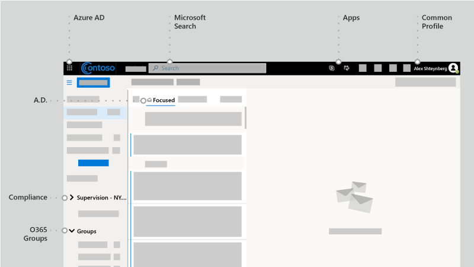

# Identidad y más allá: el punto de vista de un arquitecto

En este artículo, [Alex Shteynberg,](https://www.linkedin.com/in/alex-shteynberg/)arquitecto técnico principal de Microsoft, analiza las principales estrategias de diseño para las organizaciones empresariales que adoptan Microsoft 365 y otros servicios en la nube de Microsoft.

## Acerca del autor

Soy arquitecto técnico principal en el Centro de Tecnología de [Microsoft de Nueva](https://www.microsoft.com/mtc?rtc=1)York. Trabajo principalmente con clientes grandes y requisitos complejos. Mi punto de vista y opiniones se basan en estas interacciones y es posible que no se apliquen a todas las situaciones. Sin embargo, en mi experiencia, si podemos ayudar a los clientes con los desafíos más complejos, podemos ayudar a todos los clientes.

Normalmente trabajo con más de 100 clientes cada año. Aunque cada organización tiene características únicas, es interesante ver tendencias y aspectos comunes. Por ejemplo, una tendencia es el interés entre sectores para muchos clientes. Después de todo, una sucursal bancaria también puede ser una cafetería y un centro de la comunidad.

En mi rol, me centra en ayudar a los clientes a llegar a la mejor solución técnica para abordar su conjunto único de objetivos empresariales. Oficialmente, me centra en la identidad, la seguridad, la privacidad y el cumplimiento. Me gusta el hecho de que estos toque todo lo que hacemos. Me da la oportunidad de participar en la mayoría de los proyectos. Esto me mantiene bastante ocupado y disfrutando de este rol.

Vivo en la ciudad de Nueva York (¡la mejor!) y realmente disfrute de la diversidad de su cultura, su comida y sus personas (no el tráfico). Me gusta viajes cuando puedo y deseo ver la mayor parte del mundo en mi vida. Actualmente estoy investigando un viaje a África para obtener información sobre la asociación.

## Principios básicos

- **La simple suele ser mejor:** puede hacer (casi) cualquier cosa con tecnología, pero no significa que debería hacerlo. Especialmente en el espacio de seguridad, muchos clientes sobreingeniera soluciones. Me gusta [este vídeo de](https://www.youtube.com/watch?v=SOQgABDSYZE) la conferencia stripe de Google para destacar este punto.
- **Personas, proceso, tecnología:** [diseño para que los usuarios](https://en.wikipedia.org/wiki/Human-centered_design) mejoren el proceso, no primero la tecnología. No hay soluciones "perfectas". Necesitamos equilibrar varios factores de riesgo y las decisiones serán diferentes para cada empresa. Demasiados clientes diseñan un enfoque que más adelante evitan sus usuarios.
- **Céntrate en "por qué" primero y "cómo"** más adelante: sé el molesto niño de siete años con un millón de preguntas. No podemos llegar a la respuesta correcta si no sabemos cuáles son las preguntas correctas. Muchos clientes hacen suposiciones sobre cómo deben funcionar las cosas en lugar de definir el problema empresarial. Siempre se pueden tomar varias rutas de acceso.
- **Cola larga de procedimientos recomendados anteriores:** reconocer que los procedimientos recomendados están cambiando a velocidad ligera. Si ha visto Azure AD hace más de tres meses, es probable que no esté actualizado. Todo está sujeto a cambios después de la publicación. La opción "mejor" hoy puede no ser la misma en seis meses a partir de ahora.

## Conceptos de línea base

No omita esta sección. A menudo veo que debo volver a estos temas, incluso para los clientes que han estado usando servicios en la nube durante años.
El lenguaje no es una herramienta precisa. A menudo usamos la misma palabra para significar conceptos diferentes o palabras diferentes para significar el mismo concepto. A menudo uso este diagrama a continuación para establecer alguna terminología de línea base y "modelo de jerarquía".
  

  

 

Cuando aprendes a nadar, es mejor empezar en el grupo y no en medio del océano. No intento ser técnicamente preciso con este diagrama. Es un modelo para analizar algunos conceptos básicos.

En el diagrama:

- Inquilino = una instancia de Azure AD. Se encuentra en la "parte superior" de una jerarquía o en el nivel 1 del diagrama. Podemos considerar que esel "límite" donde ocurre todo lo demás[(aparte de Azure AD B2B).](https://docs.microsoft.com/azure/active-directory/b2b/what-is-b2b) Todos los servicios en la nube empresariales de Microsoft forman parte de uno de estos inquilinos. Los servicios de consumidor son independientes. "Inquilino" aparece en la documentación como inquilino de Office 365, inquilino de Azure, inquilino WVD, entre otros. A menudo encuentro que estas variaciones causan confusión para los clientes.
- Los servicios o suscripciones, nivel 2 del diagrama, pertenecen a un único inquilino. La mayoría de los servicios SaaS son 1:1 y no se pueden mover sin la migración. Azure es diferente, puede mover [la](https://docs.microsoft.com/azure/cost-management-billing/manage/billing-subscription-transfer) facturación o una [suscripción](https://docs.microsoft.com/azure/active-directory/fundamentals/active-directory-how-subscriptions-associated-directory) a otro inquilino. Hay muchos clientes que necesitan mover suscripciones de Azure. Esto tiene varias implicaciones. Los objetos que existen fuera de la suscripción no se mueven (por ejemplo, control de acceso basado en roles, o azure RBAC y objetos de Azure AD, incluidos grupos, aplicaciones, directivas, entre otros). Además, algunos servicios (como Azure Key Vault, Data Adobes, entre otros). No migre los servicios sin una buena necesidad empresarial. Algunos scripts que pueden ser útiles para la migración se [comparten en GitHub.](https://github.com/lwajswaj/azure-tenant-migration)
- Un servicio determinado normalmente tiene algún tipo de límite "subnivel" o nivel 3 (L3). Esto es útil para comprender la segregación de seguridad, directivas, gobierno, entre otros. Unfortunately, there is no uniform name that I know of. Algunos nombres de ejemplo para L3 son: Suscripción de Azure = [recurso;](https://docs.microsoft.com/azure/azure-resource-manager/management/manage-resources-portal) Dynamics 365 CE = [instancia](https://docs.microsoft.com/dynamics365/admin/new-instance-management); Power BI = [área de trabajo;](https://docs.microsoft.com/power-bi/service-create-the-new-workspaces) Power Apps = [entorno;](https://docs.microsoft.com/power-platform/admin/environments-overview) y así sucesivamente.
- El nivel 4 es donde se encuentra la información real. Este "plano de datos" es un tema complejo. Algunos servicios usan Azure AD para RBAC, otros no. Lo analizaré un poco cuando lleguemos a los temas de delegación.

Algunos conceptos adicionales que encuentro que muchos clientes (y empleados de Microsoft) están confundidos o tienen preguntas al respecto:

- Cualquiera puede [crear](https://docs.microsoft.com/azure/active-directory/fundamentals/active-directory-access-create-new-tenant) muchos inquilinos [sin costo.](https://azure.microsoft.com/pricing/details/active-directory/) No necesita un servicio aprovisionado en él. Tengo decenas. Cada nombre de inquilino es único en el servicio en la nube mundial de Microsoft (es decir, no dos inquilinos pueden tener el mismo nombre). Todos tienen el formato de TenantName.onmicrosoft.com. También hay procesos que crean inquilinos automáticamente ([inquilinos no administrados](https://docs.microsoft.com/azure/active-directory/users-groups-roles/directory-self-service-signup)). Por ejemplo, esto puede ocurrir cuando un usuario se suscribe a un servicio empresarial con un dominio de correo electrónico que no existe en ningún otro inquilino.
- En un inquilino administrado, muchos [dominios DNS](https://docs.microsoft.com/azure/active-directory/fundamentals/add-custom-domain) se pueden registrar en él. Esto no cambia el nombre del inquilino original. Actualmente no hay una forma sencilla de cambiar el nombre de un inquilino (aparte de la migración). Aunque técnicamente el nombre del inquilino no es crítico en estos días, es posible que algunos usuarios puedan ver que esto es limitado.
- Debe reservar un nombre de inquilino para su organización incluso si aún no tiene previsto implementar ningún servicio. De lo contrario, alguien puede quitarlo de ti y no hay ningún proceso sencillo para recuperarlo (mismo problema que los nombres DNS). Oirá esto con demasiada frecuencia a los clientes. El nombre del inquilino también debe ser un tema de debate.
- Si es propietario de espacios de nombres DNS, debe agregarlos todos a sus inquilinos. De lo contrario, se podría [crear un](https://docs.microsoft.com/azure/active-directory/users-groups-roles/directory-self-service-signup) inquilino no administrado con este nombre, lo que provoca interrupciones para [que se administrase.](https://docs.microsoft.com/azure/active-directory/users-groups-roles/domains-admin-takeover)
- El espacio de nombres DNS (como contoso.com) puede pertenecer a un único inquilino. Esto tiene implicaciones para varios escenarios (por ejemplo, compartir un dominio de correo electrónico durante una fusión o adquisición, y así sucesivamente). Hay una forma de registrar un sub DNS (como div.contoso.com) en un inquilino diferente, pero debe evitarse. Al registrar un nombre de dominio de nivel superior, se supone que todos los subdominios pertenecen al mismo inquilino. En escenarios multiinquilino (vea a continuación) normalmente se recomienda usar otro nombre de dominio de nivel superior (como contoso.ch o ch-contoso.com).
- ¿Quién debe "poseer" un inquilino? A menudo veo clientes que no saben quién es propietario actualmente de su espacio empresarial. Se trata de una gran marca roja. Llame al soporte técnico de Microsoft lo antes posible. Igual de problemático es cuando se designa un propietario del servicio (a menudo un administrador de Exchange) para administrar un inquilino. El espacio empresarial contendrá todos los servicios que desee en el futuro. El propietario del espacio empresarial debe ser un grupo que pueda tomar decisiones para habilitar todos los servicios en la nube de una organización. Otro problema es cuando se pide a un grupo de propietarios de inquilino que administre todos los servicios. Esto no se escala para organizaciones grandes.
- No hay ningún concepto de inquilino sub/super. Por algún motivo, este remanso se repite a sí mismo. Esto también se aplica a los inquilinos [de Azure AD B2C.](https://docs.microsoft.com/azure/active-directory-b2c/) Oirá demasiadas veces: "Mi entorno B2C está en mi inquilino XYZ" o "¿Cómo mover mi inquilino de Azure a mi inquilino de Office 365?".
- Este documento se centra principalmente en la nube comercial mundial, ya que esto es lo que usan la mayoría de los clientes. A veces resulta útil conocer las [nubes soberanas.](https://docs.microsoft.com/azure/active-directory/develop/authentication-national-cloud) Las nubes soberanas tienen implicaciones adicionales que hay que analizar y que están fuera del ámbito de esta discusión.

## Temas de identidad de línea base

Hay mucha documentación sobre la plataforma de identidad de Microsoft: Azure Active Directory (Azure AD). Para aquellos que están empezando, a menudo resulta abrumador. Incluso después de conocerlo, mantenerse al día con la innovación y los cambios constantes puede ser todo un reto. En mis interacciones con los clientes, a menudo me encuentro como "traductor" entre los objetivos empresariales y los enfoques "Bueno, Mejor, Mejor" para tratar estos (y "notas de opinión" humanas para estos temas). Rara vez hay una respuesta perfecta y la decisión "correcta" es un equilibrio de varios factores de riesgo. A continuación se muestran algunas de las preguntas y áreas de confusión comunes que tiendo a tratar con los clientes.

### Aprovisionamiento

Azure AD no resuelve la falta de gobierno en el mundo de identidades. [El gobierno de](https://docs.microsoft.com/azure/active-directory/governance/identity-governance-overview) identidades debe ser un elemento crítico independiente de las decisiones de la nube. Los requisitos de gobierno cambian con el tiempo, por lo que es un programa y no una herramienta.

[¿Azure AD Connect](https://docs.microsoft.com/azure/active-directory/hybrid/whatis-azure-ad-connect) frente [a Microsoft Identity Manager](https://docs.microsoft.com/microsoft-identity-manager/microsoft-identity-manager-2016) (MIM) frente a otra cosa (de terceros o personalizado)? Ahorre mucho dolor de cabeza ahora y en el futuro y vaya con Azure AD Connect. Hay todos los tipos de smarts en esta herramienta para abordar configuraciones de cliente e innovaciones continuas.

Algunos casos perimetrales que pueden impulsar hacia una arquitectura más compleja:

- Tengo varios bosques de AD sin conectividad de red entre estos. Hay una nueva opción denominada aprovisionamiento [en la nube.](https://docs.microsoft.com/azure/active-directory/cloud-provisioning/what-is-cloud-provisioning)
- No tengo Active Directory ni quiero instalarlo. Azure AD Connect se puede configurar para sincronizar [desde LDAP](https://docs.microsoft.com/azure/active-directory/hybrid/plan-hybrid-identity-design-considerations-tools-comparison) (es posible que se requiera un partner).
- Necesito aprovisionar los mismos objetos para varios inquilinos. Técnicamente, esto no se admite, pero depende de la definición de "igual".

¿Debo personalizar las reglas de sincronización predeterminadas[(objetos de filtro,](https://docs.microsoft.com/azure/active-directory/hybrid/how-to-connect-sync-configure-filtering) [atributos de cambio,](https://docs.microsoft.com/azure/active-directory/hybrid/reference-connect-sync-attributes-synchronized)identificador de [inicio](https://docs.microsoft.com/azure/active-directory/hybrid/plan-connect-userprincipalname)de sesión alternativo, entre otros)? Evitalo. Una plataforma de identidad es tan valiosa como los servicios que la usan. Si bien puedes hacer todo tipo de configuraciones descacabadas, para responder a esta pregunta debes ver el impacto en las aplicaciones. Si filtra objetos habilitados para correo, la GAL de los servicios en línea estará incompleta; si la aplicación se basa en atributos específicos, filtrar estos tendrá un impacto impredecible; y así sucesivamente. No es una decisión del equipo de identidad.

Xyz SaaS admite el aprovisionamiento just-in-time (JIT), ¿por qué me requiere que me sincronice? Consulta más arriba. Muchas aplicaciones necesitan información de "perfil" para la funcionalidad. No puede tener una GAL si todos los objetos habilitados para correo no están disponibles. Lo mismo se aplica al [aprovisionamiento de usuarios](https://docs.microsoft.com/azure/active-directory/app-provisioning/user-provisioning) en aplicaciones integradas con Azure AD.

### Autenticación

[Sincronización de hash de](https://docs.microsoft.com/azure/active-directory/hybrid/how-to-connect-password-hash-synchronization) contraseña (PHS) frente [a](https://docs.microsoft.com/azure/active-directory/hybrid/how-to-connect-pta-how-it-works) autenticación de paso a través (PTA) frente a [federación](https://docs.microsoft.com/azure/active-directory/hybrid/how-to-connect-fed-compatibility).

Por lo general, hay un [debate entusiasta en torno](https://docs.microsoft.com/azure/active-directory/hybrid/choose-ad-authn) a la federación. Lo más sencillo suele ser mejor y, por lo tanto, usar PHS a menos que tenga una buena razón para no hacerlo. También es posible configurar diferentes métodos de autenticación para diferentes dominios DNS en el mismo inquilino. 

Algunos clientes habilitan la federación + PHS principalmente para:

- Una opción para [volver a](https://docs.microsoft.com/azure/active-directory/hybrid/plan-migrate-adfs-password-hash-sync) (para la recuperación ante desastres) si el servicio de federación no está disponible.
- Capacidades adicionales (por ejemplo, [Azure AD DS)](https://docs.microsoft.com/azure/active-directory-domain-services/tutorial-configure-password-hash-sync)y servicios de seguridad (por ejemplo: credenciales [filtradas)](https://docs.microsoft.com/azure/active-directory/reports-monitoring/concept-risk-events#leaked-credentials)
- Compatibilidad con servicios en Azure que no comprenden la autenticación federada (por ejemplo, [Archivos de Azure).](https://docs.microsoft.com/azure/storage/files/storage-files-active-directory-overview)

A menudo, paso a los clientes a través del flujo de autenticación de cliente para aclarar algunos conceptos erróneos. El resultado es similar a la imagen siguiente, que no es tan bueno como el proceso interactivo de llegar allí.

Este tipo de dibujo de pizarra ilustra dónde se aplican las directivas de seguridad dentro del flujo de una solicitud de autenticación. En este ejemplo, las directivas aplicadas a través del servicio de federación de Active Directory (AD FS) se aplican a la primera solicitud de servicio, pero no a las solicitudes de servicio posteriores. Este es al menos un motivo para mover los controles de seguridad a la nube tanto como sea posible.

Hemos estado buscando el soñar del inicio de [sesión único](https://docs.microsoft.com/azure/active-directory/manage-apps/what-is-single-sign-on) (SSO) durante tanto tiempo como pueda recordar. Algunos clientes creen que pueden lograr esto eligiendo el proveedor de federación "correcto" (STS). Azure AD puede ayudar significativamente a habilitar [las funcionalidades de SSO,](https://docs.microsoft.com/azure/active-directory/manage-apps/plan-sso-deployment) pero ningún STS es mágico. Hay demasiados métodos de autenticación "heredados" que se siguen utilizando para aplicaciones críticas. La ampliación de Azure AD con [soluciones de asociados](https://docs.microsoft.com/azure/active-directory/saas-apps/tutorial-list) puede abordar muchos de estos escenarios. SSO es una estrategia y un recorrido. No se puede llegar sin avanzar hacia los [estándares de las aplicaciones.](https://docs.microsoft.com/azure/active-directory/develop/v2-app-types) Este tema está relacionado con un viaje a [la](https://docs.microsoft.com/azure/active-directory/authentication/concept-authentication-passwordless) autenticación sin contraseña, que tampoco tiene una respuesta mágica.

[La autenticación multifactor](https://docs.microsoft.com/azure/active-directory/authentication/concept-mfa-howitworks) (MFA) es esencial hoy en día[(aquí](https://techcommunity.microsoft.com/t5/azure-active-directory-identity/your-pa-word-doesn-t-matter/ba-p/731984) para obtener más información). Agrega análisis de [comportamiento de usuario y](https://docs.microsoft.com/azure/active-directory/authentication/tutorial-risk-based-sspr-mfa) tienes una solución que evita los ataques cibernéticos más comunes. Incluso los servicios de consumidor se están moviendo para requerir MFA. Sin embargo, aún me reuniré con muchos clientes que no quieren pasar a los métodos [de autenticación](https://docs.microsoft.com/microsoft-365/enterprise/hybrid-modern-auth-overview) modernos. El argumento más importante que oirá es que afectará a los usuarios y a las aplicaciones heredadas. A veces, una buena idea puede ayudar a los clientes a avanzar: Exchange Online [anunció cambios.](https://techcommunity.microsoft.com/t5/exchange-team-blog/basic-auth-and-exchange-online-february-2020-update/ba-p/1191282) Ahora hay muchos informes [de](https://docs.microsoft.com/azure/active-directory/fundamentals/concept-fundamentals-block-legacy-authentication) Azure AD disponibles para ayudar a los clientes con esta transición.

### Authorization

Según [Wikipedia,](https://en.wikipedia.org/wiki/Authorization)"autorizar" es definir una directiva de acceso. Muchas personas lo ven como la capacidad de definir controles de acceso a un objeto (archivo, servicio, entre otros). En el mundo actual de las ciberamenazas, este concepto evoluciona rápidamente a una directiva dinámica que puede reaccionar a varios vectores de amenazas y ajustar rápidamente los controles de acceso en respuesta a estos. Por ejemplo, si accedo a mi cuenta bancaria desde una ubicación inusual, se obtienen pasos de confirmación adicionales. Para abordar esto, debemos tener en cuenta no solo la propia directiva, sino el ecosistema de metodologías de detección de amenazas y correlación de señales.

El motor de directivas de Azure AD se implementa mediante directivas [de acceso condicional.](https://docs.microsoft.com/azure/active-directory/conditional-access/overview) Este sistema depende de la información de una variedad de otros sistemas de detección de amenazas para tomar decisiones dinámicas. Una vista sencilla sería algo parecido a la siguiente ilustración:

La combinación de todas estas señales permite directivas dinámicas como estas:

- Si se detecta una amenaza en el dispositivo, el acceso a los datos se reducirá a la web solo sin la capacidad de descarga.
- Si está descargando un volumen inusualmente alto de datos, todo lo que descargue se cifrará y restringirá.
- Si accede a un servicio desde un dispositivo no administrado, se le bloquearán los datos altamente confidenciales, pero se le permitirá acceder a datos no restringidos sin la capacidad de copiarlos en otra ubicación.

Si está de acuerdo con esta definición ampliada de autorización, deberá implementar soluciones adicionales. Las soluciones que implemente dependerán de la dinámica que desee que sea la directiva y de las amenazas que desee priorizar. Algunos ejemplos de estos sistemas son:

- [Azure AD Identity Protection](https://docs.microsoft.com/azure/active-directory/identity-protection/) 
- [Microsoft Defender for Identity](https://docs.microsoft.com/azure-advanced-threat-protection/)
- [Microsoft Defender para punto de conexión](https://docs.microsoft.com/windows/security/threat-protection/microsoft-defender-atp/microsoft-defender-advanced-threat-protection)
- [Microsoft Defender para Office 365](https://docs.microsoft.com/microsoft-365/security/office-365-security/office-365-atp?view=o365-worldwide)
- [Microsoft Cloud App Security](https://docs.microsoft.com/cloud-app-security/) (MCAS)
- [Microsoft 365 Defender](https://docs.microsoft.com/microsoft-365/security/mtp/microsoft-threat-protection?view=o365-worldwide)
- [Microsoft Intune](https://docs.microsoft.com/mem/intune/)
- [Microsoft Information Protection](https://docs.microsoft.com/microsoft-365/compliance/protect-information?view=o365-worldwide) (MIP)
- [Azure Sentinel](https://docs.microsoft.com/azure/sentinel/)

Por supuesto, además de Azure AD, varios servicios y aplicaciones tienen sus propios modelos de autorización específicos. Algunos de ellos se de abordarán más adelante en la sección de delegación.

### Auditoría

Azure AD tiene funcionalidades detalladas [de auditoría e informes.](https://docs.microsoft.com/azure/active-directory/reports-monitoring/) Sin embargo, este no suele ser el único origen de información necesario para tomar decisiones de seguridad. Vea más información al respecto en la sección de delegación.

## No hay ningún exchange

No se preocupe. Esto no significa que Exchange esté en desuso (o SharePoint, y así sucesivamente). Sigue siendo un servicio básico. Lo que quiero decir es que, desde hace bastante tiempo, los proveedores de tecnología han estado transfiriendo experiencias de usuario (UX) para incluir componentes de varios servicios. En Microsoft 365, un ejemplo sencillo es["datos](https://support.office.com/article/Attach-files-or-insert-pictures-in-Outlook-email-messages-BDFAFEF5-792A-42B1-9A7B-84512D7DE7FC)adjuntos modernos" donde los datos adjuntos del correo electrónico se almacenan en SharePoint Online o OneDrive para la Empresa.

Si observa el cliente de Outlook, puede ver muchos servicios que están "conectados" como parte de esta experiencia, no solo exchange. Esto incluye Azure AD, Microsoft Search, Aplicaciones, Perfil, cumplimiento y grupos de Office 365. 

Obtenga información [sobre Microsoft Fluid Framework para](https://techcommunity.microsoft.com/t5/microsoft-365-blog/microsoft-ignite-blog-microsoft-fluid-framework-preview/ba-p/978268) obtener una vista previa de las próximas funcionalidades. En versión preliminar ahora, puedo leer y responder a las conversaciones de Teams directamente en Outlook. De hecho, el [cliente de Teams](https://products.office.com/microsoft-teams/download-app) es uno de los ejemplos más destacados de esta estrategia. 

En general, es cada vez más difícil dibujar una línea clara entre Office 365 y otros servicios en las nubes de Microsoft. Lo veo como una gran ventaja para los clientes, ya que pueden beneficiarse de la innovación total en todo lo que hacemos, incluso si usan un componente. Muy interesante y tiene implicaciones de gran alcance para muchos clientes.

Hoy en día, encuentro que muchos grupos de IT de clientes están estructurados en torno a "productos". Es lógico para un mundo local, ya que necesita un experto para cada producto específico. Sin embargo, estoy totalmente contenta de no tener que volver a depurar una base de datos de Active Directory o Exchange a medida que estos servicios se han movido a la nube. La automatización (qué tipo de nube es) quita ciertos trabajos manuales repetitivos (vea lo que ha ocurrido con las fábricas). Sin embargo, estos se reemplazan por requisitos más complejos para comprender la interacción entre servicios, el impacto, las necesidades empresariales, etc. Si estás dispuesto a [aprender,](https://docs.microsoft.com/learn/)hay excelentes oportunidades habilitadas por la transformación en la nube. Antes de saltar a la tecnología, a menudo hablaré con los clientes sobre cómo administrar los cambios en las estructuras de equipo y las habilidades de TI.

Para todos los desarrolladores y fan-people de SharePoint, deje de preguntar "¿Cómo puedo hacer XYZ en SharePoint Online?". Use [Power Automate](https://docs.microsoft.com/power-automate/) (o Flow) para el flujo de trabajo, es una plataforma mucho más eficaz. Use [Azure Bot Framework para](https://docs.microsoft.com/azure/bot-service/?view=azure-bot-service-4.0) crear una mejor experiencia de usuario para la lista de elementos de 500 K. Empiece a usar [Microsoft Graph en](https://developer.microsoft.com/graph/) lugar de CSOM. [Microsoft Teams](https://docs.microsoft.com/MicrosoftTeams/Teams-overview) incluye SharePoint, pero también un mundo más. Hay muchos otros ejemplos que puedo enumerar. Hay un mundo enorme y fantástico por ahí. Abra la puerta y [empiece a explorar.](https://docs.microsoft.com)

El otro impacto común es en el área de cumplimiento. Este enfoque entre servicios parece confundir completamente muchas directivas de cumplimiento. Seguiré viendo a las organizaciones que den un estado: "Necesito diario todas las comunicaciones de correo electrónico a un sistema de exhibición de documentos electrónicos". ¿Qué significa esto realmente cuando el correo electrónico ya no es solo correo electrónico, sino una ventana a otros servicios? Office 365 tiene un enfoque completo para el [cumplimiento,](https://docs.microsoft.com/microsoft-365/compliance/)pero el cambio de personas y procesos suele ser mucho más difícil que la tecnología.

Hay muchas otras personas y implicaciones de procesos. En mi opinión, se trata de un área crítica y poco analizada. Quizás más en otro artículo.

## Opciones de estructura de inquilinos

### Inquilino único frente a multiinquilino

En general, la mayoría de los clientes deben tener un único inquilino de producción. Hay muchas razones por las que varios inquilinos son difíciles (darle una búsqueda de [Bing)](https://www.bing.com/search?q=office%20365%20multiple%20tenants)o leer este [informe técnico.](https://aka.ms/multi-tenant-user) Al mismo tiempo, muchos clientes empresariales con los que trabajo tienen otro inquilino (pequeño) para aprendizaje, pruebas y experimentación de TI. El acceso a Azure entre inquilinos es más fácil con [Azure Alquitán.](https://azure.microsoft.com/services/azure-lighthouse/) Office 365 y muchos otros servicios SaaS tienen límites para escenarios entre inquilinos. Hay mucho que tener en cuenta en los [escenarios de Azure AD B2B.](https://docs.microsoft.com/azure/active-directory/b2b/what-is-b2b)

Muchos clientes terminan con varios inquilinos de producción después de una fusión y adquisición (M&A) y quieren consolidar. Hoy en día eso no es sencillo y requeriría servicios de consultoría de Microsoft (MCS) o un partner además de software de terceros. Hay trabajo de ingeniería continuo para abordar diversos escenarios con clientes multiinquilino en el futuro.

Algunos clientes eligen ir con más de un inquilino. Esta debe ser una decisión muy cuidadosa y casi siempre basada en motivos empresariales. Algunos ejemplos son los siguientes:

- Una estructura empresarial de tipo holding en la que no se requiere una colaboración sencilla entre diferentes entidades y hay necesidades administrativas y de aislamiento sólidas.
- Después de una adquisición, se toma una decisión empresarial para mantener separadas dos entidades.
- Simulación del entorno de un cliente que no cambia el entorno de producción del cliente. 
- Desarrollo de software para clientes.

En estos escenarios de varios inquilinos, los clientes a menudo desean mantener algunas configuraciones iguales en todos los inquilinos o informar sobre los cambios y derivas de configuración. Esto suele significar pasar de los cambios manuales a la configuración como código. El soporte técnico de Microsoft Ticket ofrece un taller para estos tipos de requisitos basados en esta IP pública: [https://Microsoft365dsc.com](https://Microsoft365dsc.com) .

### Multi-Geo

A [Multi-Geo](https://docs.microsoft.com/microsoft-365/enterprise/microsoft-365-multi-geo) o no a Multi-Geo, esa es la pregunta. Con Office 365 Multi-Geo, puede aprovisionar y almacenar datos en reposo en las ubicaciones geográficas que haya elegido para cumplir los requisitos de [residencia de](https://docs.microsoft.com/microsoft-365/enterprise/o365-data-locations) datos. Hay muchos conceptos erróneos sobre esta funcionalidad. Tenga en cuenta lo siguiente:

- No proporciona ventajas de rendimiento. Podría empeorar el rendimiento si el diseño [de red](https://aka.ms/office365networking) no es correcto. Consigue que los dispositivos se "cierren" a la red de Microsoft, no necesariamente a los datos.
- No es una solución para el [cumplimiento del RGPD.](https://www.microsoft.com/trust-center/privacy/gdpr-overview) El RGPD no se centra en la independencia de datos ni en las ubicaciones de almacenamiento. Existen otros marcos de cumplimiento para ello.
- No resuelve la delegación de administración (vea a continuación) ni las [barreras de información.](https://docs.microsoft.com/microsoft-365/compliance/information-barriers)
- No es lo mismo que multiinquilino y requiere flujos de trabajo de aprovisionamiento [de](https:/docs.microsoft.com/azure/active-directory/hybrid/how-to-connect-sync-feature-preferreddatalocation) usuarios adicionales.
- No mueve [el espacio empresarial](https://docs.microsoft.com/microsoft-365/enterprise/moving-data-to-new-datacenter-geos) (Azure AD) a otra zona geográfica. 

## Delegación de administración

En la mayoría de las organizaciones grandes, la separación de tareas y el control de acceso basado en roles (RBAC) es una realidad necesaria. Me disculpo con antelación. Esto no es tan sencillo como algunos clientes quieren que sea. Los requisitos de cliente, legales, de cumplimiento y otros requisitos son diferentes y a veces están en conflicto en todo el mundo. La simplicidad y la flexibilidad suelen estar en lados opuestos entre sí. Don't get me wrong, we can do a better job at this. Se han realizado (y habrá) mejoras significativas con el tiempo. Visite su Centro de Tecnología de [Microsoft](https://www.microsoft.com/mtc) local para trabajar con el modelo que se adapta a sus requisitos empresariales sin leer los documentos 379230. Aquí me centraré en lo que debería pensar y no en por qué es así. A continuación se muestran cinco áreas diferentes para planear y algunas de las preguntas comunes que he encontrado.

### Centros de administración de Azure AD y Microsoft 365

Hay una lista larga y creciente de [roles integrados.](https://docs.microsoft.com/azure/active-directory/users-groups-roles/directory-assign-admin-roles) Cada rol consta de una lista de permisos de rol agrupados para permitir que se realicen acciones específicas. Puede ver estos permisos en la pestaña "Descripción" dentro de cada rol. Como alternativa, puede ver una versión más legible para las personas de estos en el Centro de administración de Microsoft 365. No se pueden modificar las definiciones de roles integrados. Por lo general, los a agrupar en tres categorías:

- **Administrador global:** este rol "todo eficaz" debe estar altamente [protegido](https://docs.microsoft.com/microsoft-365/enterprise/protect-your-global-administrator-accounts) como lo haría en otros sistemas. Entre las recomendaciones típicas se incluyen: sin asignación permanente y usar Azure AD Privileged Identity Management (PIM); autenticación segura; y así sucesivamente. Es interesante que este rol no le dé acceso a todo de forma predeterminada. Por lo general, veo confusión sobre el acceso de cumplimiento y el acceso de Azure, que se explica más adelante. Sin embargo, este rol siempre puede asignar acceso a otros servicios del espacio empresarial. 
- **Administradores de servicios específicos:** algunos servicios (Exchange, SharePoint, Power BI, entre otros) consumen roles de administración de alto nivel de Azure AD. Esto no es coherente en todos los servicios y más adelante se analizan más roles específicos del servicio.
- **Funcional:** hay una larga (y creciente) lista de roles centrados en operaciones específicas (invitador de invitado, y así sucesivamente). Periódicamente, se agregan más de estos en función de las necesidades del cliente.

No es posible delegar todo (aunque la diferencia disminuye), lo que significa que a veces tendría que usarse el rol de administrador global. La configuración como código y la automatización deben tenerse en cuenta en lugar de la pertenencia de personas a este rol.

**Nota:** El Centro de administración de Microsoft 365 tiene una interfaz más fácil de usar, pero tiene un subconjunto de funcionalidades en comparación con la experiencia de administrador de Azure AD. Ambos portales usan los mismos roles de Azure AD, por lo que los cambios se producen en el mismo lugar. Sugerencia: si desea una interfaz de usuario de administración centrada en la administración de identidades sin todos los desordenes de Azure, use [https://aad.portal.azure.com](https://aad.portal.azure.com) . 

¿Qué se encuentra en el nombre? No haga suposiciones a partir del nombre del rol. El idioma no es una herramienta muy precisa. El objetivo debe ser definir las operaciones que se deben delegar antes de ver qué roles son necesarios. Agregar a alguien al rol "Lector de seguridad" no hace que vean la configuración de seguridad en todo.

La capacidad de crear [roles personalizados](https://docs.microsoft.com/azure/active-directory/users-groups-roles/roles-custom-overview) es una pregunta común. Esto está limitado en Azure AD actualmente (consulta a continuación), pero aumentará en funcionalidades con el tiempo. Los veo como aplicables a las funciones de Azure AD y no pueden abarcar "abajo" el modelo de jerarquía (se explicó anteriormente). Siempre que trabajo con "personalizado", tiendo a volver a mi principal de "simple es mejor".

Otra cuestión común es la capacidad de ámbito de roles a un subconjunto de un directorio. Un ejemplo es algo así como "Administrador del departamento de soporte técnico solo para usuarios de la UE". [Las unidades](https://docs.microsoft.com/azure/active-directory/users-groups-roles/directory-administrative-units) administrativas (AU) están diseñadas para solucionar este problema. Como se mencionó anteriormente, los veo como aplicables a las funciones de Azure AD y puede que no se abarquen "hacia abajo". Por supuesto, ciertos roles no tienen sentido en el ámbito (administradores globales, administradores de servicio, entre otros).

Hoy en día, todos estos roles requieren pertenencia directa (o asignación dinámica si usa [PIM de Azure AD).](https://docs.microsoft.com/azure/active-directory/privileged-identity-management/) Esto significa que los clientes deben administrarlos directamente en Azure AD y no pueden basarse en una pertenencia a grupos de seguridad. No me gusta crear scripts para administrarlos, ya que tendría que ejecutarse con derechos elevados. Por lo general, recomiendo la integración de API con sistemas de procesos como ServiceNow o el uso de herramientas de gobierno de partners como Saviynt. Hay trabajo de ingeniería que se va a solucionar a lo largo del tiempo.

Mencioné [pim de Azure AD varias](https://docs.microsoft.com/azure/active-directory/privileged-identity-management/) veces. Hay una solución de Administración de  acceso con privilegios (PAM) de Microsoft Identity Manager (MIM) correspondiente para controles locales. Es posible que también desee ver las estaciones de trabajo de [acceso con privilegios](https://docs.microsoft.com/windows-server/identity/securing-privileged-access/privileged-access-workstations) (PAWs) y el Gobierno de [identidad de Azure AD.](https://docs.microsoft.com/azure/active-directory/governance/identity-governance-overview) También hay varias herramientas de terceros, que pueden habilitar la elevación de roles dinámica, just-in-time y just-in-time. Esto suele formar parte de una discusión más amplia para proteger un entorno. 

A veces, los escenarios llaman para agregar un usuario externo a un rol (consulta la sección multiinquilino, arriba). Esto funciona bien. [Azure AD B2B](https://docs.microsoft.com/azure/active-directory/b2b/) es otro tema grande y divertido para que los clientes puedan pasar por ellos, quizás en otro artículo.

### Centro de seguridad y cumplimiento (SCC)

Los permisos del Centro de seguridad y & cumplimiento de [Office 365](https://docs.microsoft.com/microsoft-365/security/office-365-security/permissions-in-the-security-and-compliance-center) son una colección de "grupos de roles", que son independientes y distintos de los roles de Azure AD. Esto puede resultar confuso porque algunos de estos grupos de roles tienen el mismo nombre que los roles de Azure AD (por ejemplo, Lector de seguridad), pero pueden tener una pertenencia diferente. Me gusta el uso de roles de Azure AD. Cada grupo de roles consta de uno o más "roles" (¿a qué me refiere sobre la reusación de la misma palabra?) y tiene miembros de Azure AD, que son objetos habilitados para correo electrónico. Además, puede crear un grupo de roles con el mismo nombre que un rol, que puede contener o no esa función (evite esta confusión).

En cierto sentido, se trata de una evolución del modelo de grupos de roles de Exchange. Sin embargo, Exchange Online tiene su propia [interfaz de administración de grupos de](https://docs.microsoft.com/exchange/permissions-exo) roles. Algunos grupos de roles de Exchange Online están bloqueados y administrados desde Azure AD o el Centro de seguridad y cumplimiento de &, pero otros pueden tener los mismos nombres o nombres similares y se administran en Exchange Online (lo que agrega la confusión). Le recomiendo que evite usar la interfaz de usuario de Exchange Online a menos que necesite ámbitos para la administración de Exchange.

No puede crear roles personalizados. Los roles se definen mediante servicios creados por Microsoft y crecerán a medida que se introduzcan nuevos servicios. Esto es similar en concepto a [los roles definidos por las aplicaciones](https://docs.microsoft.com/azure/active-directory/develop/howto-add-app-roles-in-azure-ad-apps) en Azure AD. Cuando se habilitan nuevos servicios, a menudo es necesario crear nuevos grupos de roles para conceder o delegar el acceso a estos (por ejemplo, la administración de [riesgos interno).](https://docs.microsoft.com/microsoft-365/compliance/insider-risk-management-configure?view=o365-worldwide#step-1-required-enable-permissions-for-insider-risk-management)

Estos grupos de roles también requieren pertenencia directa y no pueden contener grupos de Azure AD. Desafortunadamente, hoy en día estos grupos de roles no son compatibles con AZURE AD PIM. Al igual que los roles de Azure AD, tiendo a recomendar la administración de estos a través de API o un producto de gobierno de partners como Saviynt u otros.

Los roles del Centro de seguridad & cumplimiento abarcan Microsoft 365 y no puede establecer el ámbito de estos grupos de roles en un subconjunto del entorno (como puede hacer con las unidades administrativas de Azure AD). Muchos clientes preguntan cómo pueden subdelegarse. Por ejemplo, "crear una directiva DLP solo para los usuarios de la UE". Hoy en día, si tiene derechos para una función específica en el Centro de seguridad y cumplimiento de &, tiene derechos sobre todo lo que cubre esta función en el espacio empresarial. Sin embargo, muchas directivas tienen capacidades para dirigirse a  un subconjunto del entorno (por ejemplo, "hacer que estas etiquetas solo estén disponibles para estos usuarios"). El gobierno y la comunicación adecuados son un componente clave para evitar conflictos. Algunos clientes eligen implementar un enfoque de "configuración como código" para abordar la subdelegación en el Centro de & cumplimiento. Algunos servicios específicos admiten la subdelegación (consulta a continuación).

Cabe destacar que los controles administrados actualmente a través del Centro de seguridad y cumplimiento de & (protection.office.com) se están migrando a dos portales de administración independientes: security.microsoft.com y compliance.microsoft.com. El cambio es la única constante.

### Específico del servicio

Como se mencionó anteriormente, muchos clientes buscan lograr un modelo de delegación más granular. Un ejemplo común: "Administrar el servicio XYZ solo para usuarios y ubicaciones de división X" (o alguna otra dimensión). La capacidad de hacerlo depende de cada servicio y no es coherente en todos los servicios y capacidades. Además, cada servicio puede tener un modelo RBAC independiente y único. En lugar de hablar de todos ellos (se tardarán unas horas), estoy agregando vínculos relevantes para cada servicio. Esta no es una lista completa, pero le ayudará a empezar.

- **Exchange Online** - [https://docs.microsoft.com/exchange/permissions-exo/permissions-exo](https://docs.microsoft.com/exchange/permissions-exo/permissions-exo) 
- **SharePoint Online** - [https://docs.microsoft.com/sharepoint/manage-site-collection-administrators](https://docs.microsoft.com/sharepoint/manage-site-collection-administrators) 
- **Microsoft Teams**  -  [https://docs.microsoft.com/microsoftteams/itadmin-readiness](https://docs.microsoft.com/microsoftteams/itadmin-readiness )
- **exhibición de documentos electrónicos** - [https://docs.microsoft.com/microsoft-365/compliance/assign-ediscovery-permissions](https://docs.microsoft.com/microsoft-365/compliance/) 
  + **Filtrado de permisos**  -  [https://docs.microsoft.com/microsoft-365/compliance/permissions-filtering-for-content-search](https://docs.microsoft.com/microsoft-365/compliance/)
  + **Límites de cumplimiento**  -  [https://docs.microsoft.com/microsoft-365/compliance/set-up-compliance-boundaries](https://docs.microsoft.com/microsoft-365/compliance/set-up-compliance-boundaries )
  + **eDiscovery avanzado**  -  [https://docs.microsoft.com/microsoft-365/compliance/overview-ediscovery-20](https://docs.microsoft.com/microsoft-365/compliance/overview-ediscovery-20 )
- **Yammer** - [https://docs.microsoft.com/yammer/manage-yammer-users/manage-yammer-admins](https://docs.microsoft.com/yammer/manage-yammer-users/manage-yammer-admins) 
- **Multi-geo** - [https://docs.microsoft.com/microsoft-365/enterprise/add-a-sharepoint-geo-admin](https://docs.microsoft.com/microsoft-365/enterprise/add-a-sharepoint-geo-admin) 
- **Dynamics 365:**[https://docs.microsoft.com/dynamics365/](https://docs.microsoft.com/dynamics365/)  
  Nota: este vínculo es a la raíz de la documentación. Hay varios tipos de servicios con variaciones en el modelo de administración y delegación.
- **Power Platform**  -  [https://docs.microsoft.com/power-platform/admin/admin-documentation](https://docs.microsoft.com/power-platform/admin/admin-documentation )
  + **Power Apps**  -  [https://docs.microsoft.com/power-platform/admin/wp-security](https://docs.microsoft.com/power-platform/admin/wp-security )  
    Nota: hay varios tipos con variaciones en los modelos de administración y delegación.
  + **Power Automate**  -  [https://docs.microsoft.com/power-automate/environments-overview-admin](https://docs.microsoft.com/power-automate/environments-overview-admin )
  + **Power BI**  -  [https://docs.microsoft.com/power-bi/service-admin-governance](https://docs.microsoft.com/power-bi/service-admin-governance )  
Nota: la seguridad y delegación de la plataforma de datos (que Power BI es un componente) es un área compleja.
- **MEM/Intune**  -  [https://docs.microsoft.com/mem/intune/fundamentals/role-based-access-control](https://docs.microsoft.com/mem/intune/fundamentals/role-based-access-control )
- **Microsoft Defender para punto de conexión**  -  [https://docs.microsoft.com/windows/security/threat-protection/microsoft-defender-atp/user-roles](https://docs.microsoft.com/windows/security/threat-protection/microsoft-defender-atp/user-roles )
- **Microsoft 365 Defender** - [https://docs.microsoft.com/microsoft-365/security/mtp/mtp-permissions](https://docs.microsoft.com/microsoft-365/security/mtp/mtp-permissions)
- **Microsoft Cloud App Security** - [https://docs.microsoft.com/cloud-app-security/manage-admins](https://docs.microsoft.com/cloud-app-security/manage-admins)
- **Stream**  -  [https://docs.microsoft.com/stream/assign-administrator-user-role](https://docs.microsoft.com/stream/assign-administrator-user-role )
- **Barreras de información**  -  [https://docs.microsoft.com/microsoft-365/compliance/information-barriers](https://docs.microsoft.com/microsoft-365/compliance/information-barriers )

Para el resto, la búsqueda en Docs ha sido realmente buena en los últimos tiempos: [https://docs.microsoft.com/](https://docs.microsoft.com/microsoft-365/compliance/information-barriers) . 

### Registros de actividades

Office 365 tiene un [registro de auditoría unificado.](https://docs.microsoft.com/microsoft-365/compliance/search-the-audit-log-in-security-and-compliance) Es un registro [muy detallado,](https://docs.microsoft.com/office/office-365-management-api/office-365-management-activity-api-schema)pero no lea demasiado en el nombre. Es posible que no contenga todo lo que desee o necesite para sus necesidades de seguridad y cumplimiento. Además, algunos clientes están realmente interesados en [la auditoría avanzada.](https://docs.microsoft.com/microsoft-365/compliance/advanced-audit)

Entre los ejemplos de registros de Microsoft 365 a los que se tiene acceso a través de otras API se incluyen los siguientes:

- [Azure AD](https://docs.microsoft.com/azure/azure-monitor/platform/diagnostic-settings) (actividades no relacionadas con Office 365)
- [Seguimiento de mensajes de Exchange](https://docs.microsoft.com/powershell/module/exchange/get-messagetrace)
- Threat/UEBA Systems discussed above (for example, Azure AD Identity Protection, Microsoft Cloud App Security, Microsoft Defender for Endpoint, and so on)
- [Protección de la información de Microsoft](https://docs.microsoft.com/microsoft-365/compliance/data-classification-activity-explorer?view=o365-worldwide)
- [Microsoft Defender para punto de conexión](https://docs.microsoft.com/windows/security/threat-protection/microsoft-defender-atp/api-power-bi)
- [Microsoft Graph](https://graph.microsoft.com)

Es importante identificar primero todos los orígenes de registro necesarios para un programa de seguridad y cumplimiento. Tenga en cuenta también que los distintos registros tienen límites de retención en línea diferentes. 

Desde la perspectiva de la delegación de administrador, la mayoría de los registros de actividad de Microsoft 365 no tienen un modelo RBAC integrado. Si tiene permiso para ver un registro, puede ver todo en él. Un ejemplo común de un requisito del cliente es: "Quiero poder consultar la actividad solo para los usuarios de la UE" (o alguna otra dimensión). Para lograr este requisito, necesitamos transferir registros a otro servicio. En la nube de Microsoft, se recomienda transferirlo a [Azure Sentinel](https://docs.microsoft.com/azure/sentinel/overview) o [Log Analytics.](https://docs.microsoft.com/azure/azure-monitor/learn/quick-create-workspace) 

Diagrama de alto nivel:

  

El diagrama anterior representa las capacidades integradas para enviar registros al Centro de eventos o a Azure Storage o a Azure Log Analytics. Todavía no todos los sistemas incluyen esta configuración. Pero hay otros métodos para enviar estos registros al mismo repositorio. Por ejemplo, vea [Protección de teams con Azure Sentinel.](https://techcommunity.microsoft.com/t5/azure-sentinel/protecting-your-teams-with-azure-sentinel/ba-p/1265761)

Combinar todos los registros en una ubicación de almacenamiento incluye ventajas adicionales, como correlaciones cruzadas, tiempos de retención personalizados, aumento con los datos necesarios para admitir el modelo RBAC, y así sucesivamente. Una vez que los datos están en este sistema de almacenamiento, puede crear un panel de Power BI (u otro tipo de visualización) con un modelo RBAC adecuado.

Los registros no tienen que dirigirse a un solo lugar. También puede ser conveniente integrar registros de [Office 365](https://docs.microsoft.com/cloud-app-security/connect-office-365-to-microsoft-cloud-app-security) con Microsoft Cloud App Security o un modelo RBAC personalizado en [Power BI.](https://docs.microsoft.com/microsoft-365/admin/usage-analytics/usage-analytics?view=o365-worldwide) Los diferentes repositorios tienen diferentes ventajas y audiencias.

Cabe mencionar que hay un sistema de análisis integrado muy completo para seguridad, amenazas, vulnerabilidades, entre otros, en un servicio llamado [Microsoft 365 Defender.](https://docs.microsoft.com/microsoft-365/security/mtp/microsoft-threat-protection?view=o365-worldwide)

Muchos clientes grandes desean transferir estos datos de registro a un sistema de terceros (por ejemplo, SIEM). Hay diferentes enfoques para esto, pero en general [Azure Event Hub](https://docs.microsoft.com/azure/azure-monitor/platform/stream-monitoring-data-event-hubs) y [Graph](https://docs.microsoft.com/graph/security-integration) son buenos puntos de partida.

### Azure

A menudo se me pregunta si hay una forma de separar los roles de privilegios altos entre Azure AD, Azure y SaaS (por ejemplo, administrador global de Office 365, pero no azure).  La verdad es que no.  La arquitectura de varios inquilinos es necesaria si se requiere una separación administrativa completa, pero esto agrega una [complejidad significativa](https://aka.ms/multi-tenant-user) (vea más arriba). Todos estos servicios forman parte del mismo límite de seguridad/identidad (vea el modelo de jerarquía anterior).  

Es importante comprender las relaciones entre varios servicios del mismo inquilino. Estoy trabajando con muchos clientes que están creando soluciones empresariales que abarcan Azure, Office 365 y Power Platform (y a menudo también servicios en la nube locales y de terceros). Un ejemplo común:

1. Quiero colaborar en un conjunto de documentos,imágenes/etc. (Office 365)
2. Enviar cada uno de ellos a través de un proceso de aprobación (Power Platform)
3.  Una vez aprobados todos los componentes, ensambla estos en una API unificada de [Microsoft Graph](https://docs.microsoft.com/azure/active-directory/develop/microsoft-graph-intro) (Azure) es su mejor amigo para estos.  No imposible, pero significativamente más complejo para diseñar una solución que abarca [varios inquilinos.](https://docs.microsoft.com/azure/active-directory/develop/single-and-multi-tenant-apps)

Azure Role-Based Access Control (RBAC) permite una administración de acceso detallada para Azure. Mediante RBAC, puede administrar el acceso a los recursos si concede a los usuarios el menor número de permisos necesarios para realizar sus trabajos. Los detalles están fuera del ámbito de este documento, pero para obtener más información sobre RBAC, vea ¿Qué es el control de acceso basado en [roles (RBAC) en Azure?](https://docs.microsoft.com/azure/role-based-access-control/overview) RBAC es importante, pero solo una parte de las consideraciones de gobierno para Azure. [Cloud Adoption Framework](https://docs.microsoft.com/azure/cloud-adoption-framework/govern/) es un excelente punto de partida para obtener más información. Me gusta cómo mi amigo, Andres Langnet guía a los clientes paso a paso a través de varios componentes para decidir sobre el enfoque. La vista de alto nivel de varios elementos (no tan buena como el proceso para llegar al modelo de cliente real) es algo así:

Como puede ver en la imagen anterior, muchos otros servicios deben considerarse como parte del diseño (por ejemplo: directivas de [Azure,](https://docs.microsoft.com/azure/governance/policy/overview)planos planos de [Azure,](https://docs.microsoft.com/azure/governance/blueprints/overview)grupos de [administración,](https://docs.microsoft.com/azure/governance/management-groups/)entre otros).

## Conclusión

Se inició como un breve resumen y finalizó más tiempo del esperado.  Esperamos que ya esté listo para comenzar a ver en profundidad cómo crear un modelo de delegación para su organización.  Esta conversación es muy común con los clientes. No hay ningún modelo que funcione para todos. Esperando algunas mejoras planeadas de ingeniería de Microsoft antes de documentar patrones comunes que vemos entre los clientes. In the meantime, you can work with your Microsoft account team to arrange a visit to the nearest [Microsoft Technology Center](https://www.microsoft.com/mtc).  ¡Hasta aquí!
