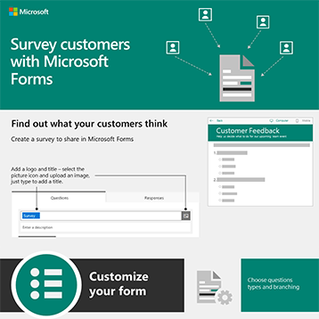

# Infografías de Microsoft 365 para los usuarios

Estas infografías representan procedimientos recomendados para trabajar y colaborar en Microsoft 365. Compártenlos con los usuarios para asegurarse de que aprovechan el almacenamiento seguro y el uso compartido de archivos, la celebración de reuniones de colaboración y mucho más.

Encuentre más [infografías descargables de Office](https://support.microsoft.com/office/great-ways-to-work-with-office-6fe70269-b9a4-4ef0-a96e-7a5858b3bd5a) en el sitio de aprendizaje de [Microsoft 365.](https://support.microsoft.com/training)

## Sugerencias de seguridad

Descargue esta infografía con sugerencias de seguridad para los miembros de su equipo, ya sea que su equipo sea una organización empresarial o sin ánimo de lucro, como una campaña política:

| Item | Descripción |
|:-----|:-----|
|   [Descargar como pdf](../campaigns/downloads/M365CampaignsWhatCanUsersDoToSecure.pdf)  \  [Descargar como PowerPoint](../campaigns/downloads/M365CampaignsWhatCanUsersDoToSecure.pptx)| Comparta estos procedimientos recomendados para proteger la información de su organización. Esta infografía se creó para dar soporte al personal de las campañas políticas porque están dirigidas por sofisticados hackers. Puede usar PowerPoint para personalizar esta infografía para su propia organización. Artículo relacionado: [Cómo afectan las recomendaciones de seguridad de Microsoft 365 a los usuarios](../campaigns/m365-campaigns-users.md)|

## Compartir archivos empresariales

Descargue una infografía para obtener una introducción rápida a las formas de compartir sus archivos empresariales:
  
| Item | Descripción |
|:-----|:-----|
|   [Descargar como pdf](https://go.microsoft.com/fwlink/?linkid=2079435)  \  [Descargar como PowerPoint](https://go.microsoft.com/fwlink/?linkid=2079438) | Use estos procedimientos recomendados cuando comparta y colabore en archivos empresariales para mantener la información protegida y protegida. Artículo relacionado: [Información general sobre cómo compartir archivos empresariales](../business-video/overview-file-sharing.md)|

## Hospedar reuniones en línea

Descargue una infografía para obtener una introducción rápida sobre cómo unirse o hospedar una reunión en línea con Microsoft Teams:

| Item | Descripción |
|:-----|:-----|
|   [Descargar como pdf](https://go.microsoft.com/fwlink/?linkid=2078712)  \  [Descargar como PowerPoint](https://go.microsoft.com/fwlink/?linkid=2079515) | Una introducción rápida a cómo hospedar o unirse a una reunión en línea con Microsoft Teams. Artículo relacionado: [Hospedar reuniones en línea para su empresa](../business-video/overview-online-meetings.md)|

## Trabajar desde cualquier lugar

Descarga una infografía para obtener sugerencias para trabajar desde cualquier lugar:

| Item | Descripción |
|:-----|:-----|
|   [Descargar como pdf](https://go.microsoft.com/fwlink/?linkid=2079451)  \  [Descargar como PowerPoint](https://go.microsoft.com/fwlink/?linkid=2079455) | Consulta sugerencias sobre cómo configurar los dispositivos móviles para permitirte trabajar desde cualquier lugar. Artículo relacionado: [Trabajar desde cualquier lugar](../business-video/work-from-anywhere.md)|

## Encuestar clientes con formularios

Descarga una infografía para averiguar cómo realizar encuestas a clientes (internos o externos) con Microsoft Forms:

| Item | Descripción |
|:-----|:-----|
|   [Descargar como pdf](https://go.microsoft.com/fwlink/?linkid=2079526)  \  [Descargar como PowerPoint](https://go.microsoft.com/fwlink/?linkid=2079446) | Use Microsoft Forms para averiguar lo que piensan sus clientes. Artículo relacionado: [Recopilar información con Microsoft Forms](https://support.microsoft.com/topic/collect-information-with-microsoft-forms-a55d6e0d-04f6-45b8-b05f-b141b8ecb4d5)|
