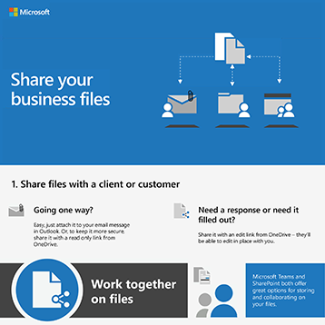

# Infografías de Microsoft 365 para los usuariosMicrosoft 365 infographics for your users

Estas infografías representan procedimientos recomendados para trabajar y colaborar en Microsoft 365.These infographics represent best practices for working and collaborating in Microsoft 365. Compártenlos con los usuarios para asegurarse de que aprovechan el almacenamiento seguro y el uso compartido de archivos, la celebración de reuniones de colaboración y mucho más.Share them with your users to help ensure that they are taking advantage of secure storage and sharing for files, holding collaborative meetings, and more.

Encuentre más [infografías descargables de Office](https://support.microsoft.com/office/great-ways-to-work-with-office-6fe70269-b9a4-4ef0-a96e-7a5858b3bd5a) en el sitio de aprendizaje de [Microsoft 365.](https://support.microsoft.com/training)Find more [downloadable Office infographics](https://support.microsoft.com/office/great-ways-to-work-with-office-6fe70269-b9a4-4ef0-a96e-7a5858b3bd5a) on the [Microsoft 365 training](https://support.microsoft.com/training) site.

## Sugerencias de seguridadSecurity tips

Descargue esta infografía con sugerencias de seguridad para los miembros de su equipo, ya sea que su equipo sea una organización empresarial o sin ánimo de lucro, como una campaña política:Download this infographic with security tips for the members of your team - whether your team is a business or nonprofit organization, such as a political campaign:

| ItemItem | DescripciónDescription |
|:-----|:-----|
|   [Descargar como pdf](../campaigns/downloads/M365CampaignsWhatCanUsersDoToSecure.pdf)  \  [Descargar como PowerPoint](../campaigns/downloads/M365CampaignsWhatCanUsersDoToSecure.pptx)[Download as a PDF](../campaigns/downloads/M365CampaignsWhatCanUsersDoToSecure.pdf) \ [Download as a PowerPoint](../campaigns/downloads/M365CampaignsWhatCanUsersDoToSecure.pptx)| Comparta estos procedimientos recomendados para proteger la información de su organización.Share these best practices for keeping your organization's information secure. Esta infografía se creó para dar soporte al personal de las campañas políticas porque están dirigidas por sofisticados hackers.This infographic was created to support the staff of political campaigns because these are targeted by sophisticated hackers. Puede usar PowerPoint para personalizar esta infografía para su propia organización.You are welcome to use the PowerPoint to customize this infographic for your own organization. Artículo relacionado: [Cómo afectan las recomendaciones de seguridad de Microsoft 365 a los usuarios](../campaigns/m365-campaigns-users.md)Related article: [How the security recommendations for Microsoft 365 affect your users](../campaigns/m365-campaigns-users.md)|

## Compartir archivos empresarialesShare your business files

Descargue una infografía para obtener una introducción rápida a las formas de compartir sus archivos empresariales:Download an infographic to get a quick overview of ways to share your business files:
  
| ItemItem | DescripciónDescription |
|:-----|:-----|
|   [Descargar como pdf](https://go.microsoft.com/fwlink/?linkid=2079435)  \  [Descargar como PowerPoint](https://go.microsoft.com/fwlink/?linkid=2079438)[Download as a PDF](https://go.microsoft.com/fwlink/?linkid=2079435) \ [Download as a PowerPoint](https://go.microsoft.com/fwlink/?linkid=2079438) | Use estos procedimientos recomendados cuando comparta y colabore en archivos empresariales para mantener la información protegida y protegida.Use these best practices when you share and collaborate on business files so you can keep your information secure and protected. Artículo relacionado: [Información general sobre cómo compartir archivos empresariales](../business-video/overview-file-sharing.md)Related article: [Overview of sharing business files](../business-video/overview-file-sharing.md)|

## Hospedar reuniones en líneaHost online meetings

Descargue una infografía para obtener una introducción rápida sobre cómo unirse o hospedar una reunión en línea con Microsoft Teams:Download an infographic to get a quick overview of how to join or host an online meeting with Microsoft Teams:

| ItemItem | DescripciónDescription |
|:-----|:-----|
|   [Descargar como pdf](https://go.microsoft.com/fwlink/?linkid=2078712)  \  [Descargar como PowerPoint](https://go.microsoft.com/fwlink/?linkid=2079515)[Download as a PDF](https://go.microsoft.com/fwlink/?linkid=2078712) \ [Download as a PowerPoint](https://go.microsoft.com/fwlink/?linkid=2079515) | Una introducción rápida a cómo hospedar o unirse a una reunión en línea con Microsoft Teams.A quick introduction to how to host or join an online meeting with Microsoft Teams. Artículo relacionado: [Hospedar reuniones en línea para su empresa](../business-video/overview-online-meetings.md)Related article: [Host online meetings for your business](../business-video/overview-online-meetings.md)|

## Trabajar desde cualquier lugarWork from anywhere

Descarga una infografía para obtener sugerencias para trabajar desde cualquier lugar:Download an infographic to get tips for working from anywhere:

| ItemItem | DescripciónDescription |
|:-----|:-----|
|   [Descargar como pdf](https://go.microsoft.com/fwlink/?linkid=2079451)  \  [Descargar como PowerPoint](https://go.microsoft.com/fwlink/?linkid=2079455)[Download as a PDF](https://go.microsoft.com/fwlink/?linkid=2079451) \ [Download as a PowerPoint](https://go.microsoft.com/fwlink/?linkid=2079455) | Consulta sugerencias sobre cómo configurar los dispositivos móviles para permitirte trabajar desde cualquier lugar.See tips for how to set up your mobile devices to allow you to work from anywhere. Artículo relacionado: [Trabajar desde cualquier lugar](../business-video/work-from-anywhere.md)Related article: [Work from anywhere](../business-video/work-from-anywhere.md)|

## Encuestar clientes con formulariosSurvey customers with Forms

Descarga una infografía para averiguar cómo realizar encuestas a clientes (internos o externos) con Microsoft Forms:Download an infographic to find out how to survey customers (internal or external) with Microsoft Forms:

| ItemItem | DescripciónDescription |
|:-----|:-----|
|   [Descargar como pdf](https://go.microsoft.com/fwlink/?linkid=2079526)  \  [Descargar como PowerPoint](https://go.microsoft.com/fwlink/?linkid=2079446)[Download as a PDF](https://go.microsoft.com/fwlink/?linkid=2079526) \ [Download as a PowerPoint](https://go.microsoft.com/fwlink/?linkid=2079446) | Use Microsoft Forms para averiguar lo que piensan sus clientes.Use Microsoft Forms to find out what your customers think. Artículo relacionado: [Recopilar información con Microsoft Forms](https://support.microsoft.com/topic/collect-information-with-microsoft-forms-a55d6e0d-04f6-45b8-b05f-b141b8ecb4d5)Related article: [Collect information with Microsoft Forms](https://support.microsoft.com/topic/collect-information-with-microsoft-forms-a55d6e0d-04f6-45b8-b05f-b141b8ecb4d5)|
