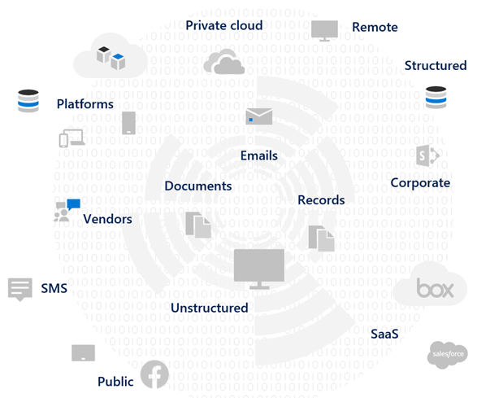
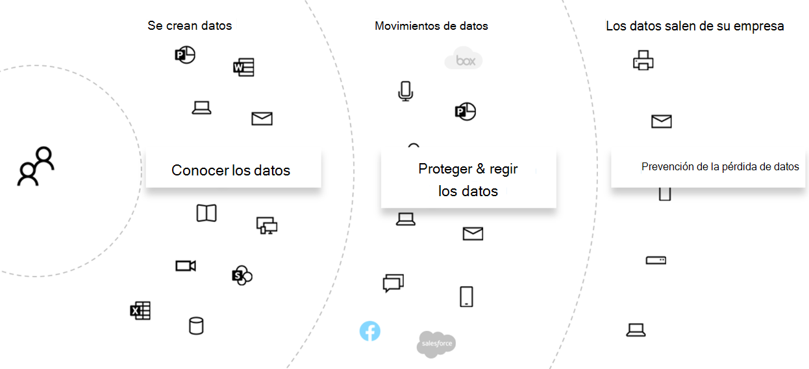
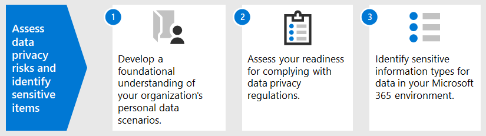
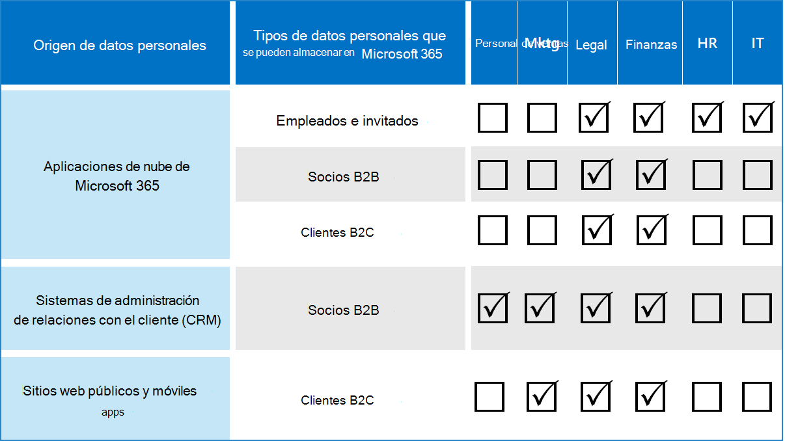

# Evaluar los riesgos de privacidad de datos e identificar los elementos confidenciales con Microsoft 365Assess data privacy risks and identify sensitive items with Microsoft 365

La evaluación de los riesgos y las regulaciones de privacidad de datos a los que está sujeta la organización es un primer paso clave antes de implementar las acciones de mejora relacionadas, incluidas las que se pueden conseguir con los servicios y características de Microsoft 365.Assessing the data privacy regulations and risks that your organization is subject to is a key first step before implementing any related improvement actions, including those achievable with Microsoft 365 features and services. 

## Regulaciones de privacidad de datos potencialmente aplicablesPotentially applicable data privacy regulations

Para obtener una buena referencia sobre el marco normativo más amplio para las regulaciones de privacidad de datos, vea el [portal de confianza de servicios de Microsoft](https://servicetrust.microsoft.com/) y la [serie de artículos sobre el Reglamento General del Reglamento de protección de datos (RGPD)](../compliance/gdpr.md), así como otros materiales de la normativa que puede estar sujeto a su sector o región.For a good reference on the broader regulatory framework for data privacy regulations, see the [Microsoft Services Trust Portal](https://servicetrust.microsoft.com/) and the [series of articles on the General Data Protection Regulation (GDPR) regulation](../compliance/gdpr.md), as well as other materials on the regulations you may be subject to in your industry or region.

### RGPDGDPR

La RGPD, la más conocida y que se menciona en la normativa sobre privacidad de los datos, regula la recopilación, el almacenamiento, el procesamiento y el uso compartido de los datos personales relacionados con una persona física identificada o identificable que es un residente de la Unión Europea (UE).The GDPR, the most well-known and cited of the data privacy regulations, regulates the collection, storage, processing, and sharing of any personal data that relates to an identified or identifiable natural person that is a resident of the European Union (EU). 

Según el artículo 4 de RGPD:According to GDPR Article 4: 

- «datos personales»: toda información relativa a una persona física identificada o identificable («interesado»); una persona física identificable es la que puede identificarse, directa o indirectamente, en particular por referencia a un identificador, como un nombre, un número de identificación, datos de ubicación, un identificador en línea o uno o varios factores específicos de la identidad física, fisiológica, genética, mental, económico, cultural o social de esa persona física.‘personal data’ means any information relating to an identified or identifiable natural person (‘data subject’); an identifiable natural person is one who can be identified, directly or indirectly, in particular by reference to an identifier such as a name, an identification number, location data, an online identifier or to one or more factors specific to the physical, physiological, genetic, mental, economic, cultural or social identity of that natural person.

### ISO 27001ISO 27001

La adherencia a otros estándares como ISO 27001 también ha sido reconocida por varias autoridades de supervisión europeas como un proxy válido de propósito en el personal, el proceso y el espectro tecnológico.Adherence to other standards like ISO 27001 has also been recognized by several European supervisory authorities as a valid proxy of intent across the people, process, and technology spectrum. Los estándares que especifican la superposición y el cumplimiento de los mecanismos de protección basados en ISO-27001 pueden considerarse como un proxy que cumple algunas obligaciones de privacidad en determinadas circunstancias.The standards it specifies overlap and adherence to ISO-27001-driven protection mechanisms may be considered a proxy fulfilling some privacy obligations in certain circumstances.

### Otros reglamentos de privacidad de datosOther data privacy regulations

Otras regulaciones de privacidad de datos destacadas también especifican los requisitos para el tratamiento de datos personales.Other prominent data privacy regulations also specify requirements for the handling of personal data.

En los Estados Unidos, se incluye la ley de protección del consumidor de California ([CCPA](../compliance/ccpa-faq.md)), HIPAA-tecnología (Ley de privacidad de atención sanitaria de Estados Unidos) y la ley Graham Leach BLILEY (GLBA).In the United States, these include the California Consumer Protection Act ([CCPA](../compliance/ccpa-faq.md)), HIPAA-HITECH (United States health care privacy act), and the Graham Leach Bliley Act (GLBA). Las regulaciones adicionales específicas del estado también son locales o en desarrollo.Additional state-specific regulations are also in-place or in development. 

En todo el mundo, algunos ejemplos adicionales incluyen el Act de implementación de RGPD Nacional de Alemania (BDSG), la ley de protección de datos de Brasil (LGPD) y muchas otras.Around the world, additional examples include Germany's National GDPR Implementation Act (BDSG), the Brazil Data Protection Act (LGPD), and many others.

## Asignación del Reglamento a las categorías de controles técnicos de Microsoft 365Regulation mapping to Microsoft 365 technical control categories

Muchas de las reglamentaciones relacionadas con la privacidad de datos tienen requisitos que se superponen, por lo que debe comprender a qué regulaciones están sujetas antes de desarrollar cualquier esquema de control técnico.Many of the data privacy-related regulations have overlapping requirements, so you should understand which regulations they are subject to prior to developing any technical control scheme. 

Para obtener una referencia posterior en los artículos de esta solución general, esta tabla contiene fragmentos de un muestreo de las regulaciones de privacidad de datos.For later reference in the articles of this overall solution, this table provides excerpts from a sampling of data privacy regulations. 

| RegulaciónRegulation | Artículo/secciónArticle/section | TomaExcerpt | Categorías de controles técnicos aplicablesApplicable technical control categories |
|:-------|:-----|:-------|:-------|
| RGPDGDPR | Artículo 5, apartado 1, fArticle 5(1)(f) | Los datos personales se procesarán de manera que garanticen la seguridad adecuada de los datos personales, incluida la protección contra el procesamiento no autorizado o ilegal y contra la pérdida, destrucción o daños accidentales, utilizando las medidas técnicas o organizacionales adecuadas (integridad y confidencialidad).Personal data shall be processed in a manner that ensures appropriate security of the personal data, including protection against unauthorized or unlawful processing and against accidental loss, destruction or damage, using appropriate technical or organizational measures ('integrity and confidentiality'.  |  Todos(All)   IdentidadIdentity   DeviceDevice   Protección contra amenazasThreat Protection   Proteger la informaciónProtect information   Controlar la informaciónGovern information   Detectar y responderDiscover and respond |
|  | Artículo (32) (1) (a)Article (32)(1)(a) | Teniendo en cuenta el estado de la arte, los costes de la aplicación y la naturaleza, ámbito, contexto y propósito del tratamiento, así como el riesgo de la variación de la probabilidad y la gravedad de los derechos y libertades de las personas físicas, el responsable del tratamiento y el procesador deberán implementar las medidas técnicas y organizativas adecuadas para garantizar un nivel de seguridad adecuado al riesgo. , incluidas, entre otras cosas adecuadas: a, el seudonimización y cifrado de datos personales.Taking into account the state of the art, the costs of implementation and the nature, scope, context and purposes of processing as well as the risk of varying likelihood and severity for the rights and freedoms of natural persons, the controller and the processor shall implement appropriate technical and organizational measures to ensure a level of security appropriate to the risk, including inter alia as appropriate: (a) the pseudonymization and encryption of personal data. | Proteger la informaciónProtect information |
|  | Artículo (13) (2) (a)Article (13)(2)(a) | "... en el momento en que se obtengan los datos personales, el responsable del tratamiento deberá proporcionar al interesado los datos siguientes con la siguiente información necesaria para garantizar el tratamiento equitativo y transparente: (a) el período durante el cual se almacenarán los datos personales, o si no es posible, los criterios empleados para determinar dicho período."…the controller shall, at the time when personal data are obtained, provide the data subject with the following further information necessary to ensure fair and transparent processing: (a) the period for which the personal data will be stored, or if that is not possible, the criteria used to determine that period. | Controlar la informaciónGovern information |
|  | Artículo (15) (1) (e)Article (15)(1)(e) | El interesado tendrá derecho a obtener de la confirmación del responsable del tratamiento de si los datos personales que le conciernen o no están en proceso de tratamiento; y, en ese caso, el acceso a los datos personales y la siguiente información: (e) la existencia del derecho de solicitar a la rectificación del responsable del tratamiento o de la eliminación de datos personales o de la restricción del tratamiento de datos personales sobre el interesado o de un objeto a dicho tratamientoThe data subject shall have the right to obtain from the controller confirmation as to whether or not personal data concerning him or her are being processed, and where that is the case, access to the personal data and the following information: (e) the existence of the right to request from the controller rectification or erasure of personal data or restriction of processing of personal data concerning the data subject or to object to such processing | Detectar y responderDiscover and respond |
| LGPDLGPD | Artículo 46Article 46 | Los agentes de procesamiento deben adoptar medidas de seguridad, técnicas y administrativas capaces de proteger datos personales de accesos no autorizados y situaciones accidentales o ilícitas de destrucción, pérdida, alteración, comunicación o cualquier tipo de procesamiento incorrecto o ilegal.Processing agents shall adopt security, technical and administrative measures able to protect personal data from unauthorized accesses and accidental or unlawful situations of destruction, loss, alteration, communication, or any type of improper or unlawful processing. | Proteger la informaciónProtect information   Controlar la informaciónGovern information   Detectar y responderDiscover and respond|
|  | Artículo 48Article 48 | El responsable debe comunicar a la autoridad nacional y al interesado todo incidente de seguridad que pueda dar lugar a riesgos o daños relevantes a los interesados.The controller must communicate to the national authority and to the data subject the occurrence of a security incident that may create risk or relevant damage to the data subjects. | Detectar y responderDiscover and respond |
| HIPPA-ALTA TECNOLOGÍAHIPPA-HITECH | 45 CFR 164.312(e)(1)45 CFR 164.312(e)(1) | Implementar medidas técnicas de seguridad para protegerse contra el acceso no autorizado a información de salud protegida electrónicamente que se transmite a través de una red de comunicaciones electrónicas.Implement technical security measures to guard against unauthorized access to electronic protected health information that is being transmitted over an electronic communications network. | Proteger la informaciónProtect information |
|  | 45 C.F.R.45 C.F.R. 164.312(e)(2)(ii)164.312(e)(2)(ii) | Implementar un mecanismo para cifrar información de salud protegida electrónicamente cuando se considere necesario.Implement a mechanism to encrypt electronic protected health information whenever deemed appropriate. | Proteger la informaciónProtect information |
|  | 45 CFR 164.312(c)(2)45 CFR 164.312(c)(2) | Implementar mecanismos electrónicos para corroborar que la información de salud protegida electrónicamente no se ha modificado o destruido de forma no autorizada.Implement electronic mechanisms to corroborate that electronic protected health information has not been altered or destroyed in an unauthorized manner. | Controlar la informaciónGovern information |
|  | 45 CFR 164.316(b)(1)(i)45 CFR 164.316(b)(1)(i) | Si esta subparte requiere que se documente una acción, actividad o evaluación, mantenga un registro escrito (que puede ser electrónico) de la acción, actividad o evaluación.If an action, activity, or assessment is required by this subpart to be documented, maintain a written (which may be electronic) record of the action, activity, or assessment | Controlar la informaciónGovern information |
|  | 45 CFR 164.316(b)(1)(ii)45 CFR 164.316(b)(1)(ii) | Conservar la documentación exigida por el párrafo (b)(1) de esta sección durante 6 años a partir de la fecha de creación o la fecha en que fue efectiva por última vez, la que sea posterior.Retain the documentation required by paragraph (b)(1) of this section for 6 years from the date of its creation or the date when it last was in effect, whichever is later. | Controlar la informaciónGovern information |
|  | 45 C.F.R.45 C.F.R. 164.308(a)(1)(ii)(D)164.308(a)(1)(ii)(D) | Implementar procedimientos para revisar regularmente registros de la actividad del sistema de información, como registros de auditoría, informes de Access y informes de seguimiento de incidentes de seguridadImplement procedures to regularly review records of information system activity, such as audit logs, access reports, and security incident tracking reports | Detectar y responderDiscover and respond |
|  | 45 C.F.R.45 C.F.R. 164.308(a)(6)(ii)164.308(a)(6)(ii) | Identificar y responder a incidentes de seguridad sospechosos o conocidos; mitigar, en la medida de lo posible, efectos negativos de los incidentes de seguridad que se conozcan en la entidad cubierta o la empresa asociada y documentar incidencias de seguridad y sus resultados.Identify and respond to suspected or known security incidents; mitigate, to the extent practicable, harmful effects of security incidents that are known to the covered entity or business associate; and document security incidents and their outcomes. | Detectar y responderDiscover and respond |
|  | 45 C.F.R.45 C.F.R. 164.312(b)164.312(b) | Implemente mecanismos de hardware, software y procedimientos que registren y examinen la actividad en sistemas de información que contienen o usan información de salud protegida electrónica.Implement hardware, software, and procedural mechanisms that record and examine activity in information systems that contain or use electronic protected health information. | Detectar y responderDiscover and respond |
| CCPACCPA | 1798.105 (c)1798.105(c) | Una empresa que recibe una solicitud verificable de un consumidor para eliminar la información personal del consumidor con arreglo a la subdivisión (a) de esta sección, eliminará la información personal del cliente de sus registros y dirigirá a todos los proveedores de servicios para que eliminen la información personal del cliente de sus registros.A business that receives a verifiable request from a consumer to delete the consumer’s personal information pursuant to subdivision (a) of this section shall delete the consumer’s personal information from its records and direct any service providers to delete the consumer’s personal information from their records | Detectar y responderDiscover and respond |
|  | 1798.105 (d)1798.105(d) | (excepciones a 1798.105 (c)(exceptions to 1798.105(c)   No es necesario que un negocio o un proveedor de servicios cumplan la solicitud de un consumidor para eliminar la información personal del cliente si es necesario para que el proveedor de servicios o negocios mantenga la información personal del consumidor para: (consulte el Reglamento actual para obtener más información).A business or a service provider shall not be required to comply with a consumer’s request to delete the consumer’s personal information if it is necessary for the business or service provider to maintain the consumer’s personal information in order to: (refer to the current regulation for additional information). | Detectar y responderDiscover and respond |
|||||

>[!Important]
>No pretende ser una lista exhaustiva.This is not intended to be an exhaustive list. Consulte [Administrador de cumplimiento](../compliance/compliance-manager-overview.md) o asesor legal o de cumplimiento para obtener más información sobre la aplicabilidad de las secciones citadas a las categorías de controles técnicos que aparecen en la lista.Refer to [Compliance Manager](../compliance/compliance-manager-overview.md) or your legal or compliance advisor for further information on the applicability of the cited sections to the technical control categories listed.
>

## Conocer los datosKnowing your data

Independientemente de los reglamentos a los que esté sujeto, los diferentes tipos de datos de usuario dentro y fuera de la organización que interactúan con los sistemas son factores importantes que pueden afectar a la estrategia general de protección de datos personales, sujeto a las regulaciones de la industria y del gobierno que se aplican a la organización.Regardless of the regulations you are subject to, where different user data types inside and outside your organization interact with your systems are all important factors that may impact your overall personal data protection strategy, subject to the industry and government regulations that apply to your organization. Esto incluye dónde se almacenan los datos personales, qué tipo de información es y qué parte de ellas hay y en qué circunstancias se recopilaron.This includes where personal data is stored, what type it is, and how much of it there is, and under what circumstances it was collected.
 

### Portabilidad de los datosData portability 

Los datos también se desplazan a lo largo del tiempo a medida que se procesan, se refinan y otras versiones se derivan de él.Data also moves around over time as it is processed, refined, and other versions are derived from it. Una instantánea inicial nunca es suficiente.An initial snapshot is never enough. Debe haber un proceso continuo para conocer sus datos.There needs to be an ongoing process for knowing your data. Representa uno de los mayores retos para organizaciones de gran tamaño que manejan grandes cantidades de datos personales.This represents one of the biggest challenges for large organizations that handle significant volumes of personal data. Las organizaciones que no abordan el problema "Conozca sus datos" podrían acabar con un riesgo muy alto y posibles multas de las agencias regulatorias.Organizations that don't address the "know your data" problem could potentially end up with very high risk and possible fines from regulatory agencies.

 
### Dónde se encuentra el dato personalWhere the personal data is

Para tratar las regulaciones de privacidad de datos, no puede confiar en nociones generales de dónde cree que pueden existir datos personales, ya sea ahora o en el futuro.To address data privacy regulations, you can’t rely on general notions of where you think personal data might exist, either now or in the future. Las regulaciones de privacidad de datos requieren que las organizaciones demuestren que saben donde los datos personales están de manera continua.Data privacy regulations require that organizations prove that they know where personal data is on an ongoing basis. Esto hace que sea importante tomar una instantánea inicial de todos los orígenes de datos para poder almacenar información personal, incluido el entorno 365 de Microsoft y establecer mecanismos para la supervisión y detección continuas.This makes it important to take an initial snapshot of all your data sources for possible storage of personal information, including your Microsoft 365 environment, and establish mechanisms for ongoing monitoring and detection.

Si aún no ha evaluado su disponibilidad general y los riesgos asociados con las regulaciones de privacidad de datos, use el siguiente marco de 3 pasos para empezar.If you have not already assessed your overall readiness and risk associated with data privacy regulations, use the following 3-step framework to get started. 

>[!Note]
>Este artículo y su contenido no están destinados a tener en lugar los servicios de asesoría legal.This article and its content are not meant to take the place of legal advisory services. Solo proporciona una guía básica y vínculos a herramientas que pueden ser de ayuda en las primeras etapas de la evaluación.It just provides some basic guidance and links to tools that may be of assistance in the early stages of your assessment.
>
 
## Paso 1: desarrolle un conocimiento básico de los escenarios de datos personales de su organizaciónStep 1: Develop a foundational understanding of your organization's personal data scenarios 

Debe evaluar la exposición al riesgo de privacidad de los datos en función del tipo de datos personales que administre actualmente, dónde se almacenan, qué controles de protección se colocan en él, cómo se administra el ciclo de vida y quién tiene acceso a él.You need to gauge exposure to data privacy risk based on the type of personal data it currently manages, where it is stored, what protective controls are placed on it, how it's lifecycle is managed, and who has access to it. 

Como punto de partida, es importante inventariar los tipos de datos personales que existen en el entorno de Microsoft 365.As a starting point, it's important to inventory what types of personal data exist in your Microsoft 365 environment. Use estas categorías:Use these categories:

- Datos de empleados necesarios para llevar a cabo las funciones empresariales cotidianasEmployee data required to carry out day-to-day business functions
- Datos que la organización tiene sobre sus clientes empresariales, asociados y otras relaciones en el escenario de negocio a negocio (B2B)Data the organization has about its business customers, partners, and other relationships in the business-to-business (B2B) scenario
- Datos que la organización tiene sobre los consumidores que proporcionan información a los servicios en línea que la organización administra en el escenario de negocio a cliente (B2C)Data the organization has about consumers who provide information to online services that the organization manages in the business-to-customer (B2C) scenario

A continuación, se muestra un ejemplo de los distintos tipos de datos para los departamentos típicos de una organización.Here is an example of the different types of data for typical departments of an organization.

Gran parte de los datos personales sujetos a la normativa de privacidad de datos normalmente se recopilan y almacenan fuera de Microsoft 365.Much of the personal data that is subject to data privacy regulation is typically collected and stored outside of Microsoft 365. Es necesario que los datos personales de aplicaciones móviles o Web de consumo se hayan exportado desde dichas aplicaciones a Microsoft 365 para estar sujetos a los controles de privacidad de datos dentro de Microsoft 365.Any personal data from consumer-facing web or mobile applications would need to have been exported from such applications to Microsoft 365 in order to be subject to data privacy scrutiny within Microsoft 365. 

La exposición de privacidad de los datos en Microsoft 365 puede ser más limitada en relación con las aplicaciones web y los sistemas CRM, que esta solución no soluciona.Your data privacy exposure in Microsoft 365 may be more limited relative to your web applications and CRM systems, which this solution does not address.

También es importante pensar en los siguientes desafíos comunes de cumplimiento de privacidad de datos al evaluar el perfil de riesgo:It's also important to think about the following common data privacy compliance challenges when evaluating your risk profile:

 - **Distribución de datos personales.****Personal data distribution.** ¿Cómo está disperso información sobre un tema determinado?How scattered is information about a given subject? ¿Se conoce bien para convencer a los organismos normativos de que se implementan los controles adecuados?Is it known well enough to convince regulatory bodies that proper controls are in place? ¿Se puede investigar y corregir si es necesario?Can it be investigated and remediated if needed?
- **Protección contra la exfiltración.****Protecting against exfiltration.** ¿Cómo se protegen los datos personales de un determinado tipo o origen y cómo responder en caso de que se prodieron?How do you protect personal data of a given type or source from being compromised and how to respond if it was?
- **Protección frente a riesgo.****Protection vs. risk.** ¿Qué mecanismos de protección de la información son adecuados en relación con el riesgo y cómo mantener la continuidad del negocio y la productividad y minimizar el impacto del usuario final si se requiere la intervención del usuario final?What information protection mechanisms are appropriate relative to the risk and how to maintain business continuity and productivity and minimize end-user impact if end-user intervention is required? Por ejemplo, ¿debe usarse la clasificación manual o el cifrado?For example, should manual classification or encryption be used?
- **Retención de datos personales.****Personal data retention.** ¿Durante cuánto tiempo debe conservarse la información que contiene datos personales por razones empresariales válidas y cómo evitar pasadas de mantenimiento de ti permanente, con un equilibrio con las necesidades de retención de la continuidad del negocio?How long does information containing personal data need to be kept around for valid business reasons and how to avoid past keep-it-forever practices, balanced with retention needs for business continuity?
- **Administrar solicitudes de interesados.****Handling data subject requests.** ¿Qué mecanismos se necesitarán para controlar las solicitudes de los interesados (interesado) y las acciones correctivas, como anonymization, censura y eliminación?What mechanisms will be needed to handle data subject requests (DSRs) and any remedial actions, such as anonymization, redaction, and deletion?
- **Supervisión y generación de informes en curso.****Ongoing monitoring and reporting.** ¿Qué tipo de técnicas de supervisión, investigación y creación de informes de día a día están disponibles para los distintos tipos de datos y orígenes?What sort of day-to-day monitoring, investigative, and reporting techniques are available for the different data types and sources?
- **Limitaciones en el procesamiento de datos.****Limitations on data processing.** ¿Hay limitaciones en el uso de datos para la información recopilada o almacenada a través de estos métodos que la organización debe reflejar en los controles de privacidad?Are there limitations on data use for information collected or stored through these methods that the organization must reflect in privacy controls? Por ejemplo, los compromisos que el personal de ventas no va a usar para los datos personales puede requerir que su organización ponga en marcha los mecanismos para evitar la transferencia o el almacenamiento de dicha información en sistemas asociados con la organización de ventas.For example, commitments that personal data will not be used by sales personnel may require your organization to put mechanisms in place to prevent transfer or storage of that information in systems associated with the sales organization.

### Datos de empleados necesarios para llevar a cabo las funciones empresariales cotidianasEmployee data required to carry out day-to-day business functions

Las organizaciones por naturaleza necesitan recopilar datos de los empleados para fines de identidad y de recursos humanos electrónicos, sujetos a lo que aceptan en sus contratos de empleados.Organizations by nature need to collect data on employees for electronic identity and HR purposes, subject to what they agree to in their employee agreements. Siempre que una persona trabaje para una compañía, esto no suele ser un problema.As long as a person works for a company, this is typically not an issue. Es posible que la organización desee poner en marcha los mecanismos para evitar que los actores malintencionados puedan exfiltrar o perder datos personales de los empleados.The organization may want to put mechanisms in place to prevent malicious actors from exfiltration or leaking employee personal data. 

Si una persona deja una compañía, las organizaciones suelen tener programaciones, procedimientos y programaciones de retención y eliminación para eliminar cuentas de usuario, retirar buzones y unidades personales y cambiar el estado de los empleados en aspectos como los sistemas de recursos humanos.If a person leaves a company, organizations typically have processes, procedures, and retention and deletion schedules for removing user accounts, decommissioning mailboxes and personal drives, and changing the employee status in things like human resources systems. En situaciones en las que interviene un litigio, un empleado u otra parte en una investigación legal puede tener motivos válidos para obtener información sobre los datos personales almacenados en los sistemas de la organización.For situations where litigation is involved, an employee or another party to a legal investigation may have valid reasons for obtaining information about personal data stored in the organization's systems. En algunas ocasiones, es posible que esa parte solicite que se eliminen los datos o anonimizan.On some occasions, that party may request that such data be removed or anonymized. 

Para cubrir estas necesidades, las organizaciones deben tener procesos y procedimientos en el caso de que se desplacen las necesidades preventivas, de detectives y de medios para facilitar estas solicitudes, teniendo en cuenta que cierta información sobre un empleado puede considerarse razonablemente crucial para la continuidad del negocio.To address such needs, organizations should have processes and procedures in place that address preventative, detective, and remedial needs to facilitate such requests, noting that some information about an employee may be reasonably considered crucial for business continuity. Por ejemplo, la información que un individuo ha creado un archivo o ha realizado una función.For example, information that an individual authored a file or performed a function. 

>[!Note]
>Para conocer las técnicas de investigación y corrección de datos personales en Microsoft 365, consulte el [artículo monitor y responder](information-protection-deploy-monitor-respond.md).For investigative and remediation techniques for personal data in Microsoft 365, see the [monitor and respond article](information-protection-deploy-monitor-respond.md). Es posible que también desee emplear esquemas de protección y clasificación automatizados para asegurarse de que los datos personales se controlan dentro de la organización, así como evitar que abandonen la organización en situaciones de actor malintencionado.You may also want to employ automated classification and protection schemes to make sure that personal data is controlled while inside the organization, as well as prevent it from leaving the organization in malicious actor situations. Consulte el [artículo proteger información](information-protection-deploy-protect-information.md) para obtener más información.See the [protect information article](information-protection-deploy-protect-information.md) for more information.
>
 
### Datos que la organización tiene sobre sus clientes empresariales en el escenario B2BData the organization has about its business customers in the B2B scenario

La recopilación de información de B2B también es un reto porque es posible que su organización tenga que mantener registros de nombres de clientes y transacciones en sus diversos sistemas con fines de continuidad empresarial, pero proteger dicha información de la exfiltración accidental o malintencionada.Collection of B2B information is also a challenge because your organization might need to keep records of customer names and transactions in its various systems for business continuity purposes yet protect that information from inadvertent or malicious exfiltration. Al igual que los datos de los empleados, las organizaciones deben tener implementadas directivas, procedimientos y controles técnicos para proteger dichos datos, así como caducar de acuerdo con las programaciones de retención y eliminación definidas.Like employee data, organizations must have policies, procedures, and technical controls in place to protect such data, as well as age it out according to defined retention and deletion schedules. 

Por lo general, los contratos con clientes externos, asociados y las otras entidades con las que la organización tiene un idioma que se encarga de la administración de estos datos, incluida la protección, la retención y la eliminación, tanto durante y después de que la entidad tenga una relación con la organización.Typically, contracts with external customers, partners, and the other entities with which the organization does business will have language addressing the handling of such data, including protection, retention, and deletion both during and after the entity has a relationship with the organization. 

### Datos que la organización tiene sobre los consumidores que proporcionan información a los servicios en línea que administra la organización en el escenario B2CData the organization has about consumers who provide information to online services that the organization manages in the B2C scenario

Esta categoría es la que la mayoría de los usuarios opinan sobre la privacidad de los datos, debido a muchas instancias públicas de pérdida de datos de clientes.This category is the one most people think about for data privacy, due to many public instances of customer data leakage. Esto puede ser intencionado, como un tercero con contrato para el proveedor, o involuntariamente, como la exfiltración por un actor malintencionado.This can be intentional, such as a third party under contract to the provider, or unintentional, such as exfiltration by a malicious actor. La protección de datos de clientes es uno de los principales motivos por los que la UE y otros usuarios han promulgado estas regulaciones.Consumer data protection is one of the primary reasons the EU and others enacted these regulations. Los reglamentos de privacidad de datos como RGPD y CCPA requieren la planeación para:Data privacy regulations like GDPR and CCPA require you to do planning for:

- [Planes de acción](../compliance/gdpr-action-plan.md) y [listas de comprobación de preparación de responsabilidad](../compliance/gdpr-arc-office365.md)[Action plans](../compliance/gdpr-action-plan.md) and [accountability readiness checklists](../compliance/gdpr-arc-office365.md)
- [Evaluaciones del impacto en la protección de datosData Protection Impact Assessments](../compliance/gdpr-data-protection-impact-assessments.md)
- [Notificaciones de incumplimientoBreach notifications](../compliance/gdpr-breach-office365.md)
- [Solicitudes de interesadosData subject requests](../compliance/gdpr-dsr-office365.md)

Si su organización no realiza muchas recopilaciones de datos de clientes directos, esta categoría puede ser menos importante.If your organization does not do a lot of direct-from-consumer data collection, this category may be less of an issue. Sin embargo, es posible que tenga que seguir los procesos descritos en estos artículos para lograr el cumplimiento normativo.However, you may still need to go through the processes outlined in these articles to achieve compliance.

### Resumen del paso 1Step 1 summary

Comprender la exposición al riesgo y la privacidad de los datos es un primer paso importante que se basa en la comprensión básica de los escenarios de datos personales de su organización.Understanding your exposure to risk and data privacy regulation is an important first step that is based on a foundational understanding of your organization's personal data scenarios.

Si no tiene datos personales de los consumidores en su entorno de Microsoft 365 o se limita a determinadas partes del entorno y la necesidad de un control técnico se basa en la exposición de los datos de consumo, es posible que el control técnico solo tenga que usarse en partes de riesgo alto del entorno, no en todas las partes.If you don't have personal data from consumers in your Microsoft 365 environment or it is confined to certain parts of the environment and the need for a technical control is predicated on there being consumer-type data exposure, then that technical control may only need to be employed in high risk parts of the environment, not everywhere.

Aunque una recomendación de la organización externa o de un conjunto de control estándar, como la puntuación de cumplimiento en Microsoft 365, puede ayudar a informar a su estrategia de control, la elección de la implementación debe estar controlada por el reconocimiento del inventario de datos para cuantificar la exposición de riesgos real.While an external organization or standard control set recommendation, such as from Compliance Score in Microsoft 365, may help inform your control strategy, your choice of implementation should be driven by data inventory awareness to quantify your real risk exposure.

La mayoría de las organizaciones tendrán alguna exposición a uno de los escenarios anteriores.Most organizations will have some exposure to one of the above scenarios. Es importante realizar un enfoque holístico de la evaluación.Taking a holistic approach to assessment is important.

## Paso 2: evaluar la preparación para cumplir con las regulaciones de privacidad de datosStep 2: Assess your readiness for complying with data privacy regulations

Aunque son específicas de RGPD, las preguntas que se plantean en la [herramienta gratuita Microsoft RGPD Assessment](https://www.microsoft.com/cyberassessment/en/gdpr/uso365) proporcionan un buen punto de partida para comprender la disponibilidad general de la privacidad de los datos.Although specific to GDPR, the questions posed in the free [Microsoft GDPR assessment tool](https://www.microsoft.com/cyberassessment/en/gdpr/uso365) provide a good start towards understanding your overall data privacy readiness. 

Las organizaciones que están sujetas a otras regulaciones de privacidad de datos, como CCPA en Estados Unidos o LGPD de Brasil, también pueden beneficiarse del inventario de preparación de disponibilidad con el RGPD de esta herramienta.Organizations subject to other data privacy regulations, such as CCPA in the United States or Brazil’s LGPD, may also benefit from this tool’s inventory of readiness due overlapping provisions with the GDPR.

La evaluación de RGPD consta de las siguientes secciones:GDPR assessment consists of these sections:

| SectionSection | DescripciónDescription |
|:-------|:-----|
| GobiernoGovernance | <ol><li>¿Su Directiva de privacidad indica explícitamente qué información de datos se está procesando?Does your privacy policy explicitly state what data information is being processed? </li><li>¿Se ejecutan de forma regular evaluaciones de impacto de privacidad (PIA)?Do you regularly run Privacy Impact Assessments (PIAs)? </li><li> ¿Utiliza una herramienta para administrar la información personal (PI)?Do you use a tool to manage personal information (PI)? </li><li> ¿Tiene autoridad legal para realizar negocios con datos de PI en un individuo determinado?Do you have legal authority to conduct business using PI data on any given individual? ¿Realiza un seguimiento de los datos de consentimiento?Do you track consent for data? </li><li> ¿Realiza un seguimiento, la implementación y la administración de controles de auditoría?Do you track, implement, and manage audit controls? ¿Supervisa si hay pérdidas de datos?Do you monitor for data leaks? </li></ol>|
| Eliminación y notificaciónDeletion and notification | <ol><li>¿Proporciona instrucciones explícitas sobre cómo se puede obtener acceso a los datos de los usuarios?Do you give explicit instructions on how users' data can be accessed? </li><li> ¿Tiene procesos documentados en su ubicación para controlar el consentimiento de cancelación?Do you have documented processes in place for handling opt out consent? </li><li> ¿Tiene un proceso de eliminación automatizado de datos?Do you have an Automated Deletion process for data? </li><li>   ¿Tiene un proceso para validar la identidad al participar con un cliente?Do you have a process to validate identity when engaging with a customer? </li></ol>|
| Mitigación de riesgos y seguridad de la informaciónRisk mitigation and information security | <ol><li>¿Usa herramientas para analizar datos no estructurados?Do you use tools to scan unstructured data? </li><li>¿Están actualizados todos los servidores y aprovecha los firewalls para protegerlos?Are all servers up to date, and do you leverage firewalls to protect them? </li><li>¿Ejecuta copias de seguridad regulares de los servidores?Do you run regular backups of your servers? </li><li>¿Supervisa activamente la pérdida de datos?Do you actively monitor for data leaks? </li><li>¿Cifra sus datos en reposo y en transmisiones?Do you encrypt your data at rest and in transmission? </li></ol>|
| Administración de directivasPolicy management | <ol><li>¿Cómo se administran las reglas corporativas de enlace (BCRs)?How do you manage your Binding Corporate Rules (BCRs)? </li><li>¿Realiza un seguimiento de los datos de consentimiento?Do you track consent for data? </li><li> En una escala de 1 a 5, 5 cubiertos completamente, ¿los contratos cubren las clasificaciones de datos y los requisitos de tratamiento?On a scale of 1 to 5, 5 being completely covered, do your contracts cover data classifications and handling requirements? </li><li>¿Tiene y prueba con regularidad un plan de respuesta a incidentes?Do you have and regularly test an incident response plan? </li><li>¿Qué directiva usa para administrar el acceso?What policy do you use to manage access? </li></ol>|
|||
 
## Paso 3: identificar los tipos de información confidencial que se producen en el entorno de Microsoft 365.Step 3: Identify sensitive information types that occur in your Microsoft 365 environment. 

Este paso implica la identificación de los tipos de información confidencial que están sujetos a controles reguladores específicos, así como la ocurrencia de ellos en el entorno de Microsoft 365.This step involves identification of particular sensitive information types that are subject to specific regulatory controls, as well as the occurrence of them in your Microsoft 365 environment. 

La búsqueda de contenido en el entorno que contiene personal puede ser una tarea formidable, que antes implicaba una combinación de búsqueda de cumplimiento, eDiscovery, eDiscovery avanzado, DLP y auditoría.Finding content in your environment containing personal can be a formidable task, formerly involving a combination of using Compliance Search, eDiscovery, Advanced eDiscovery, DLP, and auditing. 

Con la nueva solución de **clasificación de datos** en el centro de administración de cumplimiento de Microsoft, esto resulta mucho más sencillo con la capacidad del [Explorador de contenido](../compliance/data-classification-content-explorer.md) , que funciona con los tipos de información confidencial integrados o personalizados, incluidos los relacionados con los datos personales.With the new **Data Classification** solution in the Microsoft Compliance admin center, this has become much easier with the [Content Explorer](../compliance/data-classification-content-explorer.md) capability, which works with either built-in or custom sensitive information types, including those related to personal data.
 
### Tipos de información confidencialSensitive information types

El centro de administración de cumplimiento de Microsoft viene preconfigurado con más de 100 tipos de información confidencial, la mayoría de ellos relacionados con la identificación y ubicación de datos personales.The Microsoft Compliance admin center comes pre-loaded with over 100 sensitive information types, most of them related to identifying and locating personal data. Estos tipos de información confidencial integrados pueden ayudar a identificar y proteger los números de tarjetas de crédito, los números de cuentas bancarias, los números de pasaporte, etc., en función de los patrones definidos por una expresión regular (regex) o una función.These built-in sensitive information types can help identify and protect credit card numbers, bank account numbers, passport numbers, and more, based on patterns that are defined by a regular expression (regex) or a function. Para obtener más información, consulte [Qué buscan los tipos de información confidencial](../compliance/what-the-sensitive-information-types-look-for.md).To learn more, see [What the sensitive information types look for](../compliance/what-the-sensitive-information-types-look-for.md).

Si necesita identificar y proteger un tipo de elementos confidenciales específicos de la organización o regional, como un formato personalizado para los identificadores de los empleados u otra información personal que no esté ya cubierta por un tipo de información confidencial integrada, puede crear un tipo personalizado de información confidencial con estos métodos:If you need to identify and protect an organization-specific or regional type of sensitive items, such as a custom format for employee IDs, or other personal information not already covered by a built-in sensitive information type, you can create a custom sensitive information type with these methods: 

- PowerShellPowerShell
- Reglas personalizadas con coincidencia de datos exacta (EDM)Custom rules with exact data match (EDM)
- A través de la interfaz de usuario del administrador del centro de cumplimiento, resaltada en el [artículo usar la puntuación de cumplimiento y el administrador de cumplimiento](information-protection-deploy-compliance.md)Through the Compliance Center admin UI, as highlighted in the [Use Compliance Score and Compliance Manager article](information-protection-deploy-compliance.md)

También puede personalizar un tipo de información confidencial integrado existente.You can also customize an existing, built-in sensitive information type.

Consulte estos artículos para obtener más información:See these articles for more information:

- [Personalizar un tipo de información confidencial integradoCustomize a built-in sensitive information type](../compliance/customize-a-built-in-sensitive-information-type.md)
- [Tipos de información confidencial personalizadosCustom sensitive information types](../compliance/custom-sensitive-info-types.md)
- [Crear un tipo de información confidencial personalizado en el Centro de seguridad y cumplimientoCreate a custom sensitive information type in the Security & Compliance Center](../compliance/create-a-custom-sensitive-information-type.md)
- [Crear un tipo personalizado de información confidencial en PowerShell del Centro de seguridad y cumplimientolCreate a custom sensitive information type in Security & Compliance Center PowerShell](../compliance/create-a-custom-sensitive-information-type-in-scc-powershell.md)
- [Crear tipos personalizados de información confidencial con clasificación exacta de coincidencia de datosCreate custom sensitive information types with Exact Data Match based classification](../compliance/create-custom-sensitive-information-types-with-exact-data-match-based-classification.md)

### Explorador de contenidoContent Explorer

Una herramienta importante que para determinar la ocurrencia de elementos confidenciales en su entorno es el nuevo [Explorador de contenido](../compliance/data-classification-content-explorer.md) en el centro de administración de cumplimiento de Microsoft 365.An important tool that for determining the occurrence of sensitive items in your environment is the new [Content Explorer](../compliance/data-classification-content-explorer.md) in the Microsoft 365 Compliance admin center. Se trata de una herramienta automatizada para el análisis inicial y continuo de toda la suscripción a Microsoft 365 para la ocurrencia de los tipos de información confidencial y la visualización de los resultados.It's an automated tool for initial and ongoing scanning of your entire Microsoft 365 subscription for the occurrence of sensitive information types and display of the results.
 
La nueva herramienta explorador de contenido le permite identificar rápidamente las ubicaciones de los elementos confidenciales de su entorno, mediante tipos de información confidencial integrados o personalizados.The new Content Explorer tool allows you to quickly identify the locations of sensitive items in your environment, using either built-in sensitive information types or custom ones. Esto puede implicar el establecimiento de un proceso y la responsabilidad asignada a la investigación regular de la presencia y ubicación de los elementos confidenciales.This may involve establishing a process and assigned responsibility to regularly investigate the presence and location of sensitive items.

Además de los otros pasos resaltados en este artículo, se proporciona un punto de partida para identificar la exposición de riesgos general, la preparación y la ubicación de los elementos confidenciales para protegerlos mediante la configuración y supervisión planificada de Microsoft 365.Along with the other steps highlighted in this article, this provides a starting point for identifying your overall risk exposure, readiness, and location of sensitive items to protect through planned Microsoft 365 configuration and monitoring. 

### Otros métodos para identificar datos personales en su entornoOther methods to identify personal data in your environment

Además del explorador de contenido, las organizaciones tienen acceso a la capacidad de búsqueda de contenido para generar búsquedas personalizadas para encontrar datos personales en su entorno, mediante criterios de búsqueda avanzados y filtros personalizados.In addition to the Content Explorer, organizations have access to the Content Search capability to produce custom searches to find personal data in their environment, using advanced search criteria and custom filters.

En [este artículo](../compliance/search-for-and-find-personal-data.md)se proporcionan instrucciones detalladas sobre el uso de la búsqueda de contenido para la detección de datos personales.Detailed guidance on the use of Content Search for discovery of personal data is provided in [this article](../compliance/search-for-and-find-personal-data.md). La búsqueda de contenido y otras técnicas de detección también se exploran en [interesado para RGPD y CCPA](../compliance/gdpr-dsr-office365.md#introduction-to-dsrs).Content Search and other discovery techniques are also explored in [DSRs for the GDPR and CCPA](../compliance/gdpr-dsr-office365.md#introduction-to-dsrs).

En el [artículo monitor and Respond](information-protection-deploy-monitor-respond.md)se proporcionan más información sobre técnicas de investigación y corrección de datos personales en Microsoft 365.Additional insights on investigative and remediation techniques for personal data in Microsoft 365 are provided in the [monitor and respond article](information-protection-deploy-monitor-respond.md).
