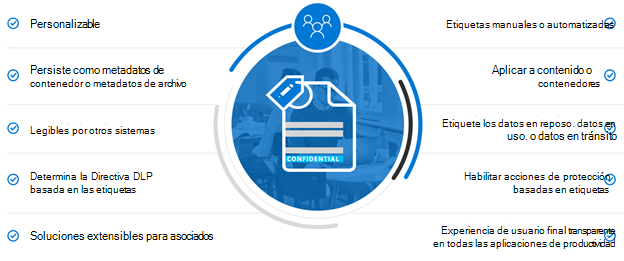
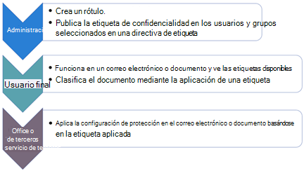

# Proteger la información sujeta a la normativa de privacidad de datosProtect information subject to data privacy regulation

Se pueden usar varios controles de protección de la información en su suscripción para ayudar a satisfacer las necesidades y regulaciones de cumplimiento normativo de privacidad de datos.A number of information protection controls can be employed in your subscription to help address data privacy compliance needs and regulations. Entre estos se incluyen el Reglamento General de protección de datos (RGPD), HIPAA-up (la ley de privacidad de atención médica de Estados Unidos), la ley de protección del consumidor de California (CCPA) y la ley de protección de datos de Brasil (LGPD).These include General Data Protection Regulation (GDPR), HIPAA-HITECH (the United States health care privacy act), California Consumer Protection Act (CCPA), and the Brazil Data Protection Act (LGPD).

Estos controles se encuentran en las siguientes áreas de solución:These controls are within following solution areas:

- Etiquetas de confidencialidadSensitivity labels
- Prevención de pérdida de datos (DLP)Data loss prevention (DLP)
- Cifrado de mensajes de Office (OME)Office message encryption (OME)
- Controles de acceso de Microsoft Teams y sitiosTeams and sites access controls

>[!Note]
>Esta solución describe las características de seguridad y cumplimiento para proteger la información sujeta a las regulaciones de privacidad de datos.This solution describes security and compliance features to protect information subject to data privacy regulations. Para obtener una lista completa de las características de seguridad de Microsoft 365, consulte la [documentación de seguridad 365 de Microsoft](https://docs.microsoft.com/microsoft-365/security/).For a complete list of security features in Microsoft 365, see [Microsoft 365 security documentation](https://docs.microsoft.com/microsoft-365/security/). Para obtener una lista completa de las características de cumplimiento de Microsoft 365, consulte la [documentación de cumplimiento de 365 de Microsoft](https://docs.microsoft.com/microsoft-365/compliance/).For a complete list of compliance features in Microsoft 365, see [Microsoft 365 compliance documentation](https://docs.microsoft.com/microsoft-365/compliance/).
>

## Regulaciones de privacidad de datos que afectan a los controles de protección de la informaciónData privacy regulations that impact information protection controls

A continuación se muestra una lista de ejemplo de normas de privacidad de datos que pueden estar relacionadas con los controles de protección de la información:Here is a sample list of data privacy regulations that may relate to information protection controls:

- RGPD apartado 1 del artículo 5 (f))GDPR Article 5(1)(f))
- Artículo de RGPD (32) (1) (a)GDPR Article (32)(1)(a)
- Artículo 46 de LGPDLGPD Article 46
- HIPAA-tecnología (45 CFR 164.312 (e) (1))HIPAA-HITECH (45 CFR 164.312(e)(1))
- HIPAA-TECNOLOGÍA (45 C.F.R.HIPAA-HITECH (45 C.F.R. 164.312 (e) (2) (II))164.312(e)(2)(ii))

Para obtener más información sobre cada uno de los elementos anteriores, consulte el [artículo evaluar los riesgos de privacidad de datos e identificar elementos confidenciales](information-protection-deploy-assess.md) .See the [assess data privacy risks and identify sensitive items article](information-protection-deploy-assess.md) for more information on each of the above.

Las normas de privacidad de datos para la protección de información recomiendan:Data privacy regulations for information protection recommend:

- Protección contra la pérdida o el acceso no autorizado, el uso o la transmisión.Protection against loss or unauthorized access, usage and/or transmission.
- Aplicación basada en riesgos de mecanismos de protección.Risk-based application of protective mechanisms.
- Uso de cifrado cuando proceda.Use of encryption where appropriate.

Es posible que su organización también desee proteger el contenido de Microsoft 365 para otros fines, como otras necesidades de cumplimiento o motivos empresariales.Your organization may also want to protect Microsoft 365 content for other purposes, such as other compliance needs or for business reasons. El establecimiento de un esquema de protección de la información para la privacidad de los datos debe realizarse como parte de la planeación, implementación y administración de la protección de la información general.Establishing your information protection scheme for data privacy should be done as part of overall information protection planning, implementation, and management.

Para ayudarle a empezar con un esquema de protección de la información en Microsoft 365, en la siguiente sección se incluye una breve lista de las capacidades relacionadas y las acciones de mejora para Microsoft 365.To help you get started with an information protection scheme in Microsoft 365, the following section includes a short list of related capabilities and improvement actions for Microsoft 365. La lista incluye las capacidades y acciones de mejora que se aplican a las regulaciones de privacidad de datos.The list includes capabilities and improvement actions that are applicable to data privacy regulations. Sin embargo, la lista no incluye tecnologías más antiguas si hay una funcionalidad más nueva que reemplaza en gran medida al anterior.However, the list doesn't include older technologies if there's a newer capability that largely supersedes the older one. Por ejemplo, Information Rights Management (IRM) para SharePoint y OneDrive no se incluyen en la lista, pero se incluyen las etiquetas de confidencialidad.For example, Information Rights Management (IRM) for SharePoint and OneDrive is not included in the list but sensitivity labels are included.

## Administración de la protección de la información en Microsoft 365Managing information protection in Microsoft 365

Las [soluciones de protección](../compliance/protect-information.md) de la información de Microsoft incluyen varias capacidades integradas en Microsoft 365, Microsoft Azure y Microsoft Windows.Microsoft [information protection solutions](../compliance/protect-information.md) include a number of integrated capabilities across Microsoft 365, Microsoft Azure, and Microsoft Windows. En Microsoft 365, las soluciones de protección de la información incluyen:In Microsoft 365, information protection solutions include:

- [Cifrado de servicio con clave de clienteService encryption with Customer Key](../compliance/customer-key-overview.md)
- [Tipos de información confidencial](../compliance/what-the-sensitive-information-types-look-for.md) (descritos en el [artículo evaluar los riesgos de privacidad de datos e identificar elementos confidenciales](information-protection-deploy-assess.md))[Sensitive information types](../compliance/what-the-sensitive-information-types-look-for.md) (described in the [assess data privacy risks and identify sensitive items article](information-protection-deploy-assess.md))
- [Etiquetas de confidencialidadSensitivity labels](../compliance/sensitivity-labels.md) 
  - Nivel de servicio/contenedorService/container-level
  - Cliente/nivel de contenidoClient-side/content-level
  - Automatizada para datos en reposo en SharePoint y OneDriveAutomated for data-at-rest in SharePoint and OneDrive
- Prevención de pérdida de datos (DLP)Data Loss Prevention (DLP)
- [Cifrado de mensajes de Office 365 nuevas funciones (OME)](../compliance/ome.md) y OME [cifrado de mensajes avanzado](../compliance/ome-advanced-message-encryption.md)[Office 365 Message Encryption new capabilities (OME)](../compliance/ome.md) and OME [Advanced Message Encryption](../compliance/ome-advanced-message-encryption.md)

Además, la protección a nivel de sitio y biblioteca son mecanismos importantes para incluir en cualquier esquema de protección.In addition, site and library level protection are important mechanisms to include in any protection scheme.

Para obtener información sobre otras capacidades de protección de la información fuera de Microsoft 365, consulte:For information on other information protection capabilities outside of Microsoft 365, see:

- [Seguridad de aplicaciones en la nube de Microsoft (MCAS)Microsoft Cloud Application Security (MCAS)](https://docs.microsoft.com/cloud-app-security/)
- [Azure Information ProtectionAzure Information Protection](https://docs.microsoft.com/azure/information-protection/what-is-information-protection)
- [Microsoft Endpoint ManagerMicrosoft Endpoint Manager](https://www.microsoft.com/microsoft-365/microsoft-endpoint-manager)
- [Windows Information ProtectionWindows Information Protection](https://docs.microsoft.com/windows/security/information-protection/windows-information-protection/protect-enterprise-data-using-wip)

## Etiquetas de confidencialidadSensitivity labels

Las etiquetas de confidencialidad de Microsoft Information Protection Framework le permiten clasificar y proteger los datos de su organización sin obstaculizar la productividad de los usuarios y su capacidad de colaborar.Sensitivity labels from the Microsoft Information Protection framework let you classify and protect your organization's data without hindering the productivity of users and their ability to collaborate.

### Requisitos previos para las etiquetas de confidencialidadPrerequisites for sensitivity labels

Complete estas actividades antes de implementar cualquiera de las capacidades basadas en etiquetas de sensibilidad resaltadas a continuación:Complete these activities prior to implementing any of the sensitivity label-based capabilities highlighted below:

1. Comprenda lo siguiente:Understand the following:
   - **Requisitos empresariales.****Business requirements.** Establezca los motivos empresariales para aplicar las etiquetas de confidencialidad en su empresa.Establish the business reasons for applying sensitivity labels in your enterprise. Por ejemplo, sus requisitos de privacidad de datos para la protección de la información.For example, your data privacy requirements for information protection.
   - **Capacidades de la etiqueta de confidencialidad.****Sensitivity label capabilities.** El etiquetado de sensibilidad puede ser complejo, así que asegúrese de leer la documentación de las [etiquetas de confidencialidad](../compliance/sensitivity-labels.md) antes de empezar.Sensitivity labelling can get complex, so make sure to read the [sensitivity labels documentation](../compliance/sensitivity-labels.md) before getting started.
   - **Puntos clave que se deben recordar** Las etiquetas de confidencialidad se administran en el centro de administración de cumplimiento de Microsoft, pero las opciones de aplicación y de destino varían significativamente.**Key things to remember** Sensitivity labels are managed in the Microsoft Compliance admin center but the targeting and application options vary significantly.
      - Hay etiquetas de confidencialidad para sitios, grupos y equipos en el nivel de contenedor (la configuración no se aplica al contenido dentro del contenedor).There are sensitivity labels for sites, groups, and Teams at the container level (the settings do not apply to content inside the container). Se publican para los usuarios y grupos que los aplican cuando se aprovisiona un sitio, grupo o equipo.These are published to users and groups who apply them when a site, group or Team is provisioned.
      - Hay etiquetas de sensibilidad para el contenido activo.There are sensitivity labels for active content. También se publican en usuarios o grupos, que los aplican manualmente, o se aplican automáticamente cuando:These are also published to user or groups, who either manually apply them, or they get applied automatically when:
        - El archivo se abre/modifica o guarda, ya sea en el escritorio del usuario o en un sitio de SharePoint.The file is opened/edited/saved, either to the user’s desktop or a SharePoint site.
        - Se ha enviado un correo electrónico y está redactado.An email is drafted and sent.
      - Hay etiquetas de confidencialidad para la aplicación automática en archivos en reposo en SharePoint y OneDrive, además de los mensajes de correo electrónico en tránsito a través de Exchange.There are sensitivity labels for automatic application to files at rest in SharePoint and OneDrive in addition to emails in transit through Exchange. Estos se dirigen a todos los sitios o a unos específicos y se aplican automáticamente a los archivos en reposo en estos entornos.These are targeted to either all sites or specific ones and automatically apply to the files at rest in these environments.

2. Racionalizar el etiquetado de sensibilidad actual con métodos pasados o alternativosRationalize current sensitivity labelling with past or alternative methods

   - Azure Information ProtectionAzure Information Protection

      Es posible que el esquema de etiquetado de sensibilidad actual deba reconciliarse con cualquier implementación existente de etiquetas de [Azure Information Protection](../compliance/sensitivity-labels.md#sensitivity-labels-and-azure-information-protection) .The current sensitivity labelling scheme may need to be reconciled with any existing [Azure Information Protection](../compliance/sensitivity-labels.md#sensitivity-labels-and-azure-information-protection) labeling implementation.
   - OMEOME

      Si está pensando en usar el etiquetado de sensibilidad moderno para la protección de correo electrónico y los métodos de cifrado de correo electrónico existentes como OME están en su ubicación, pueden coexistir, pero debe comprender los escenarios en los que se debe aplicar cualquiera de ellos.If you are planning to use modern sensitivity labelling for email protection and existing email encryption methods like OME are in place, they can co-exist, but you should understand the scenarios in which either should be applied. Consulte [Office 365 Message Encryption New Capabilities (OME)](#office-365-message-encryption-ome-new-capabilities), que incluye una tabla que compara la protección moderna de tipo de etiqueta de confidencialidad con la protección basada en OME.See [Office 365 Message Encryption new capabilities (OME)](#office-365-message-encryption-ome-new-capabilities), which includes a table comparing modern sensitivity label-type protection with OME-based protection.

3. Planee la integración en un esquema más amplio de protección de la información.Plan for integration into a broader information protection scheme. Sobre la coexistencia con OME, se pueden usar las etiquetas de confidencialidad actuales como funciones de Microsoft 365 Data Loss Prevention (DLP) y Microsoft Cloud App Security.On top of coexistence with OME, current sensitivity labels can be used along-side capabilities like Microsoft 365 data loss prevention (DLP) and Microsoft Cloud App Security. Consulte las [etiquetas de confidencialidad y Microsoft Cloud App Security](../compliance/sensitivity-labels.md#sensitivity-labels-and-microsoft-cloud-app-security) para lograr los objetivos de protección de la información relacionada con la privacidad de los datos.See [Sensitivity Labels and Microsoft Cloud App Security](../compliance/sensitivity-labels.md#sensitivity-labels-and-microsoft-cloud-app-security) to achieve your data privacy-related information protection goals.

4. Desarrollar un esquema de clasificación y control de la etiqueta de confidencialidad.Develop a sensitivity label classification and control scheme. Consulte [clasificación de datos y taxonomía de etiqueta de confidencialidad](https://aka.ms/dataclassificationwhitepaper).See [Data Classification and Sensitivity Label Taxonomy](https://aka.ms/dataclassificationwhitepaper).

### Instrucciones generalesGeneral guidance

1. **Definición de esquema.****Schema definition.** Antes de usar las capacidades técnicas para aplicar etiquetas y protección, trabaje en toda la organización para definir un esquema de clasificación.Before using technical capabilities to apply labels and protection, work across your organization to define a classification schema. Es posible que ya tenga un esquema de clasificación, lo que hace que sea más fácil agregar datos personales.You might already have a classification schema, which makes it easier to add personal data. 
2. **Introducción.****Getting started.** Para empezar, decida el número y los nombres de las etiquetas que se van a implementar.Begin by deciding on the number and names of labels to implement. Realice esta actividad sin preocuparse sobre qué tecnología usar y cómo se aplicarán las etiquetas.Do this activity without worrying about which technology to use and how labels will be applied. Aplique este esquema de forma universal en toda la organización, incluidos los datos que residen de forma local y en otros servicios en la nube.Apply this schema universally throughout your organization, including data that resides on premises and in other cloud services.
3. **Recomendaciones adicionales** Al diseñar e implementar directivas, etiquetas y condiciones, tenga en cuenta las siguientes recomendaciones:**Additional recommendations** When designing and implementing policies, labels, and conditions, consider following these recommendations:

   - **Use el esquema de clasificación existente (si hay alguno).****Use existing classification schema (if any).** Muchas organizaciones ya usan la clasificación de datos de alguna forma.Many organizations already are using data classification in some form. Evalúe cuidadosamente el esquema de etiqueta existente y, si es posible, úselo tal cual.Carefully evaluate the existing label schema and if possible, use it as is. El uso de etiquetas familiares que reconozcan los usuarios finales impulsarán la adopción.Using familiar labels that are recognizable to your end-users will drive adoption.
   - **Empiece con un poco.****Start small.** No hay prácticamente ningún límite en el número de etiquetas que puede crear.There is virtually no limit to the number of labels that you can create. Sin embargo, un gran número de etiquetas y subetiquetas puede ser una operación lenta.However, large numbers of labels and sub-labels can slow adoption.
   - **Usar escenarios y casos de uso.****Use scenarios and use cases.** Identifique los casos de uso comunes dentro de su organización y use escenarios derivados de la normativa de privacidad de datos a la que está sujeto.Identify common use cases within your organization and use scenarios derived from the data privacy regulations to which you are subject. Compruebe si la configuración de etiquetas y clasificaciones previstas funcionará en la práctica.Verify if the envisioned label and classification configuration will work in practice.
   - **Pregunta cada solicitud de una nueva etiqueta.****Question every request for a new label.** ¿Cada escenario o caso de uso necesita realmente una nueva etiqueta o puede usar lo que ya tiene?Does every scenario or use case really need a new label or can you use what you already have? Mantener el número de etiquetas en un mínimo mejora la adopción.Keeping the number of labels to a minimum improves adoption.
   - **Use subetiquetas para departamentos clave.****Use sub-labels for key departments.** Algunos departamentos tendrán necesidades específicas que requieran etiquetas específicas.Some departments will have specific needs that require specific labels. Defina estas etiquetas como subetiquetas de una etiqueta existente y considere la posibilidad de usar directivas de ámbito asignadas a grupos de usuarios en lugar de globalmente.Define these labels as sub-labels to an existing label and consider using scoped policies that are assigned to user groups instead of globally.
   - **Considere las directivas con ámbito.****Consider scoped policies.** Las directivas destinadas a subconjuntos de usuarios impedirán la sobrecarga de etiquetas.Policies targeted at subsets of users will prevent label overload. Una directiva con ámbito permite asignar etiquetas o subetiquetas específicas de roles o departamentos a solo los empleados que trabajan para ese departamento específico.A scoped policy enables assigning role or department specific labels or sub-labels to just employees that work for that specific department. 
   - **Use nombres de etiqueta significativos.****Use meaningful label names.** Intente no usar jerga, estándares o acrónimos como nombres de etiqueta.Try not to use jargon, standards, or acronyms as label names. Intente usar nombres que se retengan con el usuario final para mejorar la adopción.Try to use names that resonate with the end user to improve adoption. En lugar de usar etiquetas como PII, PCI, HIPAA, LBI, AC, y HBI, considere nombres como no empresarial, público, general, confidencial y extremadamente confidencial.Instead of using labels like PII, PCI, HIPAA, LBI, MBI and HBI, consider names like Non-Business, Public, General, Confidential and Highly Confidential.

### Crear e implementar etiquetas de confidencialidad para sitios, grupos y equiposCreate and deploy sensitivity labels for sites, groups, and teams

Al crear [etiquetas de confidencialidad](../compliance/sensitivity-labels-teams-groups-sites.md) en el centro de cumplimiento de Microsoft 365, ahora puede aplicarlas a estos contenedores:When you create [sensitivity labels](../compliance/sensitivity-labels-teams-groups-sites.md) in the Microsoft 365 compliance center, you can now apply them to these containers:

- Sitios de Microsoft TeamsMicrosoft Teams sites
- Microsoft 365 grupos (anteriormente grupos de Office 365)Microsoft 365 groups (formerly Office 365 groups)
- Sitios de SharePointSharePoint sites

Use la siguiente configuración de etiqueta para ayudar a proteger el contenido de estos contenedores:Use the following label settings to help protect the content in those containers:

- Privacidad (pública o privada) de los sitios de Microsoft Teams conectados a grupos de 365Privacy (public or private) of Microsoft 365 group-connected Teams sites
- Acceso de usuarios externosExternal user access
- Acceso desde dispositivos no administradosAccess from unmanaged devices

Para la privacidad de los datos, para impedir el uso compartido externo de contenedores que se usarán para almacenar contenido con datos personales confidenciales, marque los archivos que contienen datos como privados y requiera dispositivos administrados.For data privacy, to prevent external sharing for containers that will be used for storing content with sensitive personal data, mark the files containing the data as private, and require managed devices.

### Crear e implementar etiquetas de confidencialidad para el contenidoCreate and deploy sensitivity labels for content

Las etiquetas de confidencialidad aplicadas a los archivos le permiten cifrar su contenido, aplicar marcas de agua al contenido y definir otros controles para el contenido de las aplicaciones de Office, incluidos Outlook y Office en la Web.Sensitivity labels applied to files allow you to encrypt their content, watermark the content, and define other controls for Office applications content, including Outlook and Office on the web.

Cuando esté listo para empezar a proteger los datos de la organización con las etiquetas de confidencialidad:When you're ready to start protecting your organization's data with sensitivity labels:

1. **Creación de las etiquetas.****Create the labels.** Cree y asigne un nombre a las etiquetas de confidencialidad en función de la taxonomía de clasificación de su organización para distintos niveles de confidencialidad de contenido.Create and name your sensitivity labels according to your organization's classification taxonomy for different sensitivity levels of content. Para obtener más información sobre el desarrollo de una taxonomía de clasificación, vea las notas del producto sobre la taxonomía de la [etiqueta de confidencialidad y la clasificación de datos](https://aka.ms/dataclassificationwhitepaper).For more information on developing a classification taxonomy, see the [Data Classification and Sensitivity Label Taxonomy white paper](https://aka.ms/dataclassificationwhitepaper).
2. **Defina la función de cada etiqueta.****Define what each label can do.** Configure los ajustes de protección que desea asociar a cada etiqueta.Configure the protection settings you want associated with each label. Por ejemplo, es posible que desee que el contenido de sensibilidad menor (como una etiqueta "general") tenga solo un encabezado o pie de página aplicado, mientras que el contenido de sensibilidad más alto (como una etiqueta "confidencial") debe tener una marca de agua y tener habilitado el cifrado.For example, you might want lower sensitivity content (such as a "General" label) to have just a header or footer applied, while higher sensitivity content (such as a "Confidential" label) should have a watermark and have encryption enabled.
3. **Publique las etiquetas.****Publish the labels.** Una vez configuradas las etiquetas de sensibilidad, publíquelas mediante una directiva de etiqueta.After your sensitivity labels are configured, publish them by using a label policy. Decida qué usuarios y grupos deben tener las etiquetas y qué configuración de directiva usar.Decide which users and groups should have the labels and what policy settings to use. Se puede reutilizar una sola etiqueta.A single label is reusable. Se define una vez y, a continuación, se puede incluir en varias directivas de etiquetas asignadas a diferentes usuarios.You define it once and then you can include it in several label policies assigned to different users.

Una vez que publique las etiquetas de confidencialidad del centro de cumplimiento de Microsoft 365, empezarán a aparecer en las [aplicaciones de Office](../compliance/sensitivity-labels-office-apps.md) para que los usuarios clasifiquen y protejan el contenido a medida que se crea o edita.Once you publish sensitivity labels from the Microsoft 365 compliance center, they start to appear in [Office apps](../compliance/sensitivity-labels-office-apps.md) for users to classify and protect content as it's created or edited.

Para la privacidad de los datos, se aplica manualmente una etiqueta de confidencialidad con cifrado y otras reglas a correo electrónico o contenido que contiene información personal confidencial.For data privacy, you manually apply a sensitivity label with encryption and other rules to email or content containing sensitive personal information.

>[!Note]
>Las etiquetas de confidencialidad con cifrado habilitado aplicado al correo electrónico tienen alguna funcionalidad superpuesta con OME.Sensitivity labels with encryption enabled applied to email have some overlapping functionality with OME. Vea [comparación de escenarios de correo electrónico seguro con OME y las etiquetas de confidencialidad](#secure-email-scenarios-comparison-with-ome-and-sensitivity-labels).See [Secure email scenarios comparison with OME and sensitivity labels](#secure-email-scenarios-comparison-with-ome-and-sensitivity-labels).

### Etiquetado automático del lado cliente cuando los usuarios editan documentos o redactan mensajes de correo electrónicoClient-side auto-labeling when users edit documents or compose emails

Al crear una etiqueta de confidencialidad, puede [asignarla automáticamente](../compliance/apply-sensitivity-label-automatically.md) al contenido, incluido el correo electrónico, cuando coincida con las condiciones especificadas.When you create a sensitivity label, you can [automatically assign that label](../compliance/apply-sensitivity-label-automatically.md) to content including email when it matches conditions that you specify.

La capacidad de aplicar automáticamente etiquetas de confidencialidad al contenido es importante por estos motivos:The ability to apply sensitivity labels to content automatically is important because:

- No es necesario enseñar a los usuarios cuándo usar cada una de las clasificaciones.You don't need to train your users when to use each of your classifications.
- No es necesario depender de los usuarios para clasificar todo el contenido correctamente.You don't need to rely on users to classify all content correctly.
- Los usuarios ya no necesitan conocer las directivas de gobierno de datos; en su lugar, pueden centrarse en su trabajo.Users no longer need to know about your policies—they can instead focus on their work.

El etiquetado automático permite recomendar una etiqueta a los usuarios, así como aplicar automáticamente una etiqueta.Auto-labelling supports recommending a label to users, as well as automatically applying a label. Pero en ambos casos, el usuario decide si acepta o rechaza la etiqueta, para ayudar a garantizar el etiquetado correcto del contenido.But in both cases, the user decides whether to accept or reject the label, to help ensure the correct labeling of content.

Este etiquetado del lado del cliente tiene un retraso mínimo para los documentos porque la etiqueta se puede aplicar incluso antes de que se guarde el documento.This client-side labeling has minimal delay for documents because the label can be applied even before the document is saved. Sin embargo, no todas las aplicaciones cliente son compatibles con el etiquetado automático.However, not all client apps support auto-labeling. Esta funcionalidad es compatible con el cliente de etiquetación unificada de Azure Information Protection y [algunas versiones de aplicaciones de Office](../compliance/sensitivity-labels-office-apps.md#support-for-sensitivity-label-capabilities-in-apps).This capability is supported by the Azure Information Protection unified labeling client, and [some versions of Office apps](../compliance/sensitivity-labels-office-apps.md#support-for-sensitivity-label-capabilities-in-apps).

Para obtener instrucciones de configuración, consulte [How to Configure auto-Labeling for Office apps](../compliance/sensitivity-labels-office-apps.md#support-for-sensitivity-label-capabilities-in-apps).For configuration instructions, see [How to configure auto-labeling for Office apps](../compliance/sensitivity-labels-office-apps.md#support-for-sensitivity-label-capabilities-in-apps).

Para la privacidad de los datos, se aplican automáticamente etiquetas de sensibilidad para contenido que contiene información personal confidencial.For data privacy, you auto-apply sensitivity labels for content containing sensitive personal information.

### Etiquetado automático del servicio cuando ya se ha guardado el contenidoService-side auto-labeling when content is already saved

Este método se conoce como clasificación automática con etiquetas de confidencialidad.This method is referred to as auto classification with sensitivity labels. También es posible que escuche como etiquetado automático para datos en reposo (para documentos en SharePoint y OneDrive) y datos en tránsito (para el correo electrónico que se envía o recibe por Exchange).You might also hear it referred to as auto-labeling for data at rest (for documents in SharePoint and OneDrive) and data in transit (for email that is sent or received by Exchange). Para Exchange, no incluye los correos electrónicos en los buzones de correo en reposo.For Exchange, it doesn't include emails in mailboxes at rest.
 
Dado que esta etiqueta es aplicada por el propio servicio en lugar de por la aplicación de usuario, no tiene que preocuparse de qué aplicaciones tienen los usuarios y de la versión.Because this labeling is applied by the service itself rather than by user application, you don't need to worry about what apps users have and what version. Por lo tanto, esta funcionalidad está disponible inmediatamente en toda la organización y es adecuada para aplicar las etiquetas a cualquier escala.As a result, this capability is immediately available throughout your organization and suitable for labeling at scale. Las directivas de etiquetado automático no admiten el etiquetado recomendado, ya que el usuario no interactúa con el proceso de etiquetado.Auto-labeling policies don't support recommended labeling because the user doesn't interact with the labeling process. En su lugar, el administrador ejecuta las directivas en el modo de simulación para ayudarle a garantizar el etiquetado correcto del contenido antes de aplicar la etiqueta.Instead, the administrator runs the policies in simulation mode to help ensure the correct labeling of content before actually applying the label.

Para obtener instrucciones de configuración, consulte [How to Configure auto-Labeling Policies for SharePoint, OneDrive y Exchange](../compliance/apply-sensitivity-label-automatically.md#how-to-configure-auto-labeling-policies-for-sharepoint-onedrive-and-exchange).For configuration instructions, see [How to configure auto-labeling policies for SharePoint, OneDrive, and Exchange](../compliance/apply-sensitivity-label-automatically.md#how-to-configure-auto-labeling-policies-for-sharepoint-onedrive-and-exchange).

Para la privacidad de los datos en sitios de preocupación, las etiquetas de confidencialidad de inserción para el cifrado automático del contenido que contiene información personal confidencial.For data privacy within sites of concern, push sensitivity labels for automatic encryption of content containing sensitive personal information.

## Prevención de pérdida de datosData loss prevention 

Puede usar [prevención de pérdida de datos (DLP)](../compliance/data-loss-prevention-policies.md) en Microsoft 365 para detectar, avisar y bloquear el uso compartido peligroso, inesperado o inadecuado, como el uso compartido de datos que contienen información personal, tanto de forma interna como externa.You can use [data loss prevention (DLP)](../compliance/data-loss-prevention-policies.md) in Microsoft 365 to detect, warn, and block risky, inadvertent, or inappropriate sharing, such as sharing of data containing personal information, both internally and externally.

DLP le permite:DLP allows you to:

- Identificar y supervisar las actividades de uso compartido de riesgos.Identify and monitor risky sharing activities.
- Instruya a los usuarios con instrucciones en contexto para tomar las decisiones correctas.Educate users with in-context guidance to make the right decisions.
- Aplicar directivas de uso de datos al contenido sin inhibir la productividad.Enforce data use policies upon content without inhibiting productivity.
- Integre con la clasificación y etiquetado para detectar y proteger los datos cuando se compartan.Integrate with classification and labeling to detect and protect data when it is shared.

### Cargas de trabajo compatibles con DLPSupported workloads for DLP

Con una directiva DLP en el centro de cumplimiento de Microsoft 365, puede identificar, supervisar y proteger automáticamente los elementos confidenciales en varias ubicaciones de Microsoft 365, como Exchange Online, SharePoint, OneDrive y Microsoft Teams.With a DLP policy in the Microsoft 365 compliance center, you can identify, monitor, and automatically protect sensitive items across many locations in Microsoft 365, such as Exchange Online, SharePoint, OneDrive, and Microsoft Teams.

Por ejemplo, puede identificar cualquier documento que contenga un número de tarjeta de crédito que esté almacenado en cualquier sitio de OneDrive o puede supervisar solo los sitios de OneDrive de personas específicas.For example, you can identify any document containing a credit card number that's stored in any OneDrive site, or you can monitor just the OneDrive sites of specific people.

También puede supervisar y proteger elementos confidenciales en las versiones instaladas localmente de Excel, PowerPoint y Word, que incluyen la capacidad de identificar elementos confidenciales y aplicar directivas de DLP.You can also monitor and protect sensitive items in the locally-installed versions of Excel, PowerPoint, and Word, which include the ability to identify sensitive items and apply DLP policies. DLP proporciona supervisión continua cuando los usuarios comparten contenido de estas aplicaciones de Office.DLP provides continuous monitoring when people share content from these Office apps.

En esta figura se muestra un ejemplo de DLP que protege datos personales.This figure shows an example of DLP protecting personal data.

DLP se usa para identificar un documento o correo electrónico que contiene un registro de mantenimiento y, a continuación, bloquea automáticamente el acceso a ese documento o bloquea el envío del correo electrónico.DLP is used to identify a document or email containing a health record and then automatically blocks access to that document or blocks the email from being sent. Después, DLP notifica al destinatario con una sugerencia de directiva y envía una alerta al usuario final y al administrador.DLP then notifies the recipient with a policy tip and sends an alert to the end-user and admin.

### Planeación de DLPPlanning for DLP

Planee las directivas de DLP para:Plan your DLP policies for: 

- Los requisitos empresariales.Your business requirements.

- Una evaluación basada en riesgos de la organización, tal y como se describe en el [artículo evaluar los riesgos de privacidad de datos e identificar elementos confidenciales](information-protection-deploy-assess.md).A risk-based assessment of the organization as described in the [assess data privacy risks and identify sensitive items article](information-protection-deploy-assess.md).

- Otros mecanismos de control y protección de la información en su ubicación o planeación de la privacidad de los datos.Other information protection and governance mechanisms in place or in planning for data privacy.

- Los tipos de información confidencial que ha identificado para los datos personales en función de su trabajo de evaluación, tal como se describe en el [artículo evaluar los riesgos de privacidad de datos e identificar elementos confidenciales](information-protection-deploy-assess.md).The sensitive information types that you’ve identified for personal data based on your assessment work as described in the [assess data privacy risks and identify sensitive items article](information-protection-deploy-assess.md). Las condiciones de la Directiva DLP se pueden basar en los tipos de información confidencial y las etiquetas de retención.DLP policy conditions can be based on both sensitive information types and retention labels.

- Las etiquetas de retención que necesitará para especificar las condiciones de DLP.The retention labels you'll need to specify DLP conditions. Para obtener más información, consulte la [información de control del tema sobre la privacidad de los datos en el artículo de la organización](information-protection-deploy-govern.md) .See the [govern information subject to data privacy regulation in your organization](information-protection-deploy-govern.md) article for more information.

- Administración de directivas DLP en curso, que requiere que alguien de la organización opere y ajuste las directivas para los cambios en los tipos de información confidencial, las etiquetas de retención, las regulaciones y las directivas de cumplimiento.Ongoing DLP policy management, which requires someone in the organization to operate and tune policies for changes in sensitive information types, retention labels, regulations, and compliance policies.

Aunque las etiquetas de confidencialidad no se pueden usar en las condiciones de la Directiva de DLP, es posible que se puedan obtener acceso a determinados escenarios de protección para evitar el acceso con las etiquetas de confidencialidad que se aplican automáticamente en función de los tipos de información confidencial.Although sensitivity labels can’t be used in DLP policy conditions, certain protection scenarios to prevent access may be achievable with just sensitivity labels that can be auto-applied based on sensitive information types. Si se dispone de un etiquetado de sensibilidad sólido, tenga en cuenta si DLP debe usarse para aumentar la protección debido a:If robust sensitivity labelling is in place, consider whether DLP should be used to augment protection because:

  - DLP puede impedir el uso compartido de archivos.DLP can prevent sharing of files. Las etiquetas de confidencialidad solo pueden impedir el acceso.Sensitivity labels can just prevent access.

  - DLP tiene niveles de control más granulares en términos de reglas, condiciones y acciones.DLP has more granular levels of control in terms of rules, conditions, and actions.

  - Las directivas DLP se pueden aplicar a los mensajes de chat y de canal de Microsoft Teams.DLP policies can be applied to Teams chat and channel messages. Las etiquetas de confidencialidad solo se pueden aplicar a documentos y correo electrónico.Sensitivity labels can only be applied to documents and email.

### Directivas DLPDLP policies

Las directivas DLP se configuran en el centro de administración de cumplimiento de Microsoft y especifican el nivel de protección, el tipo de información confidencial que busca la Directiva y las cargas de trabajo de destino.DLP policies are configured in the Microsoft Compliance admin center and specify the level of protection, the sensitive information type the policy is looking for, and the target workloads. Los componentes básicos consisten en identificar la protección y los tipos de datos.Their basic components consist of identifying the protection and the types of data.

A continuación, se muestra un ejemplo de una directiva de DLP para conocer los RGPD.Here is an example DLP policy for awareness of GDPR.

Consulte [este artículo](../compliance/create-test-tune-dlp-policy.md) para obtener más información sobre cómo crear y aplicar directivas de DLP.See [this article](../compliance/create-test-tune-dlp-policy.md) for more information about creating and applying DLP policies.

### Niveles de protección para la privacidad de datosProtection levels for data privacy

En la tabla siguiente se enumeran tres configuraciones para aumentar la protección con DLP.The following table lists three configurations of increasing protection using DLP.

La primera configuración, reconocimiento, puede usarse como punto de partida y nivel mínimo de protección para satisfacer las necesidades de cumplimiento de las regulaciones de privacidad de datos.The first configuration, Awareness, can be used as a starting point and minimum level of protection to address compliance needs for data privacy regulations.

>[!Note]
>A medida que aumenta el nivel de protección, la capacidad de los usuarios para compartir y obtener acceso a la información disminuirá en algunos casos y podría afectar potencialmente a su productividad o a la capacidad para completar las tareas diarias.As the levels of protection increase, the ability of users to share and access information will decrease in some cases and could potentially impact their productivity or ability to complete daily tasks.
>

Para ayudar a sus empleados a seguir siendo productivos en un entorno más seguro al aumentar los niveles de protección, dedique tiempo a entrenarlos y a darles a conocer los nuevos procedimientos y directivas de seguridad.To help your employees continue to be productive in a more secure environment when increasing protection levels, take the time to train and educate them on new security policies and procedures.

### Ejemplo de uso de las etiquetas de confidencialidad con DLPExample of using sensitivity labels with DLP

Las etiquetas de confidencialidad pueden funcionar junto con DLP para proporcionar privacidad de datos en un entorno altamente regulado.Sensitivity labels can work together with DLP to provide data privacy in a highly regulated environment. Estos son los pasos clave de la implementación integrada:Here are the key steps of the integrated deployment:

1. Se documentan los requisitos normativos y de negocio para la privacidad de los datos.Regulatory and otherwise business requirements for data privacy are documented.
2. Los orígenes de datos, tipos y propiedad de destino se caracterizan con respecto a las preocupaciones sobre privacidad de los datos.Target data sources, types, and ownership are characterized relative to data privacy concerns.
3. Se establece una estrategia general para abordar los requisitos y proteger y controlar las zonas Wi-Fi de privacidad de datos.An overall strategy to address requirements and protect and govern data privacy hotspots is established.
4. Se ha puesto en marcha un plan de acción escalonada para tratar la estrategia de control de privacidad de datos.A phased action plan to address the data privacy control strategy is put into place.

Una vez que se determinan estos elementos, puede usar tipos de información confidencial, su taxonomía de etiquetado de confidencialidad y directivas de DLP.Once these elements are determined, you can use sensitive information types, your sensitivity labelling taxonomy, and DLP policies together. En esta figura se muestra un ejemplo.This figure shows an example.

<!--

[See a larger version of this image](https://github.com/MicrosoftDocs/microsoft-365-docs/raw/public/microsoft-365/media/information-protection-deploy-protect-information/information-protection-deploy-protect-information-sensitivity-lables-dlp.png)

-->
A continuación, se muestran algunos escenarios de protección de datos que usan las DLP y las etiquetas de confidencialidad, como se muestra en la figura.Here are some data protection scenarios using DLP and sensitivity labels together as shown in the figure.

| EscenarioScenario | ProcesoProcess |
|:-------|:-----|
| AA | <ol><li>Las etiquetas de confidencialidad de contenido las publica un administrador a los usuarios y grupos para la aplicación manual o automática a contenido y correo electrónico.Sensitivity labels for content are published by an administrator to users and groups for manual or automatic application to content and email. </li><li>El usuario A aplica las etiquetas de forma manual o automática al interactuar con el contenido, aplicando cifrado u otras opciones de configuración.User A applies the labels manually or automatically when interacting with content, with encryption or other settings applied. </li><li>El usuario A envía un correo electrónico protegido o un archivo al usuario B, un usuario Guest.User A sends a protected email or file to User B, a guest user. </li></ol> |
| BB | La Directiva DLP publicada por un administrador al usuario a impide que el usuario a envíe el correo electrónico o el archivo al usuario B.DLP policy published by an administrator to User A blocks User A from sending the email and/or file to User B. |
| CC |  La etiqueta de confidencialidad con la configuración "el propietario no puede invitar a los invitados" se publica en el usuario A, que aprovisiona un equipo de Teams o un sitio de SharePoint.Sensitivity label with “owner can’t invite guests” setting is published to User A, who provisions a Teams team or SharePoint site. Otro usuario del sitio intenta de forma selectiva compartir un archivo con el usuario B, pero DLP lo bloquea.Another user of the site selectively tries sharing a file with User B, but DLP blocks it. |
| DD | La etiqueta de confidencialidad para la aplicación automática en el contenido del sitio se publica en uno o varios sitios, lo que proporciona otro nivel de protección, lo que resulta en un sitio protegido.Sensitivity label for auto-application to site content is published to one or more sites, providing another layer of protection, resulting in a protected site. |
|||

## Office 365 de cifrado de mensajes (OME) nuevas capacidadesOffice 365 Message Encryption (OME) new capabilities

Los usuarios suelen usar el correo electrónico para intercambiar elementos confidenciales, como información de salud del paciente o información de clientes y empleados.People often use email to exchange sensitive items, such as patient health information or customer and employee information. El cifrado de mensajes de correo electrónico ayuda a garantizar que solo los destinatarios deseados puedan ver el contenido de los mensajes.Email message encryption helps ensure that only intended recipients can view message content.

Con [OME](../compliance/ome.md), puede enviar y recibir mensajes cifrados entre usuarios de dentro y fuera de la organización.With [OME](../compliance/ome.md), you can send and receive encrypted messages between people inside and outside your organization. OME funciona con Outlook.com, Yahoo!, gmail y otros servicios de correo electrónico.OME works with Outlook.com, Yahoo!, Gmail, and other email services. OME ayuda a garantizar que solo los destinatarios deseados puedan ver el contenido de los mensajes.OME helps ensure that only intended recipients can view message content.

Para la privacidad de los datos, use OME para proteger los mensajes internos que contengan elementos confidenciales.For data privacy, you use OME to protect internal messages containing sensitive items. El cifrado de mensajes de Office 365 es un servicio en línea que se basa en Microsoft Azure Rights Management (Azure RMS), que forma parte de Azure Information Protection.Office 365 Message Encryption is an online service that's built on Microsoft Azure Rights Management (Azure RMS) which is part of Azure Information Protection. Esto incluye directivas de cifrado, identidades y autorización para ayudar a proteger el correo electrónico.This includes encryption, identity, and authorization policies to help secure your email. Puede cifrar mensajes mediante el uso de plantillas de Rights Management, la opción no reenviar y la opción de solo cifrado.You can encrypt messages by using rights management templates, the Do Not Forward option, and the encrypt-only option.

También puede definir reglas de flujo de correo para aplicar esta protección.You can also define mail flow rules to apply this protection. Por ejemplo, puede crear una regla que requiera el cifrado de todos los mensajes dirigidos a un destinatario específico, o que contenga palabras clave específicas en la línea de asunto, y también especificar que los destinatarios no pueden copiar ni imprimir el contenido del mensaje.For example, you can create a rule that requires the encryption of all messages addressed to a specific recipient, or that contains specific keywords words in the subject line, and also specify that recipients can't copy or print the contents of the message.

Además, el [cifrado de mensajes avanzado](../compliance/ome-advanced-message-encryption.md) de OME le ayuda a cumplir con las obligaciones de cumplimiento que requieren controles más flexibles sobre los destinatarios externos y su acceso a los correos electrónicos cifrados.In addition, OME [Advanced Message Encryption](../compliance/ome-advanced-message-encryption.md) helps you meet compliance obligations that require more flexible controls over external recipients and their access to encrypted emails. Con OME cifrado de mensajes avanzado en Microsoft 365, puede controlar los mensajes de correo electrónico confidenciales que se compartan fuera de la organización con directivas automáticas que detecten tipos de información confidencial.With OME Advanced Message Encryption in Microsoft 365, you can control sensitive emails shared outside the organization with automatic policies that detect sensitive information types. 

Para la privacidad de los datos, si necesita compartir el correo electrónico con una entidad externa, puede especificar una fecha de expiración y revocar los mensajes.For data privacy, if you need to share email with an external party, you can specify an expiration date and revoke messages. Solo puede revocar y establecer una fecha de caducidad para los mensajes enviados a destinatarios externos.You can only revoke and set an expiration date for messages sent to external recipients.

### Escenarios de correo electrónico seguro comparación con OME y las etiquetas de confidencialidadSecure email scenarios comparison with OME and sensitivity labels

Los OME y las etiquetas de confidencialidad que se aplican al correo electrónico con cifrado se superponen, por lo que es importante comprender los escenarios a los que se puede aplicar, como se muestra en esta tabla.OME and sensitivity labels applied to email with encryption have some overlap, so it’s important to understand which scenarios that either might apply to, as shown in this table.

| EscenarioScenario | Etiquetas de confidencialidadSensitivity Labels | OMEOME |
|:-------|:-----|:-------|
| Partners internos +Internal + partners   Comunicarse y colaborar de forma segura entre usuarios internos y asociados de confianzaSecurely communicate and collaborate between internal users and trusted partners | Recomendación: etiquetas con clasificación completamente personalizada y protecciónRecommend – labels with fully customized classification and protection | Sí: cifrar solo o no reenviar la protección sin clasificaciónYes – Encrypt only or Do Not Forward protection with no classification |
| Entidades externasExternal parties   Comunicarse de forma segura y colaborar con cualquier usuario externo o de consumidorSecurely communicate and collaborate with any external/consumer users | Sí: los destinatarios predefinidos en la etiquetaYes – predefine recipients in label | Recomendación: protección Just-in-Time basada en destinatariosRecommend – just-in-time protection based on recipients |
| Asociados + internos, con expiración/revocaciónInternal + partners, with expiration/revocation   Controlar el acceso al correo electrónico y el contenido con usuarios internos y asociados de confianza con expiración y revocaciónControl access of mail and content with internal users and trusted partners with expiration and revocation | Recomiende-protección completamente personalizada con duración de acceso, el usuario puede realizar un seguimiento y revocar archivos manualmenteRecommend - fully customized protection with access duration, user can manually track and revoke files | No: no hay revocación ni expiración para el correo internoNo – no revocation or expiration for internal mail |
| Entidades externas con caducidad/revocaciónExternal parties with expiration/revocation   Controlar el acceso al correo electrónico y el contenido con usuarios externos o de consumo con caducidad y revocaciónControl access of mail and content with external/consumer users with expiration and revocation | Sí, el usuario puede realizar un seguimiento de los archivos manualmenteYes – user can manually track files | Recomendar (e5): el administrador puede revocar el correo del centro de seguridad & cumplimientoRecommend (E5) – admin can revoke mail from Security & Compliance Center |
| Etiquetado automáticoAuto-labelling   La organización desea proteger automáticamente el correo y los datos adjuntos con contenido confidencial específico o destinatarios específicosOrganization wants to automatically protect mail/attachments with specific sensitive content and/or specific recipients | Recomendación (e5): etiquetado automático en los clientes de Exchange y Outlook, aumenta las reglas de flujo de correo y la Directiva DLPRecommend (E5) - Auto-labeling in Exchange and Outlook clients, augments mail flow rules and DLP policy | Reglas de flujo de correo de sí y Directiva de DLP con protección sólo cifrada o no reenvíoYes - mail flow rules and DLP policy with Encrypt only or Do Not Forward protection |
||||

También habrá diferencias en las experiencias de usuario final y de administrador entre estos dos métodos.There will also be differences in end-user and admin experiences between these two methods.

## Teams con protección para datos muy confidencialesTeams with protection for highly sensitive data

Para las organizaciones que planean almacenar datos personales sujetos a las leyes de privacidad de datos en Teams, vea [Configure a Team with Security Isolation](secure-teams-security-isolation.md), que proporciona instrucciones detalladas y pasos de configuración para:For organizations that plan to store personal data subject to data privacy regulations in Teams, see [Configure a team with security isolation](secure-teams-security-isolation.md), which provides detailed guidance and configuration steps for:

- Acceso de dispositivos e identidadesIdentity and device access
- Creación de un equipo privadoCreation of a private team
- Bloqueo de permisos de sitio de grupo subyacentesLockdown of underlying team site permissions
- Una etiqueta de confidencialidad basada en grupos con cifradoA group-based sensitivity label with encryption
