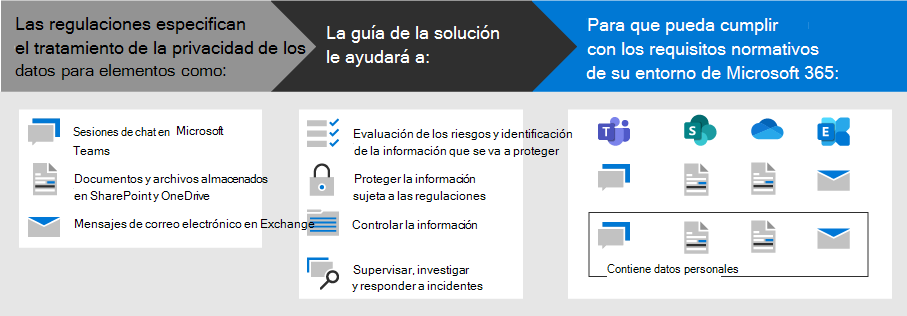

# Implementar la protección de la información para las regulaciones de privacidad de datos con Microsoft 365

Su organización puede estar sujeta a normativas regionales de privacidad de datos que requieren que proteja, administre y proporcione derechos y control sobre la información personal almacenada en su infraestructura de TI, incluidas las locales y en la nube. El mejor ejemplo de una regulación de privacidad de datos es el Reglamento general de protección de datos (RGPD) de la Unión Europea. Si no se cumplen las normativas de privacidad de datos, se pueden imponer multas considerables.

Algunos ejemplos de los tipos de datos de Microsoft 365 incluyen sesiones de chat en Microsoft Teams, correos electrónicos en Exchange y archivos en SharePoint y OneDrive. Esta solución proporciona instrucciones sobre cómo evaluar riesgos e identificar información, proteger, gobernar y responder a incidentes de privacidad de datos de datos almacenados en servicios de Microsoft 365 sujetos a normativas de privacidad de datos.

También se proporciona información adicional sobre el uso de los controles de protección de amenazas, dispositivos y identidades de Microsoft 365 para sus necesidades de privacidad de datos. 

Para cumplir con los criterios de protección de la información para el cumplimiento de las normativas de privacidad de datos, use estas características y funcionalidades de Microsoft 365.

| Funcionalidad o característica | Description | Licencias |
|:-------|:-----|:-------|
| Administrador de cumplimiento | Administre las actividades de cumplimiento normativo, obtenga una puntuación general de la configuración de cumplimiento actual y encuentre recomendaciones para mejorar esta herramienta de evaluación de riesgos basada en flujos de trabajo en el Centro de cumplimiento de Microsoft 365. | Microsoft 365 E3 y E5 |
| Microsoft Defender para Office 365 | Proteja sus datos y aplicaciones de Microsoft 365, como mensajes de correo electrónico, documentos de Office y herramientas de colaboración, ante posibles ataques. | Microsoft 365 E3 y E5 | 
| Etiquetas de confidencialidad | Clasifique y proteja los datos de su organización sin arriesgar la productividad de los usuarios y su capacidad para colaborar, mediante el establecimiento de etiquetas con distintos niveles de protección en el correo electrónico, los archivos y los sitios. | Microsoft 365 E3 y E5 |
| Protección de pérdida de datos (DLP) | Detecte, advierta y bloquee el uso compartido riesgoso, involuntario o inadecuado, como el de los datos que contengan información personal, tanto interna como externamente. | Microsoft 365 E3 y E5 | 
| Directivas y etiquetas de retención de datos | Implemente controles de gobierno de la información, como cuánto tiempo se conservan los datos y los requisitos de almacenamiento de datos personales sobre los clientes, para cumplir con las directivas de la organización o las regulaciones de datos. | Microsoft 365 E3 y E5 |
| Cifrado de correo electrónico | Envíe y reciba mensajes de correo electrónico cifrado entre las personas de dentro y fuera de la organización que contengan datos regulados, como los datos personales sobre clientes. | Microsoft 365 E3 y E5 |
||||

## Organización de las instrucciones de esta solución

Para ayudarle a comprender las herramientas de Microsoft 365 disponibles para identificar, administrar, controlar y supervisar datos personales sujetos a una o más normativas relacionadas con la privacidad, esta guía se organiza en secciones.
 

Cada una de estas secciones corresponde a un artículo independiente de esta solución.

>[!Note]
>Si ya está familiarizado con sus obligaciones de privacidad de datos y se está ejecutando en un plan existente, es posible que desee centrarse en la guía de prevención, protección, retención e investigación.

>[!Important]
>Seguir estas instrucciones no necesariamente le hará cumplir con ninguna regulación de privacidad de datos, especialmente teniendo en cuenta el número de pasos necesarios que están fuera del contexto de las características. Usted es responsable de garantizar su cumplimiento y de consultar a los equipos legales y de cumplimiento, o de buscar instrucciones y consejos de terceros que se especialicen en el cumplimiento.
>

## Plan: Evaluar los riesgos de privacidad de los datos e identificar elementos confidenciales

Evaluar las regulaciones y riesgos de privacidad de datos a los que está sujeta su organización es un primer paso clave que debe realizar antes de empezar a implementar mejoras, incluidas las que se pueden lograr a través de la configuración de Microsoft 365. Esto puede incluir una evaluación de preparación general o una identificación de determinados tipos de información confidencial que están sujetos a controles normativos que su organización necesita cumplir, así como la aparición de estos en su entorno de Microsoft 365.

Para obtener más información, vea [Evaluar los riesgos de privacidad de los datos e identificar elementos confidenciales.](information-protection-deploy-assess.md)

## Seguimiento: ejecutar evaluaciones de riesgos y comprobar la puntuación de cumplimiento

El Administrador de cumplimiento, disponible en el Centro de cumplimiento de Microsoft 365, le proporciona una capacidad integrada para realizar un seguimiento y administrar las acciones de mejora en general, así como aquellas relacionadas con varias regulaciones de privacidad de datos que se le aplican.

Aproveche las plantillas de evaluación integradas específicas de cada reglamento, donde puede realizar un seguimiento de los elementos de acción de cada plantilla de evaluación seleccionada, así como ver controles normativos específicos y relacionarlos con acciones específicas.

Para obtener más información, vea [Usar el Administrador de cumplimiento para administrar acciones de mejora.](information-protection-deploy-compliance.md)

## Impedir: proteger datos personales

Microsoft 365 proporciona una serie de funcionalidades de protección de identidades, dispositivos y amenazas que puede usar para ayudar a cumplir con el cumplimiento normativo de privacidad de datos. 

Para obtener más información, consulta [Usar la protección de identidades, dispositivos y amenazas para la regulación de privacidad de datos.](information-protection-deploy-identity-device-threat.md)

En este artículo se describe brevemente lo que las normativas de privacidad de datos suelen llamar en estas áreas y se proporciona una lista de soluciones relacionadas de Microsoft 365, con vínculos a más información para ayudarle a abordar los requisitos de implementación. 

## Proteger la información sujeta a la regulación de privacidad de datos

Las normativas de privacidad de datos dictan una serie de controles de protección de la información personal que se pueden usar en su entorno, incluidos más de cuarenta controles de protección de información en solo las cuatro regulaciones de privacidad de datos de nuestro conjunto de ejemplos de RGPD, ley de protección de consumidores de California (CCPA), hipaa-HITECH (ley de privacidad de salud de Estados Unidos) y la Ley de protección de datos de Brasil (LGPD).

Para obtener más información, vea [Proteger la información sujeta a la regulación de privacidad de datos en su organización.](information-protection-deploy-protect-information.md)

Este artículo describe los esquemas de control principales que se pueden usar para abordar las necesidades de protección de la información para la privacidad de los datos en su organización.

## Conservar: información de gobierno sujeta a la regulación de privacidad de datos

Las normativas de privacidad de datos exigen controles de gobierno de información personal que se pueden emplear en su entorno, incluidos más de veinticuatro controles en las cuatro normativas de privacidad de datos de nuestro conjunto de muestras de RGPD, CCPA, HIPAA-HITECH y LGPD.

Para obtener más información, consulta [Información de Govern sujeta a la regulación de privacidad de datos en tu organización.](information-protection-deploy-govern.md)

Aunque las regulaciones de privacidad de datos pueden ser imprecisas en lo que respecta al gobierno de la información, como la retención, eliminación y archivado específicos, este artículo describe los esquemas de control principales que puede usar para satisfacer las necesidades de gobierno de la información para la privacidad de los datos en su &mdash; &mdash; organización.

## Investigar: supervisar, investigar y responder a incidentes de privacidad de datos

Hay características de Microsoft 365 disponibles para ayudarle a supervisar, investigar y responder a incidentes de privacidad de datos en su organización a medida que opera las capacidades relacionadas. 

Tener procesos, procedimientos y otra documentación para cada uno de ellos puede ser importante para demostrar el cumplimiento a los organismos reguladores.

Para obtener más información, vea Supervisar y responder a incidentes de privacidad [de datos en su organización.](information-protection-deploy-monitor-respond.md)
