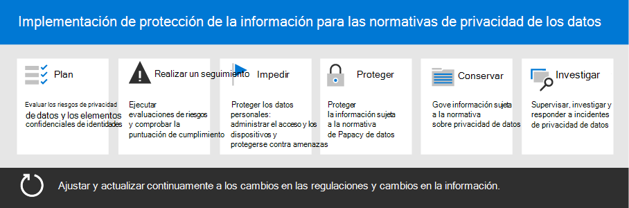

# Implementar la protección de la información para las normativas de privacidad de datos con Microsoft 365

Su organización puede estar sujeta a las normativas regionales de privacidad de datos que requieren que proteja, administre y proporcione derechos y control sobre la información personal almacenada en su infraestructura de TI, incluidas las instalaciones locales y en la nube. El mejor ejemplo de un reglamento de privacidad de datos es el Reglamento general de protección de datos (RGPD) de la Unión Europea. El incumplimiento de las normativas de privacidad de datos puede provocar importantes multas.

Algunos ejemplos de los tipos de datos de Microsoft 365 incluyen sesiones de chat en Microsoft Teams, correos electrónicos en Exchange y archivos en SharePoint y OneDrive. Esta solución proporciona instrucciones sobre cómo evaluar los riesgos y tomar las medidas adecuadas para proteger los datos personales en Microsoft 365. Esto incluye la identificación de información personal para que pueda proteger, gobernar y responder a incidentes de privacidad de datos.

También se proporciona información adicional sobre el uso de Microsoft 365 de identidad, dispositivo y protección contra amenazas para sus necesidades de privacidad de datos.

Estas Microsoft 365 y características le ayudarán a cumplir los criterios para proteger la información.

| Funcionalidad o característica | Description | Licencias |
|:-------|:-----|:-------|
| Administrador de cumplimiento | Administrar las actividades de cumplimiento normativo, obtener una puntuación general de la configuración de cumplimiento actual y encontrar recomendaciones para mejorar. Se trata de una herramienta de evaluación de riesgos basada en flujos de trabajo en el Centro de cumplimiento de Microsoft 365. | Microsoft 365 E3 y E5 |
| Microsoft Defender para Office 365 | Proteja sus datos y aplicaciones de Microsoft 365, como mensajes de correo electrónico, documentos de Office y herramientas de colaboración, ante posibles ataques. | Microsoft 365 E3 y E5 |
| Etiquetas de confidencialidad | Clasificar y proteger los datos de la organización sin obstaculizar la productividad de los usuarios y su capacidad de colaboración. Coloque etiquetas con varios niveles de protección en el correo electrónico, los archivos o los sitios. | Microsoft 365 E3 y E5 |
| Protección de pérdida de datos (DLP) | Detectar, advertir y bloquear el uso compartido riesgoso, involuntario o inadecuado de los datos que contienen información personal, tanto interna como externamente. | Microsoft 365 E3 y E5 |
| Directivas y etiquetas de retención de datos | Implementar controles de gobierno de información. Esto puede incluir determinar cuánto tiempo se deben mantener los datos (como datos personales relacionados con los clientes) para cumplir con las directivas o normativas de datos de su organización. | Microsoft 365 E3 y E5 |
| Cifrado de correo electrónico | Proteja los datos personales enviando y recibiendo mensajes de correo electrónico cifrados entre personas dentro y fuera de la organización. | Microsoft 365 E3 y E5 |
||||

## Organización de las instrucciones de esta solución

Para ayudarle a comprender las Microsoft 365 disponibles para ayudarle a cumplir una o más normativas relacionadas con la privacidad, esta guía se organiza en secciones.

Cada una de estas secciones corresponde a un artículo independiente de esta solución.

> [!NOTE]
> Si ya está familiarizado con sus obligaciones de privacidad de datos y se está ejecutando con un plan existente, es posible que desee centrarse en las instrucciones Prevent, Protect, Retain e Investigate.

> [!IMPORTANT]
> Seguir esta guía no necesariamente le hará cumplir con ninguna regulación de privacidad de datos, especialmente teniendo en cuenta el número de pasos necesarios que están fuera del contexto de las características. Usted es responsable de garantizar su cumplimiento y de consultar a sus equipos legales y de cumplimiento o de buscar orientación y asesoramiento de terceros que se especialicen en el cumplimiento.

## Plan: Evaluar los riesgos de privacidad de datos e identificar elementos confidenciales

Evaluar las regulaciones y riesgos de privacidad de datos a los que está sujeta su organización es un primer paso clave que debe realizar antes de empezar a implementar mejoras, incluida la configuración de capacidades en Microsoft 365. Este trabajo puede incluir una evaluación general de preparación o la identificación de tipos de información confidencial particulares que están sujetos a controles normativos que su organización debe cumplir.

Para obtener más información, vea [Assess data privacy risks and identify sensitive items](information-protection-deploy-assess.md).

## Seguimiento: ejecutar evaluaciones de riesgos y comprobar la puntuación de cumplimiento

El Administrador de cumplimiento, disponible en el Centro de cumplimiento de Microsoft 365, le proporciona una capacidad integrada para realizar un seguimiento y administrar las acciones de mejora en general, así como las relacionadas con varias normativas de privacidad de datos que se aplican a usted.

Puede usar plantillas de evaluación integradas específicas de cada reglamento, donde puede realizar un seguimiento de los elementos de acción de cada plantilla de evaluación seleccionada, así como ver controles normativos específicos y relacionarlos con acciones específicas.

Para obtener más información, vea [Use Compliance Manager to manage improvement actions](information-protection-deploy-compliance.md).

## Impedir: proteger datos personales

Microsoft 365 proporciona funcionalidades de protección de identidades, dispositivos y amenazas que puedes usar para ayudar a cumplir con el cumplimiento normativo de privacidad de datos.

Para obtener más información, consulta Usar la identidad, el dispositivo y la [protección contra amenazas para la regulación de privacidad de datos.](information-protection-deploy-identity-device-threat.md)

En este artículo se describe brevemente lo que las normativas de privacidad de datos suelen llamar en estas áreas y se proporciona una descripción de las soluciones de Microsoft 365 relacionadas, con vínculos a más información que le ayudarán a abordar los requisitos de implementación.

## Proteger la información sujeta a la regulación de privacidad de datos

Las normativas de privacidad de datos dictan una serie de controles de protección de la información personal que se pueden usar en su entorno, incluidos más de 40 controles para proteger la información en solo los cuatro reglamentos de privacidad de datos de nuestro conjunto de ejemplo de RGPD, ley de protección de consumidores de California (CCPA), HIPAA-HITECH (ley de privacidad de cuidado de la salud de Estados Unidos) y la Ley de protección de datos de Brasil (LGPD).

Para obtener más información, vea [Protect information subject to data privacy regulation in your organization](information-protection-deploy-protect-information.md).

En este artículo se desaprobaban los principales esquemas de control que se pueden usar para abordar las necesidades de protección de la información para la privacidad de datos en su organización.

## Retener: Información de gobierno sujeta a la regulación de privacidad de datos

Las normativas de privacidad de datos exigen controles de gobierno de información personal que se pueden usar en su entorno, incluidos más de 24 controles en los cuatro reglamentos de privacidad de datos de nuestro conjunto de ejemplo de RGPD, CCPA, HIPAA-HITECH y LGPD.

Para obtener más información, vea [Información de Govern sujeta a la regulación de privacidad de datos en su organización.](information-protection-deploy-govern.md)

Aunque las regulaciones de privacidad de datos pueden ser imprecisas con respecto al gobierno de la información, como la retención, eliminación y archivado específicos, este artículo describe los esquemas de control principales que puede usar para satisfacer las necesidades de gobierno de la información para la privacidad de datos en su &mdash; &mdash; organización.

## Investigar: supervisar, investigar y responder a incidentes de privacidad de datos

Hay Microsoft 365 disponibles para ayudarle a supervisar, investigar y responder a incidentes de privacidad de datos en su organización a medida que opera las capacidades relacionadas.

Tener procesos, procedimientos y otra documentación para usar estas características puede ser importante para demostrar el cumplimiento de los organismos reguladores.

Para obtener más información, vea [Monitor and respond to data privacy incidents in your organization](information-protection-deploy-monitor-respond.md).
