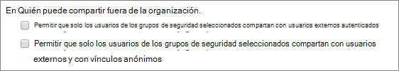

# Referencia de la configuración de uso compartido de invitados de Microsoft 365Microsoft 365 guest sharing settings reference

En este artículo se proporciona una referencia para las distintas opciones de configuración que pueden afectar al uso compartido de usuarios externos a la organización en las cargas de trabajo de Microsoft 365: Teams, Grupos de Office 365, SharePoint y OneDrive.This article provides a reference for the various settings that can affect sharing with people outside your organization for the Microsoft 365 workloads: Teams, Office 365 Groups, SharePoint, and OneDrive. Esta configuración se encuentra en el centro de administración de Azure Active Directory, Microsoft 365, Teams y SharePoint.These settings are located in the Azure Active Directory, Microsoft 365, Teams, and SharePoint admin centers.

## Azure Active DirectoryAzure Active Directory

**Rol de administrador**: administrador global**Admin role:** Global administrator

Azure Active Directory es el servicio de directorio que usa Microsoft 365.Azure Active Directory is the directory service used by  Microsoft 365. La configuración de las relaciones de organización de Azure Active Directory afecta directamente al uso compartido en Teams, Grupos de Office 365, SharePoint y OneDrive.The Azure Active Directory Organizational relationships settings directly affect sharing in Teams, Office 365 Groups, SharePoint, and OneDrive.

> [!NOTE]
> Esta configuración solo afecta a SharePoint cuando se ha configurado la [Integración de SharePoint y OneDrive con Azure AD B2B (versión preliminar)](https://docs.microsoft.com/sharepoint/sharepoint-azureb2b-integration-preview).These settings only affect SharePoint when [SharePoint and OneDrive integration with Azure AD B2B (Preview)](https://docs.microsoft.com/sharepoint/sharepoint-azureb2b-integration-preview) has been configured. En la tabla siguiente se presupone que esta se ha configurado.The table below assumes that this has been configured.

### Configuración de relaciones de organizaciónOrganizational relationships settings

**Navegación:** [Centro de administración de Azure Active Directory](https://aad.portal.azure.com) > Azure Active Directory > Relaciones de organización > Configuración**Navigation:** [Azure Active Directory admin center](https://aad.portal.azure.com) > Azure Active Directory > Organizational relationships > Settings

|**Setting****Setting**|**Default****Default**|**Descripción****Description**|
|:-----|:-----|:-----|
|Los permisos de usuarios invitados son limitadosGuest users permissions are limited|SíYes|Esta configuración afecta a las tareas del directorio que pueden realizar los invitados.This setting affects the directory tasks that a guest can perform.|
|Solo pueden invitar los administradores y usuarios con el rol de invitador de usuarios invitadosAdmins and users in the guest inviter role can invite|SíYes|Si se establece en **Sí**, los administradores pueden invitar a través de Azure AD y a través de las experiencias de uso compartido de Microsoft 365, como Teams y SharePoint; si se establece en **No**, no pueden hacerlo.When set to **Yes**, admins can invite guests via Azure AD and via  Microsoft 365 sharing experiences such as Teams and SharePoint; when set to **No**, they cannot.|
|Los miembros pueden invitarMembers can invite|SíYes|Si se establece en **Sí**, los miembros de Azure AD pueden invitar a través de Azure AD; si se establece en **No**, no pueden hacerlo.When set to **Yes**, Azure AD members can invite guests via Azure AD; when set to **No**, they cannot. Si se establece en **Sí**, los miembros del Grupo de Office 365 pueden invitar con aprobación del propietario; si se establece en **No**, los miembros del Grupo de Office 365 pueden invitar con aprobación del propietario, pero los propietarios deben ser administradores globales para poder aprobar.When set to **Yes**, Office 365 Group members can invite guests with owner approval; when set to **No**, Office 365 Group members can invite guests with owner approval but owners must be global administrators to approve.   Tenga en cuenta que la opción **Los miembros pueden invitar** hace referencia a los miembros de Azure AD (frente a los invitados) y no a los miembros del sitio o grupo de Microsoft 365.Note that **Members can invite** refers to members in Azure AD (as opposed to guests) and not to site or group members in  Microsoft 365.   Esto es idéntico a la opción de configuración **Permitir que los usuarios agreguen nuevos invitados a la organización** en seguridad y privacidad de Microsoft 365.This is identical to the **Let users add new guests to the organization** setting in Microsoft 365 Security & privacy.|
|Los invitados pueden invitarGuests can invite|SíYes|Si se establece en **Sí**, los invitados en el directorio pueden invitar a otros invitados a colaborar en los recursos de Azure AD y en los archivos y carpetas de SharePoint y OneDrive; si se establece en **No**, no pueden hacerlo.When set to **Yes**, guests in the directory can invite other guests to collaborate on Azure AD resources and on files and folders in SharePoint and OneDrive; when set to **No**, they cannot.   Tenga en cuenta que **Permitir que los usuarios externos detecten cuentas de usuario en el directorio si escriben la dirección de correo electrónico exacta** se debe activar en el Centro de administración de SharePoint para que los invitados puedan compartir archivos y carpetas con otros invitados.Note that **Allow external users to find user accounts in the directory by typing in exact email address matches** must be turned on in the SharePoint admin center for guests to share files and folders with other guests.|
|Habilitar el código de acceso de un solo uso de correo electrónico para invitados (versión preliminar)Enable Email One-Time Passcode for guests (Preview)|NoNo|Si se establece en **Sí**, los invitados que no tengan MSA o una cuenta profesional o educativa pueden [autenticarse con Azure AD mediante un código de acceso de un solo uso](https://docs.microsoft.com/azure/active-directory/b2b/one-time-passcode); si se establece en **No**, los usuarios tendrán que crear un cuenta de Microsoft para autenticarse.When set to **Yes**, guests without an MSA or a work or school account can [authenticate with Azure AD using a one-time passcode](https://docs.microsoft.com/azure/active-directory/b2b/one-time-passcode); when set to **No**, users will need to create a Microsoft account in order to authenticate. Esta configuración se debe establecer en **Sí** para la [Integración de SharePoint y OneDrive con Azure AD B2B (versión preliminar)](https://docs.microsoft.com/sharepoint/sharepoint-azureb2b-integration-preview).This setting must be set to **Yes** for [SharePoint and OneDrive integration with Azure AD B2B (Preview)](https://docs.microsoft.com/sharepoint/sharepoint-azureb2b-integration-preview) to work.|
|Restricciones de colaboraciónCollaboration restrictions|Permitir el envío de invitaciones a cualquier dominioAllow invitations to be sent to any domain|Esta configuración le permite especificar una lista de dominios permitidos o bloqueados para el uso compartido.This setting allows you to specify a list of allowed or blocked domains for sharing. Si se especifican dominios permitidos, las invitaciones de uso compartido solo se pueden enviar a estos dominios.When allowed domains are specified, then sharing invitations can only be sent to those domains. Si se especifican dominios denegados, las invitaciones de uso compartido no se pueden enviar a estos dominios.When denied domains are specified, then sharing invitations cannot be sent to those domains.   Esta configuración afecta a las experiencias de uso compartido de Microsoft 365 como Teams y SharePoint.This setting affects  Microsoft 365 sharing experiences such as Teams and SharePoint. Puede permitir o bloquear dominios en un nivel más granular con el filtrado de dominios de SharePoint o Teams.You can allow or block domains at a more granular level by using domain filtering in SharePoint or Teams.|

Esta configuración afecta al modo en que se invitan a los usuarios al directorio.These settings affect how users are invited to the directory. No afecta al uso compartido de invitados que ya están en el directorio.They do not affect sharing with guests who are already in the directory.

## Microsoft 365Microsoft 365

**Rol de administrador**: administrador global**Admin role:** Global administrator

El Centro de administración de Microsoft 365 tiene la configuración de nivel de organización para el uso compartido y para los Grupos de Office 365.The Microsoft 365 admin center has organization-level settings for sharing and for Office 365 Groups.

### CompartirSharing

**Navegación:** [Centro de administración de Microsoft 365](https://admin.microsoft.com) > Configuración > Configuración > pestaña Seguridad y privacidad > Uso compartido**Navigation:** [Microsoft 365 admin center](https://admin.microsoft.com) > Settings > Settings > Security & privacy tab > Sharing

|**Setting****Setting**|**Default****Default**|**Descripción****Description**|
|:-----|:-----|:-----|
|Permitir que los usuarios agreguen nuevos invitados a la organizaciónLet users add new guests to the organization|ActivadoOn|Si se establece en **Sí**, los miembros de Azure AD pueden invitar a través de Azure AD; si se establece en **No**, no pueden hacerlo.When set to **Yes**, Azure AD members can invite guests via Azure AD; when set to **No**, they cannot. Si se establece en **Sí**, los miembros del Grupo de Office 365 pueden invitar con aprobación del propietario; si se establece en **No**, los miembros del Grupo de Office 365 pueden invitar con aprobación del propietario, pero los propietarios deben ser administradores globales para poder aprobar.When set to **Yes**, Office 365 Group members can invite guests with owner approval; when set to **No**, Office 365 Group members can invite guests with owner approval but owners must be global administrators to approve.   Tenga en cuenta que la opción **Los miembros pueden invitar** hace referencia a los miembros de Azure AD (frente a los invitados) y no a los miembros del sitio o grupo de Microsoft 365.Note that **Members can invite** refers to members in Azure AD (as opposed to guests) and not to site or group members in  Microsoft 365.   Esto es idéntico a la opción de configuración **Los miembros pueden invitar** en las relaciones de organización de Azure Active Directory.This is identical to the **Members can invite** setting in Azure Active Directory Organizational relationships settings.|

### Grupos de Office 365Office 365 Groups

**Navegación:**[Centro de administración de Microsoft 365](https://admin.microsoft.com) > Configuración > Configuración > Grupos de Office 365**Navigation:** [Microsoft 365 admin center](https://admin.microsoft.com) > Settings > Settings > Office 365 Groups

|**Setting****Setting**|**Default****Default**|**Descripción****Description**|
|:-----|:-----|:-----|
|Permitir que los miembros del grupo de fuera de la organización tengan acceso al contenido del grupoLet group members outside your organization access group content|ActivadoOn|Si se establece en **Activado**, los invitados pueden acceder al contenido de los grupos; si se establece en **Desactivado**, no pueden hacerlo.When set to **On**, guests can access groups content; when set to **Off**, they can't. Esta configuración debe establecerse en **Activado** en cualquier escenario en el que los usuarios invitados interactúen con Grupos de Office 365 y Teams.This setting should be **On** for any scenario where guest users are interacting with Office 365 Groups or Teams.|
|Permitir que los propietarios de grupos agreguen a usuarios ajenos a la organización a los gruposLet group owners add people outside your organization to groups|ActivadoOn|Si está **Activado**, los propietarios de los Grupos de Office 365 o Teams pueden invitar a nuevos invitados al grupo.When **On**, Owners of Office 365 Groups or Teams can invite new guests to the group. Si está **Desactivado**, los propietarios solo pueden invitar a los que ya están en el directorio.When **Off**, owners can only invite guests who are already in the directory.|

Esta configuración se aplica a toda la organización.These settings are at the organization level. Vea [Crear una configuración para un grupo específico](https://docs.microsoft.com/azure/active-directory/users-groups-roles/groups-settings-cmdlets#create-settings-for-a-specific-group) para crear una configuración a nivel de grupo con PowerShell.See [Create settings for a specific group](https://docs.microsoft.com/azure/active-directory/users-groups-roles/groups-settings-cmdlets#create-settings-for-a-specific-group) for information about how to change these settings at the group level by using PowerShell.

## TeamsTeams

El conmutador principal de acceso de invitado de Teams, **Permitir el acceso de invitado en Teams**, debe estar **Activado** para que las demás opciones de configuración de invitados estén disponibles.The Teams master guest access switch, **Allow guest access in Teams**, must be **On** for the other guest settings to be available.

**Rol de administrador**: administrador de servicios de Teams**Admin role:** Teams service administrator

### Acceso de invitadoGuest access

**Navegación:** [Centro de administración de Teams](https://admin.teams.microsoft.com) > Configuración de toda la organización > Acceso de invitado**Navigation:** [Teams admin center](https://admin.teams.microsoft.com) > Org-wide settings > Guest access

|**Setting****Setting**|**Default****Default**|**Descripción****Description**|
|:-----|:-----|:-----|
|Permitir el acceso de invitado en TeamsAllow guest access in Teams|DesactivadoOff|Activa o desactiva el acceso de invitado a Teams en general.Turns guest access on or off for Teams overall. Esta configuración puede tardar 24 horas en aplicarse una vez cambiada.This setting can take 24 hours to take effect once changed.|

### Llamadas de invitadoGuest calling

**Navegación:** [Centro de administración de Teams](https://admin.teams.microsoft.com) > Configuración de toda la organización > Acceso de invitado**Navigation:** [Teams admin center](https://admin.teams.microsoft.com) > Org-wide settings > Guest access

|**Setting****Setting**|**Default****Default**|**Descripción****Description**|
|:-----|:-----|:-----|
|Realizar llamadas privadasMake private calls|ActivadoOn|Si está **Activado**, los invitados pueden realizar llamadas de punto a punto en Teams; si está **Desactivado**, no pueden hacerlo.When **On**, guests can make peer-to-peer calls in Teams; when **Off**, they can't.|

### Reunión de invitadoGuest meeting

**Navegación:** [Centro de administración de Teams](https://admin.teams.microsoft.com) > Configuración de toda la organización > Acceso de invitado**Navigation:** [Teams admin center](https://admin.teams.microsoft.com) > Org-wide settings > Guest access

|**Setting****Setting**|**Default****Default**|**Descripción****Description**|
|:-----|:-----|:-----|
|Permitir vídeo IPAllow IP video|ActivadoOn|Si está **Activado**, los invitados pueden usar el vídeo en sus llamadas y reuniones; si está **Desactivado**, no pueden hacerlo.When **On**, guests can use video in their calls and meetings; when **Off**, they can't.|
|Modo de uso compartido de la pantallaScreen sharing mode|Toda la pantallaEntire screen|Si está **Deshabilitado**, los invitados no pueden compartir su pantalla en Teams.When **Disabled**, guests can't share their screens in Teams. Si se establece en **Una sola aplicación**, los invitados solo pueden compartir una única aplicación en su pantalla.When set to **Single application**, guests can only share a single application on their screen. Si se establece en **Pantalla completa**, los invitados pueden elegir entre compartir una aplicación o toda la pantalla.When set to **Entire screen**, guests can choose to share an application or their entire screen.|
|Permitir Reunirse ahoraAllow Meet Now|ActivadoOn|Si está **Activado**, los invitados pueden usar la característica Reunirse ahora en Teams; si está **Desactivado**, no pueden hacerlo.When **On**, guests can use the Meet Now feature in Teams; when **Off**, they can't.|

### Mensajería de invitadoGuest messaging

**Navegación:** [Centro de administración de Teams](https://admin.teams.microsoft.com) > Configuración de toda la organización > Acceso de invitado**Navigation:** [Teams admin center](https://admin.teams.microsoft.com) > Org-wide settings > Guest access

|**Setting****Setting**|**Default****Default**|**Descripción****Description**|
|:-----|:-----|:-----|
|Editar los mensajes enviadosEdit sent messages|ActivadoOn|Si está **Activado**, los invitados pueden editar los mensajes que se enviaron previamente; si está **Desactivado**, no pueden hacerlo.When **On**, guests can edit messages they previously sent; when **Off**, they can't.|
|Eliminar mensajes enviadosDelete sent messages|ActivadoOn|Si está **Activado**, los invitados pueden eliminar los mensajes que se enviaron previamente; si está **Desactivado**, no pueden hacerlo.When **On**, guests can delete messages they previously sent; when **Off**, they can't.|
|ChatChat|ActivadoOn|Si está **Activado**, los invitados pueden usar chat en Teams; si está **Desactivado**, no pueden hacerlo.When **On**, guests can use chat in Teams; when **Off**, they can't.|
|Usar Giphys en las conversacionesUse Giphys in conversations|ActivadoOn|Si está **Activado**, los invitados pueden usar Giphys en las conversaciones; si está **Desactivado**, no pueden hacerlo.When **On**, guests can use Giphys in conversations; when **Off**, they can't.|
|Clasificación del contenido de GiphyGiphy content rating|ModeradoModerate|Si se establece en **Permitir todo el contenido**, los invitados pueden insertar todos los Giphys en chats, independientemente de la clasificación de contenido.When set to **Allow all content**, guests will can insert all Giphys in chats, regardless of the content rating. Si se establece en **Moderado**, los invitados pueden insertar Giphys en los chats, pero se les restringirá de forma moderada el contenido para adultos.When set to **Moderate** guests can insert Giphys in chats, but will be moderately restricted from adult content. Si se establece en **Estricto**, los invitados pueden insertar Giphys en los chats, pero se les restringirá insertar contenido para adultos.When set to **Strict** guests can insert Giphys in chats, but will be restricted from inserting adult content.|
|Usar Memes en las conversacionesUse Memes in conversations|ActivadoOn|Si está **Activado**, los invitados pueden usar memes en las conversaciones; si está **Desactivado**, no pueden hacerlo.When **On**, guests can use memes in conversations; when **Off**, they can't.|
|Usar adhesivos en las conversacionesUser stickers in conversations|ActivadoOn|Si está **Activado**, los invitados pueden usar adhesivos en las conversaciones; si está **Desactivado**, no pueden hacerlo.When **On**, guests can use stickers in conversations; when **Off**, they can't.|
|Permitir el lector inmersivo para ver mensajesAllow immersive reader for viewing messages|ActivadoOn|Si está **Activado**, los invitados pueden ver los mensajes en el lector inmersivo; si está **Desactivado**, no pueden hacerlo.When **On**, guests can view messages in Immersive Reader; when **Off**, they can't.|

## SharePoint y OneDrive (nivel de la organización)SharePoint and OneDrive (organization-level)

**Rol de administrador**: Administrador del servicio SharePoint**Admin role:** SharePoint administrator

Esta configuración afecta a todos los sitios de la organización.These settings affect all of the sites in the organization. No afecta directamente a los Grupos de Office 365 o Teams, pero le recomendamos que alinee esta configuración con la de Grupos de Office 365 y Teams para evitar problemas de experiencia de usuario.They do not affect Office 365 Groups or Teams directly, however we recommend that you align these settings with the settings for Office 365 Groups and Teams to avoid user experience issues. (Por ejemplo, si se permite el uso compartido de invitados en Teams, pero no en SharePoint, los invitados en Teams no tendrán acceso a la pestaña Archivos, ya que los archivos de Teams se almacenan en SharePoint).(For example, if guest sharing is allowed in Teams but not SharePoint, then guests in Teams will not have access to the Files tab because Teams files are stored in SharePoint.)

### Configuración de uso compartido de SharePoint y OneDriveSharePoint and OneDrive sharing settings

Como OneDrive es una jerarquía de sitios dentro de SharePoint, la configuración de uso compartido en el nivel de la organización afecta directamente a OneDrive al igual que otros sitios de SharePoint.Because OneDrive is a hierarchy of sites within SharePoint, the organization-level sharing settings directly affect OneDrive just as they do other SharePoint sites.

**Navegación:** Centro de administración de SharePoint > Uso compartido**Navigation:** SharePoint admin center > Sharing

|**Setting****Setting**|**Default****Default**|**Descripción****Description**|
|:-----|:-----|:-----|
|SharePointSharePoint|CualquieraAnyone|Especifica los permisos de uso compartido más permisivos permitidos para los sitios de SharePoint.Specifies the most permissive sharing permissions allowed for SharePoint sites.|
|OneDriveOneDrive|CualquieraAnyone|Especifica los permisos de uso compartido más permisivos permitidos para los sitios de OneDrive.Specifies the most permissive sharing permissions allowed for OneDrive sites. Esta configuración no puede ser más permisiva que la configuración de SharePoint.This setting cannot be more permissive than the SharePoint setting.|

### Configuración de uso compartido avanzado de SharePoint y OneDriveSharePoint and OneDrive advanced sharing settings

**Navegación:** Centro de administración de SharePoint > Uso compartido**Navigation:** SharePoint admin center > Sharing

|**Setting****Setting**|**Default****Default**|**Descripción****Description**|
|:-----|:-----|:-----|
|Limitar el uso compartido externo por dominioLimit external sharing by domain|DesactivadoOff|Esta configuración le permite especificar una lista de dominios permitidos o bloqueados para el uso compartido.This setting allows you to specify a list of allowed or blocked domains for sharing. Si se especifican dominios permitidos, las invitaciones de uso compartido solo se pueden enviar a estos dominios.When allowed domains are specified, then sharing invitations can only be sent to those domains. Si se especifican dominios denegados, las invitaciones de uso compartido no se pueden enviar a estos dominios.When denied domains are specified, then sharing invitations cannot be sent to those domains.   Esta configuración afecta a todos los sitios de SharePoint y OneDrive de la organización.This setting affects all SharePoint and OneDrive sites in the organization.|
|Los invitados deben iniciar sesión con la misma cuenta a la que se enviaron las invitaciones para el uso compartidoGuests must sign in using the same account to which sharing invitations are sent|DesactivadoOff|Impide que los invitados canjeen las invitaciones de uso compartido de sitios con una dirección de correo electrónico distinta a la que se envió la invitación.Prevents guests from redeeming site sharing invitations using a different email address than the invitation was sent to.  La [Integración de SharePoint y OneDrive con Azure AD B2B (versión preliminar)](https://docs.microsoft.com/sharepoint/sharepoint-azureb2b-integration-preview) no usa esta opción, ya que todos los invitados se agregan al directorio basándose en la dirección de correo electrónico a la que se envió la invitación.[SharePoint and OneDrive integration with Azure AD B2B (Preview)](https://docs.microsoft.com/sharepoint/sharepoint-azureb2b-integration-preview) does not use this setting because all guests are added to the directory based on the email address that the invitation was sent to. No se pueden usar direcciones de correo electrónico alternativas para tener acceso al sitio.Alternate email addresses cannot be used to access the site.|
|Permitir que los invitados compartan elementos que no poseenAllow guests to share items they don't own|ActivadoOn|Si está **Activado**, los invitados pueden compartir elementos que no poseen con otros usuarios o invitados; si está **Desactivado**, no pueden hacerlo.When **On**, guests can share items that they don't own with other users or guests; when **Off** they cannot. Los invitados siempre podrán compartir elementos sobre los que tengan control total.Guests can always share items for which they have full control.|

### Configuración de vínculos a archivos y carpetas de SharePoint y OneDriveSharePoint and OneDrive file and folder link settings

Cuando se comparten archivos y carpetas en SharePoint y OneDrive, los destinatarios con los que se comparte reciben un vínculo con los permisos para el archivo o la carpeta en lugar de obtener acceso directo a ellos.When files and folders are shared in SharePoint and OneDrive, sharing recipients are sent a link with permissions to the file or folder rather than being granted direct access to the file or folder themselves. Existen varios tipos de vínculos disponibles y puede elegir el tipo de vínculo predeterminado que se muestra a los usuarios cuando comparten un archivo o una carpeta.Several types of links are available, and you can choose the default link type presented to users when they share a file or folder. También puede establecer permisos y opciones de expiración para vínculos de *Cualquiera*.You can also set permissions and expiration options for *Anyone* links.

**Navegación:** Centro de administración de SharePoint > Uso compartido**Navigation:** SharePoint admin center > Sharing

|**Setting****Setting**|**Default****Default**|**Descripción****Description**|
|:-----|:-----|:-----|
|Vínculos de archivos y carpetasFile and folder links|Cualquiera con el vínculoAnyone with the link|Especifica el vínculo para compartir que se muestra de manera predeterminada cuando un usuario comparte un archivo o una carpeta.Specifies which sharing link is shown by default when a user shares a file or folder. Si quieren, los usuarios pueden cambiar la opción antes de compartir.Users can change the option before sharing if they want. Si el valor predeterminado está establecido en **Cualquiera con el vínculo** y no se permite el uso compartido de *Cualquiera* para un sitio determinado, se mostrará como valor predeterminado para ese sitio **Solo los miembros de su organización**.If the default is set to **Anyone with the link** and *Anyone* sharing is not allowed for a given site, then **Only people in your organization** will be shown as the default for that site.|
|Los vínculos deben expirar dentro de este número de días:These links must expire within this many days|Desactivado (sin expiración)Off (no expiration)|Especifica el número de días que transcurren después de que se cree un vínculo de *Cualquiera* para que expire.Specifies the number of days after an *Anyone* link is created that it expires. Los vínculos expirados no se pueden renovar.Expired links cannot be renewed. Si necesita seguir compartiendo después de la fecha de expiración, cree un nuevo vínculo.Create a new link if you need to continue sharing past the expiration.|
|Permisos de archivosFile permissions|Ver y editarView and edit|Especifica los niveles de permisos de archivo disponibles para los usuarios al crear un vínculo de *Cualquiera*.Specifies the file permission levels available to users when creating an *Anyone* link. Si se selecciona **Ver**, los usuarios solo pueden crear vínculos de archivo de *Cualquiera* con permisos de visualización.If **View** is selected, then users can only create *Anyone* file links with view permissions. Si se selecciona **Ver y editar**, los usuarios pueden elegir entre ver y ver y editar los permisos al crear el vínculo.If **View, and edit** is selected, then users can choose between view and view and edit permissions when they create the link.|
|Permisos de carpetaFolder permissions|Ver, editar y cargarView, edit, and upload|Especifica los niveles de permisos de carpeta disponibles para los usuarios al crear un vínculo de *Cualquiera*.Specifies the folder permission levels available to users when creating an *Anyone* link. Si se selecciona **Ver**, los usuarios solo pueden crear vínculos de carpeta de *Cualquiera* con permisos de visualización.If **View** is selected, then users can only create *Anyone* folder links with view permissions. Si se selecciona **Ver, editar y cargar**, los usuarios pueden elegir entre ver y ver, editar y cargar permisos al crear el vínculo.If **View, edit, and upload** is selected, then users can choose between view and view, edit, and upload permissions when they creat the link.|

### Configuración del grupo de seguridad de SharePoint y OneDriveSharePoint and OneDrive security group settings

Si quiere limitar quién puede compartir con los invitados en SharePoint y OneDrive, puede hacerlo limitando el uso compartido a los usuarios de los grupos de seguridad especificados.If you want to limit who can share with guests in SharePoint and OneDrive, you can do so by limiting sharing to people in specified security groups. Esta configuración no afecta al uso compartido a través de Grupos de Office 365 o Teams.These settings do not affect sharing via Office 365 Groups or Teams. Los invitados a través de un grupo o un equipo también tendrían acceso al sitio asociado, aunque el uso compartido de documentos y carpetas lo puedan realizar solo los usuarios de los grupos de seguridad especificados.Guests invited via a group or team would also have access to the associated site, though document and folder sharing could only be done by people in the specified security groups.

**Navegación:** Centro de administración de SharePoint > Uso compartido > Limitar el uso compartido externo a grupos de seguridad específicos**Navigation:** SharePoint admin center > Sharing > Limit external sharing to specific security groups

|**Setting****Setting**|**Default****Default**|**Descripción****Description**|
|:-----|:-----|:-----|
|Permitir que solo los usuarios de los grupos de seguridad seleccionados compartan con usuarios externos autenticadosLet only users in selected security groups share with authenticated external users|DesactivadoOff|Si está **Activado**, solo los usuarios de los grupos de seguridad especificados pueden compartir con usuarios externos.When **On**, only the people in the specified security groups can share with external users. Solo están disponibles vínculos de *Personas específicas*.Only *Specific people* links are available. El uso compartido de *Cualquiera* se ha deshabilitado correctamente, salvo que esté **Activado** **Permitir que solo los usuarios de los grupos de seguridad seleccionados compartan con usuarios externos y con vínculos anónimos usuarios externos autenticados y con vínculos anónimos**.*Anyone* sharing is effectively disabled unless **Let only users in selected security groups share with authenticated external users and using anonymous links** is also **On**|
|Permitir que solo los usuarios de los grupos de seguridad seleccionados compartan con usuarios externos y con vínculos anónimosLet only users in selected security groups share with authenticated external users and using anonymous links|DesactivadoOff|Si está **Activado**, solo los usuarios de los grupos de seguridad especificados pueden compartir con invitados.When **On**, only the people in the specified security groups can share with guests. Están disponibles tanto el vínculo de *Cualquiera* como el vínculo de *Personas específicas*.Both *Anyone* and *Specific people* links are available.|

Ambas configuraciones se pueden usar al mismo tiempo.Both of these settings can be used at the same time. Si un usuario está en los grupos de seguridad especificados en ambas configuraciones prevalece el nivel de permisos mayor (*Cualquiera* más *Personas específicas*).If a user is in security groups specified for both settings, then the greater permission level prevails (*Anyone* plus *Specific user*).

## SharePoint (nivel de sitio)SharePoint (site level)

**Rol de administrador**: Administrador del servicio SharePoint**Admin role:** SharePoint administrator

Como estas opciones están sujetas a la configuración de toda la organización de SharePoint, puede cambiar la configuración de uso compartido efectiva del sitio si cambia la configuración de nivel de la organización.Because these settings are subject to the organization-wide settings for SharePoint, the effective sharing setting for the site may change if the organization-level setting changes. Si elige una configuración aquí y el nivel de organización se establece posteriormente en un valor más restrictivo, este sitio funcionará con ese valor más restrictivo.If you choose a setting here and the organization-level is later set to a more restrictive value, then this site will operate at that more restrictive value. Por ejemplo, si elige **Cualquiera** y la configuración de nivel de organización se establece posteriormente en **Invitados nuevos y existentes**, este sitio solo permitirá invitados nuevos y existentes.For example, if you choose **Anyone** and the organization-level setting is later set to **New and existing guests**, then this site will only allow new and existing guests. Si la configuración del nivel de organización se vuelve a establecer en **Cualquiera**, este sitio volverá a permitir el vínculo de *Cualquiera*.If the organization-level setting is then set back to **Anyone**, this site would again allow *Anyone* links.

### Uso compartido de sitiosSite sharing

Puede establecer permisos para el uso compartido de invitados para cada sitio de SharePoint.You can set guest sharing permissions for each site in SharePoint. Esta configuración se aplica al uso compartido de sitios y al uso compartido de archivos y carpetas.This setting applies to both site sharing and file and folder sharing. (El uso compartido de *Cualquiera* no está disponible para compartir sitios.(*Anyone* sharing is not available for site sharing. Si elige **Cualquiera**, los usuarios podrán compartir archivos y carpetas mediante vínculos de *Cualquiera*, y el mismo sitio con invitados nuevos y existentes).If you choose **Anyone**, users will be able to share files and folders by using *Anyone* links, and the site itself with new and existing guests.)

**Navegación:** Centro de administración de SharePoint > Sitios activos > seleccione el sitio > Editar uso compartido externo**Navigation:** SharePoint admin center > Active sites > select the site > Policies tab > Edit External sharing

|**Setting****Setting**|**Default****Default**|**Descripción****Description**|
|:-----|:-----|:-----|
|Puede compartir contenido conSite content can be shared with|Varía por tipo de sitio (consulte la tabla siguiente)Varies by site type (see the table below)|Indica el tipo de uso compartido externo permitido para este sitio.Indicates the type of external sharing allowed for this site. Las opciones disponibles en esta sección están sujetas a la configuración de uso compartido en el nivel de la organización de SharePoint.Options available here are subject to the organization-level sharing settings for SharePoint.|

### Configuración de vínculos a archivos y carpetas del sitioSite file and folder link settings

Puede establecer valores predeterminados para los tipos de vínculos y permisos, y la configuración de expiración para *Cualquiera* para cada sitio.You can set defaults for link type and permissions, and expiration settings for *Anyone* links for each site. Cuando se establece en el nivel de sitio, esta configuración reemplaza la configuración de nivel de organización.When set at the site level, these settings override the organization-level settings. Tenga en cuenta que, si se deshabilitan los vínculos *Cualquiera* en el nivel de la organización, *Cualquiera* no será un tipo de vínculo disponible en el nivel de sitio.Note that if *Anyone* links are disabled at the organization level, *Anyone* will not be an available link type at the site level.

**Navegación:** Centro de administración de SharePoint > Sitios activos > seleccione el sitio > Editar uso compartido externo**Navigation:** SharePoint admin center > Active sites > select the site > Policies tab > Edit External sharing

|**Valor****Setting**|**Default****Default**|**Descripción****Description**|
|:-----|:-----|:-----|
|Limitar el uso compartido por dominioLimit sharing by domain|DesactivadoOff|Esta configuración le permite especificar una lista de dominios permitidos o bloqueados para el uso compartido.This setting allows you to specify a list of allowed or blocked domains for sharing. Si se especifican dominios permitidos, las invitaciones de uso compartido solo se pueden enviar a estos dominios.When allowed domains are specified, then sharing invitations can only be sent to those domains. Si se especifican dominios denegados, las invitaciones de uso compartido no se pueden enviar a estos dominios.When denied domains are specified, then sharing invitations cannot be sent to those domains.   Esta configuración no se puede usar para reemplazar las restricciones de dominio establecidas en el nivel de la organización o de Azure AD.This setting cannot be used to override domain restrictions set at the organization or Azure AD level.|
|Tipo de vínculo para compartir predeterminadoDefault sharing link type|Igual que la configuración de nivel de organizaciónSame as organization-level setting|Esta configuración le permite especificar el vínculo para compartir predeterminado que se muestra a los usuarios en este sitio.This setting allows you to specify the default sharing link presented to users in this site. La opción *Igual que la configuración de nivel de organización* se define mediante una combinación de la configuración de uso compartido de la organización y el sitio.The *Same as organization-level setting* option is defined by a combination of organization and site sharing settings.|
|Configuración avanzada de vínculos para "Cualquiera"Advanced settings for Anyone links|Igual que la configuración de nivel de organizaciónSame as organization-level setting|Especifica el número de días transcurridos desde que se ha creado un vínculo *Cualquiera* para un archivo de este sitio que expira.Specifies the number of days after an *Anyone* link is created for a file in this site that it expires. Los vínculos expirados no se pueden renovar.Expired links cannot be renewed. Si necesita seguir compartiendo después de la fecha de expiración, cree un nuevo vínculo.Create a new link if you need to continue sharing past the expiration.|
|Permiso de vínculo predeterminadoDefault link permission|Igual que la configuración de nivel de organizaciónSame as organization-level setting|Esta configuración le permite especificar el permiso predeterminado (Ver o Editar) para compartir vínculos creados para archivos en este sitio.This setting allows you to specify the default permission (View or Edit) for sharing links created for files in this site.|

### Configuración de uso compartido de sitio predeterminadaDefault site sharing settings

En la tabla siguiente se muestra la configuración de uso compartido predeterminada para cada tipo de sitio.The table below shows the default sharing setting for each site type.

|**Tipo de sitio****Site type**|**Configuración de uso compartido predeterminada****Default sharing setting**|
|:-----|:-----|
|ClásicoClassic|**Solo personas de la organización****Only people in your organization**|
|OneDriveOneDrive|**Cualquiera****Anyone**|
|Sitios conectados a un grupo (incluyendo Teams)Group-connected sites (including Teams)|**Invitados nuevos y existentes** si está en **Activado** la configuración de Grupos de Office 365 **Permitir que los propietarios de grupos agreguen a usuarios ajenos a la organización a grupos**; en caso contrario, **Solo invitados existentes**.**New and existing guests** if the Office 365 Groups setting **Let group owners add people outside the organization to groups** is **On**; otherwise **Existing guests only**|
|ComunicaciónCommunication|**Solo personas de la organización****Only people in your organization**|
|Sitios modernos sin grupo (sitio de grupo #STS3)Modern sites with no group (#STS3 TeamSite)|**Solo personas de la organización****Only people in your organization**|

> [!NOTE]
> El sitio de comunicación raíz (tenant-name.sharepoint.com) tiene de forma predeterminada la configuración de uso compartido **Cualquiera**.The root communication site (tenant-name.sharepoint.com) has a default sharing setting of **Anyone**.

## Vea tambiénSee also

[Información general sobre el uso compartido externo de SharePoint y OneDriveSharePoint and OneDrive external sharing overview](https://docs.microsoft.com/sharepoint/external-sharing-overview)

[Acceso de invitado en Microsoft TeamsGuest access in Microsoft Teams](https://docs.microsoft.com/MicrosoftTeams/guest-access)

[Agregar invitados a Grupos de Office 365Adding guests to Office 365 Groups](https://support.office.com/article/bfc7a840-868f-4fd6-a390-f347bf51aff6)
