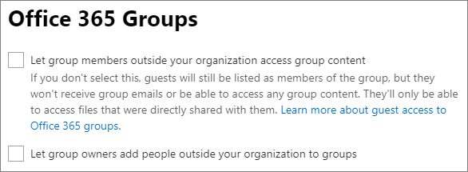
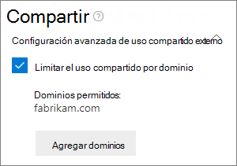
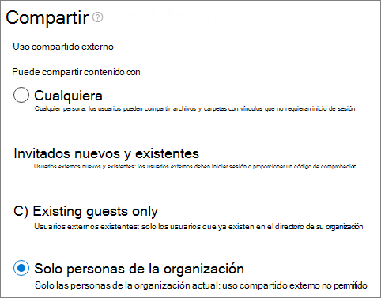

# <a name="limit-sharing-in-microsoft-365"></a><span data-ttu-id="8dcc9-103">Limitar el uso compartido en Microsoft 365</span><span class="sxs-lookup"><span data-stu-id="8dcc9-103">Limit sharing in Microsoft 365</span></span>

<span data-ttu-id="8dcc9-104">Aunque no puede deshabilitar el uso compartido interno por completo ni quitar el botón Compartir de los sitios, hay varias maneras en las que puede limitar el uso compartido de Microsoft 365 para satisfacer las necesidades de la organización.</span><span class="sxs-lookup"><span data-stu-id="8dcc9-104">While you can't disable internal sharing entirely or remove the Share button from sites, there are a variety of ways that you can limit sharing in Microsoft 365 to meet the needs of your organization.</span></span>

<span data-ttu-id="8dcc9-105">Los métodos para compartir archivos se muestran en la tabla siguiente.</span><span class="sxs-lookup"><span data-stu-id="8dcc9-105">The methods of sharing files are listed in the table below.</span></span> <span data-ttu-id="8dcc9-106">Haga clic en el vínculo de la columna **Método de uso compartido** para obtener información detallada.</span><span class="sxs-lookup"><span data-stu-id="8dcc9-106">Click the link in the **Sharing method** column for detailed information.</span></span>

|<span data-ttu-id="8dcc9-107">Método de uso compartido</span><span class="sxs-lookup"><span data-stu-id="8dcc9-107">Sharing method</span></span>|<span data-ttu-id="8dcc9-108">Descripción</span><span class="sxs-lookup"><span data-stu-id="8dcc9-108">Description</span></span>|<span data-ttu-id="8dcc9-109">Opciones de limitación</span><span class="sxs-lookup"><span data-stu-id="8dcc9-109">Limiting options</span></span>|
|:-------------|:----------|:-------------|
|[<span data-ttu-id="8dcc9-110">Grupo o equipo de Microsoft 365</span><span class="sxs-lookup"><span data-stu-id="8dcc9-110">Microsoft 365 group or team</span></span>](#microsoft-365-group-or-team)|<span data-ttu-id="8dcc9-111">Los usuarios a los que se les ha concedido acceso a un equipo de Microsoft Teams o a un grupo de Microsoft 365 pueden editar el acceso a los archivos del sitio de SharePoint asociado.</span><span class="sxs-lookup"><span data-stu-id="8dcc9-111">People granted access to a Microsoft Teams team or Microsoft 365 group have edit access to files in the associated SharePoint site.</span></span>|<span data-ttu-id="8dcc9-112">Si el grupo o equipo es privado, las invitaciones de uso compartido para unirse al equipo se envían al propietario del sitio para su aprobación.</span><span class="sxs-lookup"><span data-stu-id="8dcc9-112">If the group or team is private, sharing invitations to join the team go to the owner for approval.</span></span> <span data-ttu-id="8dcc9-113">Los administradores pueden deshabilitar el acceso de invitados o usar etiquetas de confidencialidad para impedir el acceso a personas externas a la organización.</span><span class="sxs-lookup"><span data-stu-id="8dcc9-113">Admins can disable guest access or use sensitivity labels to prevent access by people from outside the organization.</span></span>|
|[<span data-ttu-id="8dcc9-114">Sitio de SharePoint</span><span class="sxs-lookup"><span data-stu-id="8dcc9-114">SharePoint site</span></span>](#sharepoint-site)|<span data-ttu-id="8dcc9-115">A los usuarios se pueden conceder el acceso de propietario, miembro o visitante a un sitio de SharePoint y tendrán ese nivel de acceso a los archivos del sitio.</span><span class="sxs-lookup"><span data-stu-id="8dcc9-115">People can be granted Owner, Member, or Visitor access to a SharePoint site and will have that level of access to files in the site.</span></span>|<span data-ttu-id="8dcc9-116">Los permisos del sitio se pueden restringir para que solo sus propietarios puedan compartirlo.</span><span class="sxs-lookup"><span data-stu-id="8dcc9-116">Site permissions can be restricted so that only site owners can share the site.</span></span> <span data-ttu-id="8dcc9-117">Los administradores pueden configurar un sitio para que sea de solo lectura o bloquear el acceso por completo.</span><span class="sxs-lookup"><span data-stu-id="8dcc9-117">Admins can set a site to read-only or block access entirely.</span></span>|
|[<span data-ttu-id="8dcc9-118">Compartir con usuarios específicos</span><span class="sxs-lookup"><span data-stu-id="8dcc9-118">Sharing with specific people</span></span>](#sharing-with-specific-people)|<span data-ttu-id="8dcc9-119">Los miembros del sitio y los usuarios con permisos de edición pueden conceder permisos directos a archivos y carpetas, o compartirlos con vínculos de *Usuarios específicos*.</span><span class="sxs-lookup"><span data-stu-id="8dcc9-119">Site members and people with edit permissions can give direct permissions to files and folders or share them by using *Specific people* links.</span></span>|<span data-ttu-id="8dcc9-120">Los permisos del sitio se pueden restringir para que solo los propietarios del sitio puedan compartir archivos y carpetas.</span><span class="sxs-lookup"><span data-stu-id="8dcc9-120">Site permissions can be restricted so that only site owners can share files and folders.</span></span> <span data-ttu-id="8dcc9-121">En este caso, el acceso directo y el uso compartido del vínculo de *Usuarios específicos* por miembros del sitio se envían al propietario para su aprobación.</span><span class="sxs-lookup"><span data-stu-id="8dcc9-121">In this case, direct access and *Specific people* link sharing by site members goes to site owner for approval.</span></span>|
|[<span data-ttu-id="8dcc9-122">Compartir invitados de SharePoint y OneDrive</span><span class="sxs-lookup"><span data-stu-id="8dcc9-122">SharePoint and OneDrive guest sharing</span></span>](#sharepoint-guest-sharing)|<span data-ttu-id="8dcc9-123">Los propietarios y miembros de sitios de SharePoint y los propietarios de OneDrive pueden compartir archivos y carpetas con personas ajenas a la organización.</span><span class="sxs-lookup"><span data-stu-id="8dcc9-123">SharePoint site owners and members and OneDrive owners can share files and folders with people outside the organization.</span></span>|<span data-ttu-id="8dcc9-124">El uso compartido de invitados se puede deshabilitar para toda la organización o para sitios individuales.</span><span class="sxs-lookup"><span data-stu-id="8dcc9-124">Guest sharing can be disabled for the entire organization or for individual sites.</span></span>|
|[<span data-ttu-id="8dcc9-125">Vínculos de uso compartido de *Personas de su organización*</span><span class="sxs-lookup"><span data-stu-id="8dcc9-125">*People in your organization* sharing links</span></span>](#people-in-your-organization-sharing-links)|<span data-ttu-id="8dcc9-126">Los propietarios y miembros del sitio de SharePoint pueden compartir archivos con vínculos de *Personas de su organización*, que funcionarán para cualquier persona dentro de la organización.</span><span class="sxs-lookup"><span data-stu-id="8dcc9-126">SharePoint site owners and members can share files using *People in your organization* links, which will work for anyone inside the organization.</span></span>|<span data-ttu-id="8dcc9-127">Los vínculos de *Personas de su organización* se pueden deshabilitar en el nivel de sitio.</span><span class="sxs-lookup"><span data-stu-id="8dcc9-127">*People in your organization* links can be disabled at the site level.</span></span>|
|[<span data-ttu-id="8dcc9-128">Crear sitios, grupos y equipos</span><span class="sxs-lookup"><span data-stu-id="8dcc9-128">Create sites, groups, and teams</span></span>](#create-sites-groups-and-teams)|<span data-ttu-id="8dcc9-129">De forma predeterminada, los usuarios pueden crear nuevos sitios, grupos y equipos desde los que pueden compartir contenido.</span><span class="sxs-lookup"><span data-stu-id="8dcc9-129">By default, users can create new sites, groups, and teams from which they can share content.</span></span>|<span data-ttu-id="8dcc9-130">Los administradores pueden restringir quién puede crear sitios, grupos y equipos.</span><span class="sxs-lookup"><span data-stu-id="8dcc9-130">Admins can restrict who can create sites, groups, and teams.</span></span>|
|[<span data-ttu-id="8dcc9-131">Correo electrónico</span><span class="sxs-lookup"><span data-stu-id="8dcc9-131">Email</span></span>](#email)|<span data-ttu-id="8dcc9-132">Los usuarios que tengan acceso a un archivo pueden enviárselo a otros usuarios por correo electrónico.</span><span class="sxs-lookup"><span data-stu-id="8dcc9-132">People with access to a file can send it to others via email.</span></span>|<span data-ttu-id="8dcc9-133">Los administradores pueden cifrar archivos con las etiquetas de confidencialidad para evitar que se compartan con usuarios no autorizados.</span><span class="sxs-lookup"><span data-stu-id="8dcc9-133">Admins can encrypt files by using sensitivity labels to prevent them being shared with unauthorized people.</span></span>|
|[<span data-ttu-id="8dcc9-134">Descargar o copiar archivos</span><span class="sxs-lookup"><span data-stu-id="8dcc9-134">Download or file copy</span></span>](#download-or-file-copy)|<span data-ttu-id="8dcc9-135">Los usuarios que tienen acceso a un archivo pueden descargarlo o copiarlo y compartirlo con otros usuarios externos al ámbito de Microsoft 365.</span><span class="sxs-lookup"><span data-stu-id="8dcc9-135">People with access to a file can download or copy it and share it with others outside the scope of Microsoft 365.</span></span>|<span data-ttu-id="8dcc9-136">Los administradores pueden cifrar archivos con las etiquetas de confidencialidad para evitar que se compartan con usuarios no autorizados.</span><span class="sxs-lookup"><span data-stu-id="8dcc9-136">Admins can encrypt files by using sensitivity labels to prevent them being shared with unauthorized people.</span></span>|

<span data-ttu-id="8dcc9-137">También puede restringir las condiciones en las que los usuarios acceden al contenido compartido.</span><span class="sxs-lookup"><span data-stu-id="8dcc9-137">You can also restrict the conditions under which people access shared content.</span></span> <span data-ttu-id="8dcc9-138">Vea el [acceso condicional](#conditional-access) más adelante en este artículo para más información.</span><span class="sxs-lookup"><span data-stu-id="8dcc9-138">See [conditional access](#conditional-access) later in this article for more information.</span></span>

<span data-ttu-id="8dcc9-139">Aunque puede usar los controles de administración descritos en este artículo para limitar el uso compartido en su organización, le recomendamos que considere usar las características de seguridad y cumplimiento disponibles en Microsoft 365 para crear un entorno de uso compartido seguro.</span><span class="sxs-lookup"><span data-stu-id="8dcc9-139">While you can use the admin controls described in this article to limit sharing in your organization, we highly recommend that you consider using the security and compliance features available in Microsoft 365 to create a secure sharing environment.</span></span> <span data-ttu-id="8dcc9-140">Consulte [Colaboración de archivos en SharePoint con Microsoft 365](/sharepoint/deploy-file-collaboration) y [Configurar un equipo con aislamiento de seguridad](secure-teams-security-isolation.md) para más información.</span><span class="sxs-lookup"><span data-stu-id="8dcc9-140">See [File collaboration in SharePoint with Microsoft 365](/sharepoint/deploy-file-collaboration) and [Configure a team with security isolation](secure-teams-security-isolation.md) for information.</span></span>

<span data-ttu-id="8dcc9-141">Para comprender cómo se usa el uso compartido en su organización, [ejecute un informe sobre el uso compartido de archivos y carpetas](/sharepoint/sharing-reports).</span><span class="sxs-lookup"><span data-stu-id="8dcc9-141">To understand how sharing is being used in your organization, [run a report on file and folder sharing](/sharepoint/sharing-reports).</span></span>

## <a name="microsoft-365-group-or-team"></a><span data-ttu-id="8dcc9-142">Grupo o equipo de Microsoft 365</span><span class="sxs-lookup"><span data-stu-id="8dcc9-142">Microsoft 365 group or team</span></span>

<span data-ttu-id="8dcc9-143">Si quiere limitar el uso compartido en un grupo de Microsoft 365 o un equipo de Microsoft Teams, es importante que el grupo o equipo sea privado.</span><span class="sxs-lookup"><span data-stu-id="8dcc9-143">If you want to limit sharing in a Microsoft 365 group or Microsoft Teams team, it's important to make the group or team private.</span></span> <span data-ttu-id="8dcc9-144">Los usuarios dentro de su organización pueden unirse a un equipo o grupo público en cualquier momento.</span><span class="sxs-lookup"><span data-stu-id="8dcc9-144">People inside your organization can join a public group or team anytime.</span></span> <span data-ttu-id="8dcc9-145">Si el grupo o equipo no es privado, no hay ninguna forma de limitar el uso compartido del equipo o de sus archivos en la organización.</span><span class="sxs-lookup"><span data-stu-id="8dcc9-145">Unless the group or team is private, there's no way to limit sharing of the team or its files within the organization.</span></span>

### <a name="guest-sharing"></a><span data-ttu-id="8dcc9-146">Uso compartido de invitados</span><span class="sxs-lookup"><span data-stu-id="8dcc9-146">Guest sharing</span></span>

<span data-ttu-id="8dcc9-147">Si quiere evitar el acceso de invitados en Teams, puede desactivar el uso compartido de invitados en el centro de administración de Teams.</span><span class="sxs-lookup"><span data-stu-id="8dcc9-147">If you want to prevent guest access in Teams, you can turn off guest sharing in the Teams admin center.</span></span>

<span data-ttu-id="8dcc9-148">Para desactivar el uso compartido de invitados en Teams</span><span class="sxs-lookup"><span data-stu-id="8dcc9-148">To turn off guest sharing for Teams</span></span>
1. <span data-ttu-id="8dcc9-149">En el centro de administración de Teams, expanda **Configuración de toda la organización** y, después, haga clic en **Acceso de invitado**.</span><span class="sxs-lookup"><span data-stu-id="8dcc9-149">In the Teams admin center, expand **Org-wide settings**, and then click **Guest access**.</span></span>
2. <span data-ttu-id="8dcc9-150">Desactive **Permitir el acceso de invitado en Teams**.</span><span class="sxs-lookup"><span data-stu-id="8dcc9-150">Turn off **Allow guest access in Teams**.</span></span>
3. <span data-ttu-id="8dcc9-151">Haga clic en **Guardar**.</span><span class="sxs-lookup"><span data-stu-id="8dcc9-151">Click **Save**.</span></span>

<span data-ttu-id="8dcc9-152">Si quiere evitar el acceso de invitado en los Grupos de Microsoft 365, puede desactivar la configuración del acceso de invitado de los grupos en el Centro de administración de Microsoft 365.</span><span class="sxs-lookup"><span data-stu-id="8dcc9-152">If you want to prevent guest access in Microsoft 365 Groups, you can turn off the groups guest access settings in the Microsoft 365 admin center.</span></span>

<span data-ttu-id="8dcc9-153">Para desactivar el uso compartido de invitados en los grupos de Microsoft 365</span><span class="sxs-lookup"><span data-stu-id="8dcc9-153">To turn off guest sharing in Microsoft 365 Groups</span></span>
1. <span data-ttu-id="8dcc9-154">En el Centro de administración de Microsoft 365, haga clic en **Configuración** y después haga clic en **Configuración de la organización**.</span><span class="sxs-lookup"><span data-stu-id="8dcc9-154">In the Microsoft 365 admin center, click **Settings**, and then click **Org Settings**.</span></span>
2. <span data-ttu-id="8dcc9-155">En la pestaña **Servicios**, haga clic en **Grupos de Microsoft 365**.</span><span class="sxs-lookup"><span data-stu-id="8dcc9-155">On the **Services** tab, click **Microsoft 365 Groups**.</span></span>
3. <span data-ttu-id="8dcc9-156">Desactive las casillas **Permitir que los miembros del grupo de fuera de la organización tengan acceso al contenido del grupo** y **Permitir que los propietarios de grupos agreguen a usuarios ajenos a la organización a los grupos**.</span><span class="sxs-lookup"><span data-stu-id="8dcc9-156">Clear the **Let group members outside your organization access group content** and **Let group owners add people outside your organization to groups** check boxes.</span></span>
4. <span data-ttu-id="8dcc9-157">Haga clic en **Guardar cambios**.</span><span class="sxs-lookup"><span data-stu-id="8dcc9-157">Click **Save changes**.</span></span>

    

> [!NOTE]
> <span data-ttu-id="8dcc9-159">Si quiere evitar que los invitados compartan información para un grupo o equipo en particular, puede hacerlo usando [Microsoft PowerShell](per-group-guest-access.md) o [etiquetas de confidencialidad](../compliance/sensitivity-labels-teams-groups-sites.md).</span><span class="sxs-lookup"><span data-stu-id="8dcc9-159">If you want to prevent guest sharing for a particular group or team, you can do so by using [Microsoft PowerShell](per-group-guest-access.md) or [sensitivity labels](../compliance/sensitivity-labels-teams-groups-sites.md).</span></span>

<span data-ttu-id="8dcc9-160">Puede limitar el uso compartido de invitados a usuarios de dominios específicos al permitir o bloquear dominios en Azure Active Directory.</span><span class="sxs-lookup"><span data-stu-id="8dcc9-160">You can limit guest sharing to users from specific domains by allowing or blocking domains in Azure Active Directory.</span></span> <span data-ttu-id="8dcc9-161">Esto también afecta al uso compartido de invitados en SharePoint si ha habilitado la [integración de SharePoint y OneDrive con Azure AD B2B](/sharepoint/sharepoint-azureb2b-integration-preview).</span><span class="sxs-lookup"><span data-stu-id="8dcc9-161">This will also affect guest sharing in SharePoint if you have enabled [SharePoint and OneDrive integration with Azure AD B2B](/sharepoint/sharepoint-azureb2b-integration-preview).</span></span>

<span data-ttu-id="8dcc9-162">Para permitir las invitaciones de uso compartido solo de dominios específicos</span><span class="sxs-lookup"><span data-stu-id="8dcc9-162">To allow sharing invitations only from specified domains</span></span>
1. <span data-ttu-id="8dcc9-163">En la página Información general de Azure Active Directory, haga clic en **Relaciones de la organización**.</span><span class="sxs-lookup"><span data-stu-id="8dcc9-163">In Azure Active Directory, on the Overview page, click **Organizational relationships**.</span></span>
2. <span data-ttu-id="8dcc9-164">Haga clic en **Configuración**.</span><span class="sxs-lookup"><span data-stu-id="8dcc9-164">Click **Settings**.</span></span>
3. <span data-ttu-id="8dcc9-165">En **Restricciones de colaboración**, seleccione **Denegar las invitaciones a los dominios especificados** o **Permitir solo invitaciones a los dominios especificados** y, después, escriba los dominios que quiera usar.</span><span class="sxs-lookup"><span data-stu-id="8dcc9-165">Under **Collaboration restrictions**, select **Deny invitations to the specified domains** or **Allow invitations only to the specified domains**, and then type the domains that you want to use.</span></span>
4. <span data-ttu-id="8dcc9-166">Haga clic en **Guardar**.</span><span class="sxs-lookup"><span data-stu-id="8dcc9-166">Click **Save**.</span></span>

    

## <a name="sharepoint-site"></a><span data-ttu-id="8dcc9-168">Sitio de SharePoint</span><span class="sxs-lookup"><span data-stu-id="8dcc9-168">SharePoint site</span></span>

<span data-ttu-id="8dcc9-169">Puede limitar el uso compartido de sitios de SharePoint solo a los propietarios del sitio.</span><span class="sxs-lookup"><span data-stu-id="8dcc9-169">You can limit SharePoint site sharing to site owners only.</span></span> <span data-ttu-id="8dcc9-170">Esto impide que los miembros del sitio lo compartan.</span><span class="sxs-lookup"><span data-stu-id="8dcc9-170">This prevents site members from sharing the site.</span></span> <span data-ttu-id="8dcc9-171">Tenga en cuenta que si el sitio está conectado a un grupo de Microsoft 365, sus miembros pueden invitar a otros usuarios al grupo, lo que les dará acceso al sitio.</span><span class="sxs-lookup"><span data-stu-id="8dcc9-171">Keep in mind that if the site is connected to a Microsoft 365 group, group members can invite others to the group and those users will have site access.</span></span>

<span data-ttu-id="8dcc9-172">Para limitar el uso compartido de sitios a los propietarios</span><span class="sxs-lookup"><span data-stu-id="8dcc9-172">To limit site sharing to owners</span></span>
1. <span data-ttu-id="8dcc9-173">En el sitio, haga clic en el icono de engranaje y, después, haga clic en **Permisos del sitio**.</span><span class="sxs-lookup"><span data-stu-id="8dcc9-173">In the site, click the gear icon, and then click **Site permissions**.</span></span>
2. <span data-ttu-id="8dcc9-174">En **Configuración de uso compartido**, haga clic en **Cambiar configuración de uso compartido**.</span><span class="sxs-lookup"><span data-stu-id="8dcc9-174">Under **Sharing settings**, click **Change sharing settings**.</span></span>
3. <span data-ttu-id="8dcc9-175">Seleccione **Los propietarios y miembros del sitio, y las personas con permisos de edición pueden compartir archivos y carpetas, pero solo los propietarios de sitios pueden compartir el sitio**.</span><span class="sxs-lookup"><span data-stu-id="8dcc9-175">Select **Site owners and members, and people with Edit permissions can share files and folders, but only site owners can share the site**.</span></span>
4. <span data-ttu-id="8dcc9-176">Haga clic en **Guardar**.</span><span class="sxs-lookup"><span data-stu-id="8dcc9-176">Click **Save**.</span></span>

    

<span data-ttu-id="8dcc9-178">Puede desactivar las solicitudes de acceso para impedir que los usuarios que no sean miembros del sitio lo soliciten.</span><span class="sxs-lookup"><span data-stu-id="8dcc9-178">You can prevent users who are not members of the site from requesting access by turning off access requests.</span></span>

<span data-ttu-id="8dcc9-179">Para desactivar las solicitudes de acceso</span><span class="sxs-lookup"><span data-stu-id="8dcc9-179">To turn off access requests</span></span>
1. <span data-ttu-id="8dcc9-180">En el sitio, haga clic en el icono de engranaje y, después, haga clic en **Permisos del sitio**.</span><span class="sxs-lookup"><span data-stu-id="8dcc9-180">In the site, click the gear icon, and then click **Site permissions**.</span></span>
2. <span data-ttu-id="8dcc9-181">En **Configuración de uso compartido**, haga clic en **Cambiar configuración de uso compartido**.</span><span class="sxs-lookup"><span data-stu-id="8dcc9-181">Under **Sharing settings**, click **Change sharing settings**.</span></span>
3. <span data-ttu-id="8dcc9-182">Desactive **Permitir solicitudes de acceso** y, después, haga clic en **Guardar**.</span><span class="sxs-lookup"><span data-stu-id="8dcc9-182">Turn off **Allow access requests**, and then click **Save**.</span></span>

<span data-ttu-id="8dcc9-183">Puede limitar el uso compartido de sitios a dominios específicos al permitirlos o bloquearlos.</span><span class="sxs-lookup"><span data-stu-id="8dcc9-183">You can limit site sharing to specific domains by allowing or blocking domains for the site.</span></span>

<span data-ttu-id="8dcc9-184">Para limitar el uso compartido del sitio por dominio</span><span class="sxs-lookup"><span data-stu-id="8dcc9-184">To limit site sharing by domain</span></span>
1. <span data-ttu-id="8dcc9-185">En el Centro de administración de SharePoint, en **Sitios**, haga clic en **Sitios activos**.</span><span class="sxs-lookup"><span data-stu-id="8dcc9-185">In the SharePoint admin center, under **Sites**, click **Active sites**.</span></span>
2. <span data-ttu-id="8dcc9-186">Haga clic en el sitio que quiere configurar.</span><span class="sxs-lookup"><span data-stu-id="8dcc9-186">Click the site that you want to configure.</span></span>
3. <span data-ttu-id="8dcc9-187">En **Uso compartido externo** de la pestaña **Directivas**, haga clic en **Editar**.</span><span class="sxs-lookup"><span data-stu-id="8dcc9-187">On the **Policies** tab, under **External sharing** click **Edit**.</span></span>
4. <span data-ttu-id="8dcc9-188">En **Configuración avanzada para uso compartido externo**, seleccione **Limitar uso compartido por dominio**.</span><span class="sxs-lookup"><span data-stu-id="8dcc9-188">Under **Advanced settings for external sharing**, select the **Limit sharing by domain**.</span></span>
5. <span data-ttu-id="8dcc9-189">Agregue los dominios que quiera permitir o bloquear y, después, haga clic en **Guardar**.</span><span class="sxs-lookup"><span data-stu-id="8dcc9-189">Add the domains that you want to allow or block, and then click **Save**.</span></span>
6. <span data-ttu-id="8dcc9-190">Haga clic en **Guardar**.</span><span class="sxs-lookup"><span data-stu-id="8dcc9-190">Click **Save**.</span></span>

    

### <a name="block-access-to-a-site"></a><span data-ttu-id="8dcc9-192">Bloquear el acceso a un sitio</span><span class="sxs-lookup"><span data-stu-id="8dcc9-192">Block access to a site</span></span>

<span data-ttu-id="8dcc9-193">Puede bloquear el acceso a un sitio o hacer que un sitio sea de solo lectura cambiando el estado de bloqueo del sitio.</span><span class="sxs-lookup"><span data-stu-id="8dcc9-193">You can block access to a site or make a site read-only by changing the lock state of the site.</span></span> <span data-ttu-id="8dcc9-194">Para más información, consulte [Bloquear y desbloquear sitios](/sharepoint/manage-lock-status).</span><span class="sxs-lookup"><span data-stu-id="8dcc9-194">For details, see [Lock and unlock sites](/sharepoint/manage-lock-status).</span></span>

### <a name="permissions-inheritance"></a><span data-ttu-id="8dcc9-195">Herencia de permisos</span><span class="sxs-lookup"><span data-stu-id="8dcc9-195">Permissions inheritance</span></span>

<span data-ttu-id="8dcc9-196">Aunque no se recomienda, puede usar [Herencia de permisos de SharePoint](/sharepoint/what-is-permissions-inheritance) para personalizar los niveles de acceso a los sitios y subsitios.</span><span class="sxs-lookup"><span data-stu-id="8dcc9-196">While not recommended, you can use [SharePoint permissions inheritance](/sharepoint/what-is-permissions-inheritance) to customize access levels to sites and subsites.</span></span>

## <a name="sharing-with-specific-people"></a><span data-ttu-id="8dcc9-197">Compartir con usuarios específicos</span><span class="sxs-lookup"><span data-stu-id="8dcc9-197">Sharing with specific people</span></span>

<span data-ttu-id="8dcc9-198">Si quiere limitar el uso compartido de un sitio o de su contenido, puede configurarlo para que solo los propietarios puedan compartir archivos, carpetas y el sitio.</span><span class="sxs-lookup"><span data-stu-id="8dcc9-198">if you want to limit the sharing of a site or its contents, you can configure the site to only allow site owners to share files, folders, and the site.</span></span> <span data-ttu-id="8dcc9-199">Cuando se configura, los intentos de los miembros del sitio para compartir archivos o carpetas con vínculos de *Usuarios específicos* se envían al propietario del sitio para su aprobación.</span><span class="sxs-lookup"><span data-stu-id="8dcc9-199">When this is configured, site members' attempts to share files or folders by using *Specific people* links will go to the site owner for approval.</span></span>

<span data-ttu-id="8dcc9-200">Para limitar el uso compartido de sitios, archivos y carpetas a los propietarios</span><span class="sxs-lookup"><span data-stu-id="8dcc9-200">To limit site, file, and folder sharing to owners</span></span>
1. <span data-ttu-id="8dcc9-201">En el sitio, haga clic en el icono de engranaje y, después, haga clic en **Permisos del sitio**.</span><span class="sxs-lookup"><span data-stu-id="8dcc9-201">In the site, click the gear icon, and then click **Site permissions**.</span></span>
2. <span data-ttu-id="8dcc9-202">En **Configuración de uso compartido**, haga clic en **Cambiar configuración de uso compartido**.</span><span class="sxs-lookup"><span data-stu-id="8dcc9-202">Under **Sharing settings**, click **Change sharing settings**.</span></span>
3. <span data-ttu-id="8dcc9-203">Seleccione **Solo los propietarios del sitio pueden compartir archivos, carpetas y el sitio**.</span><span class="sxs-lookup"><span data-stu-id="8dcc9-203">Select **Only site owners can share files, folders, and the site**.</span></span>
4. <span data-ttu-id="8dcc9-204">Haga clic en **Guardar**.</span><span class="sxs-lookup"><span data-stu-id="8dcc9-204">Click **Save**.</span></span>

    

## <a name="sharepoint-guest-sharing"></a><span data-ttu-id="8dcc9-206">Uso compartido de invitados de SharePoint</span><span class="sxs-lookup"><span data-stu-id="8dcc9-206">SharePoint guest sharing</span></span>

<span data-ttu-id="8dcc9-207">Si quiere evitar el uso compartido de archivos y carpetas de SharePoint o OneDrive con usuarios externos a la organización, puede desactivar el uso compartido de invitados para toda la organización o para un sitio individual.</span><span class="sxs-lookup"><span data-stu-id="8dcc9-207">If you want to prevent sharing SharePoint or OneDrive files and folders with people outside your organization, you can turn off guest sharing for the entire organization or for an individual site.</span></span>

<span data-ttu-id="8dcc9-208">Para desactivar el uso compartido de invitados de SharePoint en su organización</span><span class="sxs-lookup"><span data-stu-id="8dcc9-208">To turn off SharePoint guest sharing for your organization</span></span>
1. <span data-ttu-id="8dcc9-209">En el Centro de administración de SharePoint, en **Directivas**, haga clic en **Uso compartido**.</span><span class="sxs-lookup"><span data-stu-id="8dcc9-209">In the SharePoint admin center, under **Policies**, click **Sharing**.</span></span>
2. <span data-ttu-id="8dcc9-210">En **Uso compartido externo**, arrastre el control deslizante de SharePoint hacia abajo hasta **Solo los usuarios de la organización**.</span><span class="sxs-lookup"><span data-stu-id="8dcc9-210">Under **External sharing**, drag the SharePoint slider down to **Only people in your organization**.</span></span>
3. <span data-ttu-id="8dcc9-211">Haga clic en **Guardar**.</span><span class="sxs-lookup"><span data-stu-id="8dcc9-211">Click **Save**.</span></span>

    


<span data-ttu-id="8dcc9-213">Para desactivar el uso compartido de invitados en un sitio</span><span class="sxs-lookup"><span data-stu-id="8dcc9-213">To turn off guest sharing for a site</span></span>
1. <span data-ttu-id="8dcc9-214">En el Centro de administración de SharePoint, en **Sitios**, haga clic en **Sitios activos**.</span><span class="sxs-lookup"><span data-stu-id="8dcc9-214">In the SharePoint admin center, under **Sites**, click **Active sites**.</span></span>
2. <span data-ttu-id="8dcc9-215">Haga clic en el sitio que quiere configurar.</span><span class="sxs-lookup"><span data-stu-id="8dcc9-215">Click the site that you want to configure.</span></span>
3. <span data-ttu-id="8dcc9-216">En **Uso compartido externo** de la pestaña **Directivas**, haga clic en **Editar**.</span><span class="sxs-lookup"><span data-stu-id="8dcc9-216">On the **Policies** tab, under **External sharing** click **Edit**.</span></span>
4. <span data-ttu-id="8dcc9-217">En **Uso compartido externo**, elija **Solo los usuarios de la organización** y, después, haga clic en **Guardar**.</span><span class="sxs-lookup"><span data-stu-id="8dcc9-217">Under **External sharing**, choose **Only people in your organization**, and then click **Save**.</span></span>

    

<span data-ttu-id="8dcc9-219">Puede desactivar el uso compartido de invitados para un OneDrive individual haciendo clic en el usuario en el Centro de administración de Microsoft 365 y seleccionando **Gestionar el uso compartido externo en la** pestaña e **OneDrive**.</span><span class="sxs-lookup"><span data-stu-id="8dcc9-219">You can turn off guest sharing for an individual OneDrive by clicking the user in the Microsoft 365 admin center and selecting **Manage external sharing** on the **OneDrive** tab.</span></span>

<span data-ttu-id="8dcc9-220">Si quiere permitir el uso compartido con personas externas a la organización, pero quiere asegurarse de que todos los usuarios se autentican, puede deshabilitar los vínculos de tipo *Cualquiera* (uso compartido anónimo) para toda la organización o para un sitio individual.</span><span class="sxs-lookup"><span data-stu-id="8dcc9-220">If you would like to allow sharing with people outside your organization but you want to make sure that everyone authenticates, you can disable *Anyone* (anonymous sharing) links for the entire organization or for an individual site.</span></span>

<span data-ttu-id="8dcc9-221">Para desactivar los vínculos de tipo *Cualquiera* en el nivel de organización</span><span class="sxs-lookup"><span data-stu-id="8dcc9-221">To turn off *Anyone* links at the organization level</span></span>
1. <span data-ttu-id="8dcc9-222">En el Centro de administración de SharePoint, en **Directivas**, haga clic en **Uso compartido**.</span><span class="sxs-lookup"><span data-stu-id="8dcc9-222">In the SharePoint admin center, under **Policies**, click **Sharing**.</span></span>
2. <span data-ttu-id="8dcc9-223">En **Uso compartido externo**, arrastre el control deslizante de SharePoint hacia abajo hasta **Invitados nuevos y existentes**.</span><span class="sxs-lookup"><span data-stu-id="8dcc9-223">Under **External sharing**, drag the SharePoint slider down to **New and existing guests**.</span></span>
3. <span data-ttu-id="8dcc9-224">Haga clic en **Guardar**.</span><span class="sxs-lookup"><span data-stu-id="8dcc9-224">Click **Save**.</span></span>

    

<span data-ttu-id="8dcc9-226">Desactivar los vínculos de tipo *Cualquiera*</span><span class="sxs-lookup"><span data-stu-id="8dcc9-226">To turn off *Anyone* links for a site</span></span>
1. <span data-ttu-id="8dcc9-227">En el Centro de administración de SharePoint, en **Sitios**, haga clic en **Sitios activos**.</span><span class="sxs-lookup"><span data-stu-id="8dcc9-227">In the SharePoint admin center, under **Sites**, click **Active sites**.</span></span>
2. <span data-ttu-id="8dcc9-228">Haga clic en el sitio que quiere configurar.</span><span class="sxs-lookup"><span data-stu-id="8dcc9-228">Click the site that you want to configure.</span></span>
3. <span data-ttu-id="8dcc9-229">En **Uso compartido externo** de la pestaña **Directivas**, haga clic en **Editar**.</span><span class="sxs-lookup"><span data-stu-id="8dcc9-229">On the **Policies** tab, under **External sharing** click **Edit**.</span></span>
4. <span data-ttu-id="8dcc9-230">En **Uso compartido externo**, elija **Invitados nuevos y existentes** y, después, haga clic en **Guardar**.</span><span class="sxs-lookup"><span data-stu-id="8dcc9-230">Under **External sharing**, choose **New and existing guests**, and then click **Save**.</span></span>

    

## <a name="people-in-your-organization-sharing-links"></a><span data-ttu-id="8dcc9-232">Vínculos de uso compartido de *Personas de su organización*</span><span class="sxs-lookup"><span data-stu-id="8dcc9-232">*People in your organization* sharing links</span></span>

<span data-ttu-id="8dcc9-233">De forma predeterminada, los miembros de un sitio pueden compartir archivos y carpetas con otras personas de su organización con un vínculo de *Personas de su organización*.</span><span class="sxs-lookup"><span data-stu-id="8dcc9-233">By default, members of a site can share files and folders with other people in your organization by using a *People in your organization* link.</span></span> <span data-ttu-id="8dcc9-234">Puede deshabilitar los vínculos de *Personas de su organización* con PowerShell:</span><span class="sxs-lookup"><span data-stu-id="8dcc9-234">You can disable *People in your organization* links by using PowerShell:</span></span>

```powershell
Set-SPOSite -Identity <site> -DisableCompanyWideSharingLinks
```

<span data-ttu-id="8dcc9-235">Por ejemplo:</span><span class="sxs-lookup"><span data-stu-id="8dcc9-235">For example:</span></span>

```powershell
Set-SPOSite -Identity https://contoso.sharepoint.com -DisableCompanyWideSharingLinks
```

## <a name="create-sites-groups-and-teams"></a><span data-ttu-id="8dcc9-236">Crear sitios, grupos y equipos</span><span class="sxs-lookup"><span data-stu-id="8dcc9-236">Create sites, groups, and teams</span></span>

<span data-ttu-id="8dcc9-237">De forma predeterminada, los usuarios pueden crear nuevos sitios, grupos y equipos desde los que pueden compartir contenido (según su configuración de uso compartido).</span><span class="sxs-lookup"><span data-stu-id="8dcc9-237">By default, users can create new sites, groups, and teams from which they may be able to share content (depending on your sharing settings).</span></span> <span data-ttu-id="8dcc9-238">Puede limitar quién puede crear sitios, grupos y equipos.</span><span class="sxs-lookup"><span data-stu-id="8dcc9-238">You can restrict who can create sites, groups, and teams.</span></span> <span data-ttu-id="8dcc9-239">Vea las referencias siguientes:</span><span class="sxs-lookup"><span data-stu-id="8dcc9-239">See the following references:</span></span>

- [<span data-ttu-id="8dcc9-240">Administrar la creación de un sitio de SharePoint</span><span class="sxs-lookup"><span data-stu-id="8dcc9-240">Manage site creation in SharePoint</span></span>](/sharepoint/manage-site-creation)
- [<span data-ttu-id="8dcc9-241">Administrar quién puede crear grupos de Microsoft 365</span><span class="sxs-lookup"><span data-stu-id="8dcc9-241">Manage who can create Microsoft 365 Groups</span></span>](./manage-creation-of-groups.md)

> [!NOTE]
> <span data-ttu-id="8dcc9-242">Restringir la creación de grupos restringe la creación de equipos.</span><span class="sxs-lookup"><span data-stu-id="8dcc9-242">Restricting group creation restricts team creation.</span></span>

## <a name="email"></a><span data-ttu-id="8dcc9-243">Correo electrónico</span><span class="sxs-lookup"><span data-stu-id="8dcc9-243">Email</span></span>

<span data-ttu-id="8dcc9-244">Puede evitar el uso compartido no deseado de mensajes de correo electrónico mediante el cifrado.</span><span class="sxs-lookup"><span data-stu-id="8dcc9-244">You can prevent unwanted sharing of emails by using encryption.</span></span> <span data-ttu-id="8dcc9-245">Esto impide que los mensajes de correo electrónico se reenvíen o se compartan de algún modo con usuarios no autorizados.</span><span class="sxs-lookup"><span data-stu-id="8dcc9-245">This prevents emails being forwarded or otherwise shared with unauthorized users.</span></span> <span data-ttu-id="8dcc9-246">El cifrado de correo electrónico se puede habilitar mediante etiquetas de confidencialidad.</span><span class="sxs-lookup"><span data-stu-id="8dcc9-246">Email encryption can be enabled by using sensitivity labels.</span></span> <span data-ttu-id="8dcc9-247">Para más detalles, vea [Restringir el acceso al contenido mediante el cifrado en las etiquetas de confidencialidad](../compliance/encryption-sensitivity-labels.md).</span><span class="sxs-lookup"><span data-stu-id="8dcc9-247">See [Restrict access to content by using encryption in sensitivity labels](../compliance/encryption-sensitivity-labels.md) for details.</span></span>

## <a name="download-or-file-copy"></a><span data-ttu-id="8dcc9-248">Descargar o copiar archivos</span><span class="sxs-lookup"><span data-stu-id="8dcc9-248">Download or file copy</span></span>

<span data-ttu-id="8dcc9-249">Los usuarios que tienen acceso a los archivos y carpetas de Microsoft 365 pueden descargar archivos y copiarlos en medios externos.</span><span class="sxs-lookup"><span data-stu-id="8dcc9-249">Users who have access to files and folders in Microsoft 365 can download files and copy them to external media.</span></span> <span data-ttu-id="8dcc9-250">Para reducir el riesgo del uso compartido de archivos no deseados, puede cifrar el contenido con las etiquetas de confidencialidad.</span><span class="sxs-lookup"><span data-stu-id="8dcc9-250">To reduce the risk of unwanted file sharing, you can encrypt the content by using sensitivity labels.</span></span>

## <a name="conditional-access"></a><span data-ttu-id="8dcc9-251">Acceso condicional</span><span class="sxs-lookup"><span data-stu-id="8dcc9-251">Conditional access</span></span>

<span data-ttu-id="8dcc9-252">El acceso condicional de Azure Active Directory proporciona opciones para limitar o impedir el uso compartido con personas en función de la ubicación de la red, el estado del dispositivo, el riesgo de inicio de sesión y otros factores.</span><span class="sxs-lookup"><span data-stu-id="8dcc9-252">Azure Active Directory conditional access provides options to limit or prevent sharing with people based on network location, device health, sign-in risk, and other factors.</span></span> <span data-ttu-id="8dcc9-253">Vea [¿Qué es el acceso condicional?](/azure/active-directory/conditional-access/overview)</span><span class="sxs-lookup"><span data-stu-id="8dcc9-253">See [What is Conditional Access?](/azure/active-directory/conditional-access/overview).</span></span>

<span data-ttu-id="8dcc9-p117">SharePoint proporciona integración directa con acceso condicional de Azure AD para dispositivos no administrados y la ubicación de red. Vea las referencias siguientes para obtener más información:</span><span class="sxs-lookup"><span data-stu-id="8dcc9-p117">SharePoint provides direct integration with Azure AD conditional access for both unmanaged devices and network location. See the following references for details:</span></span>

- [<span data-ttu-id="8dcc9-256">Control de acceso desde dispositivos no administrados</span><span class="sxs-lookup"><span data-stu-id="8dcc9-256">Control access from unmanaged devices</span></span>](/sharepoint/control-access-from-unmanaged-devices)
- [<span data-ttu-id="8dcc9-257">Controlar el acceso a los datos de SharePoint y OneDrive en función de la ubicación de red</span><span class="sxs-lookup"><span data-stu-id="8dcc9-257">Control access to SharePoint and OneDrive data based on network location</span></span>](/sharepoint/control-access-based-on-network-location)

## <a name="see-also"></a><span data-ttu-id="8dcc9-258">Consulte también</span><span class="sxs-lookup"><span data-stu-id="8dcc9-258">See also</span></span>

[<span data-ttu-id="8dcc9-259">Referencia de la configuración de uso compartido de invitados de Microsoft 365</span><span class="sxs-lookup"><span data-stu-id="8dcc9-259">Microsoft 365 guest sharing settings reference</span></span>](microsoft-365-guest-settings.md)