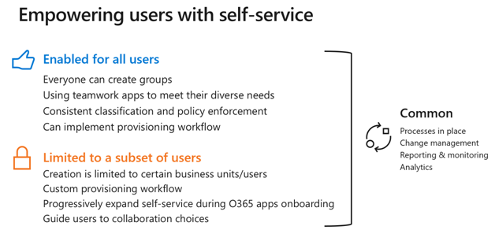

# Planear el gobierno de la organización y el ciclo de vida para los grupos de Microsoft 365 y Microsoft Teams

Microsoft 365 grupos tiene un amplio conjunto de herramientas para implementar las capacidades de gobierno que requiere su organización. 

En la siguiente sección se describen las capacidades, se recomiendan los procedimientos recomendados y se proporciona orientación para hacer las preguntas adecuadas para determinar los requisitos de gobierno y cómo cumplirlos.

## Controlar quién puede crear grupos de Microsoft 365

Los usuarios finales pueden crear grupos a partir de varios extremos, incluidos Outlook, SharePoint, Teams y otros entornos.

Se recomienda encarecidamente el autoservicio para permitir a los propietarios del grupo y ayudar a los usuarios a realizar su trabajo más fácilmente. Limitar la creación de grupos y equipos puede ralentizar la productividad de los usuarios, ya que muchos servicios de Microsoft 365 requieren la creación de grupos para que funcione el servicio.

Considere las siguientes opciones de gobierno para la creación de grupos:

- Para limitar la proliferación de grupos, use [directivas de expiración de grupos](microsoft-365-groups-expiration-policy.md) para eliminar automáticamente los grupos que no se usan.
- Limite la creación de grupos a los miembros de un grupo de [seguridad con pertenencia dinámica](https://docs.microsoft.com/azure/active-directory/users-groups-roles/groups-create-rule) que contenga, por ejemplo, todos los empleados a tiempo completo.
- Limite la creación de grupos a un grupo de seguridad y solicite a los usuarios que completen la formación en las directivas de uso de grupo de la organización para convertirse en miembros del grupo de seguridad.

Si desea limitar quién puede crear grupos, consulte [administrar quién puede crear grupos de Microsoft 365](manage-creation-of-groups.md) para obtener información sobre cómo configurarlo.

## Eliminación, restauración y archivado de grupos

Cuando se elimina un grupo de 365 de Microsoft, se conserva de forma predeterminada durante 30 días. Este período de 30 días se denomina "eliminación temporal", ya que todavía estará a tiempo de restaurar el grupo. Después de los 30 días, el grupo y el contenido asociado se eliminarán permanentemente y no se podrán restaurar.

Si tiene directivas de retención para conservar chat, archivos o correo, estos elementos se conservarán después de que se elimine el grupo. Consulte [información sobre las directivas de retención](https://docs.microsoft.com/microsoft-365/compliance/retention-policies) para obtener más información.

Si desea eliminar un grupo pero conservar el contenido de uno o varios de los servicios conectados a grupos, vea [Archive Groups, Teams, and Yammer](end-life-cycle-groups-teams-sites-yammer.md) para obtener información.

## Directiva de nomenclatura de grupos

Una directiva de nomenclatura de grupos puede ayudarle a regir los grupos de dos maneras:

- Se puede usar una directiva de nomenclatura de prefijo o sufijo para aplicar cadenas fijas o atributos de Azure AD al principio o al final de un nombre de grupo y su dirección de correo asociada. De esta forma, puede asegurarse de la inclusión, por ejemplo, de los nombres de departamento o de regiones en los nombres de grupo.
- Una directiva de palabras bloqueadas puede garantizar que determinadas palabras, como los nombres de los ejecutivos, no se usan en los nombres de grupo.

Las directivas de nomenclatura se aplican cuando los grupos se crean desde cualquiera de los servicios conectados a un grupo.

Si decide usar directivas de nomenclatura para grupos, vea [Microsoft 365 Groups naming Policy](groups-naming-policy.md).

## Directiva de expiración de grupos

Puede especificar un período de expiración y cualquier grupo que llegue al final de ese período y que no se renueve, se eliminará. El período de expiración comienza cuando se crea el grupo o en la fecha en que se renovó por última vez.

Una vez que establezca la expiración de los grupos:
- Se notifica a los propietarios del grupo que deben renovar el grupo a medida que la expiración se acerca a.
- Los grupos activos se renuevan automáticamente.
- Se elimina cualquier grupo que no se renueve.
- Los propietarios del grupo o el administrador pueden restaurar cualquier grupo que se elimine en un plazo de 30 días.

Las directivas de expiración son una buena forma de limitar la proliferación de grupos asegurándose de que se eliminan los grupos que ya no se usan. Si desea crear una directiva de expiración de grupos, consulte [Microsoft 365 Group Expiration Policy](microsoft-365-groups-expiration-policy.md).
