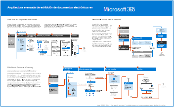
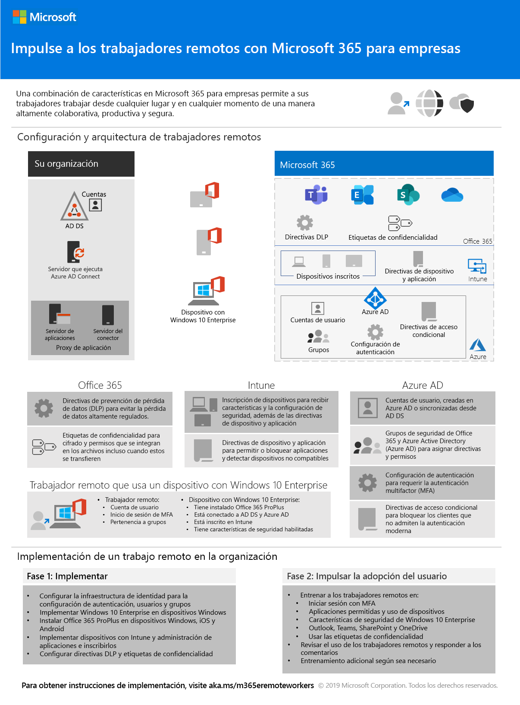

# Ilustraciones de productividad de Microsoft 365Microsoft 365 productivity illustrations

La serie de soluciones empresariales de Microsoft 365 proporciona instrucciones para implementar las capacidades de Microsoft 365, especialmente donde las capacidades se cruzan entre tecnologías, incluidos los diagramas de arquitectura de Teams.The Microsoft 365 enterprise solution series provides guidance for implementing Microsoft 365 capabilities, especially where capabilities cross technologies, including Teams architecture diagrams.

### Microsoft Teams y servicios de productividad relacionados de Microsoft 365 para arquitectos de TIMicrosoft Teams and related productivity services in Microsoft 365 for IT architects
La arquitectura lógica de los servicios de productividad en Microsoft 365, una de las más destacadas gracias a Microsoft Teams.The logical architecture of productivity services in Microsoft 365, leading with Microsoft Teams.

| ItemItem | DescripciónDescription |
|:-----|:-----|
|   [PDF](https://github.com/MicrosoftDocs/microsoft-365-docs/raw/public/microsoft-365/downloads/msft-m365-teams-logical-architecture.pdf) \| [Visio](https://github.com/MicrosoftDocs/OfficeDocs-Enterprise/raw/live/Enterprise/downloads/msft-m365-teams-logical-architecture.vsdx)[PDF](https://github.com/MicrosoftDocs/microsoft-365-docs/raw/public/microsoft-365/downloads/msft-m365-teams-logical-architecture.pdf) \| [Visio](https://github.com/MicrosoftDocs/OfficeDocs-Enterprise/raw/live/Enterprise/downloads/msft-m365-teams-logical-architecture.vsdx)   Actualizado en enero de 2021Updated January 2021   |Microsoft proporciona un conjunto de servicios de productividad que funcionan en conjunto para proporcionar experiencias de colaboración con funcionalidades de gobierno, seguridad y cumplimiento.Microsoft provides a suite of productivity services that work together to provide collaboration experiences with data governance, security, and compliance capabilities.    Esta serie de ilustraciones proporciona una vista de la arquitectura lógica de los servicios de productividad para arquitectos empresariales, que es una de las más destacadas gracias a Microsoft Teams.This series of illustrations provides a view into the logical architecture of productivity services for enterprise architects, leading with Microsoft Teams.|

### Grupos en Microsoft 365 para arquitectos de TIGroups in Microsoft 365 for IT Architects
Lo que necesitan saber los arquitectos de TI sobre los grupos en Microsoft 365What IT architects need to know about groups in Microsoft 365

| ItemItem | DescripciónDescription |
|:-----|:-----|
|   [PDF](https://github.com/MicrosoftDocs/microsoft-365-docs/raw/public/microsoft-365/downloads/msft-m365-groups.pdf) \| [Visio](https://github.com/MicrosoftDocs/OfficeDocs-Enterprise/raw/live/Enterprise/downloads/msft-m365-groups.vsdx)[PDF](https://github.com/MicrosoftDocs/microsoft-365-docs/raw/public/microsoft-365/downloads/msft-m365-groups.pdf) \| [Visio](https://github.com/MicrosoftDocs/OfficeDocs-Enterprise/raw/live/Enterprise/downloads/msft-m365-groups.vsdx)   Actualizado en mayo de 2020Updated May 2020|Estas ilustraciones detallan los diferentes tipos de grupos, cómo se crean y administran, y algunas recomendaciones para el gobierno de estos.These illustrations detail the different types of groups, how these are created and managed, and a few governance recommendations.|

### Capacidades de cumplimiento y protección de la información de Microsoft 365Microsoft 365 information protection and compliance capabilities

Microsoft 365 incluye un amplio conjunto de capacidades de protección de la información y cumplimiento.Microsoft 365 includes a broad set of information protection and compliance capabilities. Junto con las herramientas de productividad de Microsoft, estas capacidades están diseñadas para ayudar a las organizaciones a colaborar en tiempo real a la vez que se cumplen los estrictos marcos de cumplimiento normativo.Together with Microsoft’s productivity tools, these capabilities are designed to help organizations collaborate in real time while adhering to stringent regulatory compliance frameworks. 

Este conjunto de ilustraciones usa una de las industrias más reguladas, los servicios financieros, para demostrar cómo se pueden aplicar estas capacidades para cumplir los requisitos normativos comunes.This set of illustrations uses one of the most regulated industries, financial services, to demonstrate how these capabilities can be applied to address common regulatory requirements. Siéntase libre de adaptar estas ilustraciones para su propio uso.Feel free to adapt these illustrations for your own use. 

| ItemItem | DescripciónDescription |
|:-----|:-----|
|   Inglés: [Descargar como PDF](https://download.microsoft.com/download/3/a/6/3a6ab1a3-feb0-4ee2-8e77-62415a772e53/m365-compliance-illustrations.pdf)  \| [Descargar como Visio](https://download.microsoft.com/download/3/a/6/3a6ab1a3-feb0-4ee2-8e77-62415a772e53/m365-compliance-illustrations.vsdx)English: [Download as a PDF](https://download.microsoft.com/download/3/a/6/3a6ab1a3-feb0-4ee2-8e77-62415a772e53/m365-compliance-illustrations.pdf)  \| [Download as a Visio](https://download.microsoft.com/download/3/a/6/3a6ab1a3-feb0-4ee2-8e77-62415a772e53/m365-compliance-illustrations.vsdx)   Japonés: [Descargar como PDF](https://download.microsoft.com/download/6/f/1/6f1a7d0e-dd8e-442e-b073-8e94327ae4f8/m365-compliance-illustrations.pdf)  \| [Descargar como Visio](https://download.microsoft.com/download/6/f/1/6f1a7d0e-dd8e-442e-b073-8e94327ae4f8/m365-compliance-illustrations.vsdx)Japanese: [Download as a PDF](https://download.microsoft.com/download/6/f/1/6f1a7d0e-dd8e-442e-b073-8e94327ae4f8/m365-compliance-illustrations.pdf)  \| [Download as a Visio](https://download.microsoft.com/download/6/f/1/6f1a7d0e-dd8e-442e-b073-8e94327ae4f8/m365-compliance-illustrations.vsdx)   Actualizado en noviembre de 2020Updated November 2020|Incluye:Includes: <ul><li>  Protección de la información y prevención de la pérdida de datos de MicrosoftMicrosoft information protection and data loss prevention</li><li>Directivas y etiquetas de retenciónRetention policies and retention labels </li><li>Barreras de informaciónInformation barriers</li><li>Cumplimiento de comunicacionesCommunication compliance</li><li>Riesgo de InsiderInsider risk</li><li>Ingesta de datos de tercerosThird-party data ingestion</li>|

### Seguridad y protección de la información para organizaciones de varias regionesSecurity and Information Protection for Multi-Region Organizations
Seguridad y protección de la información para organizaciones de varias regiones con un único espacio empresarial de Microsoft 365Security and information protection for multi-region organizations with a single microsoft 365 tenant

| ItemItem | DescripciónDescription |
|:-----|:-----|
|   [PDF](https://github.com/MicrosoftDocs/microsoft-365-docs/raw/public/microsoft-365/downloads/msft-security-info-protect-multi-region.pdf) \| [Visio](https://github.com/MicrosoftDocs/microsoft-365-docs/raw/public/microsoft-365/downloads/msft-security-info-protect-multi-region.vsdx)[PDF](https://github.com/MicrosoftDocs/microsoft-365-docs/raw/public/microsoft-365/downloads/msft-security-info-protect-multi-region.pdf) \| [Visio](https://github.com/MicrosoftDocs/microsoft-365-docs/raw/public/microsoft-365/downloads/msft-security-info-protect-multi-region.vsdx) Actualizado en marzo de 2020Updated March 2020 |Usar un único espacio empresarial de Microsoft 365 para su organización global es la mejor opción y experiencia por muchas razones.Using a single Microsoft 365 tenant for your global organization is the best choice and experience for many reasons. Sin embargo, en muchos arquitectos luchan por cómo cumplir los objetivos de protección de la información y seguridad en distintas regiones.However, many architects wrestle with how to meet security and information protection objectives across different regions. Este conjunto de temas contiene recomendaciones.This set of topics provides recommendations. |

### Estrategia de implementación de Microsoft Defender para puntos de conexiónMicrosoft Defender for Endpoint deployment strategy

Dependiendo de su entorno, algunas herramientas son más adecuadas para determinadas arquitecturas.Depending on your environment, some tools are better suited for certain architectures.

| ItemItem | DescripciónDescription |
|:-----|:-----|
|  [PDF](https://github.com/MicrosoftDocs/windows-itpro-docs/raw/public/windows/security/threat-protection/microsoft-defender-atp/downloads/mdatp-deployment-strategy.pdf)  \| [Visio](https://github.com/MicrosoftDocs/windows-itpro-docs/raw/public/windows/security/threat-protection/microsoft-defender-atp/downloads/mdatp-deployment-strategy.vsdx)[PDF](https://github.com/MicrosoftDocs/windows-itpro-docs/raw/public/windows/security/threat-protection/microsoft-defender-atp/downloads/mdatp-deployment-strategy.pdf)  \| [Visio](https://github.com/MicrosoftDocs/windows-itpro-docs/raw/public/windows/security/threat-protection/microsoft-defender-atp/downloads/mdatp-deployment-strategy.vsdx)  Actualizado en febrero de 2020Updated February 2020| El material arquitectónico le ayuda a planear la implementación de las arquitecturas siguientes:The architectural material helps you plan your deployment for the following architectures: <ul><li> Nativo en la nubeCloud-native </li><li> Administración conjuntaCo-management </li><li> LocalOn-premise</li><li>Evaluación e incorporación localEvaluation and local onboarding</li>

### Protección de identidades y dispositivos para Microsoft 365Identity and device protection for Microsoft 365

Capacidades recomendadas para proteger identidades y dispositivos que tienen acceso a Microsoft 365, otros servicios SaaS y aplicaciones locales publicadas con el Proxy de aplicación de Azure AD.Recommended capabilities for protecting identities and devices that access Microsoft 365, other SaaS services, and on-premises applications published with Azure AD Application Proxy.

| ItemItem | DescripciónDescription |
|:-----|:-----|
|    [Ver como pdf](../downloads/MSFT_cloud_architecture_identity&device_protection.pdf) \| [Descargar como PDF](https://github.com/MicrosoftDocs/microsoft-365-docs/raw/public/microsoft-365/downloads/MSFT_cloud_architecture_identity&device_protection.pdf) \| [Descargar como visio](https://github.com/MicrosoftDocs/microsoft-365-docs/raw/public/microsoft-365/downloads/MSFT_cloud_architecture_identity&device_protection.vsdx)  [View as a PDF](../downloads/MSFT_cloud_architecture_identity&device_protection.pdf) \| [Download as a PDF](https://github.com/MicrosoftDocs/microsoft-365-docs/raw/public/microsoft-365/downloads/MSFT_cloud_architecture_identity&device_protection.pdf)  \| [Download as a Visio](https://github.com/MicrosoftDocs/microsoft-365-docs/raw/public/microsoft-365/downloads/MSFT_cloud_architecture_identity&device_protection.vsdx)   Actualizado en septiembre de 2020Updated September 2020|Es importante usar niveles coherentes de protección en los datos, identidades y dispositivos.It's important to use consistent levels of protection across your data, identities, and devices. Este modelo muestra qué capacidades son comparables con más información sobre las capacidades para proteger identidades y dispositivos.This model shows you which capabilities are comparable with more information on capabilities to protect identities and devices.    |
 

### Arquitectura avanzada de eDiscovery en Microsoft 365Advanced eDiscovery architecture in Microsoft 365

Flujo de trabajo y flujo de datos de un extremo a otro de eDiscovery avanzado, incluidos los entornos Multi-Geo de Microsoft 365.Advanced eDiscovery end-to-end workflow and data flow, including within Microsoft 365 Multi-Geo environments. 

| ItemItem | DescripciónDescription |
|:-----|:-----|
|   [Ver como una imagen](../media/solutions-architecture-center/m365-advanced-ediscovery-architecture.png) \| [Descargar como PDF](https://download.microsoft.com/download/d/1/c/d1ce536d-9bcf-4d31-b75b-fcf0dc560665/m365-advanced-ediscovery-architecture.pdf) \| [Descargar como visio](https://download.microsoft.com/download/d/1/c/d1ce536d-9bcf-4d31-b75b-fcf0dc560665/m365-advanced-ediscovery-architecture.vsdx)  [View as an image](../media/solutions-architecture-center/m365-advanced-ediscovery-architecture.png) \| [Download as a PDF](https://download.microsoft.com/download/d/1/c/d1ce536d-9bcf-4d31-b75b-fcf0dc560665/m365-advanced-ediscovery-architecture.pdf)  \| [Download as a Visio](https://download.microsoft.com/download/d/1/c/d1ce536d-9bcf-4d31-b75b-fcf0dc560665/m365-advanced-ediscovery-architecture.vsdx)   Actualizado en octubre de 2020Updated October 2020|Incluye:Includes: <ul><li>  Flujo de trabajo de un extremo a otro en un solo entornoEnd-to-end workflow in a single environment</li><li>Flujo de trabajo completo en un entorno Multi-Geo de Microsoft 365End-to-end workflow in a Microsoft 365 Multi-Geo environment </li><li>Flujo de datos completo compatible con el flujo de trabajo de EDRMEnd-to-end data flow supporting the EDRM workflow</li> |
  
<!--

### File protection solutions in Office 365

Recommended capabilities for protecting files in Office 365 based on three different sensitivity levels.
  
| Item | Description |
|:-----|:-----|
|[          ](https://www.microsoft.com/download/details.aspx?id=55523)   [PDF](https://go.microsoft.com/fwlink/?linkid=2004320)  \| [Visio](https://download.microsoft.com/download/7/8/9/789645A5-BD10-4541-BC33-F8D1EFF5E911/MSFT_cloud_architecture_O365%20file%20protection.vsdx)   |It's important to use consistent levels of protection across your data, identities, and devices. This document shows you which capabilities are comparable with more information on capabilities to protect files in Office 365.    |
   

### Office 365 Information Protection for GDPR

Prescriptive recommendations for discovering, classifying, protecting, and monitoring personal data. This solution uses General Data Protection Regulation (GDPR) as an example, but you can apply the same process to achieve compliance with many other regulations.

| Item | Description |
|:-----|:-----|
|    [PDF](https://download.microsoft.com/download/E/C/D/ECD5A339-EF10-4420-B3A9-99098884D716/MSFT_Cloud_architecture_information%20protection%20for%20GDPR.pdf) \| [Visio](https://download.microsoft.com/download/E/C/D/ECD5A339-EF10-4420-B3A9-99098884D716/MSFT_Cloud_architecture_information%20protection%20for%20GDPR.vsdx)    |To see this content in article format, see [Office 365 Information Protection for GDPR](https://docs.microsoft.com/Office365/SecurityCompliance/office-365-information-protection-for-gdpr).      |

### Microsoft Security Guidance for Political Campaigns, Nonprofits, and Other Agile Organizations 

This guidance describes how to implement a secure cloud environment. The solution guidance can be used by any organization. It includes extra help for agile organizations with BYOD access and guest accounts. You can use this guidance as a starting-point for designing your own environment.

| Item | Description |
|:-----|:-----|
|**Microsoft Security Guidance for Political Campaigns**   [          ](https://download.microsoft.com/download/B/4/D/B4D520C3-4D0C-4B4D-BFB9-09F0651C2775/MSFT_Cloud_architecture_security%20for%20political%20campaigns.pdf)   [PDF](https://download.microsoft.com/download/B/4/D/B4D520C3-4D0C-4B4D-BFB9-09F0651C2775/MSFT_Cloud_architecture_security%20for%20political%20campaigns.pdf)  \| [Visio](https://download.microsoft.com/download/B/4/D/B4D520C3-4D0C-4B4D-BFB9-09F0651C2775/MSFT_Cloud_architecture_security%20for%20political%20campaigns.vsdx)   |This guidance uses a political campaign organization as an example. Use this guidance as a starting point for any environment.    |
|**Microsoft Security Guidance for Nonprofits**   [          ](https://download.microsoft.com/download/9/4/3/94389612-C679-4061-8DF2-D9A15D72B65F/Microsoft_Cloud%20Architecture_Security%20for%20Nonprofits.pdf)   [PDF](https://download.microsoft.com/download/9/4/3/94389612-C679-4061-8DF2-D9A15D72B65F/Microsoft_Cloud%20Architecture_Security%20for%20Nonprofits.pdf)  \| [Visio](https://download.microsoft.com/download/9/4/3/94389612-C679-4061-8DF2-D9A15D72B65F/Microsoft_Cloud%20Architecture_Security%20for%20Nonprofits.vsdx)   |This guide is slightly revised for nonprofit organizations. For example, it references Office 365 Nonprofit plans. The technical guidance is the same as the political campaign solution guide.    |

This guidance includes Test Lab Guides. For more information, see [Microsoft Security Guidance for Political Campaigns, Nonprofits, and Other Agile Organizations](https://docs.microsoft.com/Office365/SecurityCompliance/microsoft-security-guidance-for-political-campaigns-nonprofits-and-other-agile-o).

-->

### Soluciones de telefonía de MicrosoftMicrosoft Telephony Solutions

Microsoft es compatible con varias opciones cuando empieza a utilizar Teams en la nube de Microsoft. Este póster le ayudará a decidir qué solución de telefonía de Microsoft (sistema telefónico en la nube o Enterprise Voice para ubicaciones locales) es adecuada para los usuarios de su organización y cómo su organización puede conectarse a la red telefónica pública conmutada (RTC).Microsoft supports several options as you begin your journey to Teams in the Microsoft cloud. This poster helps you decide which Microsoft telephony solution (Phone System in the cloud or Enterprise Voice on-premises) is right for users in your organization, and how your organization can connect to the Public Switched Telephone Network (PSTN).

  
[PDF](https://github.com/MicrosoftDocs/OfficeDocs-SkypeForBusiness/raw/live/Teams/downloads/telephony-solutions/microsoft-telephony-solutions-12-19.pdf) | [Visio](https://github.com/MicrosoftDocs/OfficeDocs-SkypeForBusiness/raw/live/Teams/downloads/telephony-solutions/microsoft-telephony-solutions-12-18.vsdx)[PDF](https://github.com/MicrosoftDocs/OfficeDocs-SkypeForBusiness/raw/live/Teams/downloads/telephony-solutions/microsoft-telephony-solutions-12-19.pdf) | [Visio](https://github.com/MicrosoftDocs/OfficeDocs-SkypeForBusiness/raw/live/Teams/downloads/telephony-solutions/microsoft-telephony-solutions-12-18.vsdx)  
Actualizado en enero de 2019Updated January 2019

Para obtener más información, consulte el artículo de este póster: [Soluciones de telefonía de Microsoft](https://docs.microsoft.com/SkypeForBusiness/hybrid/msft-telephony-solutions).For more information, see the article for this poster: [Microsoft Telephony Solutions](https://docs.microsoft.com/SkypeForBusiness/hybrid/msft-telephony-solutions).

### Refuerce a sus trabajadores remotosEmpower remote workers

Con Microsoft 365 y otras tecnologías en la nube de Microsoft, puede proporcionar a sus trabajadores acceso seguro a la información, herramientas y recursos locales y basados en la nube de su organización desde sus domicilios.With Microsoft 365 and other Microsoft cloud technologies, you can provide your workers with secure access to your organization's on-premises and cloud-based information, tools, and resources from their homes. 

  
[PDF](https://github.com/MicrosoftDocs/microsoft-365-docs/raw/public/microsoft-365/downloads/empower-remote-workers.pdf)  |  [PowerPoint](https://download.microsoft.com/download/5/1/1/511b77a9-a34c-4ea7-af2a-32b07f20b780/empower-remote-workers.pptx)[PDF](https://github.com/MicrosoftDocs/microsoft-365-docs/raw/public/microsoft-365/downloads/empower-remote-workers.pdf) | [PowerPoint](https://download.microsoft.com/download/5/1/1/511b77a9-a34c-4ea7-af2a-32b07f20b780/empower-remote-workers.pptx)  
Actualizado en julio de 2020Updated July 2020

Para obtener más información, vea el artículo de este póster: Dar poder [a los trabajadores remotos con Microsoft 365.](empower-people-to-work-remotely.md)For more information, see the article for this poster: [Empower remote workers with Microsoft 365](empower-people-to-work-remotely.md).

### Microsoft Teams con aislamiento de seguridadMicrosoft Teams with security isolation

Con Microsoft 365, puede configurar un equipo privado en Microsoft Teams y usar la configuración de seguridad del sitio de SharePoint y una etiqueta de confidencialidad única para cifrar archivos de modo que solo los miembros del equipo puedan descifrarlos.With Microsoft 365, you can configure a private team in Microsoft Teams and use SharePoint site security settings and a unique sensitivity label to encrypt files so that only team members can decrypt them.

  
[PDF](https://github.com/MicrosoftDocs/microsoft-365-docs/raw/public/microsoft-365/downloads/team-security-isolation-poster.pdf)  |  [PowerPoint](https://download.microsoft.com/download/8/0/5/8057fc16-c044-40b6-a652-7ed555ba2895/team-security-isolation-poster.pptx)[PDF](https://github.com/MicrosoftDocs/microsoft-365-docs/raw/public/microsoft-365/downloads/team-security-isolation-poster.pdf) | [PowerPoint](https://download.microsoft.com/download/8/0/5/8057fc16-c044-40b6-a652-7ed555ba2895/team-security-isolation-poster.pptx)   Actualizado en agosto de 2020Updated August 2020

Para obtener más información, vea el artículo de este póster: [Configurar un equipo con aislamiento de seguridad.](secure-teams-security-isolation.md)For more information, see the article for this poster: [Configure a team with security isolation](secure-teams-security-isolation.md).

  
## Vea tambiénSee Also

[Modelos de arquitectura para SharePoint, Exchange, Skype Empresarial y LyncArchitectural models for SharePoint, Exchange, Skype for Business, and Lync](https://docs.microsoft.com/microsoft-365/enterprise/architectural-models-for-sharepoint-exchange-skype-for-business-and-lync)
  
[Guías del entorno de pruebas de adopción de la nube (TLG)Cloud adoption Test Lab Guides (TLGs)](https://docs.microsoft.com/microsoft-365/enterprise/cloud-adoption-test-lab-guides-tlgs)
