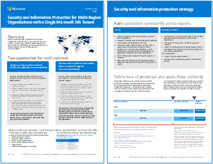
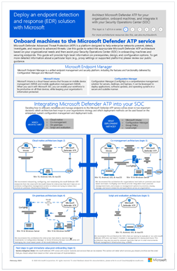

# Ilustraciones de productividad de Microsoft 365Microsoft 365 productivity illustrations

La serie de soluciones empresariales de Microsoft 365 ofrece orientación para implementar funcionalidades de Microsoft 365, sobre todo cuando estas abarcan varias tecnologías.The Microsoft 365 enterprise solution series provides guidance for implementing Microsoft 365 capabilities, especially where capabilities cross technologies.

### Microsoft Teams y servicios de productividad relacionados de Microsoft 365 para arquitectos de TIMicrosoft Teams and related productivity services in Microsoft 365 for IT architects
La arquitectura lógica de los servicios de productividad en Microsoft 365, una de las más destacadas gracias a Microsoft Teams.The logical architecture of productivity services in Microsoft 365, leading with Microsoft Teams.

|**Item****Item**|**Descripción****Description**|
|:-----|:-----|
|   [PDF](https://github.com/MicrosoftDocs/microsoft-365-docs/raw/public/microsoft-365/downloads/msft-m365-teams-logical-architecture.pdf) \| [Visio](https://github.com/MicrosoftDocs/OfficeDocs-Enterprise/raw/live/Enterprise/downloads/msft-m365-teams-logical-architecture.vsdx)[PDF](https://github.com/MicrosoftDocs/microsoft-365-docs/raw/public/microsoft-365/downloads/msft-m365-teams-logical-architecture.pdf) \| [Visio](https://github.com/MicrosoftDocs/OfficeDocs-Enterprise/raw/live/Enterprise/downloads/msft-m365-teams-logical-architecture.vsdx)   Actualizado en abril de 2019Updated April 2019   |Microsoft proporciona un conjunto de servicios de productividad que funcionan en conjunto para proporcionar experiencias de colaboración con funcionalidades de gobierno, seguridad y cumplimiento.Microsoft provides a suite of productivity services that work together to provide collaboration experiences with data governance, security, and compliance capabilities.    Esta serie de ilustraciones proporciona una vista de la arquitectura lógica de los servicios de productividad para arquitectos empresariales, que es una de las más destacadas gracias a Microsoft Teams.This series of illustrations provides a view into the logical architecture of productivity services for enterprise architects, leading with Microsoft Teams.|

### Grupos en Microsoft 365 para arquitectos de TIGroups in Microsoft 365 for IT Architects
Lo que necesitan saber los arquitectos de TI sobre los grupos en Microsoft 365What IT architects need to know about groups in Microsoft 365

|**Item****Item**|**Descripción****Description**|
|:-----|:-----|
|   [PDF](https://github.com/MicrosoftDocs/microsoft-365-docs/raw/public/microsoft-365/downloads/msft-m365-groups.pdf) \| [Visio](https://github.com/MicrosoftDocs/OfficeDocs-Enterprise/raw/live/Enterprise/downloads/msft-m365-groups.vsdx)[PDF](https://github.com/MicrosoftDocs/microsoft-365-docs/raw/public/microsoft-365/downloads/msft-m365-groups.pdf) \| [Visio](https://github.com/MicrosoftDocs/OfficeDocs-Enterprise/raw/live/Enterprise/downloads/msft-m365-groups.vsdx)   Actualizado el 2020 de mayoUpdated May 2020|Estas ilustraciones detallan los diferentes tipos de grupos, cómo se crean y administran, y algunas recomendaciones para el gobierno de estos.These illustrations detail the different types of groups, how these are created and managed, and a few governance recommendations.|

### Seguridad y protección de la información para organizaciones de varias regionesSecurity and Information Protection for Multi-Region Organizations
Seguridad y protección de la información para organizaciones de varias regiones con un único espacio empresarial de Microsoft 365Security and information protection for multi-region organizations with a single microsoft 365 tenant

|**Item****Item**|**Descripción****Description**|
|:-----|:-----|
|   [PDF](https://github.com/MicrosoftDocs/microsoft-365-docs/raw/public/microsoft-365/downloads/msft-security-info-protect-multi-region.pdf) \| [Visio](https://github.com/MicrosoftDocs/microsoft-365-docs/raw/public/microsoft-365/downloads/msft-security-info-protect-multi-region.vsdx)[PDF](https://github.com/MicrosoftDocs/microsoft-365-docs/raw/public/microsoft-365/downloads/msft-security-info-protect-multi-region.pdf) \| [Visio](https://github.com/MicrosoftDocs/microsoft-365-docs/raw/public/microsoft-365/downloads/msft-security-info-protect-multi-region.vsdx) Actualizado en marzo de 2020Updated March 2020 |Usar un único espacio empresarial de Microsoft 365 para su organización global es la mejor opción y experiencia por muchas razones.Using a single Microsoft 365 tenant for your global organization is the best choice and experience for many reasons. Sin embargo, en muchos arquitectos luchan por cómo cumplir los objetivos de protección de la información y seguridad en distintas regiones.However, many architects wrestle with how to meet security and information protection objectives across different regions. Este conjunto de temas contiene recomendaciones.This set of topics provides recommendations. |

### Estrategia de implementación de ATP de Microsoft DefenderMicrosoft Defender ATP deployment strategy

Dependiendo de su entorno, algunas herramientas son más adecuadas para determinadas arquitecturas.Depending on your environment, some tools are better suited for certain architectures.

|**Elemento****Item**|**Descripción****Description**|
|:-----|:-----|
|  [PDF](https://github.com/MicrosoftDocs/windows-itpro-docs/raw/public/windows/security/threat-protection/microsoft-defender-atp/downloads/mdatp-deployment-strategy.pdf)  \| [Visio](https://github.com/MicrosoftDocs/windows-itpro-docs/raw/public/windows/security/threat-protection/microsoft-defender-atp/downloads/mdatp-deployment-strategy.vsdx)[PDF](https://github.com/MicrosoftDocs/windows-itpro-docs/raw/public/windows/security/threat-protection/microsoft-defender-atp/downloads/mdatp-deployment-strategy.pdf)  \| [Visio](https://github.com/MicrosoftDocs/windows-itpro-docs/raw/public/windows/security/threat-protection/microsoft-defender-atp/downloads/mdatp-deployment-strategy.vsdx)  Actualizado en febrero de 2020Updated February 2020| El material arquitectónico le ayuda a planear la implementación de las arquitecturas siguientes:The architectural material helps you plan your deployment for the following architectures: <ul><li> Nativo en la nubeCloud-native </li><li> Administración conjuntaCo-management </li><li> LocalOn-premise</li><li>Evaluación e incorporación localEvaluation and local onboarding</li>

### Infraestructura básica de Microsoft 365 EnterpriseMicrosoft 365 Enterprise Foundation Infrastructure

Obtenga una vista rápida de la [infraestructura básica](https://docs.microsoft.com/microsoft-365/enterprise/deploy-foundation-infrastructure) de Microsoft 365 Enterprise para comenzar su implementación.Get an at-a-glance view of the [foundation infrastructure](https://docs.microsoft.com/microsoft-365/enterprise/deploy-foundation-infrastructure) for Microsoft 365 Enterprise to begin your deployment.
  
|**Item****Item**|**Descripción****Description**|
|:-----|:-----|
|   [Ver en línea](https://aka.ms/m365efoundinfraposter) \| [PDF](https://github.com/MicrosoftDocs/microsoft-365-docs/raw/public/microsoft-365/downloads/Microsoft365EnterpriseFoundInfra.pdf)[View online](https://aka.ms/m365efoundinfraposter) \| [PDF](https://github.com/MicrosoftDocs/microsoft-365-docs/raw/public/microsoft-365/downloads/Microsoft365EnterpriseFoundInfra.pdf)   Actualizado en diciembre de 2019Updated December 2019| Este póster resume cada fase de la infraestructura básica en términos de objetivos, características y herramientas, decisiones de diseño, resultados de la configuración, incorporación y supervisión y actualizaciones constantes.This poster summarizes each phase of the foundation infrastructure in terms of goals, features and tools, design decisions, configuration results, onboarding, and ongoing monitoring and updates.  | 

   

### Protección de identidades y dispositivos para Office 365Identity and device protection for Office 365

Capacidades recomendadas para la protección de las identidades y los dispositivos que tienen acceso a Office 365, otros servicios de SaaS y aplicaciones locales publicadas con Proxy de la aplicación de Azure AD.Recommended capabilities for protecting identities and devices that access Office 365, other SaaS services, and on-premises applications published with Azure AD Application Proxy.

|**Elemento****Item**|**Descripción****Description**|
|:-----|:-----|
|[          ](https://www.microsoft.com/download/details.aspx?id=55032)[          ](https://www.microsoft.com/download/details.aspx?id=55032)   [PDF](https://go.microsoft.com/fwlink/p/?linkid=841656)  \| [Visio](https://go.microsoft.com/fwlink/p/?linkid=841657)  \| [Más idiomas](https://www.microsoft.com/download/details.aspx?id=55032)[PDF](https://go.microsoft.com/fwlink/p/?linkid=841656)  \| [Visio](https://go.microsoft.com/fwlink/p/?linkid=841657)  \| [More languages](https://www.microsoft.com/download/details.aspx?id=55032)   Actualizado en noviembre de 2018Updated November 2018|It's important to use consistent levels of protection across your data, identities, and devices.It's important to use consistent levels of protection across your data, identities, and devices. This document shows you which capabilities are comparable with more information on capabilities to protect identities and devices.This document shows you which capabilities are comparable with more information on capabilities to protect identities and devices.    |
   
<!--

### File protection solutions in Office 365

Recommended capabilities for protecting files in Office 365 based on three different sensitivity levels.
  
|**Item**|**Description**|
|:-----|:-----|
|[          ](https://www.microsoft.com/download/details.aspx?id=55523)   [PDF](https://go.microsoft.com/fwlink/?linkid=2004320)  \| [Visio](https://download.microsoft.com/download/7/8/9/789645A5-BD10-4541-BC33-F8D1EFF5E911/MSFT_cloud_architecture_O365%20file%20protection.vsdx)   |It's important to use consistent levels of protection across your data, identities, and devices. This document shows you which capabilities are comparable with more information on capabilities to protect files in Office 365.    |
   

### Office 365 Information Protection for GDPR

Prescriptive recommendations for discovering, classifying, protecting, and monitoring personal data. This solution uses General Data Protection Regulation (GDPR) as an example, but you can apply the same process to achieve compliance with many other regulations.

|**Item**|**Description**|
|:-----|:-----|
|    [PDF](https://download.microsoft.com/download/E/C/D/ECD5A339-EF10-4420-B3A9-99098884D716/MSFT_Cloud_architecture_information%20protection%20for%20GDPR.pdf) \| [Visio](https://download.microsoft.com/download/E/C/D/ECD5A339-EF10-4420-B3A9-99098884D716/MSFT_Cloud_architecture_information%20protection%20for%20GDPR.vsdx)    |To see this content in article format, see [Office 365 Information Protection for GDPR](https://docs.microsoft.com/Office365/SecurityCompliance/office-365-information-protection-for-gdpr).      |

### Microsoft Security Guidance for Political Campaigns, Nonprofits, and Other Agile Organizations 

This guidance describes how to implement a secure cloud environment. The solution guidance can be used by any organization. It includes extra help for agile organizations with BYOD access and guest accounts. You can use this guidance as a starting-point for designing your own environment.

|**Item**|**Description**|
|:-----|:-----|
|**Microsoft Security Guidance for Political Campaigns**   [          ](https://download.microsoft.com/download/B/4/D/B4D520C3-4D0C-4B4D-BFB9-09F0651C2775/MSFT_Cloud_architecture_security%20for%20political%20campaigns.pdf)   [PDF](https://download.microsoft.com/download/B/4/D/B4D520C3-4D0C-4B4D-BFB9-09F0651C2775/MSFT_Cloud_architecture_security%20for%20political%20campaigns.pdf)  \| [Visio](https://download.microsoft.com/download/B/4/D/B4D520C3-4D0C-4B4D-BFB9-09F0651C2775/MSFT_Cloud_architecture_security%20for%20political%20campaigns.vsdx)   |This guidance uses a political campaign organization as an example. Use this guidance as a starting point for any environment.    |
|**Microsoft Security Guidance for Nonprofits**   [          ](https://download.microsoft.com/download/9/4/3/94389612-C679-4061-8DF2-D9A15D72B65F/Microsoft_Cloud%20Architecture_Security%20for%20Nonprofits.pdf)   [PDF](https://download.microsoft.com/download/9/4/3/94389612-C679-4061-8DF2-D9A15D72B65F/Microsoft_Cloud%20Architecture_Security%20for%20Nonprofits.pdf)  \| [Visio](https://download.microsoft.com/download/9/4/3/94389612-C679-4061-8DF2-D9A15D72B65F/Microsoft_Cloud%20Architecture_Security%20for%20Nonprofits.vsdx)   |This guide is slightly revised for nonprofit organizations. For example, it references Office 365 Nonprofit plans. The technical guidance is the same as the political campaign solution guide.    |

This guidance includes Test Lab Guides. For more information, see [Microsoft Security Guidance for Political Campaigns, Nonprofits, and Other Agile Organizations](https://docs.microsoft.com/Office365/SecurityCompliance/microsoft-security-guidance-for-political-campaigns-nonprofits-and-other-agile-o).

-->

### Soluciones de telefonía de MicrosoftMicrosoft Telephony Solutions

Microsoft supports several options as you begin your journey to Teams in the Microsoft cloud.Microsoft supports several options as you begin your journey to Teams in the Microsoft cloud. This poster helps you decide which Microsoft telephony solution (Phone System in the cloud or Enterprise Voice on-premises) is right for users in your organization, and how your organization can connect to the Public Switched Telephone Network (PSTN).This poster helps you decide which Microsoft telephony solution (Phone System in the cloud or Enterprise Voice on-premises) is right for users in your organization, and how your organization can connect to the Public Switched Telephone Network (PSTN).

  
[PDF](https://github.com/MicrosoftDocs/OfficeDocs-SkypeForBusiness/raw/live/Teams/downloads/telephony-solutions/microsoft-telephony-solutions-12-19.pdf) | [Visio](https://github.com/MicrosoftDocs/OfficeDocs-SkypeForBusiness/raw/live/Teams/downloads/telephony-solutions/microsoft-telephony-solutions-12-18.vsdx)[PDF](https://github.com/MicrosoftDocs/OfficeDocs-SkypeForBusiness/raw/live/Teams/downloads/telephony-solutions/microsoft-telephony-solutions-12-19.pdf) | [Visio](https://github.com/MicrosoftDocs/OfficeDocs-SkypeForBusiness/raw/live/Teams/downloads/telephony-solutions/microsoft-telephony-solutions-12-18.vsdx)  
Actualizado en enero de 2019Updated January 2019

Para obtener más información, consulte el artículo de este póster: [Soluciones de telefonía de Microsoft](https://docs.microsoft.com/SkypeForBusiness/hybrid/msft-telephony-solutions).For more information, see the article for this poster: [Microsoft Telephony Solutions](https://docs.microsoft.com/SkypeForBusiness/hybrid/msft-telephony-solutions).
  
  
## Consulta tambiénSee Also

[Modelos de arquitectura para SharePoint, Exchange, Skype Empresarial y LyncArchitectural models for SharePoint, Exchange, Skype for Business, and Lync](https://docs.microsoft.com/office365/enterprise/architectural-models-for-sharepoint-exchange-skype-for-business-and-lync)
  
[Guías del entorno de pruebas de adopción de la nube (TLG)Cloud adoption Test Lab Guides (TLGs)](https://docs.microsoft.com/office365/enterprise/cloud-adoption-test-lab-guides-tlgs)
