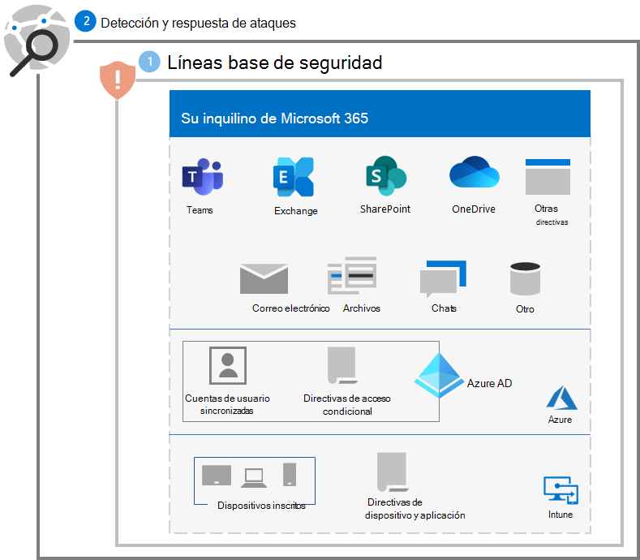

# Paso 2. Implementación de la detección y respuesta de ataques

Como paso inicial recomendado para la detección y respuesta de ataques de ransomware en el espacio empresarial de Microsoft 365, [configure un entorno de prueba](/microsoft-365/security/defender/eval-overview) para evaluar las características y capacidades de Microsoft 365 Defender.

Consulte estos recursos para más información.

| Característica | Descripción | ¿Por dónde empezar? | Cómo usarlo para la detección y respuesta |
|:-------|:-----|:-------|:-------|
| [Microsoft 365 Defender](/microsoft-365/security/defender) | Combina señales y dispone las funcionalidades en una única solución.    Permite a los profesionales de la seguridad reunir las señales de amenazas y determinar el ámbito y el impacto completos de una amenaza.    Automatiza las acciones para evitar o detener el ataque y reparar de manera automática los buzones afectados, los puntos de conexión y las identidades de usuario. | [Introducción](/microsoft-365/security/defender/get-started) | [Respuesta a incidentes](/microsoft-365/security/defender/incidents-overview) |
| [Microsoft Defender for Identity](/defender-for-identity/what-is) |  Identifica, detecta e investiga amenazas avanzadas, identidades en peligro y acciones internas malintencionadas dirigidas a la organización a través de una interfaz de seguridad basada en la nube que usa las señales de Active Directory Domain Services (AD DS) local. | [Información general](/defender-for-identity/what-is) | [Trabajo con el portal de Microsoft Defender for Identity](/defender-for-identity/workspace-portal) |
| [Microsoft Defender para Office 365](/microsoft-365/security/office-365-security) | Protege a la organización frente a las amenazas dañinas que se presentan en mensajes de correo electrónico, vínculos (URL) y herramientas de colaboración.    Protege contra software malintencionado, phishing, suplantación de identidad y otro tipo de ataques. | [Información general](/microsoft-365/security/office-365-security/overview) | [Búsqueda de amenazas](/microsoft-365/security/office-365-security/threat-hunting-in-threat-explorer) |
| [Microsoft Defender para punto de conexión](/microsoft-365/security/defender-endpoint) | Habilita la detección y respuesta a amenazas avanzadas en los distintos puntos de conexión (dispositivos). | [Información general](/microsoft-365/security/defender-endpoint/microsoft-defender-endpoint)  | [Detección y respuesta de puntos de conexión](/microsoft-365/security/defender-endpoint/overview-endpoint-detection-response) |
| [Protección de Identitdad Azure Active Directory (Azure AD)](/azure/active-directory/identity-protection/) | Automatiza la detección y corrección de riesgos basados en identidades y la investigación de dichos riesgos. | [Información general](/azure/active-directory/identity-protection/overview-identity-protection) | [Investigar riesgos](/azure/active-directory/identity-protection/howto-identity-protection-investigate-risk) |
| [Microsoft Defender for Cloud Apps](/cloud-app-security) | Agente de seguridad de acceso a la nube para la detección, investigación y gobernanza en todos los servicios en la nube de Microsoft y de terceros | [Información general](/cloud-app-security/what-is-cloud-app-security) | [Investigar](/cloud-app-security/investigate) |

>[!Note]
>Todos estos servicios requieren de Microsoft 365 E5 o Microsoft 365 E3 con el complemento Seguridad de Microsoft 365 E5.
>

Use estos servicios para detectar y responder a las siguientes amenazas comunes de los atacantes mediante ransomware:

- Robo de credenciales

   - Azure AD Identity Protection
   - Defender for Identity
   - Defender para Office 365

- Compromiso del dispositivo

   - Defender para punto de conexión
   - Defender para Office 365

- Elevación de privilegios

   - Azure AD Identity Protection
   - Defender for Cloud Apps

- Comportamiento de aplicaciones malintencionadas

   - Defender for Cloud Apps

- Filtración, eliminación o carga de datos

   - Defender para Office 365
   - Defender for Cloud Apps con [directivas de detección de anomalías](/cloud-app-security/anomaly-detection-policy#ransomware-activity)

Los siguientes servicios usan Microsoft 365 Defender y su correspondiente portal (https://security.microsoft.com) como punto de análisis y recopilación de amenazas comunes:

- Defender for Identity
- Defender para Office 365
- Defender para punto de conexión
- Defender for Cloud Apps

Microsoft 365 Defender combina señales de amenazas en alertas y alertas conectadas en un incidente para que los analistas de seguridad puedan detectar, investigar y corregir más rápidamente las fases de un ataque de ransomware.

## Configuración resultante

Esta es la protección contra ransomware de los pasos 1 y 2 para el espacio empresarial.

## Paso siguiente

Continúe con el [paso 3](ransomware-protection-microsoft-365-identities.md) para proteger las identidades del espacio empresarial de Microsoft 365.
