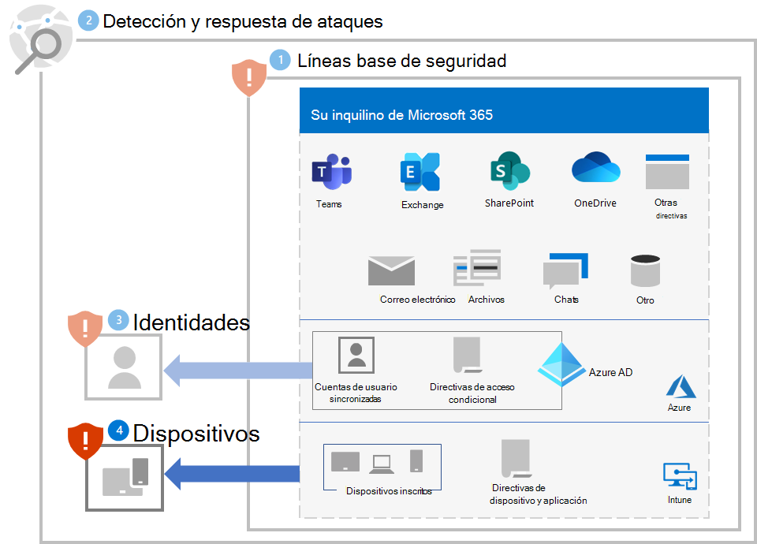

# Paso 4. Proteger dispositivos

Para ayudar a proteger los dispositivos (puntos de conexión) contra la parte de acceso inicial de un ataque de ransomware:

- Implemente [Intune](/mem/intune/fundamentals/what-is-intune) como proveedor de administración de dispositivos móviles (MDM) y administración de aplicaciones móviles (MAM) para sus dispositivos e inscriba los dispositivos que sean propiedad de la organización.
- Implemente las [Directivas comunes de identidad y acceso a dispositivos](/microsoft-365/security/office-365-security/identity-access-policies) para validar las credenciales de la cuenta de usuario y reforzar los requisitos de cumplimiento y estado del dispositivo.
- Habilite la [Protección de red](/microsoft-365/security/defender-endpoint/network-protection) en Microsoft Defender para punto de conexión y Microsoft 365 Defender.
- Configure la [comprobación de sitios y descargas](/windows/security/threat-protection/microsoft-defender-smartscreen/microsoft-defender-smartscreen-available-settings) y la [comprobación de aplicaciones y archivos](/windows/security/threat-protection/microsoft-defender-smartscreen/microsoft-defender-smartscreen-available-settings) en SmartScreen de Microsoft Defender para bloquear o advertir.
- Habilite el [examen por parte del Antivirus de Microsoft Defender](/microsoft-365/security/defender-endpoint/configure-advanced-scan-types-microsoft-defender-antivirus) de archivos y datos adjuntos descargados.
- Establezca el **Nivel de seguridad de escritorio remoto** en **TLS** en Microsoft Defender para punto de conexión y Microsoft 365 Defender.

## Dispositivos Windows 11 o 10

Para ayudar a protegerse contra la parte de desplazamiento lateral de un ataque desde un dispositivo con Windows 11 o 10:

- [Habilite el Firewall de Microsoft Defender](https://support.microsoft.com/windows/turn-microsoft-defender-firewall-on-or-off-ec0844f7-aebd-0583-67fe-601ecf5d774f).
- [Actualice las definiciones del Antivirus de Microsoft Defender](/microsoft-365/security/defender-endpoint/manage-updates-baselines-microsoft-defender-antivirus).

Para reducir el impacto del ataque:

- Use [las reglas de reducción de la superficie expuesta a ataques y protección avanzada contra ransomware](/microsoft-365/security/defender-endpoint/attack-surface-reduction-rules-reference#use-advanced-protection-against-ransomware).

Para ayudar a protegerse contra un atacante que elude sus defensas de seguridad:

- Mantenga activada la [protección proporcionada por la nube](/microsoft-365/security/defender-endpoint/enable-cloud-protection-microsoft-defender-antivirus) en el Antivirus de Microsoft Defender.
- Mantenga activada la [supervisión del comportamiento en tiempo real](/microsoft-365/security/defender-endpoint/configure-real-time-protection-microsoft-defender-antivirus) del Antivirus de Windows Defender.
- Habilite la [protección en tiempo real](/microsoft-365/security/defender-endpoint/configure-real-time-protection-microsoft-defender-antivirus).
- Habilite la [protección contra alteraciones en Microsoft Defender para punto de conexión](/microsoft-365/security/defender-endpoint/prevent-changes-to-security-settings-with-tamper-protection) para evitar cambios malintencionados en la configuración de seguridad.

Para ayudar a protegerse contra un atacante que ejecuta código como parte de un ataque:

- Habilite el [Antivirus de Microsoft Defender](/mem/intune/user-help/turn-on-defender-windows).
- [Bloquee las llamadas API de Win32 desde macros de Office](/microsoft-365/security/defender-endpoint/attack-surface-reduction-rules#block-win32-api-calls-from-office-macros).
- Migre todos los libros heredados que requieren macros de Excel 4.0 al formato de macro VBA actualizado mediante [este proceso](https://www.microsoft.com/microsoft-365/blog/2010/02/16/migrating-excel-4-macros-to-vba/).
- [Deshabilite el uso de macros sin firma](https://support.microsoft.com/topic/enable-or-disable-macros-in-office-files-12b036fd-d140-4e74-b45e-16fed1a7e5c6). Asegúrese de que todas las macros internas con necesidades empresariales están firmadas y aprovechando las [ubicaciones de confianza](/deployoffice/security/designate-trusted-locations-for-files-in-office) para asegurarse de que las macros desconocidas no se ejecutarán en su entorno.
- Detenga macros XLM o VBA malintencionadas asegurándose de que el análisis de macros en tiempo de ejecución por parte de la [interfaz de examen antimalware](https://www.microsoft.com/security/blog/2021/03/03/xlm-amsi-new-runtime-defense-against-excel-4-0-macro-malware/) (AMSI) está activado. Esta característica (habilitada de forma predeterminada) está activada si la configuración de Directiva de grupo para el **Ámbito de examen de tiempo de ejecución de macros** está establecida en **Habilitar para todos los archivos** o **Habilitar para archivos de baja confianza**. Obtenga los archivos de plantilla de directiva de grupo más recientes.

## Impacto en los usuarios y administración de cambios

A medida que implemente estas protecciones, realice la administración de cambios para lo siguiente:

- Las [directivas de acceso de dispositivos e identidades de Confianza cero comunes](/microsoft-365/security/office-365-security/identity-access-policies) pueden denegar el acceso a los usuarios que tienen dispositivos no compatibles.
- La descarga de archivos podría advertir a los usuarios antes de la descarga o podría bloquearse.
- Es posible que algunas macros de Office, Excel 4.0, XLM o VBA ya no se ejecuten.

## Configuración resultante

Esta es la protección contra ransomware para el espacio empresarial de los pasos 1 a 4.

## Paso siguiente

Continúe con el [Paso 5](ransomware-protection-microsoft-365-information.md) para proteger la información en su espacio empresarial de Microsoft 365. 
