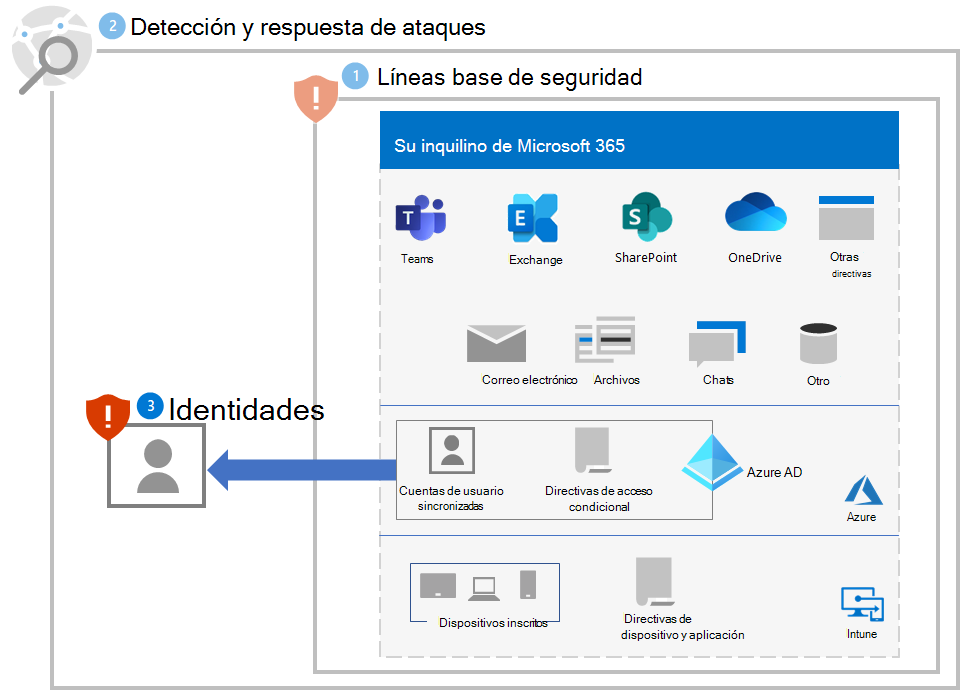

# Paso 3. Proteger identidades

Use las secciones siguientes para proteger su organización de la vulneración de credenciales, que suele ser la primera fase de un ataque de ransomware más grande.

## Aumentar la seguridad de inicio de sesión

Use [ autenticación sin contraseña](/azure/active-directory/authentication/howto-authentication-passwordless-deployment) para las cuentas de usuario de Azure Active Directory (Azure AD).

Durante la transición a la autenticación sin contraseña, use estos procedimientos recomendados para las cuentas de usuario que siguen usando la autenticación de contraseña:

- Bloquear contraseñas seguras y personalizadas conocidas con [Azure AD Protección con contraseña](/azure/active-directory/authentication/concept-password-ban-bad).
- Extienda el bloqueo de contraseñas débiles y personalizadas conocidas a su [Active Directory local Domain Services (AD DS) con protección con contraseña de Azure AD](/azure/active-directory/authentication/concept-password-ban-bad-on-premises).
- Permita que los usuarios cambien sus propias contraseñas con [-Self-Service Password Reset (SSPR)](/azure/active-directory/authentication/concept-sspr-howitworks).

A continuación, implemente las [Directivas comunes de acceso a dispositivos e identidades](/microsoft-365/security/office-365-security/identity-access-policies). Estas directivas proporcionan mayor seguridad para el acceso a servicios en la nube de Microsoft 365. 

En el caso de los inicios de sesión de usuario, estas directivas incluyen:

- Requerir autenticación multifactor (MFA) para [cuentas prioritarias](/microsoft-365/admin/setup/priority-accounts) (inmediatamente) y, a la larga, para todas las cuentas de usuario.
- Requerir inicios de sesión de alto riesgo para usar MFA.
- Requerir que los usuarios de alto riesgo con inicios de sesión de alto riesgo cambien sus contraseñas.

## Evitar la elevación de privilegios

Use estos procedimientos recomendados:

- Implemente el principio de [privilegio mínimo](/windows-server/identity/ad-ds/plan/security-best-practices/implementing-least-privilege-administrative-models) y use la protección con contraseña como se describe en [Aumentar la seguridad de inicio de sesión](#increase-sign-in-security) para las cuentas de usuario que aún usan contraseñas para el inicio de sesión. 
- Evite el uso de cuentas de servicio de nivel de administrador en todo el dominio. 
- Restrinja los privilegios administrativos locales para limitar la instalación de Troyanos de Acceso Remoto (RAT, por sus siglas en inglés) y otras aplicaciones no deseadas.
- Use Azure AD acceso condicional para validar explícitamente la confianza de los usuarios y estaciones de trabajo antes de permitir el acceso a los portales administrativos. Consulte [este ejemplo](/azure/active-directory/conditional-access/howto-conditional-access-policy-azure-management) para Microsoft Azure Portal.
- Habilite la administración de contraseñas de administrador local.
- Determine dónde inician sesión las cuentas con privilegios altos y expone las credenciales. Las cuentas con privilegios altos no deben estar presentes en estaciones de trabajo.
- Deshabilite el almacenamiento local de contraseñas y credenciales.

## Impacto en los usuarios y administración de cambios

Debe hacer que los usuarios de su organización conozcan lo siguiente:

- Los nuevos requisitos para contraseñas más seguras.
- Los cambios en los procesos de inicio de sesión, como el uso necesario de MFA y el registro del método de autenticación secundario de MFA.
- El uso del mantenimiento de contraseñas con SSPR. Por ejemplo, no hay más llamadas al departamento de soporte técnico para restablecer la contraseña.
- La solicitud de solicitar MFA o un cambio de contraseña para los inicios de sesión que se determina que son riesgosos.

## Configuración resultante

Esta es la protección contra ransomware para el espacio empresarial de los pasos 1 a 3.

## Paso siguiente

Continúe con [Paso 4](ransomware-protection-microsoft-365-devices.md) para proteger los dispositivos (puntos de conexión) en el inquilino de Microsoft 365. 
