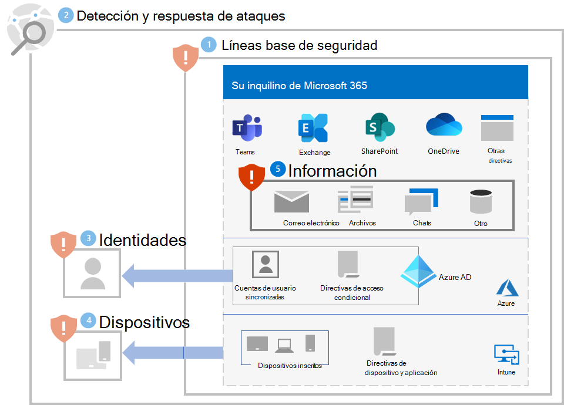

# Paso 5. Proteger información

Dado que los atacantes de ransomware también examinarán los datos locales ubicados en archivos, bases de datos y otros tipos de servidores, una de las mejores formas de proteger esos datos es migrarlos a su espacio empresarial de Microsoft 365. Una vez allí, se pueden proteger mediante características integradas de mitigación y recuperación, como [control de versiones, papelera de reciclaje y la restauración de archivos](ransomware-protection-microsoft-365.md#ransomware-mitigation-and-recovery-capabilities-provided-with-microsoft-365).

Para proporcionar protección adicional a la información confidencial en su espacio empresarial de Microsoft 365:

- Busque su información confidencial.
- Implemente permisos estrictos y elimine el acceso amplio (por ejemplo, demasiados usuarios con capacidades de escritura, edición y eliminación).
- Proteja su información confidencial.

>[!Note]
>Para obtener instrucciones detalladas de implementación para la protección de la información en un espacio empresarial de Microsoft 365, consulte [Implementar protección de la información para las normativas de privacidad de datos](information-protection-deploy.md). Aunque está pensada para las normativas de privacidad de datos, gran parte de las instrucciones también se aplican a la protección contra ransomware.
>

## Buscar su información confidencial

La primera tarea consiste en [identificar los tipos y ubicaciones](/microsoft-365/compliance/information-protection#know-your-data) de la información confidencial en el espacio empresarial, que puede incluir los siguientes tipos:

- Confidencial
- Propiedad intelectual o derechos de propiedad
- Normativas regionales reguladas que especifican la protección de la información de identificación personal (DCP)
- Planes de recuperación de TI

Para cada tipo de información confidencial, determine lo siguiente:

- El uso de la información en su organización
- Una medida relativa de su valor monetario si se pidiera un rescate (por ejemplo, alta, media, baja)
- Su ubicación actual, como una carpeta de OneDrive o SharePoint o un lugar de colaboración, como un equipo de Microsoft Teams
- Los permisos actuales, que constan de:

   - Las cuentas de usuario que tienen acceso a ella

   - Las acciones que se permiten por parte de cada cuenta que tiene acceso a ella

## Implementar permisos estrictos para ubicaciones con información confidencial

El uso de permisos estrictos dentro de su espacio empresarial de Microsoft 365 es el principio de privilegios mínimos para ubicaciones y lugares de comunicaciones, que en Microsoft 365 suelen ser carpetas de OneDrive, sitios y carpetas de SharePoint, y equipos. 

Aunque es más fácil crear ubicaciones de almacenamiento de archivos o equipos con acceso amplio (como el valor predeterminado de todos los usuarios de la organización), en el caso de la información confidencial, las cuentas de usuario permitidas y las acciones permitidas deben limitarse al conjunto mínimo necesario para cumplir los requisitos empresariales y de colaboración.

Una vez que un atacante de ransomware se ha infiltrado en el espacio empresarial, intenta escalar sus privilegios poniendo en peligro las credenciales de las cuentas de usuario con un ámbito más amplio de permisos en el espacio empresarial, como cuentas de rol de administrador o cuentas de usuario que tienen acceso a información confidencial. 

En función de este comportamiento típico del atacante, hay dos niveles de dificultad para el atacante:

- **Bajo:** un atacante puede usar una cuenta con permisos reducidos y detectar la información confidencial debido a un amplio acceso en todo el espacio empresarial.
- **Más alto:** Un atacante no puede usar una cuenta con permisos bajos y detectar la información confidencial debido a permisos estrictos. Deben escalar sus permisos determinando y, a continuación, poniendo en peligro las credenciales de una cuenta que tiene acceso a una ubicación con información confidencial, pero es posible que solo puedan realizar un conjunto limitado de acciones.

En el caso de la información confidencial, debe hacer que el nivel de dificultad sea lo más alto posible.

Puede garantizar permisos estrictos en su espacio empresarial con estos pasos:

1. Desde el esfuerzo por [buscar la información confidencial](#locate-your-sensitive-information), revise los permisos para las ubicaciones de la información confidencial. 
2. Implemente permisos estrictos para la información confidencial a la vez que cumple los requisitos de colaboración y empresariales e informe a los usuarios afectados.
3. Realice la administración de cambios para los usuarios para que las ubicaciones futuras de información confidencial se creen y mantengan con permisos estrictos.
4. Audite y supervise las ubicaciones en busca de información confidencial para asegurarse de que no se conceden permisos amplios.

Consulte [Configurar la colaboración segura con Microsoft 365 y Microsoft Teams](setup-secure-collaboration-with-teams.md) para obtener instrucciones detalladas. Un ejemplo de un lugar de comunicación y colaboración con permisos estrictos para información confidencial es un [equipo con aislamiento de seguridad](/microsoft-365/solutions/secure-teams-security-isolation).

## Proteger su información confidencial

Para proteger la información confidencial en caso de que un atacante de ransomware tenga acceso a ella:

- Use el [acceso controlado a carpetas](/windows/security/threat-protection/microsoft-defender-atp/controlled-folders) para que sea más difícil para las aplicaciones no autorizadas modificar los datos en carpetas controladas.

- Use [Microsoft Information Protection](/microsoft-365/compliance/information-protection) y etiquetas de confidencialidad y aplíquelas a la información confidencial. Las etiquetas de confidencialidad se pueden configurar para cifrado y permisos adicionales con cuentas de usuario definidas y acciones permitidas. Un archivo etiquetado con este tipo de etiqueta de confidencialidad que se filtre desde su espacio empresarial solo se podrá usar por parte de una cuenta de usuario definida en la etiqueta.

- Use la [prevención de pérdida de datos (DLP)](/microsoft-365/compliance/dlp-learn-about-dlp) de Microsoft 365 para detectar, advertir y bloquear el uso compartido riesgoso, involuntario o inapropiado de los datos que contienen información personal o confidencial en función de las etiquetas de confidencialidad, tanto interna como externamente.

- Use [Microsoft Cloud App Security](/cloud-app-security/what-is-cloud-app-security) para bloquear las descargas de información confidencial, como archivos. También puede usar [directivas de detección de anomalías de Cloud App Security](/cloud-app-security/anomaly-detection-policy#ransomware-activity) para detectar una alta tasa de cargas de archivos o actividades de eliminación de archivos.

## Impacto en los usuarios y administración de cambios

Los cambios administrativos en permisos amplios pueden provocar que se deniegue el acceso a los usuarios o que no puedan ejecutar algunas acciones.

Además, para la protección de la información confidencial en su espacio empresarial de Microsoft 365, entrene a los usuarios para que realicen lo siguiente:

- Creen lugares de comunicación y colaboración con permisos estrictos (el conjunto mínimo de cuentas de usuario para el acceso y las acciones mínimas permitidas para cada una). 
- Apliquen las etiquetas de confidencialidad adecuadas a la información confidencial.
- Use el acceso controlado a carpetas.

## Configuración resultante

Esta es la protección contra ransomware para su espacio empresarial de los pasos 1-5.

## Recursos adicionales de ransomware

Información clave de Microsoft:

- [La creciente amenaza de ransomware](https://blogs.microsoft.com/on-the-issues/2021/07/20/the-growing-threat-of-ransomware/), entrada de blog de Microsoft On the Issues del 20 de julio de 2021
- [Ransomware operado por humanos](/security/compass/human-operated-ransomware)
- [Protéjase contra ransomware y extorsión de manera rápida](/security/compass/protect-against-ransomware)
- [El informe de inteligencia de seguridad de Microsoft más reciente](https://www.microsoft.com/securityinsights/) (vea las páginas 22-24)
- **Ransomware: Un informe de amenazas generalizado y continuo** en el nodo del **Análisis de amenazas** del portal de Microsoft 365 Defender (consulte estos [requisitos de licencia](/microsoft-365/security/defender/prerequisites#licensing-requirements))

Microsoft 365:

- [Maximizar la resistencia de ransomware con Azure y Microsoft 365](https://azure.microsoft.com/resources/maximize-ransomware-resiliency-with-azure-and-microsoft-365/)
- [Recuperarse de un ataque de ransomware](/microsoft-365/security/office-365-security/recover-from-ransomware)
- [Protección de malware y ransomware](/compliance/assurance/assurance-malware-and-ransomware-protection)
- [Proteger su equipo con Windows 10 de los ataques de ransomware](https://support.microsoft.com//windows/protect-your-pc-from-ransomware-08ed68a7-939f-726c-7e84-a72ba92c01c3)
- [Control de ransomware en SharePoint Online](/sharepoint/troubleshoot/security/handling-ransomware-in-sharepoint-online)

Microsoft 365 Defender:

- [Buscar ransomware con la búsqueda avanzada de amenazas](/microsoft-365/security/defender/advanced-hunting-find-ransomware)

Microsoft Azure:

- [Defensas de Azure para los ataques de ransomware](https://azure.microsoft.com/resources/azure-defenses-for-ransomware-attack/)
- [Maximizar la resistencia de ransomware con Azure y Microsoft 365](https://azure.microsoft.com/resources/maximize-ransomware-resiliency-with-azure-and-microsoft-365/)
- [Plan de restauración y copia de seguridad para la protección contra ransomware](/security/compass/backup-plan-to-protect-against-ransomware)
- [Ayuda para la protección contra ransomware con Microsoft Azure Backup](https://www.youtube.com/watch?v=VhLOr2_1MCg) (vídeo de 26 minutos)
- [Recuperación de una identidad en peligro](/azure/security/fundamentals/recover-from-identity-compromise)
- [Detección de ataques de varias fases en Azure Sentinel](/azure/sentinel/fusion#ransomware)
- [Detección de fusión para ransomware en Azure Sentinel](https://techcommunity.microsoft.com/t5/azure-sentinel/what-s-new-fusion-detection-for-ransomware/ba-p/2621373)

Microsoft Cloud App Security:

-  [Crear directivas de detección de anomalías en Cloud App Security](/cloud-app-security/anomaly-detection-policy)

Entradas de blog del equipo de Seguridad de Microsoft:

- [3 pasos para evitar y recuperarse del ransomware (septiembre de 2021)](https://www.microsoft.com/security/blog/2021/09/07/3-steps-to-prevent-and-recover-from-ransomware/)
- [Camino a la resistencia al comprender los riesgos de ciberseguridad: Parte 4 — Navegación por las amenazas actuales (mayo de 2021)](https://www.microsoft.com/security/blog/2021/05/26/becoming-resilient-by-understanding-cybersecurity-risks-part-4-navigating-current-threats/)

  Consulte la sección **Ransomware**.

- [Ataques de ransomware operados por humanos: Un desastre evitable (marzo de 2020)](https://www.microsoft.com/security/blog/2020/03/05/human-operated-ransomware-attacks-a-preventable-disaster/)

  Incluye análisis de cadenas de ataques, de ataques reales.

- [Respuesta frente a ransomware: ¿pagar o no pagar? (diciembre de 2019)](https://www.microsoft.com/security/blog/2019/12/16/ransomware-response-to-pay-or-not-to-pay/)
- [Norsk Hydro responde ante ataques de ransomware con transparencia (diciembre de 2019)](https://www.microsoft.com/security/blog/2019/12/17/norsk-hydro-ransomware-attack-transparency/)

