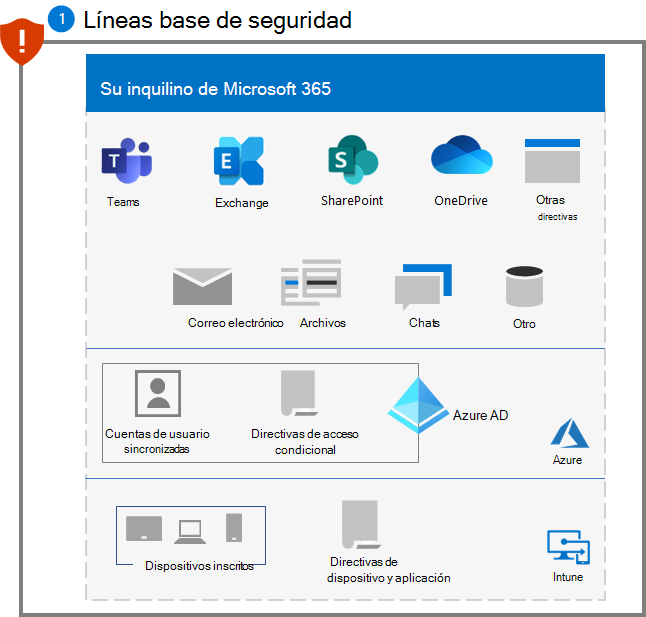

# Paso 1. Configurar las líneas base de seguridad

Como primer paso para combatir a los atacantes de ransomware, debe configurar las siguientes líneas base de seguridad definidas por Microsoft:

- [Seguridad de Microsoft 365](#microsoft-365-security-baseline)
- [Administración del correo de Exchange](#exchange-email-management-baseline)
- [Líneas base adicionales para dispositivos Windows y software cliente](#additional-baselines)

Estas líneas base contienen opciones de configuración y reglas conocidas por los atacantes, cuya ausencia se detecta rápidamente y se aprovecha con frecuencia.

## Línea base de seguridad de Microsoft 365

En primer lugar, evalúe y mida su posición de seguridad mediante la [Puntuación de seguridad de Microsoft](/microsoft-365/security/defender/microsoft-secure-score) y siga las instrucciones para mejorarla según sea necesario.

A continuación, use las [reglas de reducción de la superficie expuesta a ataques](/microsoft-365/security/defender-endpoint/attack-surface-reduction) para ayudar a bloquear la actividad sospechosa y el contenido vulnerable. Estas reglas incluyen la prevención de lo siguiente:

- Las aplicaciones de Office creen procesos secundarios
- El contenido ejecutable del cliente de correo electrónico y el correo web
- La ejecución de archivos ejecutables, excepto si cumplen un criterio de prevalencia, antigüedad o lista de confianza
- La ejecución de scripts potencialmente confusos
- JavaScript o VBScript inicien contenido ejecutable descargado
- Las aplicaciones de Office creen contenido ejecutable
- Las aplicaciones de Office inyecten código en otros procesos
- La aplicación de comunicación de Office cree procesos secundarios
- Se ejecuten desde una unidad USB procesos no firmados y que no sean de confianza
- La persistencia a través de la suscripción de eventos de Interfaz de Administración de Windows (WMI)
- El hurto de credenciales del subsistema de autoridad de seguridad local de Windows (lsass.exe)
- La creación de procesos procedentes de comandos de PSExec y WMI

## Línea base de administración de correo electrónico de Exchange 

Ayude a evitar el acceso inicial a su espacio empresarial desde un ataque basado en correo electrónico con esta configuración de línea base de correo electrónico de Exchange:

- Habilite el examen de correo por parte del Antivirus de Windows Defender
- Use Microsoft Defender para Office 365 para [mejorar la protección contra suplantación de identidad](/microsoft-365/security/office-365-security/anti-phishing-protection) y la cobertura contra nuevas amenazas y variantes polimórficas.
- Compruebe la configuración de filtrado de correo electrónico de Office 365 para asegurarse de bloquear correos electrónicos falsificados, correo no deseado y correos electrónicos con malware. Use Defender para Office 365 para mejorar la protección contra suplantación de identidad (phishing) y la cobertura contra nuevas amenazas y variantes polimórficas. Configure Defender para Office 365 para [volver a comprobar los vínculos al hacer clic](/microsoft-365/security/office-365-security/atp-safe-links) y [eliminar los correos entregados](/microsoft-365/security/office-365-security/zero-hour-auto-purge) en respuesta a la inteligencia de amenazas recién adquirida.
- Revise y actualice a la  [configuración recomendada más reciente para la de seguridad de EOP y Defender para Office 365](/microsoft-365/security/office-365-security/recommended-settings-for-eop-and-office365-atp).
- Configure Defender para Office 365 para [volver a comprobar los vínculos al hacer clic](/microsoft-365/security/office-365-security/set-up-safe-links-policies) y eliminar los correos entregados en respuesta a la inteligencia de amenazas recién adquirida.

## Líneas base adicionales

Aplique [líneas base de seguridad](https://techcommunity.microsoft.com/t5/microsoft-security-baselines/bg-p/Microsoft-Security-Baselines) para lo siguiente:

- Microsoft Windows 10
- Aplicaciones de Microsoft 365 para empresas
- Microsoft Edge

## Impacto en los usuarios y administración de cambios

Como procedimiento recomendado para una regla de reducción de la superficie expuesta a ataques, evalúe cómo una regla podría afectar a la red abriendo la recomendación de seguridad para esa regla en la administración de amenazas y vulnerabilidades. El panel de detalles de la recomendación describe el impacto en el usuario, que puede usar para determinar qué porcentaje de los dispositivos pueden aceptar una nueva directiva que habilita la regla en modo de bloqueo sin afectar negativamente a la productividad del usuario.

Además, la configuración de línea base de correo electrónico de Exchange puede bloquear el correo electrónico entrante e impedir el envío de correo electrónico o el hacer clic en vínculos dentro del correo electrónico. Informe a sus trabajadores sobre este comportamiento y el motivo por el que se toman estas precauciones.

## Configuración resultante

Esta es la protección contra ransomware para su espacio empresarial después de este paso.

## Paso siguiente

Continúe con el [Paso 2](ransomware-protection-microsoft-365-attack-detection-response.md) para implementar funcionalidades de detección y respuesta contra ataques para su espacio empresarial de Microsoft 365.
