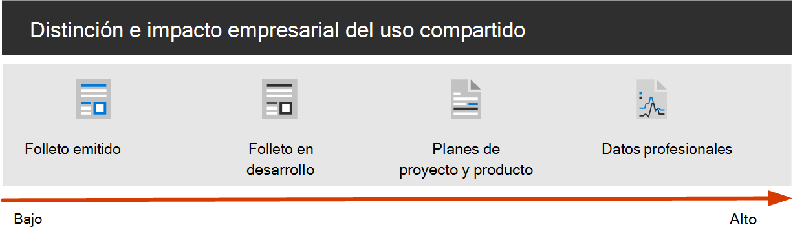

# Configurar la colaboración moderna con Microsoft 365

Poder compartir fácilmente información con las personas adecuadas a la vez que evita el uso compartido es clave para el éxito de una organización. Esto incluye poder compartir datos confidenciales de manera segura con solo aquellos que deben tener acceso a él. Según el proyecto, esto podría incluir compartir datos confidenciales con personas fuera de la organización.

Esta guía de la solución de colaboración incluye dos componentes que le ayudarán a:
- Implementación de Microsoft Teams con el nivel de protección adecuado para cada proyecto
- Configurar el uso compartido externo con la configuración de seguridad adecuada para cada proyecto

Si no hay disponibles herramientas de colaboración de contenido versátil y fácil de usar, los usuarios suelen colaborar por correo electrónico en los documentos. Se trata de un método tedioso y proclive a errores de colaboración y puede aumentar el riesgo de uso compartido inadecuado de la información. Si los usuarios consideran que es muy difícil compartir información, podrían volver a usar productos de consumidores que no se rigen por ello. Esto puede suponer un riesgo aún mayor.

Con Microsoft 365, puede implementar Teams con una variedad de configuraciones que le ayuden a:

- Proteger la propiedad intelectual
- Facilitar la colaboración
- Crear un equilibrio entre la seguridad y la facilidad de uso que aumenta la satisfacción del usuario y reduce el riesgo de sombra

La mayoría de las organizaciones tienen una variedad de información, con diversos grados de sensibilidad y distintos grados de impacto en el negocio si la información se comparte de manera inadecuada. Según el carácter de una información determinada, es posible que desee permitir el uso compartido con:

- Cualquiera (sin autenticar)
- Personas dentro de la organización
- Personas específicas dentro de la organización
- Personas específicas dentro y fuera de la organización

La información, como los folletos de marketing, se ha diseñado para compartir de forma general fuera de la organización. La información como los menús de cafetería no se pueden utilizar para uso compartido externo, pero no tendría impacto en la empresa si se compartían de forma externa. Estos tipos de información necesitan poca o ninguna protección.

Los mismos folletos de marketing, mientras están en desarrollo, solo pueden compartirse dentro de la organización. En este caso, la configuración de uso compartido predeterminada en Microsoft Teams puede ser suficiente.

La información sobre un nuevo producto que está en desarrollo puede considerarse confidencial, incluso dentro de la organización. En este caso, podría ser adecuado un mayor grado de protección. Por ejemplo, puede restringir el acceso a esta información a los miembros de un equipo específico. Según el proyecto, es posible que deba colaborar con personas fuera de la organización, como un proveedor o una organización asociada.

La información esencial para el éxito de la organización o que tenga requisitos de seguridad o de cumplimiento estrictos puede requerir niveles de protección aún más elevados.

Para todos los escenarios mencionados anteriormente, puede usar Teams en Microsoft Teams para almacenar, compartir y colaborar en la información. 

Para configurar una colaboración segura, use estas funciones y características de Microsoft 365.

| Producto o componente | Funcionalidad o característica | Licencias |
|:-------|:-----|:-------|
| Microsoft defender para Office 365 | Datos adjuntos seguros para SPO, OneDrive y Teams; Documentos seguros; Vínculos seguros para Microsoft Teams    | Microsoft 365 E1, E3 y E5 |
| SharePoint    | Directivas de uso compartido de sitios y archivos, permisos de uso compartido de sitios, vínculos para compartir, solicitudes de acceso, configuración de uso compartido del invitado del sitio | Microsoft 365 E1, E3 y E5 |
| Microsoft Teams   | Acceso de invitado, equipos privados, canales privados | Microsoft 365 E1, E3 y E5 |
| Cumplimiento de Microsoft 365  | Etiquetas de confidencialidad    | Microsoft 365 E3 y E5 |

### Uso de Teams para todo tipo de datos

Para administrar el acceso a la información con diferentes sensitivities, hemos desarrollado [tres niveles distintos de protección para Microsoft Teams](configure-teams-three-tiers-protection.md). Puede personalizar cualquiera de estos niveles para tratar mejor las necesidades o su negocio. 

Estos niveles: *línea base*, *sensible* y *extremadamente sensible* : aumentan gradualmente las protecciones que ayudan a evitar el uso compartido y la fuga potencial de información, como se muestra en la siguiente tabla.

|-|**Nivel de línea base**|**Nivel confidencial**|**Nivel muy confidencial**|
|:--|:-----------|:------------|:-------------------|
|Equipo público o privado|Ambos|Private|Private|
|Uso compartido no autenticado|Blocked|Blocked|Blocked|
|Uso compartido de archivos|Permitido|Permitido|Solo pueden compartir los propietarios del equipo.|
|Pertenencia al equipo|Cualquiera puede unirse a un equipo público. Se requiere la aprobación del propietario del equipo para unirse a equipos privados.|Se necesita la aprobación del propietario del equipo para unirse.|Se necesita la aprobación del propietario del equipo para unirse.|
|Cifrado de documentos|||Disponible con la etiqueta de confidencialidad|
|Uso compartido de invitados|Permitido|Se puede permitir o bloquear|Se puede permitir o bloquear|
|Dispositivos no administrados|Sin restricción|Acceso a través de Web|Blocked|

La configuración de estos niveles implica:

- Configuración de opciones en Microsoft Teams para el acceso de invitado y los canales privados
- Configuración de opciones en el sitio de SharePoint asociado a un equipo para uso compartido e interno de invitado, solicitudes de acceso y vínculos de uso compartido
- Para los niveles *confidenciales* y *muy sensibles* , configurar las etiquetas de confidencialidad para clasificar los equipos y controlar el uso compartido y el acceso de invitados desde dispositivos no administrados
- Para el nivel *extremadamente sensible* , configure una etiqueta de confidencialidad para cifrar los documentos a los que se aplica

Empiece con el nivel de línea base y, a continuación, agregue equipos que usen los niveles *Sensitive y sensiblemente* *confidenciales* según sea necesario para ayudar a proteger la información de la organización. Consulte estos recursos para empezar:

- [Configure equipos con la protección de base de referencia](configure-teams-baseline-protection.md)
- [Configure equipos con protección de datos confidenciales](configure-teams-sensitive-protection.md)
- [Configuración de equipos con protección de datos con un nivel de confidencialidad alto](configure-teams-highly-sensitive-protection.md)

Si tiene un proyecto muy sensible que requiere protección adicional para compartir incluso dentro de su organización, puede configurar un equipo que use su propia etiqueta de confidencialidad para cifrar archivos de modo que solo los miembros del equipo puedan leerlos. Consulte [Configure a Team with Security Isolation](secure-teams-security-isolation.md) para obtener más información.

### Compartir con personas de fuera de la organización

Es posible que necesite [compartir información de cualquier importancia con personas de fuera de la organización](collaborate-with-people-outside-your-organization.md). Esto puede abarcar desde compartir un solo documento con una sola persona para colaborar en un proyecto principal con una organización de asociados de gran tamaño o freelancers de todo el mundo. En Microsoft 365, esta gama de uso compartido externo puede realizarse fácilmente y con las protecciones adecuadas para ayudar a proteger la información confidencial.

Estos recursos le ayudarán a configurar su entorno para colaborar con personas de fuera de su organización:

- [Colaborar en documentos](collaborate-on-documents.md) para compartir archivos individuales de carpetas.
- [Colaborar en un sitio](collaborate-in-site.md) para colaborar con invitados en un sitio de SharePoint.
- [Colabore como un equipo](collaborate-as-team.md) para colaborar con los invitados en un equipo.

En función de la confidencialidad de la información que se comparte, puede Agregar protecciones para ayudar a evitar el uso compartido. Estos recursos le ayudarán a configurar las protecciones que necesita para su organización:

- [Prácticas recomendadas para compartir archivos y carpetas con usuarios no autenticados](best-practices-anonymous-sharing.md)
- [Limitar la exposición accidental de archivos al compartirlos con usuarios externos a la organización](share-limit-accidental-exposure.md)
- [Crear un entorno seguro de uso compartido para invitados](create-secure-guest-sharing-environment.md)

Si tiene un proyecto principal con una organización asociada, puede usar la administración de derechos de Azure para administrar los invitados de esa organización en un equipo que haya configurado para el proyecto. Consulte [Create a B2B extranet with Managed Guests](b2b-extranet.md) para obtener más información.

## Implementación de la solución de colaboración segura

Cuando esté listo para implementar esta solución, continúe con estos pasos:
1. Configure los [tres niveles de protección distintos para Microsoft Teams](configure-teams-three-tiers-protection.md).
2. Configure las opciones para [compartir información de cualquier importancia con personas de fuera de la organización](collaborate-with-people-outside-your-organization.md).

## Consulte también

[Documentación de Seguridad de Microsoft 365](https://docs.microsoft.com/microsoft-365/security)

[Documentación de cumplimiento de Microsoft 365](https://docs.microsoft.com/microsoft-365/compliance)

[Le damos la bienvenida a Microsoft Teams](https://docs.microsoft.com/MicrosoftTeams/Teams-overview)
