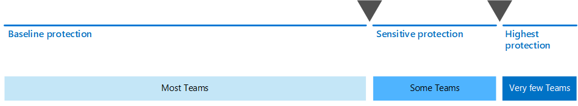

# Configurar la colaboración moderna con Microsoft 365Set up secure collaboration with Microsoft 365

Poder compartir fácilmente información con las personas correctas a la vez que se evita el uso compartido en exceso es clave para el éxito de una organización.Being able to easily share information with the right people while preventing oversharing is key to an organization's success. Esto incluye poder compartir datos confidenciales de forma segura solo con aquellos que deberían tener acceso a ellos.This includes being able to share sensitive data safely with only those who should have access to it. Según el proyecto, esto puede incluir el uso compartido de datos confidenciales con personas ajenas a la organización.Depending on the project, this might include sharing sensitive data with people outside your organization.

> [!VIDEO https://www.microsoft.com/videoplayer/embed/RWxMmL?autoplay=false]

Esta guía de soluciones de colaboración incluye dos componentes que le ayudarán:This collaboration solution guidance includes two components to help you:
- Implementar Microsoft Teams con el nivel de protección adecuado para cada proyectoDeploy Microsoft Teams with the right level of protection for each project
- Configurar el uso compartido externo con las opciones de seguridad adecuadas para cada proyectoConfigure external sharing with appropriate security settings for each project

Si las herramientas de colaboración de contenido versátiles y fáciles de usar no están disponibles, los usuarios a menudo colaborarán por correo electrónico con documentos.If versatile and easy-to-use content collaboration tools aren't available, users will often collaborate by emailing documents. Este es un método de colaboración tedioso y propenso a errores y puede aumentar el riesgo de compartir información de forma inadecuada.This is a tedious and error-prone method of collaboration, and can increase the risk of inappropriate sharing of information. Si a los usuarios les resulta demasiado difícil compartir información, podrían volver a usar productos de consumidor que no están regido por TI.If people find sharing information too difficult, they could revert to using consumer products that are not governed by IT. Esto puede suponer un riesgo aún mayor.This can pose an even greater risk.

Con Microsoft 365, puede implementar Teams con una variedad de configuraciones que le ayudarán a:With Microsoft 365, you can deploy Teams with a variety of configurations that help:

- Proteger la propiedad intelectualProtect your intellectual property
- Habilitar la colaboración sencillaEnable easy collaboration
- Crear un equilibrio entre la seguridad y la facilidad de uso que aumente la satisfacción del usuario y reduzca el riesgo de sombras de ITCreate a balance between security and usability that increases user satisfaction and reduces the risk of shadow IT

La mayoría de las organizaciones tienen una variedad de información, con distintos grados de confidencialidad y distintos grados de impacto en la empresa si la información se comparte de forma inadecuada.Most organizations have a variety of information, with varying degrees of sensitivity and varying degrees of business impact if the information is inappropriately shared. Dependiendo de la confidencialidad de un elemento de información determinado, es posible que desee permitir el uso compartido con:Depending on the sensitivity of a given piece of information, you may want to allow sharing with:

- Cualquiera (no autenticado)Anyone (unauthenticated)
- Personas dentro de la organizaciónPeople inside the organization
- Personas específicas dentro de la organizaciónSpecific people inside the organization
- Personas específicas dentro y fuera de la organizaciónSpecific people inside and outside the organization

La información, como los folletos de marketing, está pensada para compartir ampliamente fuera de la organización.Information such as marketing brochures are meant for sharing broadly outside the organization. La información, como los menús de cafetería, no está destinada al uso compartido externo, pero no tendría ningún impacto en la empresa si se compartiese externamente.Information such as cafeteria menus aren't meant for external sharing, but would have no business impact if they were shared externally. Estos tipos de información necesitan poca o ninguna protección.These types of information need little or no protection.

Esos mismos folletos de marketing, mientras están en desarrollo, solo se pueden compartir dentro de la organización.Those same marketing brochures, while under development, might only be shared inside the organization. En este caso, la configuración de uso compartido predeterminada en Teams puede ser suficiente.In this case, the default sharing settings in Teams may be sufficient.

La información sobre un nuevo producto que está en desarrollo puede considerarse confidencial, incluso dentro de la organización.Information about a new product that is under development might be considered sensitive, even within the organization. Un mayor grado de protección podría ser apropiado en este caso.A greater degree of protection might be appropriate in this case. Puede restringir el acceso a esta información a los miembros de un equipo específico, por ejemplo.You could restrict access to this information to members of a specific team, for example. Según el proyecto, es posible que deba colaborar con personas ajenas a la organización, como un proveedor o una organización asociada.Depending on the project, you may need to collaborate with people outside your organization, such as a vendor or partner organization.

La información que es fundamental para el éxito de su organización o que tiene requisitos de seguridad o cumplimiento estrictos puede requerir niveles de protección aún mayores.Information that is critical to your organization's success, or has stringent security or compliance requirements might require even greater levels of protection.

Para todos los escenarios mencionados anteriormente, puede usar los equipos de Microsoft Teams para almacenar, compartir y colaborar en la información.For all the scenarios noted above, you can use teams in Microsoft Teams to store, share, and collaborate on the information. 

Para configurar la colaboración segura, use estas funciones y características de Microsoft 365.To configure secure collaboration, you use these Microsoft 365 capabilities and features.

| Producto o componenteProduct or component | Funcionalidad o característicaCapability or feature | LicenciasLicensing |
|:-------|:-----|:-------|
| Microsoft Defender para Office 365Microsoft Defender for Office 365 | Datos adjuntos seguros para SPO, OneDrive y Teams; Documentos seguros; Vínculos seguros para TeamsSafe Attachments for SPO, OneDrive and Teams; Safe Documents; Safe Links for Teams    | Microsoft 365 E1, E3 y E5Microsoft 365 E1, E3 and E5 |
| SharePointSharePoint    | Directivas de uso compartido de sitios y archivos, permisos de uso compartido de sitios, vínculos para compartir, solicitudes de acceso, configuración de uso compartido de invitados del sitioSite and file sharing policies, Site sharing permissions, Sharing links, Access requests, Site guest sharing settings | Microsoft 365 E1, E3 y E5Microsoft 365 E1, E3 and E5 |
| Microsoft TeamsMicrosoft Teams   | Acceso de invitado, equipos privados, canales privadosGuest access, private teams, private channels | Microsoft 365 E1, E3 y E5Microsoft 365 E1, E3 and E5 |
| Cumplimiento de Microsoft 365Microsoft 365 Compliance  | Etiquetas de confidencialidadSensitivity labels    | Microsoft 365 E3 y E5Microsoft 365 E3 and E5 |

### Uso de Teams para todo tipo de datosUsing Teams for all kinds of data

Para administrar el acceso a la información con diferentes sensibilidades, hemos desarrollado tres niveles diferentes de [protección para Teams.](configure-teams-three-tiers-protection.md)To manage access to information with different sensitivities, we've developed [three different tiers of protection for Teams](configure-teams-three-tiers-protection.md). Puede personalizar cualquiera de estos niveles para satisfacer mejor las necesidades o su empresa.You can customize any of these tiers to better address the needs or your business. 

Estos niveles (línea  *base,* confidencial y altamente confidencial) aumentan gradualmente las protecciones que ayudan a evitar el exceso de uso compartido y la posible fuga de información, como se muestra en la tabla siguiente. These tiers - *baseline*, *sensitive*, and *highly sensitive* - gradually increase the protections that help prevent oversharing and potential information leakage, as shown in the following table.

|-|**Nivel de línea base****Baseline tier**|**Nivel confidencial****Sensitive tier**|**Nivel altamente confidencial****Highly sensitive tier**|
|:--|:-----------|:------------|:-------------------|
|Equipo público o privadoPublic or private team|AmbosEither|PrivatePrivate|PrivatePrivate|
|Uso compartido no autenticadoUnauthenticated sharing|BlockedBlocked|BlockedBlocked|BlockedBlocked|
|Uso compartido de archivosFile sharing|PermitidoAllowed|PermitidoAllowed|Solo los propietarios del equipo pueden compartir.Only team owners can share.|
|Pertenencia al equipoTeam membership|Cualquier persona puede unirse a equipos públicos.Anyone can join public teams. Se requiere la aprobación del propietario del equipo para unirse a equipos privados.Team owner approval required to join private teams.|Se requiere la aprobación del propietario del equipo para unirse.Team owner approval required to join.|Se requiere la aprobación del propietario del equipo para unirse.Team owner approval required to join.|
|Cifrado de documentosDocument encryption|||Disponible con etiqueta de confidencialidadAvailable with sensitivity label|
|Uso compartido de invitadosGuest sharing|PermitidoAllowed|Se puede permitir o bloquearCan be allowed or blocked|Se puede permitir o bloquearCan be allowed or blocked|
|Dispositivos no administradosUnmanaged devices|Sin restriccionesNo restriction|Acceso solo webWeb-only access|BlockedBlocked|

La configuración de estos niveles implica lo siguiente:Configuring these tiers involves:

- Configuración de opciones en Teams para el acceso de invitados y canales privadosConfiguring settings in Teams for guest access and private channels
- Configuración de opciones en el sitio de SharePoint asociado a un equipo para el uso compartido interno e invitado, las solicitudes de acceso y los vínculos de uso compartidoConfiguring settings in a team's associated SharePoint site for internal and guest sharing, access requests, and sharing links
- Para los *niveles confidenciales* y *altamente* confidenciales, configurar etiquetas de confidencialidad para clasificar los equipos y controlar el uso compartido de invitados y el acceso desde dispositivos no administradosFor the *sensitive* and *highly sensitive* tiers, configuring sensitivity labels to classify the teams, and control guest sharing and access from unmanaged devices
- Para el *nivel altamente* confidencial, configurar una etiqueta de confidencialidad para cifrar los documentos a los que se aplicaFor the *highly sensitive* tier, configuring a sensitivity label to encrypt the documents to which it is applied

Comience con el nivel de línea base  y, a continuación, agregue equipos que usen los niveles confidenciales y altamente confidenciales según sea necesario para ayudar a proteger la información de su organización. Start with the baseline tier, and then add teams that use the *sensitive* and *highly sensitive* tiers as needed to help protect the information in your organization. Vea estos recursos para empezar:See these resources to get started:

- [Configure equipos con la protección de base de referenciaConfigure teams with baseline protection](configure-teams-baseline-protection.md)
- [Configure equipos con protección de datos confidencialesConfigure teams with protection for sensitive data](configure-teams-sensitive-protection.md)
- [Configuración de equipos con protección de datos con un nivel de confidencialidad altoConfigure teams with protection for highly sensitive data](configure-teams-highly-sensitive-protection.md)

Si tiene un proyecto altamente confidencial que requiere protección adicional contra el uso compartido incluso dentro de su organización, puede configurar un equipo que use su propia etiqueta de confidencialidad para cifrar archivos de modo que solo los miembros del equipo puedan leerlos.If you have a highly sensitive project that requires additional protection from sharing even within your organization, you can configure a team that uses its own sensitivity label to encrypt files so that only team members can read them. Consulte [Configurar un equipo con aislamiento de seguridad](secure-teams-security-isolation.md) para obtener más información.See [Configure a team with security isolation](secure-teams-security-isolation.md) for details.

### Compartir con personas de fuera de la organizaciónSharing with people outside your organization

Es posible que tenga que [compartir información de cualquier confidencialidad con personas ajenas a su organización.](collaborate-with-people-outside-your-organization.md)You may need to [share information of any sensitivity with people outside your organization](collaborate-with-people-outside-your-organization.md). Esto puede oscilar entre compartir un único documento con una sola persona o colaborar en un proyecto importante con una organización de socios de gran tamaño o escritores de todo el mundo.This could range from sharing a single document with a single person to collaborating on a major project with a large partner organization or freelancers from around the world. En Microsoft 365, esta gama de uso compartido externo se puede realizar fácilmente y con las medidas de seguridad adecuadas para ayudar a proteger su información confidencial.In Microsoft 365, this range of external sharing can be done easily and with the appropriate safeguards to help protect your sensitive information.

Estos recursos le ayudarán a empezar a configurar el entorno para colaborar con personas ajenas a su organización:These resources will help you get started with setting up your environment for collaborating with people outside your organization:

- [Colaborar en documentos para](collaborate-on-documents.md) compartir archivos individuales de carpetas.[Collaborate on documents](collaborate-on-documents.md) for sharing individual files of folders.
- [Colaborar en un sitio para](collaborate-in-site.md) colaborar con invitados en un sitio de SharePoint.[Collaborate in a site](collaborate-in-site.md) for collaborating with guests in a SharePoint site.
- [Colaborar como equipo para](collaborate-as-team.md) colaborar con invitados en un equipo.[Collaborate as a team](collaborate-as-team.md) for collaborating with guests in a team.

En función de la confidencialidad de la información que se comparta, puede agregar medidas de seguridad para ayudar a evitar el exceso de uso compartido.Depending on the sensitivity of the information being shared, you can add safeguards to help prevent oversharing. Estos recursos le ayudarán a configurar las protecciones que necesita para su organización:These resources will help you set up the protections that you need for your organization:

- [Prácticas recomendadas para compartir archivos y carpetas con usuarios no autenticadosBest practices for sharing files and folders with unauthenticated users](best-practices-anonymous-sharing.md)
- [Limitar la exposición accidental de archivos al compartirlos con usuarios externos a la organizaciónLimit accidental exposure to files when sharing with people outside your organization](share-limit-accidental-exposure.md)
- [Crear un entorno seguro de uso compartido para invitadosCreate a secure guest sharing environment](create-secure-guest-sharing-environment.md)

Si tiene un proyecto importante con una organización asociada, puede usar Azure Entitlement Management para administrar los invitados de esa organización en un equipo que haya configurado para el proyecto.If you have a major project with a partner organization, you can use Azure Entitlement Management to manage the guests from that organization in a team that you set up for the project. Consulte [Crear una extranet B2B con invitados administrados para](b2b-extranet.md) obtener más información.See [Create a B2B extranet with managed guests](b2b-extranet.md) for details.

## Implementar la solución de colaboración seguraDeploy the secure collaboration solution

Cuando esté listo para implementar esta solución, siga estos pasos:When you're ready to deploy this solution, continue with these steps:
1. Configure los [tres niveles diferentes de protección para Teams.](configure-teams-three-tiers-protection.md)Configure the [three different tiers of protection for Teams](configure-teams-three-tiers-protection.md).
2. Configure las opciones para [compartir información de cualquier confidencialidad con personas ajenas a su organización.](collaborate-with-people-outside-your-organization.md)Configure settings for [sharing information of any sensitivity with people outside your organization](collaborate-with-people-outside-your-organization.md).

## Vea tambiénSee also

[Documentación de Seguridad de Microsoft 365Microsoft 365 security documentation](https://docs.microsoft.com/microsoft-365/security)

[Documentación de cumplimiento de Microsoft 365Microsoft 365 compliance documentation](https://docs.microsoft.com/microsoft-365/compliance)

[Le damos la bienvenida a Microsoft TeamsWelcome to Microsoft Teams](https://docs.microsoft.com/MicrosoftTeams/Teams-overview)
