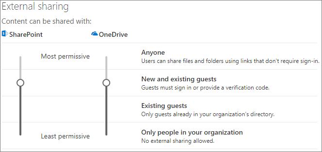

# Limitar la exposición accidental de archivos al compartirlos con usuarios externos a la organizaciónLimit accidental exposure to files when sharing with people outside your organization

Al compartir archivos y carpetas con usuarios externos a la organización, hay una amplia variedad de opciones para reducir las posibilidades de compartir por error información confidencial.When sharing files and folders with people outside your organization, there are a variety of options to reduce the chances of accidentally sharing sensitive information. Puede elegir entre las opciones de este artículo para satisfacer las necesidades de su organización.You can choose from the options in this article to best meet the needs of your organization.

## Usar los procedimientos recomendados para los vínculos de tipo "Cualquiera"Use best practices for Anyone links

Si los usuarios de su organización necesitan llevar a cabo un uso compartido sin autenticar, pero le preocupa que los usuarios sin autenticar modifiquen el contenido, lea los [Procedimientos recomendados para el uso compartido sin autenticar](best-practices-anonymous-sharing.md) para obtener instrucciones sobre cómo trabajar con el uso compartido sin autenticar en su organización.If people in your organization need to do unauthenticated sharing, but you're concerned about unauthenticated people modifying content, read [Best practices for unauthenticated sharing](best-practices-anonymous-sharing.md) for guidance on how to work with unauthenticated sharing in your organization.

## Desactivar vínculos de tipo CualquieraTurn off Anyone links

Se recomienda dejar habilitados los vínculos de tipo *Cualquiera* para el contenido adecuado, ya que es la manera más sencilla de compartir y puede ayudar a reducir el riesgo de que los usuarios soliciten otras soluciones que no están controladas por el departamento de TI.We recommend leaving *Anyone* links enabled for appropriate content because it's the easiest way to share and can help reduce the risk of users seeking other solutions that are outside the control of your IT department. Los vínculos de tipo *Cualquiera* se pueden reenviar a otros usuarios, pero el acceso al archivo solo está disponible para los usuarios que tengan el vínculo.*Anyone* links can be forwarded to others, but file access is only available to those who have the link.

Si quiere que los usuarios externos a la organización siempre tengan que autenticarse al obtener acceso al contenido de SharePoint, Grupos o Teams, puede desactivar el uso compartido de tipo *Cualquiera*.If you always want people outside your organization to authenticate when accessing content in SharePoint, Groups, or Teams, you can turn off *Anyone* sharing. Esto impedirá que los usuarios compartan el contenido sin autenticar.This will prevent users from unauthenticated sharing of content.

Si deshabilita los vínculos de tipo *Cualquiera*, los usuarios podrán seguir compartiendo con los invitados mediante los vínculos de *Personas específicas*.If you disable *Anyone* links, users can still easily share with guests using *Specific people* links. En este caso, todos los usuarios externos a la organización tendrán que autenticarse antes de poder tener acceso al contenido compartido.In this case, all people outside your organization will be required to authenticate before they can access the shared content.

En función de sus necesidades, puede deshabilitar los vínculos de tipo *Cualquiera* para sitios específicos o para toda la organización.Depending on your needs, you can disable *Anyone* links for specific sites, or for your whole organization.

Para desactivar los vínculos de tipo *Cualquiera* de su organización, haga lo siguiente: To turn off *Anyone* links for your organization
1. En el Centro de administración de SharePoint, en el panel de navegación izquierdo, haga clic en **Uso compartido**.In the SharePoint admin center, in the left navigation, click **Sharing**.
2. Establezca la configuración de uso compartido externo de SharePoint como **Invitados nuevos y existentes**.Set the SharePoint external sharing settings to **New and existing guests**. 
   
3. Haga clic en **Guardar**.Click **Save**.

Desactivar los vínculos de tipo *Cualquiera*To turn off *Anyone* links for a site
1. En el Centro de administración de SharePoint, en el panel de navegación izquierdo, expanda **Sitios** y haga clic en **Sitios activos**.In the SharePoint admin center, in the left navigation, expand **Sites** and click **Active sites**.
2. Seleccione el sitio para el equipo recién creado.Select the site for the team that you just created.
3. En la cinta de opciones, haga clic en **Uso compartido**.In the ribbon, click **Sharing**.
4. Asegúrese de que el uso compartido está establecido como **Invitados nuevos y existentes**.Ensure that sharing is set to **New and existing guests**. 
   
5. Si ha realizado cambios, haga clic en **Guardar**.If you made changes, click **Save**.

## Filtrado de dominiosDomain filtering

Puede usar las listas de dominios permitidos o rechazados para determinar los dominios que los usuarios pueden compartir con personas externas a la organización.You can use domain allow or deny lists to determine domains your users can share with people outside your organization.

Con una lista de dominios permitidos, puede especificar una lista de dominios en los que los usuarios de su organización pueden compartir con usuarios externos a la organización.With an allow list, you can specify a list of domains where users in your organization can share with people outside your organization. El uso compartido con otros dominios está bloqueado.Sharing with to other domains is blocked. Si su organización solo colabora con usuarios de una lista de dominios específicos, puede usar esta característica para evitar el uso compartido con otros dominios.If your organization only collaborates with people from a list of specific domains, you can use this feature to prevent sharing with other domains.

Con una lista de dominios rechazados, puede especificar una lista de dominios desde los que los usuarios de su organización no pueden compartir contenido con usuarios externos a la organización.With a deny list, you can specify a list of domains from which users in your organization cannot share with people outside your organization. El uso compartido con dominios en la lista está bloqueado.Sharing with the listed domains is blocked. Esto puede resultar útil si tiene competidores que, por ejemplo, no quiere que tengan acceso al contenido de su organización.This can be useful if you have competitors, for example, who you want to prevent from accessing content in your organization.

Las listas de permitidos y rechazados solo afectan al uso compartido con invitados.The allow and deny lists only affect sharing with guests. Los usuarios aún podrán compartir con personas de dominios prohibidos mediante el uso de vínculos de tipo *Cualquiera* si no los ha deshabilitado.Users can still share with people from prohibited domains by using *Anyone* links if you haven't disabled them. Para obtener los mejores resultados con las listas de dominios permitidos y de denegación, considere la posibilidad de deshabilitar los vínculos de tipo *Cualquiera* como se ha descrito anteriormente.For best results with domain allow and deny lists, consider disabling *Anyone* links as described above.

Para configurar una lista de dominios permitidos o rechazados para usuarios externos a la organizaciónTo set up a domain allow or deny list for people outside your organization
1. En el centro de administración de SharePoint, en el panel de navegación izquierdo, haga clic en **Uso compartido**.In the SharePoint admin center, in the left navigation, click **Sharing**.
2. En **Configuración avanzada para uso compartido externo**, active la casilla **Limitar uso compartido externo por dominio**.Under **Advanced settings for external sharing**, select the **Limit external sharing by domain** check box.
3. Haga clic en **Agregar dominios**.Click **Add domains**.
4. Seleccione si quiere bloquear dominios, escriba los dominios y haga clic en **Aceptar**.Select whether you want to block domains, type the domains, and click **OK**. 
   
5. Haga clic en **Guardar**.Click **Save**.

Si quiere limitar el uso compartido de dominios en un nivel más alto que SharePoint y OneDrive, puede [permitir o bloquear las invitaciones a los usuarios B2B desde organizaciones específicas](https://docs.microsoft.com/azure/active-directory/b2b/allow-deny-list) de Azure Active Directory.If you want to limit sharing by domain at a higher level than SharePoint and OneDrive, you can [allow or block invitations to B2B users from specific organizations](https://docs.microsoft.com/azure/active-directory/b2b/allow-deny-list) in Azure Active Directory. (Debe configurar la [integración de SharePoint y OneDrive con la versión preliminar de B2B de Azure AD](https://docs.microsoft.com/sharepoint/sharepoint-azureb2b-integration-preview) para que estas opciones de configuración afecten a SharePoint y OneDrive).(You must configure the [SharePoint and OneDrive integration with Azure AD B2B Preview](https://docs.microsoft.com/sharepoint/sharepoint-azureb2b-integration-preview) for these settings to affect SharePoint and OneDrive.)

## Limitar el uso compartido de archivos, carpetas y sitios con usuarios externos a la organización a grupos de seguridad específicosLimit sharing of files, folders, and sites with people outside your organization to specified security groups

Puede restringir el uso compartido de archivos, carpetas y sitios con usuarios externos a la organización a los miembros de un grupo de seguridad específico.You can restrict sharing of files, folders, and sites with people outside your organization to members of a specific security group. Esto es útil si quiere habilitar el uso compartido externo, pero con un flujo de trabajo de aprobación o un proceso de solicitud.This is useful if you want to enable external sharing, but with an approval workflow or request process.

Para limitar el uso compartido externo a los miembros de un grupo de seguridadTo limit external sharing to members of a security group
1. En el centro de administración de SharePoint, en el panel de navegación izquierdo, haga clic en **Uso compartido**.In the SharePoint admin center, in the left navigation, click **Sharing**.
2. En **Otras opciones de configuración**.Under **Other settings**. Seleccione el vínculo **Limitar el uso compartido externo a grupos de seguridad específicos**.follow the **Limit external sharing to specific security groups** link.
3. En **Quién puede compartir elementos con usuarios ajenos a la organización**, seleccione una o ambas casillas: a.Under **Who can share outside your organization**, select one or both of the check boxes: a. **Permitir que solo los usuarios de los grupos de seguridad seleccionados compartan con usuarios externos autenticados** para especificar un grupo de seguridad que pueda compartir con usuarios autenticados b.**Let only users in selected security groups share with authenticated external users** to specify a security group that can share with authenticated users b. **Permitir que solo los usuarios de los grupos de seguridad seleccionados compartan con usuarios externos y con vínculos anónimos** para especificar un grupo de seguridad que pueda compartir con usuarios autenticados y con vínculos de tipo Cualquiera.**Let only users in selected security groups share with authenticated external users and using anonymous links** to specify a security group that can share with authenticated users and by using Anyone links
4. Haga clic en **Aceptar**.Click **OK**.

Tenga en cuenta que esto afecta a archivos, carpetas y sitios, pero no a los grupos de Microsoft 365 o Teams.Note that this affects files, folders, and sites, but not Microsoft 365 groups or Teams. Cuando los miembros inviten a invitados a un grupo privado de Microsoft 365 o Microsoft Teams, la invitación se enviará al propietario del grupo o equipo para que la apruebe.When members invite guests to a private Microsoft 365 group or a private team in Microsoft Teams, the invitation is sent to the group or team owner for approval.

## Consulta tambiénSee Also

[Crear un entorno seguro de uso compartido para invitadosCreate a secure guest sharing environment](create-secure-guest-sharing-environment.md)

[Procedimientos recomendados para compartir archivos y carpetas con usuarios anónimosBest practices for sharing files and folders with anonymous users](best-practices-anonymous-sharing.md)