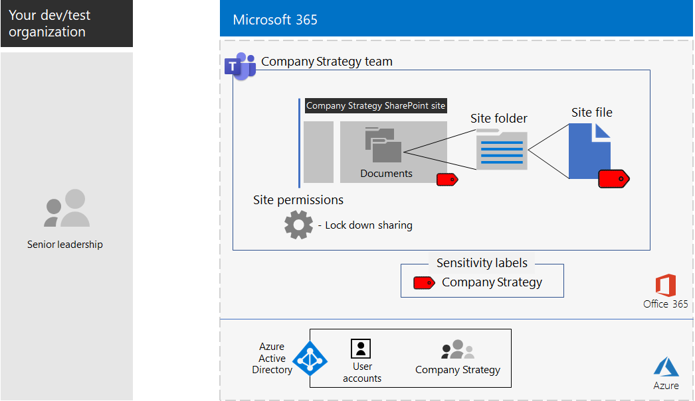

# <a name="configure-a-team-with-security-isolation-in-a-devtest-environment"></a><span data-ttu-id="28b64-103">Configurar un equipo con aislamiento de seguridad en un entorno de desarrollo y pruebas</span><span class="sxs-lookup"><span data-stu-id="28b64-103">Configure a team with security isolation in a dev/test environment</span></span>

<span data-ttu-id="28b64-104">Este artículo proporciona instrucciones paso a paso para crear un [equipo con de aislamiento de seguridad](secure-teams-security-isolation.md) en un entorno de desarrollo y prueba.</span><span class="sxs-lookup"><span data-stu-id="28b64-104">This article provides step-by-step instructions to create a [team with security isolation](secure-teams-security-isolation.md) in a dev/test environment.</span></span>


<span data-ttu-id="28b64-106">Use este entorno de desarrollo y pruebas para experimentar y adaptar la configuración a sus necesidades específicas antes de implementar este tipo de equipo en producción.</span><span class="sxs-lookup"><span data-stu-id="28b64-106">Use this dev/test environment to experiment and fine-tune settings for your specific needs before deploying this type of team in production.</span></span>
  
## <a name="phase-1-build-out-your-microsoft-365-enterprise-test-environment"></a><span data-ttu-id="28b64-107">Fase 1: Crear el entorno de pruebas de Microsoft 365 Enterprise</span><span class="sxs-lookup"><span data-stu-id="28b64-107">Phase 1: Build out your Microsoft 365 Enterprise test environment</span></span>

<span data-ttu-id="28b64-108">Si solamente quiere probar los equipos confidenciales y extremadamente confidenciales de forma ligera con los requisitos mínimos, siga las instrucciones de [Configuración básica ligera](https://docs.microsoft.com/microsoft-365/enterprise/lightweight-base-configuration-microsoft-365-enterprise).</span><span class="sxs-lookup"><span data-stu-id="28b64-108">If you just want to test sensitive and highly sensitive teams in a lightweight way with the minimum requirements, follow the instructions in [Lightweight base configuration](https://docs.microsoft.com/microsoft-365/enterprise/lightweight-base-configuration-microsoft-365-enterprise).</span></span>

<span data-ttu-id="28b64-109">Si quiere probar los equipos confidenciales y con un nivel de confidencialidad alto en una empresa simulada, siga las instrucciones de [Sincronización de hash de contraseñas](https://docs.microsoft.com/microsoft-365/enterprise/password-hash-sync-m365-ent-test-environment).</span><span class="sxs-lookup"><span data-stu-id="28b64-109">If you want to test sensitive and highly sensitive teams in a simulated enterprise, follow the instructions in [Password hash synchronization](https://docs.microsoft.com/microsoft-365/enterprise/password-hash-sync-m365-ent-test-environment).</span></span>

>[!Note]
><span data-ttu-id="28b64-110">Probar equipos con aislamiento de seguridad no requiere el entorno de pruebas de una empresa simulada, que incluye una intranet simulada conectada a Internet y la sincronización de directorios de un bosque de Active Directory Domain Services (AD DS).</span><span class="sxs-lookup"><span data-stu-id="28b64-110">Testing an team with security isolation does not require the simulated enterprise test environment, which includes a simulated intranet connected to the Internet and directory synchronization for an Active Directory Domain Services (AD DS) forest.</span></span> <span data-ttu-id="28b64-111">Aquí se ofrece como una opción para que pueda probar un equipo con aislamiento de seguridad y experimentar con ella en un entorno que representa una organización típica.</span><span class="sxs-lookup"><span data-stu-id="28b64-111">It is provided here as an option so that you can test a team with security isolation and experiment with it in an environment that represents a typical organization.</span></span>
>
    
## <a name="phase-2-create-and-configure-your-azure-active-directory-ad-group-and-users"></a><span data-ttu-id="28b64-112">Fase 2: Crear y configurar los usuarios y grupos de Azure Active Directory (AD)</span><span class="sxs-lookup"><span data-stu-id="28b64-112">Phase 2: Create and configure your Azure Active Directory (AD) group and users</span></span>

<span data-ttu-id="28b64-113">En esta fase se crea y configuran un grupo y usuarios de Azure AD para la organización ficticia.</span><span class="sxs-lookup"><span data-stu-id="28b64-113">In this phase, you create and configure an Azure AD group and users for your fictional organization.</span></span>
  
<span data-ttu-id="28b64-114">En primer lugar, cree un grupo de seguridad con Azure Portal.</span><span class="sxs-lookup"><span data-stu-id="28b64-114">First, create a security group with the Azure portal.</span></span>
  
1. <span data-ttu-id="28b64-115">Cree una pestaña aparte en el explorador y, después, vaya a Azure Portal, en [https://portal.azure.com](https://portal.azure.com).</span><span class="sxs-lookup"><span data-stu-id="28b64-115">Create a separate tab in your browser, and then go to the Azure portal at [https://portal.azure.com](https://portal.azure.com).</span></span> <span data-ttu-id="28b64-116">Si es necesario, inicie sesión con las credenciales de la cuenta de administrador global de la suscripción de pago o de la suscripción de prueba de Microsoft 365 E5.</span><span class="sxs-lookup"><span data-stu-id="28b64-116">If needed, sign in with the credentials of the global administrator account for your Microsoft 365 E5 trial or paid subscription.</span></span>
    
2. <span data-ttu-id="28b64-117">En Azure Portal, haga clic en **Azure Active Directory > Grupos**.</span><span class="sxs-lookup"><span data-stu-id="28b64-117">In the Azure portal, click **Azure Active Directory > Groups**.</span></span>
    
3. <span data-ttu-id="28b64-118">En la hoja **Todos los grupos**, haga clic en **+ Nuevo grupo**.</span><span class="sxs-lookup"><span data-stu-id="28b64-118">On the **Groups - All groups** blade, click **+ New group**.</span></span>
    
4. <span data-ttu-id="28b64-119">En la hoja **Grupo**:</span><span class="sxs-lookup"><span data-stu-id="28b64-119">On the **Group** blade:</span></span>
    
  - <span data-ttu-id="28b64-120">Seleccione **Seguridad** en **Tipo de grupo**.</span><span class="sxs-lookup"><span data-stu-id="28b64-120">Select **Security** in **Group type**.</span></span>
    
  - <span data-ttu-id="28b64-121">Escriba **Directivos** en **Nombre**.</span><span class="sxs-lookup"><span data-stu-id="28b64-121">Type **C-Suite** in **Name**.</span></span>
    
  - <span data-ttu-id="28b64-122">Seleccione **Asignada** en **Tipo de pertenencia**.</span><span class="sxs-lookup"><span data-stu-id="28b64-122">Select **Assigned** in **Membership type**.</span></span>
      
5. <span data-ttu-id="28b64-123">Haga clic en **Crear** y, después, cierre la hoja **Grupo**.</span><span class="sxs-lookup"><span data-stu-id="28b64-123">Click **Create**, and then close the **Group** blade.</span></span>
    
<span data-ttu-id="28b64-124">Después, configure la licencia automática para que los miembros del grupo **C-Suite** nuevo se asignen automáticamente una licencia de Microsoft 365 E5.</span><span class="sxs-lookup"><span data-stu-id="28b64-124">Next, configure automatic licensing so that members of the new **C-Suite** group is automatically assigned a Microsoft 365 E5 license.</span></span>
  
1. <span data-ttu-id="28b64-125">En Azure Portal, haga clic en **Azure Active Directory > Licencias > Todos los productos**.</span><span class="sxs-lookup"><span data-stu-id="28b64-125">In the Azure portal, click **Azure Active Directory > Licenses > All products**.</span></span>
    
2. <span data-ttu-id="28b64-126">En la lista, seleccione **Microsoft 365 Enterprise E5** y haga clic en **Asignar**.</span><span class="sxs-lookup"><span data-stu-id="28b64-126">In the list, select **Microsoft 365 Enterprise E5**, and then click **Assign**.</span></span>
    
3. <span data-ttu-id="28b64-127">En la hoja **Asignar licencia**, haga clic en **Usuarios y grupos**.</span><span class="sxs-lookup"><span data-stu-id="28b64-127">In the **Assign license** blade, click **Users and groups**.</span></span>
    
4. <span data-ttu-id="28b64-128">En la lista de grupos, seleccione el grupo de **C-Suite**</span><span class="sxs-lookup"><span data-stu-id="28b64-128">In the list of groups, select the **C-Suite** group.</span></span>
    
5. <span data-ttu-id="28b64-129">Haga clic en **Seleccionar** y, después, en **Asignar**.</span><span class="sxs-lookup"><span data-stu-id="28b64-129">Click **Select**, and then click **Assign**.</span></span>
    
6. <span data-ttu-id="28b64-130">Cierre la pestaña Azure Portal del explorador.</span><span class="sxs-lookup"><span data-stu-id="28b64-130">Close the Azure portal tab in your browser.</span></span>
    
<span data-ttu-id="28b64-131">Después, [conéctese al módulo de PowerShell de Azure Active Directory para Graph](https://docs.microsoft.com/office365/enterprise/powershell/connect-to-office-365-powershell#connect-with-the-azure-active-directory-powershell-for-graph-module).</span><span class="sxs-lookup"><span data-stu-id="28b64-131">Next, [connect with the Azure Active Directory PowerShell for Graph module](https://docs.microsoft.com/office365/enterprise/powershell/connect-to-office-365-powershell#connect-with-the-azure-active-directory-powershell-for-graph-module).</span></span>
  
<span data-ttu-id="28b64-132">Rellene el nombre de la organización, la ubicación y una contraseña común; después, ejecute los siguientes comandos desde el símbolo del sistema de PowerShell o el entorno de scripts integrado (ISE) para crear nuevas cuentas de usuario y agregarlas al grupo de C-Suite:</span><span class="sxs-lookup"><span data-stu-id="28b64-132">Fill in your organization name, your location, and a common password, and then run these commands from the PowerShell command prompt or Integrated Script Environment (ISE) to create new user accounts and add them to the C-Suite group:</span></span>
  
```powershell
$orgName="<organization name, such as contoso-test for the contoso-test.onmicrosoft.com trial subscription domain name>"
$location="<the ISO ALPHA2 country code, such as US for the United States>"
$commonPassword="<common password for all the new accounts>"

$PasswordProfile=New-Object -TypeName Microsoft.Open.AzureAD.Model.PasswordProfile
$PasswordProfile.Password=$commonPassword

$groupName="C-Suite"
$userNames=@("CEO","CFO","CIO") 
$groupID=(Get-AzureADGroup | Where { $_.DisplayName -eq $groupName }).ObjectID
ForEach ($element in $userNames){ 
New-AzureADUser -DisplayName $element -PasswordProfile $PasswordProfile -UserPrincipalName ($element + "@" + $orgName + ".onmicrosoft.com") -AccountEnabled $true -MailNickName $element -UsageLocation $location 
Add-AzureADGroupMember -RefObjectId (Get-AzureADUser | Where { $_.DisplayName -eq $element }).ObjectID -ObjectId $groupID
}
```

> [!NOTE]
> <span data-ttu-id="28b64-133">Se usa una contraseña común para automatizar y facilitar la configuración de un entorno de prueba y desarrollo.</span><span class="sxs-lookup"><span data-stu-id="28b64-133">The use of a common password here is for automation and ease of configuration for a dev/test environment.</span></span> <span data-ttu-id="28b64-134">Evidentemente, esto no se recomienda en el caso de suscripciones de producción.</span><span class="sxs-lookup"><span data-stu-id="28b64-134">Obviously, this is highly discouraged for production subscriptions.</span></span> 
  
<span data-ttu-id="28b64-135">Después, siga estos pasos para comprobar que la asignación de licencias basada en grupos funcione correctamente.</span><span class="sxs-lookup"><span data-stu-id="28b64-135">Use these steps to verify that group-based licensing is working correctly.</span></span>
  
1. <span data-ttu-id="28b64-136">Inicie sesión en el [Centro de administración de Microsoft 365](https://admin.microsoft.com).</span><span class="sxs-lookup"><span data-stu-id="28b64-136">Sign in to the [Microsoft 365 admin center](https://admin.microsoft.com).</span></span>
    
2. <span data-ttu-id="28b64-137">En la nueva pestaña **Centro de administración de Microsoft 365** del explorador, haga clic en **Usuarios**.</span><span class="sxs-lookup"><span data-stu-id="28b64-137">From the new **Microsoft 365 admin center** tab of your browser, click **Users**.</span></span>
    
3. <span data-ttu-id="28b64-138">En la lista de usuarios, haga clic en **CEO** (Consejero delegado).</span><span class="sxs-lookup"><span data-stu-id="28b64-138">In the list of users, click **CEO**.</span></span>
    
4. <span data-ttu-id="28b64-139">En el panel que muestra las propiedades de la cuenta de usuario **CEO**, compruebe que dicha cuenta tiene asignada la licencia **Microsoft 365 Enterprise E5** en **Licencias de productos**.</span><span class="sxs-lookup"><span data-stu-id="28b64-139">In the pane that lists the properties of the **CEO** user account, verify that it has been assigned the **Microsoft 365 Enterprise E5** license in **Product licenses**.</span></span>
    
## <a name="phase-3-create-your-team"></a><span data-ttu-id="28b64-140">Fase 3: Crear el equipo</span><span class="sxs-lookup"><span data-stu-id="28b64-140">Phase 3: Create your team</span></span>

<span data-ttu-id="28b64-141">En esta fase, debe crear y configurar un equipo con aislamiento de seguridad para que los miembros del equipo de directiva puedan colaborar en la estrategia de la empresa.</span><span class="sxs-lookup"><span data-stu-id="28b64-141">In this phase, you create and configure a team with security isolation for members of the senior leadership team to collaborate on company strategy.</span></span>

<span data-ttu-id="28b64-142">Antes de proceder con los pasos de este artículo, debe habilitar [etiquetas de confidencialidad para proteger el contenido en Microsoft Teams, grupos de Office 365 y sitios de SharePoint](https://docs.microsoft.com/microsoft-365/compliance/sensitivity-labels-teams-groups-sites).</span><span class="sxs-lookup"><span data-stu-id="28b64-142">First, enable sensitivity labels to protect content in Microsoft Teams, Office 365 groups, and SharePoint sites before you proceed with the steps in [this article](https://docs.microsoft.com/microsoft-365/compliance/sensitivity-labels-teams-groups-sites).</span></span>

<span data-ttu-id="28b64-143">Después, cree el equipo:</span><span class="sxs-lookup"><span data-stu-id="28b64-143">Next, create the team:</span></span>

1. <span data-ttu-id="28b64-144">En Teams, haga clic en **Teams** en el lado izquierdo de la aplicación, luego haga clic en **Unirse o crear un equipo** en la parte inferior de la lista de equipos.</span><span class="sxs-lookup"><span data-stu-id="28b64-144">In Teams, click **Teams** on the left side of the app, then click **Join or create a team** at the bottom of the teams list.</span></span>
2. <span data-ttu-id="28b64-145">Haga clic en **Crear equipo** (primera tarjeta, esquina superior izquierda).</span><span class="sxs-lookup"><span data-stu-id="28b64-145">Click **Create team** (first card, top left corner).</span></span>
3. <span data-ttu-id="28b64-146">Elija **Crear un equipo desde cero**.</span><span class="sxs-lookup"><span data-stu-id="28b64-146">Choose **Build a team from scratch**.</span></span>
4. <span data-ttu-id="28b64-147">En la lista **Confidencialidad**, conserve el valor predeterminado.</span><span class="sxs-lookup"><span data-stu-id="28b64-147">In the **Sensitivity** list, keep the default.</span></span>
5. <span data-ttu-id="28b64-148">En **Privacidad**, haga clic en **Privado**.</span><span class="sxs-lookup"><span data-stu-id="28b64-148">Under **Privacy**, click **Private**.</span></span>
6. <span data-ttu-id="28b64-149">Escriba **Estrategia de la empresa** y, después, haga clic en **Crear** > **Cerrar**.</span><span class="sxs-lookup"><span data-stu-id="28b64-149">Type **Company Strategy**, and then click **Create** > **Close**.</span></span>

<span data-ttu-id="28b64-150">Después, debe configurar una etiqueta de confidencialidad aparte con la siguiente configuración:</span><span class="sxs-lookup"><span data-stu-id="28b64-150">Next, you need to configure a sensitivity label with the following settings:</span></span>

- <span data-ttu-id="28b64-151">El nombre de la etiqueta es Estrategia de empresa.</span><span class="sxs-lookup"><span data-stu-id="28b64-151">The name of the label is Company Strategy</span></span>
- <span data-ttu-id="28b64-152">El cifrado está habilitado.</span><span class="sxs-lookup"><span data-stu-id="28b64-152">Encryption is enabled</span></span>
- <span data-ttu-id="28b64-153">El grupo Estrategia de empresa tiene permisos de coautoría.</span><span class="sxs-lookup"><span data-stu-id="28b64-153">The Company Strategy group has Co-Author permissions</span></span>

<span data-ttu-id="28b64-154">Siga estos pasos:</span><span class="sxs-lookup"><span data-stu-id="28b64-154">Follow these steps:</span></span>

1. <span data-ttu-id="28b64-155">Abra el [Centro de cumplimiento de Microsoft 365](https://compliance.microsoft.com).</span><span class="sxs-lookup"><span data-stu-id="28b64-155">Open the [Microsoft 365 compliance center](https://compliance.microsoft.com).</span></span>
2. <span data-ttu-id="28b64-156">En **Soluciones**, haga clic en **Protección de la información**.</span><span class="sxs-lookup"><span data-stu-id="28b64-156">Under **Solutions**, click **Information protection**.</span></span>
3. <span data-ttu-id="28b64-157">Haga clic en **Crear una etiqueta**.</span><span class="sxs-lookup"><span data-stu-id="28b64-157">Click **Create a label**.</span></span>
4. <span data-ttu-id="28b64-158">Escriba **Estrategia de la empresa** en el nombre de la etiqueta.</span><span class="sxs-lookup"><span data-stu-id="28b64-158">Type **Company Strategy** for the label name.</span></span>
5. <span data-ttu-id="28b64-159">Escriba **Documentos de estrategia empresarial de la directiva** como información y, después, haga clic en **Siguiente**.</span><span class="sxs-lookup"><span data-stu-id="28b64-159">Type **Senior leadership company strategy documents** as the tool tip, and then click **Next**.</span></span>
6. <span data-ttu-id="28b64-160">En la página **Cifrado**, en el menú desplegable **Cifrado**, elija **Aplicar**.</span><span class="sxs-lookup"><span data-stu-id="28b64-160">On the **Encryption** page, in the **Encryption** dropdown, choose **Apply**.</span></span>
7. <span data-ttu-id="28b64-161">Para agregar los permisos de equipo:</span><span class="sxs-lookup"><span data-stu-id="28b64-161">To add the team permissions:</span></span><br>
  <span data-ttu-id="28b64-162">a.</span><span class="sxs-lookup"><span data-stu-id="28b64-162">a.</span></span> <span data-ttu-id="28b64-163">Haga clic en **Asignar permisos**</span><span class="sxs-lookup"><span data-stu-id="28b64-163">Click **Assign permissions**.</span></span><br>
  <span data-ttu-id="28b64-164">b.</span><span class="sxs-lookup"><span data-stu-id="28b64-164">b.</span></span> <span data-ttu-id="28b64-165">Haga clic en **Agregar usuarios o grupos**, seleccione **Estrategia de la empresa** y, después, haga clic en **Agregar**.</span><span class="sxs-lookup"><span data-stu-id="28b64-165">Click **Add users or groups**, select **Company Strategy**, and then click **Add**.</span></span><br>
  <span data-ttu-id="28b64-166">c.</span><span class="sxs-lookup"><span data-stu-id="28b64-166">c.</span></span> <span data-ttu-id="28b64-167">Haga clic en **Elegir permisos**.</span><span class="sxs-lookup"><span data-stu-id="28b64-167">Click **Choose permissions**.</span></span><br>
  <span data-ttu-id="28b64-168">d.</span><span class="sxs-lookup"><span data-stu-id="28b64-168">d.</span></span> <span data-ttu-id="28b64-169">Elija **coautoría** de la lista desplegable y, después, haga clic en **Guardar**.</span><span class="sxs-lookup"><span data-stu-id="28b64-169">Choose **Co-Author** from the dropdown list, and then click **Save**.</span></span><br>
8. <span data-ttu-id="28b64-170">Haga clic en **Siguiente**.</span><span class="sxs-lookup"><span data-stu-id="28b64-170">Click **Next**.</span></span>
9. <span data-ttu-id="28b64-171">En **Distintivo de contenido**, haga clic en **Siguiente**.</span><span class="sxs-lookup"><span data-stu-id="28b64-171">On the **Content marking** page, click **Next**.</span></span>
10. <span data-ttu-id="28b64-172">En la página **Configuración de sitio y grupo**, establezca **Configuración de sitio y grupo** como **Activado**.</span><span class="sxs-lookup"><span data-stu-id="28b64-172">On the **Site and group settings** page, set **Site and group settings** to **On**.</span></span>
11. <span data-ttu-id="28b64-173">En el menú desplegable \*\* Privacidad de los sitios de equipo conectados a grupos de Office 365 \*\*, elija \*\* Privado: solo los miembros pueden acceder al sitio \*\*.</span><span class="sxs-lookup"><span data-stu-id="28b64-173">In the **Privacy of Office 365 group-connected team sites** dropdown, choose **Private - only members can access the site**.</span></span>
12. <span data-ttu-id="28b64-174">En **Equipos no administrados**, elija **Bloquear el acceso**.</span><span class="sxs-lookup"><span data-stu-id="28b64-174">Under **Unmanaged devices**, choose **Block access**.</span></span>
13. <span data-ttu-id="28b64-175">Haga clic en **Siguiente**.</span><span class="sxs-lookup"><span data-stu-id="28b64-175">Click **Next**.</span></span>
14. <span data-ttu-id="28b64-176">En la página **Etiquetado automático para las aplicaciones de Office**, haga clic en **Siguiente**.</span><span class="sxs-lookup"><span data-stu-id="28b64-176">On the **Auto-labeling for Office apps** page, click **Next**.</span></span>
15. <span data-ttu-id="28b64-177">Haga clic en **Enviar**y después en **Listo**.</span><span class="sxs-lookup"><span data-stu-id="28b64-177">Click **Submit**, and then click **Done**.</span></span>

<span data-ttu-id="28b64-178">Después, publique la nueva etiqueta con estos pasos:</span><span class="sxs-lookup"><span data-stu-id="28b64-178">Next, publish the new label with these steps:</span></span> 

1. <span data-ttu-id="28b64-179">En el Centro de cumplimiento de Microsoft 365, en la página **Protección de la información**, escoja la pestaña **Directivas de etiqueta**.</span><span class="sxs-lookup"><span data-stu-id="28b64-179">In the Microsoft 365 compliance center, on the **Information protection** page, choose the **Label policies** tab.</span></span>
2. <span data-ttu-id="28b64-180">Haga clic en **Publicar etiquetas**.</span><span class="sxs-lookup"><span data-stu-id="28b64-180">Click **Publish labels**.</span></span>
3. <span data-ttu-id="28b64-181">En la página **Elegir etiquetas de confidencialidad para publicar**, haga clic en **Elija las etiquetas de confidencialidad para publicar**.</span><span class="sxs-lookup"><span data-stu-id="28b64-181">On the **Choose sensitivity labels to publish** page, click **Choose sensitivity labels to publish**.</span></span>
4. <span data-ttu-id="28b64-182">Seleccione **Estrategia de la empresa** y, después, haga clic en **Agregar**.</span><span class="sxs-lookup"><span data-stu-id="28b64-182">Select **Company Strategy**, and then click **Add**.</span></span>
5. <span data-ttu-id="28b64-183">Haga clic en **Siguiente**.</span><span class="sxs-lookup"><span data-stu-id="28b64-183">Click **Next**.</span></span>
6. <span data-ttu-id="28b64-184">En la página **Publicar a usuarios y grupos**, haga clic en **Elija usuarios y grupos**.</span><span class="sxs-lookup"><span data-stu-id="28b64-184">On the **Publish to users and groups** page, click **Choose users and groups**.</span></span>
7. <span data-ttu-id="28b64-185">Haga clic en **Agregar**y, después, seleccione **Estrategia de la empresa**.</span><span class="sxs-lookup"><span data-stu-id="28b64-185">Click **Add**, and then select **Company Strategy**.</span></span>
8. <span data-ttu-id="28b64-186">Haga clic en **Agregar** y, a continuación en **Listo**.</span><span class="sxs-lookup"><span data-stu-id="28b64-186">Click **Add**, and then click **Done**.</span></span>
9. <span data-ttu-id="28b64-187">Haga clic en **Siguiente**.</span><span class="sxs-lookup"><span data-stu-id="28b64-187">Click **Next**.</span></span>
10. <span data-ttu-id="28b64-188">En la página Configuración de la directiva, active la casilla de verificación **Los usuarios deben ofrecer una justificación para quitar una etiqueta o una etiqueta de clasificación inferior** y, después, haga clic en **Siguiente**.</span><span class="sxs-lookup"><span data-stu-id="28b64-188">On the Policy settings page, select the **Users must provide justification to remove a label or lower classification label** check box, and then click **Next**.</span></span>
11. <span data-ttu-id="28b64-189">Escriba **Estrategia empresarial** el nombre de la directiva y, a continuación, haga clic en **Siguiente**.</span><span class="sxs-lookup"><span data-stu-id="28b64-189">Type **Company Strategy** for the policy name, and then click **Next**.</span></span>
12. <span data-ttu-id="28b64-190">Haga clic en **Enviar** y después en **Listo**.</span><span class="sxs-lookup"><span data-stu-id="28b64-190">Click **Submit** and then click **Done**.</span></span>

<span data-ttu-id="28b64-191">La etiqueta **Estrategia empresarial** puede tardar algún tiempo en estar disponible una vez que se ha publicado.</span><span class="sxs-lookup"><span data-stu-id="28b64-191">It may take some time for the **Company Strategy** label to become available after it's been published.</span></span>

<span data-ttu-id="28b64-192">Después, aplique la nueva etiqueta al equipo **Estrategia empresarial** y actualice el tipo de vínculo para compartir predeterminado con el fin de reducir el riesgo de compartir por error archivos y carpetas a un público más amplio del previsto.</span><span class="sxs-lookup"><span data-stu-id="28b64-192">Next, apply your new label to the **Company Strategy** team and update the default sharing link type to reduce the risk of accidentally sharing files and folders to a wider audience than intended.</span></span> 

1. <span data-ttu-id="28b64-193">Abra el [Centro de administración de SharePoint](https://admin.microsoft.com/sharepoint).</span><span class="sxs-lookup"><span data-stu-id="28b64-193">Open the [SharePoint admin center](https://admin.microsoft.com/sharepoint).</span></span>
2. <span data-ttu-id="28b64-194">En **Sitios**, haga clic en **Sitios activos**.</span><span class="sxs-lookup"><span data-stu-id="28b64-194">Under **Sites**, click **Active sites**.</span></span>
3. <span data-ttu-id="28b64-195">Haga clic en el sitio **Estrategia empresarial**.</span><span class="sxs-lookup"><span data-stu-id="28b64-195">Click the **Company Strategy** site.</span></span>
4. <span data-ttu-id="28b64-196">En **Uso compartido externo** de la pestaña **Confidencialidad**, haga clic en **Editar**.</span><span class="sxs-lookup"><span data-stu-id="28b64-196">On the **Policies** tab, under **Sensitivity**, click **Edit**.</span></span>
5. <span data-ttu-id="28b64-197">Seleccione la etiqueta **Estrategia empresarial** y, después, haga clic en **Guardar**.</span><span class="sxs-lookup"><span data-stu-id="28b64-197">Select the **Company Strategy** label, and then click **Save**.</span></span>
6. <span data-ttu-id="28b64-198">En **Uso compartido externo** de la pestaña **Directivas**, haga clic en **Editar**.</span><span class="sxs-lookup"><span data-stu-id="28b64-198">On the **Policies** tab, under **External sharing**, click **Edit**.</span></span>
5. <span data-ttu-id="28b64-199">Elija **Solo personas de la organización**.</span><span class="sxs-lookup"><span data-stu-id="28b64-199">Choose **Only people in your organization**.</span></span>
6. <span data-ttu-id="28b64-200">En **Tipo de vínculo de uso compartido predeterminado**, desactive la casilla de verificación **Igual que la configuración de nivel de organización** y seleccione **Usuarios con acceso existente**.</span><span class="sxs-lookup"><span data-stu-id="28b64-200">Under **Default sharing** link type, clear the **Same as organization-level setting** check box, and select **People with existing access**.</span></span>
7. <span data-ttu-id="28b64-201">Haga clic en **Guardar**.</span><span class="sxs-lookup"><span data-stu-id="28b64-201">Click **Save**.</span></span>

<span data-ttu-id="28b64-202">Después, configure el uso compartido de los propietarios solo para el equipo de **Estrategia empresarial**.</span><span class="sxs-lookup"><span data-stu-id="28b64-202">Next, configure owners-only site sharing for the **Company Strategy** team.</span></span>

1. <span data-ttu-id="28b64-203">En Teams, vaya a la pestaña **General** del equipo **Estrategia empresarial**.</span><span class="sxs-lookup"><span data-stu-id="28b64-203">In Teams, navigate to the **General** tab of the **Company Strategy** team.</span></span>
2. <span data-ttu-id="28b64-204">En la barra de herramientas del equipo, haga clic en **Archivos**.</span><span class="sxs-lookup"><span data-stu-id="28b64-204">In the tool bar for the team, click **Files**.</span></span>
3. <span data-ttu-id="28b64-205">Haga clic en los puntos suspensivos y, luego, en **Abrir en SharePoint**.</span><span class="sxs-lookup"><span data-stu-id="28b64-205">Click the ellipsis, and then click **Open in SharePoint**.</span></span>
4. <span data-ttu-id="28b64-206">En la barra de herramientas, haga clic en el sitio de SharePoint subyacente, en el icono de configuración y, luego, en **Permisos del sitio**.</span><span class="sxs-lookup"><span data-stu-id="28b64-206">In the tool bar of the underlying SharePoint site, click the settings icon, and then click **Site permissions**.</span></span>
5. <span data-ttu-id="28b64-207">En el panel Permisos del sitio, en **Uso compartido del sitio**, haga clic en **Cambiar cómo pueden compartir los miembros**.</span><span class="sxs-lookup"><span data-stu-id="28b64-207">In the Site permissions pane, under **Site Sharing**, click **Change how members can share**.</span></span>
6. <span data-ttu-id="28b64-208">En **Permisos de uso compartido**, seleccione **Solo los propietarios del sitio pueden compartir archivos, carpetas, además del sitio** y, luego, haga clic en **Guardar**.</span><span class="sxs-lookup"><span data-stu-id="28b64-208">Under **Sharing permissions**, choose **Only site owners can share files, folders, and the site**, and then click **Save**.</span></span>
7. <span data-ttu-id="28b64-209">Cierre los paneles **Permisos** y **Configuración**.</span><span class="sxs-lookup"><span data-stu-id="28b64-209">Close the **Permissions** and **Settings** panes.</span></span>

<span data-ttu-id="28b64-210">Si inicia sesión como miembro del grupo Estrategia empresarial, verá **Estrategia empresarial** en la opción **Confidencialidad** en la barra de herramientas Inicio de Word, Excel y PowerPoint.</span><span class="sxs-lookup"><span data-stu-id="28b64-210">If you sign in as a member of the Company Strategy group, you will see **Company Strategy** in the **Sensitivity** option in the Home toolbar of Word, Excel, and PowerPoint.</span></span> <span data-ttu-id="28b64-211">Seleccione la etiqueta **Estrategia empresarial** en la opción **Confidencialidad** para asignar dicha etiqueta a un archivo.</span><span class="sxs-lookup"><span data-stu-id="28b64-211">Select the **Company Strategy** label from the **Sensitivity** option to assign the label to a file.</span></span>

<span data-ttu-id="28b64-212">Esta es la configuración resultante del equipo Estrategia empresarial.</span><span class="sxs-lookup"><span data-stu-id="28b64-212">Here is the resulting configuration for the Company Strategy team.</span></span>


<span data-ttu-id="28b64-214">Los miembros del grupo Estrategia empresarial puede asignar la etiqueta Estrategia empresarial a los archivos del equipo.</span><span class="sxs-lookup"><span data-stu-id="28b64-214">Files in the team can have the Company Strategy sensitivity label assigned by the members of the Company Strategy group.</span></span> <span data-ttu-id="28b64-215">Aquí le mostramos un ejemplo.</span><span class="sxs-lookup"><span data-stu-id="28b64-215">Here is an example.</span></span>


 
## <a name="next-step"></a><span data-ttu-id="28b64-217">Paso siguiente</span><span class="sxs-lookup"><span data-stu-id="28b64-217">Next step</span></span>

<span data-ttu-id="28b64-218">Cuando esté listo para la implementación de producción, consulte [Configurar un equipo con aislamiento de seguridad](secure-teams-security-isolation.md) para obtener información de configuración detallada.</span><span class="sxs-lookup"><span data-stu-id="28b64-218">When you are ready for production deployment, see [Configure a team with security isolation](secure-teams-security-isolation.md) for detailed configuration information.</span></span>
