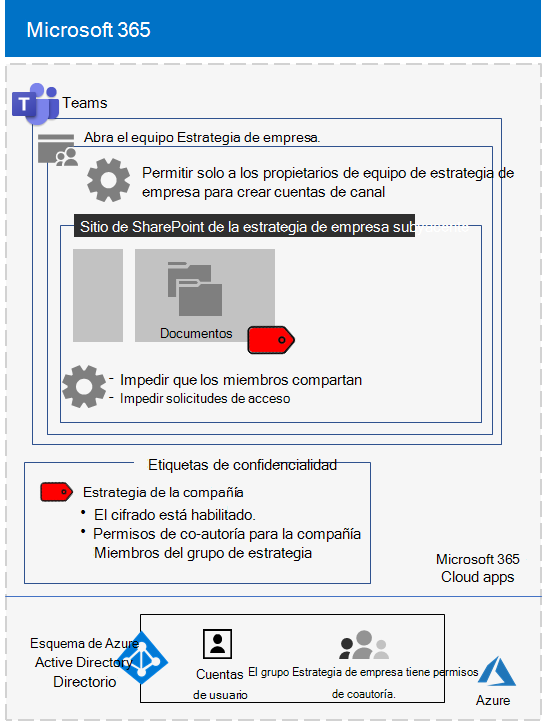

# <a name="configure-a-team-with-security-isolation-in-a-devtest-environment"></a>Configurar un equipo con aislamiento de seguridad en un entorno de desarrollo y pruebas

Este artículo proporciona instrucciones paso a paso para crear un [equipo con de aislamiento de seguridad](secure-teams-security-isolation.md) en un entorno de desarrollo y prueba.



Use este entorno de desarrollo y pruebas para experimentar y adaptar la configuración a sus necesidades específicas antes de implementar este tipo de equipo en producción.
  
## <a name="phase-1-build-out-your-microsoft-365-enterprise-test-environment"></a>Fase 1: Crear el entorno de pruebas de Microsoft 365 Enterprise

Si solamente quiere probar los equipos confidenciales y extremadamente confidenciales de forma ligera con los requisitos mínimos, siga las instrucciones de [Configuración básica ligera](../enterprise/lightweight-base-configuration-microsoft-365-enterprise.md).

Si quiere probar los equipos confidenciales y con un nivel de confidencialidad alto en una empresa simulada, siga las instrucciones de [Sincronización de hash de contraseñas](../enterprise/password-hash-sync-m365-ent-test-environment.md).

>[!Note]
>Probar equipos con aislamiento de seguridad no requiere el entorno de pruebas de una empresa simulada, que incluye una intranet simulada conectada a Internet y la sincronización de directorios de un bosque de Active Directory Domain Services (AD DS). Aquí se ofrece como una opción para que pueda probar un equipo con aislamiento de seguridad y experimentar con ella en un entorno que representa una organización típica.
>
    
## <a name="phase-2-create-and-configure-your-azure-active-directory-azure-ad-group-and-users"></a>Fase 2: Crear y configurar los usuarios y grupos de Azure Active Directory (Azure AD)

En esta fase se crea y configuran un grupo y usuarios de Azure AD para la organización ficticia.
  
En primer lugar, cree un grupo de seguridad con Azure Portal.
  
1. Cree una pestaña aparte en el explorador y, después, vaya a Azure Portal, en [https://portal.azure.com](https://portal.azure.com). Si es necesario, inicie sesión con las credenciales de la cuenta de administrador global de la suscripción de pago o de la suscripción de prueba de Microsoft 365 E5.
    
2. En Azure Portal, haga clic en **Azure Active Directory > Grupos**.
    
3. En la hoja **Todos los grupos**, haga clic en **+ Nuevo grupo**.
    
4. En la hoja **Grupo**:
    
  - Seleccione **Seguridad** en **Tipo de grupo**.
    
  - Escriba **Directivos** en **Nombre**.
    
  - Seleccione **Asignada** en **Tipo de pertenencia**.
      
5. Haga clic en **Crear** y, después, cierre la hoja **Grupo**.
    
Después, configure la licencia automática para que se asigne automáticamente una licencia de Microsoft 365 E5 a los miembros del grupo **C-Suite** nuevo.
  
1. En Azure Portal, haga clic en **Azure Active Directory > Licencias > Todos los productos**.
    
2. En la lista, seleccione **Microsoft 365 Enterprise E5** y haga clic en **Asignar**.
    
3. En la hoja **Asignar licencia**, haga clic en **Usuarios y grupos**.
    
4. En la lista de grupos, seleccione el grupo de **C-Suite**
    
5. Haga clic en **Seleccionar** y, después, en **Asignar**.
    
6. Cierre la pestaña Azure Portal del explorador.
    
Después, [conéctese al módulo de PowerShell de Azure Active Directory para Graph](../enterprise/connect-to-microsoft-365-powershell.md#connect-with-the-azure-active-directory-powershell-for-graph-module).
  
Rellene el nombre de la organización, la ubicación y una contraseña común; después, ejecute los siguientes comandos desde el símbolo del sistema de PowerShell o el entorno de scripts integrado (ISE) para crear nuevas cuentas de usuario y agregarlas al grupo de C-Suite:
  
```powershell
$orgName="<organization name, such as contoso-test for the contoso-test.onmicrosoft.com trial subscription domain name>"
$location="<the ISO ALPHA2 country code, such as US for the United States>"
$commonPassword="<common password for all the new accounts>"

$PasswordProfile=New-Object -TypeName Microsoft.Open.AzureAD.Model.PasswordProfile
$PasswordProfile.Password=$commonPassword

$groupName="C-Suite"
$userNames=@("CEO","CFO","CIO") 
$groupID=(Get-AzureADGroup | Where { $_.DisplayName -eq $groupName }).ObjectID
ForEach ($element in $userNames){ 
New-AzureADUser -DisplayName $element -PasswordProfile $PasswordProfile -UserPrincipalName ($element + "@" + $orgName + ".onmicrosoft.com") -AccountEnabled $true -MailNickName $element -UsageLocation $location 
Add-AzureADGroupMember -RefObjectId (Get-AzureADUser | Where { $_.DisplayName -eq $element }).ObjectID -ObjectId $groupID
}
```

> [!NOTE]
> Se usa una contraseña común para automatizar y facilitar la configuración de un entorno de prueba y desarrollo. Evidentemente, esto no se recomienda en el caso de suscripciones de producción. 
  
Después, siga estos pasos para comprobar que la asignación de licencias basada en grupos funcione correctamente.
  
1. Inicie sesión en el [Centro de administración de Microsoft 365](https://admin.microsoft.com).
    
2. En la nueva pestaña **Centro de administración de Microsoft 365** del explorador, haga clic en **Usuarios**.
    
3. En la lista de usuarios, haga clic en **CEO** (Consejero delegado).
    
4. En el panel que muestra las propiedades de la cuenta de usuario **CEO**, compruebe que dicha cuenta tiene asignada la licencia **Microsoft 365 Enterprise E5** en **Licencias de productos**.
    
## <a name="phase-3-create-your-team"></a>Fase 3: Crear el equipo

En esta fase, debe crear y configurar un equipo con aislamiento de seguridad para que los miembros del equipo de directiva puedan colaborar en la estrategia de la empresa.

Antes de proceder con los pasos de este artículo, debe habilitar [etiquetas de confidencialidad para proteger el contenido en Microsoft Teams, grupos de Office 365 y sitios de SharePoint](../compliance/sensitivity-labels-teams-groups-sites.md).

Después, cree el equipo:

1. En Teams, haga clic en **Teams** en el lado izquierdo de la aplicación, luego haga clic en **Unirse o crear un equipo** en la parte inferior de la lista de equipos.
2. Haga clic en **Crear equipo** (primera tarjeta, esquina superior izquierda).
3. Elija **Crear un equipo desde cero**.
4. En la lista **Confidencialidad**, conserve el valor predeterminado.
5. En **Privacidad**, haga clic en **Privado**.
6. Escriba **Estrategia de la empresa** y, después, haga clic en **Crear** > **Cerrar**.

A continuación, limite la creación de canales privados a los propietarios del grupo de Estrategia empresarial.

1. En el equipo, haga clic en **Más opciones** y después en **Administrar equipo**.
2. En la pestaña **Configuración**, expanda **Permisos de los miembros**.
3. Desactive la casilla de verificación **Permitir a los miembros crear canales privados**.

Después, debe configurar una etiqueta de confidencialidad aparte con la siguiente configuración:

- El nombre es Estrategia de la empresa
- El cifrado está habilitado.
- El grupo Estrategia de empresa tiene permisos de coautoría.

Siga estos pasos:

1. Abra el [Centro de cumplimiento de Microsoft 365](https://compliance.microsoft.com).
2. En **Soluciones**, haga clic en **Protección de la información**.
3. Haga clic en **Crear una etiqueta**.
4. Escriba **Estrategia de la empresa** en el nombre de la etiqueta.
5. Escriba **Documentos de estrategia empresarial de la directiva** como información y, después, haga clic en **Siguiente**.
6. En la página **Cifrado**, en el menú desplegable **Cifrado**, elija **Aplicar**.
7. Para agregar los permisos de equipo:<br>
  a. Haga clic en **Asignar permisos**<br>
  b. Haga clic en **Agregar usuarios o grupos**, seleccione **Estrategia de la empresa** y, después, haga clic en **Agregar**.<br>
  c. Haga clic en **Elegir permisos**.<br>
  d. Elija **coautoría** de la lista desplegable y, después, haga clic en **Guardar**.<br>
8. Haga clic en **Siguiente**.
9. En **Distintivo de contenido**, haga clic en **Siguiente**.
10. En la página **Configuración de sitio y grupo**, establezca **Configuración de sitio y grupo** como **Activado**.
11. En el menú desplegable ** Privacidad de los sitios de equipo conectados a grupos de Office 365 **, elija ** Privado: solo los miembros pueden acceder al sitio **.
12. En **Equipos no administrados**, elija **Bloquear el acceso**.
13. Haga clic en **Siguiente**.
14. En la página **Etiquetado automático para las aplicaciones de Office**, haga clic en **Siguiente**.
15. Haga clic en **Enviar**y después en **Listo**.

Después, publique la nueva etiqueta con estos pasos: 

1. En el Centro de cumplimiento de Microsoft 365, en la página **Protección de la información**, escoja la pestaña **Directivas de etiqueta**.
2. Haga clic en **Publicar etiquetas**.
3. En la página **Elegir etiquetas de confidencialidad para publicar**, haga clic en **Elija las etiquetas de confidencialidad para publicar**.
4. Seleccione **Estrategia de la empresa** y, después, haga clic en **Agregar**.
5. Haga clic en **Siguiente**.
6. En la página **Publicar a usuarios y grupos**, haga clic en **Elija usuarios y grupos**.
7. Haga clic en **Agregar**y, después, seleccione **Estrategia de la empresa**.
8. Haga clic en **Agregar** y, a continuación en **Listo**.
9. Haga clic en **Siguiente**.
10. En la página Configuración de la directiva, active la casilla de verificación **Los usuarios deben ofrecer una justificación para quitar una etiqueta o una etiqueta de clasificación inferior** y, después, haga clic en **Siguiente**.
11. Escriba **Estrategia empresarial** el nombre de la directiva y, a continuación, haga clic en **Siguiente**.
12. Haga clic en **Enviar** y después en **Listo**.

La etiqueta **Estrategia empresarial** puede tardar algún tiempo en estar disponible una vez que se ha publicado.

Después, aplique la nueva etiqueta al equipo **Estrategia empresarial** y actualice el tipo de vínculo para compartir predeterminado con el fin de reducir el riesgo de compartir por error archivos y carpetas a un público más amplio del previsto. 

1. Abra el [Centro de administración de SharePoint](https://admin.microsoft.com/sharepoint).
2. En **Sitios**, haga clic en **Sitios activos**.
3. Haga clic en el sitio **Estrategia empresarial**.
4. En **Uso compartido externo** de la pestaña **Confidencialidad**, haga clic en **Editar**.
5. Seleccione la etiqueta **Estrategia empresarial** y, después, haga clic en **Guardar**.
6. En **Uso compartido externo** de la pestaña **Directivas**, haga clic en **Editar**.
5. Elija **Solo personas de la organización**.
6. En **Tipo de vínculo de uso compartido predeterminado**, desactive la casilla de verificación **Igual que la configuración de nivel de organización** y seleccione **Usuarios con acceso existente**.
7. Haga clic en **Guardar**.

Después, configure el uso compartido de los propietarios solo para el equipo de **Estrategia empresarial**.

1. En Teams, vaya a la pestaña **General** del equipo **Estrategia empresarial**.
2. En la barra de herramientas del equipo, haga clic en **Archivos**.
3. Haga clic en los puntos suspensivos y, luego, en **Abrir en SharePoint**.
4. En la barra de herramientas, haga clic en el sitio de SharePoint subyacente, en el icono de configuración y, luego, en **Permisos del sitio**.
5. En el panel Permisos del sitio, en **Uso compartido del sitio**, haga clic en **Cambiar cómo pueden compartir los miembros**.
6. En **Permisos de uso compartido**, seleccione **Solo los propietarios del sitio pueden compartir archivos, carpetas, además del sitio** y, luego, haga clic en **Guardar**.
7. Cierre los paneles **Permisos** y **Configuración**.

Si inicia sesión como miembro del grupo Estrategia empresarial, verá **Estrategia empresarial** en la opción **Confidencialidad** en la barra de herramientas Inicio de Word, Excel y PowerPoint. Seleccione la etiqueta **Estrategia empresarial** en la opción **Confidencialidad** para asignar dicha etiqueta a un archivo.

Esta es la configuración resultante del equipo Estrategia empresarial.


## <a name="next-step"></a>Paso siguiente

Cuando esté listo para la implementación de producción, vea estas [instrucciones de configuración](secure-teams-security-isolation.md).
