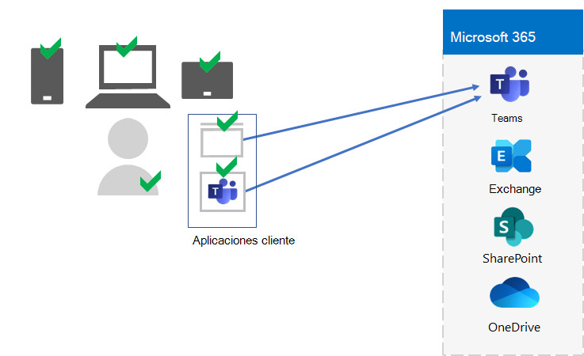
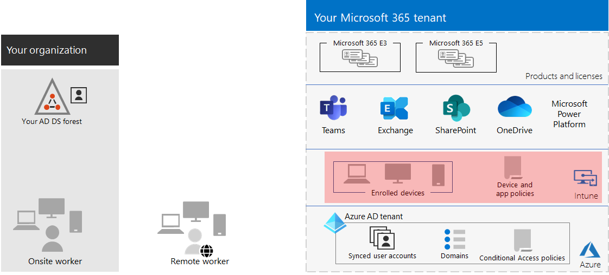

# Paso 5. Administración de dispositivos y aplicaciones para los inquilinos de Microsoft 365 para empresas

Microsoft 365 para empresas incluye características para ayudar a administrar dispositivos y el uso de aplicaciones en esos dispositivos dentro de la organización con la administración de dispositivos móviles (MDM) y la administración de aplicaciones móviles (MAM). Puedes administrar dispositivos iOS, Android, macOS y Windows para proteger el acceso a los recursos de la organización, incluidos los datos. Por ejemplo, puede evitar que se envíen correos electrónicos a personas ajenas a la organización o aislar los datos de la organización de datos personales en los dispositivos personales de su trabajador.

Este es un ejemplo de la validación y administración de los usuarios, sus dispositivos y su uso de aplicaciones de productividad locales y en la nube, como Microsoft Teams.

Para ayudarle a proteger y proteger los recursos de su organización, Microsoft 365 para empresas incluye características para ayudar a administrar los dispositivos y su acceso a las aplicaciones. Existen dos opciones para la administración de dispositivos:

- Microsoft Intune, que es una solución completa de administración de dispositivos y aplicaciones para empresas.
- Movilidad y seguridad básicas, que es un subconjunto de servicios de Intune incluidos con todos los productos de Microsoft 365 para administrar dispositivos en su organización. Para obtener más información, vea [Funcionalidades de movilidad y seguridad básicas.](https://docs.microsoft.com/microsoft-365/admin/basic-mobility-security/capabilities)

Si tiene Microsoft 365 E3 o E5, debe usar Intune.

## Microsoft Intune

Usas [Microsoft Intune para](https://docs.microsoft.com/mem/intune/fundamentals/planning-guide) administrar el acceso a tu organización mediante MDM o MAM. MDM es cuando los usuarios "inscriben" sus dispositivos en Intune. Después de inscribir un dispositivo, es un dispositivo administrado y puede recibir las directivas, reglas y configuración de la organización. Por ejemplo, puedes instalar aplicaciones específicas, crear una directiva de contraseña, instalar una conexión VPN y mucho más.

Es posible que los usuarios con sus propios dispositivos personales no quieran inscribir sus dispositivos o que Intune y las directivas de la organización los administren. Pero aún necesita proteger los recursos y los datos de su organización. En este escenario, puedes proteger tus aplicaciones mediante MAM. Por ejemplo, puede usar una directiva MAM que requiera que un usuario escriba un PIN al acceder a SharePoint en el dispositivo.

También determinará cómo va a administrar los dispositivos personales y los dispositivos propiedad de la organización. Es posible que quieras tratar los dispositivos de forma diferente, en función de sus usos.

## Configuraciones de acceso a dispositivos e identidades

Microsoft proporciona un conjunto de configuraciones para el acceso a dispositivos e [identidades](../security/office-365-security/microsoft-365-policies-configurations.md) para garantizar un personal seguro y productivo. Estas configuraciones incluyen el uso de:

- Directivas de acceso condicional de Azure AD
- Directivas de cumplimiento de dispositivos y protección de aplicaciones de Microsoft Intune
- Directivas de riesgo de usuario de Azure AD Identity Protection
- Directivas adicionales de aplicaciones en la nube

Este es un ejemplo de la aplicación de estas configuraciones y directivas para validar y restringir usuarios, sus dispositivos y el uso de aplicaciones de productividad locales y en la nube, como Microsoft Teams.

Para el acceso a dispositivos y la administración de aplicaciones, usa las configuraciones de estos artículos:

- [Requisitos previos](../security/office-365-security/identity-access-prerequisites.md)
- [Directivas comunes de acceso a dispositivos e identidades](../security/office-365-security/identity-access-policies.md)

## Resultados del paso 5

Para la administración de dispositivos y aplicaciones para su inquilino de Microsoft 365, ha determinado la configuración y las directivas de Intune para validar y restringir a los usuarios, sus dispositivos y el uso de aplicaciones de productividad locales y en la nube.

Este es un ejemplo de un inquilino con la administración de dispositivos y aplicaciones de Intune con los nuevos elementos resaltados.

En esta ilustración, el inquilino tiene:

- Dispositivos propiedad de la organización inscritos en Intune.
- Directivas de dispositivos y aplicaciones de Intune para dispositivos inscritos y personales.

## Mantenimiento continuo para la administración de dispositivos y aplicaciones

De forma continua, es posible que deba: 

- Administrar la inscripción de dispositivos.
- Revise la configuración y las directivas para obtener más aplicaciones, dispositivos y requisitos de seguridad.
