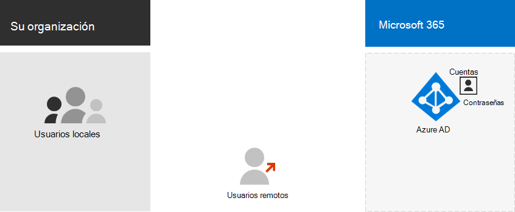
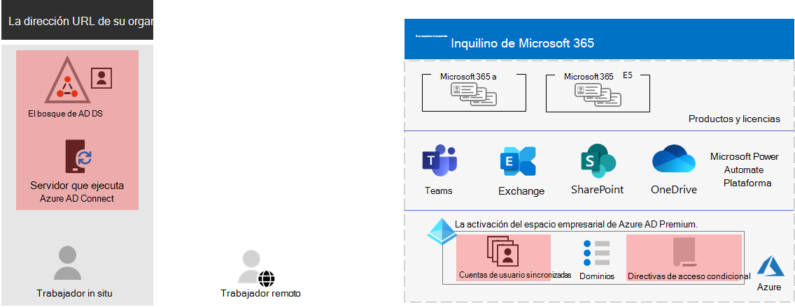

# Paso 3.Step 3. Identidad de los inquilinos de Microsoft 365 para empresasIdentity for your Microsoft 365 for enterprise tenants

El inquilino de Microsoft 365 incluye un inquilino de Azure Active Directory (Azure AD) para administrar las identidades y la autenticación de los inicios de sesión. Configurar correctamente la infraestructura de identidades es fundamental para administrar los permisos y el acceso de usuarios de Microsoft 365 para su organización.Your Microsoft 365 tenant includes an Azure Active Directory (Azure AD) tenant to manage identities and authentication for sign-ins. Getting your identity infrastructure configured correctly is vital to managing Microsoft 365 user access and permissions for your organization.

## Solo nube frente a híbridaCloud-only vs. hybrid

Estos son los dos tipos de modelos de identidad y su mejor ajuste y ventajas.Here are the two types of identity models and their best fit and benefits.

| ModelModel | DescriptionDescription | Cómo Autentica Microsoft 365 las credenciales de usuarioHow Microsoft 365 authenticates user credentials | Ideal paraBest for | Mayor beneficioGreatest benefit |
|:-------|:-----|:-----|:-----|:-----|
| Solo de nubeCloud-only | La cuenta de usuario solo existe en el inquilino de Azure AD para su inquilino de Microsoft 365.User account only exists in the Azure AD tenant for your Microsoft 365 tenant. | El inquilino de Azure AD para su inquilino de Microsoft 365 realiza la autenticación con la cuenta de identidad de la nube.The Azure AD tenant for your Microsoft 365 tenant performs the authentication with the cloud identity account. | Organizaciones que no tienen o necesitan un AD DS local.Organizations that do not have or need an on-premises AD DS. | Fácil de usar.Simple to use. No se necesitan más servidores ni herramientas de directorio.No extra directory tools or servers required. |
| HíbridoHybrid |  La cuenta de usuario existe en los Servicios de dominio de Active Directory (AD DS) locales y también hay una copia en el inquilino de Azure AD para su inquilino de Microsoft 365.User account exists in your on-premises Active Directory Domain Services (AD DS) and a copy is also in the Azure AD tenant for your Microsoft 365 tenant. Azure AD Connect se ejecuta en un servidor local para sincronizar los cambios de AD DS en el inquilino de Azure AD.Azure AD Connect runs on an on-premises server to synchronize AD DS changes to your Azure AD tenant. La cuenta de usuario de Azure AD también puede incluir una versión con hash de la contraseña de la cuenta de usuario de AD DS ya con hash.The user account in Azure AD might also include a hashed version of the already hashed AD DS user account password. | El inquilino de Azure AD para su inquilino de Microsoft 365 controla el proceso de autenticación o redirige al usuario a otro proveedor de identidades.The Azure AD tenant for your Microsoft 365 tenant either handles the authentication process or redirects the user to another identity provider. | Organizaciones que usan AD DS u otro proveedor de identidades.Organizations using AD DS or another identity provider. | Los usuarios pueden usar las mismas credenciales al obtener acceso a recursos locales o basados en la nube.Users can use the same credentials when accessing on-premises or cloud-based resources. |
||||||

Estos son los componentes básicos de la identidad de solo nube.Here are the basic components of cloud-only identity.
 

En esta ilustración, los usuarios locales y remotos inician sesión con cuentas en el inquilino de Azure AD de su inquilino de Microsoft 365.In this illustration, on-premises and remote users sign in with accounts in the Azure AD tenant of their Microsoft 365 tenant.

Estos son los componentes básicos de la identidad híbrida.Here are the basic components of hybrid identity.

En esta ilustración, los usuarios locales y remotos inician sesión en su inquilino de Microsoft 365 con cuentas en el inquilino de Azure AD que se han copiado de su AD DS local.In this illustration, on-premises and remote users sign in to their Microsoft 365 tenant with accounts in the Azure AD tenant that have been copied from their on-premises AD DS.

## Sincronización de AD DS localSynchronizing your on-premises AD DS

Según sus necesidades empresariales y requisitos técnicos, el modelo de identidad híbrido y la sincronización de directorios es la opción más común para los clientes empresariales que adoptan Microsoft 365.Depending on your business needs and technical requirements, the hybrid identity model and directory synchronization is the most common choice for enterprise customers who are adopting Microsoft 365. La sincronización de directorios le permite administrar identidades en su AD DS y todas las actualizaciones de cuentas de usuario, grupos y contactos se sincronizan con el inquilino de Azure AD de su inquilino de Microsoft 365.Directory synchronization allows you to manage identities in your AD DS and all updates to user accounts, groups, and contacts are synchronized to the Azure AD tenant of your Microsoft 365 tenant.

>[!Note]
>Cuando las cuentas de usuario de AD DS se sincronizan por primera vez, no se les asigna automáticamente una licencia de Microsoft 365 y no pueden acceder a los servicios de Microsoft 365, como el correo electrónico.When AD DS user accounts are synchronized for the first time, they are not automatically assigned a Microsoft 365 license and cannot access Microsoft 365 services, such as email. Primero debe asignarles una ubicación de uso.You must first assign them a usage location. A continuación, asigna una licencia a estas cuentas de usuario, ya sea de forma individual o dinámica a través de la pertenencia a grupos.Then, assign a license to these user accounts, either individually or dynamically through group membership.
>

Estos son los dos tipos de autenticación al usar el modelo de identidad híbrida.Here are the two types of authentication when using the hybrid identity model.

| Tipo de autenticaciónAuthentication type | DescriptionDescription |
|:-------|:-----|
| Autenticación administradaManaged authentication | Azure AD controla el proceso de autenticación mediante una versión hash almacenada localmente de la contraseña o envía las credenciales a un agente de software local para que ad DS local los autentique.Azure AD handles the authentication process by using a locally-stored hashed version of the password or sends the credentials to an on-premises software agent to be authenticated by the on-premises AD DS.      Existen dos tipos de autenticación administrada: sincronización de hash de contraseña (PHS) y autenticación de paso a través (PTA).There are two types of managed authentication: Password hash synchronization (PHS) and Pass-through authentication (PTA). Con PHS, Azure AD realiza la autenticación en sí.With PHS, Azure AD performs the authentication itself. Con la PTA, Azure AD tiene AD DS que realiza la autenticación.With PTA, Azure AD has AD DS perform the authentication. |
| Autenticación federadaFederated authentication | Azure AD redirige el equipo cliente que solicita la autenticación a otro proveedor de identidades.Azure AD redirects the client computer requesting authentication to another identity provider. |
|  |  |

Vea [cómo elegir el método de autenticación correcto](https://docs.microsoft.com/azure/active-directory/hybrid/choose-ad-authn) para obtener más información.See [choosing the right authentication method](https://docs.microsoft.com/azure/active-directory/hybrid/choose-ad-authn) to learn more.

## Exigir inicios de sesión fuertesEnforcing strong sign-ins

Para aumentar la seguridad de los inicios de sesión de usuario, use las características y capacidades de la tabla siguiente.To increase the security of user sign-ins, use the features and capabilities in the following table.

| FuncionalidadCapability | DescripciónDescription | Más informaciónMore information | Requisitos de licenciaLicensing requirements |
|:-------|:-----|:-----|:-----|:-----|
| Windows Hello para empresasWindows Hello for Business | Reemplaza las contraseñas con autenticación segura en dos fases al iniciar sesión en un dispositivo Windows.Replaces passwords with strong two-factor authentication when signing on a Windows device. Esta es un nueva forma de inicio de sesión que vincula el dispositivo de un usuario con un factor biométrico o un PIN.The two factors are a new type of user credential that is tied to a device and a biometric or PIN. | [Introducción a Windows Hello para empresasWindows Hello for Business Overview](https://docs.microsoft.com/windows/security/identity-protection/hello-for-business/hello-overview) | Microsoft 365 E3 o E5Microsoft 365 E3 or E5 |
| Protección de contraseñas de Azure ADAzure AD Password Protection | Detecta y bloquea contraseñas poco seguras conocidas y sus variantes y también puede bloquear términos débiles adicionales específicos de su organización.Detects and blocks known weak passwords and their variants and can also block additional weak terms that are specific to your organization. | [Configurar la protección con contraseña de Azure ADConfigure Azure AD password protection](https://docs.microsoft.com/azure/active-directory/authentication/concept-password-ban-bad) | Microsoft 365 E3 o E5Microsoft 365 E3 or E5 |
| Use la autenticación multifactor (MFA)Use multi-factor authentication (MFA) | MFA requiere que los inicios de sesión del usuario se sometán a una comprobación adicional más allá de la contraseña de la cuenta de usuario, como la comprobación con una aplicación de smartphone o un mensaje de texto enviado a un smartphone.MFA requires that user sign-ins be subject to an additional verification beyond the user account password, such as verification with a smartphone app or a text message sent to a smartphone. Vea [este vídeo para](https://support.microsoft.com/office/set-up-multi-factor-authentication-in-microsoft-365-business-a32541df-079c-420d-9395-9d59354f7225) obtener instrucciones sobre cómo los usuarios establecen MFA.See [this video](https://support.microsoft.com/office/set-up-multi-factor-authentication-in-microsoft-365-business-a32541df-079c-420d-9395-9d59354f7225) for instructions on how users set up MFA. | [MFA para Microsoft 365 para empresasMFA for Microsoft 365 for enterprise](../enterprise/microsoft-365-secure-sign-in.md#mfa) | Microsoft 365 E3 o E5Microsoft 365 E3 or E5 |
| Configuraciones de acceso a dispositivos e identidadesIdentity and device access configurations | Configuración y directivas que constan de características de requisitos previos recomendadas y su configuración combinadas con las directivas de Acceso condicional, Intune y Azure AD Identity Protection que determinan si se debe conceder una solicitud de acceso determinada y en qué condiciones.Settings and policies that consist of recommended prerequisite features and their settings combined with Conditional Access, Intune, and Azure AD Identity Protection policies that determine whether a given access request should be granted and under what conditions.  | [Configuraciones de acceso a dispositivos e identidadesIdentity and device access configurations](../security/office-365-security/microsoft-365-policies-configurations.md) | Microsoft 365 E3 o E5Microsoft 365 E3 or E5 |
| Azure AD Identity ProtectionAzure AD Identity Protection | Protéjase contra el riesgo de credenciales, donde un atacante determina el nombre de cuenta y la contraseña de un usuario para obtener acceso a los datos y servicios en la nube de una organización.Protect against credential compromise, where an attacker determines a user’s account name and password to gain access to an organization’s cloud services and data. | [Azure AD Identity ProtectionAzure AD Identity Protection](https://docs.microsoft.com/azure/active-directory/active-directory-identityprotection) | Microsoft 365 E5 o Microsoft 365 E3 con el complemento identity & Threat ProtectionMicrosoft 365 E5 or Microsoft 365 E3 with the Identity & Threat Protection add-on |
|  |  |  |

## Resultados del paso 3Results of Step 3

Para la identidad de su inquilino de Microsoft 365, ha determinado:For identity for your Microsoft 365 tenant, you have determined:

- Qué modelo de identidad usar.Which identity model to use.
- Cómo exigirá el acceso seguro de usuarios y dispositivos.How you will enforce strong user and device access.

Este es un ejemplo de un inquilino con los nuevos elementos de identidad híbrida resaltados.Here is an example a tenant with the new hybrid identity elements highlighted.

En esta ilustración, el inquilino tiene:In this illustration, the tenant has:

- Un bosque de AD DS que se está sincronizando con el inquilino de Azure AD mediante un servidor de DirSync y Azure AD Connect.An AD DS forest that is being synchronized with the Azure AD tenant using a DirSync server and Azure AD Connect.
- Una copia de las cuentas de usuario de AD DS y otros objetos del bosque de AD DS.A copy of the AD DS user accounts and other objects from the AD DS forest.
- Conjunto de directivas de acceso condicional para exigir el acceso y el inicio de sesión de usuario seguro en función de la cuenta de usuario.A set of Conditional Access policies to enforce secure user sign-ins and access based on the user account. 

## Mantenimiento continuo de identidadesOngoing maintenance for identity

De forma continua, es posible que deba:On an ongoing basis, you might need to:

- Agregar o modificar cuentas de usuario y grupos.Add or modify user accounts and groups. Para la identidad solo en la nube, se mantienen los usuarios y grupos basados en la nube con herramientas de Azure AD como el Centro de administración de Microsoft 365 o PowerShell.For cloud-only identity, you maintain your cloud-based users and groups with Azure AD tools such as the Microsoft 365 admin center or PowerShell. Para la identidad híbrida, se mantienen los usuarios y grupos locales con herramientas de AD DS.For hybrid identity, you maintain your on-premises users and groups with AD DS tools.
- Agregue o modifique la configuración de acceso a dispositivos e identidades para aplicar los requisitos de seguridad de inicio de sesión.Add or modify your identity and device access configuration to enforce sign-in security requirements.

## Paso siguienteNext step

Continúe con [la migración](tenant-management-migration.md) para migrar los servidores de Office locales y sus datos a Microsoft 365.Continue with [migration](tenant-management-migration.md) to migrate your on-premises Office servers and their data to Microsoft 365.
