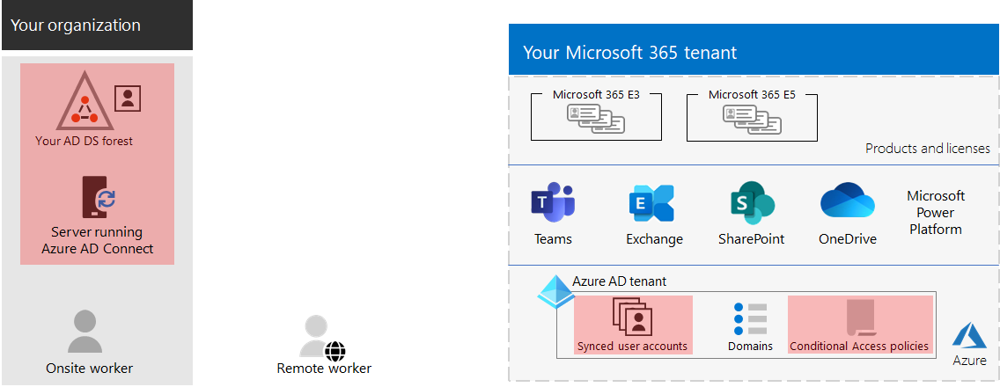

# Paso 3. Identidad de los inquilinos de Microsoft 365 para empresas

El inquilino de Microsoft 365 incluye un inquilino de Azure Active Directory (Azure AD) para administrar identidades y autenticación para inicios de sesión. La configuración correcta de la infraestructura de identidad es fundamental para administrar el acceso de usuarios y los permisos de Microsoft 365 para su organización.

## Solo en la nube frente a híbrido

Estos son los dos tipos de modelos de identidad y su mejor ajuste y ventajas.

| Model | Descripción | Cómo Microsoft 365 autentica las credenciales de usuario | Lo mejor para | Principales ventajas |
|:-------|:-----|:-----|:-----|:-----|
| Solo de nube | La cuenta de usuario solo existe en el inquilino de Azure AD para el inquilino de Microsoft 365. | El inquilino de Azure AD para el inquilino de Microsoft 365 realiza la autenticación con la cuenta de identidad en la nube. | Organizaciones que no tienen o necesitan un Active Directory local. | Fácil de usar. No se requieren herramientas de directorio ni servidores adicionales. |
| Híbrido |  La cuenta de usuario existe en el Active Directory local Domain Services (AD DS) y también hay una copia en el inquilino de Azure AD para el inquilino de Microsoft 365. Azure AD Connect se ejecuta en un servidor local para sincronizar los cambios de AD DS con el inquilino de Azure AD. La cuenta de usuario de Azure AD también puede incluir una versión con hash de la contraseña de la cuenta de usuario de AD DS ya con hash. | El inquilino de Azure AD para el inquilino de Microsoft 365 controla el proceso de autenticación o redirige al usuario a otro proveedor de identidades. | Organizaciones que usan AD DS u otro proveedor de identidades. | Los usuarios pueden usar las mismas credenciales al acceder a recursos locales o basados en la nube. |
||||||

Estos son los componentes básicos de la identidad solo en la nube.

En esta ilustración, los usuarios locales y remotos inician sesión con cuentas en el inquilino de Azure AD de su inquilino de Microsoft 365.

Estos son los componentes básicos de la identidad híbrida.

En esta ilustración, los usuarios locales y remotos inician sesión en su inquilino de Microsoft 365 con cuentas en el inquilino de Azure AD que se han copiado de su AD DS local.

## Sincronización de AD DS local

En función de las necesidades empresariales y los requisitos técnicos, el modelo de identidad híbrida y la sincronización de directorios son la opción más común para los clientes empresariales que adoptan Microsoft 365. La sincronización de directorios permite administrar identidades en AD DS y todas las actualizaciones de cuentas de usuario, grupos y contactos se sincronizan con el inquilino de Azure AD del inquilino de Microsoft 365.

> [!NOTE]
> Cuando las cuentas de usuario de AD DS se sincronizan por primera vez, no se les asigna automáticamente una licencia de Microsoft 365 y no pueden acceder a los servicios de Microsoft 365, como el correo electrónico. Primero debe asignarles una ubicación de uso. A continuación, asigne una licencia a estas cuentas de usuario, ya sea de forma individual o dinámica a través de la suscripción a grupos.

Estos son los dos tipos de autenticación al usar el modelo de identidad híbrida.

| Tipo de autenticación | Descripción |
|:-------|:-----|
| Autenticación administrada | Azure AD controla el proceso de autenticación mediante una versión con hash almacenada localmente de la contraseña o envía las credenciales a un agente de software local para que AD DS local lo autentique.      Hay dos tipos de autenticación administrada: sincronización de hash de contraseña (PHS) y autenticación de paso a través (PTA). Con PHS, Azure AD realiza la autenticación en sí. Con PTA, Azure AD hace que AD DS realice la autenticación. |
| Autenticación federada | Azure AD redirige el equipo cliente que solicita autenticación a otro proveedor de identidades. |
|  |  |

Consulte [Elección del método de autenticación adecuado](/azure/active-directory/hybrid/choose-ad-authn) para obtener más información.

## Aplicación de inicios de sesión seguros

Para aumentar la seguridad de los inicios de sesión de usuario, use las características y funcionalidades de la tabla siguiente.

| Funcionalidad | Descripción | Más información | Requisitos de licencias |
|:-------|:-----|:-----|:-----|:-----|
| Windows Hello para empresas | Reemplaza las contraseñas por autenticación segura en dos fases al firmar en un dispositivo Windows. Esta es un nueva forma de inicio de sesión que vincula el dispositivo de un usuario con un factor biométrico o un PIN. | [Introducción a Windows Hello para empresas](/windows/security/identity-protection/hello-for-business/hello-overview) | Microsoft 365 E3 o E5 |
| Protección de contraseñas de Azure AD | Detecta y bloquea contraseñas débiles conocidas y sus variantes, y también puede bloquear términos débiles adicionales específicos de su organización. | [Configuración de la protección con contraseña de Azure AD](/azure/active-directory/authentication/concept-password-ban-bad) | Microsoft 365 E3 o E5 |
| Use la autenticación multifactor (MFA) | MFA requiere que los inicios de sesión de usuario estén sujetos a otra comprobación más allá de la contraseña de la cuenta de usuario, como la verificación con una aplicación de smartphone o un mensaje de texto enviado a un teléfono inteligente. Vea [este vídeo](https://support.microsoft.com/office/set-up-multi-factor-authentication-in-microsoft-365-business-a32541df-079c-420d-9395-9d59354f7225) para obtener instrucciones sobre cómo los usuarios configuran MFA. | [MFA para Microsoft 365 para empresas](../enterprise/microsoft-365-secure-sign-in.md#mfa) | Microsoft 365 E3 o E5 |
| Configuraciones de acceso a dispositivos e identidades | Configuración y directivas que constan de características de requisitos previos recomendadas y su configuración combinada con las directivas de acceso condicional, Intune y Azure AD Identity Protection que determinan si se debe conceder una solicitud de acceso determinada y en qué condiciones.  | [Configuraciones de acceso a dispositivos e identidades](../security/office-365-security/microsoft-365-policies-configurations.md) | Microsoft 365 E3 o E5 |
| Azure AD Identity Protection | Proteja contra el riesgo de credenciales, donde un atacante determina el nombre de cuenta y la contraseña de un usuario para obtener acceso a los datos y los servicios en la nube de una organización. | [Azure AD Identity Protection](/azure/active-directory/active-directory-identityprotection) | Microsoft 365 E5 o Microsoft 365 E3 con el complemento Identity & Threat Protection |
|  |  |  |

## Resultados del paso 3

Para la identidad del inquilino de Microsoft 365, ha determinado lo siguiente:

- Qué modelo de identidad se va a usar.
- Cómo aplicará un acceso seguro a usuarios y dispositivos.

Este es un ejemplo de un inquilino con los nuevos elementos de identidad híbrida resaltados.

En esta ilustración, el inquilino tiene:

- Un bosque de AD DS que se está sincronizando con el inquilino de Azure AD mediante un servidor de sincronización de directorios y Azure AD Connect.
- Copia de las cuentas de usuario de AD DS y otros objetos del bosque de AD DS.
- Conjunto de directivas de acceso condicional para aplicar inicios de sesión y acceso de usuario seguros en función de la cuenta de usuario.

## Mantenimiento continuo de la identidad

De forma continua, es posible que tenga que:

- Agregue o modifique cuentas de usuario y grupos. Para la identidad solo en la nube, mantenga los usuarios y grupos basados en la nube con herramientas de Azure AD, como la Centro de administración de Microsoft 365 o PowerShell. Para la identidad híbrida, mantiene los usuarios y grupos locales con las herramientas de AD DS.
- Agregue o modifique la configuración de acceso de identidad y dispositivo para aplicar los requisitos de seguridad de inicio de sesión.

## Paso siguiente

Continúe con la [migración](tenant-management-migration.md) para migrar los servidores de Office locales y sus datos a Microsoft 365.