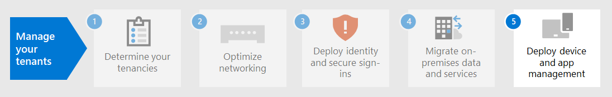

# Paso 4. Migración para los inquilinos de Microsoft 365 para empresas

La mayoría de las organizaciones empresariales tienen un entorno heterogéneo que incluye varias versiones de sistemas operativos, software cliente y software de servidor. Microsoft 365 para empresas incluye las versiones más seguras de los componentes clave de la infraestructura de TI. También incluye características de productividad diseñadas para aprovechar las tecnologías en la nube.

Para maximizar el valor empresarial del conjunto de productos integrado de Microsoft 365 para empresas, empiece a planear e implementar una estrategia para migrar estas versiones:

| From | To |
|:-------|:-----|
| Windows 7 y Windows 8.1 | Windows 10 Enterprise |
| Productos cliente de Office instalados en los dispositivos del trabajador | Microsoft 365 Apps para empresas |
| Productos de servidor de Office instalados en servidores locales | Sus servicios equivalentes basados en la nube en Microsoft 365 |
|  |  |

## Migración a Windows 10

Cada licencia de Microsoft 365 para empresas incluye una licencia para Windows 10 Enterprise. Para migrar los dispositivos que ejecutan Windows 7 o Windows 8.1, puede realizar una actualización local. El soporte técnico finalizó para Windows 7 el *14 de enero de 2020*. 

Para obtener más métodos de instalación de Windows 10 Enterprise más allá de una actualización local, consulte [Windows 10 escenarios de implementación](/windows/deployment/windows-10-deployment-scenarios). También puede [planear la implementación de Windows 10](/windows/deployment/planning/) por su cuenta.

## Migración a Aplicaciones Microsoft 365 para empresas

Microsoft 365 para empresas incluye Aplicaciones Microsoft 365 para empresas, una versión de los productos de cliente de Office (Word, PowerPoint, Excel y Outlook) que se instala y actualiza desde la nube de Microsoft. Para obtener más información, consulte [Acerca de Aplicaciones Microsoft 365 para empresas](/deployoffice/about-microsoft-365-apps).

En lugar de mantener los equipos actualizados para Office 2019 o versiones anteriores, siga estos pasos:

1. Obtenga y asigne una licencia de Microsoft 365 para los usuarios.
2. Desinstale Office 2013 u Office 2016 en sus equipos.
3. Instale Aplicaciones Microsoft 365 para empresas, ya sea de forma individual o durante un lanzamiento de TI. Para más información, consulte la [Guía de implementación para Aplicaciones de Microsoft 365](/deployoffice/deployment-guide-microsoft-365-apps).

Aplicaciones Microsoft 365 para empresas instala actualizaciones de seguridad y nuevas actualizaciones de características automáticamente y puede aprovechar los servicios basados en la nube de Microsoft 365 para mejorar la seguridad y la productividad.

## Migración de datos y servidores locales a Microsoft 365

Microsoft 365 para empresas incluye versiones basadas en la nube de servicios de servidor de Office que usan algunas de las mismas herramientas que las versiones locales del software de servidor de Office, como exploradores web y el cliente de Outlook. Estos servicios basados en la nube se actualizan automáticamente para la seguridad y las nuevas características. Después de la migración, el departamento de TI puede ahorrar el tiempo necesario para mantener y actualizar servidores locales.

Use los siguientes recursos para obtener información sobre cómo migrar usuarios y datos para cargas de trabajo específicas de Microsoft 365:

- [Mover buzones de correo de Exchange Server locales a Exchange Online](/exchange/hybrid-deployment/move-mailboxes)
- [Migración de datos de SharePoint desde SharePoint Server a SharePoint Online](/sharepointmigration/migrate-to-sharepoint-online)
- [Migración de Skype Empresarial en línea a Microsoft Teams](/microsoftteams/migration-interop-guidance-for-teams-with-skype)

## Realizar la transición en toda la organización

Para obtener una mejor imagen de cómo mover toda la organización a los productos y servicios de Microsoft 365 para empresas, descargue este póster de transición:

Este póster de dos páginas es una forma rápida de hacer un inventario de la infraestructura existente. Úsela para obtener instrucciones para pasar a un producto o servicio en Microsoft 365 para empresas. Muestra los productos de Windows y Office y otros elementos de infraestructura y seguridad, como la administración de dispositivos, la protección de identidades y amenazas, y la protección y el cumplimiento de la información.

## Resultados del paso 4

Para la migración para el inquilino de Microsoft 365, ha determinado lo siguiente:

- Qué dispositivos ejecutan Windows 7 o Windows 8.1 y el plan para actualizarlos a Windows 10 Enterprise.
- Qué dispositivos ejecutan las aplicaciones cliente de Office y el plan para actualizarlas a aplicaciones de Microsoft 365 para empresas.
- Qué servicios de servidor de Office locales deben migrarse a su equivalente de Microsoft 365 y el plan para migrarlos y sus datos.

Este es un ejemplo de un inquilino con una migración completa de servidores locales.

En esta ilustración, la organización tiene:

- Migró sus buzones de Exchange Server locales a Exchange Online.
- Migró sus datos y sitios de SharePoint Server locales a SharePoint en Microsoft 365.

## Mantenimiento continuo para la migración

De forma continua, es posible que tenga que:

- En función del estado de la migración del buzón de Exchange, continúe implementando la transición para Exchange Online a su organización.
- En función del estado de la migración del sitio de SharePoint local, continúe implementando la transición a SharePoint en Microsoft 365 hacia fuera a su organización.

## Paso siguiente

Continúe con la [administración de dispositivos y aplicaciones](tenant-management-device-management.md) para implementar la administración de dispositivos y aplicaciones.