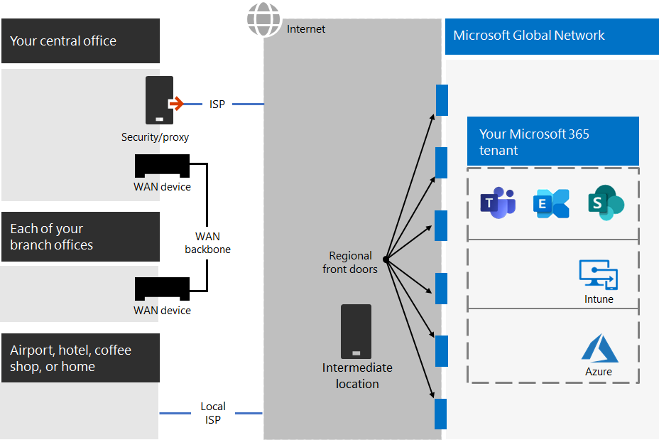
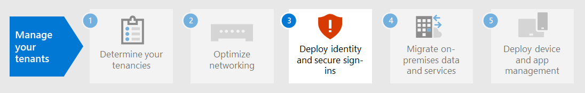

# Paso 2. Redes óptimas para su Microsoft 365 para inquilinos empresariales

Microsoft 365 para empresas incluye aplicaciones de productividad en la nube como Teams y Exchange Online, y Microsoft Intune, junto con muchos servicios de identidad y seguridad de Microsoft Azure. Todos estos servicios basados en la nube dependen de la seguridad, el rendimiento y la confiabilidad de las conexiones de dispositivos cliente en la red local o en cualquier ubicación de Internet. 

Para optimizar el acceso a la red para el inquilino, debe:

- Optimice la ruta de acceso entre los usuarios locales y la ubicación más cercana a la Red global de Microsoft.
- Optimice el acceso a Microsoft Global Network para los usuarios remotos que usan una solución VPN de acceso remoto.
- Use Network Insights para diseñar el perímetro de red de las ubicaciones de la oficina.
- Optimizar el acceso a activos específicos hospedados en SharePoint sitios con el Office 365 CDN.
- Configure los dispositivos perimetrales de red y proxy para omitir el procesamiento Microsoft 365 tráfico de confianza con la lista de puntos de conexión y automatizar la actualización de la lista a medida que se realizan los cambios.

## Enterprise locales

Para las redes empresariales, debe optimizar la experiencia del usuario final habilitando el acceso de red de mayor rendimiento entre los clientes y los puntos de conexión Microsoft 365 más cercanos. La calidad de la experiencia del usuario final está directamente relacionada con el rendimiento y la capacidad de respuesta de la aplicación que usa el usuario. Por ejemplo, Microsoft Teams se basa en una latencia baja para que las llamadas telefónicas de usuario, las conferencias y las colaboraciones de pantalla compartida no tienen problemas.

El objetivo principal en el diseño de red debe ser minimizar la latencia al reducir el tiempo de ida y vuelta (RTT) de los dispositivos cliente a la red global de Microsoft, la red troncal pública de Microsoft que interconecta todos los centros de datos de Microsoft con puntos de entrada de aplicaciones en la nube de baja latencia y alta disponibilidad, conocidos como puertas frontales, repartidos por todo el mundo.

Este es un ejemplo de una red empresarial tradicional.

En esta ilustración, las sucursales se conectan a una oficina central a través de dispositivos de red de área extensa (WAN) y una red troncal WAN. El acceso a Internet es a través de un dispositivo de seguridad o proxy en el borde de red de la oficina central y un proveedor de servicios de Internet (ISP). En Internet, Microsoft Global Network tiene una serie de puertas frontales en regiones de todo el mundo. Las organizaciones también pueden usar ubicaciones intermedias para el procesamiento de paquetes y la seguridad adicionales para el tráfico. El espacio empresarial Microsoft 365 de una organización se encuentra dentro de la Red global de Microsoft.

Los problemas con esta configuración para Microsoft 365 servicios en la nube son:

- Para los usuarios de sucursales, el tráfico se envía a puertas frontales no locales, lo que aumenta la latencia.
- El envío de tráfico a ubicaciones intermedias crea horquillas de red que realizan procesamiento de paquetes duplicados en el tráfico de confianza, lo que aumenta la latencia.
- Los dispositivos perimetrales de red realizan procesamiento de paquetes innecesarios y duplicados en el tráfico de confianza, lo que aumenta la latencia.

La optimización Microsoft 365 rendimiento de red no tiene que ser complicado. Puede obtener el mejor rendimiento posible siguiendo algunos principios clave:

- Identifique Microsoft 365 de red, que es el tráfico de confianza destinado a los servicios en la nube de Microsoft.
- Permitir la salida de sucursales locales Microsoft 365 tráfico de red a Internet desde cada ubicación donde los usuarios se conectan a Microsoft 365.
- Evite las horquillas de red.
- Permitir Microsoft 365 tráfico para omitir servidores proxy y dispositivos de inspección de paquetes.

Si implementa estos principios, obtiene una red empresarial optimizada para Microsoft 365.

En esta ilustración, las sucursales tienen su propia conexión a Internet a través de un dispositivo WAN definido por software (SDWAN), que envía tráfico de Microsoft 365 de confianza a la puerta principal regionalmente más cercana. En la oficina central, el tráfico Microsoft 365 de confianza omite el dispositivo de seguridad o proxy y ya no se usan dispositivos intermedios.

Este es el modo en que la configuración optimizada resuelve los problemas de latencia de una red empresarial tradicional:

- El Microsoft 365 de confianza omite la red troncal WAN y se envía a las puertas principales locales de todas las oficinas, lo que disminuye la latencia.
- Las horquillas de red que realizan procesamiento de paquetes duplicados se omiten Microsoft 365 tráfico de confianza, lo que disminuye la latencia.
- Los dispositivos perimetrales de red que realizan procesamiento de paquetes innecesarios y duplicados se omiten para Microsoft 365 de confianza, lo que disminuye la latencia.

Para obtener más información, [vea Microsoft 365 introducción a la conectividad de red](../enterprise/microsoft-365-networking-overview.md).

## Trabajadores remotos

Si los trabajadores remotos usan un cliente VPN tradicional para obtener acceso remoto a la red de su organización, compruebe que el cliente VPN tiene compatibilidad de túnel dividido. Sin el túnel dividido, todo el tráfico de trabajo remoto se envía por la conexión VPN, donde debe reenviarse a los dispositivos perimetrales de la organización, procesarse y, después, enviarse por Internet. Aquí le mostramos un ejemplo.

En esta ilustración, Microsoft 365 tráfico debe tomar una ruta indirecta a través de su organización, que podría reenviarse a una puerta principal de Microsoft Global Network lejos de la ubicación física del cliente VPN. Esta ruta indirecta agrega latencia al tráfico de red y reduce el rendimiento general. 

Con el túnel dividido, puede configurar el cliente VPN para excluir determinados tipos de tráfico de la conexión VPN a la red de la organización.

Para optimizar el acceso a los recursos en la nube de Microsoft 365, configure los clientes VPN de túnel dividido para excluir el tráfico a los puntos de conexión de Microsoft 365 de la categoría **Optimizar** por la conexión VPN. Para obtener más información, [vea Office 365 de puntos de](../enterprise/microsoft-365-network-connectivity-principles.md#new-office-365-endpoint-categories) conexión y las listas de puntos de conexión de categorías Optimizar para túnel dividido. 

Este es el flujo de tráfico resultante para el túnel dividido, en el que la mayoría del tráfico que se Microsoft 365 aplicaciones en la nube omiten la conexión VPN.

En esta ilustración, el cliente VPN envía y recibe un tráfico Microsoft 365 servicio en la nube directamente a través de Internet y a la puerta principal más cercana a la red global de Microsoft.

Para obtener más información e instrucciones, consulte [Optimizar la conectividad de Office 365 para usuarios remotos usando el túnel dividido de VPN](../enterprise/microsoft-365-vpn-split-tunnel.md).

## Uso de Network Insights (versión preliminar)

Los conocimientos de red son métricas de rendimiento recopiladas Microsoft 365 inquilino que le ayudarán a diseñar perímetros de red para las ubicaciones de la oficina. Cada información proporciona detalles en directo sobre las características de rendimiento de un problema especificado para cada ubicación geográfica en la que los usuarios locales tienen acceso a su inquilino.

Hay dos perspectivas de red de nivel de inquilino que se pueden mostrar para el inquilino:

- [Exchange conexiones muestreadas afectadas por problemas de conectividad](../enterprise/office-365-network-mac-perf-insights.md#exchange-sampled-connections-impacted-by-connectivity-issues)
- [SharePoint conexiones muestreadas afectadas por problemas de conectividad](../enterprise/office-365-network-mac-perf-insights.md#sharepoint-sampled-connections-impacted-by-connectivity-issues)

Estos son los conocimientos de red específicos para cada ubicación de oficina:

- [Salida de red backhauled](../enterprise/office-365-network-mac-perf-insights.md#backhauled-network-egress)
- [Mejor rendimiento detectado para clientes cercanos](../enterprise/office-365-network-mac-perf-insights.md#better-performance-detected-for-customers-near-you)
- [Uso de una puerta principal Exchange Online servicio no óptimo](../enterprise/office-365-network-mac-perf-insights.md#use-of-a-non-optimal-exchange-online-service-front-door)
- [Uso de una puerta principal de servicio SharePoint en línea no óptima](../enterprise/office-365-network-mac-perf-insights.md#use-of-a-non-optimal-sharepoint-online-service-front-door)
- [Baja velocidad de descarga desde SharePoint puerta principal](../enterprise/office-365-network-mac-perf-insights.md#low-download-speed-from-sharepoint-front-door)
- [Salida óptima de red del usuario de China](../enterprise/office-365-network-mac-perf-insights.md#china-user-optimal-network-egress)

>[!IMPORTANT]
>La información de red, las recomendaciones de rendimiento y las evaluaciones del Centro de administración de Microsoft 365 está actualmente en estado de vista previa. Solo está disponible para Microsoft 365 inquilinos que se han inscrito en el programa de vista previa de características.

Para obtener más información, [vea Microsoft 365 Network Insights](../enterprise/office-365-network-mac-perf-insights.md).

## SharePoint rendimiento con el Office 365 CDN

Una configuración basada en la nube Content Delivery Network (CDN) permite reducir los tiempos de carga, ahorrar ancho de banda y acelerar la capacidad de respuesta. Una CDN mejora el rendimiento al almacenar en caché activos estáticos, como archivos gráficos o de vídeo, más cerca de los exploradores que los solicitan, lo que ayuda a acelerar las descargas y reducir la latencia. Puede usar el Office 365 Content Delivery Network integrado (CDN), incluido con SharePoint en Microsoft 365 E3 y E5, para hospedar activos estáticos para proporcionar un mejor rendimiento para sus SharePoint páginas.

La CDN de Office 365 se compone de varias redes CDN que permite hospedar archivos estáticos en varias ubicaciones u _orígenes_ y a realizar la entrega desde redes de alta velocidad globales. Según el tipo de contenido que desee hospedar en el  Office 365 CDN, puede agregar orígenes públicos,  orígenes privados o ambos.

Cuando se implementa y configura, el Office 365 CDN carga activos de orígenes públicos y privados y los pone a disposición para un acceso rápido a los usuarios ubicados en Internet.

Para obtener más información, vea [Use the Office 365 CDN with SharePoint Online](../enterprise/use-microsoft-365-cdn-with-spo.md).

## Lista de puntos de conexión automatizados

Para que los clientes locales, los dispositivos perimetrales y los servicios de análisis de paquetes basados en la nube omitan el procesamiento del tráfico de Microsoft 365 de confianza, debe configurarlos con el conjunto de puntos de conexión (intervalos de direcciones IP y nombres DNS) correspondientes a los servicios Microsoft 365. Estos puntos de conexión se pueden configurar manualmente en firewalls y otros dispositivos de seguridad perimetral, archivos PAC para que los equipos cliente omitan servidores proxy o dispositivos SD-WAN en sucursales. Sin embargo, los puntos de conexión cambian con el tiempo, lo que requiere un mantenimiento manual continuo de las listas de puntos de conexión en estas ubicaciones.

Para automatizar la lista y la administración de cambios para los puntos de conexión Microsoft 365 en los archivos PAC de cliente y dispositivos de red, use el servicio web basado en REST de dirección IP y url de [Office 365.](../enterprise/microsoft-365-ip-web-service.md) Este servicio le ayuda a identificar y diferenciar mejor Microsoft 365 de red, lo que facilita la evaluación, la configuración y la actualización con los cambios más recientes.

Puede usar PowerShell, Python u otros idiomas para determinar los cambios en los puntos de conexión con el tiempo y configurar los archivos PAC y los dispositivos de red perimetral.

El proceso básico es:

1. Use el Office 365 web de dirección IP y dirección URL y el mecanismo de configuración que prefiera para configurar los archivos PAC y los dispositivos de red con el conjunto actual de puntos de conexión Microsoft 365 usuario.
2. Ejecute un diario periódico para comprobar si hay cambios en los puntos de conexión o usar un método de notificación.
3. Cuando se detecten cambios, regenere y redistribuya el archivo PAC para los equipos cliente y realice los cambios en los dispositivos de red.

Para obtener más información, [vea Office 365 ip address and URL web service](../enterprise/microsoft-365-ip-web-service.md).

## Resultados del paso 2

Para su Microsoft 365 con redes óptimas, ha determinado:

- Cómo optimizar el rendimiento de la red para los usuarios locales agregando conexiones a Internet a todas las sucursales y eliminando las horquillas de red.
- Cómo implementar la descripción automatizada de puntos de conexión de confianza para los archivos PAC basados en cliente y los dispositivos y servicios de red, incluidas las actualizaciones continuas (más adecuadas para redes empresariales).
- Cómo admitir el acceso de los trabajadores remotos a los recursos locales.
- Cómo usar Network Insights
- Cómo implementar el Office 365 CDN.

Este es un ejemplo de una organización empresarial y su inquilino con redes óptimas.

[Ver una versión más grande de esta imagen](https://github.com/MicrosoftDocs/microsoft-365-docs/raw/public/microsoft-365/media/tenant-management-overview/tenant-management-tenant-build-step2.png)

En esta ilustración, el inquilino de esta organización empresarial tiene:

- Acceso a Internet local para cada sucursal con un dispositivo SDWAN que reenvía el tráfico Microsoft 365 confianza a una puerta principal local.
- Sin horquillas de red.
- Dispositivos perimetrales de proxy y seguridad de oficina central que Microsoft 365 tráfico de confianza a una puerta principal local.

## Mantenimiento continuo para redes óptimas

De forma continua, es posible que deba:

- Actualice los dispositivos perimetrales y los archivos PAC implementados para los cambios en los puntos de conexión o compruebe que el proceso automatizado funciona correctamente.
- Administre los activos en el Office 365 CDN.
- Actualice la configuración de túnel dividido en los clientes VPN para los cambios en los puntos de conexión.

## Paso siguiente

Continúe con [la identidad](tenant-management-identity.md) para sincronizar sus cuentas y grupos locales y exigir los inicios de sesión de usuario seguros.
