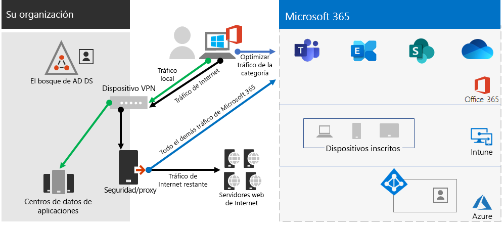

# Paso 2.Step 2. Redes óptimas para su Microsoft 365 para inquilinos empresarialesOptimal networking for your Microsoft 365 for enterprise tenants

Microsoft 365 para empresas incluye aplicaciones de productividad en la nube como Teams y Exchange Online, y Microsoft Intune, junto con muchos servicios de identidad y seguridad de Microsoft Azure.Microsoft 365 for enterprise includes cloud productivity apps such as Teams and Exchange Online, and Microsoft Intune, along with many identity and security services of Microsoft Azure. Todos estos servicios basados en la nube dependen de la seguridad, el rendimiento y la confiabilidad de las conexiones de dispositivos cliente en la red local o en cualquier ubicación de Internet.All of these cloud-based services rely on the security, performance, and reliability of connections from client devices on your on-premises network or any location on the Internet. 

Para optimizar el acceso a la red para el inquilino, debe:To optimize network access for your tenant, you need to:

- Optimice la ruta de acceso entre los usuarios locales y la ubicación más cercana a la Red global de Microsoft.Optimize the path between your on-premises users and the closest location to the Microsoft Global Network.
- Optimice el acceso a Microsoft Global Network para los usuarios remotos que usan una solución VPN de acceso remoto.Optimize access to the Microsoft Global Network for your remote users that are using a remote access VPN solution.
- Use Network Insights para diseñar el perímetro de red de las ubicaciones de la oficina.Use Network Insights to design the network perimeter for your office locations.
- Optimizar el acceso a activos específicos hospedados en SharePoint sitios con el Office 365 CDN.Optimize access to specific assets hosted on SharePoint sites with the Office 365 CDN.
- Configure los dispositivos perimetrales de red y proxy para omitir el procesamiento Microsoft 365 tráfico de confianza con la lista de puntos de conexión y automatizar la actualización de la lista a medida que se realizan los cambios.Configure proxy and network edge devices to bypass processing for Microsoft 365 trusted traffic with the list of endpoints and automate the updating of the list as changes are made.

## Enterprise localesEnterprise on-premises workers

Para las redes empresariales, debe optimizar la experiencia del usuario final habilitando el acceso de red de mayor rendimiento entre los clientes y los puntos de conexión Microsoft 365 más cercanos.For enterprise networks, you should optimize the end user experience by enabling the highest-performing network access between clients and the closest Microsoft 365 endpoints. La calidad de la experiencia del usuario final está directamente relacionada con el rendimiento y la capacidad de respuesta de la aplicación que usa el usuario.The quality of end user experience is directly related to the performance and responsiveness of the application that the user is using. Por ejemplo, Microsoft Teams se basa en una latencia baja para que las llamadas telefónicas de usuario, las conferencias y las colaboraciones de pantalla compartida no tienen problemas.For example, Microsoft Teams relies on low latency so that user phone calls, conferences and shared screen collaborations are glitch-free.

El objetivo principal en el diseño de red debe ser minimizar la latencia al reducir el tiempo de ida y vuelta (RTT) de los dispositivos cliente a la red global de Microsoft, la red troncal pública de Microsoft que interconecta todos los centros de datos de Microsoft con puntos de entrada de aplicaciones en la nube de baja latencia y alta disponibilidad, conocidos como puertas frontales, repartidos por todo el mundo.The primary goal in the network design should be to minimize latency by reducing the round-trip time (RTT) from client devices to the Microsoft Global Network, Microsoft's public network backbone that interconnects all of Microsoft's datacenters with low latency, high availability cloud application entry points, known as front doors, spread around the world.

Este es un ejemplo de una red empresarial tradicional.Here is an example of a traditional enterprise network.

En esta ilustración, las sucursales se conectan a una oficina central a través de dispositivos de red de área extensa (WAN) y una red troncal WAN.In this illustration, branch offices connect to a central office through wide area network (WAN) devices and a WAN backbone. El acceso a Internet es a través de un dispositivo de seguridad o proxy en el borde de red de la oficina central y un proveedor de servicios de Internet (ISP).Internet access is through a security or proxy device at the network edge of the central office and an Internet service provider (ISP). En Internet, Microsoft Global Network tiene una serie de puertas frontales en regiones de todo el mundo.On the Internet, the Microsoft Global Network has a series of front doors in regions around the world. Las organizaciones también pueden usar ubicaciones intermedias para el procesamiento de paquetes y la seguridad adicionales para el tráfico.Organizations can also use intermediate locations for additional packet processing and security for traffic. El espacio empresarial Microsoft 365 de una organización se encuentra dentro de la Red global de Microsoft.An organization's Microsoft 365 tenant is located within the Microsoft Global Network.

Los problemas con esta configuración para Microsoft 365 servicios en la nube son:The problems with this configuration for Microsoft 365 cloud services are:

- Para los usuarios de sucursales, el tráfico se envía a puertas frontales no locales, lo que aumenta la latencia.For users in branch offices, traffic gets sent to non-local front doors, increasing latency.
- El envío de tráfico a ubicaciones intermedias crea horquillas de red que realizan procesamiento de paquetes duplicados en el tráfico de confianza, lo que aumenta la latencia.Sending traffic to intermediate locations create network hairpins that perform duplicate packet processing on trusted traffic, increasing latency.
- Los dispositivos perimetrales de red realizan procesamiento de paquetes innecesarios y duplicados en el tráfico de confianza, lo que aumenta la latencia.Network edge devices perform unneeded and duplicate packet processing on trusted traffic, increasing latency.

La optimización Microsoft 365 rendimiento de red no tiene que ser complicado.Optimizing Microsoft 365 network performance doesn't need to be complicated. Puede obtener el mejor rendimiento posible siguiendo algunos principios clave:You can get the best possible performance by following a few key principles:

- Identifique Microsoft 365 de red, que es el tráfico de confianza destinado a los servicios en la nube de Microsoft.Identify Microsoft 365 network traffic, which is trusted traffic destined to Microsoft cloud services.
- Permitir la salida de sucursales locales Microsoft 365 tráfico de red a Internet desde cada ubicación donde los usuarios se conectan a Microsoft 365.Allow local branch egress of Microsoft 365 network traffic to the internet from each location where users connect to Microsoft 365.
- Evite las horquillas de red.Avoid network hairpins.
- Permitir Microsoft 365 tráfico para omitir servidores proxy y dispositivos de inspección de paquetes.Allow Microsoft 365 traffic to bypass proxies and packet inspection devices.

Si implementa estos principios, obtiene una red empresarial optimizada para Microsoft 365.If you implement these principles, you get an enterprise network optimized for Microsoft 365.

En esta ilustración, las sucursales tienen su propia conexión a Internet a través de un dispositivo WAN definido por software (SDWAN), que envía tráfico de Microsoft 365 de confianza a la puerta principal regionalmente más cercana.In this illustration, branch offices have their own Internet connection through a software-defined WAN device (SDWAN) device, which sends trusted Microsoft 365 traffic to the regionally closest front door. En la oficina central, el tráfico Microsoft 365 de confianza omite el dispositivo de seguridad o proxy y ya no se usan dispositivos intermedios.At the central office, trusted Microsoft 365 traffic bypasses the security or proxy device and intermediate devices are no longer used.

Este es el modo en que la configuración optimizada resuelve los problemas de latencia de una red empresarial tradicional:Here's are how the optimized configuration solves the latency issues of a traditional enterprise network:

- El Microsoft 365 de confianza omite la red troncal WAN y se envía a las puertas principales locales de todas las oficinas, lo que disminuye la latencia.Trusted Microsoft 365 traffic skips the WAN backbone and is sent to local front doors for all offices, decreasing latency.
- Las horquillas de red que realizan procesamiento de paquetes duplicados se omiten Microsoft 365 tráfico de confianza, lo que disminuye la latencia.Network hairpins that perform duplicate packet processing are skipped for Microsoft 365 trusted traffic, decreasing latency.
- Los dispositivos perimetrales de red que realizan procesamiento de paquetes innecesarios y duplicados se omiten para Microsoft 365 de confianza, lo que disminuye la latencia.Network edge devices that perform unneeded and duplicate packet processing are skipped for Microsoft 365 trusted traffic, decreasing latency.

Para obtener más información, [vea Microsoft 365 introducción a la conectividad de red](../enterprise/microsoft-365-networking-overview.md).For more information, see [Microsoft 365 network connectivity overview](../enterprise/microsoft-365-networking-overview.md).

## Trabajadores remotosRemote workers

Si los trabajadores remotos usan un cliente VPN tradicional para obtener acceso remoto a la red de su organización, compruebe que el cliente VPN tiene compatibilidad de túnel dividido.If your remote workers are using a traditional VPN client to obtain remote access to your organization network, verify that the VPN client has split tunneling support. Sin el túnel dividido, todo el tráfico de trabajo remoto se envía por la conexión VPN, donde debe reenviarse a los dispositivos perimetrales de la organización, procesarse y, después, enviarse por Internet.Without split tunneling, all of your remote work traffic gets sent across the VPN connection, where it must be forwarded to your organization’s edge devices, get processed, and then sent on the Internet. Aquí le mostramos un ejemplo.Here is an example.

En esta ilustración, Microsoft 365 tráfico debe tomar una ruta indirecta a través de su organización, que podría reenviarse a una puerta principal de Microsoft Global Network lejos de la ubicación física del cliente VPN.In this illustration, Microsoft 365 traffic must take an indirect route through your organization, which could be forwarded to a Microsoft Global Network front door far away from the VPN client’s physical location. Esta ruta indirecta agrega latencia al tráfico de red y reduce el rendimiento general.This indirect path adds latency to the network traffic and decreases overall performance. 

Con el túnel dividido, puede configurar el cliente VPN para excluir determinados tipos de tráfico de la conexión VPN a la red de la organización.With split tunneling, you can configure your VPN client to exclude specific types of traffic from being sent over the VPN connection to the organization network.

Para optimizar el acceso a los recursos en la nube de Microsoft 365, configure los clientes VPN de túnel dividido para excluir el tráfico a los puntos de conexión de Microsoft 365 de la categoría **Optimizar** por la conexión VPN.To optimize access to Microsoft 365 cloud resources, configure your split tunneling VPN clients to exclude traffic to the **Optimize** category Microsoft 365 endpoints over the VPN connection. Para obtener más información, [vea Office 365 de puntos de](../enterprise/microsoft-365-network-connectivity-principles.md#new-office-365-endpoint-categories) conexión y las listas de puntos de conexión de categorías Optimizar para túnel dividido. For more information, see [Office 365 endpoint categories](../enterprise/microsoft-365-network-connectivity-principles.md#new-office-365-endpoint-categories) and [the lists](../enterprise/microsoft-365-vpn-implement-split-tunnel.md#implement-vpn-split-tunneling) of Optimize category endpoints for split tunneling.

Este es el flujo de tráfico resultante para el túnel dividido, en el que la mayoría del tráfico que se Microsoft 365 aplicaciones en la nube omiten la conexión VPN.Here is the resulting traffic flow for split tunneling, in which most of the traffic to Microsoft 365 cloud apps bypass the VPN connection.

En esta ilustración, el cliente VPN envía y recibe un tráfico Microsoft 365 servicio en la nube directamente a través de Internet y a la puerta principal más cercana a la red global de Microsoft.In this illustration, the VPN client sends and receives crucial Microsoft 365 cloud service traffic directly over the Internet and to the nearest front door into the Microsoft Global Network.

Para obtener más información e instrucciones, consulte [Optimizar la conectividad de Office 365 para usuarios remotos usando el túnel dividido de VPN](../enterprise/microsoft-365-vpn-split-tunnel.md).For more information and guidance, see [Optimize Office 365 connectivity for remote users using VPN split tunneling](../enterprise/microsoft-365-vpn-split-tunnel.md).

## Uso de Network Insights (versión preliminar)Using Network Insights (preview)

Los conocimientos de red son métricas de rendimiento recopiladas Microsoft 365 inquilino que le ayudarán a diseñar perímetros de red para las ubicaciones de la oficina.Network insights are performance metrics collected from your Microsoft 365 tenant that help you design network perimeters for your office locations. Cada información proporciona detalles en directo sobre las características de rendimiento de un problema especificado para cada ubicación geográfica en la que los usuarios locales tienen acceso a su inquilino.Each insight provides live details about the performance characteristics for a specified issue for each geographic location where on-premises users are accessing your tenant.

Hay dos perspectivas de red de nivel de inquilino que se pueden mostrar para el inquilino:There are two tenant level network insights that may be shown for the tenant:

- [Exchange conexiones muestreadas afectadas por problemas de conectividadExchange sampled connections impacted by connectivity issues](../enterprise/office-365-network-mac-perf-insights.md#exchange-sampled-connections-impacted-by-connectivity-issues)
- [SharePoint conexiones muestreadas afectadas por problemas de conectividadSharePoint sampled connections impacted by connectivity issues](../enterprise/office-365-network-mac-perf-insights.md#sharepoint-sampled-connections-impacted-by-connectivity-issues)

Estos son los conocimientos de red específicos para cada ubicación de oficina:These are the specific network insights for each office location:

- [Salida de red backhauledBackhauled network egress](../enterprise/office-365-network-mac-perf-insights.md#backhauled-network-egress)
- [Mejor rendimiento detectado para clientes cercanosBetter performance detected for customers near you](../enterprise/office-365-network-mac-perf-insights.md#better-performance-detected-for-customers-near-you)
- [Uso de una puerta principal Exchange Online servicio no óptimoUse of a non-optimal Exchange Online service front door](../enterprise/office-365-network-mac-perf-insights.md#use-of-a-non-optimal-exchange-online-service-front-door)
- [Uso de una puerta principal de servicio SharePoint en línea no óptimaUse of a non-optimal SharePoint Online service front door](../enterprise/office-365-network-mac-perf-insights.md#use-of-a-non-optimal-sharepoint-online-service-front-door)
- [Baja velocidad de descarga desde SharePoint puerta principalLow download speed from SharePoint front door](../enterprise/office-365-network-mac-perf-insights.md#low-download-speed-from-sharepoint-front-door)
- [Salida óptima de red del usuario de ChinaChina user optimal network egress](../enterprise/office-365-network-mac-perf-insights.md#china-user-optimal-network-egress)

>[!IMPORTANT]
>La información de red, las recomendaciones de rendimiento y las evaluaciones del Centro de administración de Microsoft 365 está actualmente en estado de vista previa.Network insights, performance recommendations and assessments in the Microsoft 365 Admin Center is currently in preview status. Solo está disponible para Microsoft 365 inquilinos que se han inscrito en el programa de vista previa de características.It is only available for Microsoft 365 tenants that have been enrolled in the feature preview program.

Para obtener más información, [vea Microsoft 365 Network Insights](../enterprise/office-365-network-mac-perf-insights.md).For more information, see [Microsoft 365 Network Insights](../enterprise/office-365-network-mac-perf-insights.md).

## SharePoint rendimiento con el Office 365 CDNSharePoint performance with the Office 365 CDN

Una configuración basada en la nube Content Delivery Network (CDN) permite reducir los tiempos de carga, ahorrar ancho de banda y acelerar la capacidad de respuesta.A cloud-based Content Delivery Network (CDN) allows you to reduce load times, save bandwidth, and speed responsiveness. Una CDN mejora el rendimiento al almacenar en caché activos estáticos, como archivos gráficos o de vídeo, más cerca de los exploradores que los solicitan, lo que ayuda a acelerar las descargas y reducir la latencia.A CDN improves performance by caching static assets such as graphic or video files closer to the browsers requesting them, which helps to speed up downloads and reduce latency. Puede usar el Office 365 Content Delivery Network integrado (CDN), incluido con SharePoint en Microsoft 365 E3 y E5, para hospedar activos estáticos para proporcionar un mejor rendimiento para sus SharePoint páginas.You can use the built-in Office 365 Content Delivery Network (CDN), included with SharePoint in Microsoft 365 E3 and E5, to host static assets to provide better performance for your SharePoint pages.

La CDN de Office 365 se compone de varias redes CDN que permite hospedar archivos estáticos en varias ubicaciones u _orígenes_ y a realizar la entrega desde redes de alta velocidad globales.The Office 365 CDN is composed of multiple CDNs that allow you to host static assets in multiple locations, or _origins_, and serve them from global high-speed networks. Según el tipo de contenido que desee hospedar en el  Office 365 CDN, puede agregar orígenes públicos,  orígenes privados o ambos.Depending on the kind of content you want to host in the Office 365 CDN, you can add **public** origins, **private** origins, or both.

Cuando se implementa y configura, el Office 365 CDN carga activos de orígenes públicos y privados y los pone a disposición para un acceso rápido a los usuarios ubicados en Internet.When deployed and configured, the Office 365 CDN uploads assets from public and private origins and makes them available for fast access to users located across the Internet.

Para obtener más información, vea [Use the Office 365 CDN with SharePoint Online](../enterprise/use-microsoft-365-cdn-with-spo.md).For more information, see [Use the Office 365 CDN with SharePoint Online](../enterprise/use-microsoft-365-cdn-with-spo.md).

## Lista de puntos de conexión automatizadosAutomated endpoint listing

Para que los clientes locales, los dispositivos perimetrales y los servicios de análisis de paquetes basados en la nube omitan el procesamiento del tráfico de Microsoft 365 de confianza, debe configurarlos con el conjunto de puntos de conexión (intervalos de direcciones IP y nombres DNS) correspondientes a los servicios Microsoft 365.To have your on-premises clients, edge devices, and cloud-based packet analysis services skip processing of trusted Microsoft 365 traffic, you must configure them with the set of endpoints (IP address ranges and DNS names) corresponding to Microsoft 365 services. Estos puntos de conexión se pueden configurar manualmente en firewalls y otros dispositivos de seguridad perimetral, archivos PAC para que los equipos cliente omitan servidores proxy o dispositivos SD-WAN en sucursales.These endpoints can be manually configured in firewalls and other edge security devices, PAC files for client computers to bypass proxies, or SD-WAN devices at branch offices. Sin embargo, los puntos de conexión cambian con el tiempo, lo que requiere un mantenimiento manual continuo de las listas de puntos de conexión en estas ubicaciones.However, the endpoints change over time, requiring ongoing manual maintenance of the endpoint lists in these locations.

Para automatizar la lista y la administración de cambios para los puntos de conexión Microsoft 365 en los archivos PAC de cliente y dispositivos de red, use el servicio web basado en REST de dirección IP y url de [Office 365.](../enterprise/microsoft-365-ip-web-service.md)To automate the listing and change management for Microsoft 365 endpoints in your client PAC files and network devices, use the [Office 365 IP Address and URL REST-based web service](../enterprise/microsoft-365-ip-web-service.md). Este servicio le ayuda a identificar y diferenciar mejor Microsoft 365 de red, lo que facilita la evaluación, la configuración y la actualización con los cambios más recientes.This service helps you better identify and differentiate Microsoft 365 network traffic, making it easier for you to evaluate, configure, and stay current with the latest changes.

Puede usar PowerShell, Python u otros idiomas para determinar los cambios en los puntos de conexión con el tiempo y configurar los archivos PAC y los dispositivos de red perimetral.You can use PowerShell, Python, or other languages to determine the changes to endpoints over time and configure your PAC files and edge network devices.

El proceso básico es:The basic process is:

1. Use el Office 365 web de dirección IP y dirección URL y el mecanismo de configuración que prefiera para configurar los archivos PAC y los dispositivos de red con el conjunto actual de puntos de conexión Microsoft 365 usuario.Use the Office 365 IP Address and URL web service and the configuration mechanism of your choice to configure your PAC files and network devices with the current set of Microsoft 365 endpoints.
2. Ejecute un diario periódico para comprobar si hay cambios en los puntos de conexión o usar un método de notificación.Run a daily recurring to check for changes in the endpoints or use a notification method.
3. Cuando se detecten cambios, regenere y redistribuya el archivo PAC para los equipos cliente y realice los cambios en los dispositivos de red.When changes are detected, regenerate and redistribute the PAC file for client computers and make the changes to your network devices.

Para obtener más información, [vea Office 365 ip address and URL web service](../enterprise/microsoft-365-ip-web-service.md).For more information, see [Office 365 IP Address and URL web service](../enterprise/microsoft-365-ip-web-service.md).

## Resultados del paso 2Results of Step 2

Para su Microsoft 365 con redes óptimas, ha determinado:For your Microsoft 365 tenant with optimal networking, you have determined:

- Cómo optimizar el rendimiento de la red para los usuarios locales agregando conexiones a Internet a todas las sucursales y eliminando las horquillas de red.How to optimize network performance for on-premises users by adding Internet connections to all branch offices and eliminating network hairpins.
- Cómo implementar la descripción automatizada de puntos de conexión de confianza para los archivos PAC basados en cliente y los dispositivos y servicios de red, incluidas las actualizaciones continuas (más adecuadas para redes empresariales).How to implement automated trusted endpoint listing for your client-based PAC files and your network devices and services, including ongoing updates (most suitable for enterprise networks).
- Cómo admitir el acceso de los trabajadores remotos a los recursos locales.How to support the access of remote workers to on-premises resources.
- Cómo usar Network InsightsHow to use Network Insights
- Cómo implementar el Office 365 CDN.How to deploy the Office 365 CDN.

Este es un ejemplo de una organización empresarial y su inquilino con redes óptimas.Here is an example of an enterprise organization and its tenant with optimal networking.

[Ver una versión más grande de esta imagenSee a larger version of this image](https://github.com/MicrosoftDocs/microsoft-365-docs/raw/public/microsoft-365/media/tenant-management-overview/tenant-management-tenant-build-step2.png)

En esta ilustración, el inquilino de esta organización empresarial tiene:In this illustration, the tenant for this enterprise organization has:

- Acceso a Internet local para cada sucursal con un dispositivo SDWAN que reenvía el tráfico Microsoft 365 confianza a una puerta principal local.Local internet access for each branch office with an SDWAN device that forwards trusted Microsoft 365 traffic to a local front door.
- Sin horquillas de red.No network hairpins.
- Dispositivos perimetrales de proxy y seguridad de oficina central que Microsoft 365 tráfico de confianza a una puerta principal local.Central office security and proxy edge devices that forward Microsoft 365 trusted traffic to a local front door.

## Mantenimiento continuo para redes óptimasOngoing maintenance for optimal networking

De forma continua, es posible que deba:On an ongoing basis, you might need to:

- Actualice los dispositivos perimetrales y los archivos PAC implementados para los cambios en los puntos de conexión o compruebe que el proceso automatizado funciona correctamente.Update your edge devices and deployed PAC files for changes in endpoints or verify that your automated process works properly.
- Administre los activos en el Office 365 CDN.Manage your assets in the Office 365 CDN.
- Actualice la configuración de túnel dividido en los clientes VPN para los cambios en los puntos de conexión.Update the split tunneling configuration in your VPN clients for changes in endpoints.

## Paso siguienteNext step

Continúe con [la identidad](tenant-management-identity.md) para sincronizar sus cuentas y grupos locales y exigir los inicios de sesión de usuario seguros.Continue with [identity](tenant-management-identity.md) to synchronize your on-premises accounts and groups and enforce secure user sign-ins.
