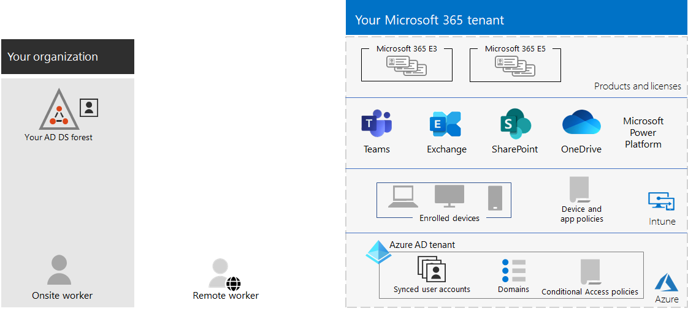

# Administración de inquilinos para Microsoft 365 para empresasTenant management for Microsoft 365 for enterprise

La creación de una ruta de acceso a la transformación digital de su organización con la informática en la nube requiere una base firme en la que los trabajadores puedan confiar en la productividad, la colaboración, el rendimiento, la privacidad, el cumplimiento y la seguridad.Creating a path to your organization's digital transformation with cloud computing requires a firm foundation upon which your workers can rely for productivity, collaboration, performance, privacy, compliance, and security.

La configuración correcta de los inquilinos de Microsoft 365 proporciona esa base, lo que deja a los trabajadores centrarse en realizar su trabajo y al departamento de TI para centrarse en soluciones integrales que proporcionan valor empresarial adicional.Correct configuration of your Microsoft 365 tenants provides that foundation, leaving your workers to focus on getting their work done and your IT department to focus on end-to-end solutions that provide additional business value. 

Esta solución le lleva a través de la configuración de esa base en estos pasos:This solution takes you through the configuration of that foundation in these steps:

1. Determinar los inquilinosDetermine your tenants
2. Optimizar las redesOptimize your networking
3. Sincronizar las identidades y aplicar inicios de sesión segurosSynchronize your identities and enforce secure sign-ins
4. Migre Windows dispositivos, Office clientes y datos locales Office servidores y datosMigrate your Windows devices, Office clients, and on-premises Office servers and data
5. Implementar la administración de dispositivos y aplicacionesDeploy device and app management

Pero primero, tomemos un momento para comprender lo que es un inquilino y cómo es un inquilino que proporciona una base firme.But first, let's take a moment to understand what a tenant is and what a tenant that provides a firm foundation looks like.

## Un Microsoft 365 definidoA Microsoft 365 tenant defined

Un inquilino Microsoft 365 es una instancia dedicada de los servicios de Microsoft 365 y los datos de la organización almacenados en una ubicación predeterminada específica, como Europa o Norteamérica.A Microsoft 365 tenant is a dedicated instance of the services of Microsoft 365 and your organization data stored within a specific default location, such as Europe or North America. Esta ubicación se especifica al crear el espacio empresarial para la organización.This location is specified when you create the tenant for your organization. Cada Microsoft 365 inquilino es distinto, único y independiente del resto de Microsoft 365 inquilinos.Each Microsoft 365 tenant is distinct, unique, and separate from all other Microsoft 365 tenants. Se crea un inquilino Microsoft 365 al comprar uno o varios productos de Microsoft, como Microsoft 365 E3 o E5, y un conjunto de licencias para cada uno.You create a Microsoft 365 tenant when you purchase one or more products from Microsoft, such as Microsoft 365 E3 or E5, and a set of licenses for each.

El Microsoft 365 también incluye un inquilino de Azure Active Directory (Azure AD), que es una instancia dedicada de Azure AD para cuentas de usuario, grupos y otros objetos.Your Microsoft 365 tenant also includes an Azure Active Directory (Azure AD) tenant, which is a dedicated instance of Azure AD for user accounts, groups, and other objects. Cada inquilino de Azure AD es distinto, único y independiente del resto de inquilinos de Azure AD.Each Azure AD tenant is distinct, unique, and separate from all other Azure AD tenants. Aunque su organización puede tener varios inquilinos de Azure AD que puede configurar con suscripciones de Azure, los inquilinos de Microsoft 365 solo pueden usar un único inquilino de Azure AD, el que se creó al crear el inquilino.While your organization can have multiple Azure AD tenants that you can set up with Azure subscriptions, Microsoft 365 tenants can only use a single Azure AD tenant, the one that was created when you created the tenant. 

A continuación le mostramos un ejemplo:Here is an example:

*La administración de* inquilinos es la planeación, la implementación y el funcionamiento continuo de los Microsoft 365 inquilinos.*Tenant management* is the planning, deployment, and ongoing operation of your Microsoft 365 tenants. 

## Atributos de un inquilino bien diseñado y operativoAttributes of a well-designed and operating tenant

Más allá del nombre y la ubicación correctos para el inquilino, hay elementos adicionales para planear, implementar y administrar para garantizar que las experiencias de usuario con aplicaciones de productividad en la nube como Microsoft Teams y Exchange Online sean eficaces, seguras y &mdash; &mdash; eficaces.Beyond the correct name and location for your tenant, there are additional elements to plan, deploy, and manage to ensure that your user experiences with cloud productivity apps&mdash;such as Microsoft Teams and Exchange Online&mdash;are effective, secure, and performant.

Estos son los elementos:Here are the elements:

- Tiene el conjunto correcto de productos (suscripciones) y licencias.You have the correct set of products (subscriptions) and licenses.
  - El conjunto de productos coincide con sus necesidades de negocio, DEI y seguridad.The set of products match your business, IT, and security needs.
  - Hay un número adecuado de licencias para los trabajadores y cambios anticipados en el personal.There is an adequate number of licenses for your workers and anticipated changes in staffing.
- Para redes:For networking:
  - Ha configurado los nombres de dominio DNS correctos.You have configured the correct DNS domain names.
  - Para las redes empresariales, ha optimizado el tráfico de red a la red de Microsoft para los trabajadores en el sitio.For enterprise networks, you have optimized network traffic to the Microsoft network for onsite workers.
  - Ha optimizado el tráfico de red para los trabajadores remotos que usan un cliente VPN.You have optimized network traffic for remote workers who are using a VPN client.
- Has sincronizado tus cuentas, grupos y otros objetos de Servicios de dominio de Active Directory (AD DS).You have synchronized your Active Directory Domain Services (AD DS) accounts, groups, and other objects.
  - Las cuentas de inquilino de Azure AD se asignan a Exchange Online buzones de correo con los dominios DNS correctos para las direcciones de correo electrónico.Your Azure AD tenant accounts are mapped to Exchange Online mailboxes with the correct DNS domains for email addresses.
  - A las cuentas de usuario se les han asignado las licencias correctas de los productos comprados correctos (como Microsoft 365 E3 o E5).Your user accounts have been assigned the correct licenses from the correct purchased products (such as Microsoft 365 E3 or E5).
- Ha configurado una administración segura de identidades y acceso.You have configured strong identity and access management.
  - Necesita el inicio de sesión seguro del usuario con autenticación sin contraseña o multifactor (MFA).You are requiring secure user sign-in with passwordless or multi-factor authentication (MFA).
  - Tiene directivas de acceso condicional que aplican los requisitos de inicio de sesión y las restricciones para niveles de seguridad más altos.You have Conditional Access policies that enforce sign-in requirements and restrictions for higher levels of security.
- Los servidores Office locales y sus datos se han migrado a aplicaciones en la nube o se usan en una configuración híbrida.On-premises Office servers and their data have been migrated to cloud apps or are being used in a hybrid configuration.
- Está realizando la administración de dispositivos con Intune o movilidad básica y seguridad integrada en Microsoft 365.You are doing device management with Intune or Basic Mobility and Security built into Microsoft 365.
  - Los dispositivos propiedad de la organización se inscriben y administran.Your organization-owned devices are enrolled and managed.
  - Las aplicaciones para dispositivos personales se administran.The apps for personal devices are managed.

Este es un ejemplo de un inquilino Microsoft 365 con todos estos elementos en su lugar.Here is an example of a Microsoft 365 tenant with all these elements in place.

En esta ilustración, el Microsoft 365 incluye:In this illustration, the Microsoft 365 tenant includes:

- Productos y licencias para Microsoft 365 E3 y E5.Products and licenses for Microsoft 365 E3 and E5.
- Microsoft 365 aplicaciones de productividad.Microsoft 365 productivity apps.
- Intune con dispositivos inscritos y directivas de dispositivos y aplicaciones.Intune with enrolled devices and device and application policies.
- Un inquilino de Azure AD que tiene una cuenta de usuario sincronizada (no se muestran grupos ni otros objetos de directorio), dominios y directivas de acceso condicional.An Azure AD tenant that has synchronized user account (groups and other directory objects are not shown), domains, and Conditional Access policies.

## Capacidades de inquilino para Microsoft 365 para empresasTenant capabilities for Microsoft 365 for enterprise

En las siguientes secciones y tabla se indican las funciones clave y las licencias para los pasos de esta solución.The following sections and table list the key capabilities and licensing for the steps in this solution.

### TenantTenant

| Funcionalidad o característicaCapability or feature | DescriptionDescription | LicenciasLicensing |
|:-------|:-----|:-------|
| Varios inquilinosMultiple tenants | Cada Microsoft 365 inquilino es distinto, único y independiente del resto de Microsoft 365 inquilinos.Each Microsoft 365 tenant is distinct, unique, and separate from all other Microsoft 365 tenants. Con varios inquilinos, existen restricciones y consideraciones adicionales al administrarlos y proporcionar servicios a los usuarios.With multiple tenants, there are restrictions and additional considerations when managing them and providing services to your users. | Microsoft 365 E3 o E5Microsoft 365 E3 or E5 | 
| Migración de buzones de inquilinos cruzadosCross-tenant mailbox migration | Los administradores de inquilinos pueden mover buzones entre inquilinos con dependencias de infraestructura mínimas en sus sistemas locales.Tenant administrators can move mailboxes between tenants with minimal infrastructure dependencies in their on-premises systems. Esto quita la necesidad de retirar y incorporar buzones.This removes the need to off-board and onboard mailboxes. | Microsoft 365 E3 o E5Microsoft 365 E3 or E5 | 
| Multi-GeoMulti-Geo | El inquilino puede almacenar datos en reposo en las otras ubicaciones geográficas del centro de datos que haya elegido para cumplir los requisitos de residencia de datos.Your tenant can store data at rest in the other datacenter geo locations that you've chosen to meet data residency requirements. | Microsoft 365 E3 o E5Microsoft 365 E3 or E5 | 
| Mover datos principales a una nueva ubicación geográfica del centro de datosMove core data to a new datacenter geo | A medida que Microsoft agrega nuevas geos del centro de datos para recursos de procesamiento y capacidad adicionales, puede solicitar un movimiento geográfico del centro de datos para la residencia de datos en geo para los datos principales del cliente.As Microsoft adds new datacenter geos for additional capacity and compute resources, you can request a datacenter geo move for in-geo data residency for your core customer data. | Microsoft 365 E3 o E5Microsoft 365 E3 or E5 | 
||||

### RedesNetworking

| Funcionalidad o característicaCapability or feature | DescriptionDescription | LicenciasLicensing |
|:-------|:-----|:-------|
| Network InsightsNetwork Insights | Métricas de rendimiento de red recopiladas Microsoft 365 inquilino para ayudarle a diseñar perímetros de red para sus ubicaciones de oficina.Network performance metrics collected from your Microsoft 365 tenant to help you design network perimeters for your office locations. | Microsoft 365 E3 o E5Microsoft 365 E3 or E5 | 
| Automatizar actualizaciones de puntos de conexiónAutomate endpoint updates | Automatice la configuración y las actualizaciones continuas para los Microsoft 365 en los archivos PAC de cliente y los dispositivos y servicios de red.Automate the configuration and ongoing updates for Microsoft 365 endpoints in your client PAC files and network devices and services. | Microsoft 365 E3 o E5Microsoft 365 E3 or E5 | 
||||

### IdentidadIdentity

| Funcionalidad o característicaCapability or feature | DescriptionDescription | LicenciasLicensing |
|:-------|:-----|:-------|
| Sincronizar los Servicios de dominio de Active Directory locales (AD DS) con el inquilino de Azure ADSynchronize on-premises Active Directory Domain Services (AD DS) with your Azure AD tenant    | Aproveche el proveedor de identidades local para cuentas de usuario, grupos y otros objetos.Leverage your on-premises identity provider for user accounts, groups, and other objects. | Microsoft 365 E3 o E5Microsoft 365 E3 or E5 |
| MFA aplicada en los valores predeterminados de seguridadMFA enforced with security defaults   | Protege frente a ataques a identidades y dispositivos, pues obliga a usar una segunda forma de autenticación para iniciar sesión. Los valores predeterminados de seguridad requieren MFA para todas las cuentas de usuario.Protect against compromised identities and devices by requiring a second form of authentication for sign-ins. Security defaults requires MFA for all user accounts.   | Microsoft 365 E3 o E5Microsoft 365 E3 or E5 |
| MFA aplicada con acceso condicionalMFA enforced with Conditional Access| Requerir MFA en función de los atributos del inicio de sesión con directivas de acceso condicional.Require MFA based on the attributes of the sign-in with Conditional Access policies.    | Microsoft 365 E3 o E5Microsoft 365 E3 or E5 | 
| MFA aplicada con Acceso condicional basado en los riesgosMFA enforced with risk-based Conditional Access   | Requerir la MFA según el riesgo de inicio de sesión del usuario con Microsoft Defender for Identity.Require MFA based on the risk of the user sign-in with Microsoft Defender for Identity. | Microsoft 365 E5 o E3 con las licencias de Azure AD Premium P2Microsoft 365 E5 or E3 with Azure AD Premium P2 licenses | 
| Autoservicio de restablecimiento de contraseña (SSPR)Self-Service Password Reset (SSPR)    | Permitir que los usuarios restablezcan o desbloqueen su contraseña o cuenta ellos mismos.Allow your users to reset or unlock their passwords or accounts.  | Microsoft 365 E3 o E5Microsoft 365 E3 or E5 |
||||

### MigraciónMigration

| Funcionalidad o característicaCapability or feature | DescriptionDescription | LicenciasLicensing |
|:-------|:-----|:-------|
| Migrar a Windows 10Migrate to Windows 10 | Migre los dispositivos que Windows 7 o Windows 8.1 a Windows 10 Enterprise.Migrate your devices that run Windows 7 or Windows 8.1 to Windows 10 Enterprise. | Windows 10 Enterprise licencias incluidas con Microsoft 365 E3 o E5Windows 10 Enterprise licenses included with Microsoft 365 E3 or E5 | 
| Migrar a Aplicaciones Microsoft 365 para empresasMigrate to Microsoft 365 Apps for enterprise | Migre Office cliente como Word y PowerPoint a las versiones instaladas desde la nube que se actualizan con nuevas características.Migrate your Office client apps such as Word and PowerPoint to the versions installed from the cloud that are updated with new features. | Microsoft 365 E3 o E5Microsoft 365 E3 or E5 | 
| Migrar servidores y datos locales a Microsoft 365Migrate on-premises servers and data to Microsoft 365 | Migre Exchange buzones de correo, SharePoint web y Skype Empresarial Online a Microsoft 365 servicios en la nube.Migrate your Exchange mailboxes, SharePoint sites, and Skype for Business Online to Microsoft 365 cloud services. | Microsoft 365 E3 o E5Microsoft 365 E3 or E5 | 
||||

### Datos de administración de dispositivos y aplicacionesDevice and app management

| Funcionalidad o característicaCapability or feature | DescriptionDescription | LicenciasLicensing |
|:-------|:-----|:-------|
| Microsoft IntuneMicrosoft Intune | Un servicio basado en la nube que proporciona administración de dispositivos móviles (MDM) y administración de aplicaciones móviles (MAM) para controlar cómo se usan la aplicación y los dispositivos de la organización, incluidos teléfonos móviles, tabletas y portátiles.A cloud-based service that provides mobile device management (MDM) and mobile application management (MAM) to control how your organization’s application and the devices are used, including mobile phones, tablets, and laptops. | Microsoft 365 E3 o E5Microsoft 365 E3 or E5 | 
| Movilidad y seguridad básicasBasic Mobility and Security | Protege y administra los dispositivos móviles de tus usuarios como iPhones, iPads, Androids y Windows teléfonos con este servicio integrado.Secure and manage your users' mobile devices like iPhones, iPads, Androids, and Windows phones with this built-in service.  | Microsoft 365 E3 o E5Microsoft 365 E3 or E5 | 
||||

## Pasos siguientesNext steps

Siga estos pasos para configurar y administrar sus Microsoft 365 inquilinos.Use these steps to set up and manage your Microsoft 365 tenants.

1. [Determinar los inquilinosDetermine your tenants](tenant-management-tenants.md)
2. [Optimizar las redesOptimize your networking](tenant-management-networking.md)
3. [Sincronizar las identidades y aplicar inicios de sesión segurosSynchronize your identities and enforce secure sign-ins](tenant-management-identity.md)
4. [Migrar los servidores y datos Office localMigrate your on-premises Office servers and data](tenant-management-migration.md)
5. [Implementar la administración de dispositivos y aplicacionesDeploy device and app management](tenant-management-device-management.md)

Cada paso describe las opciones de implementación, resume los resultados y las tareas de mantenimiento en curso.Each step describes deployment options, summarizes the results, and ongoing maintenance tasks.

Para comprender cómo una organización multinacionales ficticia pero representativa implementó los elementos de su Microsoft 365 inquilino, vea el [caso práctico de Contoso](../enterprise/contoso-case-study.md).To understand how a fictional but representative multi-national organization deployed the elements of their Microsoft 365 tenant, see the [Contoso case study](../enterprise/contoso-case-study.md).
