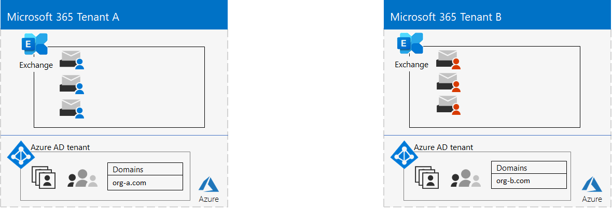
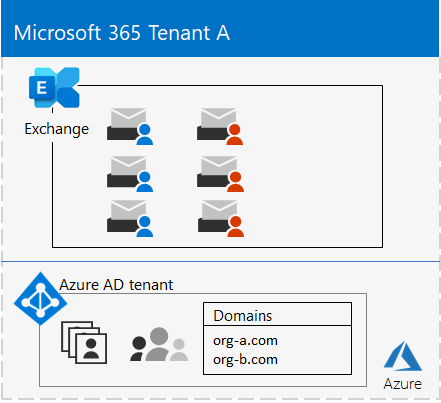
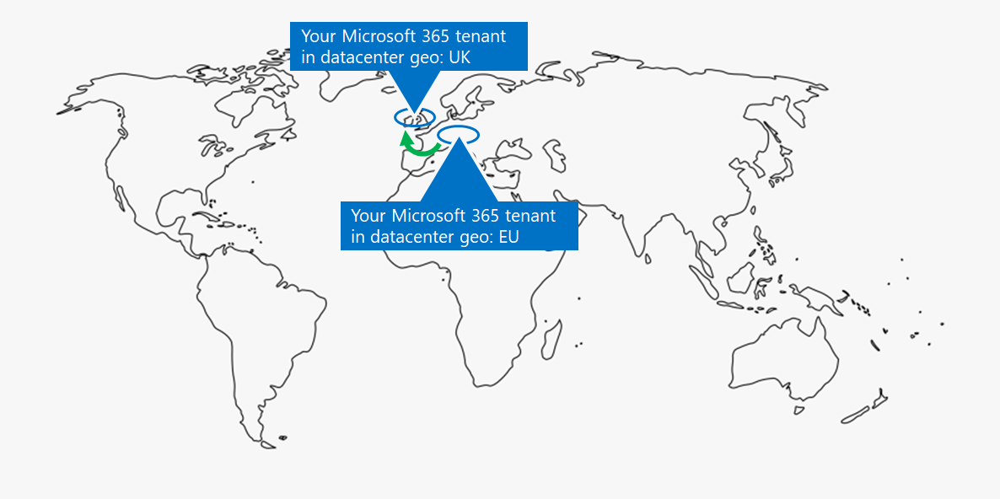
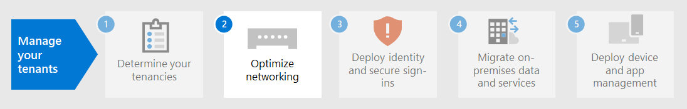

# Paso 1.Step 1. Sus inquilinos de Microsoft 365 para empresasYour Microsoft 365 for enterprise tenants

Una de las primeras decisiones del espacio empresarial es cuántas deben tener.One of your first tenant decisions is how many to have. Cada inquilino de Microsoft 365 es distinto, único e independiente de todos los demás inquilinos de Microsoft 365.Each Microsoft 365 tenant is distinct, unique, and separate from all other Microsoft 365 tenants. Su inquilino de Azure AD correspondiente también es distinto, único e independiente de todos los demás inquilinos de Microsoft 365.It’s corresponding Azure AD tenant is also distinct, unique, and separate from all other Microsoft 365 tenants.

## Inquilino únicoSingle tenant
Tener un único inquilino simplifica muchos aspectos del uso de Microsoft 365 por parte de su organización.Having a single tenant simplifies many aspects of your organization’s use of Microsoft 365. Un único inquilino significa un único inquilino de Azure AD con un único conjunto de cuentas, grupos y directivas.A single tenant means a single Azure AD tenant with a single set of accounts, groups, and policies. Los permisos y el uso compartido de recursos en toda la organización se pueden realizar a través de este proveedor de identidades central.Permissions and sharing of resources across your organization can be done through this central identity provider.

Un único espacio empresarial proporciona la experiencia de productividad y colaboración más completa y simplificada de características para los usuarios.A single tenant provides the most feature-rich and simplified collaboration and productivity experience for your users.

Este es un ejemplo que muestra la ubicación predeterminada y el inquilino de Azure AD de un inquilino de Microsoft 365.Here is an example showing the default location and Azure AD tenant of a Microsoft 365 tenant.

## Varios inquilinosMultiple tenants

Hay muchas razones por las que su organización podría tener varios inquilinos:There are many reasons why your organization could have multiple tenants:

- Aislamiento administrativoAdministrative isolation
- IT descentralizadaDecentralized IT
- Decisiones históricasHistorical decisions
- Fusiones, adquisiciones o desinsticionesMergers, acquisitions, or divestitures
- Separación clara de la personalción de marca para organizaciones conglomeradosClear separation of branding for conglomerate organizations
- Inquilinos de espacio aislado, pruebas o preproducciónPre-production, test, or sandbox tenants

Este es un ejemplo de una organización que tiene dos inquilinos (Inquilino A y Inquilino B) en la misma ubicación geográfica predeterminada del centro de datos.Here is an example of an organization that has two tenants (Tenant A and Tenant B) in the same default datacenter geo. Cada inquilino como un inquilino de Azure AD independiente.Each tenant as a separate Azure AD tenant.

Cuando tiene varios inquilinos, existen restricciones y consideraciones adicionales al administrarlos y proporcionar servicios a los usuarios.When you have multiple tenants, there are restrictions and additional considerations when managing them and providing services to your users.

### Colaboración entre inquilinosInter-tenant collaboration

Si desea que los usuarios colaboren de forma más eficaz en diferentes inquilinos de Microsoft 365 de forma segura, las opciones de colaboración entre inquilinos incluyen el uso de una ubicación central para archivos y conversaciones, el uso compartido de calendarios, el uso de mensajería instantánea, llamadas de audio y vídeo para la comunicación y la protección del acceso a recursos y aplicaciones.If you want your users to collaborate more effectively across different Microsoft 365 tenants in a secure manner, inter-tenant collaboration options include using a central location for files and conversations, sharing calendars, using IM, audio/video calls for communication, and securing access to resources and applications.

Para obtener más información, consulte [Colaboración entre inquilinos de Microsoft 365.](../enterprise/microsoft-365-inter-tenant-collaboration.md)For more information, see [Microsoft 365 inter-tenant collaboration](../enterprise/microsoft-365-inter-tenant-collaboration.md).

### Migración de buzones entre inquilinos (versión preliminar)Cross-tenant mailbox migration (preview)

Antes de la migración de buzones entre inquilinos (en versión preliminar), al mover buzones de Exchange Online entre inquilinos, debe quitar completamente un buzón de usuario de su inquilino actual (el inquilino de origen) a local y, a continuación, incorporarlos a un nuevo inquilino (el inquilino de destino).Prior to cross-tenant mailbox migration (in preview), when moving Exchange Online mailboxes between tenants, you have to completely offboard a user mailbox from their current tenant (the source tenant) to on-premises and then onboard them to a new tenant (the target tenant). Con la nueva característica de migración de buzones entre inquilinos, los administradores de inquilinos de los inquilinos de origen y de destino pueden mover buzones entre los inquilinos con dependencias de infraestructura mínimas en sus sistemas locales.With the new cross-tenant mailbox migration feature, tenant administrators in both source and target tenants can move mailboxes between the tenants with minimal infrastructure dependencies in their on-premises systems. Esto elimina la necesidad de incorporar buzones de correo.This removes the need to off-board and onboard mailboxes.

Estos son dos inquilinos de ejemplo y sus buzones antes de la migración de buzones entre inquilinos.Here are two example tenants and their mailboxes before cross-tenant mailbox migration.

En esta ilustración, dos inquilinos independientes tienen sus propios dominios y un conjunto de buzones de Exchange.In this illustration, two separate tenants have their own domains and set of Exchange mailboxes.

Este es el inquilino de destino (inquilino A) después de la migración de buzones entre inquilinos.Here is the target tenant (Tenant A) after cross-tenant mailbox migration.

En esta ilustración, un único inquilino tiene dominios y ambos conjuntos de buzones de Exchange.In this illustration, a single tenant has both domains and both sets of Exchange mailboxes.

Para obtener más información, consulte [Migración de buzones entre inquilinos.](../enterprise/cross-tenant-mailbox-migration.md)For more information, see [Cross-tenant mailbox migration](../enterprise/cross-tenant-mailbox-migration.md).

### Migraciones de espacio empresarial a espacio empresarialTenant-to-tenant migrations

Existen varios enfoques arquitectónicos para fusiones, adquisiciones, desintecciones y otros escenarios que pueden llevar a migrar un inquilino de Microsoft 365 existente a un nuevo inquilino.There are several architectural approaches for mergers, acquisitions, divestitures, and other scenarios that might lead you to migrate an existing Microsoft 365 tenant to a new tenant. 

Para obtener instrucciones detalladas, consulte Migraciones de inquilino a inquilino [de Microsoft 365.](../enterprise/microsoft-365-tenant-to-tenant-migrations.md)For detailed guidance, see [Microsoft 365 tenant-to-tenant migrations](../enterprise/microsoft-365-tenant-to-tenant-migrations.md).

## Multi-Geo para un inquilinoMulti-Geo for a tenant

Con Microsoft 365 Multi-Geo, puede aprovisionar y almacenar datos en reposo en las otras ubicaciones geográficas del centro de datos que haya elegido para cumplir los requisitos de residencia de datos y, al mismo tiempo, desbloquear la implementación global de experiencias de productividad modernas para sus trabajadores.With Microsoft 365 Multi-Geo, you can provision and store data at rest in the other datacenter geo locations that you've chosen to meet data residency requirements, and at the same time unlock your global rollout of modern productivity experiences to your workers.

En un entorno Multi-Geo, su espacio empresarial de Microsoft 365 consta de una ubicación central o predeterminada donde se creó originalmente su suscripción a Microsoft 365 y una o más ubicaciones satélite.In a Multi-Geo environment, your Microsoft 365 tenant consists of a default or central location where your Microsoft 365 subscription was originally created and one or more satellite locations. En un inquilino multigemico, la información sobre las ubicaciones geográficas, los grupos y la información de usuario se masterizó en un inquilino global de Azure AD.In a multi-geo tenant, the information about geo locations, groups, and user information is mastered in a global Azure AD tenant. Dado que la información del espacio empresarial se masterizó de forma centralizada y se sincroniza en cada ubicación geográfica, las experiencias de colaboración en las que participan todos los usuarios de su empresa se comparten entre las ubicaciones.Because your tenant information is mastered centrally and synchronized into each geo location, collaboration experiences involving anyone from your company are shared across the locations.

Este es un ejemplo de una organización que tiene su ubicación predeterminada en Europa y una ubicación satélite en Norteamérica.Here is an example of an organization that has its default location in Europe and a satellite location in North America. Ambas ubicaciones comparten el mismo inquilino global de Azure AD para el único inquilino de Microsoft 365.Both locations share the same global Azure AD tenant for the single Microsoft 365 tenant.

Para más información, vea [Microsoft 365 Multi-Geo](../enterprise/microsoft-365-multi-geo.md).For more information, see [Microsoft 365 Multi-Geo](../enterprise/microsoft-365-multi-geo.md).

## Mover datos principales a una nueva ubicación geográfica de centro de datosMoving core data to a new datacenter geo

Microsoft continúa abierto nuevas ubicaciones geográficas de centro de datos para los servicios de Microsoft 365.Microsoft continues to open new datacenter geos for Microsoft 365 services. Estas nuevas ubicaciones geográficas de centro de datos agregan capacidad y recursos de cálculo para admitir nuestra demanda continuada de clientes y el crecimiento del uso.These new datacenter geos add capacity and compute resources to support our ongoing customer demand and usage growth. Además, las nuevas ubicaciones geográficas del centro de datos ofrecen residencia de datos en la ubicación geográfica para los datos principales de los clientes.Additionally, the new datacenter geos offer in-geo data residency for core customer data.

Aunque la apertura de una nueva ubicación geográfica de centro de datos no afecta a usted y a los datos principales almacenados en una ubicación geográfica de centro de datos ya existente, Microsoft le permite solicitar una migración anticipada de los datos principales del cliente de su organización en reposo a una nueva ubicación geográfica del centro de datos.Although opening a new datacenter geo does not impact you and your core data stored in an already existing datacenter geo, Microsoft allows you to request an early migration of your organization's core customer data at rest to a new datacenter geo.

Este es un ejemplo en el que un inquilino de Microsoft 365 se movió de la ubicación geográfica del centro de datos de la Unión Europea (UE) a la ubicada en el Reino Unido.Here is an example in which a Microsoft 365 tenant was moved from the European Union (EU) datacenter geo to the one located in the United Kingdom (UK).

Para obtener más información, vea Mover los datos principales a las nuevas ubicaciones geográficas del centro de datos [de Microsoft 365.](../enterprise/moving-data-to-new-datacenter-geos.md)For more information, see [Moving core data to new Microsoft 365 datacenter geos](../enterprise/moving-data-to-new-datacenter-geos.md).

## Productos y licencias para un inquilinoProducts and licenses for a tenant

El espacio empresarial de Microsoft 365 se crea al comprar el primer producto, como Microsoft 365 E3.Your Microsoft 365 tenant gets created when you purchase your first product, such as Microsoft 365 E3. Junto con el producto se encuentran las licencias, a las que se les cobra una tarifa mensual o anual.Along with the product are licenses, which are charged a monthly or annual fee. A continuación, un administrador asigna una licencia disponible de uno de los productos a una cuenta de usuario, ya sea directamente o a través de la pertenencia a grupos.An administrator then assigns an available license from one of your products to a user account, either directly or through group membership. Según las necesidades empresariales de su organización, es posible que tenga un conjunto de productos, cada uno con su propio grupo de licencias.Depending on your organization's business needs, you might have a set of products, each with their own pool of licenses. 

La determinación del conjunto de productos y el número de licencias de cada uno de ellos requiere cierta planeación para:Determining the set of products and the number of licenses for each requires some planning to:

- Asegúrese de que tiene suficientes licencias para las cuentas de usuario que necesitan características avanzadas.Ensure you have enough licenses for the user accounts that need advanced features.
- Impedir que se quedas sin licencias o que tenga demasiadas licencias sinsignar, en función de los cambios en el personal de la organización.Prevent you from running out of licenses or having too many unassigned licenses, based on changes in staffing at your organization.

## Resultado del paso 1Results of Step 1

Para los inquilinos de Microsoft 365 para empresas, ha determinado:For your Microsoft 365 for enterprise tenants, you have determined:

- Cuántos inquilinos tiene o necesita.How many tenants you have or need.
- Para cada inquilino, qué productos y licencias se deben comprar.For each tenant, which products and licenses must be purchased.
- Si un inquilino debe ser Multi-Geo para cumplir con los requisitos de residencia de datos.Whether a tenant needs to be Multi-Geo to comply with data residency requirements.
- Si necesita configurar la colaboración entre inquilinos.Whether you need to set up inter-tenant collaboration.
- Si necesita migrar un inquilino a otro.Whether you need to migrate one tenant to another.
- Si necesita mover los datos principales de una ubicación geográfica de centro de datos a uno nuevo.Whether you need to move core data from one datacenter geo to new one.

Este es un ejemplo de un nuevo inquilino.Here is an example of a new tenant.

En esta ilustración, el inquilino tiene:In this illustration, the tenant has:

- Ubicación predeterminada correspondiente a una ubicación geográfica de centro de datos de Microsoft 365.A default location corresponding to a Microsoft 365 datacenter geo.
- Un conjunto de productos y licencias.A set of products and licenses.
- El conjunto de aplicaciones de productividad en la nube, algunas de las cuales son específicas de los productos.The set of cloud productivity apps, some of which are specific to products.
- Un inquilino de Azure AD que contiene cuentas de administrador global y un nombre de dominio DNS inicial.An Azure AD tenant that contains global administrator accounts and an initial DNS domain name.

A medida que avancemos en los pasos adicionales de esta solución, crearemos esta figura.As we move through the additional steps of this solution, we will build out this figure.

## Mantenimiento continuo para inquilinosOngoing maintenance for tenants

De forma continua, es posible que deba:On an ongoing basis, you might need to:

- Agregue un nuevo inquilino.Add a new tenant.
- Agregar nuevos productos a un inquilino con un número inicial de licencias.Add new products to a tenant with an initial number of licenses.
- Cambiar el conjunto de licencias de un producto en un espacio empresarial para ajustarse a los requisitos de personal cambiantes.Change the set of licenses for a product in a tenant to adjust for changing staff requirements.
- Mueva los datos principales de un espacio empresarial a una nueva ubicación geográfica del centro de datos.Move your core data from a tenant to a new datacenter geo location.
- Agregar Multi-Geo para requisitos de residencia de datos.Add Multi-Geo for data residency requirements.
- Configurar la colaboración entre inquilinos.Set up inter-tenant collaboration.

## Paso siguienteNext step

Continúe con [las redes](tenant-management-networking.md) para proporcionar redes óptimas de sus trabajadores a los servicios en la nube de Microsoft 365.Continue with [networking](tenant-management-networking.md) to provide optimal networking from your workers to Microsoft 365 cloud services.
