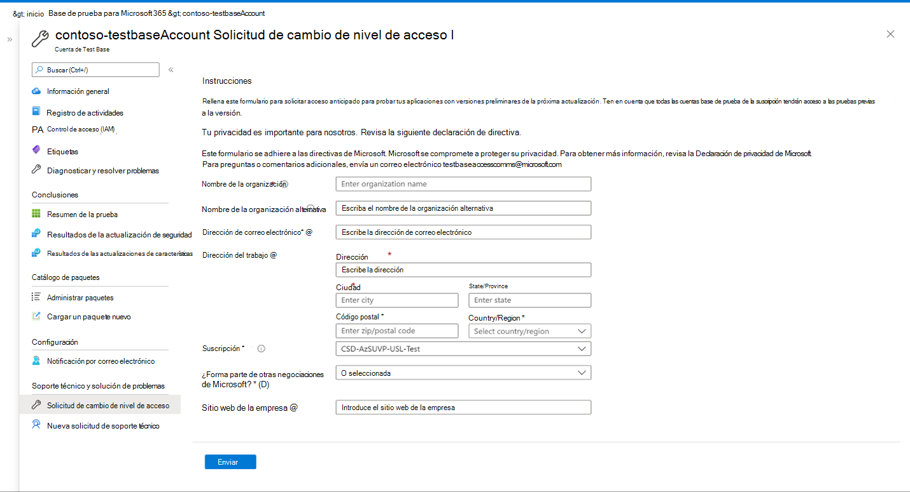

# Solicitud para cambiar el nivel de acceso 

Ahora estamos haciendo que el acceso al contenido de actualización Windows versión preliminar esté más disponible. Una vez aprobada la solicitud de acceso a las actualizaciones de versión preliminar, los paquetes cargados se programarán automáticamente para que se prueben con la versión preliminar Windows actualizaciones de las versiones del sistema operativo seleccionadas durante la incorporación. 

Para solicitar acceso, seleccione la opción "Solicitud de cambio de nivel de acceso" en la barra de navegación izquierda, rellene todos los detalles de su organización y envíe la solicitud. Recibirá una notificación en la dirección de correo electrónico registrada una vez aprobada la solicitud. Una vez aprobada, cuando haya disponible una nueva compilación de versión preliminar, los paquetes se probarán automáticamente con la nueva actualización de las versiones seleccionadas. 

> [!div class="mx-imgBorder"]
> [ de nivel de acceso ](Media/accesslevelchange.png#lightbox)
