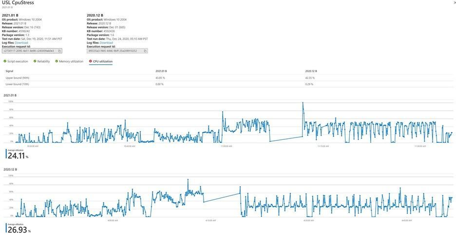

# Análisis de regresión inteligente de CPU

El uso de la CPU puede indicar si una aplicación se ve afectada por una actualización del sistema operativo. 

Test Base for Microsoft 365 proporciona a los desarrolladores de software información sobre las regresión de rendimiento de la CPU que se producen cuando su aplicación se ejecuta en distintas versiones de una próxima actualización del sistema operativo Windows (SO). 

Estas regresión de CPU permiten a los desarrolladores detectar y resolver problemas de aplicaciones (y posibles errores) antes de implementar la actualización del sistema operativo de forma general, lo que evita una mala experiencia para el usuario final.

### Cómo funciona el análisis de regresión de CPU ###

Como usuario de Test Base, puede cargar los archivos binarios de la aplicación (en un solo archivo .zip), junto con scripts de prueba asociados y seleccionar la versión del sistema operativo de Windows con la que desea probar la aplicación en el portal base de pruebas de Azure. 

A continuación, el servicio Base de prueba ejecuta los scripts de prueba y realiza el análisis **de regresión de cpu.** 

El servicio comprueba si el uso de la CPU para la aplicación en la versión anterior a la versión de la actualización del sistema operativo de destino está en línea con el uso de la CPU para la versión publicada del sistema operativo. 

El uso de LA CPU no es una comparación 100 % como para similares, ya que los procesos que se ejecutan en las dos versiones del sistema operativo pueden o no ser una coincidencia exacta debido a versiones del sistema operativo diferentes; sin embargo, el análisis realizado por Test Base puede mostrar si el uso de la CPU para la aplicación se ve afectado por una próxima actualización del sistema operativo y específicamente qué procesos han retrocedido de las ejecuciones de pruebas anteriores.

En la instantánea siguiente, hay dos versiones del sistema operativo con las que se comparan los usos de CPU para la misma aplicación. 
-   La pestaña Uso de cpu muestra los límites superior e inferior de uso de ambas versiones en percentiles 90 y 10 respectivamente. 
-   Los gráficos muestran la serie temporal de uso de CPU junto con el uso promedio. 

Los clientes ahora pueden usar la funcionalidad para determinar si el uso de la CPU de su aplicación se ha visto afectado por las actualizaciones del sistema operativo y, específicamente, qué procesos han retrocedido respecto a su ejecución anterior.

### Identificación de procesos relevante ###

Aquí se explica cómo identificar procesos regresivos en la aplicación. 

El análisis de la regresión del rendimiento requiere realizar un seguimiento de diferentes tipos de contadores de rendimiento para cada proceso que se ejecuta en una máquina virtual durante la ejecución de prueba. 

Este análisis captura una gran cantidad de variables para una gran cantidad de procesos para una aplicación determinada. No todos los procesos están asociados a una ejecución o aplicación. Para evitar este desafío, se aplica un algoritmo de clasificación de información mutua que usa la probabilidad y la teoría de la información para averiguar qué procesos son más relevantes para una aplicación determinada. 

Una aplicación puede considerarse un tipo de variable aleatoria discreta mientras que un proceso se considera otro tipo de variable aleatoria discreta. La asociación de las dos variables aleatorias se mide usando probabilidades condicionales para la relevancia. 

A continuación, los procesos se muestran en el orden de su relevancia para cada aplicación. También puede elegir entre los favoritos un subconjunto de procesos que se pueden supervisar, de forma predeterminada, junto con los procesos relevantes para el análisis de regresión de la CPU. Una vez detectada una regresión, puede descargar el kit de herramientas Windows analizador de rendimiento y analizar los motivos de las regresión del rendimiento de la CPU. 

El analizador Windows rendimiento toma el registro de seguimiento de eventos (ETL) como entradas y estos archivos .etl están disponibles en los archivos de registro que se pueden descargar para las ejecuciones de prueba en el portal. Si desea obtener más información sobre cómo depurar el rendimiento de la CPU, consulte la Windows analizador de rendimiento.

